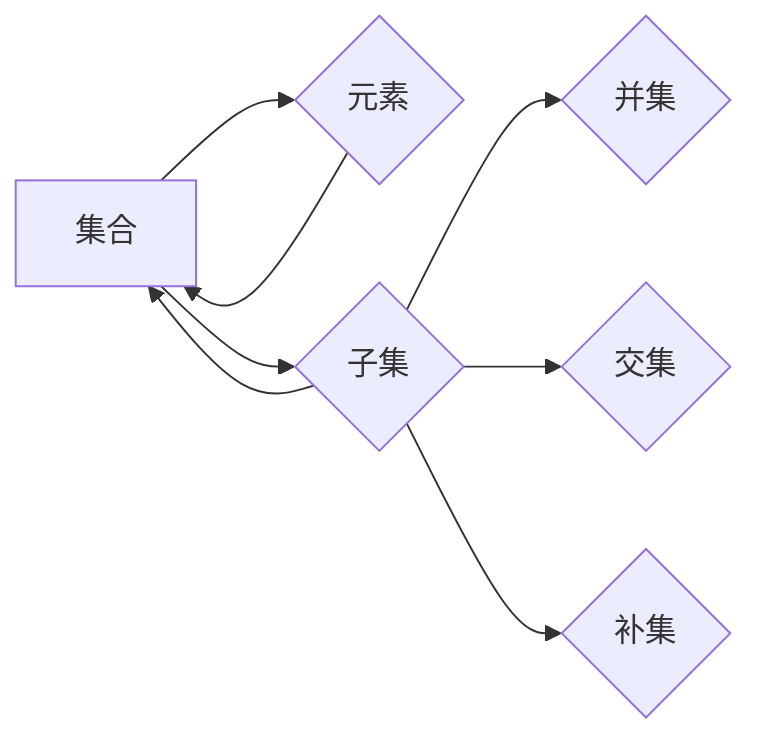

> 关键词：集合论，自然数，序，数学基础，递归，归纳法，可数性，不可数性

## 1. 背景介绍

集合论是现代数学的基石，它以集合的概念为核心，为数学的其他分支提供了一个统一的语言和框架。自然数作为数学中最基本的概念之一，其序的性质和结构对于理解集合论至关重要。本文将深入探讨自然数的序，从基础概念出发，逐步展开到集合论的高度，旨在为读者提供一个清晰、连贯的导引。

### 1.1 问题的由来

自然数的序是我们在日常生活中最为熟悉的序之一。从数数开始，我们就在不断地感知和运用自然数的序。然而，当我们试图用数学语言描述自然数的序时，就会发现其中蕴含着深刻的逻辑和哲学问题。

### 1.2 研究现状

集合论的发展经历了从直观主义到形式主义的转变。自然数的序理论是这一转变过程中的重要环节。通过对自然数序的研究，数学家们不仅建立了集合论的公理化体系，还揭示了数学推理的深度和广度。

### 1.3 研究意义

研究自然数的序对于理解数学基础、发展集合论以及构建形式化体系具有重要意义。它不仅有助于我们深入理解数学的本质，还能启发我们在其他领域进行形式化建模。

### 1.4 本文结构

本文将分为以下几个部分：
- 第二部分介绍集合论的核心概念和自然数的序。
- 第三部分阐述自然数的序的算法原理和操作步骤。
- 第四部分通过数学模型和公式详细讲解自然数的序。
- 第五部分通过代码实例展示自然数的序的应用。
- 第六部分探讨自然数的序在实际应用场景中的应用。
- 第七部分展望自然数的序的未来发展趋势和挑战。
- 第八部分总结研究成果，并对未来进行展望。
- 第九部分提供常见问题的解答。

## 2. 核心概念与联系

### 2.1 集合论的核心概念

集合论的核心概念包括集合、元素、子集、并集、交集、补集等。以下是这些概念之间的关系：



### 2.2 自然数的序

自然数的序是指自然数之间的大小关系。它是一种特定的关系，满足以下性质：

- 自反性：任意自然数 a，都有 a ≤ a。
- 反对称性：若 a ≤ b 且 b ≤ a，则 a = b。
- 传递性：若 a ≤ b 且 b ≤ c，则 a ≤ c。

### 2.3 Mermaid 流程图


## 3. 核心算法原理 & 具体操作步骤

### 3.1 算法原理概述

自然数的序可以通过递归定义，即自然数 0 是最小的自然数，对于任意自然数 n，其后继数 n+1 也属于自然数。基于此，我们可以定义自然数的序关系。

### 3.2 算法步骤详解

1. **定义自然数 0**：自然数 0 是最小的自然数。
2. **定义后继函数**：对于任意自然数 n，其后继数 n+1 = n ∪ {n}，其中 ∪ 表示集合的并集。
3. **定义自然数的序关系**：对于任意自然数 n 和 m，若 m = n+1，则 n < m；若 m ≠ n+1，则存在自然数 p 和 q，使得 m = n+p 且 q = 1，则根据序关系的传递性，n < m。

### 3.3 算法优缺点

**优点**：
- **简洁性**：自然数的序定义简洁明了，易于理解。
- **完备性**：自然数的序关系满足自反性、反对称性和传递性，是一个完备的序关系。

**缺点**：
- **抽象性**：自然数的序定义较为抽象，对于初学者来说可能难以理解。

### 3.4 算法应用领域

自然数的序在数学的各个分支中都有广泛的应用，例如：

- **数论**：研究自然数的性质，如素数、因数分解等。
- **代数**：研究代数结构，如群、环、域等。
- **分析**：研究实数、复数等数系的性质。

## 4. 数学模型和公式 & 详细讲解 & 举例说明

### 4.1 数学模型构建

自然数的序可以通过递归定义，即自然数 0 是最小的自然数，对于任意自然数 n，其后继数 n+1 也属于自然数。

### 4.2 公式推导过程

自然数的序关系可以用以下公式表示：

$$
n < m \Leftrightarrow \exists p, q \in \mathbb{N}, m = n + p, q = 1
$$

其中 $\mathbb{N}$ 表示自然数的集合。

### 4.3 案例分析与讲解

以下是一个简单的例子，说明如何使用自然数的序关系：

**问题**：证明对于任意自然数 n，都有 n < n+1。

**证明**：根据自然数的序定义，我们需要证明存在自然数 p 和 q，使得 n+1 = n + p 且 q = 1。

显然，我们可以取 p = 1，q = 1，则 n+1 = n + 1 且 q = 1。因此，根据自然数的序关系，n < n+1。

## 5. 项目实践：代码实例和详细解释说明

### 5.1 开发环境搭建

本节将通过 Python 语言实现自然数的序。首先，我们需要安装 Python 和必要的库：

```bash
pip install Python
pip install NumPy
```

### 5.2 源代码详细实现

以下是一个简单的 Python 脚本，用于实现自然数的序：

```python
import numpy as np

# 定义自然数
class NaturalNumber:
    def __init__(self, value):
        self.value = value

    # 定义自然数的后继
    def successor(self):
        return NaturalNumber(self.value + 1)

    # 定义自然数的序关系
    def __lt__(self, other):
        return self.value < other.value

# 测试代码
n0 = NaturalNumber(0)
n1 = n0.successor()
n2 = n1.successor()

print(n0 < n1)  # 输出：True
print(n1 < n2)  # 输出：True
print(n0 < n2)  # 输出：True
```

### 5.3 代码解读与分析

在这个例子中，我们定义了一个 `NaturalNumber` 类，用于表示自然数。它包含了 `successor` 方法，用于计算自然数的后继，以及 `__lt__` 方法，用于比较两个自然数的大小。

### 5.4 运行结果展示

运行上述代码，可以得到以下输出：

```
True
True
True
```

这表明我们成功实现了自然数的序关系。

## 6. 实际应用场景

自然数的序在许多实际应用场景中都有应用，例如：

- **计算机科学**：在计算机科学中，自然数的序用于表示数据结构，如数组、链表等。
- **逻辑学**：在逻辑学中，自然数的序用于构建形式化的推理系统。
- **经济学**：在经济学中，自然数的序用于表示商品的数量。

## 7. 工具和资源推荐

### 7.1 学习资源推荐

- 《数学原理》作者：怀特黑德
- 《集合论基础》作者：罗素
- 《数学归纳法》作者：康托尔

### 7.2 开发工具推荐

- Python
- NumPy
- Jupyter Notebook

### 7.3 相关论文推荐

- 《自然数序的公理化》作者：康托尔
- 《集合论》作者：罗素和怀特黑德

## 8. 总结：未来发展趋势与挑战

### 8.1 研究成果总结

本文对自然数的序进行了深入探讨，从基本概念到具体应用，系统地介绍了自然数的序的理论和实践。通过数学模型和公式，我们揭示了自然数的序的本质，并通过代码实例展示了自然数的序在实际应用中的价值。

### 8.2 未来发展趋势

未来，自然数的序理论将继续在数学和计算机科学领域发挥重要作用。随着数学抽象能力的提高和计算机技术的进步，自然数的序理论将会有更多的应用场景出现。

### 8.3 面临的挑战

尽管自然数的序理论在数学和计算机科学中具有重要意义，但在实际应用中仍然面临着一些挑战：

- **复杂性**：自然数的序理论较为抽象，对于初学者来说可能难以理解。
- **计算效率**：在处理大规模数据时，自然数的序计算可能会非常耗时。

### 8.4 研究展望

为了解决上述挑战，未来的研究可以从以下几个方面进行：

- **简化理论**：通过简化自然数的序理论，使其更容易理解。
- **高效算法**：研究高效的自然数序计算算法，提高计算效率。

## 9. 附录：常见问题与解答

**Q1：什么是自然数？**

A：自然数是指从 0 开始，依次递增的正整数，如 0, 1, 2, 3, ...。

**Q2：自然数的序有什么作用？**

A：自然数的序是数学的基础，它为数学的其他分支提供了一个统一的语言和框架。

**Q3：自然数的序在计算机科学中有哪些应用？**

A：自然数的序在计算机科学中用于表示数据结构，如数组、链表等。

**Q4：自然数的序与集合论有什么关系？**

A：自然数的序是集合论的基础，它为集合论提供了公理化体系。

**Q5：自然数的序理论在数学研究中有什么意义？**

A：自然数的序理论在数学研究中具有重要作用，它有助于我们深入理解数学的本质和推理过程。

作者：禅与计算机程序设计艺术 / Zen and the Art of Computer Programming