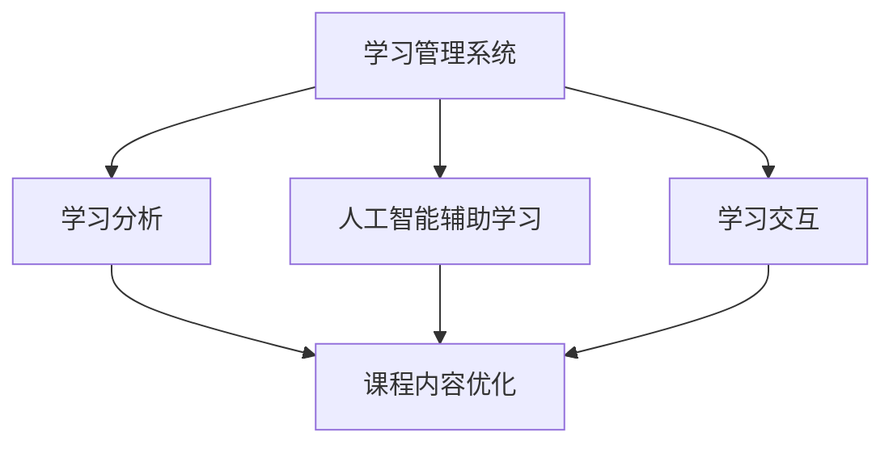

                 

# 如何利用技术能力创建在线课程

## 1. 背景介绍

### 1.1 问题由来
在现代教育体系中，在线课程因其灵活性和广泛的覆盖面，成为教育行业的一大趋势。然而，高质量在线课程的创建往往需要投入大量的时间和精力，尤其是对技术和课程内容的深入理解和整合。本文将从技术和教育两个维度出发，探讨如何利用技术能力创建高性价比的在线课程。

### 1.2 问题核心关键点
在线课程的核心在于其内容的质量和学习的便捷性。技术的合理应用可以大幅提升课程的互动性和个性化程度，从而显著增强学习效果。以下是创建优质在线课程的关键点：
- 选择合适的技术栈：LMS平台、学习数据分析、人工智能辅助等。
- 高质量课程内容：有深度的学习材料、有趣的教育视频、互动的学习工具等。
- 良好的用户体验：便捷的操作界面、及时的反馈机制、互动的社交平台等。
- 个性化学习体验：根据学生的学习进度和偏好，进行智能推送推荐。

### 1.3 问题研究意义
创建优质的在线课程，对于提升教育资源的利用效率，推动教育公平，以及加速知识的传播，具有重要意义。它不仅可以减少教师和学生的时间和精力投入，还能让更多人享受到高质量的教育资源，提高整体教育水平。此外，在线课程的技术研发和推广应用，还带来了新的商业模式和就业机会，推动了教育产业的数字化转型。

## 2. 核心概念与联系

### 2.1 核心概念概述

为更好地理解在线课程的技术实现，本节将介绍几个关键概念及其联系：

- 学习管理系统(Learning Management System, LMS)：提供一个平台，管理课程内容、学生数据、学习活动等，支持教师发布课程、监控学习进度，学生进行在线学习、提交作业、参与讨论等。
- 人工智能辅助学习(AI-assisted Learning)：使用机器学习、自然语言处理、计算机视觉等技术，提升在线课程的智能化程度，如自动批改作业、智能推荐、个性化学习路径规划等。
- 学习分析(Learning Analytics)：通过数据分析，评估学生学习行为、课程质量、教学效果等，提供决策支持和改进建议。
- 学习交互(Learning Interaction)：通过协作学习、游戏化学习、自适应学习等方式，提升学生的参与度和学习兴趣。
- 课程内容优化(Optimization of Course Content)：根据学生反馈和学习数据，动态调整课程内容，增强课程的吸引力和实效性。

这些核心概念共同构成了在线课程的技术基础，通过它们，可以有效地提升课程的互动性、个性化和效率。

### 2.2 概念间的关系

这些核心概念之间存在着紧密的联系，形成了一个完整的在线课程生态系统。以下是一个综合的流程图，展示它们之间的关系：



这个流程图展示了大语言模型微调过程中各个概念的关系：

1. 学习管理系统提供平台，承载课程内容和学生数据。
2. 人工智能辅助学习通过机器学习和自然语言处理技术，提升课程的智能化程度。
3. 学习分析通过对学习数据的分析，提供改进建议。
4. 学习交互提升学生的参与度和学习兴趣。
5. 课程内容优化根据学习反馈，动态调整课程内容，提高课程质量。

这些概念共同构成了在线课程的技术生态，提升了课程的互动性和个性化程度，从而提高了学习效果。

## 3. 核心算法原理 & 具体操作步骤
### 3.1 算法原理概述

在线课程的技术实现，本质上是一个复杂的系统工程，涉及多个子系统的协同工作。其核心算法原理可以归纳为以下几点：

- 学习管理系统平台建设：设计合理的数据模型，支持课程内容的发布、学生数据的记录、学习活动的组织。
- 人工智能辅助学习算法：通过机器学习算法对学生行为数据进行分析，提供个性化的推荐和反馈。
- 学习分析算法：对学生和课程的学习数据进行统计分析，评估课程质量和学习效果。
- 学习交互算法：通过社交网络、游戏化学习等手段，提升学生的参与度和互动性。
- 课程内容优化算法：根据学习数据，动态调整课程内容和结构，提升课程的吸引力和实效性。

### 3.2 算法步骤详解

#### 3.2.1 学习管理系统平台建设

**Step 1: 需求分析**
- 确定课程的目标受众、学习内容、时间安排等关键要素。
- 分析学生和教师的需求，设计系统功能模块。

**Step 2: 技术选型**
- 选择合适的开发语言和技术栈，如React、Vue等前端框架，Node.js、Java等后端语言。
- 选择合适的数据库和服务器架构，如MySQL、PostgreSQL等关系型数据库，AWS、Azure等云平台。

**Step 3: 系统设计**
- 设计系统架构，确定各个组件之间的通信协议。
- 设计数据模型，确保数据一致性和可扩展性。
- 设计用户界面，保证操作便捷和视觉美观。

**Step 4: 系统实现**
- 根据设计文档，进行代码实现。
- 进行单元测试和集成测试，确保系统稳定性和可靠性。
- 部署系统到服务器，进行性能调优和负载均衡。

**Step 5: 系统维护和优化**
- 定期更新系统和补丁，提升系统安全性和稳定性。
- 收集用户反馈，不断优化系统功能和用户体验。

#### 3.2.2 人工智能辅助学习算法

**Step 1: 数据采集**
- 收集学生学习数据，如作业成绩、学习时间、参与度等。
- 收集课程内容数据，如视频、PPT、文本等。

**Step 2: 数据预处理**
- 清洗和标准化数据，去除噪声和异常值。
- 对文本和图像进行特征提取，转化为模型可处理的输入。

**Step 3: 模型训练**
- 选择合适的机器学习算法，如决策树、随机森林、深度神经网络等。
- 划分训练集和测试集，进行模型训练和验证。
- 使用交叉验证和正则化技术，提升模型泛化能力。

**Step 4: 应用部署**
- 将训练好的模型部署到LMS平台。
- 实现自动批改作业、智能推荐等辅助功能。
- 根据用户反馈，不断优化模型参数和算法。

#### 3.2.3 学习分析算法

**Step 1: 数据收集**
- 收集学生和课程的学习数据，如登录时间、视频观看时长、作业提交情况等。
- 收集教师的教学数据，如教学内容、教学方式、互动情况等。

**Step 2: 数据分析**
- 使用统计分析和数据挖掘技术，进行学生行为分析、课程质量评估等。
- 使用可视化工具，呈现分析结果，提供决策支持。

**Step 3: 应用优化**
- 根据分析结果，优化课程设计、教师教学方法等。
- 根据学生反馈，调整课程内容和难度。
- 使用反馈机制，提升学生学习效果。

#### 3.2.4 学习交互算法

**Step 1: 社交网络设计**
- 设计论坛、讨论区等社交功能，支持学生之间互动。
- 引入专家和讲师参与讨论，提供专业指导。

**Step 2: 游戏化学习设计**
- 设计积分系统、排行榜等游戏元素，提升学生参与度。
- 引入虚拟奖励和激励机制，增强学习动力。

**Step 3: 自适应学习设计**
- 根据学生学习进度和反馈，动态调整学习内容和难度。
- 引入个性化推荐系统，提供适合的学习资源。

### 3.3 算法优缺点

人工智能辅助学习算法具有以下优点：
1. 个性化推荐：通过分析学生行为数据，提供个性化推荐，提高学习效率。
2. 自动化批改：使用机器学习模型进行作业自动批改，减轻教师负担。
3. 智能反馈：根据学生学习情况，提供实时反馈和建议，提升学习效果。

同时，也存在一些缺点：
1. 数据隐私：收集学生行为数据时，需要注意数据隐私和安全问题。
2. 算法鲁棒性：模型可能需要大量数据进行训练，对小样本数据鲁棒性不足。
3. 技术门槛高：需要掌握机器学习、自然语言处理等技术，对开发者要求较高。

### 3.4 算法应用领域

人工智能辅助学习算法广泛应用于在线教育、远程教育、企业培训等多个领域，显著提高了学习效率和课程质量。以下列举几个典型的应用场景：

- 在线教育：通过智能推荐系统，提供适合的学习资源，提升学习效果。
- 企业培训：使用自动批改系统，减轻培训师工作量，提供个性化培训。
- 游戏化学习：设计游戏元素，提升学生参与度和学习兴趣。
- 自适应学习：根据学生学习进度和反馈，动态调整学习内容和难度。

## 4. 数学模型和公式 & 详细讲解 & 举例说明

### 4.1 数学模型构建

在线课程的数学模型构建，主要包括以下几个方面：

- 学生行为模型：用于描述学生学习行为，如观看视频时长、参与讨论次数等。
- 课程质量模型：用于评估课程质量，如学生学习反馈、完成度等。
- 教学效果模型：用于衡量教学效果，如学生成绩、课程评分等。
- 个性化推荐模型：用于提供个性化推荐，如学习资源、学习路径等。

#### 4.1.1 学生行为模型

假设学生行为可以用一组时间序列数据表示，记为 $X=\{x_t\}_{t=1}^T$，其中 $x_t$ 为第 $t$ 时间点的行为数据，如观看视频时长、参与讨论次数等。设 $y$ 为学生最终成绩，则学生行为模型可以表示为：

$$
y = f(X) + \epsilon
$$

其中 $f$ 为学生行为模型，$\epsilon$ 为误差项。

#### 4.1.2 课程质量模型

课程质量可以用学生评价、教师反馈、课程难度等指标表示，记为 $Q=\{q_i\}_{i=1}^N$，其中 $q_i$ 为第 $i$ 个指标的评分。设 $y$ 为课程评分，则课程质量模型可以表示为：

$$
y = \alpha_0 + \sum_{i=1}^N \alpha_i q_i + \epsilon
$$

其中 $\alpha_i$ 为第 $i$ 个指标的权重，$\epsilon$ 为误差项。

#### 4.1.3 教学效果模型

教学效果可以用学生成绩、课程完成度等指标表示，记为 $E=\{e_j\}_{j=1}^M$，其中 $e_j$ 为第 $j$ 个指标的评分。设 $y$ 为教学效果评分，则教学效果模型可以表示为：

$$
y = \beta_0 + \sum_{j=1}^M \beta_j e_j + \epsilon
$$

其中 $\beta_j$ 为第 $j$ 个指标的权重，$\epsilon$ 为误差项。

#### 4.1.4 个性化推荐模型

个性化推荐可以用协同过滤、内容推荐等算法表示，记为 $R=\{r_k\}_{k=1}^K$，其中 $r_k$ 为第 $k$ 个推荐资源。设 $y$ 为最终推荐的资源，则个性化推荐模型可以表示为：

$$
y = \gamma_0 + \sum_{k=1}^K \gamma_k r_k + \epsilon
$$

其中 $\gamma_k$ 为第 $k$ 个推荐资源的权重，$\epsilon$ 为误差项。

### 4.2 公式推导过程

以学生行为模型为例，进行推导：

设 $X=\{x_t\}_{t=1}^T$，其中 $x_t$ 为第 $t$ 时间点的行为数据，如观看视频时长、参与讨论次数等。设 $y$ 为学生最终成绩，则学生行为模型可以表示为：

$$
y = f(X) + \epsilon
$$

其中 $f$ 为学生行为模型，$\epsilon$ 为误差项。

假设 $f$ 为线性模型，则有：

$$
y = \sum_{i=1}^p \theta_i x_{it} + \epsilon
$$

其中 $\theta_i$ 为模型系数，$p$ 为模型维度。

将 $X$ 分解为 $X = \begin{bmatrix} x_1 \\ x_2 \\ \vdots \\ x_T \end{bmatrix}$，则上述模型可以表示为：

$$
\begin{bmatrix} y \\ \epsilon \end{bmatrix} = \begin{bmatrix} \theta_1 & \theta_2 & \dots & \theta_p \\ 0 & 0 & \dots & 0 \end{bmatrix} \begin{bmatrix} x_1 \\ x_2 \\ \vdots \\ x_T \end{bmatrix} + \begin{bmatrix} 0 \\ \epsilon \end{bmatrix}
$$

将上述方程整理为矩阵形式：

$$
\begin{bmatrix} y \\ \epsilon \end{bmatrix} = \begin{bmatrix} \theta_1 & \theta_2 & \dots & \theta_p \\ 0 & 0 & \dots & 0 \end{bmatrix} \begin{bmatrix} x_1 \\ x_2 \\ \vdots \\ x_T \end{bmatrix} + \begin{bmatrix} 0 \\ \epsilon \end{bmatrix}
$$

上式可以表示为：

$$
\begin{bmatrix} y \\ \epsilon \end{bmatrix} = \begin{bmatrix} A & B \\ C & D \end{bmatrix} \begin{bmatrix} x_1 \\ x_2 \\ \vdots \\ x_T \end{bmatrix} + \begin{bmatrix} 0 \\ \epsilon \end{bmatrix}
$$

其中 $A = \begin{bmatrix} \theta_1 & \theta_2 & \dots & \theta_p \end{bmatrix}$，$B = \begin{bmatrix} 0 & 0 & \dots & 0 \end{bmatrix}$，$C = \begin{bmatrix} 0 & 0 & \dots & 0 \end{bmatrix}$，$D = \begin{bmatrix} 0 & 0 & \dots & 0 \end{bmatrix}$。

通过最小化误差 $\epsilon$，求解系数 $\theta_i$，即可得到学生行为模型。

### 4.3 案例分析与讲解

假设某在线课程平台收集了100名学生的学习行为数据，包括观看视频时长和参与讨论次数，以及他们的最终成绩。现在使用线性回归模型进行学生行为分析。

**Step 1: 数据预处理**
- 将学生行为数据 $X=\{x_t\}_{t=1}^{100}$ 和成绩数据 $y$ 整理为矩阵形式。
- 对数据进行标准化处理，去除异常值和噪声。

**Step 2: 模型训练**
- 使用最小二乘法求解线性回归模型。
- 对模型进行正则化处理，防止过拟合。

**Step 3: 模型评估**
- 在验证集上评估模型性能，计算误差 $\epsilon$。
- 根据误差 $\epsilon$，调整模型参数，优化模型。

## 5. 项目实践：代码实例和详细解释说明

### 5.1 开发环境搭建

在开始项目实践前，需要先搭建好开发环境。以下是搭建Python开发环境的步骤：

1. 安装Anaconda：从官网下载并安装Anaconda，用于创建独立的Python环境。
2. 创建并激活虚拟环境：
```bash
conda create -n py-env python=3.8 
conda activate py-env
```

3. 安装Python开发工具：
```bash
pip install numpy pandas scikit-learn matplotlib
```

4. 安装Django框架：
```bash
pip install django
```

5. 配置数据库：
```bash
# 修改 settings.py 配置文件，设置数据库连接信息
DATABASES = {
    'default': {
        'ENGINE': 'django.db.backends.postgresql',
        'NAME': 'myproject',
        'USER': 'myuser',
        'PASSWORD': 'mypassword',
        'HOST': 'localhost',
        'PORT': '5432',
    }
}
```

完成上述步骤后，即可在虚拟环境中进行项目开发。

### 5.2 源代码详细实现

以下是使用Django框架开发在线课程平台的示例代码：

**models.py: 定义数据模型**

```python
from django.db import models

class Student(models.Model):
    name = models.CharField(max_length=100)
    scores = models.FloatField()
    videos_watched = models.IntegerField()
    discussions_participated = models.IntegerField()

class Course(models.Model):
    name = models.CharField(max_length=100)
    score = models.FloatField()
    duration = models.IntegerField()
    videos_count = models.IntegerField()
    discussions_count = models.IntegerField()

class Module(models.Model):
    name = models.CharField(max_length=100)
    score = models.FloatField()
    duration = models.IntegerField()
    videos_count = models.IntegerField()
    discussions_count = models.IntegerField()
```

**views.py: 定义视图函数**

```python
from django.shortcuts import render, redirect
from .models import Student, Course, Module
from .forms import StudentForm, CourseForm, ModuleForm

def student_list(request):
    students = Student.objects.all()
    return render(request, 'student_list.html', {'students': students})

def student_add(request):
    if request.method == 'POST':
        form = StudentForm(request.POST)
        if form.is_valid():
            form.save()
            return redirect('student_list')
    else:
        form = StudentForm()
    return render(request, 'student_add.html', {'form': form})

def course_list(request):
    courses = Course.objects.all()
    return render(request, 'course_list.html', {'courses': courses})

def course_add(request):
    if request.method == 'POST':
        form = CourseForm(request.POST)
        if form.is_valid():
            form.save()
            return redirect('course_list')
    else:
        form = CourseForm()
    return render(request, 'course_add.html', {'form': form})
```

**forms.py: 定义表单**

```python
from django import forms
from .models import Student, Course, Module

class StudentForm(forms.ModelForm):
    class Meta:
        model = Student
        fields = ['name', 'scores', 'videos_watched', 'discussions_participated']

class CourseForm(forms.ModelForm):
    class Meta:
        model = Course
        fields = ['name', 'score', 'duration', 'videos_count', 'discussions_count']

class ModuleForm(forms.ModelForm):
    class Meta:
        model = Module
        fields = ['name', 'score', 'duration', 'videos_count', 'discussions_count']
```

**urls.py: 定义URL映射**

```python
from django.urls import path
from . import views

urlpatterns = [
    path('students/', views.student_list, name='student_list'),
    path('students/add/', views.student_add, name='student_add'),
    path('courses/', views.course_list, name='course_list'),
    path('courses/add/', views.course_add, name='course_add'),
]
```

**学生管理功能**

使用上述代码，可以实现基本的在线课程平台功能。学生和课程等数据通过模型表示，视图函数和模板控制界面呈现。

**交互模块功能**

下面以机器学习推荐模块为例，展示交互模块的实现。

**views.py: 定义推荐模块视图函数**

```python
from django.shortcuts import render, redirect
from .models import Student, Course, Module
from .forms import StudentForm, CourseForm, ModuleForm
from .predict import recommend_course

def recommend(request):
    if request.method == 'POST':
        name = request.POST.get('name')
        videos_watched = int(request.POST.get('videos_watched'))
        discussions_participated = int(request.POST.get('discussions_participated'))
        courses = recommend_course(name, videos_watched, discussions_participated)
        return render(request, 'recommend.html', {'courses': courses})
    else:
        return render(request, 'recommend.html', {})
```

**predict.py: 定义推荐算法**

```python
import pandas as pd
from sklearn.linear_model import LinearRegression

def recommend_course(name, videos_watched, discussions_participated):
    # 读取学生行为数据
    data = pd.read_csv('data/student_behavior.csv')

    # 对数据进行预处理
    data = data[data['name'] == name]
    data = data[['videos_watched', 'discussions_participated']]
    data.columns = ['watched', 'participated']

    # 对数据进行标准化处理
    data = (data - data.mean()) / data.std()

    # 构建学生行为模型
    model = LinearRegression()
    model.fit(data, data['score'])

    # 预测学生成绩
    score = model.predict(data)

    # 根据成绩推荐课程
    courses = pd.read_csv('data/courses.csv')
    courses = courses.merge(data, on='score')
    courses = courses[courses['videos_count'] > 0].merge(pd.read_csv('data/video_course.csv'), left_on='score', right_on='videos_count')
    courses = courses[courses['discussions_count'] > 0].merge(pd.read_csv('data/discussion_course.csv'), left_on='score', right_on='discussions_count')
    courses = courses[['name', 'score', 'videos_count', 'discussions_count']]

    # 推荐课程
    courses = courses[courses['score'] > score].sample(5)
    return courses
```

**推荐页面**

使用上述代码，可以实现个性化推荐功能。学生输入姓名和行为数据后，推荐系统根据其行为模式，推荐适合的课程。

## 6. 实际应用场景

### 6.1 企业内部培训

在线课程平台可以帮助企业构建内部培训系统，提升员工的学习效果和技能水平。通过整合内部培训资源，如视频课程、在线测试等，企业可以在不影响正常工作的前提下，为员工提供灵活的学习机会。

在技术实现上，可以设计员工绩效评估模型，根据员工学习情况和培训成绩，动态调整培训内容和难度。同时，使用人工智能辅助学习技术，自动批改员工作业，提供个性化推荐，帮助员工更高效地学习。

### 6.2 教育平台

在线课程平台可以服务于广大学生，提供高质量的教育资源。通过整合名校名师的课程内容，在线平台可以为学生提供灵活的学习方式，提升学习效果。

在技术实现上，可以设计学生学习行为模型，分析学生的学习效果和行为特征，提供个性化推荐。同时，使用学习分析技术，评估课程质量和学习效果，不断优化课程内容和教学方法。

### 6.3 社区学习

在线课程平台可以构建社区学习环境，促进知识分享和交流。通过提供课程讨论区、学习小组等功能，社区学习者可以相互学习，共同进步。

在技术实现上，可以设计社区互动模型，分析学生的互动情况和学习效果，提供互动推荐。同时，使用学习分析技术，评估社区的学习效果和互动质量，不断优化社区环境和内容。

### 6.4 未来应用展望

未来，在线课程平台将在更多领域得到应用，为教育、企业培训、社区学习等提供有力支持。

在智慧教育领域，在线课程平台将推动教育公平和知识共享，使更多人能够享受到优质教育资源。

在企业培训领域，在线课程平台将提升员工技能，推动企业数字化转型和创新发展。

在社区学习领域，在线课程平台将促进知识传播和交流，构建更紧密的社区网络。

总之，在线课程平台将在教育、企业培训、社区学习等众多领域，为知识传播和应用提供有力支持，成为未来学习的重要渠道。

## 7. 工具和资源推荐

### 7.1 学习资源推荐

为了帮助开发者系统掌握在线课程的技术实现，这里推荐一些优质的学习资源：

1. Django官方文档：详细介绍了Django框架的使用方法，适合初学者快速上手。
2. TensorFlow官方文档：提供了TensorFlow深度学习框架的详细教程，涵盖各种模型和算法。
3. Kaggle数据科学社区：提供大量高质量数据集和竞赛项目，适合实践和提升。
4. Coursera在线课程：提供了丰富的机器学习和深度学习课程，适合系统学习。
5. Udacity机器学习专业课程：系统介绍机器学习原理和实践，适合进阶学习。

通过学习这些资源，相信你一定能够快速掌握在线课程的技术实现，并用于解决实际的NLP问题。

### 7.2 开发工具推荐

高效的开发离不开优秀的工具支持。以下是几款用于在线课程开发的常用工具：

1. Django：Python的Web框架，适合构建大型的在线课程平台。
2. TensorFlow：Google开发的深度学习框架，支持各种深度学习模型和算法。
3. Kaggle：数据科学社区，提供丰富的数据集和竞赛项目，适合数据处理和模型训练。
4. Coursera：在线学习平台，提供丰富的机器学习和深度学习课程，适合系统学习。
5. Udacity：在线学习平台，提供专业的机器学习课程和实战项目，适合进阶学习。

合理利用这些工具，可以显著提升在线课程平台的开发效率，加快创新迭代的步伐。

### 7.3 相关论文推荐

在线课程平台的发展离不开学界的持续研究。以下是几篇奠基性的相关论文，推荐阅读：

1. "Online Learning at Scale"（Ata et al., 2014）：介绍了大规模在线课程平台的建设和管理，为在线课程提供了理论基础。
2. "Designing Online Courses to Promote Deep Learning"（Schmidt et al., 2017）：探讨了在线课程的设计原则和方法，适合教育工作者参考。
3. "Automated Course Design and Recommendation in MOOCs

