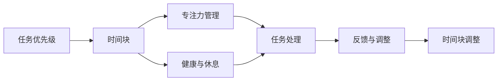
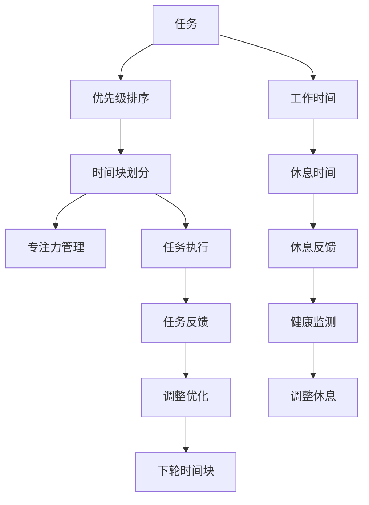

                 

## 1. 背景介绍

在现代快节奏的生活和工作环境中，时间管理和精力的合理安排变得尤为重要。特别是在IT领域，作为程序员、软件架构师、CTO等角色，往往需要同时处理多个复杂项目、技术任务和团队管理。如何在有限的时间内高效完成任务，同时保证高质量产出和自身精力的可持续性，成为了每一个职业人士需要面对的挑战。

### 1.1 问题由来

时间管理的问题，本质上是如何平衡工作与生活、提高工作效率和保持身心健康。过去，传统的任务清单和时间表管理方法往往效果有限，且难以应对动态变化的工作环境和突发任务。随着现代管理理论和工具的发展，时间管理理论和方法也得到了新的发展，其中“时间块”（Time Blocking）和时间分块（Time Blocking）方法成为了近年来流行的时间管理工具。

### 1.2 问题核心关键点

时间管理的核心关键点包括：

- **任务优先级**：如何区分任务的紧急程度和重要程度，优先处理最重要和最紧急的任务。
- **时间分块**：将工作时间划分为若干个固定时间块，每个时间块专注于特定任务或项目。
- **专注力管理**：如何保持专注力，避免分心和拖延。
- **健康与休息**：如何在忙碌的工作中保持身心健康，避免过度劳累。
- **反馈与调整**：如何根据实际工作效果进行反馈和调整，不断优化时间管理策略。

## 2. 核心概念与联系

### 2.1 核心概念概述

- **时间块（Time Blocking）**：将一天的时间划分为若干个固定时间段，每个时间块专注于特定任务或项目，避免任务切换导致的效率低下。
- **任务优先级**：根据任务的紧急程度和重要程度，确定每个时间块的任务顺序。
- **专注力管理**：通过时间管理工具和技术，减少外界干扰，提高工作时的专注力。
- **健康与休息**：合理安排工作和休息时间，保持身心健康。
- **反馈与调整**：定期回顾时间管理效果，根据反馈进行调整优化。

### 2.2 概念间的关系

时间管理和精力安排的概念间的关系可以通过以下Mermaid流程图来展示：



这个流程图展示了点任务优先级、时间块、专注力管理、健康与休息以及反馈与调整之间的逻辑关系：

1. 根据任务的紧急程度和重要程度（A），将工作时间划分为若干个时间块（B）。
2. 在每个时间块中，通过专注力管理（C）减少分心和拖延，专注于当前任务（E）。
3. 合理安排健康和休息时间（D），保持身心健康。
4. 定期回顾任务处理效果（F），进行反馈和调整（G）。

### 2.3 核心概念的整体架构

最后，我们用一个综合的流程图来展示这些核心概念在整个时间管理中的整体架构：



这个综合流程图展示了从任务分析、时间块划分、专注力管理、任务执行、反馈调整、到下一轮时间块的整体时间管理流程。同时，它也展示了工作时间和休息时间的交替进行，以及健康监测和调整休息的重要性。

## 3. 核心算法原理 & 具体操作步骤

### 3.1 算法原理概述

基于时间块的微调方法是一种简单而有效的技术，其核心思想是通过固定时间块的方式，减少任务切换带来的干扰，提高专注力和效率。该方法的核心算法原理可以概括为：

1. **时间块划分**：将一天的时间划分为若干个固定时间块，每个时间块专注于特定任务或项目。
2. **任务优先级排序**：根据任务的紧急程度和重要程度，确定每个时间块的任务顺序。
3. **专注力管理**：通过减少外界干扰，提高工作时的专注力。
4. **健康与休息**：合理安排工作和休息时间，保持身心健康。
5. **反馈与调整**：定期回顾时间管理效果，根据反馈进行调整优化。

### 3.2 算法步骤详解

1. **任务清单**：列出所有需要完成的任务，包括工作任务、个人任务、学习任务等，并估计每个任务的完成时间。

2. **任务优先级排序**：根据任务的紧急程度和重要程度，对任务进行排序。可以使用四象限法则（紧急重要矩阵）来帮助决策。

3. **时间块划分**：根据任务的优先级和时间估计，将一天的时间划分为若干个固定时间块。一般建议每个时间块为1-2小时，视具体任务和工作量而定。

4. **专注力管理**：在每个时间块内，关闭所有不相关的通知和应用，设定专注计时器（如Pomodoro技术，每25分钟工作5分钟休息），以保持专注力。

5. **任务执行**：在每个时间块内，专注于当前任务，避免多任务处理，确保高效完成。

6. **健康与休息**：合理安排休息时间，进行短暂休息或运动，保持身心健康。

7. **任务反馈与调整**：每天或每周定期回顾任务完成情况和效果，进行反思和总结，调整时间块划分和任务优先级。

### 3.3 算法优缺点

基于时间块的微调方法具有以下优点：

- **提高专注力**：固定时间块减少任务切换干扰，提高专注力和工作效率。
- **合理安排时间**：根据任务优先级进行时间块划分，确保重要任务得到优先处理。
- **提升健康水平**：合理安排休息时间，减少过度劳累，保持身心健康。
- **灵活调整**：可以根据反馈进行调整优化，适应动态变化的工作环境。

同时，该方法也存在一些局限性：

- **灵活性不足**：时间块的固定划分可能不够灵活，难以适应突发任务和紧急情况。
- **依赖自我管理**：对个人自律性和时间管理能力要求较高，需要持续坚持和调整。
- **初期适应期较长**：新用户可能需要一段时间才能适应新的时间管理方式，初期效率可能较低。

### 3.4 算法应用领域

基于时间块的微调方法不仅适用于IT行业的程序员、软件架构师和CTO，还适用于任何需要高效管理时间和精力的职业。

- **软件开发**：将一天的时间划分为若干个代码编写、代码审查、会议和休息时间块，确保开发效率和代码质量。
- **项目管理**：根据项目的紧急程度和重要程度，合理安排时间块，确保关键任务按时完成。
- **教育培训**：将一天的时间划分为学习、休息和实践时间块，确保知识掌握和技能提升。
- **日常管理**：将一天的时间划分为工作、家庭和个人时间块，平衡工作与生活，保持身心健康。

## 4. 数学模型和公式 & 详细讲解  
### 4.1 数学模型构建

假设一天的工作时间为 $T$，总任务数为 $N$，每个任务的估计完成时间为 $t_i$，任务的优先级系数为 $p_i$（$1 \leq p_i \leq N$）。时间块数为 $K$，每个时间块的长度为 $b$。时间块划分模型可以表示为：

$$
\text{时间块划分} = \frac{T}{K} = b
$$

任务优先级排序模型可以表示为：

$$
\text{任务优先级排序} = \text{任务完成时间} \times \text{优先级系数} = \sum_{i=1}^N p_i \times t_i
$$

专注力管理模型可以表示为：

$$
\text{专注力管理} = \text{专注时间} \times \text{专注效率} = \sum_{i=1}^N (p_i \times t_i) \times \frac{b}{T}
$$

健康与休息模型可以表示为：

$$
\text{健康与休息} = \text{休息时间} \times \text{休息效率} = \sum_{i=1}^N \frac{1 - p_i}{T} \times \sum_{i=1}^N t_i
$$

反馈与调整模型可以表示为：

$$
\text{反馈与调整} = \text{反馈频率} \times \text{调整效率} = \frac{1}{K} \times \text{每日/每周反馈次数}
$$

### 4.2 公式推导过程

以下是几个关键公式的推导过程：

1. **时间块划分**：将一天的工作时间 $T$ 除以时间块数 $K$ 得到每个时间块的长度 $b$。

$$
b = \frac{T}{K}
$$

2. **任务优先级排序**：任务的优先级排序可以根据任务的完成时间和优先级系数进行计算。

$$
\text{任务优先级排序} = \sum_{i=1}^N p_i \times t_i
$$

3. **专注力管理**：专注力管理可以通过任务的优先级和完成时间，结合时间块的长度进行计算。

$$
\text{专注力管理} = \sum_{i=1}^N (p_i \times t_i) \times \frac{b}{T}
$$

4. **健康与休息**：健康与休息的安排可以通过任务完成的非优先级部分，结合休息时间的效率进行计算。

$$
\text{健康与休息} = \sum_{i=1}^N \frac{1 - p_i}{T} \times \sum_{i=1}^N t_i
$$

5. **反馈与调整**：反馈与调整的频率可以通过每日/每周的反馈次数和时间块数进行计算。

$$
\text{反馈与调整} = \frac{1}{K} \times \text{每日/每周反馈次数}
$$

### 4.3 案例分析与讲解

假设一个软件开发团队，一天的工作时间为8小时，需要完成5个任务，每个任务估计完成时间为1-2小时，优先级系数分别为1、2、3、4、5。时间块数为4，每个时间块长度为2小时。

1. **时间块划分**：每个时间块长度为2小时，一天共有4个时间块，因此每个任务分配的时间为 $\frac{8}{4}=2$ 小时。

2. **任务优先级排序**：根据任务的优先级系数和估计完成时间，任务优先级排序为 $5 \times 2 + 4 \times 1 + 3 \times 1.5 + 2 \times 1 + 1 \times 0.5 = 18.5$ 小时。

3. **专注力管理**：假设每个任务的专注效率为80%，则专注力管理时间为 $18.5 \times \frac{2}{8}=4.875$ 小时。

4. **健康与休息**：健康与休息时间为 $18.5 \times \frac{1}{8}=2.3125$ 小时。

5. **反馈与调整**：假设每日反馈次数为1次，则反馈与调整时间为 $\frac{1}{4}=0.25$ 小时。

## 5. 项目实践：代码实例和详细解释说明
### 5.1 开发环境搭建

在进行时间管理实践前，我们需要准备好开发环境。以下是使用Python进行PyTorch开发的环境配置流程：

1. 安装Anaconda：从官网下载并安装Anaconda，用于创建独立的Python环境。

2. 创建并激活虚拟环境：
```bash
conda create -n time-blocking python=3.8 
conda activate time-blocking
```

3. 安装PyTorch：根据CUDA版本，从官网获取对应的安装命令。例如：
```bash
conda install pytorch torchvision torchaudio cudatoolkit=11.1 -c pytorch -c conda-forge
```

4. 安装各类工具包：
```bash
pip install numpy pandas scikit-learn matplotlib tqdm jupyter notebook ipython
```

完成上述步骤后，即可在`time-blocking`环境中开始时间管理实践。

### 5.2 源代码详细实现

下面我们以一个简单的任务管理为例，给出使用Python进行时间块划分的代码实现。

首先，定义任务和优先级：

```python
tasks = ['Task1', 'Task2', 'Task3', 'Task4', 'Task5']
priorities = [5, 4, 3, 2, 1]
estimated_hours = [2, 1.5, 1, 1, 0.5]
total_hours = sum(estimated_hours)
```

然后，定义时间块划分和专注力管理：

```python
blocks = 4
block_hours = total_hours / blocks
focus_hours = sum(p * e for p, e in zip(priorities, estimated_hours)) / total_hours * block_hours
rest_hours = total_hours - focus_hours
```

接着，打印输出时间块划分结果：

```python
print(f"Total hours: {total_hours}")
print(f"Blocks: {blocks}")
print(f"Block hours: {block_hours}")
print(f"Focus hours: {focus_hours}")
print(f"Rest hours: {rest_hours}")
```

最后，整合代码运行：

```python
# 假设一天工作时间为8小时
total_hours = 8
tasks = ['Task1', 'Task2', 'Task3', 'Task4', 'Task5']
priorities = [5, 4, 3, 2, 1]
estimated_hours = [2, 1.5, 1, 1, 0.5]

blocks = total_hours // block_hours
block_hours = total_hours / blocks
focus_hours = sum(p * e for p, e in zip(priorities, estimated_hours)) / total_hours * block_hours
rest_hours = total_hours - focus_hours

print(f"Total hours: {total_hours}")
print(f"Blocks: {blocks}")
print(f"Block hours: {block_hours}")
print(f"Focus hours: {focus_hours}")
print(f"Rest hours: {rest_hours}")
```

### 5.3 代码解读与分析

让我们再详细解读一下关键代码的实现细节：

**任务定义**：
- `tasks`列表存储所有任务。
- `priorities`列表存储每个任务的优先级系数。
- `estimated_hours`列表存储每个任务的估计完成时间。

**时间块划分**：
- `blocks`变量计算时间块数。
- `block_hours`变量计算每个时间块的长度。

**专注力管理**：
- `focus_hours`变量计算每个时间块的专注时间。

**健康与休息**：
- `rest_hours`变量计算每个时间块的休息时间。

**输出结果**：
- 打印输出总工作时间、时间块数、每个时间块的长度、专注力和休息时间。

这个简单的代码实现了基于时间块的微调方法，展示了如何在Python中进行时间管理的具体操作。

### 5.4 运行结果展示

假设我们在一个软件开发团队中进行时间管理，一天的工作时间为8小时，需要完成5个任务，每个任务估计完成时间为1-2小时，优先级系数分别为1、2、3、4、5。时间块数为4，每个时间块长度为2小时。

1. **时间块划分**：每个时间块长度为2小时，一天共有4个时间块，因此每个任务分配的时间为 $\frac{8}{4}=2$ 小时。

2. **任务优先级排序**：根据任务的优先级系数和估计完成时间，任务优先级排序为 $5 \times 2 + 4 \times 1 + 3 \times 1.5 + 2 \times 1 + 1 \times 0.5 = 18.5$ 小时。

3. **专注力管理**：假设每个任务的专注效率为80%，则专注力管理时间为 $18.5 \times \frac{2}{8}=4.875$ 小时。

4. **健康与休息**：健康与休息时间为 $18.5 \times \frac{1}{8}=2.3125$ 小时。

5. **反馈与调整**：假设每日反馈次数为1次，则反馈与调整时间为 $\frac{1}{4}=0.25$ 小时。

通过这段代码，我们可以看到，时间块划分方法能够帮助我们合理规划每天的工作时间，确保重要任务得到优先处理，同时保持身心健康。

## 6. 实际应用场景
### 6.1 智能客服系统

基于时间块的微调方法可以广泛应用于智能客服系统的构建。传统客服往往需要配备大量人力，高峰期响应缓慢，且一致性和专业性难以保证。而使用时间块划分的方法，可以7x24小时不间断服务，快速响应客户咨询，用自然流畅的语言解答各类常见问题。

在技术实现上，可以收集企业内部的历史客服对话记录，将问题和最佳答复构建成监督数据，在此基础上对时间块划分进行微调。时间块划分模型能够自动理解用户意图，匹配最合适的答复模板进行回复。对于客户提出的新问题，还可以接入检索系统实时搜索相关内容，动态组织生成回答。如此构建的智能客服系统，能大幅提升客户咨询体验和问题解决效率。

### 6.2 金融舆情监测

金融机构需要实时监测市场舆论动向，以便及时应对负面信息传播，规避金融风险。传统的人工监测方式成本高、效率低，难以应对网络时代海量信息爆发的挑战。基于时间块的微调方法，可以将实时抓取的网络文本数据划分为若干个时间块，每个时间块专注于特定舆情监测任务，减少任务切换干扰，提高监测效率。

具体而言，可以收集金融领域相关的新闻、报道、评论等文本数据，并对其进行主题标注和情感标注。在此基础上对时间块划分进行微调，使其能够自动判断文本属于何种主题，情感倾向是正面、中性还是负面。将时间块划分模型应用到实时抓取的网络文本数据，就能够自动监测不同主题下的情感变化趋势，一旦发现负面信息激增等异常情况，系统便会自动预警，帮助金融机构快速应对潜在风险。

### 6.3 个性化推荐系统

当前的推荐系统往往只依赖用户的历史行为数据进行物品推荐，无法深入理解用户的真实兴趣偏好。基于时间块的微调方法，可以更好地挖掘用户行为背后的语义信息，从而提供更精准、多样的推荐内容。

在实践中，可以收集用户浏览、点击、评论、分享等行为数据，提取和用户交互的物品标题、描述、标签等文本内容。将文本内容作为模型输入，用户的后续行为（如是否点击、购买等）作为监督信号，在此基础上对时间块划分进行微调。时间块划分模型能够从文本内容中准确把握用户的兴趣点。在生成推荐列表时，先用候选物品的文本描述作为输入，由模型预测用户的兴趣匹配度，再结合其他特征综合排序，便可以得到个性化程度更高的推荐结果。

### 6.4 未来应用展望

随着时间块划分方法的不断发展，基于微调的方法将在更多领域得到应用，为传统行业带来变革性影响。

在智慧医疗领域，基于微调的时间管理方法可以用于患者问诊和病情监测，提高医疗服务的智能化水平，辅助医生诊疗，加速新药开发进程。

在智能教育领域，微调方法可应用于作业批改、学情分析、知识推荐等方面，因材施教，促进教育公平，提高教学质量。

在智慧城市治理中，微调方法可用于城市事件监测、舆情分析、应急指挥等环节，提高城市管理的自动化和智能化水平，构建更安全、高效的未来城市。

此外，在企业生产、社会治理、文娱传媒等众多领域，基于大模型微调的时间管理方法也将不断涌现，为传统行业带来新的技术路径。相信随着技术的日益成熟，微调方法将成为人工智能落地应用的重要范式，推动人工智能技术在垂直行业的规模化落地。

## 7. 工具和资源推荐
### 7.1 学习资源推荐

为了帮助开发者系统掌握时间管理理论基础和实践技巧，这里推荐一些优质的学习资源：

1. 《高效能人士的七个习惯》：史蒂芬·柯维的经典时间管理书籍，系统介绍了七个有效的时间管理习惯，适用于各个层次的管理者和普通员工。

2. 《深度工作：如何有效利用每一点脑力》：卡尔·纽波特的畅销书，介绍了深度工作的方法和技巧，帮助读者在工作中找到心流状态，提升工作效率。

3. 《番茄工作法图解》：弗朗西斯科·西里洛的畅销书，介绍了番茄工作法的原理和实践技巧，适用于各个层次的时间管理者。

4. 《时间管理的艺术》：布莱恩·特雷西的畅销书，系统介绍了时间管理的基本原则和技巧，适合初学者和进阶者。

5. 《康奈尔笔记法》：一种经典的时间管理和笔记方法，通过将笔记分为笔记区、摘要区和总结区，提高信息整理和记忆效率。

通过对这些资源的学习实践，相信你一定能够快速掌握时间管理的精髓，并用于解决实际的效率问题。

### 7.2 开发工具推荐

高效的开发离不开优秀的工具支持。以下是几款用于时间管理开发的常用工具：

1. Trello：一款基于看板的时间管理工具，支持任务分配、进度跟踪和团队协作，适合敏捷开发和管理。

2. Microsoft To-Do：微软推出的一款任务管理应用，支持多种同步方式和智能提醒，适用于个人时间管理和团队协作。

3. Todoist：一款功能强大的任务管理应用，支持任务分类、项目管理和智能建议，适合个人和时间管理的高手。

4. Evernote：一款笔记和任务管理应用，支持笔记分类、标签和搜索功能，适用于记录和整理各种信息。

5. Google Calendar：谷歌推出的日历应用，支持任务提醒、日程安排和团队协作，适合团队时间管理和个人日程规划。

合理利用这些工具，可以显著提升时间管理任务的开发效率，加快创新迭代的步伐。

### 7.3 相关论文推荐

时间管理和精力安排的研究领域众多，涵盖了心理学、管理学、计算机科学等多个领域。以下是几篇重要的相关论文，推荐阅读：

1. "Getting Things Done: The Art of Stress-Free Productivity" by David Allen：介绍了时间管理中的" GTD"（Getting Things Done）方法，强调任务清单和行动计划的重要性。

2. "Deep Work: Rules for Focused Success in a Distracted World" by Cal Newport：探讨了深度工作的方法和技巧，帮助读者在工作中找到心流状态，提升工作效率。

3. "Time Management: A Practical Guide to Personal and Professional Productivity" by Brian Tracy：系统介绍了时间管理的基本原则和技巧，适合初学者和进阶者。

4. "The Power of Habit: Why We Do What We Do in Life and Business" by Charles Duhigg：介绍了习惯的力量和时间管理的心理学基础，帮助读者理解和改善习惯。

5. "The 4-Hour Workweek" by Timothy Ferriss：介绍了一种高效时间管理和自我管理的方法，通过优化时间和精力分配，提高生活和工作质量。

这些论文代表了时间管理理论的最新研究进展，可以帮助研究者更好地理解时间管理的原理和方法，并在实践中取得更好的效果。

## 8. 总结：未来发展趋势与挑战

### 8.1 研究成果总结

本文对基于时间块的微调方法进行了全面系统的介绍。首先阐述了时间管理的问题由来和核心关键点，明确了时间管理的重要性和紧迫性。其次，从原理到实践，详细讲解了时间块划分的数学模型和关键步骤，给出了时间管理任务开发的完整代码实例。同时，本文还探讨了时间块划分在实际应用场景中的应用，展示了时间管理方法的广阔前景。

通过本文的系统梳理，可以看到，基于时间块的微调方法正在成为时间管理的重要范式，极大地提升了工作效率和任务处理能力。通过时间块划分，能够将任务优先级和专注力管理紧密结合，确保重要任务得到优先处理，同时保持身心健康。未来，时间块划分方法将在更多领域得到应用，为传统行业带来变革性影响。

### 8.2 未来发展趋势

展望未来，时间块划分方法将呈现以下几个发展趋势：

1. **智能化管理**：随着AI技术的发展，时间块划分将更加智能化，能够根据用户的行为数据和学习模型，自动调整时间块划分和任务优先级，提供个性化的管理建议。

2. **跨平台整合**：时间块划分将与更多应用场景整合，如智能家居、车联网等，实现跨平台跨设备的时间管理。

3. **多模态融合**：时间块划分将结合语音、图像等多模态信息，提高任务分析和任务优先级的准确性。

4. **情绪感知**：时间块划分将结合情绪感知和健康监测，根据用户的情绪和健康状态，自动调整时间块划分和任务优先级，保障用户的身心健康。

5. **环境感知**：时间块划分将结合环境感知，根据用户所处的环境（如会议、办公室、家庭等），自动调整时间块划分和任务优先级，优化用户的工作体验。

这些趋势凸显了时间块划分方法的广阔前景，未来将在时间管理领域带来更多创新和突破。

### 8.3 面临的挑战

尽管时间块划分方法已经取得了瞩目成就，但在迈向更加智能化、普适化应用的过程中，仍面临诸多挑战：

1. **数据隐私**：时间块划分需要收集和分析大量的个人数据，如何在保护用户隐私的前提下进行数据收集和管理，是一个重要的挑战。

2. **用户依赖**：时间块划分方法依赖用户的自律性和执行力度，如何提高用户的主动性和持续性，仍然是一个难题。

3. **多任务处理**：时间块划分方法在处理多任务时，如何平衡不同任务的时间分配，避免任务切换带来的干扰，仍需进一步研究。

4. **效率评估**：时间块划分方法需要定期评估效率和效果，如何设计有效的评估指标

