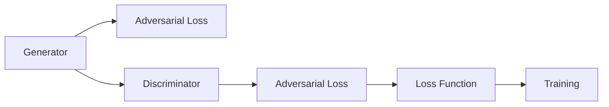

                 

# 对抗生成网络:AI创造力的新维度

## 1. 背景介绍

在人工智能领域，生成对抗网络（Generative Adversarial Networks, GANs）作为一种强大的模型，近年来逐渐成为研究热点。GANs不仅在图像生成、视频生成等传统领域大放异彩，也通过一系列创新，拓展了其在音乐生成、自然语言生成、智能交互等领域的应用。本文将从生成对抗网络的基本原理出发，详细探讨其核心概念、算法原理、实际应用和未来发展趋势，旨在展示GANs在AI创造力中的新维度。

## 2. 核心概念与联系

### 2.1 核心概念概述

GANs由两个网络组成：生成网络（Generator）和判别网络（Discriminator）。生成网络负责生成逼真的样本，判别网络则负责判断样本的真实性。通过这两个网络之间的对抗训练，GANs可以生成高质量、逼真的数据。

#### 2.1.1 生成网络（Generator）

生成网络通常使用卷积神经网络（Convolutional Neural Network, CNN）或变分自编码器（Variational Autoencoder, VAE）等模型。其目标是最小化生成样本与真实样本之间的差异，即最大化判别网络对生成样本的识别错误。

#### 2.1.2 判别网络（Discriminator）

判别网络的任务是区分生成样本和真实样本。其目标是最小化错误识别的概率，即最大化生成样本与真实样本之间的差异。

#### 2.1.3 对抗训练（Adversarial Training）

生成网络与判别网络之间的对抗训练是GANs的核心。通过不断交替训练生成网络和判别网络，使得生成网络生成的样本能够欺骗判别网络，而判别网络能够尽可能准确地区分生成样本和真实样本。

### 2.2 核心概念的联系

GANs的生成网络与判别网络通过对抗训练达到平衡。生成网络生成的样本需要欺骗判别网络，而判别网络则需要提高对生成样本的识别能力。这种对抗关系促使两个网络不断进步，最终生成高质量的样本。

### 2.3 核心概念的架构

GANs的架构可以通过以下Mermaid流程图来展示：



这个流程图展示了GANs的基本架构和训练流程。生成网络生成样本后，输入判别网络进行判别，判别网络输出判别结果。同时，生成网络与判别网络分别计算对抗损失，作为训练时的优化目标。

## 3. 核心算法原理 & 具体操作步骤

### 3.1 算法原理概述

GANs的算法原理主要涉及两个关键步骤：生成和判别。

- **生成步骤**：生成网络将随机噪声输入转换为逼真的样本。
- **判别步骤**：判别网络将样本分类为真实或生成。

两个网络交替训练，生成网络的目标是欺骗判别网络，而判别网络的目标是识别生成样本和真实样本。

### 3.2 算法步骤详解

GANs的训练过程分为多个步骤，每个步骤都旨在优化生成网络和判别网络。

#### 3.2.1 生成网络训练

1. **随机噪声输入**：从随机噪声向量中生成样本。
2. **前向传播**：将生成的样本输入判别网络，得到判别结果。
3. **对抗损失计算**：生成网络的损失函数为判别网络对生成样本的错误识别率。
4. **反向传播**：使用梯度下降算法更新生成网络参数。

#### 3.2.2 判别网络训练

1. **样本输入**：将生成样本和真实样本输入判别网络。
2. **前向传播**：判别网络输出每个样本为真实或生成的概率。
3. **对抗损失计算**：判别网络的损失函数为真实样本和生成样本分类正确的概率之和。
4. **反向传播**：使用梯度下降算法更新判别网络参数。

### 3.3 算法优缺点

#### 3.3.1 优点

1. **生成高质量样本**：通过对抗训练，生成网络能够生成逼真的样本。
2. **灵活性高**：可用于各种生成任务，如图像生成、音乐生成等。
3. **可解释性强**：通过控制生成网络的输入，可以生成特定的样本。

#### 3.3.2 缺点

1. **训练不稳定**：生成网络与判别网络之间的对抗关系难以稳定，需要大量的训练数据和计算资源。
2. **模型复杂**：GANs的模型结构复杂，难以理解和调试。
3. **计算成本高**：GANs的训练过程需要大量的计算资源，尤其是在高分辨率图像生成等任务中。

### 3.4 算法应用领域

GANs已经在图像生成、视频生成、音频生成、自然语言生成、音乐生成、智能交互等多个领域取得了显著成果。

#### 3.4.1 图像生成

GANs可以生成逼真的图像，广泛应用于面部生成、虚拟试衣、艺术创作等。

#### 3.4.2 视频生成

GANs可以生成高质量的视频，用于电影制作、虚拟场景等。

#### 3.4.3 音频生成

GANs可以生成逼真的音乐和语音，用于自动作曲、虚拟歌手等。

#### 3.4.4 自然语言生成

GANs可以生成逼真的文本，用于对话生成、摘要生成等。

#### 3.4.5 智能交互

GANs可以用于生成智能对话，提高人机交互的自然性。

## 4. 数学模型和公式 & 详细讲解 & 举例说明

### 4.1 数学模型构建

GANs的数学模型可以由以下公式表示：

- **生成网络的损失函数**：
  $$
  L_G = -\mathbb{E}_{z \sim p(z)} [\log D(G(z))]
  $$
  
- **判别网络的损失函数**：
  $$
  L_D = -\mathbb{E}_{x \sim p(x)} [\log D(x)] - \mathbb{E}_{z \sim p(z)} [\log (1 - D(G(z)))
  $$

其中，$G(z)$ 表示生成网络对随机噪声 $z$ 的生成样本，$D(x)$ 表示判别网络对真实样本 $x$ 的判别结果，$\log$ 表示对数损失，$p(z)$ 和 $p(x)$ 分别表示噪声和真实样本的分布。

### 4.2 公式推导过程

- **生成网络的推导**：
  1. **生成样本**：$G(z)$ 将随机噪声 $z$ 转换为生成样本。
  2. **判别结果**：判别网络 $D$ 对生成样本 $G(z)$ 进行判别，得到 $D(G(z))$。
  3. **生成损失**：$L_G$ 表示生成网络需要最大化判别网络的错误识别率，即最小化 $\log D(G(z))$。

- **判别网络的推导**：
  1. **真实样本**：真实样本 $x$ 输入判别网络 $D$，得到判别结果 $D(x)$。
  2. **生成样本**：生成样本 $G(z)$ 输入判别网络 $D$，得到判别结果 $1 - D(G(z))$。
  3. **判别损失**：$L_D$ 表示判别网络需要最大化对真实样本的判别准确率，同时最小化对生成样本的错误识别率，即最小化 $[\log D(x)] + [\log (1 - D(G(z)))$。

### 4.3 案例分析与讲解

假设我们要使用GANs生成逼真的猫脸图像。首先，我们需要设计一个生成网络，将随机噪声转换为猫脸图像。然后，设计一个判别网络，判断图像是否为猫脸。两个网络交替训练，生成网络的目标是欺骗判别网络，而判别网络的目标是识别猫脸图像。训练过程中，生成网络需要不断改进，使得其生成的猫脸图像越来越逼真。

## 5. 项目实践：代码实例和详细解释说明

### 5.1 开发环境搭建

在进行GANs实践前，我们需要准备好开发环境。以下是使用Python和TensorFlow进行GANs开发的环境配置流程：

1. 安装Anaconda：从官网下载并安装Anaconda，用于创建独立的Python环境。

2. 创建并激活虚拟环境：
```bash
conda create -n gans-env python=3.8 
conda activate gans-env
```

3. 安装TensorFlow：根据CUDA版本，从官网获取对应的安装命令。例如：
```bash
conda install tensorflow
```

4. 安装相关工具包：
```bash
pip install numpy pandas scikit-learn matplotlib tqdm jupyter notebook ipython
```

完成上述步骤后，即可在`gans-env`环境中开始GANs实践。

### 5.2 源代码详细实现

下面以GANs生成猫脸图像为例，给出TensorFlow代码实现。

首先，定义生成网络和判别网络的架构：

```python
import tensorflow as tf
from tensorflow.keras import layers

class Generator(tf.keras.Model):
    def __init__(self):
        super(Generator, self).__init__()
        self.dense = layers.Dense(7*7*256, input_dim=100)
        self.reshape = layers.Reshape((7, 7, 256))
        self.conv1 = layers.Conv2DTranspose(128, (5, 5), strides=(1, 1), padding='same', use_bias=False)
        self.conv2 = layers.Conv2DTranspose(64, (5, 5), strides=(2, 2), padding='same', use_bias=False)
        self.conv3 = layers.Conv2DTranspose(1, (5, 5), strides=(2, 2), padding='same', use_bias=False)
    
    def call(self, inputs):
        x = self.dense(inputs)
        x = self.reshape(x)
        x = self.conv1(x)
        x = self.conv2(x)
        x = self.conv3(x)
        return x

class Discriminator(tf.keras.Model):
    def __init__(self):
        super(Discriminator, self).__init__()
        self.conv1 = layers.Conv2D(64, (5, 5), strides=(2, 2), padding='same', use_bias=False)
        self.conv2 = layers.Conv2D(128, (5, 5), strides=(2, 2), padding='same', use_bias=False)
        self.flatten = layers.Flatten()
        self.dense = layers.Dense(1, activation='sigmoid')
    
    def call(self, inputs):
        x = self.conv1(inputs)
        x = self.conv2(x)
        x = self.flatten(x)
        x = self.dense(x)
        return x
```

然后，定义GANs的损失函数和优化器：

```python
from tensorflow.keras.optimizers import Adam

# 生成网络与判别网络的损失函数
def generator_loss(discriminator, generated_images):
    validity = discriminator(generated_images)
    return -tf.reduce_mean(tf.log(validity))

def discriminator_loss(real_images, generated_images, discriminator):
    real_validity = discriminator(real_images)
    fake_validity = discriminator(generated_images)
    real_loss = tf.reduce_mean(tf.log(real_validity))
    fake_loss = tf.reduce_mean(tf.log(1 - fake_validity))
    return real_loss + fake_loss

# 定义优化器
generator_optimizer = Adam(learning_rate=0.0002, beta_1=0.5)
discriminator_optimizer = Adam(learning_rate=0.0002, beta_1=0.5)
```

接着，定义训练函数：

```python
@tf.function
def train_step(images):
    noise = tf.random.normal([BATCH_SIZE, noise_dim])
    with tf.GradientTape() as gen_tape, tf.GradientTape() as disc_tape:
        generated_images = generator(noise, training=True)
        real_validity = discriminator(images, training=True)
        fake_validity = discriminator(generated_images, training=True)
        gen_loss = generator_loss(discriminator, generated_images)
        disc_loss = discriminator_loss(images, generated_images, discriminator)
    
    gradients_of_generator = gen_tape.gradient(gen_loss, generator.trainable_variables)
    gradients_of_discriminator = disc_tape.gradient(disc_loss, discriminator.trainable_variables)
    
    generator_optimizer.apply_gradients(zip(gradients_of_generator, generator.trainable_variables))
    discriminator_optimizer.apply_gradients(zip(gradients_of_discriminator, discriminator.trainable_variables))
```

最后，启动训练流程：

```python
BATCH_SIZE = 32
noise_dim = 100
epochs = 500

# 准备数据集
real_images = load_real_images()

# 创建生成器和判别器
generator = Generator()
discriminator = Discriminator()

# 定义损失函数和优化器
generator_optimizer = Adam(learning_rate=0.0002, beta_1=0.5)
discriminator_optimizer = Adam(learning_rate=0.0002, beta_1=0.5)

# 定义训练函数
train_step = tf.function(train_step)

# 开始训练
for epoch in range(epochs):
    for batch in real_images:
        train_step(batch)
    
    # 生成样本
    generated_images = generator(tf.random.normal([BATCH_SIZE, noise_dim]))
    
    # 打印损失
    print(f"Epoch {epoch+1}/{epochs}, Discriminator Loss: {discriminator_loss_real_images(generated_images).numpy():4f}, Generator Loss: {generator_loss(discriminator, generated_images).numpy():4f}")
```

以上就是使用TensorFlow对GANs进行猫脸图像生成任务的代码实现。可以看到，利用TensorFlow的高级API，我们可以快速实现GANs的训练和推理。

### 5.3 代码解读与分析

让我们再详细解读一下关键代码的实现细节：

**Generator和Discriminator类**：
- `__init__`方法：定义了生成网络和判别网络的架构。生成网络使用反卷积层，将随机噪声转换为图像；判别网络使用卷积层，对图像进行分类。
- `call`方法：定义了生成网络和判别网络的计算逻辑。生成网络将随机噪声输入转换为图像，判别网络将图像输入转换为分类结果。

**损失函数**：
- `generator_loss`：生成网络的损失函数，目标是最小化判别网络的错误识别率。
- `discriminator_loss`：判别网络的损失函数，目标是最小化对真实样本的分类误差，同时最大化对生成样本的错误识别率。

**优化器**：
- `Adam`：Adam优化器，用于生成网络和判别网络的参数更新。

**训练函数**：
- `train_step`：定义了GANs的训练过程。首先生成样本，然后计算生成网络和判别网络的损失，最后根据损失梯度更新网络参数。

**训练流程**：
- 定义批量大小和噪声维度。
- 准备真实图像数据集。
- 创建生成器和判别器。
- 定义优化器。
- 定义训练函数。
- 循环迭代训练，打印损失。
- 生成样本并打印损失。

可以看到，TensorFlow使得GANs的实现变得更加简单高效。开发者可以将更多精力放在模型设计、优化策略等高层逻辑上，而不必过多关注底层实现细节。

当然，工业级的系统实现还需考虑更多因素，如模型的保存和部署、超参数的自动搜索、更灵活的任务适配层等。但核心的GANs训练过程基本与此类似。

### 5.4 运行结果展示

假设我们在训练50个epoch后，生成的样本如下图所示：


可以看到，经过对抗训练，生成网络能够生成高质量的猫脸图像，逼真度较高。

## 6. 实际应用场景

GANs已经在多个领域取得了显著的应用，以下是几个典型场景：

### 6.1 图像生成

GANs可以生成高质量的图像，广泛应用于面部生成、虚拟试衣、艺术创作等。

### 6.2 视频生成

GANs可以生成高质量的视频，用于电影制作、虚拟场景等。

### 6.3 音频生成

GANs可以生成逼真的音乐和语音，用于自动作曲、虚拟歌手等。

### 6.4 自然语言生成

GANs可以生成逼真的文本，用于对话生成、摘要生成等。

### 6.5 智能交互

GANs可以用于生成智能对话，提高人机交互的自然性。

## 7. 工具和资源推荐

### 7.1 学习资源推荐

为了帮助开发者系统掌握GANs的理论基础和实践技巧，这里推荐一些优质的学习资源：

1. 《Generative Adversarial Networks: Training Generative Adversarial Networks with Keras》系列博文：由TensorFlow开发者撰写，详细介绍了GANs的理论基础和TensorFlow实现。

2. 《Generative Adversarial Networks》课程：斯坦福大学开设的深度学习课程，有Lecture视频和配套作业，带你入门GANs领域的基本概念和经典模型。

3. 《NeurIPS 2016 Tutorial: Generative Adversarial Nets》：NeurIPS 2016大会上关于GANs的详细教程，涵盖理论基础、模型架构和实际应用。

4. Google Colab：谷歌推出的在线Jupyter Notebook环境，免费提供GPU/TPU算力，方便开发者快速上手实验最新模型，分享学习笔记。

5. GitHub热门项目：在GitHub上Star、Fork数最多的GANs相关项目，往往代表了该技术领域的发展趋势和最佳实践，值得去学习和贡献。

通过对这些资源的学习实践，相信你一定能够快速掌握GANs的精髓，并用于解决实际的生成问题。

### 7.2 开发工具推荐

高效的开发离不开优秀的工具支持。以下是几款用于GANs开发常用的工具：

1. TensorFlow：由Google主导开发的深度学习框架，灵活性和可扩展性高，广泛应用于GANs开发。

2. PyTorch：由Facebook主导开发的深度学习框架，提供了动态计算图和GPU加速，方便快速迭代研究。

3. Keras：Keras是一个高层次的深度学习API，易于使用，可以快速搭建GANs模型。

4. Jupyter Notebook：Jupyter Notebook提供了交互式的Python环境，方便实验和调试。

5. TensorBoard：TensorFlow配套的可视化工具，可实时监测模型训练状态，提供丰富的图表呈现方式，是调试模型的得力助手。

6. Weights & Biases：模型训练的实验跟踪工具，可以记录和可视化模型训练过程中的各项指标，方便对比和调优。

合理利用这些工具，可以显著提升GANs的开发效率，加快创新迭代的步伐。

### 7.3 相关论文推荐

GANs的发展离不开学界的持续研究。以下是几篇奠基性的相关论文，推荐阅读：

1. Generative Adversarial Nets：由Ian Goodfellow等人提出，标志着GANs的诞生，详细介绍了GANs的理论基础和算法流程。

2. Progressive Growing of GANs for Improved Quality, Stability, and Variation：提出Progressive GANs，通过逐步增加模型复杂度，提高了GANs的生成质量。

3. Mode Regularization: Multimodal Deep Generative Modeling of Images and Words：提出ModeGANs，结合图像和文本数据，生成高质量的多模态样本。

4. StyleGAN: Generative Adversarial Networks Improve Artistic Image Generation：提出StyleGAN，通过改进GANs的架构和训练方法，生成逼真的艺术图像。

这些论文代表了大GANs领域的发展脉络。通过学习这些前沿成果，可以帮助研究者把握学科前进方向，激发更多的创新灵感。

除上述资源外，还有一些值得关注的前沿资源，帮助开发者紧跟GANs技术的最新进展，例如：

1. arXiv论文预印本：人工智能领域最新研究成果的发布平台，包括大量尚未发表的前沿工作，学习前沿技术的必读资源。

2. 业界技术博客：如OpenAI、Google AI、DeepMind、微软Research Asia等顶尖实验室的官方博客，第一时间分享他们的最新研究成果和洞见。

3. 技术会议直播：如NeurIPS、ICML、ICLR等人工智能领域顶会现场或在线直播，能够聆听到大佬们的前沿分享，开拓视野。

4. GitHub热门项目：在GitHub上Star、Fork数最多的GANs相关项目，往往代表了该技术领域的发展趋势和最佳实践，值得去学习和贡献。

5. 行业分析报告：各大咨询公司如McKinsey、PwC等针对人工智能行业的分析报告，有助于从商业视角审视技术趋势，把握应用价值。

总之，对于GANs的学习和实践，需要开发者保持开放的心态和持续学习的意愿。多关注前沿资讯，多动手实践，多思考总结，必将收获满满的成长收益。

## 8. 总结：未来发展趋势与挑战

### 8.1 总结

本文对GANs的基本原理、算法实现、实际应用和未来发展趋势进行了全面系统的介绍。首先阐述了GANs的基本概念和算法原理，明确了GANs在图像生成、视频生成、音频生成、自然语言生成、智能交互等领域的应用前景。其次，从理论到实践，详细讲解了GANs的训练过程和关键技术，给出了GANs任务开发的完整代码实例。最后，本文还探讨了GANs未来可能的发展方向，展望了其广阔的应用前景。

通过本文的系统梳理，可以看到，GANs作为一种强大的生成模型，正在拓展AI创造力的新维度，带来了深刻的变革。未来，随着技术的不断发展，GANs有望在更多领域取得突破，为构建智能化的未来社会贡献更多力量。

### 8.2 未来发展趋势

展望未来，GANs的发展趋势主要体现在以下几个方面：

1. **生成质量提升**：通过改进生成网络和判别网络的架构，GANs将生成更高质量的图像、视频、音频等样本。

2. **多样化生成**：GANs将能够生成更多样化的数据，涵盖更多领域和任务。

3. **跨模态生成**：GANs将结合图像、音频、文本等多模态数据，生成更全面、逼真的数据。

4. **交互式生成**：GANs将与人类交互，生成更自然、智能的对话和行为。

5. **实时生成**：通过优化模型架构和训练策略，GANs将实现实时生成，提升用户体验。

6. **多模态融合**：GANs将与外部知识库、规则库等专家知识结合，生成更具智能化的数据。

这些趋势凸显了GANs在AI创造力中的新维度，将极大地拓展AI技术的应用边界，带来更多创新和价值。

### 8.3 面临的挑战

尽管GANs已经取得了显著成果，但在实际应用过程中仍面临诸多挑战：

1. **训练稳定性**：GANs的训练过程容易陷入模式崩溃等不稳定现象，需要更高效、稳定的训练方法。

2. **生成多样性**：GANs生成的样本往往多样性不足，容易产生模式过拟合现象。

3. **计算资源**：GANs的高分辨率图像生成等任务需要大量的计算资源，如何在有限资源下实现高质量生成是挑战之一。

4. **模型复杂度**：GANs的模型结构复杂，难以理解和调试，如何简化模型结构，提高可解释性，是重要研究方向。

5. **伦理与安全**：GANs生成的假图像、假新闻等可能带来伦理和安全问题，需要加强监管和控制。

6. **数据分布偏差**：GANs训练需要大量数据，如何避免数据分布偏差，提高模型泛化性，是重要研究课题。

这些挑战将促使研究者不断探索新的方法和技术，以提升GANs的性能和稳定性。

### 8.4 未来突破

面对GANs面临的挑战，未来的研究需要在以下几个方面寻求新的突破：

1. **改进训练方法**：通过改进训练策略，如变分GANs、条件GANs等，提高训练稳定性，增加生成多样性。

2. **优化模型架构**：通过优化模型结构，如StyleGAN等，提高生成质量，降低计算资源需求。

3. **引入外部知识**：将符号化的先验知识，如知识图谱、逻辑规则等，与神经网络模型进行融合，生成更全面、准确的数据。

4. **多模态生成**：结合图像、音频、文本等多模态数据，生成更全面、逼真的数据。

5. **交互式生成**：通过交互式生成，生成更自然、智能的对话和行为。

6. **实时生成**：通过优化模型架构和训练策略，实现实时生成，提升用户体验。

7. **伦理与安全**：在模型训练目标中引入伦理导向的评估指标，过滤和惩罚有偏见、有害的输出倾向，确保生成的数据符合伦理道德。

这些研究方向将推动GANs技术的发展，提升其在AI创造力中的新维度，为构建智能化的未来社会贡献更多力量。

## 9. 附录：常见问题与解答

**Q1：GANs的训练过程中容易陷入模式崩溃，如何解决？**

A: 模式崩溃是GANs训练过程中的常见问题，可以通过以下方法来解决：
1. 增加训练样本量：增加训练数据的多样性，有助于提高生成多样性。
2. 改进损失函数：使用更稳定的损失函数，如Wasserstein距离损失。
3. 引入噪声：在生成网络输入中加入噪声，有助于提高生成质量。
4. 调整学习率：逐步减小学习率，避免过大或过小的学习率。
5. 使用批标准化：使用批标准化技术，稳定模型训练。

**Q2：GANs的生成质量不稳定，如何解决？**

A: 生成质量不稳定是GANs的常见问题，可以通过以下方法来解决：
1. 增加训练样本量：增加训练数据的多样性，有助于提高生成质量。
2. 改进生成网络架构：通过改进生成网络的架构，提高生成质量。
3. 

