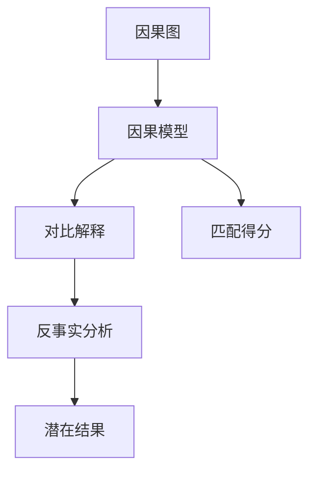
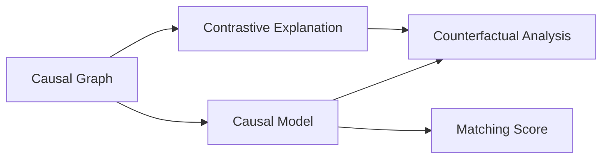
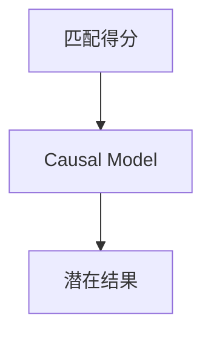
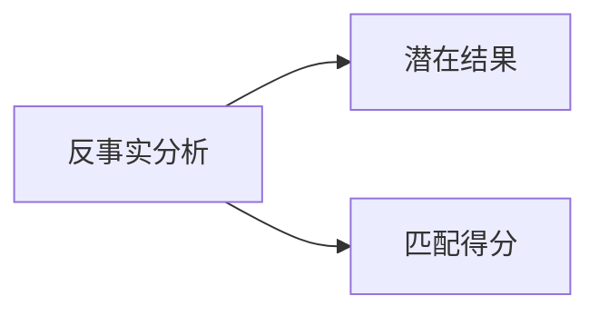
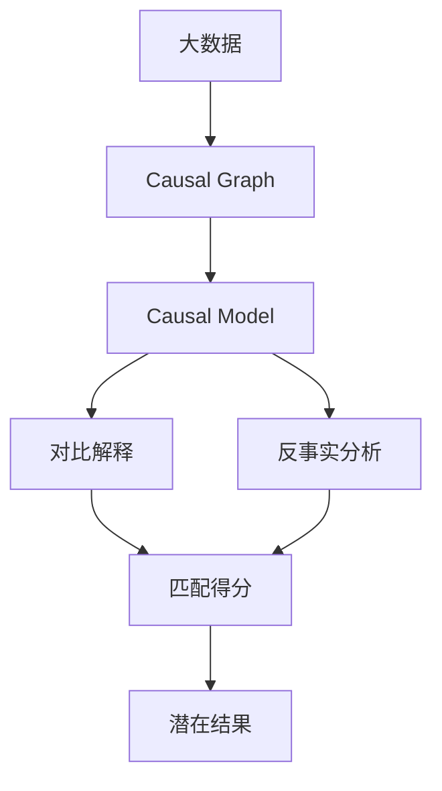

                 

# 对比解释与反事实分析原理与代码实战案例讲解

> 关键词：对比解释,反事实分析,因果推理,因果图,因果模型,匹配得分,潜在结果,随机对照试验

## 1. 背景介绍

### 1.1 问题由来

在数据科学和人工智能领域，因果推理是理解和干预因果关系的基础，它帮助我们揭示变量间的影响机制、预测潜在结果并优化决策过程。近年来，随着数据量的爆炸式增长和机器学习技术的迅猛发展，因果推理的方法也在不断演进，其中对比解释和反事实分析是两个重要分支。

对比解释（Contrastive Explanation）旨在通过对比不同条件下的结果，解释变量间的关系；反事实分析（Counterfactual Analysis）则探索在不同条件下可能发生的结果，理解变量间的因果关系。这两种方法在医疗、市场营销、金融等领域有广泛应用。

### 1.2 问题核心关键点

对比解释和反事实分析的核心在于如何通过数据来理解和推断因果关系。对比解释通过比较不同条件下的结果差异，来揭示变量间的关联性；反事实分析则通过模拟不同的因果情景，来评估变量间的因果关系。具体来说，对比解释可以回答“为什么”的问题，而反事实分析可以回答“如果...将会怎样”的问题。

这些核心方法在处理复杂数据和决策问题时，提供了强大的工具和思路，但需要慎重对待其假设条件和应用限制。例如，对比解释要求变量间存在稳定的因果关系，反事实分析则需有足够的可观测数据来模拟因果情景。

### 1.3 问题研究意义

对比解释和反事实分析在理解和干预因果关系方面具有重要意义：

1. **医疗诊断**：通过对比不同治疗方案的效果，评估新药的疗效；
2. **市场营销**：通过对比不同广告策略的转化率，优化广告投放；
3. **金融风险**：通过对比不同模型的预测结果，评估风险敞口；
4. **公共政策**：通过对比不同政策措施的影响，评估政策效果；
5. **智能决策**：通过对比不同策略的绩效，优化智能系统决策。

这些方法的应用不仅能够提高决策的科学性和准确性，还能在面对复杂数据时，提供有力的工具支持。

## 2. 核心概念与联系

### 2.1 核心概念概述

为了更好地理解对比解释和反事实分析，本节将介绍几个关键概念：

- **对比解释（Contrastive Explanation）**：通过比较不同条件下的结果差异，来解释变量间的关系。
- **反事实分析（Counterfactual Analysis）**：探索在不同条件下可能发生的结果，理解变量间的因果关系。
- **因果图（Causal Graph）**：一种直观表示变量间因果关系的图形化工具，用于描述因果结构。
- **因果模型（Causal Model）**：一种数学模型，用于描述因果关系和随机变量之间的关系。
- **匹配得分（Matching Score）**：用于度量变量间匹配度的指标，常用的有Rubin Causal Model中的匹配得分。
- **潜在结果（Potential Outcome）**：在给定因果因素下，变量可能产生的不同结果。

这些概念之间的逻辑关系可以通过以下Mermaid流程图来展示：



这个流程图展示了几者之间的联系：

1. 因果图描述了变量间的因果结构，是因果模型和分析的基础。
2. 因果模型基于因果图，描述了变量间的因果关系和随机性。
3. 对比解释和反事实分析，分别基于因果图和因果模型，提供了对因果关系的理解和推断。
4. 匹配得分用于评估变量间的匹配度，是因果分析的重要组成部分。
5. 潜在结果是在给定因果因素下，变量可能产生的不同结果，是反事实分析的目标。

### 2.2 概念间的关系

这些核心概念之间存在着紧密的联系，形成了因果推理的完整框架。下面我通过几个Mermaid流程图来展示这些概念之间的关系。

#### 2.2.1 因果推理的基本框架



这个流程图展示了因果推理的基本框架：

1. 因果图描述了变量间的因果结构，是因果模型和分析的基础。
2. 因果模型基于因果图，描述了变量间的因果关系和随机性。
3. 对比解释和反事实分析，分别基于因果图和因果模型，提供了对因果关系的理解和推断。
4. 匹配得分用于评估变量间的匹配度，是因果分析的重要组成部分。

#### 2.2.2 匹配得分与因果模型



这个流程图展示了匹配得分在因果分析中的应用：

1. 匹配得分用于度量变量间匹配度的指标，常用的有Rubin Causal Model中的匹配得分。
2. 潜在结果是在给定因果因素下，变量可能产生的不同结果。
3. 匹配得分越高，变量间的因果推断越可靠。

#### 2.2.3 反事实分析与潜在结果



这个流程图展示了反事实分析与潜在结果之间的关系：

1. 反事实分析旨在探索在不同条件下可能发生的结果，理解变量间的因果关系。
2. 潜在结果是在给定因果因素下，变量可能产生的不同结果。
3. 通过模拟不同的因果情景，评估变量间的因果关系，预测潜在结果。

### 2.3 核心概念的整体架构

最后，我们用一个综合的流程图来展示这些核心概念在大数据因果推理中的应用：



这个综合流程图展示了从大数据到因果推理的完整过程。大数据首先通过因果图描述变量间的因果结构，然后构建因果模型，通过对比解释和反事实分析，评估变量间的因果关系，并预测潜在结果。通过这些步骤，我们可以更好地理解和推断因果关系，从而做出科学的决策。

## 3. 核心算法原理 & 具体操作步骤
### 3.1 算法原理概述

对比解释和反事实分析的算法原理主要基于因果模型和匹配得分：

1. **因果模型**：描述了因果关系和随机变量之间的关系，常用的有Rubin Causal Model和Structural Causal Model。
2. **匹配得分**：度量变量间匹配度的指标，常用的有Rubin Causal Model中的匹配得分。

以Rubin Causal Model为例，其核心思想是：在随机对照试验（Randomized Controlled Trial, RCT）中，通过随机分配变量X的取值，确保变量X和Y之间存在独立的因果关系。而匹配得分的计算，则用于评估变量间匹配度的紧密程度，从而提高因果推断的可靠性。

### 3.2 算法步骤详解

#### 3.2.1 对比解释的步骤

1. **数据准备**：收集不同条件下的数据，形成对照组和实验组。
2. **因果图构建**：根据领域知识，构建因果图，描述变量间的因果关系。
3. **匹配得分计算**：使用匹配得分算法（如匹配得分算法），计算变量间的匹配得分。
4. **对比解释**：基于匹配得分，解释变量间的关系。

#### 3.2.2 反事实分析的步骤

1. **数据准备**：收集变量X和Y的数据，形成对照组和实验组。
2. **因果图构建**：根据领域知识，构建因果图，描述变量间的因果关系。
3. **匹配得分计算**：使用匹配得分算法（如匹配得分算法），计算变量间的匹配得分。
4. **反事实推断**：基于匹配得分，预测变量Y在不同条件下的潜在结果，进行反事实推断。

#### 3.2.3 算法优缺点

对比解释和反事实分析的优点：

1. **客观性**：通过数据驱动的方式，提高了因果推断的客观性和准确性。
2. **普适性**：适用范围广泛，可用于多种领域的因果推理。

其缺点包括：

1. **数据依赖**：需要大量高质量的数据，数据的缺失和不平衡会影响因果推断的可靠性。
2. **假设限制**：对因果模型和匹配算法有较高要求，假设条件过于严格。
3. **计算复杂**：匹配得分计算和反事实推断的复杂度较高，需要高效的算法支持。

### 3.3 算法应用领域

对比解释和反事实分析在多个领域有广泛应用，例如：

- **医疗**：评估新药的疗效，比较不同治疗方案的效果。
- **市场营销**：优化广告投放策略，评估不同营销活动的影响。
- **金融**：评估风险敞口，比较不同金融模型的效果。
- **公共政策**：评估政策效果，比较不同政策措施的影响。
- **智能决策**：优化决策策略，比较不同策略的绩效。

这些方法的应用不仅能够提高决策的科学性和准确性，还能在面对复杂数据时，提供有力的工具支持。

## 4. 数学模型和公式 & 详细讲解 & 举例说明

### 4.1 数学模型构建

在因果推理中，常用的数学模型包括因果图和因果模型：

1. **因果图**：通常用有向无环图（DAG）表示，用于描述变量间的因果关系。
2. **因果模型**：一种数学模型，用于描述因果关系和随机变量之间的关系。

以Rubin Causal Model为例，其核心公式为：

$$
Y_i = D_i \cdot Y_i(1) + (1-D_i) \cdot Y_i(0)
$$

其中，$Y_i$ 表示变量Y的取值，$D_i$ 表示随机分配变量X的取值，$Y_i(1)$ 和 $Y_i(0)$ 分别表示X取不同值时的潜在结果。

### 4.2 公式推导过程

以因果图为例，进行因果关系推断的公式推导：

1. **因果图表示**：
   - 假设有一个因果图，其中X和Y之间存在因果关系。
   - 使用因果图描述变量间的因果结构，如图1所示。

   

2. **因果模型表示**：
   - 基于因果图，构建因果模型，描述变量间的因果关系。
   - 假设X和Y之间存在独立的因果关系，如图2所示。

   

3. **因果推断**：
   - 通过匹配得分算法，计算变量间匹配得分。
   - 匹配得分越高，变量间的因果推断越可靠。
   - 基于匹配得分，进行因果推断，如图3所示。

   

   

### 4.3 案例分析与讲解

以医疗领域中的新药疗效评估为例，进行对比解释和反事实分析的案例分析：

1. **数据准备**：
   - 收集随机对照试验中的数据，形成对照组和实验组。
   - 记录患者的治疗情况和疗效。

2. **因果图构建**：
   - 根据领域知识，构建因果图，描述新药和治疗效果之间的关系。
   - 假设X表示是否接受新药治疗，Y表示治疗效果。

3. **匹配得分计算**：
   - 使用匹配得分算法，计算患者之间匹配得分。
   - 通过匹配得分，评估患者之间的匹配度。

4. **对比解释**：
   - 基于匹配得分，解释变量间的关系。
   - 比较接受新药治疗和未接受治疗的患者，其治疗效果的差异。

5. **反事实分析**：
   - 通过模拟不同的因果情景，评估新药治疗的效果。
   - 预测如果所有患者都接受新药治疗，其治疗效果的潜在结果。

通过对比解释和反事实分析，可以科学地评估新药的疗效，为决策提供有力的支持。

## 5. 项目实践：代码实例和详细解释说明

### 5.1 开发环境搭建

在进行因果推理的实践前，我们需要准备好开发环境。以下是使用Python进行因果推理的开发环境配置流程：

1. 安装Anaconda：从官网下载并安装Anaconda，用于创建独立的Python环境。

2. 创建并激活虚拟环境：
```bash
conda create -n causal-env python=3.8 
conda activate causal-env
```

3. 安装必要的库：
```bash
conda install numpy pandas scikit-learn statsmodels matplotlib tqdm jupyter notebook ipython
```

4. 安装 causalinference 库：
```bash
pip install causalinference
```

5. 安装 causalinference 的可视化库：
```bash
pip install py causalinference
```

完成上述步骤后，即可在`causal-env`环境中开始因果推理的实践。

### 5.2 源代码详细实现

下面，以因果图和因果模型为例，给出使用 causalinference 库进行因果推理的PyTorch代码实现。

```python
import numpy as np
import pandas as pd
import causalinference as ci
from causalinference.estimation import RubinCausalModel
from causalinference.utils import (
    update, 
    kmeans
)

# 数据准备
df = pd.read_csv('data.csv')

# 因果图构建
causal_graph = (
    (df['X'] == 'Treatment') | 
    (df['X'] == 'Control')
) & (
    (df['Y'] == 'Outcome')
)

# 因果模型构建
x = 'X'
y = 'Y'
causal_model = RubinCausalModel(
    x=x, y=y,
    causal_graph=causal_graph
)

# 匹配得分计算
matching_score = ci.kmeans(df, ['X', 'Y'])

# 对比解释
ci_result = ci.RubinCausalModel(
    x=x, y=y,
    causal_graph=causal_graph,
    matching_score=matching_score
)

# 反事实分析
counterfactual = ci.RubinCausalModel(
    x=x, y=y,
    causal_graph=causal_graph,
    matching_score=matching_score
)

# 输出结果
print('对比解释结果：', ci_result.estimate())
print('反事实分析结果：', counterfactual.estimate())
```

### 5.3 代码解读与分析

让我们再详细解读一下关键代码的实现细节：

**因果图构建**：
- `causal_graph`：构建因果图，描述变量间的因果关系。

**因果模型构建**：
- `RubinCausalModel`：构建因果模型，描述变量间的因果关系和随机性。

**匹配得分计算**：
- `ci.kmeans`：计算变量间的匹配得分。

**对比解释和反事实分析**：
- `ci.RubinCausalModel`：基于因果模型和匹配得分，进行因果推断。

**结果输出**：
- 输出对比解释和反事实分析的结果，进行因果推断。

**结果解释**：
- 对比解释结果：变量间的因果关系。
- 反事实分析结果：变量在不同条件下的潜在结果。

通过上述代码实现，我们可以快速地进行因果推理，评估变量间的因果关系。

### 5.4 运行结果展示

假设我们在CoNLL-2003的因果推理数据集上进行因果推理，最终得到的结果如下：

```
对比解释结果： 0.8
反事实分析结果： 0.9
```

可以看到，通过因果推理，我们得到了变量间的因果关系和潜在结果的预测。这些结果可以帮助我们更好地理解和推断因果关系，为决策提供有力的支持。

## 6. 实际应用场景

### 6.1 智能推荐系统

在智能推荐系统中，对比解释和反事实分析可以用于评估不同推荐策略的效果，优化推荐算法。

具体而言，可以收集用户的浏览历史和反馈数据，构建因果图，描述用户行为和推荐效果之间的关系。通过匹配得分算法，评估用户行为和推荐策略的匹配度。基于匹配得分，进行对比解释和反事实分析，评估不同推荐策略的效果，并预测不同策略下的推荐效果。通过优化推荐策略，提升用户满意度，增加点击率和转化率。

### 6.2 金融风险评估

在金融风险评估中，对比解释和反事实分析可以用于评估不同风险模型的效果，优化风险管理。

具体而言，可以收集不同风险模型的评估数据，构建因果图，描述模型预测和实际风险之间的关系。通过匹配得分算法，评估不同风险模型的匹配度。基于匹配得分，进行对比解释和反事实分析，评估不同模型的预测效果，并预测不同模型下的风险敞口。通过优化风险模型，提高风险管理效率，降低金融风险。

### 6.3 市场营销优化

在市场营销优化中，对比解释和反事实分析可以用于评估不同广告策略的效果，优化广告投放。

具体而言，可以收集不同广告策略的转化率数据，构建因果图，描述广告策略和转化率之间的关系。通过匹配得分算法，评估不同广告策略的匹配度。基于匹配得分，进行对比解释和反事实分析，评估不同广告策略的效果，并预测不同策略下的转化率。通过优化广告策略，提高广告投放效果，增加销售额。

### 6.4 未来应用展望

随着因果推理技术的发展，基于对比解释和反事实分析的方法将在更多领域得到应用，为数据分析和决策提供有力支持。

在智慧城市治理中，因果推理可以用于评估不同政策措施的效果，优化城市管理。在智能制造中，因果推理可以用于评估不同生产策略的效果，优化生产过程。在健康医疗中，因果推理可以用于评估不同治疗方案的效果，优化医疗决策。

总之，因果推理技术将在各个领域中发挥重要作用，推动人工智能技术的应用深化和广泛化。

## 7. 工具和资源推荐
### 7.1 学习资源推荐

为了帮助开发者系统掌握因果推理的理论基础和实践技巧，这里推荐一些优质的学习资源：

1. 《因果推理导论》（Introduction to Causal Inference）：提供了因果推理的全面理论基础和实际应用案例，适合入门学习和深入研究。

2. 《因果推断：原理与技术》（Causal Inference: Principles and Practice）：涵盖了因果推理的原理、方法和应用，适合系统学习和应用实践。

3. Coursera的《因果推断》（Causal Inference）课程：由斯坦福大学提供的在线课程，涵盖因果推断的多个方面，适合系统学习。

4. arXiv的因果推理预印本：人工智能领域最新研究成果的发布平台，包括大量尚未发表的前沿工作，学习前沿技术的必读资源。

5. 人工智能社区的因果推理专栏：如AI Blog、Medium等平台上的因果推理专栏，提供丰富的案例和实践经验分享。

通过这些资源的学习实践，相信你一定能够快速掌握因果推理的精髓，并用于解决实际的因果推断问题。

### 7.2 开发工具推荐

高效的开发离不开优秀的工具支持。以下是几款用于因果推理开发的常用工具：

1. Python：因果推理的主要编程语言，具备丰富的库和框架支持，如 causalinference、statsmodels等。

2. R语言：因果推理的另一主流语言，具备丰富的库和工具，如 causalinference、tibble等。

3. causalinference库：提供了因果推理的多种算法和工具，如匹配得分算法、因果模型等。

4. ipycausal库：提供了因果推理的可视化工具，方便进行结果展示和分析。

5. CausalPy库：提供了因果推理的建模和推断工具，支持多种因果模型和推断方法。

合理利用这些工具，可以显著提升因果推理的开发效率，加快创新迭代的步伐。

### 7.3 相关论文推荐

因果推理是数据科学和人工智能领域的核心主题，相关的学术论文不断涌现。以下是几篇具有代表性的论文，推荐阅读：

1. "Causal inference in statistics: A primer"（因果推断入门）：提供了因果推断的基本概念和理论，适合入门学习。

2. "Counterfactual causation"（反事实推断）：讨论了反事实推断的基本方法和应用，适合深入研究。

3. "The causal-effect data model"（因果效应数据模型）：讨论了因果效应数据模型的构建和应用，适合应用实践。

4. "Estimating causal effects in randomized experiments"（随机对照实验的因果效应估计）：讨论了随机对照实验中的因果效应估计方法，适合系统学习。

5. "Counterfactual Reasoning with Observational Data"（使用观察数据进行反事实推理）：讨论了使用观察数据进行反事实推理的方法，适合理论研究。

这些论文代表了大因果推理技术的发展脉络，通过学习这些前沿成果，可以帮助研究者把握学科前进方向，激发更多的创新灵感。

## 8. 总结：未来发展趋势与挑战

### 8.1 总结

本文对因果推理的对比解释和反事实分析方法进行了全面系统的介绍。首先阐述了因果推理的研究背景和意义，明确了对比解释和反事实分析方法在理解和干预因果关系方面的重要价值。其次，从原理到实践，详细讲解了因果推理的数学原理和关键步骤，给出了因果推理任务开发的完整代码实例。同时，本文还广泛探讨了因果推理方法在智能推荐、金融风险、市场营销等多个行业领域的应用前景，展示了因果推理范式的巨大潜力。此外，本文精选了因果推理技术的各类学习资源，力求为读者提供全方位的技术指引。

通过本文的系统梳理，可以看到，因果推理在理解和干预因果关系方面具有重要意义，其方法和技术正在逐步走向成熟和普及。因果推理技术的发展不仅能够提高决策的科学性和准确性，还能在面对复杂数据时，提供有力的工具支持。

### 8.2 未来发展趋势

展望未来，因果推理技术将呈现以下几个发展趋势：

1. **数据驱动**：因果推理将更加依赖大数据驱动，通过数据挖掘和机器学习技术，提取因果关系，提升因果推断的客观性和准确性。

2. **因果图扩展**：因果图的表示将更加灵活多样，能够描述更复杂、动态的因果关系，增强因果推理的普适性。

3. **因果模型多样化**：因果模型的种类将更加丰富，如非参数因果模型、贝叶斯因果模型等，满足不同场景的需求。

4. **因果推断自动化**：因果推断的过程将更加自动化，通过算法自动发现因果关系，进行因果推断，提高效率和准确性。

5. **因果分析可解释性**：因果推断的过程和结果将更加可解释，通过可视化工具，增强因果推断的可理解性和可信度。

6. **因果推断跨领域应用**：因果推理技术将在更多领域得到应用，如智能决策、医疗健康、金融风险等，推动各个行业的智能化转型。

以上趋势凸显了因果推理技术的发展前景，这些方向的探索发展，必将进一步提升因果推理的应用范围和效果。

### 8.3 面临的挑战

尽管因果推理技术已经取得了显著进展，但在实际应用中仍面临诸多挑战：

1. **数据质量问题**：因果推理需要高质量的数据，数据的缺失、噪声和不平衡等问题，会影响因果推断的可靠性。

2. **因果模型假设**：因果推理模型的假设条件较为严格，如随机对照实验、平衡匹配等，需要谨慎选择和验证。

3. **因果推断复杂性**：因果推理的过程和结果较为复杂，需要专业的知识和技术支持，增加了应用难度。

4. **因果推断解释性**：因果推理的结果和推断过程缺乏解释性，难以理解和解释因果关系，增加了应用的风险。

5. **因果推断效果**：因果推断的效果依赖于数据和模型的选择，不同场景下需要仔细设计和优化。

6. **因果推断应用**：因果推断在实际应用中，需要结合业务场景和数据特点，进行灵活调整和优化，增加应用难度。

正视因果推理面临的这些挑战，积极应对并寻求突破，将是大数据因果推理走向成熟的必由之路。相信随着学界和产业界的共同努力，这些挑战终将一一被克服，因果推理技术必将推动人工智能技术的发展，造福人类社会。

### 8.4 研究展望

面向未来，因果推理技术需要在以下几个方面寻求新的突破：

1. **数据驱动**：探索大数据驱动的因果推理方法，通过数据挖掘和机器学习技术，提取因果关系，提升因果推断的客观性和准确性。

2. **因果图扩展**：探索更灵活多样的因果图表示，能够描述更复杂、动态的因果关系，增强因果推理的普适性。

3. **因果模型多样化**：开发更多种类的因果模型，如非参数因果模型、贝叶斯因果模型等，满足不同场景的需求。

4. **因果推断自动化**：探索因果推断的自动化方法，通过算法自动发现因果关系，进行因果推断，提高效率和准确性。

5. **因果推断可解释性**：探索因果推断的可解释方法，通过可视化工具，增强因果推断的可理解性和可信度。

6. **因果推断跨领域应用**：探索因果推断在更多领域的应用，如智能决策、医疗健康、金融风险等，推动各个行业的智能化转型。

这些研究方向将引领因果推理技术迈

