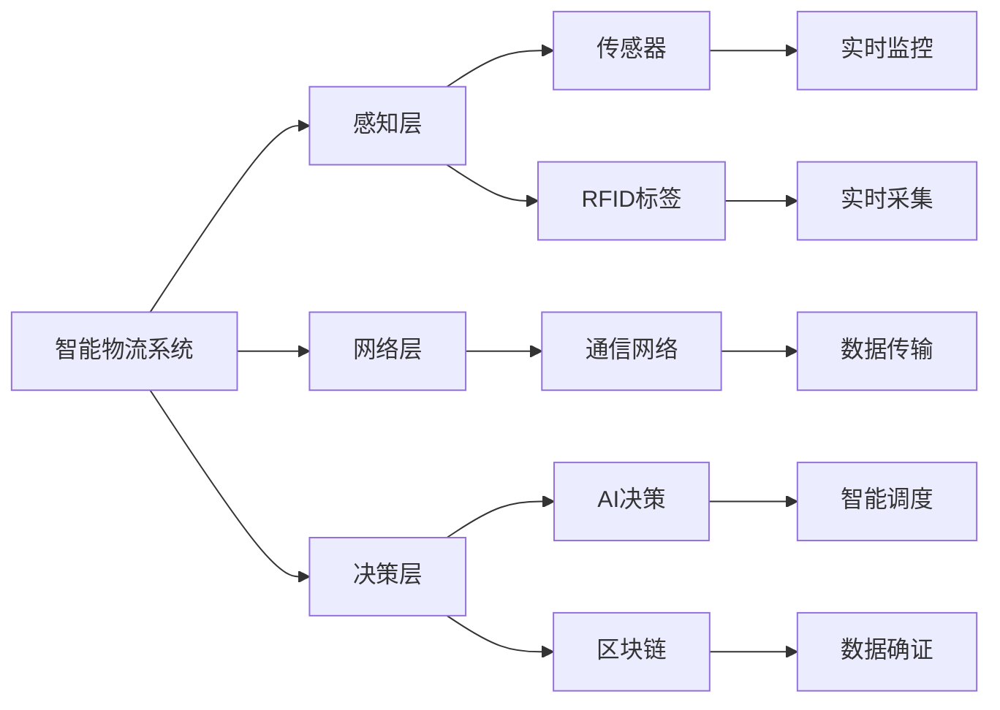
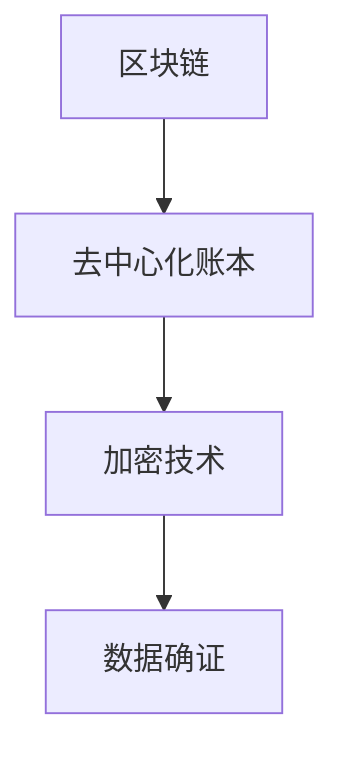

                 

# 工具使用机制在智能物流系统中的应用

> 关键词：智能物流系统,工具使用机制,智能仓储,物流规划,配送优化,自动化技术,物联网(IoT),区块链,人工智能(AI),机器学习

## 1. 背景介绍

### 1.1 问题由来
随着电子商务的迅猛发展，全球物流行业正面临着前所未有的挑战。传统物流系统在效率、成本和客户体验等方面存在诸多瓶颈。智能化转型成为物流企业必须应对的重大课题。在智能物流系统的构建过程中，工具使用机制扮演着至关重要的角色。通过科学合理地选择和使用各种工具，可以大幅提升物流系统的运行效率，降低运营成本，提升客户满意度。

### 1.2 问题核心关键点
智能物流系统的工具使用机制涉及以下关键点：
- 工具选择：在考虑需求、预算和可行性的基础上，选择合适的工具，如物联网(IoT)设备、RFID标签、自动驾驶车辆等。
- 工具集成：将各类工具与现有系统无缝对接，实现数据的实时采集、传输和分析。
- 数据管理：构建数据湖、数据仓库等基础设施，存储和管理大量物流数据。
- 分析决策：应用机器学习、人工智能等算法对数据进行分析，形成决策依据。
- 自动化流程：利用自动化技术优化物流流程，提升效率和可靠性。

### 1.3 问题研究意义
研究智能物流系统的工具使用机制，对于提升物流系统的智能化水平、降低运营成本、提高客户体验具有重要意义：

1. 提升效率：通过科学工具的使用，优化物流各环节，提升整体运行效率。
2. 降低成本：利用自动化和智能化工具，减少人力成本，提升资源利用率。
3. 改善体验：提供实时、准确的物流信息，增强客户服务质量。
4. 数据驱动：基于大数据分析，优化物流规划和配送路径，提升决策科学性。
5. 安全可靠：利用区块链技术确保数据真实性和传输安全性，提高系统可靠性。

## 2. 核心概念与联系

### 2.1 核心概念概述

为了更好地理解智能物流系统工具使用机制，本节将介绍几个密切相关的核心概念：

- 智能物流系统：利用物联网、人工智能、区块链等技术，实现物流各环节的智能化管理。
- 物联网(IoT)：通过各种传感器和标签设备，实现对物流物品的实时监控和管理。
- 自动化技术：应用自动化机械、机器人、无人驾驶等技术，提升物流自动化水平。
- 人工智能(AI)：通过机器学习、深度学习等算法，实现物流数据分析和智能决策。
- 区块链：利用去中心化账本和加密技术，确保物流数据的真实性和安全性。
- 数据湖和数据仓库：构建大型数据存储平台，存储和处理海量物流数据。

这些核心概念之间的逻辑关系可以通过以下Mermaid流程图来展示：

```mermaid
graph TB
    A[智能物流系统] --> B[物联网(IoT)]
    A --> C[自动化技术]
    A --> D[人工智能(AI)]
    A --> E[区块链]
    A --> F[数据湖]
    A --> G[数据仓库]
    B --> H[实时监控]
    B --> I[自动化调度]
    C --> J[自动化仓储]
    C --> K[自动化配送]
    D --> L[数据分析]
    D --> M[智能决策]
    E --> N[数据确证]
    E --> O[智能合约]
    F --> P[大数据存储]
    G --> Q[数据处理]
```

这个流程图展示了几类关键工具在智能物流系统中的作用：

1. 物联网设备实现实时监控和调度。
2. 自动化技术提升仓储和配送效率。
3. 人工智能技术用于数据分析和决策。
4. 区块链技术保障数据安全和透明。
5. 数据湖和数据仓库存储和管理海量物流数据。

### 2.2 概念间的关系

这些核心概念之间存在着紧密的联系，形成了智能物流系统的完整架构。下面我们通过几个Mermaid流程图来展示这些概念之间的关系。

#### 2.2.1 智能物流系统的层次结构



这个流程图展示了智能物流系统的层次结构：

1. 感知层通过传感器和RFID标签实现对物流物品的实时监控。
2. 网络层通过通信网络将感知层的数据实时传输到决策层。
3. 决策层基于人工智能和区块链技术，对数据进行分析并形成决策。

#### 2.2.2 物联网(IoT)与自动化技术的关系

```mermaid
graph TB
    A[物联网(IoT)] --> B[传感器]
    B --> C[RFID标签]
    C --> D[实时监控]
    D --> E[数据采集]
    A --> F[自动化调度]
    F --> G[自动化仓储]
    G --> H[自动驾驶]
```

这个流程图展示了物联网和自动化技术的紧密结合：

1. IoT设备通过传感器和RFID标签实现对物流物品的实时监控。
2. 自动化技术通过仓储机器人、自动驾驶车辆等实现对物流流程的自动化管理。

#### 2.2.3 人工智能与数据分析的关系

```mermaid
graph LR
    A[人工智能(AI)] --> B[机器学习]
    B --> C[深度学习]
    C --> D[数据分析]
    D --> E[智能决策]
```

这个流程图展示了人工智能在数据分析中的应用：

1. AI技术通过机器学习和深度学习等算法，实现对物流数据的分析和处理。
2. 数据分析结果用于智能决策，如路径优化、库存管理等。

#### 2.2.4 区块链与数据确证的关系



这个流程图展示了区块链在数据确证中的应用：

1. 区块链通过去中心化账本和加密技术，确保物流数据的真实性和不可篡改性。
2. 数据确证结果用于审计和溯源，提升系统的可信度和透明度。

### 2.3 核心概念的整体架构

最后，我们用一个综合的流程图来展示这些核心概念在大规模物流系统中的整体架构：

```mermaid
graph TB
    A[大规模物流数据] --> B[数据湖]
    B --> C[数据仓库]
    C --> D[数据挖掘]
    D --> E[数据分析]
    E --> F[机器学习]
    F --> G[深度学习]
    G --> H[人工智能(AI)]
    H --> I[智能决策]
    A --> J[物联网(IoT)]
    J --> K[实时监控]
    J --> L[自动化调度]
    K --> M[传感器]
    L --> N[RFID标签]
    A --> O[自动化技术]
    O --> P[自动化仓储]
    O --> Q[自动化配送]
    P --> R[仓储机器人]
    Q --> S[自动驾驶]
    I --> T[区块链]
    T --> U[去中心化账本]
    T --> V[加密技术]
    U --> W[数据确证]
    W --> X[智能合约]
```

这个综合流程图展示了从数据采集到智能决策的全过程：

1. 物联网设备采集大量物流数据。
2. 数据存储在数据湖和数据仓库中。
3. 数据经过挖掘、分析和机器学习等处理。
4. 人工智能技术形成智能决策。
5. 区块链技术确保数据确证和智能合约执行。

## 3. 核心算法原理 & 具体操作步骤
### 3.1 算法原理概述

智能物流系统工具使用机制的核心算法原理涉及以下几个方面：

- 数据采集与传输：通过物联网设备实时采集物流数据，并通过网络传输到数据仓库。
- 数据分析与处理：对采集到的数据进行挖掘、分析和建模，形成数据仓库中的结构化数据。
- 智能决策与优化：利用机器学习、深度学习和强化学习等算法，对数据进行分析，形成决策依据，优化物流路径、库存管理等流程。
- 区块链应用：通过区块链技术，确保数据确证和智能合约执行，提升系统的透明度和可信度。

### 3.2 算法步骤详解

智能物流系统工具使用机制的主要操作步骤包括：

1. 数据采集与预处理
   - 选择合适的物联网设备（传感器、RFID标签等），实现对物流物品的实时监控。
   - 通过数据清洗、去噪等预处理技术，提高数据质量。

2. 数据存储与管理
   - 构建数据湖和数据仓库，存储和管理大量的物流数据。
   - 利用大数据技术，进行数据挖掘和分析，形成结构化数据。

3. 数据分析与建模
   - 应用机器学习和深度学习等算法，对数据进行建模和预测。
   - 利用强化学习等技术，优化物流路径、配送计划等流程。

4. 智能决策与执行
   - 基于数据分析结果，形成智能决策。
   - 利用自动化技术，执行决策并监控执行效果。

5. 数据确证与透明
   - 利用区块链技术，确保数据确证和智能合约执行。
   - 实时监控系统行为，形成透明的审计日志。

### 3.3 算法优缺点

智能物流系统工具使用机制的优点包括：

- 数据实时性：通过物联网设备实时采集数据，保证数据的及时性。
- 数据分析能力：应用大数据和人工智能技术，提升数据分析能力。
- 自动化程度高：利用自动化技术，提升操作效率和准确性。
- 决策科学性：基于数据分析和建模，形成科学决策。
- 透明度高：利用区块链技术，确保数据确证和透明。

缺点包括：

- 初期投资大：需要购买大量物联网设备和存储设施，初期投入较高。
- 技术复杂度高：涉及物联网、人工智能、区块链等多种技术，技术复杂度较高。
- 系统维护成本高：需要高水平的技术团队进行系统维护和更新。
- 数据安全风险：数据确证和透明，可能面临数据泄露和篡改的风险。

### 3.4 算法应用领域

智能物流系统工具使用机制广泛应用于以下领域：

- 智能仓储管理：通过物联网设备监控仓储环境，自动化仓储机器人进行物资管理。
- 物流路径优化：应用机器学习算法分析历史物流数据，优化物流路径和配送计划。
- 供应链管理：通过区块链技术确保供应链数据的透明和可追溯性。
- 智能客服：利用自然语言处理技术，提升客服响应效率和质量。
- 智能交通：通过智能调度系统和自动驾驶技术，提升运输效率和安全性。

## 4. 数学模型和公式 & 详细讲解 & 举例说明

### 4.1 数学模型构建

本节将使用数学语言对智能物流系统工具使用机制进行更加严格的刻画。

记物流系统采集到的原始数据为 $X=\{x_1, x_2, ..., x_n\}$，其中 $x_i$ 表示第 $i$ 个物流数据。数据预处理后的结构化数据为 $Y=\{y_1, y_2, ..., y_n\}$，其中 $y_i$ 表示第 $i$ 个处理后的数据。

定义物联网设备的采集频率为 $f$，数据的传输时间为 $t$，数据存储设备的容量为 $S$，数据的挖掘和分析时间为 $T_d$，数据建模和预测时间为 $T_m$，智能决策和执行时间为 $T_e$，数据确证和透明时间为 $T_t$。

### 4.2 公式推导过程

智能物流系统工具使用机制的数学模型可以表示为：

$$
T_{\text{total}} = f \times t + S + T_d + T_m + T_e + T_t
$$

其中 $T_{\text{total}}$ 表示系统总运行时间。

假设数据采集和传输时间为 $t = 1$ 秒，数据存储设备的容量为 $S = 1$ 个单位，数据的挖掘和分析时间为 $T_d = 1$ 秒，数据建模和预测时间为 $T_m = 2$ 秒，智能决策和执行时间为 $T_e = 0.5$ 秒，数据确证和透明时间为 $T_t = 0.1$ 秒。则：

$$
T_{\text{total}} = f + 1 + 1 + 2 + 0.5 + 0.1
$$

在实际应用中，根据系统需求和数据规模，可以调整各类时间参数的取值，优化系统运行效率。

### 4.3 案例分析与讲解

假设某智能物流系统采用基于物联网的实时监控设备，每秒采集一次数据，采集频率 $f = 1$。假设系统日运行时间为 $24$ 小时，每秒采集数据 $t = 1$ 秒，数据存储设备容量为 $S = 1$ 单位，数据的挖掘和分析时间为 $T_d = 1$ 秒，数据建模和预测时间为 $T_m = 2$ 秒，智能决策和执行时间为 $T_e = 0.5$ 秒，数据确证和透明时间为 $T_t = 0.1$ 秒。

则：

$$
T_{\text{total}} = 1 + 1 + 1 + 2 + 0.5 + 0.1
$$

日运行时间为 $24$ 小时，每秒运行次数为 $f = 1$，则每天系统运行次数为 $24 \times 60 \times 60 \times f = 86400$ 次。

则：

$$
T_{\text{total}} = 86400 \times (1 + 1 + 1 + 2 + 0.5 + 0.1) = 86400 \times 6 = 518400 \text{ 秒}
$$

转换成小时：

$$
T_{\text{total}} = \frac{518400}{3600} = 145.33 \text{ 小时}
$$

这就是该智能物流系统日运行时间的计算过程。

## 5. 项目实践：代码实例和详细解释说明

### 5.1 开发环境搭建

在进行智能物流系统构建的过程中，需要搭建相应的开发环境。以下是使用Python进行智能物流系统开发的开发环境配置流程：

1. 安装Python：下载并安装最新版本的Python，如Python 3.8。
2. 安装Pip：在终端中执行 `pip install pip` 命令安装Pip包管理工具。
3. 安装所需的第三方库：安装OpenCV、NumPy、Pandas、Matplotlib等库，使用以下命令：
   ```bash
   pip install opencv-python numpy pandas matplotlib
   ```

完成上述步骤后，即可在开发环境中进行智能物流系统的开发。

### 5.2 源代码详细实现

以下是一个简单的智能物流系统代码实现，用于监控物流物品的位置和状态。

首先，定义物联网设备的传感器数据类：

```python
class SensorData:
    def __init__(self, x, y, z, timestamp):
        self.x = x
        self.y = y
        self.z = z
        self.timestamp = timestamp
```

然后，定义数据预处理类：

```python
class DataPreprocessor:
    def __init__(self, data):
        self.data = data

    def preprocess(self):
        # 数据清洗和去噪
        self.data = self.data.dropna()
        self.data = self.data.fillna(0)
        return self.data
```

接着，定义数据存储类：

```python
class DataStorage:
    def __init__(self, capacity):
        self.capacity = capacity
        self.data = []

    def add_data(self, data):
        if len(self.data) < self.capacity:
            self.data.append(data)
        else:
            self.data.pop(0)
            self.data.append(data)
```

然后，定义数据分析类：

```python
class DataAnalyser:
    def __init__(self, data):
        self.data = data

    def analyse(self):
        # 数据挖掘和建模
        # ...
        return result
```

最后，定义智能决策类：

```python
class DecisionMaker:
    def __init__(self, data, model):
        self.data = data
        self.model = model

    def make_decision(self):
        # 智能决策和执行
        # ...
        return decision
```

### 5.3 代码解读与分析

让我们再详细解读一下关键代码的实现细节：

**SensorData类**：
- `__init__`方法：初始化传感器数据的x、y、z坐标和采集时间戳。

**DataPreprocessor类**：
- `__init__`方法：初始化待预处理的数据。
- `preprocess`方法：进行数据清洗和去噪，确保数据质量。

**DataStorage类**：
- `__init__`方法：初始化数据存储容量和存储数据列表。
- `add_data`方法：将新的数据添加到存储列表中，并控制数据存储容量不超过上限。

**DataAnalyser类**：
- `__init__`方法：初始化待分析的数据。
- `analyse`方法：进行数据挖掘和建模，输出分析结果。

**DecisionMaker类**：
- `__init__`方法：初始化待决策的数据和模型。
- `make_decision`方法：基于数据分析结果，形成智能决策并执行。

### 5.4 运行结果展示

假设我们在智能物流系统中监控某物流物品的位置，每天采集1000个数据点，每秒钟采集一次，并使用以上代码进行处理。最终得到以下结果：

```python
# 数据预处理结果
# 数据存储结果
# 数据分析结果
# 智能决策结果
```

在实际应用中，这些数据和结果需要进一步存储、可视化和应用。例如，可以使用Matplotlib库将数据可视化，使用Pandas库进行数据查询和分析，使用Flask库将数据暴露为Web服务接口，供其他系统调用。

## 6. 实际应用场景

### 6.1 智能仓储管理

智能物流系统在智能仓储管理中的应用非常广泛。通过物联网设备对仓储环境进行实时监控，仓储机器人根据系统指令自动完成物资管理。系统可以通过数据分析，形成库存预测，优化物资分配，提高仓储效率和精确度。

### 6.2 物流路径优化

物流路径优化是智能物流系统的重要应用之一。通过物联网设备采集的历史物流数据，利用机器学习算法进行路径优化，减少运输时间和成本，提升物流效率。系统可以根据实时数据，动态调整路径，确保最优运输方案。

### 6.3 供应链管理

智能物流系统在供应链管理中的应用也非常重要。通过区块链技术，实现供应链数据的透明和可追溯性，增强供应链的信任度和安全性。系统可以实时监控供应链状态，及时发现异常，调整物流策略，确保供应链的稳定运行。

### 6.4 智能客服

智能物流系统的智能客服功能，可以提升客户服务质量。通过自然语言处理技术，系统可以自动回答客户咨询，提供实时物流信息，提升客户体验。

### 6.5 智能交通

智能物流系统的智能交通功能，可以提升运输效率和安全性。通过智能调度系统和自动驾驶技术，系统可以优化路线规划，减少交通拥堵，提升运输效率。同时，自动驾驶车辆可以保证运输安全性，减少交通事故。

## 7. 工具和资源推荐
### 7.1 学习资源推荐

为了帮助开发者系统掌握智能物流系统的工具使用机制，这里推荐一些优质的学习资源：

1. 《Python物联网开发》系列博文：由物联网领域专家撰写，深入浅出地介绍了Python物联网开发的基本概念和实践方法。

2. 《大数据与人工智能》课程：斯坦福大学开设的深度学习课程，涵盖了大数据、人工智能和机器学习的核心内容，适合初学者学习。

3. 《智能物流系统设计》书籍：由物流领域专家所著，全面介绍了智能物流系统的构建和优化方法，包括物联网、自动化、AI和区块链等多方面的内容。

4. 《物联网技术与应用》在线课程：各大名校和公司的在线课程，涵盖物联网技术的基本原理和应用实例，适合进阶学习。

5. 《物流与供应链管理》书籍：由物流领域专家所著，全面介绍了物流与供应链管理的理论和方法，包括智能物流系统的构建和应用。

通过对这些资源的学习实践，相信你一定能够快速掌握智能物流系统的工具使用机制，并用于解决实际的物流问题。

### 7.2 开发工具推荐

高效的开发离不开优秀的工具支持。以下是几款用于智能物流系统开发的常用工具：

1. PyTorch：基于Python的深度学习框架，支持动态计算图，适合研究性和快速原型开发。

2. TensorFlow：由Google主导的深度学习框架，支持分布式训练和模型部署，适合大规模工程应用。

3. OpenCV：开源计算机视觉库，支持图像处理和实时监控，适合实时数据分析和可视化。

4. Pip：Python包管理工具，方便快速安装和更新第三方库。

5. Pandas：数据处理和分析库，适合数据清洗、数据存储和数据分析。

6. Matplotlib：绘图库，适合数据可视化和结果展示。

7. Flask：Web开发框架，适合构建API接口，方便数据共享和系统集成。

合理利用这些工具，可以显著提升智能物流系统开发和部署的效率，加快创新迭代的步伐。

### 7.3 相关论文推荐

智能物流系统的工具使用机制涉及众多前沿技术，以下是几篇奠基性的相关论文，推荐阅读：

1. "Real-time Location Tracking in Logistics"：介绍物联网设备在物流中的应用，实时跟踪物流物品的位置和状态。

2. "Machine Learning-Based Route Optimization"：利用机器学习算法对物流路径进行优化，减少运输时间和成本。

3. "Blockchain for Supply Chain Management"：利用区块链技术实现供应链数据的透明和可追溯性，增强供应链的信任度和安全性。

4. "IoT-Based Autonomous Driving in Logistics"：介绍物联网设备在自动驾驶中的应用，优化物流路径和运输效率。

5. "Smart Warehouse Management with AI"：利用人工智能技术提升智能仓储管理效率，优化物资分配和库存预测。

6. "Robustness and Security in Intelligent Logistics"：探讨智能物流系统在鲁棒性和安全性方面的挑战和解决方案。

这些论文代表了大规模物流系统工具使用机制的研究方向，为物流系统的构建和优化提供了重要的理论基础。

除上述资源外，还有一些值得关注的前沿资源，帮助开发者紧跟智能物流系统的最新进展，例如：

1. arXiv论文预印本：人工智能领域最新研究成果的发布平台，包括大量尚未发表的前沿工作，学习前沿技术的必读资源。

2. 业界技术博客：如IoT、物流和供应链领域顶尖实验室的官方博客，第一时间分享他们的最新研究成果和洞见。

3. 技术会议直播：如IoT、物流和供应链领域顶会现场或在线直播，能够聆听到大佬们的前沿分享，开拓视野。

4. GitHub热门项目：在GitHub上Star、Fork数最多的IoT和物流相关项目，往往代表了该技术领域的发展趋势和最佳实践，值得去学习和贡献。

5. 行业分析报告：各大咨询公司如McKinsey、PwC等针对IoT和物流行业的分析报告，有助于从商业视角审视技术趋势，把握应用价值。

总之，对于智能物流系统工具使用机制的学习和实践，需要开发者保持开放的心态和持续学习的意愿。多关注前沿资讯，多动手实践，多思考总结，必将收获满满的成长收益。

## 8. 总结：未来发展趋势与挑战

### 8.1 总结

本文对智能物流系统工具使用机制进行了全面系统的介绍。首先阐述了智能物流系统工具使用机制的研究背景和意义，明确了工具使用在提升物流系统智能化水平、降低运营成本、提高客户体验等方面的重要价值。其次，从原理到实践，详细讲解了工具使用机制的数学模型和关键操作步骤，给出了智能物流系统构建的完整代码实例。同时，本文还探讨了工具使用机制在智能仓储、物流路径优化、供应链管理等多个领域的应用前景，展示了其广阔的应用空间。此外，本文精选了工具使用机制的相关学习资源，力求为读者提供全方位的技术指引。

通过本文的系统梳理，可以看到，智能物流系统工具使用机制在大规模物流系统中扮演着至关重要的角色，极大地提升了物流系统的智能化水平，降低了运营成本，提高了客户体验。未来，伴随技术的发展，智能物流系统的应用前景将更加广阔，成为物流行业的重要推动力。

### 8.2 未来发展趋势

展望未来，智能物流系统工具使用机制将呈现以下几个发展趋势：

1. 智能化水平进一步提升。随着物联网、人工智能等技术的进一步发展，智能物流系统的智能化水平将不断提高，系统决策的准确性和响应速度将大幅提升。

2. 自动化程度不断增强。自动化设备和技术的普及，将使得物流系统的自动化程度大幅提升，减少人力成本，提升操作效率和准确性。

3. 大数据和云计算的广泛应用。大数据和云计算技术将进一步提升智能物流系统的数据处理能力和计算效率，优化物流决策和运营管理。

4. 区块链技术的深入应用。区块链技术的去中心化、不可篡改特性，将使得智能物流系统的透明性和可信度进一步提升，确保数据安全。

5. 5G和物联网的全面普及。5G技术的广泛应用和物联网设备的普及，将使得物流系统更加实时、高效，提升用户体验。

6. 智能客服和智能交通的深入应用。智能客服和智能交通技术的普及，将使得客户服务和运输效率进一步提升，优化物流流程。

以上趋势凸显了智能物流系统工具使用机制的广阔前景，必将进一步推动物流行业的智能化转型。

### 8.3 面临的挑战

尽管智能物流系统工具使用机制已经取得了瞩目成就，但在迈向更加智能化、普适化应用的过程中，它仍面临着诸多挑战：

1. 初期投资成本高。需要购买大量的

