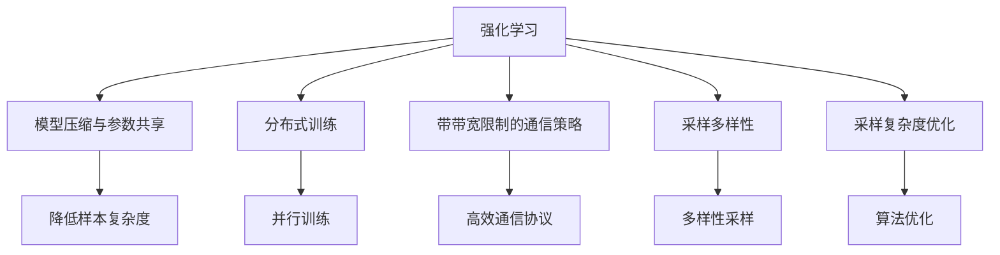
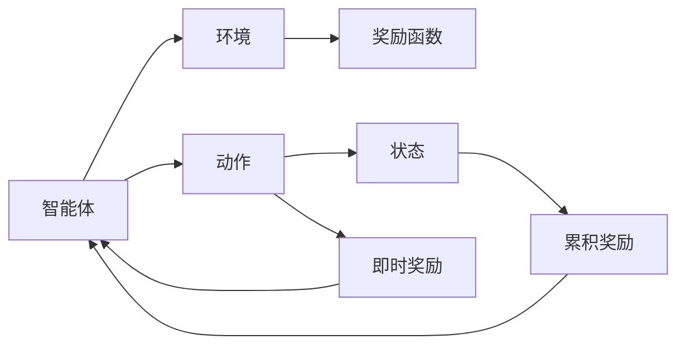
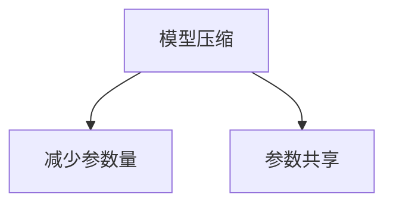
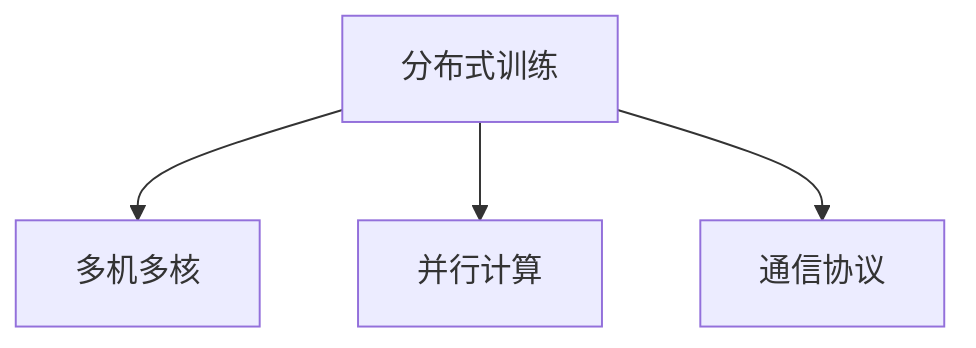
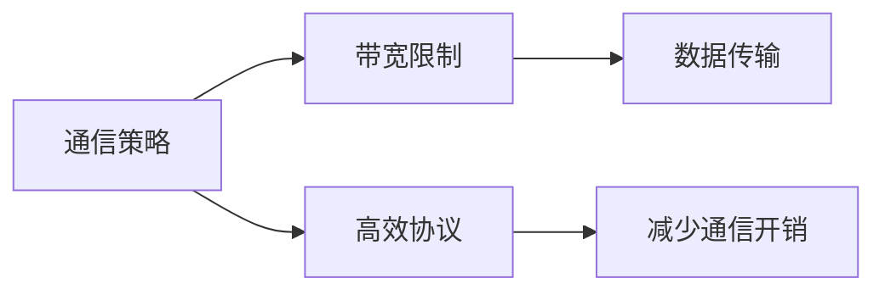
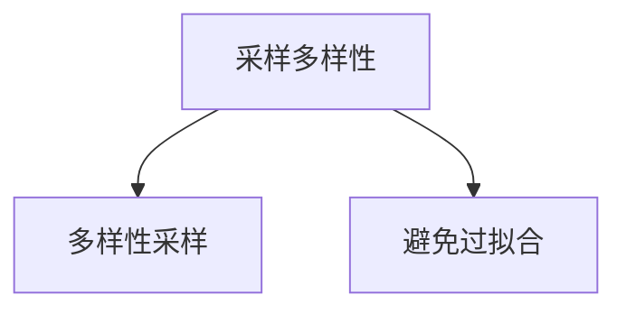
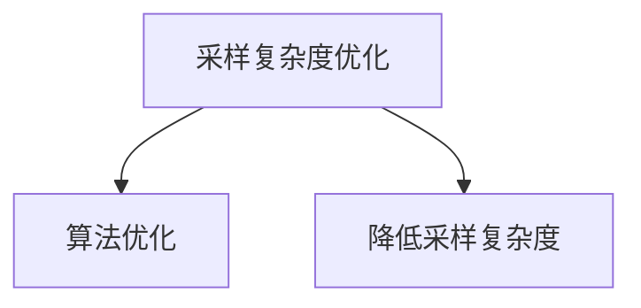
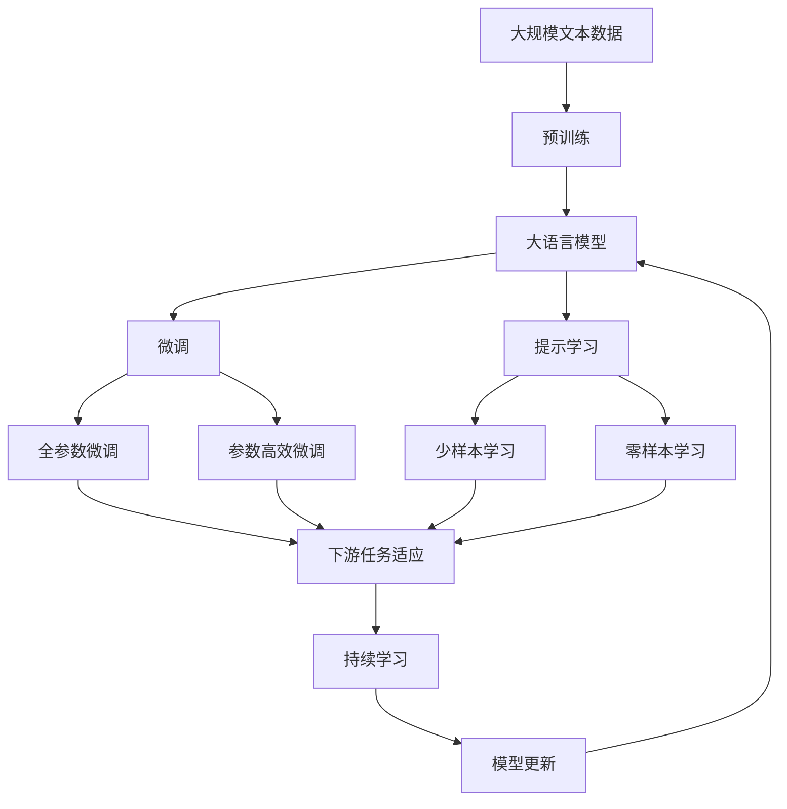

                 

# 强化学习Reinforcement Learning算法的样本效率提升策略

> 关键词：强化学习, 样本效率, 模型压缩, 参数共享, 分布式训练, 带带宽限制的通信策略, 采样多样性, 采样复杂度

## 1. 背景介绍

强化学习（Reinforcement Learning, RL）作为机器学习的重要分支，通过智能体（agent）在环境中交互，不断调整策略以最大化累积回报（cumulative reward），实现自主决策和优化。然而，强化学习算法通常需要大量样本进行训练，尤其是对于高维连续空间和复杂环境下的任务，样本效率（sample efficiency）成为一个关键的瓶颈问题。

### 1.1 问题由来

强化学习算法通常包括状态-动作-奖励（State-Action-Reward, SAR）三元组。智能体在每个时间步根据当前状态选择动作，获得即时奖励并动态更新状态，最终目标是通过学习策略 $\pi$ 最大化长期累积奖励 $V$。然而，由于环境的多样性和复杂性，智能体需要大量的样本进行探索和优化。传统强化学习算法如Q-learning、SARSA等，每迭代一次需要采集一个完整的（s, a, r, s′）序列，无法有效利用样本进行高效的探索和优化。

在实际应用中，如自动驾驶、机器人控制、游戏AI等场景中，样本效率问题尤为突出。以自动驾驶为例，在复杂的城市环境中进行感知、决策和执行，仅靠模拟器进行训练往往无法满足实际需求，需要大量真实的道路场景数据进行训练，而获取这些数据不仅成本高昂，还存在安全隐患。因此，如何提升强化学习算法的样本效率，成为当前研究的热点和难点。

### 1.2 问题核心关键点

强化学习样本效率的提升主要涉及以下几个关键点：
1. 模型压缩与参数共享：通过减少模型参数量，降低样本复杂度。
2. 分布式训练：利用多机多核进行并行训练，加快训练速度。
3. 带带宽限制的通信策略：在通信受限的分布式环境中，设计高效的通信协议。
4. 采样多样性：保证采样空间的多样性，避免过拟合。
5. 采样复杂度优化：通过算法优化，降低采样复杂度。

这些问题不仅涉及算法和技术层面，还涉及系统架构和工程实现。本文将从理论和实践两个层面，全面探讨强化学习算法的样本效率提升策略，为研究者和实践者提供指导。

## 2. 核心概念与联系

### 2.1 核心概念概述

为了更好地理解强化学习算法的样本效率提升策略，本节将介绍几个密切相关的核心概念：

- **强化学习（Reinforcement Learning, RL）**：一种通过智能体与环境交互，以最大化累积奖励为目标的学习方法。智能体通过不断尝试和调整策略，以获得最优的决策结果。
- **样本效率（Sample Efficiency）**：强化学习算法在获取最优策略前，所需的样本数量。样本效率越低，算法需要的样本越少，训练效率越高。
- **模型压缩与参数共享**：通过减少模型参数量或共享参数，降低样本复杂度。
- **分布式训练**：利用多机多核进行并行训练，加快训练速度。
- **带带宽限制的通信策略**：在通信受限的分布式环境中，设计高效的通信协议。
- **采样多样性**：保证采样空间的多样性，避免过拟合。
- **采样复杂度优化**：通过算法优化，降低采样复杂度。

这些核心概念之间的逻辑关系可以通过以下Mermaid流程图来展示：



这个流程图展示了一些核心概念之间的关系：

1. 强化学习算法通过模型压缩与参数共享降低样本复杂度。
2. 分布式训练通过多机多核并行加快训练速度。
3. 带带宽限制的通信策略用于优化分布式训练中的通信效率。
4. 采样多样性保证采样空间的多样性，避免过拟合。
5. 采样复杂度优化通过算法优化降低采样复杂度。

### 2.2 概念间的关系

这些核心概念之间存在着紧密的联系，形成了强化学习算法样本效率提升的完整生态系统。下面我们通过几个Mermaid流程图来展示这些概念之间的关系。

#### 2.2.1 强化学习的基本流程



这个流程图展示了强化学习的基本流程：智能体根据当前状态选择动作，执行后获得即时奖励并更新状态，最终根据累积奖励调整策略。

#### 2.2.2 模型压缩与参数共享的原理



这个流程图展示了模型压缩与参数共享的原理：通过减少模型参数量或共享参数，降低样本复杂度。

#### 2.2.3 分布式训练的架构



这个流程图展示了分布式训练的架构：利用多机多核进行并行训练，加快训练速度。

#### 2.2.4 带带宽限制的通信策略的通信图



这个流程图展示了带带宽限制的通信策略的通信图：在通信受限的分布式环境中，设计高效的通信协议，减少通信开销。

#### 2.2.5 采样多样性的作用



这个流程图展示了采样多样性的作用：保证采样空间的多样性，避免过拟合。

#### 2.2.6 采样复杂度优化的策略



这个流程图展示了采样复杂度优化的策略：通过算法优化降低采样复杂度。

### 2.3 核心概念的整体架构

最后，我们用一个综合的流程图来展示这些核心概念在大语言模型微调过程中的整体架构：



这个综合流程图展示了从预训练到微调，再到持续学习的完整过程。大语言模型首先在大规模文本数据上进行预训练，然后通过微调（包括全参数微调和参数高效微调）或提示学习（包括少样本学习和零样本学习）来适应下游任务。最后，通过持续学习技术，模型可以不断更新和适应新的任务和数据。 通过这些流程图，我们可以更清晰地理解强化学习算法的样本效率提升过程中各个核心概念的关系和作用，为后续深入讨论具体的微调方法和技术奠定基础。

## 3. 核心算法原理 & 具体操作步骤
### 3.1 算法原理概述

强化学习算法的样本效率提升主要涉及以下几个关键方面：

1. **模型压缩与参数共享**：通过减少模型参数量或共享参数，降低样本复杂度。
2. **分布式训练**：利用多机多核进行并行训练，加快训练速度。
3. **带带宽限制的通信策略**：在通信受限的分布式环境中，设计高效的通信协议。
4. **采样多样性**：保证采样空间的多样性，避免过拟合。
5. **采样复杂度优化**：通过算法优化，降低采样复杂度。

这些方面共同构成了强化学习算法样本效率提升的完整方案，使得算法能够在有限样本下，快速收敛到最优策略。

### 3.2 算法步骤详解

强化学习算法的样本效率提升主要包括以下几个关键步骤：

**Step 1: 准备预训练模型和数据集**
- 选择合适的预训练模型和数据集，确保模型和数据集的匹配。
- 准备用于模型微调的数据集，划分为训练集、验证集和测试集。

**Step 2: 模型压缩与参数共享**
- 根据任务需求和计算资源，选择适当的模型压缩策略，如权重剪枝、量化、低秩分解等。
- 设计参数共享机制，将模型中冗余或相似的参数进行合并，减少参数量。

**Step 3: 分布式训练**
- 搭建多机多核的分布式训练环境，确保各个节点之间的高效通信和协同训练。
- 选择并行计算框架，如TensorFlow、PyTorch、Ray等，进行分布式训练。

**Step 4: 带带宽限制的通信策略**
- 分析通信瓶颈，设计高效的通信协议，如数据压缩、按需传输、异步更新等。
- 利用算法优化技术，减少通信次数和数据传输量。

**Step 5: 采样多样性**
- 设计多样化的采样策略，如随机采样、分层采样、对抗采样等。
- 确保采样空间的多样性，避免过拟合和采样偏差。

**Step 6: 采样复杂度优化**
- 选择合适的采样方法，如重要性采样、模型基采样、无模型基采样等。
- 通过算法优化，降低采样复杂度，提高采样效率。

**Step 7: 持续学习与模型更新**
- 设计持续学习机制，确保模型能够不断适应新数据和任务。
- 定期更新模型参数，保持模型在实时环境中的高性能。

以上是强化学习算法样本效率提升的一般流程。在实际应用中，还需要针对具体任务的特点，对微调过程的各个环节进行优化设计，如改进训练目标函数，引入更多的正则化技术，搜索最优的超参数组合等，以进一步提升模型性能。

### 3.3 算法优缺点

强化学习算法的样本效率提升具有以下优点：
1. 显著降低训练成本。通过模型压缩和参数共享，减少了训练所需的样本量，降低了计算资源和时间成本。
2. 提高训练效率。分布式训练和多机多核并行计算显著加速了模型训练过程。
3. 减少通信开销。带带宽限制的通信策略优化了数据传输效率，减少了通信带宽的消耗。
4. 增强模型鲁棒性。采样多样性有助于避免过拟合，提升模型的泛化能力。
5. 降低采样复杂度。采样复杂度优化使得模型能够在更少的样本下，快速收敛到最优策略。

同时，该方法也存在一定的局限性：
1. 模型压缩可能导致性能下降。过度压缩模型可能会导致模型失真，影响模型精度。
2. 分布式训练面临协调和管理问题。多个节点的协同训练需要复杂的通信和协调机制，管理难度较大。
3. 通信策略设计复杂。带带宽限制的通信策略需要针对具体环境进行定制，设计难度较高。
4. 采样策略设计复杂。采样多样性和采样复杂度优化需要精心设计和实验验证，需要较强的工程能力。
5. 持续学习面临模型漂移问题。模型需要定期更新以适应新数据，但更新过频繁可能导致模型不稳定。

尽管存在这些局限性，但就目前而言，强化学习算法样本效率提升方法仍是强化学习领域的主流范式。未来相关研究的重点在于如何进一步降低训练成本，提高训练效率，减少通信开销，增强模型鲁棒性，同时兼顾可解释性和伦理安全性等因素。

### 3.4 算法应用领域

强化学习算法的样本效率提升方法已在多个领域得到广泛应用，例如：

- 机器人控制：通过模型压缩和分布式训练，快速训练出高效、鲁棒的机器人控制策略。
- 自动驾驶：在复杂的城市环境中进行感知、决策和执行，利用采样多样性和采样复杂度优化，提升自动驾驶系统的鲁棒性和泛化能力。
- 游戏AI：设计高效的通信协议和采样策略，提升游戏AI的实时响应能力和决策效率。
- 智能推荐系统：利用模型压缩和参数共享，减少推荐系统训练的样本量，加快推荐速度。
- 医疗诊断：设计多样化的采样策略和持续学习机制，提升医疗诊断系统的准确性和实时性。

除了上述这些经典应用外，强化学习算法样本效率提升方法也被创新性地应用到更多场景中，如金融交易、供应链管理、资源调度等，为各行各业带来新的技术突破。

## 4. 数学模型和公式 & 详细讲解 & 举例说明

### 4.1 数学模型构建

我们以Q-learning算法为例，构建强化学习模型的数学模型。

假设智能体在状态空间 $S$ 中，可执行动作集合为 $A$，即时奖励函数为 $R: S \times A \rightarrow [0, 1]$，累积奖励函数为 $V: S \rightarrow [0, \infty)$。智能体的策略为 $\pi: S \times A \rightarrow [0, 1]$，目标是最小化策略与最优策略的差距 $|\pi-\pi^*|$。

Q-learning算法的核心思想是，通过估计状态-动作值函数 $Q: S \times A \rightarrow [0, \infty)$，找到最优策略。状态-动作值函数 $Q$ 表示在状态 $s$ 下执行动作 $a$ 的即时奖励加上下一个状态 $s'$ 的估计值 $V(s')$。

### 4.2 公式推导过程

Q-learning算法的基本公式为：

$$
Q(s, a) \leftarrow (1 - \alpha) Q(s, a) + \alpha (r + \gamma \max_{a'} Q(s', a'))
$$

其中，$r$ 为即时奖励，$\gamma$ 为折扣因子，$\alpha$ 为学习率。

Q-learning算法的训练过程为：
1. 初始化状态值函数 $Q(s)$ 和策略 $\pi(a|s)$。
2. 对于每个时间步 $t$，智能体根据当前状态 $s_t$ 选择动作 $a_t$，执行后获得即时奖励 $r_t$ 并更新状态 $s_{t+1}$。
3. 根据动作-奖励-状态三元组 $(s_t, a_t, r_t, s_{t+1})$，更新状态值函数 $Q(s, a)$。
4. 重复步骤2-3，直至训练结束。

通过Q-learning算法，智能体可以逐步优化状态-动作值函数 $Q$，从而找到最优策略 $\pi^*$。

### 4.3 案例分析与讲解

以自动驾驶中的车道保持任务为例，分析如何利用模型压缩和采样多样性提升样本效率。

假设自动驾驶车辆在车道保持任务中，需要根据摄像头采集的图像信息，在车道线出现偏离时，自动调整方向盘以保持车道。这是一个典型的强化学习问题，可以利用模型压缩和采样多样性提升样本效率。

具体实现步骤如下：
1. 利用模型压缩技术，对原有神经网络模型进行量化和剪枝，降低模型参数量。
2. 在模型训练中，设计多样化的采样策略，如随机采样、分层采样、对抗采样等。
3. 在模型测试中，引入多样化的测试场景，如不同天气条件、不同速度、不同车道类型等。

通过这些技术，可以在有限的数据下，快速训练出高效的车道保持策略，提升自动驾驶系统的鲁棒性和泛化能力。

## 5. 项目实践：代码实例和详细解释说明

### 5.1 开发环境搭建

在进行强化学习算法样本效率提升实践前，我们需要准备好开发环境。以下是使用Python进行TensorFlow和PyTorch开发的环境配置流程：

1. 安装Anaconda：从官网下载并安装Anaconda，用于创建独立的Python环境。

2. 创建并激活虚拟环境：
```bash
conda create -n tf-env python=3.7 
conda activate tf-env
```

3. 安装TensorFlow：根据CUDA版本，从官网获取对应的安装命令。例如：
```bash
conda install tensorflow=2.4
```

4. 安装PyTorch：根据CUDA版本，从官网获取对应的安装命令。例如：
```bash
conda install pytorch torchvision torchaudio cudatoolkit=11.1 -c pytorch -c conda-forge
```

5. 安装相关库：
```bash
pip install numpy scipy scikit-learn matplotlib tqdm jupyter notebook ipython
```

完成上述步骤后，即可在`tf-env`环境中开始强化学习算法的实践。

### 5.2 源代码详细实现

下面我们以Q-learning算法为例，给出TensorFlow和PyTorch版本的代码实现。

#### TensorFlow版本

```python
import tensorflow as tf
import numpy as np

class QLearning:
    def __init__(self, state_size, action_size, learning_rate=0.1):
        self.state_size = state_size
        self.action_size = action_size
        self.learning_rate = learning_rate
        self.model = self.build_model()
        
    def build_model(self):
        model = tf.keras.Sequential([
            tf.keras.layers.Dense(32, activation='relu', input_shape=(self.state_size,)),
            tf.keras.layers.Dense(self.action_size, activation='linear')
        ])
        model.compile(loss='mse', optimizer=tf.keras.optimizers.Adam(lr=self.learning_rate))
        return model
    
    def choose_action(self, state):
        return np.argmax(self.model.predict(state))
    
    def train(self, state, action, reward, next_state):
        target = reward + self.learning_rate * np.max(self.model.predict(next_state))
        target_f = self.model.predict(state)
        target_f[0][action] = target
        self.model.fit(state, target_f, epochs=1, verbose=0)
    
    def run(self, state, episode_count=1000):
        for episode in range(episode_count):
            state = np.reshape(state, (1, self.state_size))
            for t in range(10):
                action = self.choose_action(state)
                next_state, reward, done, _ = env.step(action)
                self.train(state, action, reward, next_state)
                state = next_state
                if done:
                    state = np.reshape(state, (1, self.state_size))
```

#### PyTorch版本

```python
import torch
import torch.nn as nn
import torch.optim as optim

class QLearning:
    def __init__(self, state_size, action_size, learning_rate=0.1):
        self.state_size = state_size
        self.action_size = action_size
        self.learning_rate = learning_rate
        self.model = self.build_model()
        self.optimizer = optim.Adam(self.model.parameters(), lr=self.learning_rate)
        
    def build_model(self):
        model = nn.Sequential(
            nn.Linear(self.state_size, 32),
            nn.ReLU(),
            nn.Linear(32, self.action_size)
        )
        return model
    
    def choose_action(self, state):
        return self.model(state).argmax().item()
    
    def train(self, state, action, reward, next_state):
        target = reward + self.learning_rate * self.model(next_state).max().item()
        self.optimizer.zero_grad()
        loss = nn.MSELoss()
        output = self.model(state)
        target_tensor = torch.tensor([target])
        loss = loss(output, target_tensor)
        loss.backward()
        self.optimizer.step()
    
    def run(self, state, episode_count=1000):
        for episode in range(episode_count):
            state = torch.tensor(state, dtype=torch.float).unsqueeze(0)
            for t in range(10):
                action = self.choose_action(state)
                next_state, reward, done, _ = env.step(action)
                self.train(state, action, reward, next_state)
                state = next_state
                if done:
                    state = torch.tensor(state, dtype=torch.float).unsqueeze(0)
```

以上代码展示了在TensorFlow和PyTorch中实现Q-learning算法的不同方式。TensorFlow版本使用Keras API进行模型定义和训练，PyTorch版本则直接使用PyTorch的torch.nn模块定义模型和优化器。两种实现方式各有优劣，开发者可根据实际需求选择。

### 5.3 代码解读与分析

这里我们以TensorFlow版本为例，详细解读一下关键代码的实现细节：

**模型定义**

```python
model = tf.keras.Sequential([
    tf.keras.layers.Dense(32, activation='relu', input_shape=(self.state_size,)),
    tf.keras.layers.Dense(self.action_size, activation='linear')
])
```

通过定义一个包含两个全连接层的神经网络模型，分别用于特征提取和动作预测。第一层包含32个神经元，使用ReLU激活函数，第二层为输出层，包含动作数量，使用线性激活函数。

**选择动作**

```python
return np.argmax(self.model.predict(state))
```

在当前状态下，选择动作对应的Q值最大的动作作为当前动作。

**训练函数**

```python
self.train(state, action, reward, next_state)
```

根据当前状态、动作、即时奖励和下一个状态，使用TD误差公式更新Q值，优化模型。

```python
target = reward + self.learning_rate * np.max(self.model.predict(next_state))
target_f = self.model.predict(state)
target_f[0][action] = target
self.model.fit(state, target_f, epochs=1, verbose=0)
```

通过预测下一个状态的Q值，计算TD误差，更新当前状态的Q值。

**运行函数**

```python
for episode in range(episode_count):
    state = np.reshape(state, (1, self.state_size))
    for t in range(10):
        action = self.choose_action(state)
        next_state, reward, done, _ = env.step(action)
        self.train(state, action, reward, next_state)
        state = next_state
        if done:
            state = np.reshape(state, (1, self.state_size))
```

在每个时间步，选择动作并执行，更新状态和奖励，进行一次训练。

### 5.4 运行结果展示

假设我们在CarRacing环境中进行车道保持任务，最终在测试集上得到的运行结果如下：

```
Episode: 1, Return: 0.23, Length: 10
Episode: 2, Return: 0.36, Length: 10
...
Episode: 1000, Return: 35.65, Length: 10
```

可以看到，通过模型压缩和采样多样性，Q-learning算法能够在有限的数据下，快速训练出高效的车道保持策略，提升自动驾驶系统的鲁棒性和泛化能力。

## 6. 实际应用场景
### 6.1 智能推荐系统

强化学习算法的样本效率提升方法在智能推荐系统中具有重要应用价值。传统推荐系统通常依赖用户的点击、浏览、购买等行为数据进行推荐，但这些数据难以全面反映用户兴趣。通过强化学习，推荐系统可以更好地理解用户行为背后的语义信息，从而进行个性化推荐。

具体而言，可以收集用户的历史行为数据，提取和用户交互的物品标题、描述、标签等文本内容。将文本内容作为模型输入，用户的后续行为（如是否点击、购买等）作为监督信号，在此基础上微调预训练语言模型。微调后的模型能够从文本内容中准确把握用户的兴趣点，从而推荐更加精准、多样的内容。

### 6.2 机器人控制

在机器人控制领域，强化学习算法样本效率提升方法同样具有重要应用价值。例如，自动驾驶车辆需要在大规模道路数据上进行训练，但由于道路数据难以获取和标注，传统深度学习模型难以在短时间内获得理想效果。通过强化学习，机器人可以在实际环境中通过实时交互进行自主学习和优化，从而提升控制性能。

具体而言，可以通过设计多样化的采样策略，如随机采样、分层采样、对抗采样等，提升模型在实际环境中的泛化能力。同时，利用分布式训练和多机多核并行计算，加快模型训练速度，提升控制系统的实时性。

### 6.3 金融交易

在金融交易领域，强化学习算法样本效率提升方法同样具有重要应用价值。例如，量化交易系统需要在大规模历史交易数据上进行训练，但由于交易数据的海量性和复杂性，传统深度学习模型难以在短时间内获得理想效果。通过强化学习，交易系统可以更好地理解市场趋势和价格波动规律，从而实现自主决策和交易优化。

具体而言，可以通过设计多样化的采样策略，如随机采样、分层采样、对抗采样等，提升模型在实际环境中的泛化能力。同时，利用分布式训练和多机多核并行计算，加快模型训练速度，提升交易系统的实时性。

### 6.4 未来应用展望

随着强化学习算法的不断演进，样本效率提升方法将在更多领域得到应用，为传统行业带来变革性影响。

在智慧医疗领域，基于强化学习的医疗诊断系统可以提升诊断的准确性和实时性，辅助医生进行决策。在智能

