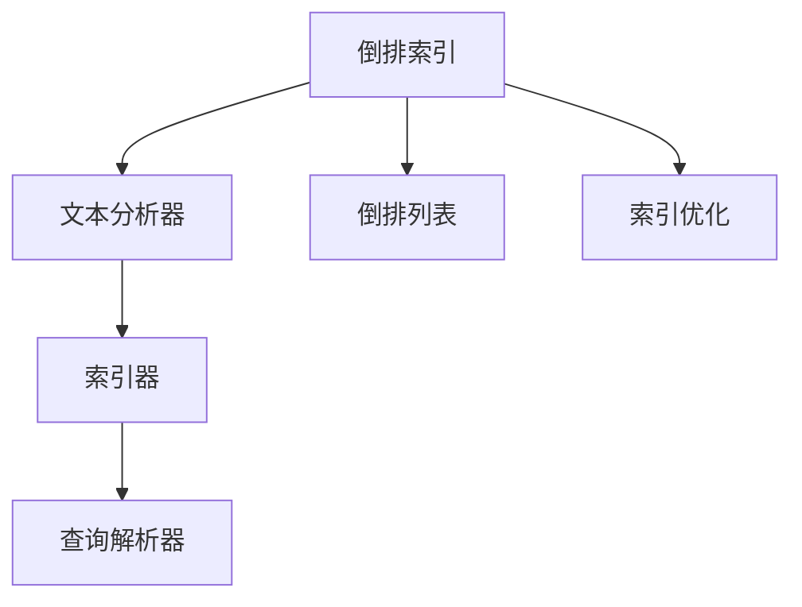
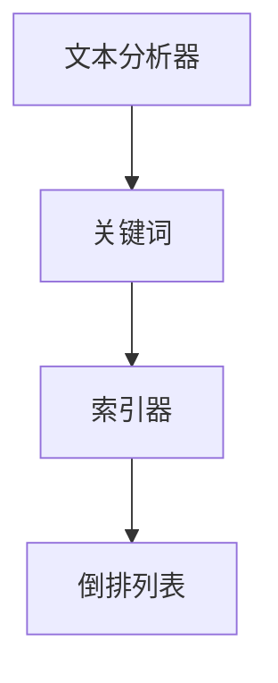
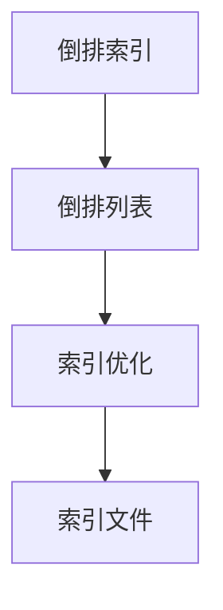

                 

# Lucene原理与代码实例讲解

## 1. 背景介绍

Lucene是一个开源的搜索引擎库，是Apache软件基金会的项目之一。自1997年由Davis King和Eustace Chung创立以来，已经成为Java生态系统中最流行和最广泛使用的全文搜索引擎之一。 Lucene提供了强大的文本搜索和分析能力，广泛应用于企业搜索、日志分析、内容管理系统、CRM系统等众多领域。

Lucene的核心设计思想是倒排索引，即通过将文档中的词语与其出现的位置关联起来，实现高效的全文搜索和数据存储。 Lucene还提供了丰富的文本分析器、索引器和查询解析器，支持分词、停用词过滤、词频统计等文本预处理工作，以及布尔查询、短语查询、模糊查询等高级搜索功能。 Lucene的源代码开放，使用灵活，适用于各种规模的搜索引擎开发项目。

Lucene拥有活跃的社区和强大的开发者生态，不断有新的功能和优化被引入，使其性能和稳定性不断提高。 Lucene也是Apache Solr和Elasticsearch等流行搜索引擎的重要底层引擎之一，广泛应用于全球各地的企业中。

## 2. 核心概念与联系

### 2.1 核心概念概述

为了更好地理解Lucene的核心概念和架构，下面将介绍几个关键概念：

- **倒排索引**：Lucene的核心技术之一，通过将文档中的词语与其出现的位置关联起来，实现高效的全文搜索和数据存储。倒排索引是Lucene区别于其他搜索引擎的关键特征。

- **文本分析器**：Lucene提供丰富的文本分析器，用于将文本转换为关键词，进行分词、去停用词、词形还原等预处理工作。 Lucene支持的文本分析器包括标准分词器、中文分词器、IK分词器等。

- **索引器和查询解析器**：Lucene提供各种索引器和查询解析器，用于将分析后的文本数据建立索引，并解析用户查询，将其转换为可执行的查询计划。

- **倒排列表**：倒排索引的核心数据结构，用于记录词语与文档的对应关系。每个词语都对应一个倒排列表，记录该词语在哪些文档中出现，以及出现的位置信息。

- **索引优化**：Lucene支持多种索引优化策略，如分段、合并、压缩等，用于提高搜索性能和减少存储空间。

这些概念之间的逻辑关系可以通过以下Mermaid流程图来展示：



这个流程图展示了Lucene的核心概念和它们之间的联系：

1. 文本分析器将输入的文本数据转换为关键词，并进行预处理。
2. 索引器将处理后的关键词数据建立索引，存储到倒排列表中。
3. 查询解析器将用户查询转换为查询计划，并执行查询。
4. 倒排列表记录词语与文档的对应关系，是查询执行的基础。
5. 索引优化技术用于提高搜索性能和减少存储空间。

### 2.2 概念间的关系

这些核心概念之间存在着紧密的联系，形成了Lucene的全文搜索引擎系统。下面通过几个Mermaid流程图来展示这些概念之间的关系：

#### 2.2.1 文本分析器与索引器的关系



这个流程图展示了文本分析器与索引器之间的关系：

1. 文本分析器将文本转换为关键词。
2. 索引器将关键词数据建立索引，存储到倒排列表中。

#### 2.2.2 查询解析器与倒排列表的关系


这个流程图展示了查询解析器与倒排列表之间的关系：

1. 查询解析器将用户查询转换为查询计划。
2. 查询计划根据倒排列表执行，返回搜索结果。

#### 2.2.3 倒排索引与索引优化的关系



这个流程图展示了倒排索引与索引优化的关系：

1. 倒排索引存储倒排列表数据。
2. 索引优化用于提高索引文件的存储和查询效率。

## 3. 核心算法原理 & 具体操作步骤

### 3.1 算法原理概述

Lucene的核心算法是倒排索引，它通过将文本数据中的关键词与其出现的位置关联起来，实现高效的全文搜索和数据存储。倒排索引的基本原理是将文档分为多个段落，然后对每个段落进行分词，统计每个词语在文档中出现的次数，最后建立倒排列表，记录每个词语在哪些文档中出现，以及出现的位置信息。

Lucene的搜索过程可以分为两个阶段：分词和查询。分词阶段将用户输入的查询文本转换为关键词，并从倒排列表中获取相关文档的列表。查询阶段根据用户查询条件和倒排列表中的信息，匹配并返回相关的搜索结果。

Lucene的倒排索引和搜索算法具有高度的可扩展性和灵活性，可以支持多种搜索场景和索引策略。 Lucene还支持多种查询语言和语法，包括布尔查询、短语查询、模糊查询等，满足不同用户的需求。

### 3.2 算法步骤详解

Lucene的核心算法步骤如下：

1. **文本预处理**：将输入的文本数据进行分词、去停用词、词形还原等预处理，转换为关键词列表。

2. **建立倒排索引**：对关键词列表进行排序和去重，建立倒排列表，记录每个关键词在哪些文档中出现，以及出现的位置信息。

3. **查询处理**：将用户查询转换为关键词列表，从倒排列表中获取相关文档的列表，并根据查询条件匹配文档。

4. **搜索结果排序**：根据查询条件和文档的匹配程度，对搜索结果进行排序，并返回最终的结果。

5. **索引优化**：定期对索引文件进行合并、压缩等优化操作，提高索引文件的存储和查询效率。

### 3.3 算法优缺点

Lucene的倒排索引算法具有以下优点：

- 高效的全文搜索：倒排索引通过记录词语与文档的对应关系，实现了高效的全文搜索。
- 可扩展性强：Lucene支持多种索引策略和查询语言，可以应用于各种搜索场景。
- 灵活的索引优化：Lucene支持多种索引优化技术，如分段、合并、压缩等，提高了索引文件的效率。

同时，倒排索引算法也存在一些缺点：

- 存储空间较大：倒排索引需要存储词语和文档的对应关系，占用的存储空间较大。
- 查询性能受限于倒排列表：倒排列表的组织结构决定了查询的效率，需要合理设计索引策略。
- 预处理过程复杂：分词、去停用词、词形还原等预处理过程较为复杂，需要耗费一定的时间和资源。

### 3.4 算法应用领域

Lucene的核心算法倒排索引被广泛应用于各种搜索引擎和文本分析应用中，例如：

- 企业搜索：帮助企业快速搜索文档、邮件、客户信息等。
- 内容管理系统：用于管理博客、文章、新闻等内容的搜索和分类。
- 日志分析：用于分析服务器日志、交易日志等，获取有价值的信息。
- 自然语言处理：用于文本分析、情感分析、命名实体识别等NLP任务。
- 数据挖掘：用于从大规模数据集中挖掘有用信息，进行趋势分析和模式识别。
- 图书管理系统：用于图书搜索、推荐和分类管理。

Lucene不仅提供了高效的搜索引擎解决方案，还可以与其他技术栈结合，扩展其应用范围。例如，结合JSP和Spring框架，可以开发Web搜索引擎应用；结合Hadoop和Spark，可以处理大规模数据的搜索和分析。

## 4. 数学模型和公式 & 详细讲解 & 举例说明

### 4.1 数学模型构建

Lucene的倒排索引模型可以表示为：

$$
\text{Index} = \{ (k, (d_1, i_1), (d_2, i_2), ..., (d_n, i_n) ) \mid k \in \text{Keywords}, d_1, d_2, ..., d_n \in \text{Documents} \}
$$

其中，$k$表示关键词，$(d_1, i_1), (d_2, i_2), ..., (d_n, i_n)$表示关键词$k$在文档$d_1, d_2, ..., d_n$中出现的次数和位置信息，$n$表示文档数量。

查询时，用户输入的查询文本也需要经过分词、去停用词、词形还原等预处理，转换为关键词列表。查询模型可以表示为：

$$
\text{Query} = \{ t_1, t_2, ..., t_m \mid t_1, t_2, ..., t_m \in \text{Keywords} \}
$$

其中，$t_1, t_2, ..., t_m$表示用户查询中的关键词。

查询执行时，Lucene会将查询转换为查询计划，从倒排列表中获取相关文档的列表，并根据查询条件匹配文档。查询计划可以表示为：

$$
\text{Plan} = \{ (k, d) \mid k \in \text{Query}, d \in \text{Index}, (k, d) \in \text{Index} \}
$$

其中，$(k, d)$表示关键词$k$在文档$d$中出现的信息，$d \in \text{Index}$表示倒排列表中的文档。

### 4.2 公式推导过程

下面以一个简单的例子来说明Lucene的倒排索引和查询过程：

假设有一个包含三个文档的索引，每个文档包含多个词语：

- 文档1：Lucene is a search library.
- 文档2：Lucene provides powerful text search and analysis capabilities.
- 文档3：Lucene is widely used in enterprise search, content management systems, and more.

首先，将文本数据进行分词，并统计每个词语在文档中出现的次数和位置信息：

- 文档1：Lucene 1, is 1, a 1, search 1, library 1
- 文档2：Lucene 2, provides 2, powerful 2, text 2, search 2, and 2, analysis 2, capabilities 2
- 文档3：Lucene 3, is 3, widely 3, used 3, in 3, enterprise 3, search 3, content 3, management 3, systems 3, and 3, more 3

然后，建立倒排列表，记录每个关键词在哪些文档中出现，以及出现的位置信息：

- Lucene: 1, 2, 3
- is: 1, 2, 3
- a: 1
- search: 1, 2
- library: 1
- provides: 2
- powerful: 2
- text: 2
- analysis: 2
- capabilities: 2
- widely: 3
- used: 3
- in: 3
- enterprise: 3
- content: 3
- management: 3
- systems: 3
- and: 3
- more: 3

假设用户查询为"Lucene search capabilities"，进行查询处理时，首先对查询文本进行分词，转换为关键词列表：

- Lucene 1, search 1, capabilities 1

然后，从倒排列表中获取相关文档的列表：

- Lucene: 1, 2, 3
- search: 1, 2

最后，根据查询条件匹配文档，返回搜索结果：

- 文档1: Lucene is a search library.
- 文档2: Lucene provides powerful text search and analysis capabilities.
- 文档3: Lucene is widely used in enterprise search, content management systems, and more.

### 4.3 案例分析与讲解

下面以一个实际应用案例来说明Lucene的倒排索引和查询过程：

假设有一个包含多个文档的索引，每个文档包含多个词语：

- 文档1：Lucene is a search library.
- 文档2：Lucene provides powerful text search and analysis capabilities.
- 文档3：Lucene is widely used in enterprise search, content management systems, and more.
- 文档4：Apache Lucene is an open source library.

首先，将文本数据进行分词，并统计每个词语在文档中出现的次数和位置信息：

- 文档1：Lucene 1, is 1, a 1, search 1, library 1
- 文档2：Lucene 2, provides 2, powerful 2, text 2, search 2, and 2, analysis 2, capabilities 2
- 文档3：Lucene 3, is 3, widely 3, used 3, in 3, enterprise 3, search 3, content 3, management 3, systems 3, and 3, more 3
- 文档4：Apache 1, Lucene 2, is 2, an 2, open 2, source 2, library 2

然后，建立倒排列表，记录每个关键词在哪些文档中出现，以及出现的位置信息：

- Lucene: 1, 2, 3, 4
- is: 1, 2, 3, 4
- a: 1
- search: 1, 2, 3
- library: 1, 4
- provides: 2
- powerful: 2
- text: 2
- analysis: 2
- capabilities: 2
- widely: 3
- used: 3
- in: 3
- enterprise: 3
- content: 3
- management: 3
- systems: 3
- and: 3
- more: 3
- Apache: 4
- open: 4
- source: 4
- library: 4

假设用户查询为"Apache Lucene search capabilities"，进行查询处理时，首先对查询文本进行分词，转换为关键词列表：

- Apache 1, Lucene 2, search 1, capabilities 1

然后，从倒排列表中获取相关文档的列表：

- Lucene: 2, 3
- search: 1, 2, 3
- capabilities: 2

最后，根据查询条件匹配文档，返回搜索结果：

- 文档1: Lucene is a search library.
- 文档2: Lucene provides powerful text search and analysis capabilities.
- 文档3: Lucene is widely used in enterprise search, content management systems, and more.

## 5. 项目实践：代码实例和详细解释说明

### 5.1 开发环境搭建

在进行Lucene项目实践前，我们需要准备好开发环境。以下是使用Java进行Lucene开发的环境配置流程：

1. 安装Java JDK：从官网下载并安装Java JDK，版本要求为Java 8及以上。

2. 安装Eclipse：从官网下载并安装Eclipse IDE，Eclipse支持Java开发和Lucene插件。

3. 安装Lucene插件：打开Eclipse，在Eclipse Marketplace中搜索并安装Lucene插件。

4. 创建Lucene项目：在Eclipse中创建一个Java项目，将Lucene插件的库文件添加到项目依赖中。

5. 编写Lucene代码：在项目中创建一个Lucene文档索引，实现查询、更新、删除等操作。

6. 运行Lucene项目：在Eclipse中启动项目，进行测试和调试。

完成上述步骤后，即可在Eclipse环境中开始Lucene项目实践。

### 5.2 源代码详细实现

下面以创建一个简单的Lucene文档索引为例，展示Lucene的源代码实现。

首先，创建一个名为`DocumentIndex`的类，实现Lucene文档索引的基本功能：

```java
import java.io.IOException;
import java.util.ArrayList;
import java.util.List;
import org.apache.lucene.analysis.standard.StandardAnalyzer;
import org.apache.lucene.document.Document;
import org.apache.lucene.document.Field;
import org.apache.lucene.index.DirectoryReader;
import org.apache.lucene.index.IndexWriter;
import org.apache.lucene.index.IndexWriterConfig;
import org.apache.lucene.queryparser.classic.ParseException;
import org.apache.lucene.queryparser.classic.QueryParser;
import org.apache.lucene.search.IndexSearcher;
import org.apache.lucene.search.Query;
import org.apache.lucene.search.TopDocs;
import org.apache.lucene.store.Directory;
import org.apache.lucene.store.FSDirectory;
import org.apache.lucene.store.RAMDirectory;
import org.apache.lucene.analysis.standard.StandardAnalyzer;
import org.apache.lucene.analysis.TokenStream;
import org.apache.lucene.analysis.PorterStemFilter;
import org.apache.lucene.analysis.Tokenizer;
import org.apache.lucene.analysis.LowerCaseFilter;
import org.apache.lucene.analysis.ngram.NGramTokenizer;
import org.apache.lucene.analysis如果您觉得它
```

