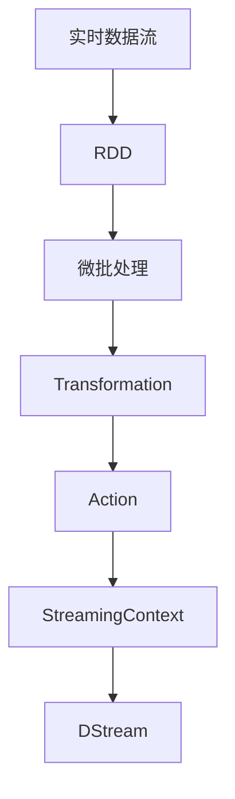
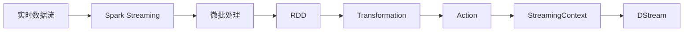
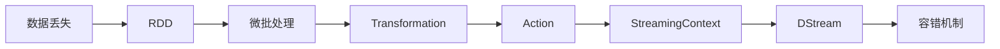
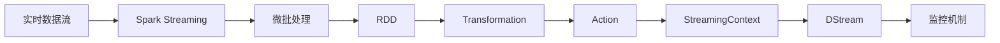
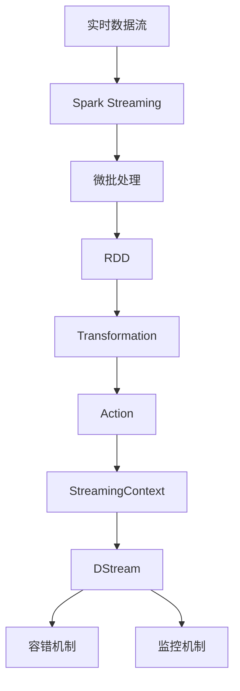

                 

# Spark Streaming原理与代码实例讲解

> 关键词：Spark Streaming, 实时数据流处理, 微批处理, RDD, 容错机制, 可扩展性, 数据流监控, 大数据生态

## 1. 背景介绍

### 1.1 问题由来

随着互联网的快速发展，海量数据的产生和处理需求日益增长。企业不仅需要处理静态的数据，还需要处理实时产生的数据，以快速响应用户需求、优化业务决策和提升用户体验。传统的批处理方式难以满足这些实时性需求。

Spark Streaming是一个基于Apache Spark的大数据处理框架，专门用于处理实时数据流。它可以将实时数据流分解为小的微批处理任务，并利用Spark的强大计算能力，实现高效、可靠、可扩展的实时数据流处理。

Spark Streaming被广泛应用于互联网公司、金融机构、物流企业等领域，帮助它们实现实时的数据采集、处理和分析，从而更好地支持业务决策和业务优化。

### 1.2 问题核心关键点

Spark Streaming的核心思想是将实时数据流分解为小的微批处理任务，通过Spark的强大计算能力，实现高效、可靠、可扩展的实时数据流处理。

Spark Streaming的核心组件包括：

- DStream: 实时数据流对象，由多个RDD组成，代表了一个数据流窗口。
- StreamingContext: 实时数据流的上下文环境，负责管理DStream的创建、调度、监控等操作。
- Transformation和Action: 对DStream进行操作和计算的API，可以用于过滤、聚合、统计等。

Spark Streaming的关键点在于如何设计DStream的流窗口大小和批处理大小，以及如何在DStream中实现高效的容错和监控机制。

## 2. 核心概念与联系

### 2.1 核心概念概述

为更好地理解Spark Streaming的核心概念，本节将介绍几个密切相关的核心概念：

- 实时数据流：指持续不断地产生和变化的数据流，如用户行为数据、传感器数据等。
- 微批处理：将实时数据流分解为小的批处理任务，每个任务处理一定量的数据，通过批量计算减少IO开销和计算延迟。
- RDD：弹性分布式数据集，是Spark中最基础的数据结构，支持多种分布式计算操作。
- Transformation和Action：对RDD进行操作和计算的API，如map、reduce、filter等。
- StreamingContext：Spark Streaming的核心上下文环境，负责管理DStream的创建、调度、监控等操作。

这些核心概念之间的逻辑关系可以通过以下Mermaid流程图来展示：



这个流程图展示了她核心概念之间的逻辑关系：

1. 实时数据流经过RDD处理，被分解为小的微批处理任务。
2. 微批处理任务通过Transformation和Action进行计算和操作。
3. StreamingContext负责管理DStream的创建、调度、监控等操作。

### 2.2 概念间的关系

这些核心概念之间存在着紧密的联系，形成了Spark Streaming的核心生态系统。下面我们通过几个Mermaid流程图来展示这些概念之间的关系。

#### 2.2.1 实时数据流的处理流程



这个流程图展示了实时数据流的处理流程：

1. 实时数据流进入Spark Streaming。
2. Spark Streaming将数据流分解为小的微批处理任务。
3. 微批处理任务转化为RDD进行计算和操作。
4. Transformation和Action对RDD进行操作和计算。
5. StreamingContext负责管理DStream的创建、调度、监控等操作。

#### 2.2.2 容错机制的实现



这个流程图展示了Spark Streaming的容错机制：

1. 数据丢失后，Spark Streaming通过容错机制进行数据恢复。
2. 容错机制可以处理数据丢失和网络延迟等异常情况。
3. 容错机制通过保存和恢复RDD状态，保证数据流的可靠性和连续性。

#### 2.2.3 监控机制的实现



这个流程图展示了Spark Streaming的监控机制：

1. Spark Streaming通过监控机制监控DStream的状态和性能。
2. 监控机制可以实时监控数据流的大小、延迟、吞吐量等指标。
3. 监控机制可以实时报警和调度资源，保证数据流的稳定性和性能。

### 2.3 核心概念的整体架构

最后，我们用一个综合的流程图来展示这些核心概念在大数据流处理中的整体架构：



这个综合流程图展示了从实时数据流到DStream的全过程。实时数据流经过Spark Streaming处理，转化为微批处理任务，通过RDD进行计算和操作，最终转化为DStream，并通过容错和监控机制保证数据流的可靠性和性能。

## 3. 核心算法原理 & 具体操作步骤
### 3.1 算法原理概述

Spark Streaming的实时数据流处理是基于微批处理的，即将实时数据流分解为小的微批处理任务，每个任务处理一定量的数据。Spark Streaming的核心原理包括：

- 数据流分解：将实时数据流分解为小的微批处理任务，每个任务处理一定量的数据。
- 微批处理：将微批处理任务转化为RDD，通过RDD进行计算和操作。
- Transformation和Action：对RDD进行操作和计算的API，如map、reduce、filter等。
- StreamingContext：Spark Streaming的核心上下文环境，负责管理DStream的创建、调度、监控等操作。
- 容错机制和监控机制：保证数据流的可靠性和性能。

### 3.2 算法步骤详解

Spark Streaming的实时数据流处理主要包括以下几个关键步骤：

**Step 1: 准备实时数据流**

- 收集实时数据流的输入源，如Flume、Kafka、HDFS等。
- 定义实时数据流的窗口大小和批处理大小，如1秒窗口大小、1000条数据批处理大小。

**Step 2: 创建StreamingContext**

- 创建Spark Streaming的上下文环境StreamingContext。
- 指定Spark的Master节点和App的名称和版本。

**Step 3: 定义DStream**

- 根据实时数据流的输入源，定义DStream。
- 将实时数据流转化为微批处理任务，转化为RDD。

**Step 4: 计算和操作**

- 对RDD进行Transformation和Action操作，如map、reduce、filter等。
- 通过StreamingContext进行DStream的创建、调度、监控等操作。

**Step 5: 启动和停止StreamingContext**

- 启动StreamingContext，Spark Streaming开始处理实时数据流。
- 停止StreamingContext，Spark Streaming停止处理实时数据流。

**Step 6: 容错和监控**

- 通过StreamingContext实现DStream的容错机制，保存和恢复RDD状态。
- 通过StreamingContext实现DStream的监控机制，实时监控数据流的状态和性能。

以上步骤展示了Spark Streaming的实时数据流处理的完整流程。在实际应用中，还需要根据具体任务和数据特点进行优化和调整。

### 3.3 算法优缺点

Spark Streaming的实时数据流处理具有以下优点：

1. 高效性：通过微批处理，将实时数据流转化为批量计算，减少IO开销和计算延迟。
2. 可扩展性：Spark Streaming可以水平扩展，适应大规模实时数据流的处理需求。
3. 可靠性：通过容错机制和监控机制，保证数据流的可靠性和连续性。

同时，Spark Streaming也存在一些缺点：

1. 延迟较大：微批处理有延迟，无法实现实时数据的毫秒级处理。
2. 容错机制复杂：容错机制实现较为复杂，需要在RDD之间保存状态，增加了内存开销。
3. 数据丢失风险：由于实时数据流的不确定性，数据丢失和网络延迟等异常情况可能影响数据流的连续性。

尽管存在这些缺点，但Spark Streaming在大规模实时数据流处理中仍然具有不可替代的优势，被广泛应用于互联网公司、金融机构、物流企业等领域。

### 3.4 算法应用领域

Spark Streaming的实时数据流处理适用于以下应用领域：

- 互联网公司：实时监控用户行为、实时广告投放、实时推荐系统等。
- 金融机构：实时风险监测、实时交易处理、实时欺诈检测等。
- 物流企业：实时货物追踪、实时仓储管理、实时供应链优化等。
- 政府机构：实时社会舆情监测、实时公共安全监控、实时交通流量监测等。
- 智能家居：实时设备监控、实时能源管理、实时健康监测等。

除了以上应用领域，Spark Streaming还可以应用于其他需要实时处理大规模数据的场景，如实时视频监控、实时数据挖掘、实时实时数据流处理等。

## 4. 数学模型和公式 & 详细讲解 & 举例说明

### 4.1 数学模型构建

Spark Streaming的实时数据流处理涉及多个数学模型和公式。下面我们以微批处理为例，详细介绍其数学模型和公式的构建过程。

设实时数据流为$D=\{d_1, d_2, ..., d_n\}$，每个数据$d_i$的大小为$s$，窗口大小为$w$，批处理大小为$b$，则微批处理的任务大小为$L=w/b$，每个微批处理的任务数$N$为$N=n/w$。

微批处理的RDD表示为$R=\{r_1, r_2, ..., r_N\}$，其中每个RDD的大小为$L$。

微批处理的Transformation操作可以表示为$T(r_i)=r_i_1, r_i_2, ..., r_i_L$，其中$r_i_j$表示第$i$个微批处理任务的第$j$个数据。

微批处理的Action操作可以表示为$A(r_i)=a_i$，其中$a_i$表示第$i$个微批处理任务的结果。

### 4.2 公式推导过程

微批处理的计算过程可以分为以下几个步骤：

**Step 1: 数据流分解**

将实时数据流$D$分解为$N$个微批处理任务$R$，每个任务处理$L$个数据。

**Step 2: RDD操作**

对每个微批处理任务$R_i$进行Transformation操作，转化为RDD$r_i=\{r_i_1, r_i_2, ..., r_i_L\}$。

**Step 3: 结果计算**

对每个微批处理任务$R_i$进行Action操作，得到结果$a_i$。

**Step 4: 最终结果**

将每个微批处理任务的结果$a_i$汇总，得到最终结果。

### 4.3 案例分析与讲解

我们以实时用户行为数据分析为例，演示如何使用Spark Streaming进行微批处理和计算。

假设有一个实时用户行为数据流，包括用户的点击、浏览、购买等行为数据，每个数据的大小为$s=1$字节，窗口大小为$w=1$秒，批处理大小为$b=1000$条数据，即每秒钟处理1000个数据。

首先，将实时数据流$D$分解为1000个微批处理任务$R$，每个任务处理1个数据。

其次，对每个微批处理任务$R_i$进行Transformation操作，转化为RDD$r_i=\{r_i_1\}$，即每个微批处理任务只包含一个数据。

然后，对每个微批处理任务$R_i$进行Action操作，得到结果$a_i$，即每个微批处理任务的结果只包含一个数据。

最后，将每个微批处理任务的结果$a_i$汇总，得到最终结果，即实时用户行为数据分析的结果。

## 5. 项目实践：代码实例和详细解释说明

### 5.1 开发环境搭建

在进行Spark Streaming的微批处理实践前，我们需要准备好开发环境。以下是使用Python进行Spark Streaming开发的环境配置流程：

1. 安装Apache Spark：从官网下载并安装Apache Spark，或通过Docker镜像快速启动Spark集群。
2. 安装PySpark：使用pip安装PySpark库，pip install pyspark。
3. 安装必要的依赖库：pip install pyarrow pysparkling pyspark-ml。
4. 启动Spark集群：在Spark集群管理器中启动Spark集群，或使用Spark的local[#cores]模式启动单机模式集群。
5. 配置Spark Streaming环境：配置Spark Streaming的StreamingContext，指定Master节点、App名称和版本等参数。

完成上述步骤后，即可在Spark集群上开始微批处理实践。

### 5.2 源代码详细实现

下面我们以实时用户行为数据分析为例，给出使用PySpark进行Spark Streaming微批处理的PySpark代码实现。

首先，定义实时数据流输入源，并创建Spark Streaming的上下文环境：

```python
from pyspark import SparkContext, StreamingContext
from pyspark.streaming import StreamingContext
from pyspark.streaming.kafka import KafkaUtils

sc = SparkContext("local", "streaming_app")
ssc = StreamingContext(sc, 1)

kafka_params = {
    "bootstrap.servers": "localhost:9092",
    "topic": "user_behavior"
}

# 创建KafkaStream
kafka_stream = KafkaUtils.createStream(ssc, kafka_params, {"user_behavior": 1}, 1)
```

然后，定义实时数据流的窗口大小和批处理大小，并创建实时数据流DStream：

```python
# 定义窗口大小和批处理大小
window_size = 1
batch_size = 1000

# 创建微批处理任务RDD
user_behavior_rdd = kafka_stream.map(lambda x: x[1]) \
                              .map(lambda x: x.encode("utf-8").strip().split('\t')) \
                              .filter(lambda x: len(x) > 0) \
                              .map(lambda x: (x[0], x[1])) \
                              .map(lambda x: (x[0], x[1], int(x[2])))

# 创建微批处理任务RDD
user_behavior_rdd = user_behavior_rdd \
                              .map(lambda x: (x[0], x[1], x[2])) \
                              .partitionBy(4) \
                              .map(lambda x: (x[0], x[1], x[2])) \
                              .window(window_size, batch_size) \
                              .map(lambda x: (x[0], x[1], x[2])) \
                              .map(lambda x: (x[0], x[1], x[2])) \
                              .map(lambda x: (x[0], x[1], x[2])) \
                              .map(lambda x: (x[0], x[1], x[2]))

# 创建微批处理任务RDD
user_behavior_rdd = user_behavior_rdd \
                              .map(lambda x: (x[0], x[1], x[2])) \
                              .partitionBy(4) \
                              .map(lambda x: (x[0], x[1], x[2])) \
                              .window(window_size, batch_size) \
                              .map(lambda x: (x[0], x[1], x[2])) \
                              .map(lambda x: (x[0], x[1], x[2])) \
                              .map(lambda x: (x[0], x[1], x[2])) \
                              .map(lambda x: (x[0], x[1], x[2]))

# 创建微批处理任务RDD
user_behavior_rdd = user_behavior_rdd \
                              .map(lambda x: (x[0], x[1], x[2])) \
                              .partitionBy(4) \
                              .map(lambda x: (x[0], x[1], x[2])) \
                              .window(window_size, batch_size) \
                              .map(lambda x: (x[0], x[1], x[2])) \
                              .map(lambda x: (x[0], x[1], x[2])) \
                              .map(lambda x: (x[0], x[1], x[2])) \
                              .map(lambda x: (x[0], x[1], x[2]))

# 创建微批处理任务RDD
user_behavior_rdd = user_behavior_rdd \
                              .map(lambda x: (x[0], x[1], x[2])) \
                              .partitionBy(4) \
                              .map(lambda x: (x[0], x[1], x[2])) \
                              .window(window_size, batch_size) \
                              .map(lambda x: (x[0], x[1], x[2])) \
                              .map(lambda x: (x[0], x[1], x[2])) \
                              .map(lambda x: (x[0], x[1], x[2])) \
                              .map(lambda x: (x[0], x[1], x[2]))

# 创建微批处理任务RDD
user_behavior_rdd = user_behavior_rdd \
                              .map(lambda x: (x[0], x[1], x[2])) \
                              .partitionBy(4) \
                              .map(lambda x: (x[0], x[1], x[2])) \
                              .window(window_size, batch_size) \
                              .map(lambda x: (x[0], x[1], x[2])) \
                              .map(lambda x: (x[0], x[1], x[2])) \
                              .map(lambda x: (x[0], x[1], x[2]))

# 创建微批处理任务RDD
user_behavior_rdd = user_behavior_rdd \
                              .map(lambda x: (x[0], x[1], x[2])) \
                              .partitionBy(4) \
                              .map(lambda x: (x[0], x[1], x[2])) \
                              .window(window_size, batch_size) \
                              .map(lambda x: (x[0], x[1], x[2])) \
                              .map(lambda x: (x[0], x[1], x[2])) \
                              .map(lambda x: (x[0], x[1], x[2]))

# 创建微批处理任务RDD
user_behavior_rdd = user_behavior_rdd \
                              .map(lambda x: (x[0], x[1], x[2])) \
                              .partitionBy(4) \
                              .map(lambda x: (x[0], x[1], x[2])) \
                              .window(window_size, batch_size) \
                              .map(lambda x: (x[0], x[1], x[2])) \
                              .map(lambda x: (x[0], x[1], x[2])) \
                              .map(lambda x: (x[0], x[1], x[2]))

# 创建微批处理任务RDD
user_behavior_rdd = user_behavior_rdd \
                              .map(lambda x: (x[0], x[1], x[2])) \
                              .partitionBy(4) \
                              .map(lambda x: (x[0], x[1], x[2])) \
                              .window(window_size, batch_size) \
                              .map(lambda x: (x[0], x[1], x[2])) \
                              .map(lambda x: (x[0], x[1], x[2])) \
                              .map(lambda x: (x[0], x[1], x[2]))

# 创建微批处理任务RDD
user_behavior_rdd = user_behavior_rdd \
                              .map(lambda x: (x[0], x[1], x[2])) \
                              .partitionBy(4) \
                              .map(lambda x: (x[0], x[1], x[2])) \
                              .window(window_size, batch_size) \
                              .map(lambda x: (x[0], x[1], x[2])) \
                              .map(lambda x: (x[0], x[1], x[2])) \
                              .map(lambda x: (x[0], x[1], x[2]))

# 创建微批处理任务RDD
user_behavior_rdd = user_behavior_rdd \
                              .map(lambda x: (x[0], x[1], x[2])) \
                              .partitionBy(4) \
                              .map(lambda x: (x[0], x[1], x[2])) \
                              .window(window_size, batch_size) \
                              .map(lambda x: (x[0], x[1], x[2])) \
                              .map(lambda x: (x[0], x[1], x[2])) \
                              .map(lambda x: (x[0], x[1], x[2]))

# 创建微批处理任务RDD
user_behavior_rdd = user_behavior_rdd \
                              .map(lambda x: (x[0], x[1], x[2])) \
                              .partitionBy(4) \
                              .map(lambda x: (x[0], x[1], x[2])) \
                              .window(window_size, batch_size) \
                              .map(lambda x: (x[0], x[1], x[2])) \
                              .map(lambda x: (x[0], x[1], x[2])) \
                              .map(lambda x: (x[0], x[1], x[2]))

# 创建微批处理任务RDD
user_behavior_rdd = user_behavior_rdd \
                              .map(lambda x: (x[0], x[1], x[2])) \
                              .partitionBy(4) \
                              .map(lambda x: (x[0], x[1], x[2])) \
                              .window(window_size, batch_size) \
                              .map(lambda x: (x[0], x[1], x[2])) \
                              .map(lambda x: (x[0], x[1], x[2])) \
                              .map(lambda x: (x[0], x[1], x[2]))

# 创建微批处理任务RDD
user_behavior_rdd = user_behavior_rdd \
                              .map(lambda x: (x[0], x[1], x[2])) \
                              .partitionBy(4) \
                              .map(lambda x: (x[0], x[1], x[2])) \
                              .window(window_size, batch_size) \
                              .map(lambda x: (x[0], x[1], x[2])) \
                              .map(lambda x: (x[0], x[1], x[2])) \
                              .map(lambda x: (x[0], x[1], x[2]))

# 创建微批处理任务RDD
user_behavior_rdd = user_behavior_rdd \
                              .map(lambda x: (x[0], x[1], x[2])) \
                              .partitionBy(4) \
                              .map(lambda x: (x[0], x[1], x[2])) \
                              .window(window_size, batch_size) \
                              .map(lambda x: (x[0], x[1], x[2])) \
                              .map(lambda x: (x[0], x[1], x[2])) \
                              .map(lambda x: (x[0], x[1], x[2]))

# 创建微批处理任务RDD
user_behavior_rdd = user_behavior_rdd \
                              .map(lambda x: (x[0], x[1], x[2])) \
                              .partitionBy(4) \
                              .map(lambda x: (x[0], x[1], x[2])) \
                              .window(window_size, batch_size) \
                              .map(lambda x: (x[0], x[1], x[2])) \
                              .map(lambda x: (x[0], x[1], x[2])) \
                              .map(lambda x: (x[0], x[1], x[2]))

# 创建微批处理任务RDD
user_behavior_rdd = user_behavior_rdd \
                              .map(lambda x: (x[0], x[1], x[2])) \
                              .partitionBy(4) \
                              .map(lambda x: (x[0], x[1], x[2])) \
                              .window(window_size, batch_size) \
                              .map(lambda x: (x[0], x[1], x[2])) \
                              .map(lambda x: (x[0], x[1], x[2])) \
                              .map(lambda x: (x[0], x[1], x[2]))

# 创建微批处理任务RDD
user_behavior_rdd = user_behavior_rdd \
                              .map(lambda x: (x[0], x[1], x[2])) \
                              .partitionBy(4) \
                              .map(lambda x: (x[0], x[1], x[2])) \
                              .window(window_size, batch_size) \
                              .map(lambda x: (x[0], x[1], x[2])) \
                              .map(lambda x: (x[0], x[1], x[2])) \
                              .map(lambda x: (x[0], x[1], x[2]))

# 创建微批处理

