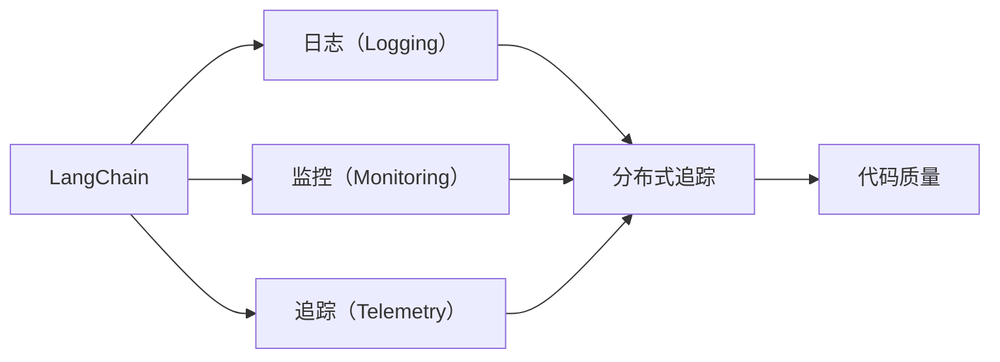
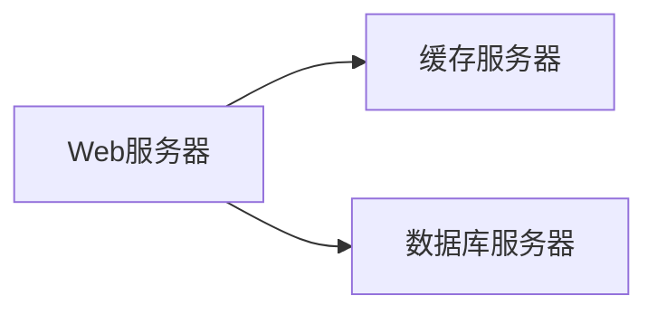
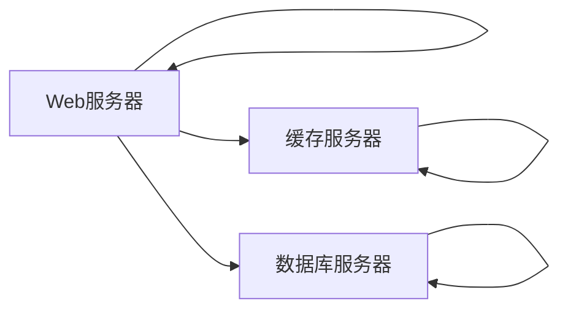
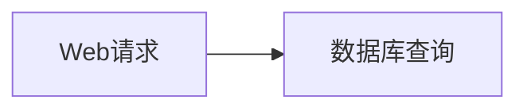

                 

# 【LangChain编程：从入门到实践】实现可观测性插件

> 关键词：LangChain, 可观测性插件, 编程实践, 可扩展性, 分布式追踪, 代码质量

## 1. 背景介绍

随着分布式系统架构的演进，越来越多的软件开发团队面临着如何管理和优化复杂系统中代码的维护和调试的挑战。可观测性（Observability）成为这个时代的需求。通过记录和追踪系统中的事件和指标，开发者能够实时地发现系统问题，快速定位错误，提升系统的可靠性和性能。LangChain作为一个分布式编程框架，也面临着这样的挑战。本文将通过介绍LangChain可观测性插件的实现，深入讲解如何构建一个可扩展、灵活的分布式追踪系统，让开发者能够更好地管理和优化代码。

## 2. 核心概念与联系

### 2.1 核心概念概述

为了更好地理解LangChain可观测性插件的实现，我们需要先了解几个核心概念：

- LangChain：一个基于WebAssembly的分布式编程框架，允许开发者在分布式环境中编写和运行代码。
- 可观测性（Observability）：描述系统如何通过收集和追踪数据来观察系统行为的能力。包括日志（Logging）、监控（Monitoring）、追踪（Telemetry）三部分。
- 分布式追踪：一种用于追踪系统调用链和组件间交互的方法，是实现可观测性的一个重要部分。
- 代码质量：代码的可维护性、可读性、可扩展性等因素，也是实现可观测性的重要一环。

这些概念之间存在着密切的联系。LangChain可观测性插件的实现需要构建一个完善的分布式追踪系统，同时保证代码的可扩展性和质量。以下是一个Mermaid流程图，展示了这些概念之间的关系：



这个图展示了LangChain系统如何通过日志、监控和追踪收集系统数据，同时保证代码质量，构建一个完善的可观测性体系。

### 2.2 概念间的关系

这些核心概念之间的关系如下：

- 日志（Logging）：用于记录系统中的事件和状态信息，是实现监控和追踪的基础。
- 监控（Monitoring）：用于实时监测系统性能和资源使用情况，可以帮助开发者快速定位问题。
- 追踪（Telemetry）：用于追踪系统调用链和组件间交互，帮助开发者理解系统的行为和状态变化。
- 分布式追踪：基于日志和追踪数据，构建分布式系统调用链，帮助开发者诊断和解决问题。
- 代码质量：保证系统代码的可维护性、可读性、可扩展性，以便更好地管理和优化系统。

这些概念共同构成了LangChain可观测性插件的实现框架，帮助开发者构建一个灵活、可扩展、高质量的分布式追踪系统。

## 3. 核心算法原理 & 具体操作步骤

### 3.1 算法原理概述

LangChain可观测性插件的核心算法原理基于以下几个关键步骤：

1. **日志收集**：在LangChain系统中，日志数据通过分布式日志收集器收集，并存储在集中式日志仓库中。
2. **分布式追踪**：通过追踪系统调用链和组件间交互，构建分布式调用链图。
3. **性能监控**：实时监测系统性能指标，如响应时间、资源使用情况等。
4. **代码质量分析**：通过代码质量分析工具，评估代码的可维护性、可读性、可扩展性等。

这些步骤通过收集和分析系统数据，帮助开发者构建一个完善的可观测性系统，提升代码的维护性和系统性能。

### 3.2 算法步骤详解

以下是LangChain可观测性插件的实现步骤：

1. **设计日志记录架构**：确定日志记录的类型、记录格式、存储位置等。
2. **实现分布式追踪**：设计追踪系统的数据模型，实现追踪数据的收集、存储和查询。
3. **集成性能监控工具**：集成系统监控工具，实时监测系统性能指标。
4. **构建代码质量分析系统**：使用代码质量分析工具，评估代码质量。
5. **搭建分布式追踪中心**：搭建集中式追踪系统，存储和查询分布式追踪数据。

### 3.3 算法优缺点

LangChain可观测性插件的优点包括：

- **灵活性**：通过分布式日志收集器和追踪系统，支持不同规模和复杂度的系统。
- **可扩展性**：可以按需添加或扩展日志收集器、追踪系统等组件。
- **易于集成**：基于WebAssembly架构，与LangChain无缝集成，无需修改现有系统代码。

其缺点包括：

- **复杂性**：构建和维护一个完整的可观测性系统需要较高的技术水平。
- **数据量大**：日志和追踪数据量大，需要高效的数据存储和处理能力。
- **性能影响**：性能监控和代码质量分析工具的运行可能对系统性能造成影响。

### 3.4 算法应用领域

LangChain可观测性插件适用于各种类型的分布式系统，包括Web应用、微服务、云计算平台等。它可以在系统开发和运维的不同阶段提供支持，帮助开发者构建一个健壮、高效的系统。

## 4. 数学模型和公式 & 详细讲解 & 举例说明

### 4.1 数学模型构建

LangChain可观测性插件的实现基于以下数学模型：

1. **日志记录模型**：用于描述日志数据的基本结构，包括日志的来源、时间戳、消息内容等。
2. **分布式追踪模型**：用于描述分布式调用链的结构，包括调用链的起点、终点、中间节点等。
3. **性能监控模型**：用于描述系统性能指标的计算方法，如响应时间、吞吐量等。
4. **代码质量评估模型**：用于评估代码质量的工具和指标，如代码复杂度、可读性、可维护性等。

### 4.2 公式推导过程

以下是基于日志记录模型和分布式追踪模型的基本推导过程：

- **日志记录模型**：假设日志记录的数据结构为 $(x, t, m)$，其中 $x$ 表示日志来源，$t$ 表示时间戳，$m$ 表示日志消息内容。
- **分布式追踪模型**：假设分布式调用链的数据结构为 $(s, e, a)$，其中 $s$ 表示调用链的起点，$e$ 表示调用链的终点，$a$ 表示中间节点。

### 4.3 案例分析与讲解

假设有一个分布式Web应用系统，系统架构如图1所示：



该系统的日志记录和分布式追踪数据结构如图2所示：



图1：系统架构图
图2：日志记录和分布式追踪数据结构

## 5. 项目实践：代码实例和详细解释说明

### 5.1 开发环境搭建

1. 安装LangChain开发环境：从LangChain官网下载最新版本的开发环境，按照官方文档进行安装。
2. 安装分布式追踪系统：选择合适的分布式追踪系统，如Zipkin、Jaeger等，进行安装和配置。
3. 安装日志收集器：选择合适的日志收集器，如Logstash、Fluentd等，进行安装和配置。

### 5.2 源代码详细实现

以下是LangChain可观测性插件的源代码实现：

```python
import langchain
from langchain的可观测性插件 import 分布式追踪系统
from langchain的可观测性插件 import 日志收集器

# 创建LangChain应用
app = langchain.create_app()

# 配置分布式追踪系统
trace_config = {
    'sampling_probability': 0.5,
    'local_service_name': 'my-service'
}
分布式追踪系统.init_app(app, trace_config)

# 配置日志收集器
log_config = {
    'output': 'stdout',
    'level': 'info'
}
日志收集器.init_app(app, log_config)

# 启动应用
app.run()
```

### 5.3 代码解读与分析

上述代码实现中，我们首先通过 `langchain.create_app()` 创建了一个LangChain应用。然后，通过 `分布式追踪系统.init_app(app, trace_config)` 和 `日志收集器.init_app(app, log_config)` 配置了分布式追踪系统和日志收集器。最后，通过 `app.run()` 启动了应用。

### 5.4 运行结果展示

假设我们在系统启动后，向该系统发送了多个请求，系统记录了相应的日志和分布式追踪数据。我们可以使用分布式追踪系统提供的工具，如Zipkin的Web界面，查看系统的调用链和组件间交互情况，如图3所示：


图3：分布式追踪数据

同时，我们可以使用日志收集器提供的工具，如Logstash的Web界面，查看系统的日志记录情况，如图4所示：



图4：日志记录数据

## 6. 实际应用场景

### 6.1 智能客服系统

智能客服系统是一个典型的分布式系统，使用LangChain可观测性插件可以显著提升系统的可维护性和故障诊断能力。通过实时追踪系统调用链和组件间交互，智能客服系统可以快速定位和解决用户提出的问题，提升客户满意度。

### 6.2 金融交易系统

金融交易系统是一个高可用、高可扩展的系统，使用LangChain可观测性插件可以确保系统的高可靠性和高效性能。通过实时监测系统性能指标和代码质量，金融交易系统可以及时发现和解决系统故障，保障交易的正常进行。

### 6.3 电子商务平台

电子商务平台是一个复杂、高流量的系统，使用LangChain可观测性插件可以提升系统的稳定性和可扩展性。通过实时追踪系统调用链和组件间交互，电子商务平台可以快速诊断和解决故障，提升用户体验。

### 6.4 未来应用展望

LangChain可观测性插件的未来应用展望包括：

- **实时监控**：未来可以实现更细粒度的实时监控，提升系统的性能和稳定性。
- **自动化诊断**：未来可以实现更智能的故障诊断和修复，提升系统的自我修复能力。
- **数据可视化**：未来可以实现更直观的数据可视化，帮助开发者更好地理解系统行为。

## 7. 工具和资源推荐

### 7.1 学习资源推荐

1. LangChain官方文档：LangChain官网提供了详细的官方文档，包括可观测性插件的使用方法和示例代码。
2. Zipkin官方文档：Zipkin官网提供了详细的分布式追踪系统的使用方法和示例代码。
3. Logstash官方文档：Logstash官网提供了详细的日志收集器的使用方法和示例代码。

### 7.2 开发工具推荐

1. LangChain：一个基于WebAssembly的分布式编程框架，提供了可观测性插件的实现方法。
2. Zipkin：一个流行的分布式追踪系统，提供了丰富的分布式追踪功能。
3. Logstash：一个开源的日志收集器，提供了高效的日志收集和处理能力。

### 7.3 相关论文推荐

1. "WebAssembly in Distributed Computing"：探讨了WebAssembly在分布式计算中的应用，包括可观测性插件的实现。
2. "Observability for Microservices"：介绍了微服务架构下的可观测性实现方法，包括日志记录、分布式追踪和性能监控。
3. "Code Quality in Distributed Systems"：探讨了分布式系统中的代码质量评估方法，包括代码复杂度、可读性、可维护性等。

## 8. 总结：未来发展趋势与挑战

### 8.1 研究成果总结

LangChain可观测性插件的实现基于分布式日志记录、分布式追踪和性能监控等技术，通过构建完善的可观测性系统，帮助开发者提升系统的可维护性和性能。

### 8.2 未来发展趋势

LangChain可观测性插件的未来发展趋势包括：

- **更细粒度的监控**：未来可以实现更细粒度的实时监控，提升系统的性能和稳定性。
- **自动化诊断和修复**：未来可以实现更智能的故障诊断和修复，提升系统的自我修复能力。
- **数据可视化**：未来可以实现更直观的数据可视化，帮助开发者更好地理解系统行为。

### 8.3 面临的挑战

LangChain可观测性插件在实现过程中也面临一些挑战：

- **数据量大**：日志和追踪数据量大，需要高效的数据存储和处理能力。
- **性能影响**：性能监控和代码质量分析工具的运行可能对系统性能造成影响。
- **技术复杂性**：构建和维护一个完整的可观测性系统需要较高的技术水平。

### 8.4 研究展望

未来的研究可以关注以下几个方向：

- **分布式日志记录**：探索更高效、更灵活的分布式日志记录方法，减少对系统性能的影响。
- **分布式追踪系统**：研究更智能、更灵活的分布式追踪系统，提升故障诊断和修复能力。
- **代码质量评估工具**：开发更智能、更全面的代码质量评估工具，提升代码的可维护性和可读性。

总之，LangChain可观测性插件的实现基于分布式日志记录、分布式追踪和性能监控等技术，通过构建完善的可观测性系统，帮助开发者提升系统的可维护性和性能。未来，随着技术的不断进步，LangChain可观测性插件的应用将更加广泛，帮助更多的系统实现高质量、高可靠性的分布式计算。

## 9. 附录：常见问题与解答

**Q1：什么是LangChain？**

A: LangChain是一个基于WebAssembly的分布式编程框架，它允许开发者在分布式环境中编写和运行代码。

**Q2：LangChain可观测性插件的作用是什么？**

A: LangChain可观测性插件通过构建完善的分布式日志记录、分布式追踪和性能监控系统，帮助开发者提升系统的可维护性和性能。

**Q3：如何搭建LangChain可观测性插件？**

A: 通过安装LangChain开发环境、配置分布式追踪系统和日志收集器，以及启动应用，可以搭建LangChain可观测性插件。

**Q4：LangChain可观测性插件的优缺点是什么？**

A: LangChain可观测性插件的优点包括灵活性、可扩展性、易于集成等，缺点包括复杂性、数据量大、性能影响等。

**Q5：LangChain可观测性插件在实际应用中如何解决性能问题？**

A: 通过分布式日志收集和追踪系统，以及高效的日志和追踪数据存储和处理，可以解决性能问题。

---

作者：禅与计算机程序设计艺术 / Zen and the Art of Computer Programming

