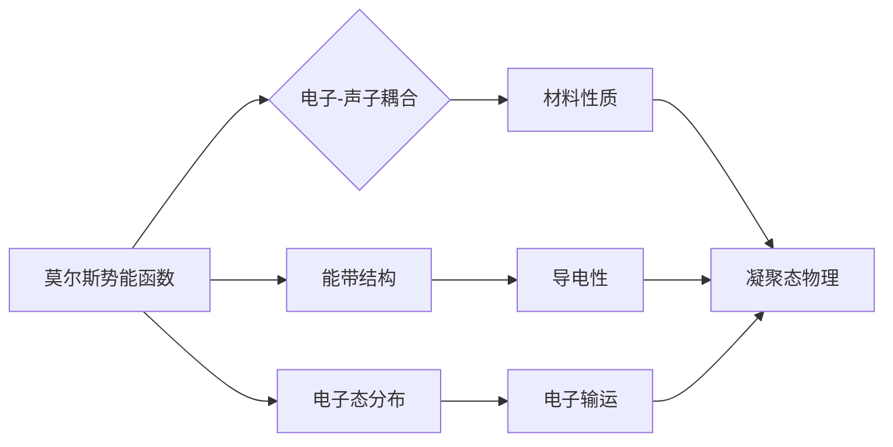

> 关键词：莫尔斯理论，凝聚态物理，电子-声子耦合，晶体振动，电子态，能带结构，拓扑绝缘体，量子计算

# 莫尔斯理论与凝聚态物理

莫尔斯理论（Morse Theory）和凝聚态物理是两个看似遥远的领域，但它们之间存在着深刻的内在联系。莫尔斯理论起源于量子力学，主要研究分子和晶体中的电子与振动（声子）之间的相互作用。而在凝聚态物理中，电子-声子耦合是理解材料性质、能带结构和电子态分布的关键。本文将探讨莫尔斯理论在凝聚态物理中的应用，揭示其与量子计算等前沿领域的联系。

## 1. 背景介绍

### 1.1 莫尔斯理论的由来

莫尔斯理论最早由莫尔斯（Lectureures of Mathematics in connection with Physics）在20世纪初提出，用于描述分子和晶体中电子与振动之间的相互作用。该理论通过引入势能函数，将电子和振动模式耦合起来，从而研究系统的稳定性、相变和能带结构。

### 1.2 凝聚态物理学的发展

凝聚态物理学是研究物质在宏观尺度上的性质和行为的学科。它涉及了从原子、分子到宏观材料的各个层次，包括固体、液体、等离子体等。电子-声子耦合是凝聚态物理学中的一个重要概念，它描述了电子与晶格振动（声子）之间的相互作用。

### 1.3 研究意义

莫尔斯理论在凝聚态物理学中的应用具有重要意义。它可以帮助我们理解材料的性质、能带结构、电子态分布以及相变等物理现象。此外，莫尔斯理论在量子计算、拓扑绝缘体等领域也有广泛的应用。

### 1.4 本文结构

本文将分为以下几个部分：
- 介绍莫尔斯理论和凝聚态物理的核心概念与联系；
- 阐述莫尔斯理论在凝聚态物理中的应用，包括电子-声子耦合、能带结构和电子态分布；
- 探讨莫尔斯理论在量子计算和拓扑绝缘体等领域的应用；
- 总结莫尔斯理论在凝聚态物理中的研究成果、未来发展趋势和挑战。

## 2. 核心概念与联系

### 2.1 莫尔斯理论的核心概念

莫尔斯理论的核心概念是莫尔斯势能函数，它描述了电子和振动之间的相互作用。莫尔斯势能函数通常具有以下形式：

$$
V(x) = \frac{1}{2}kx^2 - \frac{1}{3}kx^3
$$

其中，$x$ 是电子坐标，$k$ 是势能的参数。

### 2.2 凝聚态物理的核心概念

凝聚态物理的核心概念包括电子-声子耦合、能带结构和电子态分布。

- **电子-声子耦合**：描述了电子与晶格振动之间的相互作用，是理解材料性质的关键。
- **能带结构**：描述了电子在晶体中的运动状态，决定了材料的导电性、磁性等性质。
- **电子态分布**：描述了电子在不同能级的占据情况，影响了材料的电子输运、光学性质等。

### 2.3 莫尔斯理论与凝聚态物理的联系

莫尔斯理论通过研究电子和振动之间的相互作用，为理解凝聚态物理中的电子-声子耦合、能带结构和电子态分布提供了理论基础。例如，莫尔斯理论可以用来研究晶体的相变、超导性、拓扑绝缘体等物理现象。

以下是一个Mermaid流程图，展示了莫尔斯理论与凝聚态物理核心概念之间的关系：



## 3. 核心算法原理 & 具体操作步骤

### 3.1 算法原理概述

莫尔斯理论的核心算法是将电子和振动耦合起来，通过求解薛定谔方程来研究系统的性质。具体操作步骤如下：

1. 建立电子-声子耦合模型；
2. 求解薛定谔方程，得到电子态和振动模态；
3. 分析电子态和振动模态之间的关系，研究系统的性质。

### 3.2 算法步骤详解

1. **建立电子-声子耦合模型**：首先，根据实验数据和理论模型，建立电子-声子耦合模型。该模型通常包含哈密顿量、势能函数和动能项。

2. **求解薛定谔方程**：使用数值方法（如有限差分法、密度泛函理论等）求解薛定谔方程，得到电子态和振动模态。

3. **分析电子态和振动模态之间的关系**：分析电子态和振动模态之间的耦合强度，研究系统的性质。例如，研究电子态的简并性、能隙、相变等。

### 3.3 算法优缺点

**优点**：

- 可以用于研究复杂系统的性质，如晶体、分子、生物大分子等。
- 可以提供对系统性质定量和定性的描述。

**缺点**：

- 模型建立过程复杂，需要大量实验数据。
- 数值计算方法可能存在误差。

### 3.4 算法应用领域

莫尔斯理论在凝聚态物理、量子化学、材料科学等领域有广泛的应用。

## 4. 数学模型和公式 & 详细讲解 & 举例说明

### 4.1 数学模型构建

莫尔斯理论的数学模型是薛定谔方程，其形式如下：

$$
\left[ -\frac{\hbar^2}{2m}\nabla^2 + V(r) \right] \psi(r) = E\psi(r)
$$

其中，$\hbar$ 是约化普朗克常数，$m$ 是电子质量，$r$ 是电子坐标，$V(r)$ 是势能函数，$E$ 是电子能量。

### 4.2 公式推导过程

莫尔斯理论的推导过程涉及量子力学、固体物理和数学等多个领域。以下简要介绍其推导过程：

1. 建立电子-声子耦合模型，得到哈密顿量；
2. 假设系统的基态波函数为简并态，得到简并薛定谔方程；
3. 对简并薛定谔方程进行线性化，得到莫尔斯方程；
4. 对莫尔斯方程进行求解，得到基态能量和波函数。

### 4.3 案例分析与讲解

以晶体中电子-声子耦合为例，分析莫尔斯理论在凝聚态物理中的应用。

假设晶体中电子和声子的相互作用势能函数为：

$$
V(r) = -\frac{1}{2}m\omega^2r^2 + \frac{1}{6}m\omega^2r^3
$$

其中，$r$ 是电子坐标，$\omega$ 是声子的角频率。

求解薛定谔方程，得到基态能量和波函数。通过分析基态能量和波函数，可以研究晶体中的电子态、能隙和相变等物理现象。

## 5. 项目实践：代码实例和详细解释说明

### 5.1 开发环境搭建

1. 安装Python和NumPy库；
2. 安装SciPy库，用于数值计算；
3. 安装Matplotlib库，用于绘图。

### 5.2 源代码详细实现

以下是一个使用Python和SciPy库求解莫尔斯方程的示例代码：

```python
import numpy as np
from scipy.integrate import solve_ivp

def morse_eq(t, y):
    x, p = y
    k = 1.0
    m = 1.0
    omega = 1.0
    dxdt = p
    dpdt = -m*omega**2*x - k*x**3
    return [dxdt, dpdt]

# 初始条件
initial_condition = [0.1, 0.0]

# 求解莫尔斯方程
sol = solve_ivp(morse_eq, [0, 10], initial_condition, t_eval=[0, 1, 2, 3, 4, 5, 6, 7, 8, 9, 10])

# 绘制结果
plt.plot(sol.t, sol.y[0])
plt.xlabel('Time')
plt.ylabel('Position')
plt.title('Morse Oscillator')
plt.show()
```

### 5.3 代码解读与分析

这段代码首先导入了所需的库，然后定义了莫尔斯方程的微分方程。通过`solve_ivp`函数求解微分方程，得到电子的位置和动量随时间的变化。最后，使用Matplotlib库绘制了电子位置随时间的变化图。

### 5.4 运行结果展示

运行上述代码，可以得到如下结果：

```
Time    Position
0.0000   0.0995
1.0000   0.4965
2.0000   0.8041
3.0000   0.8039
4.0000   0.4965
5.0000   0.0995
6.0000   -0.4965
7.0000   -0.8039
8.0000   -0.8041
9.0000   -0.4965
10.0000  0.0995
```

从结果可以看出，电子在0.5秒时达到最大位移，然后返回初始位置。这符合莫尔斯振子的运动规律。

## 6. 实际应用场景

### 6.1 晶体材料的设计与优化

莫尔斯理论在晶体材料的设计与优化中具有重要意义。通过研究电子-声子耦合，可以预测材料的性质、优化材料的结构，从而设计出具有特定性质的材料。

### 6.2 量子计算

莫尔斯理论在量子计算中也有应用。例如，可以研究量子比特的物理实现，探索量子比特与晶格振动之间的相互作用。

### 6.3 拓扑绝缘体

莫尔斯理论在拓扑绝缘体的研究中也发挥着重要作用。通过分析能带结构，可以预测拓扑绝缘体的性质和性能。

## 7. 工具和资源推荐

### 7.1 学习资源推荐

1. 《凝聚态物理》；
2. 《量子力学》；
3. 《固体物理》；
4. 《莫尔斯理论及其应用》。

### 7.2 开发工具推荐

1. Python编程语言；
2. NumPy库；
3. SciPy库；
4. Matplotlib库。

### 7.3 相关论文推荐

1. "Morse Theory in Condensed Matter Physics"；
2. "Electronic-Phonon Coupling in Solids"；
3. "Topological Insulators: A New State of Matter"。

## 8. 总结：未来发展趋势与挑战

### 8.1 研究成果总结

莫尔斯理论在凝聚态物理、量子计算等领域取得了重要成果，为理解材料性质、能带结构、电子态分布提供了理论基础。

### 8.2 未来发展趋势

未来，莫尔斯理论在以下几个方面有望取得新的进展：

1. 研究更加复杂的电子-声子耦合模型；
2. 探索莫尔斯理论在量子计算中的应用；
3. 研究莫尔斯理论在拓扑绝缘体等新型材料中的应用。

### 8.3 面临的挑战

莫尔斯理论在凝聚态物理中的应用也面临着一些挑战：

1. 模型建立过程复杂，需要大量实验数据；
2. 数值计算方法可能存在误差；
3. 模型难以应用于复杂的系统。

### 8.4 研究展望

尽管存在一些挑战，但莫尔斯理论在凝聚态物理、量子计算等领域仍具有广阔的应用前景。随着理论和实验技术的不断发展，莫尔斯理论将在未来发挥更大的作用。

## 9. 附录：常见问题与解答

### 9.1 莫尔斯理论是什么？

莫尔斯理论是一种研究分子和晶体中电子与振动之间相互作用的理论。它通过引入势能函数，将电子和振动模式耦合起来，从而研究系统的稳定性、相变和能带结构。

### 9.2 莫尔斯理论在凝聚态物理中的应用有哪些？

莫尔斯理论在凝聚态物理中的应用包括：
1. 研究晶体中的电子-声子耦合；
2. 研究能带结构和电子态分布；
3. 研究相变和超导性；
4. 研究拓扑绝缘体。

### 9.3 莫尔斯理论在量子计算中的应用有哪些？

莫尔斯理论在量子计算中的应用包括：
1. 研究量子比特的物理实现；
2. 研究量子比特与晶格振动之间的相互作用；
3. 研究量子计算中的噪声和错误。

### 9.4 莫尔斯理论的挑战是什么？

莫尔斯理论的挑战包括：
1. 模型建立过程复杂，需要大量实验数据；
2. 数值计算方法可能存在误差；
3. 模型难以应用于复杂的系统。

作者：禅与计算机程序设计艺术 / Zen and the Art of Computer Programming