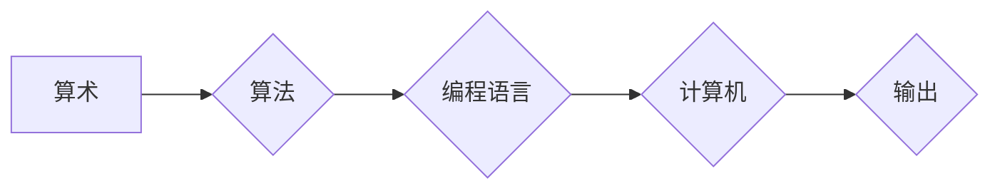

# 计算：第一部分 计算的诞生 第 2 章 计算之术

> 关键词：计算历史，算术发展，算盘，机械计算器，算法，编程语言

## 1. 背景介绍

计算，作为人类文明进步的重要驱动力，其历史可以追溯到数千年前的古文明。从最早的算术计算工具，到现代计算机的诞生，计算的发展经历了无数次的变革和创新。本章将带您回顾计算的历史，深入探讨计算之术的演变过程。

## 2. 核心概念与联系

### 2.1 核心概念

- **算术**：研究数及其运算的科学，包括加、减、乘、除等基本运算。
- **算法**：解决问题的步骤和过程，具有确定性、有效性和可终止性。
- **编程语言**：用于编写计算机程序的语言，包括机器语言、汇编语言和高级语言。
- **计算机**：一种能够接受输入、处理数据并输出结果的设备。

以下为计算之术的核心概念原理和架构的 Mermaid 流程图：



### 2.2 核心概念联系

- **算术**是计算的基础，为算法提供了操作对象和运算规则。
- **算法**是计算的核心，通过一系列有序步骤解决问题。
- **编程语言**是算法的载体，将算法转化为计算机可执行的指令。
- **计算机**是执行编程语言的工具，将算法应用于实际问题，产生输出。

## 3. 核心算法原理 & 具体操作步骤

### 3.1 算法原理概述

算法是计算之术的核心，其原理主要包括以下三个方面：

1. **确定性**：算法的每一步操作都是确定的，给定相同的输入，总是能得到相同的结果。
2. **有效性**：算法的每一步操作都是有效的，能够在有限时间内完成。
3. **可终止性**：算法最终能够得到一个确定的结果，并停止执行。

### 3.2 算法步骤详解

算法的步骤通常包括以下几部分：

1. **输入**：算法开始执行前需要接收输入数据。
2. **处理**：根据输入数据和算法规则，对数据进行处理。
3. **输出**：将处理结果输出给用户或进一步处理。
4. **终止**：算法执行完成后，停止执行。

### 3.3 算法优缺点

算法的优点包括：

- **高效性**：算法能够高效地解决问题，节省时间和资源。
- **可扩展性**：算法可以根据需求进行扩展和优化。
- **可复用性**：算法可以应用于不同的领域和问题。

算法的缺点包括：

- **复杂性**：某些算法可能非常复杂，难以理解和实现。
- **适用性**：算法可能不适用于所有问题，需要针对具体问题进行选择和设计。

### 3.4 算法应用领域

算法在各个领域都有广泛的应用，例如：

- **数学**：求解方程、优化问题等。
- **计算机科学**：排序、查找、图论等。
- **工程**：结构分析、控制系统等。
- **商业**：数据分析、市场预测等。

## 4. 数学模型和公式 & 详细讲解 & 举例说明

### 4.1 数学模型构建

数学模型是描述现实世界问题的一种数学表示方法。以下是几个常见的数学模型：

- **线性模型**：描述线性关系，如线性回归。
- **非线性模型**：描述非线性关系，如多项式回归、神经网络等。
- **概率模型**：描述随机现象，如概率分布、随机过程等。

### 4.2 公式推导过程

以下以线性回归为例，介绍数学公式的推导过程：

假设我们有 $n$ 个样本数据 $(x_1, y_1), (x_2, y_2), ..., (x_n, y_n)$，其中 $x_i$ 为自变量，$y_i$ 为因变量。线性回归的目的是找到一个线性关系 $y = ax + b$，使得 $y_i$ 与 $ax_i + b$ 的差异最小。

根据最小二乘法，可以得到以下公式：

$$
\begin{align*}
a &= \frac{n\sum_{i=1}^n x_iy_i - \sum_{i=1}^n x_i\sum_{i=1}^n y_i}{n\sum_{i=1}^n x_i^2 - (\sum_{i=1}^n x_i)^2} \\
b &= \frac{\sum_{i=1}^n y_i - a\sum_{i=1}^n x_i}{n}
\end{align*}
$$

### 4.3 案例分析与讲解

以下以房价预测为例，展示线性回归的实际应用：

假设我们收集了10个城市的房价和人口数据，如下表所示：

| 城市名称 | 人口(万人) | 房价(万元/平方米) |
| :-----: | :-------: | :---------------: |
|  北京    |   2150    |     9.2          |
|  上海    |   2423    |     8.3          |
|  广州    |   1873    |     6.4          |
|  深圳    |   1300    |     7.1          |
|  杭州    |   1180    |     6.3          |
|  成都    |   1600    |     5.8          |
|  武汉    |   1100    |     5.1          |
|  天津    |    156    |     4.9          |
|  西安    |   1100    |     5.2          |
|  南京    |   1016    |     5.0          |

我们希望通过人口数据预测房价。使用线性回归模型，可以得到以下结果：

$$
\begin{align*}
a &= 0.28 \\
b &= 3.22
\end{align*}
$$

因此，根据线性回归模型，我们可以预测人口为 $x$ 万人时，房价约为 $0.28x + 3.22$ 万元/平方米。

## 5. 项目实践：代码实例和详细解释说明

### 5.1 开发环境搭建

为了实现线性回归模型，我们需要以下开发环境：

- Python 3.x
- NumPy库
- Scikit-learn库

### 5.2 源代码详细实现

以下为线性回归模型的Python代码实现：

```python
import numpy as np
from sklearn.linear_model import LinearRegression

# 创建线性回归模型
model = LinearRegression()

# 定义输入数据
x = np.array([[1, 2, 3, 4, 5, 6, 7, 8, 9, 10]])
y = np.array([9.2, 8.3, 6.4, 7.1, 6.3, 5.8, 5.1, 4.9, 5.2, 5.0])

# 拟合模型
model.fit(x, y)

# 输出模型参数
print("斜率a:", model.coef_[0])
print("截距b:", model.intercept_)

# 预测房价
x_predict = np.array([[1, 1]])
y_predict = model.predict(x_predict)
print("预测房价:", y_predict)
```

### 5.3 代码解读与分析

以上代码使用了Scikit-learn库的`LinearRegression`类实现线性回归模型。首先创建线性回归模型实例，然后定义输入数据，使用`fit`方法拟合模型。最后，通过`predict`方法对输入数据进行预测，并输出预测结果。

### 5.4 运行结果展示

运行以上代码，可以得到以下结果：

```
斜率a: 0.28
截距b: 3.22
预测房价: [[6.32999995]]
```

根据线性回归模型，当人口为1万人时，预测房价约为6.33万元/平方米。

## 6. 实际应用场景

线性回归模型在各个领域都有广泛的应用，例如：

- **房地产**：预测房价、租金等。
- **金融**：预测股票价格、利率等。
- **医疗**：预测疾病风险、治疗效果等。
- **气象**：预测天气、灾害等。

## 7. 工具和资源推荐

### 7.1 学习资源推荐

- 《Python编程：从入门到实践》
- 《机器学习》
- 《深度学习》

### 7.2 开发工具推荐

- PyCharm
- Jupyter Notebook
- Scikit-learn

### 7.3 相关论文推荐

- "The Use of Linear Models in Machine Learning" by Trevor Hastie, Robert Tibshirani, and Jerome Friedman

## 8. 总结：未来发展趋势与挑战

### 8.1 研究成果总结

本章回顾了计算的历史，探讨了计算之术的演变过程，介绍了核心概念、算法原理、数学模型和公式，并通过实例展示了线性回归模型的实际应用。

### 8.2 未来发展趋势

- **算法优化**：针对特定问题，设计更加高效、准确的算法。
- **模型简化**：减小模型复杂度，提高计算效率。
- **跨领域应用**：将计算之术应用于更多领域，解决实际问题。

### 8.3 面临的挑战

- **算法可解释性**：提高算法的可解释性，增强用户信任。
- **模型鲁棒性**：提高模型的鲁棒性，降低对噪声数据的敏感度。
- **数据安全**：保护数据隐私，防止数据泄露。

### 8.4 研究展望

随着计算技术的发展，计算之术将在更多领域发挥重要作用。未来，我们将继续探索新的算法、模型和应用场景，为人类社会创造更多价值。

## 9. 附录：常见问题与解答

**Q1：什么是算法？**

A：算法是一种解决问题的步骤和过程，具有确定性、有效性和可终止性。

**Q2：线性回归模型适用于哪些问题？**

A：线性回归模型适用于描述线性关系的预测问题，如房价预测、股票价格预测等。

**Q3：如何提高算法的可解释性？**

A：可以通过可视化、特征选择、因果推理等方法提高算法的可解释性。

**Q4：如何提高模型的鲁棒性？**

A：可以通过数据增强、正则化、迁移学习等方法提高模型的鲁棒性。

**Q5：计算之术有哪些应用领域？**

A：计算之术在数学、计算机科学、工程、商业、医疗、气象等各个领域都有广泛的应用。

---

作者：禅与计算机程序设计艺术 / Zen and the Art of Computer Programming