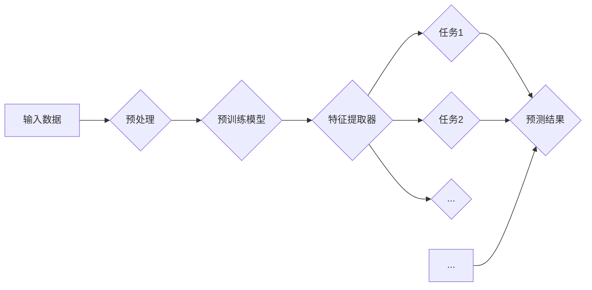

# 迁移学习 原理与代码实例讲解

> 关键词：迁移学习，预训练，多任务学习，多模型学习，特征提取，知识迁移，自然语言处理，计算机视觉

## 1. 背景介绍

随着人工智能技术的飞速发展，深度学习在图像识别、语音识别、自然语言处理等领域取得了显著的成果。然而，深度学习模型往往需要大量的标注数据进行训练，这在实际应用中往往难以满足。为了解决这一问题，迁移学习（Transfer Learning）应运而生。迁移学习通过将知识从一个领域迁移到另一个领域，实现了在有限的标注数据下，提升模型性能的目标。本文将深入探讨迁移学习的原理、方法以及代码实例，帮助读者全面了解这一重要的人工智能技术。

## 2. 核心概念与联系

### 2.1 核心概念

#### 预训练

预训练是指在大规模无标注数据上训练深度学习模型，使其具备一定的通用特征提取能力。预训练模型通常用于以下两种情况：

1. **通用领域预训练**：在通用领域的大规模数据上预训练模型，使其具备一定的通用特征提取能力。
2. **特定领域预训练**：在特定领域的大规模数据上预训练模型，使其具备针对该领域的特征提取能力。

#### 多任务学习

多任务学习是指同时学习多个相关的任务，通过任务之间的相互关联，提高模型的泛化能力。多任务学习可以帮助模型在不同任务之间共享特征提取能力，从而减少对标注数据的需求。

#### 多模型学习

多模型学习是指使用多个模型进行学习，并通过集成方法融合多个模型的结果。多模型学习可以提高模型的鲁棒性和泛化能力。

### 2.2 核心概念原理和架构的 Mermaid 流程图



### 2.3 核心概念之间的联系

迁移学习通过多任务学习和多模型学习，将预训练模型的知识迁移到新的任务中。预训练模型学习到的通用特征提取能力，可以帮助模型在新的任务中更好地学习特征，从而提高模型在新的任务上的性能。

## 3. 核心算法原理 & 具体操作步骤

### 3.1 算法原理概述

迁移学习的基本思想是：将预训练模型学习到的通用特征提取能力迁移到新的任务中。具体来说，可以通过以下几种方式进行：

1. **特征提取器共享**：在新的任务中，直接使用预训练模型的特征提取器，只对新任务的任务特定层进行训练。
2. **特征重用**：将预训练模型的特征提取器作为新任务的特征层，在上层构建新的任务特定层。
3. **参数调整**：在新的任务中，对预训练模型的参数进行微调，以适应新的任务。

### 3.2 算法步骤详解

1. **选择预训练模型**：根据任务特点选择合适的预训练模型。
2. **数据预处理**：对新的任务数据进行预处理，包括数据清洗、数据增强等。
3. **模型初始化**：使用预训练模型初始化新任务的模型参数。
4. **特征提取**：使用预训练模型的特征提取器提取新任务的特征。
5. **任务特定层训练**：在新任务的特征层上添加任务特定层，并进行训练。
6. **模型评估**：在新任务的数据集上评估模型的性能。

### 3.3 算法优缺点

#### 优点

1. **减少标注数据需求**：通过迁移学习，可以在有限的标注数据下，提高模型的性能。
2. **提高模型泛化能力**：迁移学习可以帮助模型学习到更通用的特征，从而提高模型的泛化能力。
3. **加快模型训练速度**：由于预训练模型已经学习到了一定的通用特征，因此新任务的模型训练速度更快。

#### 缺点

1. **预训练模型的选择**：选择合适的预训练模型对迁移学习的效果有很大影响。
2. **数据不匹配**：当新任务的数据与预训练模型的数据分布不一致时，迁移学习的效果会受到影响。
3. **模型性能瓶颈**：迁移学习并不能保证在新任务上达到最佳性能，有时甚至可能低于从头开始训练的性能。

### 3.4 算法应用领域

迁移学习在多个领域都得到了广泛应用，以下是一些典型的应用领域：

1. **自然语言处理**：文本分类、情感分析、机器翻译等。
2. **计算机视觉**：图像分类、目标检测、图像分割等。
3. **语音识别**：语音识别、语音合成等。
4. **推荐系统**：物品推荐、广告推荐等。

## 4. 数学模型和公式 & 详细讲解 & 举例说明

### 4.1 数学模型构建

假设预训练模型的输出为 $f(x)$，其中 $x$ 为输入数据，$f(x)$ 为特征向量。在新任务中，我们将预训练模型的特征提取器作为特征层，构建新的任务特定层 $g(f(x))$，其中 $g$ 为新任务的学习函数。模型的损失函数为：

$$
L = \frac{1}{N} \sum_{i=1}^N (g(f(x_i)) - y_i)^2
$$

其中，$N$ 为样本数量，$y_i$ 为真实标签。

### 4.2 公式推导过程

假设预训练模型的损失函数为 $L_{pre}$，新任务的损失函数为 $L_{task}$。则迁移学习的损失函数为：

$$
L = \lambda L_{pre} + (1-\lambda) L_{task}
$$

其中，$\lambda$ 为超参数，用于平衡预训练损失和新任务损失。

### 4.3 案例分析与讲解

以下是一个简单的迁移学习案例：使用预训练的卷积神经网络（CNN）进行图像分类。

1. **选择预训练模型**：选择在ImageNet数据集上预训练的VGG19模型。
2. **数据预处理**：对新的任务数据进行预处理，包括数据清洗、数据增强等。
3. **模型初始化**：使用VGG19模型初始化新任务的模型参数。
4. **特征提取**：使用VGG19模型的特征提取器提取新任务的特征。
5. **任务特定层训练**：在新任务的特征层上添加全连接层，并进行训练。
6. **模型评估**：在新任务的数据集上评估模型的性能。

通过这个案例，我们可以看到迁移学习的基本步骤和实现过程。

## 5. 项目实践：代码实例和详细解释说明

### 5.1 开发环境搭建

1. 安装Python环境（推荐使用Anaconda）。
2. 安装深度学习框架（推荐使用PyTorch或TensorFlow）。
3. 下载预训练模型。

### 5.2 源代码详细实现

以下是一个使用PyTorch实现迁移学习的简单代码示例：

```python
import torch
import torch.nn as nn
import torchvision.transforms as transforms
from torchvision.models import resnet50
from torch.utils.data import DataLoader, Dataset

# 数据预处理
transform = transforms.Compose([
    transforms.Resize((224, 224)),
    transforms.ToTensor(),
])

# 下载并加载预训练模型
model = resnet50(pretrained=True)

# 定义新的任务特定层
class NewTask(nn.Module):
    def __init__(self):
        super(NewTask, self).__init__()
        self.fc = nn.Linear(2048, 10)  # 修改为你的任务类别数

    def forward(self, x):
        x = model(x)
        x = x.view(x.size(0), -1)
        x = self.fc(x)
        return x

# 加载数据集
dataset = MyDataset(root='path/to/your/dataset', transform=transform)
dataloader = DataLoader(dataset, batch_size=32, shuffle=True)

# 定义损失函数和优化器
criterion = nn.CrossEntropyLoss()
optimizer = torch.optim.Adam(model.parameters(), lr=0.001)

# 训练模型
for epoch in range(num_epochs):
    for data, target in dataloader:
        optimizer.zero_grad()
        output = model(data)
        loss = criterion(output, target)
        loss.backward()
        optimizer.step()
```

### 5.3 代码解读与分析

上述代码展示了如何使用PyTorch实现迁移学习的基本步骤。首先，我们加载了一个预训练的VGG19模型，并定义了一个新的任务特定层。然后，我们加载数据集，并定义了损失函数和优化器。最后，我们通过迭代训练数据，更新模型参数。

### 5.4 运行结果展示

在训练完成后，我们可以在新任务的数据集上评估模型的性能。以下是一个简单的性能评估代码示例：

```python
# 测试模型
model.eval()
with torch.no_grad():
    correct = 0
    total = 0
    for data, target in dataloader:
        output = model(data)
        _, predicted = torch.max(output.data, 1)
        total += target.size(0)
        correct += (predicted == target).sum().item()

print('Accuracy of the model on the test images: {} %'.format(100 * correct / total))
```

通过运行上述代码，我们可以得到模型的测试精度。

## 6. 实际应用场景

### 6.1 图像识别

迁移学习在图像识别领域得到了广泛应用。例如，使用在ImageNet数据集上预训练的ResNet模型进行物体识别、植物分类等任务。

### 6.2 语音识别

迁移学习在语音识别领域也取得了显著成果。例如，使用在大型语音语料库上预训练的声学模型进行语音识别、说话人识别等任务。

### 6.3 自然语言处理

迁移学习在自然语言处理领域也得到了广泛应用。例如，使用在大型文本语料库上预训练的语言模型进行文本分类、情感分析、机器翻译等任务。

### 6.4 未来应用展望

随着深度学习技术的不断发展，迁移学习将在更多领域得到应用，为人工智能技术的发展提供新的动力。

## 7. 工具和资源推荐

### 7.1 学习资源推荐

1. 《深度学习》 [Goodfellow et al.]
2. 《动手学深度学习》 [Deng et al.]
3. PyTorch官方文档：https://pytorch.org/tutorials/
4. TensorFlow官方文档：https://www.tensorflow.org/tutorials/

### 7.2 开发工具推荐

1. PyTorch：https://pytorch.org/
2. TensorFlow：https://www.tensorflow.org/
3. Keras：https://keras.io/
4. Jupyter Notebook：https://jupyter.org/

### 7.3 相关论文推荐

1. "Transfer Learning with Deep Neural Networks" [Yosinski et al.]
2. "Deep Learning with Very Few Examples" [Nguyen et al.]
3. "A Survey on Transfer Learning" [Pan et al.]

## 8. 总结：未来发展趋势与挑战

### 8.1 研究成果总结

迁移学习作为一种重要的机器学习技术，在多个领域都取得了显著的成果。随着深度学习技术的不断发展，迁移学习将在更多领域得到应用，为人工智能技术的发展提供新的动力。

### 8.2 未来发展趋势

1. **跨域迁移学习**：研究如何将知识从一个领域迁移到另一个领域，即使这两个领域的数据分布差异很大。
2. **无监督迁移学习**：研究如何在没有标注数据的情况下，利用无标注数据提升模型性能。
3. **多模态迁移学习**：研究如何将不同模态的数据进行整合，提升模型对复杂场景的理解能力。

### 8.3 面临的挑战

1. **数据不匹配**：当新任务的数据与预训练模型的数据分布不一致时，迁移学习的效果会受到影响。
2. **模型性能瓶颈**：迁移学习并不能保证在新任务上达到最佳性能，有时甚至可能低于从头开始训练的性能。
3. **可解释性**：如何解释迁移学习的过程和结果，是一个重要的研究方向。

### 8.4 研究展望

迁移学习作为一种重要的机器学习技术，将在未来人工智能技术的发展中扮演越来越重要的角色。通过不断探索和创新，相信迁移学习将为人工智能技术的进步做出更大的贡献。

## 9. 附录：常见问题与解答

### 9.1 迁移学习与多任务学习的区别是什么？

迁移学习是指将知识从一个领域迁移到另一个领域，而多任务学习是指同时学习多个相关的任务。两者之间的区别在于，迁移学习关注的是领域之间的迁移，而多任务学习关注的是任务之间的共享。

### 9.2 如何选择合适的预训练模型？

选择合适的预训练模型需要根据任务的特点和数据分布进行选择。一般来说，预训练模型的数据分布越接近新任务的数据分布，迁移学习的效果越好。

### 9.3 迁移学习是否适用于所有任务？

迁移学习适用于大多数任务，但并非所有任务都适用于迁移学习。对于一些需要大量标注数据才能学习的任务，迁移学习的效果可能不如从头开始训练。

### 9.4 如何评估迁移学习的效果？

评估迁移学习的效果可以通过在新的任务上测试模型的性能来实现。常用的评估指标包括准确率、召回率、F1值等。

作者：禅与计算机程序设计艺术 / Zen and the Art of Computer Programming