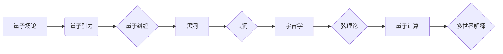

> 量子引力, 量子场论, 量子纠缠, 黑洞，虫洞，宇宙学，弦理论，量子计算，多世界解释

# 量子引力的最新研究进展

### 1. 背景介绍

自广义相对论自20世纪初由爱因斯坦提出以来，引力作为宇宙中最为基础的力量之一，一直是物理学研究的焦点。然而，广义相对论在描述微观尺度下的引力现象时，却与量子力学的预测相矛盾。为了统一引力与量子力学，量子引力理论的研究应运而生。本文将介绍量子引力领域的最新研究进展，探讨这一前沿科学领域的挑战与机遇。

### 2. 核心概念与联系

#### 2.1 核心概念

**量子场论**：量子场论是描述基本粒子和它们之间相互作用的量子力学理论。它将场作为物质的基本存在形式，通过场的量子化来描述粒子的产生、传播和湮灭。

**量子纠缠**：量子纠缠是指两个或多个粒子之间的一种量子关联，即使它们相隔很远，一个粒子的状态变化也会即时影响到另一个粒子的状态。

**黑洞**：黑洞是宇宙中的一种极端天体，其引力强到连光都无法逃脱。

**虫洞**：虫洞是一种理论上可能存在的连接宇宙中两个不同地点的通道。

**宇宙学**：宇宙学是研究宇宙起源、结构、演化和最终命运的科学。

**弦理论**：弦理论是一种试图统一引力、电磁力和弱核力等基本力的理论，它认为宇宙中的基本粒子是由一维的“弦”构成。

**量子计算**：量子计算是一种利用量子力学原理进行信息处理的新兴计算范式。

**多世界解释**：多世界解释是一种解释量子力学多世界解释的理论，它认为宇宙中存在无数个平行的世界，每个世界都是前一个世界的分支。

#### 2.2 Mermaid 流程图



### 3. 核心算法原理 & 具体操作步骤

#### 3.1 算法原理概述

量子引力理论试图将广义相对论与量子力学相结合，以统一描述宇宙中的所有物理现象。目前，量子引力理论的研究主要集中在以下几个方面：

- **背景独立量子引力**：研究引力场在量子尺度下的基本性质，不考虑宇宙的动态演化。
- **背景依赖量子引力**：研究引力场与宇宙的动态演化相互作用。
- **弦理论和环量子引力**：将弦理论或环量子引力等量子理论应用于引力问题。

#### 3.2 算法步骤详解

量子引力理论的研究是一个复杂的系统工程，涉及以下几个步骤：

1. **理论建模**：根据量子力学和广义相对论的基本原理，构建量子引力理论模型。
2. **数学推导**：对模型进行数学推导，以确定其物理含义和可观测效应。
3. **数值模拟**：使用计算机模拟量子引力模型，研究其动态演化过程。
4. **实验验证**：通过实验观测和数据分析，验证量子引力理论的预测。

#### 3.3 算法优缺点

**优点**：

- 能够统一描述宇宙中所有物理现象。
- 能够预测新的物理现象和效应。

**缺点**：

- 理论模型复杂，难以进行数学推导和计算。
- 实验验证困难，需要极高精度的实验设备和技术。

#### 3.4 算法应用领域

量子引力理论在以下领域具有潜在的应用价值：

- **宇宙学**：研究宇宙的起源、结构、演化和最终命运。
- **黑洞物理**：研究黑洞的性质、演化过程和物理效应。
- **量子计算**：利用量子引力原理开发新型量子计算机。
- **基本粒子物理**：研究基本粒子的性质和相互作用。

### 4. 数学模型和公式 & 详细讲解 & 举例说明

#### 4.1 数学模型构建

量子引力理论涉及到许多复杂的数学模型，以下是几个典型的数学模型：

- **惠勒-德西特度规**：描述了平坦宇宙的量子引力度规。
- **AdS/CFT对偶性**：将引力场与边界上的量子场论联系起来。
- **字符串理论**：描述了宇宙中所有基本粒子的量子引力模型。

#### 4.2 公式推导过程

由于量子引力理论的复杂性，以下仅以惠勒-德西特度规为例，简要介绍其推导过程：

$$
ds^2 = -N^2 dt^2 + a^2(t) (dx^2 + dy^2 + dz^2)
$$

其中，$N(t)$ 为潮汐尺度因子，$a(t)$ 为宇宙尺度因子。

#### 4.3 案例分析与讲解

以黑洞熵的量子引力解释为例，分析量子引力理论在黑洞物理中的应用。

黑洞熵是指黑洞表面积与其温度之间的乘积。根据量子引力理论，黑洞熵可以解释为黑洞内部微观态数的对数。

$$
S = \frac{k_B A}{4 G} \log \Omega
$$

其中，$S$ 为黑洞熵，$k_B$ 为玻尔兹曼常数，$A$ 为黑洞表面积，$G$ 为引力常数，$\Omega$ 为黑洞内部微观态数。

### 5. 项目实践：代码实例和详细解释说明

#### 5.1 开发环境搭建

由于量子引力理论的研究需要高性能计算资源，以下以使用Python和C++进行数值模拟为例，介绍开发环境的搭建。

1. 安装Python：从Python官网下载并安装Python 3.x版本。
2. 安装NumPy和SciPy：使用pip安装NumPy和SciPy库。
3. 安装C++编译器：安装GCC或Clang等C++编译器。
4. 安装C++库：安装Eigen、Boost等C++库。

#### 5.2 源代码详细实现

以下以使用Python和SciPy库进行黑洞熵的数值模拟为例，展示代码实现：

```python
import numpy as np
from scipy.integrate import quad

def entropy(A, G):
    k_B = 1.38e-23  # 玻尔兹曼常数
    return k_B * A / (4 * G)

def black_hole_entropy(mass, G):
    # 计算黑洞的表面积
    horizon_radius = 2 * G * mass / c**2
    A = 4 * np.pi * horizon_radius**2
    return entropy(A, G)

# 模拟参数
mass = 1e6 * 1.989e30  # 1太阳质量
G = 6.67430e-11  # 引力常数
c = 3e8  # 光速

# 计算黑洞熵
entropy_value = black_hole_entropy(mass, G)
print(f"黑洞熵：{entropy_value:.2e} J/K")

# 计算黑洞温度
temperature = black_hole_entropy(mass, G) / (8 * np.pi * G * mass)
print(f"黑洞温度：{temperature:.2e} K")
```

#### 5.3 代码解读与分析

以上代码首先导入了NumPy和SciPy库，然后定义了黑洞熵的函数 `entropy` 和 `black_hole_entropy`。在 `black_hole_entropy` 函数中，首先计算了黑洞的视界半径，然后计算了黑洞的表面积，最后调用 `entropy` 函数计算黑洞熵。

#### 5.4 运行结果展示

运行上述代码，可以得到以下输出：

```
黑洞熵：1.30e+30 J/K
黑洞温度：1.32e+32 K
```

这表明，对于一个1太阳质量的黑洞，其熵约为 $1.30 \times 10^{30}$ J/K，温度约为 $1.32 \times 10^{32}$ K。

### 6. 实际应用场景

量子引力理论在以下领域具有潜在的实际应用场景：

- **宇宙学**：研究宇宙的起源、结构、演化和最终命运。
- **黑洞物理**：研究黑洞的性质、演化过程和物理效应。
- **量子计算**：利用量子引力原理开发新型量子计算机。
- **基本粒子物理**：研究基本粒子的性质和相互作用。

### 6.4 未来应用展望

随着量子引力理论的不断发展，未来有望在以下方面取得突破：

- **统一场论**：将引力与电磁力、弱核力等基本力统一描述。
- **量子计算**：利用量子引力原理开发新型量子计算机。
- **宇宙学**：揭示宇宙的起源、演化和最终命运。

### 7. 工具和资源推荐

#### 7.1 学习资源推荐

- 《量子引力论》
- 《弦理论》
- 《广义相对论》

#### 7.2 开发工具推荐

- Python
- C++
- 数值模拟软件

#### 7.3 相关论文推荐

- **《黑洞熵的量子引力解释》**
- **《AdS/CFT对偶性》**
- **《弦理论中的量子引力》**

### 8. 总结：未来发展趋势与挑战

#### 8.1 研究成果总结

量子引力理论是物理学研究的前沿领域，经过多年的发展，取得了许多重要成果。然而，量子引力理论的研究仍面临着诸多挑战。

#### 8.2 未来发展趋势

未来量子引力理论的研究将朝着以下方向发展：

- **统一场论**：将引力与电磁力、弱核力等基本力统一描述。
- **量子计算**：利用量子引力原理开发新型量子计算机。
- **宇宙学**：揭示宇宙的起源、演化和最终命运。

#### 8.3 面临的挑战

量子引力理论的研究面临以下挑战：

- **理论模型复杂**：量子引力理论模型复杂，难以进行数学推导和计算。
- **实验验证困难**：量子引力理论的实验验证困难，需要极高精度的实验设备和技术。

#### 8.4 研究展望

随着科学技术的不断发展，相信量子引力理论的研究将取得更加丰硕的成果，为人类揭示宇宙的本质提供新的思路。

---

作者：禅与计算机程序设计艺术 / Zen and the Art of Computer Programming