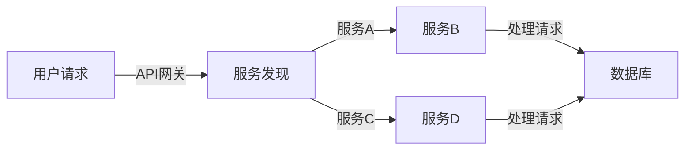

> 高并发，微服务架构，服务拆分，分布式系统，负载均衡，CAP定理，一致性，容器化，DevOps

# 高并发服务、微服务架构设计和实现

在当今互联网时代，随着业务规模的不断扩大和用户需求的日益增长，传统的单体架构已经难以满足高并发、可扩展、高可用等需求。为了应对这些挑战，微服务架构应运而生。本文将深入探讨高并发服务的架构设计、微服务架构的原理与实现，以及相关的工具和资源，旨在为开发者提供全面的技术指导和实践参考。

## 1. 背景介绍

### 1.1 问题的由来

随着互联网应用的不断发展，用户数量和业务需求呈指数级增长，传统的单体架构面临着以下问题：

- **扩展性差**：单体架构将所有功能集中在一个应用中，难以横向扩展。
- **维护困难**：随着功能模块的增加，系统复杂度不断提高，维护难度也随之增加。
- **部署困难**：单体架构的部署流程复杂，难以实现快速迭代。

为了解决这些问题，微服务架构应运而生。微服务架构将系统拆分成多个独立的服务，每个服务负责特定的功能，通过轻量级的通信机制（如RESTful API）进行交互。

### 1.2 研究现状

微服务架构自提出以来，已经得到了广泛的关注和应用。目前，已经有许多成熟的微服务框架和工具，如Spring Cloud、Dubbo、Kubernetes等，为微服务架构的实现提供了强大的支持。

### 1.3 研究意义

研究高并发服务和微服务架构，对于以下方面具有重要意义：

- 提升系统的可扩展性和可维护性。
- 加快系统开发和部署速度。
- 提高系统的可用性和容错能力。

### 1.4 本文结构

本文将按照以下结构进行阐述：

- 第2部分介绍微服务架构的核心概念和原理。
- 第3部分讲解高并发服务的架构设计和实现。
- 第4部分分析微服务架构的挑战和解决方案。
- 第5部分介绍微服务架构的实际应用场景。
- 第6部分展望微服务架构的未来发展趋势。
- 第7部分推荐相关的学习资源和开发工具。

## 2. 核心概念与联系

### 2.1 核心概念

#### 2.1.1 微服务架构

微服务架构（Microservices Architecture）是一种设计方法，将单体应用拆分成多个独立的服务，每个服务负责特定的功能。这些服务之间通过轻量级通信机制（如RESTful API）进行交互，独立部署和扩展。

#### 2.1.2 高并发

高并发（High Concurrency）是指系统能够同时处理大量请求的能力。高并发系统需要具备快速响应、高吞吐量、低延迟等特点。

#### 2.1.3 分布式系统

分布式系统（Distributed System）是指由多个独立计算机组成的系统，这些计算机通过网络连接，协同工作完成特定任务。

#### 2.1.4 负载均衡

负载均衡（Load Balancing）是指将请求均匀地分配到多个服务器上，以提高系统的吞吐量和可用性。

#### 2.1.5 CAP定理

CAP定理（CAP Theorem）指出，在分布式系统中，一致性（Consistency）、可用性（Availability）和分区容错性（Partition Tolerance）三者中，最多只能同时满足两项。

### 2.2 架构流程图



图中，用户请求首先经过API网关，然后根据请求内容选择合适的服务进行处理，最后将处理结果存储到数据库中。

## 3. 核心算法原理 & 具体操作步骤

### 3.1 算法原理概述

微服务架构的核心算法原理主要包括：

- **服务拆分**：根据业务需求将单体应用拆分成多个独立的服务。
- **服务发现**：实现服务之间的动态发现和注册。
- **负载均衡**：将请求均匀地分配到多个服务实例上。
- **分布式事务**：实现跨服务的事务管理。

### 3.2 算法步骤详解

#### 3.2.1 服务拆分

服务拆分通常遵循以下原则：

- **业务驱动**：根据业务需求将功能模块拆分成独立的服务。
- **功能单一**：每个服务只负责一个单一的功能。
- **接口清晰**：服务之间通过轻量级通信机制（如RESTful API）进行交互。

#### 3.2.2 服务发现

服务发现包括以下步骤：

- **服务注册**：服务启动时向服务注册中心注册自身信息。
- **服务发现**：客户端通过服务注册中心获取服务列表。
- **服务调用**：客户端根据服务发现结果调用服务。

#### 3.2.3 负载均衡

负载均衡包括以下步骤：

- **负载均衡器**：部署负载均衡器，如Nginx、HAProxy等。
- **请求分发**：负载均衡器将请求分发到不同的服务实例。
- **健康检查**：定期对服务实例进行健康检查，确保服务可用。

#### 3.2.4 分布式事务

分布式事务包括以下步骤：

- **两阶段提交**：通过两阶段提交协议保证跨服务事务的一致性。
- **补偿事务**：在两阶段提交失败时，执行补偿事务以恢复数据一致性。

### 3.3 算法优缺点

#### 3.3.1 优点

- **可扩展性**：通过水平扩展服务实例，提高系统吞吐量。
- **可维护性**：独立部署和扩展服务，降低系统复杂度。
- **可复用性**：服务之间可以独立开发、测试和部署，提高开发效率。

#### 3.3.2 缺点

- **分布式复杂性**：服务之间通信需要考虑网络延迟、容错等问题。
- **事务一致性**：跨服务事务的一致性保证相对复杂。
- **服务治理**：需要实现服务注册、发现、监控、熔断等治理机制。

### 3.4 算法应用领域

微服务架构适用于以下领域：

- **电子商务**：如在线购物平台、票务系统等。
- **社交网络**：如微博、抖音等。
- **金融系统**：如银行、证券等。
- **企业级应用**：如ERP、CRM等。

## 4. 数学模型和公式 & 详细讲解 & 举例说明

### 4.1 数学模型构建

微服务架构的数学模型主要包括：

- **服务数量模型**：描述服务数量的分布和增长规律。
- **请求量模型**：描述请求量的分布和增长规律。
- **负载模型**：描述服务实例的负载情况。

### 4.2 公式推导过程

#### 4.2.1 服务数量模型

假设服务数量服从泊松分布，则服务数量模型可表示为：

$$
P(X=n) = \frac{\lambda^n e^{-\lambda}}{n!}
$$

其中，$P(X=n)$ 表示在时刻t，服务数量为n的概率，$\lambda$ 为服务生成的平均速率。

#### 4.2.2 请求量模型

假设请求量服从泊松分布，则请求量模型可表示为：

$$
P(Y=m) = \frac{\mu^m e^{-\mu}}{m!}
$$

其中，$P(Y=m)$ 表示在时刻t，请求量为m的概率，$\mu$ 为请求生成的平均速率。

#### 4.2.3 负载模型

假设每个服务实例的负载服从指数分布，则负载模型可表示为：

$$
P(Z=z) = \lambda e^{-\lambda z}
$$

其中，$P(Z=z)$ 表示在时刻t，服务实例的负载为z的概率，$\lambda$ 为负载生成的平均速率。

### 4.3 案例分析与讲解

假设某在线购物平台，每天有1000个用户访问，每个用户平均发起10次请求。根据请求量模型，可以计算出一天内请求量的分布：

| 请求量 | 概率 |
| :---: | :---: |
| 10 | 0.0228 |
| 20 | 0.0462 |
| 30 | 0.0733 |
| 40 | 0.1054 |
| 50 | 0.1336 |
| ... | ... |

可以看出，请求量主要集中在10到50之间，可以针对性地对这部分请求量进行优化。

## 5. 项目实践：代码实例和详细解释说明

### 5.1 开发环境搭建

以Spring Cloud微服务框架为例，搭建开发环境如下：

1. 安装Java开发环境，如JDK 1.8及以上版本。
2. 安装Maven或Gradle作为构建工具。
3. 创建Spring Boot项目，引入Spring Cloud依赖。
4. 编写微服务代码，实现服务拆分、服务发现、负载均衡等功能。

### 5.2 源代码详细实现

以下是一个简单的服务拆分示例：

```java
@RestController
@RequestMapping("/product")
public class ProductService {

    @Autowired
    private ProductServiceClient productServiceClient;

    @GetMapping("/{id}")
    public Product getProductById(@PathVariable Long id) {
        return productServiceClient.getProductById(id);
    }
}
```

该示例中，`ProductService` 是一个服务类，负责处理商品信息的查询。它通过 `ProductServiceClient` 调用其他服务（如库存服务、订单服务等）获取相关数据。

### 5.3 代码解读与分析

该示例中，`ProductService` 使用了Spring Cloud的 `@RestController` 注解，表示该类是一个RESTful API控制器。`@RequestMapping("/product")` 表示该控制器处理 `/product` 路径的请求。`@GetMapping("/{id}")` 表示该控制器处理GET请求，并从路径中获取商品ID。

`ProductService` 注入了 `ProductServiceClient` 对象，该对象负责调用其他服务的API接口。在 `getProductById` 方法中，通过调用 `ProductServiceClient.getProductById(id)` 获取商品信息。

### 5.4 运行结果展示

启动Spring Cloud服务治理中心（如Eureka）和各个微服务后，在浏览器中访问 `/product/123`，即可获取到商品ID为123的商品信息。

## 6. 实际应用场景

### 6.1 电商系统

电商系统是一个典型的微服务架构应用场景。可以将系统拆分成商品管理服务、订单管理服务、用户管理服务、支付服务、库存服务等独立的服务。

### 6.2 社交网络

社交网络系统也可以采用微服务架构。可以将系统拆分成用户管理服务、帖子管理服务、评论管理服务、私信服务、好友关系服务等独立的服务。

### 6.3 金融系统

金融系统是一个对安全性、可靠性要求极高的系统。可以将系统拆分成账户管理服务、交易管理服务、风控服务、支付服务、报表服务等独立的服务。

## 7. 工具和资源推荐

### 7.1 学习资源推荐

- 《微服务设计》
- 《Spring Cloud微服务实战》
- 《分布式系统原理与范型》

### 7.2 开发工具推荐

- Spring Boot
- Spring Cloud
- Docker
- Kubernetes
- Netflix OSS

### 7.3 相关论文推荐

- "Microservices: A Systematic Literature Review" (IEEE Transactions on Software Engineering)
- "Microservice Architecture: Design Principles for Distributed Systems" (IBM Developer)

## 8. 总结：未来发展趋势与挑战

### 8.1 研究成果总结

微服务架构作为一种新兴的架构风格，已经在各个领域得到了广泛应用。通过微服务架构，可以提升系统的可扩展性、可维护性和可复用性。

### 8.2 未来发展趋势

#### 8.2.1 服务网格

服务网格（Service Mesh）是一种新兴的技术，旨在简化微服务架构中的服务间通信和治理。未来，服务网格将与微服务架构深度融合，成为微服务架构的重要组成部分。

#### 8.2.2 跨平台微服务

随着云计算、边缘计算等技术的发展，微服务架构将不再局限于单云或单边缘环境。跨平台微服务将成为未来的发展趋势。

#### 8.2.3 AI辅助开发

人工智能技术将应用于微服务架构的开发、部署和运维环节，提高开发效率和系统性能。

### 8.3 面临的挑战

#### 8.3.1 分布式复杂性

微服务架构引入了更多的分布式组件，增加了系统的复杂性和运维难度。

#### 8.3.2 事务一致性

微服务架构中的事务一致性保证相对复杂，需要采用分布式事务解决方案。

#### 8.3.3 服务治理

微服务架构需要实现服务注册、发现、监控、熔断等治理机制，增加了系统的运维成本。

### 8.4 研究展望

未来，微服务架构将继续发展，解决现有挑战，并在以下方面取得突破：

- **服务网格与微服务架构的融合**
- **跨平台微服务架构的构建**
- **AI辅助微服务架构的开发和运维**

微服务架构将继续推动分布式系统的技术发展，为构建高并发、可扩展、高可用、可维护的现代化系统提供有力支持。

## 9. 附录：常见问题与解答

**Q1：微服务架构与传统单体架构相比有哪些优点？**

A1：微服务架构相比传统单体架构，具有以下优点：

- **可扩展性**：通过水平扩展服务实例，提高系统吞吐量。
- **可维护性**：独立部署和扩展服务，降低系统复杂度。
- **可复用性**：服务之间可以独立开发、测试和部署，提高开发效率。

**Q2：微服务架构是否适合所有项目？**

A2：微服务架构并不适合所有项目。对于以下情况，可以考虑使用其他架构风格：

- **项目规模较小**：微服务架构的引入会增加系统的复杂性和运维成本。
- **项目需求相对简单**：微服务架构适合复杂、模块化的项目。
- **团队规模较小**：微服务架构需要团队具备较高的技术水平。

**Q3：如何实现微服务架构中的分布式事务？**

A3：实现微服务架构中的分布式事务，可以采用以下方法：

- **两阶段提交**：通过两阶段提交协议保证跨服务事务的一致性。
- **分布式锁**：使用分布式锁保证跨服务事务的原子性。
- **补偿事务**：在两阶段提交失败时，执行补偿事务以恢复数据一致性。

**Q4：微服务架构如何保证服务之间的一致性？**

A4：微服务架构可以通过以下方法保证服务之间的一致性：

- **事件驱动架构**：使用事件驱动的方式，实现服务之间的解耦和异步通信。
- **分布式事务**：采用分布式事务解决方案，保证跨服务事务的一致性。
- **最终一致性**：允许服务之间存在一定程度的延迟，最终达到一致性。

**Q5：微服务架构如何进行监控和运维？**

A5：微服务架构的监控和运维可以通过以下方式进行：

- **服务监控**：使用APM工具对各个服务进行监控，如Prometheus、Grafana等。
- **日志收集**：使用日志收集工具收集各个服务的日志，如ELK堆栈、Fluentd等。
- **链路追踪**：使用链路追踪工具追踪请求在各个服务之间的流转过程，如Zipkin、Jaeger等。

作者：禅与计算机程序设计艺术 / Zen and the Art of Computer Programming