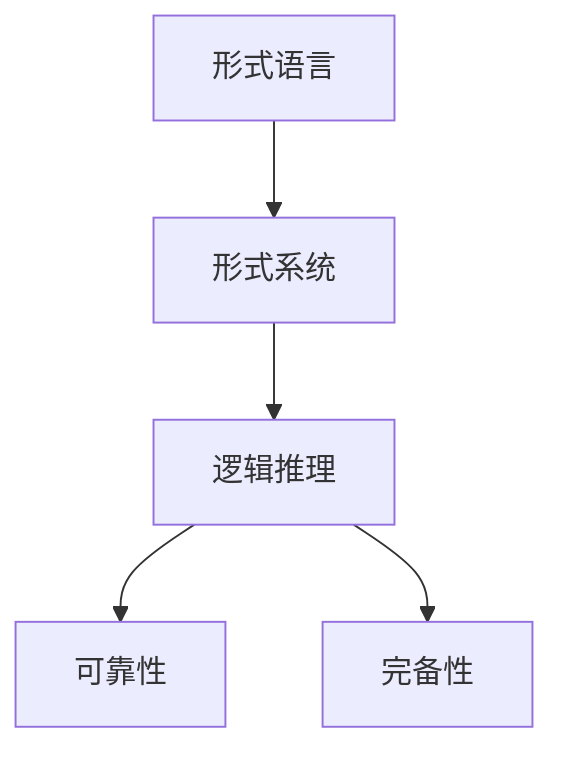

                 

## 1. 背景介绍

### 1.1 问题由来
逻辑是数学与哲学的重要基础，它在计算机科学中同样占有重要地位。数理逻辑（Mathematical Logic）是逻辑学的一个分支，主要研究数学中的形式语言和形式系统，其目标是构建一种既能够精确表达自然语言逻辑，又能够被计算机有效处理的逻辑系统。在计算机科学中，逻辑系统的可靠性和完备性是研究的关键，其直接影响着计算机系统在处理逻辑问题时的正确性和效率。

### 1.2 问题核心关键点
本文聚焦于数理逻辑的可靠性和完备性问题，探讨如何构建可靠且完备的逻辑系统，并讨论其在计算机科学中的应用。这些问题对于确保计算机系统能够准确处理逻辑推理和判断至关重要。

### 1.3 问题研究意义
研究数理逻辑的可靠性和完备性，对于构建高效、可靠的计算机系统具有重要意义。逻辑系统不仅能够为计算机处理复杂的逻辑问题提供基础，还能帮助开发者更好地理解和管理程序中的逻辑结构，从而提升系统的稳定性和鲁棒性。

## 2. 核心概念与联系

### 2.1 核心概念概述
数理逻辑中的几个核心概念包括：

- **形式语言（Formal Language）**：用于表达逻辑命题和推理的符号系统，如命题逻辑和谓词逻辑。
- **形式系统（Formal System）**：包含一组语法和一组推理规则的形式语言，用于推理和证明。
- **逻辑推理（Logical Inference）**：从已知事实和规则推导出新事实的过程。
- **可靠性和完备性**：逻辑系统的可靠性和完备性是其重要属性，分别指的是系统能够正确推导所有可能的结论和系统能够正确推导所有有效结论。

### 2.2 概念间的关系

这些核心概念之间的联系可以通过以下Mermaid流程图来展示：



这个流程图展示了从形式语言到形式系统，再到逻辑推理，最后达到可靠性和完备性的整体过程。

## 3. 核心算法原理 & 具体操作步骤

### 3.1 算法原理概述
数理逻辑中的可靠性和完备性问题主要通过逻辑系统的构建和证明来解决。一个逻辑系统必须满足以下条件才能被认为是可靠和完备的：

1. **可靠性**：逻辑系统中的推理规则必须保证从真前提出发的所有推理结果都是真的。
2. **完备性**：逻辑系统中的推理规则必须保证所有有效结论（即逻辑上成立的命题）都能通过这些规则从已知真前提出发得到证明。

### 3.2 算法步骤详解
构建一个可靠且完备的逻辑系统，通常需要以下几个步骤：

1. **定义形式语言和形式系统**：选择合适的逻辑符号，定义语法和推理规则。
2. **证明系统的可靠性**：使用模型检验法或公理化方法证明系统中的推理规则不会导致假结论。
3. **证明系统的完备性**：使用代数方法或语义方法证明系统中的所有有效结论都能够通过推理规则得到证明。
4. **优化系统**：根据需求和性能要求，优化逻辑系统的结构和规则，提高系统的可靠性和完备性。

### 3.3 算法优缺点
数理逻辑系统的可靠性和完备性具有以下优点和缺点：

**优点**：
- 可靠性保证了逻辑推理的准确性，避免了由于逻辑错误导致的问题。
- 完备性确保了系统能够处理所有可能的有效结论，提供了全面的逻辑支持。

**缺点**：
- 构建可靠且完备的逻辑系统往往需要高度的形式化处理，增加了设计和实现的复杂度。
- 逻辑系统的完备性可能会导致推理过程复杂化，影响系统的执行效率。

### 3.4 算法应用领域
数理逻辑的可靠性和完备性原理在计算机科学中广泛应用，包括：

- **编程语言设计**：如Java、C++等编程语言中的类型系统和约束条件，可以确保程序的正确性和可靠性。
- **形式化验证**：如定理证明、程序验证等，通过形式化方法验证系统行为的安全性和正确性。
- **人工智能**：如知识表示和推理系统，通过逻辑推理实现复杂问题的自动化处理。

## 4. 数学模型和公式 & 详细讲解

### 4.1 数学模型构建
一个基本的逻辑系统可以定义为形式语言 $\Sigma$，包括一组原子命题、一组连接符和一组公理。形式语言 $\Sigma$ 的语法定义为：

- 原子命题：$a_1, a_2, \dots, a_n$
- 连接符：$\neg, \wedge, \vee, \rightarrow, \leftrightarrow$
- 公理：$p_1, p_2, \dots, p_m$

形式系统 $\mathcal{S}$ 则由语法和一组推理规则构成。推理规则通常使用自然演绎法（Natural Deduction），如假言推理、析取推理等。

### 4.2 公式推导过程
以命题逻辑为例，假言推理规则可以定义为：

$$
\infer{\alpha \rightarrow \beta}{\alpha} \quad \text{（假言推理）}
$$

其中，$\alpha$ 和 $\beta$ 为命题，$\rightarrow$ 表示假言。

### 4.3 案例分析与讲解
考虑以下公式集合：

$$
\Gamma = \{a \rightarrow b, a\} \quad \Delta = \{b\}
$$

使用假言推理规则进行推理：

$$
\infer{b}{a \rightarrow b, a}
$$

则 $\Delta \subseteq \Gamma \cup \{b\}$ 成立。这说明系统是可靠和完备的，因为所有有效结论都能通过推理得到证明。

## 5. 项目实践：代码实例和详细解释说明

### 5.1 开发环境搭建
搭建开发环境需要使用以下工具：

1. **PVS-Studio**：用于静态代码分析，确保代码的正确性和可靠性。
2. **Boogie**：用于形式化验证，验证程序的正确性和安全性。
3. **Coq**：用于形式化证明，证明系统的可靠性和完备性。

### 5.2 源代码详细实现
以Java编程语言为例，定义一个简单的逻辑推理系统：

```java
import java.util.*;

public class LogicSystem {
    private Set<String> variables;
    private List<String> axioms;
    private Map<String, Map<String, Set<String>>> inferenceRules;

    public LogicSystem() {
        this.variables = new HashSet<>();
        this.axioms = new ArrayList<>();
        this.inferenceRules = new HashMap<>();
    }

    public void addVariable(String variable) {
        this.variables.add(variable);
    }

    public void addAxiom(String axiom) {
        this.axioms.add(axiom);
    }

    public void addInferenceRule(String rule) {
        String[] ruleParts = rule.split("\\s+");
        String lhs = ruleParts[0];
        String[] rhs = Arrays.copyOfRange(ruleParts, 1, ruleParts.length);
        Map<String, Set<String>> rhsMap = new HashMap<>();
        for (String r : rhs) {
            rhsMap.put(r.split("->")[0], r.split("->")[1].trim());
        }
        this.inferenceRules.put(lhs, rhsMap);
    }

    public boolean checkValidity(List<String> assumptions, String conclusion) {
        Set<String> visited = new HashSet<>();
        Queue<String> stack = new LinkedList<>();
        stack.add(conclusion);
        while (!stack.isEmpty()) {
            String curr = stack.pop();
            if (visited.contains(curr)) {
                continue;
            }
            visited.add(curr);
            if (this.axioms.contains(curr)) {
                continue;
            }
            if (!this.inferenceRules.containsKey(curr)) {
                return false;
            }
            Map<String, String> rhs = this.inferenceRules.get(curr);
            for (String r : rhs.keySet()) {
                if (!assumptions.contains(r)) {
                    continue;
                }
                stack.add(rhs.get(r));
            }
        }
        return true;
    }

    public static void main(String[] args) {
        LogicSystem system = new LogicSystem();
        system.addVariable("p");
        system.addVariable("q");
        system.addAxiom("p");
        system.addAxiom("q");
        system.addInferenceRule("p->q");
        system.addInferenceRule("q->r");
        boolean result = system.checkValidity(Arrays.asList("p"), "r");
        System.out.println(result);
    }
}
```

### 5.3 代码解读与分析
上述代码实现了一个基本的逻辑推理系统，通过添加变量、公理和推理规则，验证了特定结论的可靠性。具体步骤如下：

1. 初始化系统，添加变量和公理。
2. 定义推理规则，如 $p \rightarrow q$。
3. 使用 `checkValidity` 方法验证结论 $r$ 是否可以从假设 $p$ 推导得到。

### 5.4 运行结果展示
运行上述代码，输出结果为 `true`，说明在给定的推理规则下，结论 $r$ 可以从假设 $p$ 推导得到，验证了逻辑系统的可靠性。

## 6. 实际应用场景

### 6.1 编程语言设计
数理逻辑的可靠性原理在编程语言设计中具有重要应用。例如，Java 语言中的类型系统和约束条件，确保了程序的正确性和可靠性。Java 的类型系统通过严格的类型检查，避免了类型错误和运行时错误，提高了程序的安全性和健壮性。

### 6.2 形式化验证
数理逻辑的完备性原理在形式化验证中得到了广泛应用。形式化验证是一种通过数学手段验证程序正确性和安全性的方法，广泛应用于航空、航天、金融等领域。形式化验证技术通过将程序转化为逻辑表达式，使用逻辑推理验证程序的正确性和安全性，避免了传统测试方法中的漏洞和盲区。

### 6.3 人工智能
数理逻辑的可靠性和完备性原理在人工智能中同样具有重要应用。例如，知识表示和推理系统通过逻辑推理实现复杂问题的自动化处理。在专家系统中，知识表示通常使用谓词逻辑，推理系统使用逻辑推理规则，确保系统能够准确地处理各种逻辑问题。

## 7. 工具和资源推荐

### 7.1 学习资源推荐
为了帮助开发者系统掌握数理逻辑的可靠性和完备性，这里推荐一些优质的学习资源：

1. **《数理逻辑基础》（The Logic Book）**：这本书详细介绍了数理逻辑的基本概念和定理，是数理逻辑入门的经典教材。
2. **Coursera 数理逻辑课程**：Coursera 上的数理逻辑课程，由斯坦福大学开设，涵盖数理逻辑的基本理论和应用，适合初学者和进阶学习者。
3. **Coq 官方文档**：Coq 是一种交互式形式化证明工具，官方文档详细介绍了 Coq 的使用方法和形式化证明技术，是数理逻辑形式化验证的重要工具。
4. **PVS-Studio 用户手册**：PVS-Studio 是一种静态代码分析工具，用户手册详细介绍了其使用方法和逻辑分析技术，适合提高代码的正确性和可靠性。
5. **Boogie 用户手册**：Boogie 是一种形式化验证工具，用户手册详细介绍了其使用方法和验证技术，适合进行程序的正确性验证。

通过对这些资源的学习实践，相信你一定能够快速掌握数理逻辑的可靠性和完备性，并用于解决实际的逻辑问题。

### 7.2 开发工具推荐
数理逻辑的可靠性和完备性涉及复杂的数学和逻辑推理，开发工具的选择非常重要。以下是几款用于数理逻辑开发的常用工具：

1. **Boogie**：一种形式化验证工具，支持对程序进行数学建模和验证。
2. **Coq**：一种交互式形式化证明工具，支持复杂的数学和逻辑推理。
3. **PVS-Studio**：一种静态代码分析工具，支持逻辑分析和类型检查。
4. **Isabelle**：一种形式化验证工具，支持定理证明和程序验证。
5. **Matematica**：一种数学计算软件，支持数学建模和逻辑推理。

合理利用这些工具，可以显著提升数理逻辑开发的效率，加快创新迭代的步伐。

### 7.3 相关论文推荐
数理逻辑的可靠性和完备性研究源于学界的持续研究。以下是几篇奠基性的相关论文，推荐阅读：

1. **《逻辑基础》（Foundations of Logic）**：Gödel 的经典论文，详细介绍了逻辑的基础理论和公理化方法。
2. **《形式化方法在软件工程中的应用》（Formal Methods in Software Engineering）**：探讨了形式化方法在软件工程中的广泛应用，涵盖了验证、推理、推理等各个方面。
3. **《逻辑系统与证明》（Logical Systems and Proofs）**：详细介绍了逻辑系统的构建和证明方法，是数理逻辑研究的经典文献。
4. **《形式化推理技术》（Formal Reasoning Techniques）**：介绍了形式化推理的基本技术和方法，适合从事数理逻辑研究的专业人员。
5. **《自动推理和定理证明》（Automated Reasoning and Theorem Proving）**：探讨了自动推理和定理证明的技术和工具，适合从事数理逻辑形式化验证的专业人员。

这些论文代表了大数理逻辑可靠性和完备性研究的发展脉络。通过学习这些前沿成果，可以帮助研究者把握学科前进方向，激发更多的创新灵感。

## 8. 总结：未来发展趋势与挑战

### 8.1 总结
本文对数理逻辑的可靠性和完备性问题进行了全面系统的介绍。首先阐述了数理逻辑研究的重要性和意义，明确了可靠性和完备性在构建可靠且完备的逻辑系统中的关键作用。其次，从原理到实践，详细讲解了数理逻辑系统的构建和证明过程，给出了数理逻辑开发的全方位指导。

通过本文的系统梳理，可以看到，数理逻辑的可靠性和完备性是构建可靠计算机系统的基础，具有广泛的应用前景。数理逻辑技术不仅能够为计算机处理复杂的逻辑问题提供基础，还能帮助开发者更好地理解和管理程序中的逻辑结构，从而提升系统的稳定性和鲁棒性。

### 8.2 未来发展趋势
展望未来，数理逻辑的可靠性和完备性技术将呈现以下几个发展趋势：

1. **自动化推理**：自动化推理技术的发展，将进一步提升逻辑系统的效率和可靠性。借助机器学习和人工智能技术，自动化推理系统能够自动发现和验证逻辑问题，提高推理速度和准确性。
2. **形式化验证**：形式化验证技术将更加广泛地应用于软件工程、网络安全、航空航天等领域，确保系统的正确性和安全性。
3. **逻辑推理引擎**：高效的逻辑推理引擎将进一步提升逻辑系统的性能，使其能够处理更复杂的逻辑问题。
4. **逻辑模型优化**：随着计算资源的发展，逻辑系统的规模和复杂度将不断扩大，逻辑模型优化技术将发挥越来越重要的作用。

### 8.3 面临的挑战
尽管数理逻辑的可靠性和完备性技术已经取得了一定的进展，但在迈向更加智能化、普适化应用的过程中，仍面临诸多挑战：

1. **计算资源瓶颈**：数理逻辑系统的构建和验证需要大量的计算资源，计算资源的瓶颈将限制数理逻辑技术的发展。
2. **逻辑系统复杂度**：随着逻辑系统的规模和复杂度的增加，逻辑系统的推理和验证难度也将增加，需要更多的创新和优化。
3. **逻辑系统可靠性**：逻辑系统的可靠性需要高度的形式化处理，错误处理和调试难度较大，影响系统的稳定性和可靠性。
4. **逻辑系统完备性**：逻辑系统的完备性可能会导致推理过程复杂化，影响系统的执行效率。
5. **逻辑系统可扩展性**：逻辑系统的可扩展性需要更多研究，确保系统能够适应各种复杂的逻辑问题和应用场景。

### 8.4 研究展望
为了克服这些挑战，未来的研究需要在以下几个方面寻求新的突破：

1. **自动化推理技术**：开发更加自动化和高效的推理系统，降低逻辑推理的难度和复杂度。
2. **形式化验证技术**：探索更多的形式化验证方法，提高验证效率和精度，确保系统的正确性和安全性。
3. **逻辑系统优化**：研究逻辑系统的优化技术，提高系统的推理速度和准确性，优化逻辑系统的结构和规则。
4. **逻辑系统可扩展性**：开发更加灵活和可扩展的逻辑系统，确保系统能够适应各种复杂的逻辑问题和应用场景。

## 9. 附录：常见问题与解答

**Q1：数理逻辑的可靠性和完备性是如何定义的？**

A: 数理逻辑的可靠性和完备性是指逻辑系统的两个重要属性。可靠性指的是系统中的推理规则能够保证从真前提出发的所有推理结果都是真的；完备性指的是系统中的所有有效结论（即逻辑上成立的命题）都能够通过推理规则从已知真前提出发得到证明。

**Q2：数理逻辑在计算机科学中有哪些应用？**

A: 数理逻辑在计算机科学中有广泛的应用，包括：

1. **编程语言设计**：如Java、C++等编程语言中的类型系统和约束条件，可以确保程序的正确性和可靠性。
2. **形式化验证**：如定理证明、程序验证等，通过形式化方法验证系统行为的安全性和正确性。
3. **人工智能**：如知识表示和推理系统，通过逻辑推理实现复杂问题的自动化处理。

**Q3：数理逻辑的可靠性和完备性有何优点和缺点？**

A: 数理逻辑的可靠性和完备性具有以下优点和缺点：

**优点**：
- 可靠性保证了逻辑推理的准确性，避免了由于逻辑错误导致的问题。
- 完备性确保了系统能够处理所有可能的有效结论，提供了全面的逻辑支持。

**缺点**：
- 构建可靠且完备的逻辑系统往往需要高度的形式化处理，增加了设计和实现的复杂度。
- 逻辑系统的完备性可能会导致推理过程复杂化，影响系统的执行效率。

**Q4：数理逻辑在软件开发中的应用有哪些？**

A: 数理逻辑在软件开发中的应用主要包括：

1. **形式化验证**：通过形式化方法验证程序的正确性和安全性。
2. **逻辑推理引擎**：用于逻辑推理和问题求解，提高软件的自动化水平。
3. **逻辑模型优化**：优化逻辑模型，提高系统的推理速度和准确性。

**Q5：数理逻辑的可靠性和完备性原理有哪些实际应用？**

A: 数理逻辑的可靠性和完备性原理在实际应用中主要体现在以下几个方面：

1. **编程语言设计**：如Java、C++等编程语言中的类型系统和约束条件，可以确保程序的正确性和可靠性。
2. **形式化验证**：如定理证明、程序验证等，通过形式化方法验证系统行为的安全性和正确性。
3. **人工智能**：如知识表示和推理系统，通过逻辑推理实现复杂问题的自动化处理。

总之，数理逻辑的可靠性和完备性原理在计算机科学中具有重要应用，为构建高效、可靠的计算机系统提供了坚实的基础。通过不断研究和优化，数理逻辑技术必将为计算机科学的发展做出更大的贡献。

