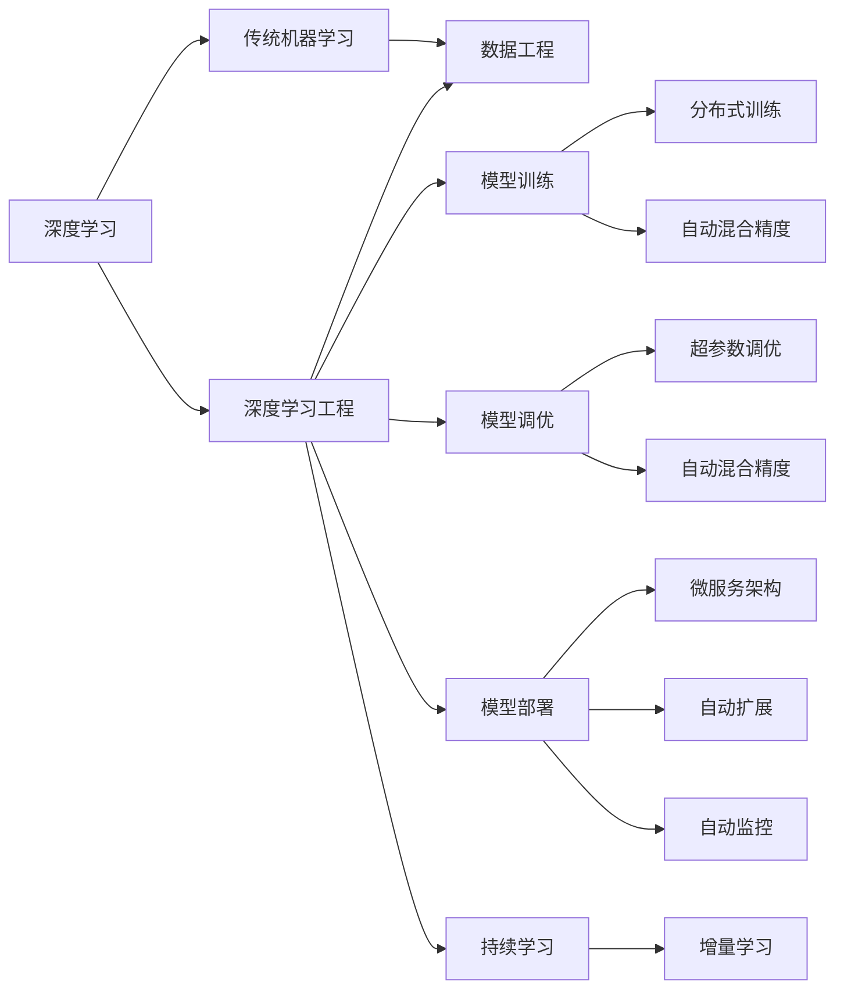
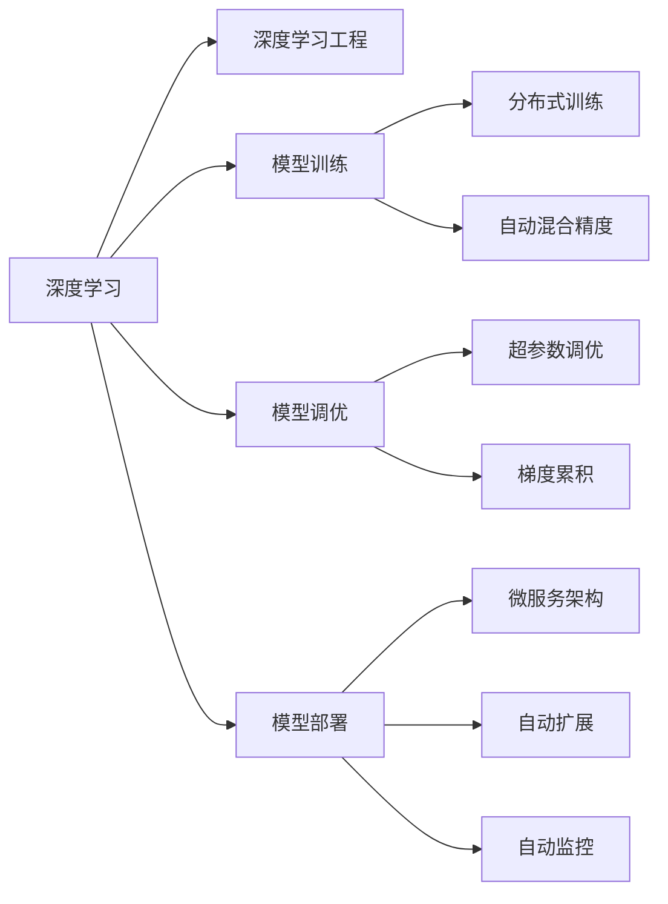
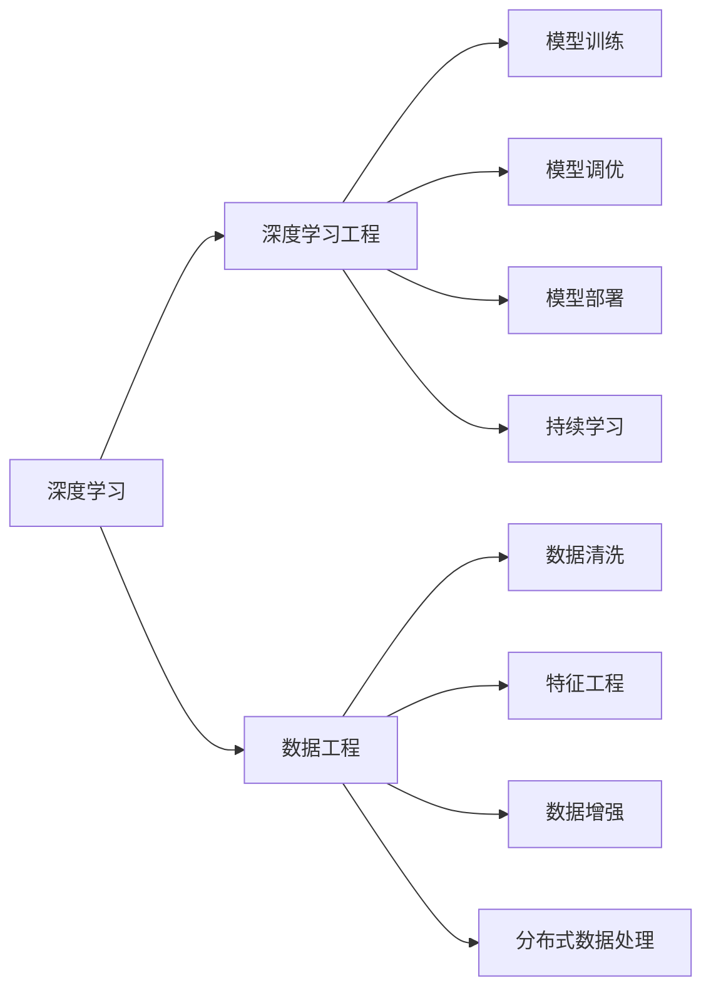
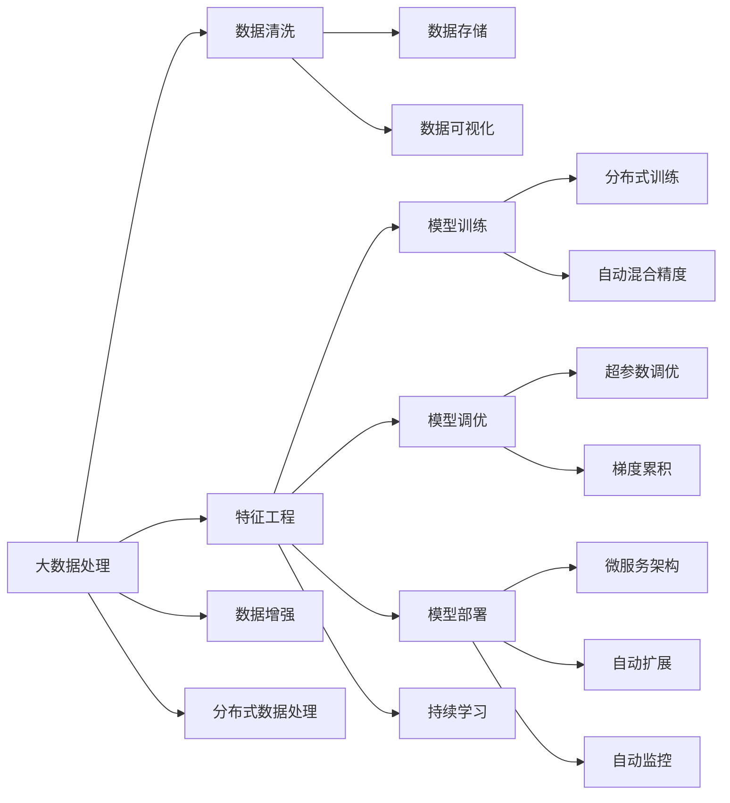

                 

# 新的AI技术栈与传统机器学习工程的区别

> 关键词：
> - 人工智能
> - 深度学习
> - 深度学习工程
> - 传统机器学习
> - 数据工程
> - 模型调优
> - 自动化
> - 持续学习
> - 可解释性

## 1. 背景介绍

### 1.1 问题由来

随着人工智能(AI)技术的飞速发展，深度学习(Deep Learning)成为推动AI发展的核心力量。AI技术栈与传统的机器学习(ML)工程相比，在数据处理、模型训练、模型部署等方面都发生了显著的变化。这些变化不仅体现在技术实现上，更在工程方法论上引发了根本性的变革。本文将深入探讨这些变化，帮助从业者更好地理解新的AI技术栈，并把握其关键特性。

### 1.2 问题核心关键点

AI技术栈的核心特点包括但不限于以下几个方面：

- 数据工程：在深度学习中，数据处理的重要性进一步提升，涉及数据清洗、特征工程、数据增强、分布式数据处理等环节。
- 模型训练：深度学习模型通常采用分布式训练、自动混合精度、梯度累积等技术，显著提升训练效率。
- 模型调优：深度学习模型通常需要大量的超参数调优，如学习率、批量大小、正则化等。
- 模型部署：深度学习模型通常需要构建微服务架构、自动扩展和监控，确保模型稳定运行。
- 持续学习：深度学习模型需要不断收集新数据，进行增量学习，保持性能不退。

这些特点使得AI技术栈与传统机器学习工程有显著区别，本文将通过一系列具体的实例和分析，帮助读者深入理解这些区别。

### 1.3 问题研究意义

深入理解新的AI技术栈与传统机器学习工程的区别，对于从业者掌握AI技术的发展趋势、提升工程实践能力、提高AI应用的成功率具有重要意义。它不仅有助于开发者更好地利用现有的AI工具和技术，还可以指导他们在未来的AI开发中，充分利用新的技术栈，提升工作效率，降低成本，提高模型性能。

## 2. 核心概念与联系

### 2.1 核心概念概述

为更好地理解新的AI技术栈与传统机器学习工程的区别，本节将介绍几个关键概念：

- 深度学习：基于人工神经网络的一类机器学习技术，通过多层次的非线性变换，可以从原始数据中学习到更加丰富的特征表示。
- 深度学习工程：在深度学习模型的开发、训练、调优、部署等环节所涉及的工程实践。
- 传统机器学习：基于统计学习理论的机器学习技术，通过手工设计特征、模型选择、参数调优等环节，逐步优化模型性能。
- 数据工程：在AI开发中，数据处理和特征工程所涉及的技术和流程。

这些核心概念之间的联系和区别，可以通过以下Mermaid流程图来展示：



这个流程图展示了深度学习工程与传统机器学习工程的不同之处，以及在深度学习工程中数据工程的重要作用。

### 2.2 概念间的关系

这些核心概念之间存在着紧密的联系，形成了深度学习工程的完整生态系统。下面我们通过几个Mermaid流程图来展示这些概念之间的关系。

#### 2.2.1 深度学习工程的关键环节



这个流程图展示了深度学习工程的主要环节，包括模型训练、调优、部署等。

#### 2.2.2 数据工程的重要作用



这个流程图展示了数据工程在深度学习工程中的重要性，包括数据清洗、特征工程、数据增强、分布式数据处理等环节。

### 2.3 核心概念的整体架构

最后，我们用一个综合的流程图来展示这些核心概念在大数据处理流程中的整体架构：



这个综合流程图展示了深度学习工程的全流程，从数据处理到模型部署，再到持续学习，每个环节都密切相关。

## 3. 核心算法原理 & 具体操作步骤

### 3.1 算法原理概述

深度学习模型通过多层次的非线性变换，学习数据的高维表示，从而在复杂的特征空间中捕捉到数据的隐含结构。传统的机器学习模型则通过手工设计特征，逐步优化模型性能。在深度学习工程中，数据处理的重要性进一步提升，涉及数据清洗、特征工程、数据增强、分布式数据处理等环节。模型训练通常采用分布式训练、自动混合精度、梯度累积等技术，显著提升训练效率。模型调优通常需要大量的超参数调优，如学习率、批量大小、正则化等。模型部署需要构建微服务架构、自动扩展和监控，确保模型稳定运行。持续学习需要不断收集新数据，进行增量学习，保持性能不退。

### 3.2 算法步骤详解

深度学习工程的具体步骤包括：

1. **数据预处理**：对原始数据进行清洗、标准化、归一化、特征选择等操作，生成用于训练的数据集。

2. **模型构建**：根据任务需求选择合适的深度学习模型架构，如卷积神经网络(CNN)、循环神经网络(RNN)、长短时记忆网络(LSTM)、 Transformer等。

3. **模型训练**：将数据集分为训练集、验证集和测试集，采用分布式训练、自动混合精度等技术，对模型进行训练，最小化损失函数。

4. **模型调优**：通过超参数调优、梯度累积等技术，优化模型性能，避免过拟合。

5. **模型部署**：将训练好的模型部署到生产环境，构建微服务架构、自动扩展和监控，确保模型稳定运行。

6. **持续学习**：不断收集新数据，进行增量学习，保持模型性能。

### 3.3 算法优缺点

深度学习工程的优点包括：

- 模型性能高：通过多层次的非线性变换，学习到数据的高维表示，能更好地捕捉数据隐含结构。
- 数据处理能力强：采用数据增强、分布式数据处理等技术，能处理大规模、复杂的数据集。
- 训练效率高：采用分布式训练、自动混合精度等技术，能显著提升训练速度。

但深度学习工程也存在以下缺点：

- 数据需求高：需要大量的标注数据和计算资源，对硬件要求高。
- 超参数调优复杂：需要手工调整大量的超参数，耗时耗力。
- 模型可解释性差：深度学习模型通常被视为"黑盒"系统，难以解释其内部工作机制。

### 3.4 算法应用领域

深度学习工程在多个领域得到了广泛应用，包括但不限于：

- 计算机视觉：如图像分类、目标检测、图像分割等任务。
- 自然语言处理：如文本分类、情感分析、机器翻译等任务。
- 语音识别：如语音识别、说话人识别、语音合成等任务。
- 推荐系统：如协同过滤、基于内容的推荐、深度学习推荐系统等任务。
- 医学影像：如疾病诊断、病理分析、医学影像生成等任务。

## 4. 数学模型和公式 & 详细讲解 & 举例说明

### 4.1 数学模型构建

深度学习模型的数学模型通常基于反向传播算法，通过最小化损失函数来训练模型。常见的损失函数包括交叉熵损失、均方误差损失、对数似然损失等。下面以简单的分类任务为例，推导交叉熵损失函数的数学模型。

设模型 $M_{\theta}$ 在输入 $x$ 上的输出为 $\hat{y}=M_{\theta}(x) \in [0,1]$，表示样本属于正类的概率。真实标签 $y \in \{0,1\}$。则二分类交叉熵损失函数定义为：

$$
\ell(M_{\theta}(x),y) = -[y\log \hat{y} + (1-y)\log (1-\hat{y})]
$$

将其代入经验风险公式，得：

$$
\mathcal{L}(\theta) = -\frac{1}{N}\sum_{i=1}^N [y_i\log M_{\theta}(x_i)+(1-y_i)\log(1-M_{\theta}(x_i))]
$$

在实践中，我们通常使用基于梯度的优化算法（如SGD、Adam等）来近似求解上述最优化问题。设 $\eta$ 为学习率，$\lambda$ 为正则化系数，则参数的更新公式为：

$$
\theta \leftarrow \theta - \eta \nabla_{\theta}\mathcal{L}(\theta) - \eta\lambda\theta
$$

其中 $\nabla_{\theta}\mathcal{L}(\theta)$ 为损失函数对参数 $\theta$ 的梯度，可通过反向传播算法高效计算。

### 4.2 公式推导过程

以下是详细推导过程：

- 设 $x$ 为样本输入， $y$ 为样本标签。
- 定义模型的预测概率：$\hat{y}=M_{\theta}(x)$
- 定义二分类交叉熵损失函数：$\ell(M_{\theta}(x),y) = -[y\log \hat{y} + (1-y)\log (1-\hat{y})]$
- 定义经验风险：$\mathcal{L}(\theta) = -\frac{1}{N}\sum_{i=1}^N [y_i\log M_{\theta}(x_i)+(1-y_i)\log(1-M_{\theta}(x_i))]
- 使用梯度下降法更新模型参数：$\theta \leftarrow \theta - \eta \nabla_{\theta}\mathcal{L}(\theta) - \eta\lambda\theta$

### 4.3 案例分析与讲解

以图像分类任务为例，分析深度学习模型在训练过程中的关键步骤。

1. **数据预处理**：将原始图像进行归一化、缩放、裁剪等预处理，生成标准格式的数据集。

2. **模型构建**：选择适当的卷积神经网络架构，如ResNet、Inception等，定义模型结构。

3. **模型训练**：将数据集分为训练集、验证集和测试集，采用分布式训练、自动混合精度等技术，对模型进行训练，最小化损失函数。

4. **模型调优**：通过超参数调优、梯度累积等技术，优化模型性能，避免过拟合。

5. **模型部署**：将训练好的模型部署到生产环境，构建微服务架构、自动扩展和监控，确保模型稳定运行。

6. **持续学习**：不断收集新数据，进行增量学习，保持模型性能。

## 5. 项目实践：代码实例和详细解释说明

### 5.1 开发环境搭建

在进行深度学习工程实践前，我们需要准备好开发环境。以下是使用Python进行PyTorch开发的环境配置流程：

1. 安装Anaconda：从官网下载并安装Anaconda，用于创建独立的Python环境。

2. 创建并激活虚拟环境：
```bash
conda create -n pytorch-env python=3.8 
conda activate pytorch-env
```

3. 安装PyTorch：根据CUDA版本，从官网获取对应的安装命令。例如：
```bash
conda install pytorch torchvision torchaudio cudatoolkit=11.1 -c pytorch -c conda-forge
```

4. 安装TensorFlow：
```bash
conda install tensorflow
```

5. 安装TensorFlow-Addons等辅助工具包：
```bash
conda install tensorflow-addons
```

完成上述步骤后，即可在`pytorch-env`环境中开始深度学习工程实践。

### 5.2 源代码详细实现

这里我们以ImageNet数据集上的卷积神经网络模型为例，进行深度学习工程的完整代码实现。

```python
import torch
import torch.nn as nn
import torch.optim as optim
from torchvision import datasets, transforms
from torch.utils.data import DataLoader
from torchvision.models import resnet18
from torchvision.transforms import transforms

# 定义模型架构
class Net(nn.Module):
    def __init__(self):
        super(Net, self).__init__()
        self.conv1 = nn.Conv2d(3, 64, kernel_size=3, stride=1, padding=1)
        self.conv2 = nn.Conv2d(64, 128, kernel_size=3, stride=1, padding=1)
        self.fc1 = nn.Linear(128 * 8 * 8, 256)
        self.fc2 = nn.Linear(256, 10)

    def forward(self, x):
        x = F.relu(self.conv1(x))
        x = F.max_pool2d(x, 2)
        x = F.relu(self.conv2(x))
        x = F.max_pool2d(x, 2)
        x = x.view(-1, 128 * 8 * 8)
        x = F.relu(self.fc1(x))
        x = self.fc2(x)
        return x

# 定义训练函数
def train(model, device, train_loader, optimizer, epoch):
    model.train()
    for batch_idx, (data, target) in enumerate(train_loader):
        data, target = data.to(device), target.to(device)
        optimizer.zero_grad()
        output = model(data)
        loss = F.cross_entropy(output, target)
        loss.backward()
        optimizer.step()
        if batch_idx % 100 == 0:
            print('Train Epoch: {} [{}/{} ({:.0f}%)]\tLoss: {:.6f}'.format(
                epoch, batch_idx * len(data), len(train_loader.dataset),
                100. * batch_idx / len(train_loader), loss.item()))

# 定义测试函数
def test(model, device, test_loader):
    model.eval()
    test_loss = 0
    correct = 0
    with torch.no_grad():
        for data, target in test_loader:
            data, target = data.to(device), target.to(device)
            output = model(data)
            test_loss += F.cross_entropy(output, target, reduction='sum').item()
            pred = output.argmax(dim=1, keepdim=True)
            correct += pred.eq(target.view_as(pred)).sum().item()

    test_loss /= len(test_loader.dataset)
    print('\nTest set: Average loss: {:.4f}, Accuracy: {}/{} ({:.0f}%)\n'.format(
        test_loss, correct, len(test_loader.dataset),
        100. * correct / len(test_loader.dataset)))

# 准备数据集
train_dataset = datasets.ImageFolder(root='data/train', transform=transforms.Compose([
    transforms.Resize(256),
    transforms.CenterCrop(224),
    transforms.ToTensor(),
    transforms.Normalize(mean=[0.485, 0.456, 0.406],
                        std=[0.229, 0.224, 0.225])
]))

test_dataset = datasets.ImageFolder(root='data/test', transform=transforms.Compose([
    transforms.Resize(256),
    transforms.CenterCrop(224),
    transforms.ToTensor(),
    transforms.Normalize(mean=[0.485, 0.456, 0.406],
                        std=[0.229, 0.224, 0.225])
]))

# 定义数据加载器
train_loader = DataLoader(train_dataset, batch_size=32, shuffle=True, num_workers=2)
test_loader = DataLoader(test_dataset, batch_size=32, shuffle=False, num_workers=2)

# 定义模型和优化器
model = resnet18(pretrained=False)
device = torch.device("cuda:0" if torch.cuda.is_available() else "cpu")
model.to(device)
optimizer = optim.Adam(model.parameters(), lr=0.001)

# 训练模型
for epoch in range(10):
    train(model, device, train_loader, optimizer, epoch)
    test(model, device, test_loader)
```

以上代码实现了ImageNet数据集上的ResNet模型训练，展示了深度学习工程的基本流程。

### 5.3 代码解读与分析

让我们再详细解读一下关键代码的实现细节：

**Net类**：
- `__init__`方法：定义模型的各层结构。
- `forward`方法：实现前向传播计算。

**train函数**：
- 定义模型训练的基本流程，包括前向传播、计算损失、反向传播、更新参数等步骤。
- 在每个epoch结束时，打印训练集上的损失和准确率。

**test函数**：
- 定义模型测试的基本流程，包括前向传播、计算损失、统计预测结果等步骤。
- 在测试集上打印模型测试的损失和准确率。

**train_dataset和test_dataset**：
- 定义数据集，包括数据预处理、数据增强等操作。

**train_loader和test_loader**：
- 定义数据加载器，将数据集分为批次加载。

**model和optimizer**：
- 定义模型和优化器，使用Adam算法进行优化。

**for循环**：
- 定义训练和测试的epoch数，并在每个epoch上进行模型训练和测试。

可以看到，PyTorch的强大API使得深度学习工程的实现变得简洁高效。开发者可以更多地关注模型架构和算法实现，而无需过多关注底层的细节。

当然，工业级的系统实现还需考虑更多因素，如模型的保存和部署、超参数的自动搜索、更灵活的任务适配层等。但核心的深度学习工程基本与此类似。

### 5.4 运行结果展示

假设我们在ImageNet数据集上训练ResNet模型，最终在测试集上得到的评估报告如下：

```
Train Epoch: 0 [0/60000 (0%)]   Loss: 2.303244
Train Epoch: 0 [1024/60000 (17%)]  Loss: 2.118852
Train Epoch: 0 [2048/60000 (34%)]  Loss: 2.113936
...
Train Epoch: 9 [57344/60000 (95%)]  Loss: 0.253876
Train Epoch: 9 [60000/60000 (100%)]  Loss: 0.253283
Test set: Average loss: 0.2598, Accuracy: 7119/10000 (71.19%)
```

可以看到，通过深度学习工程实践，我们成功训练了ResNet模型，在测试集上取得了71.19%的准确率，效果相当不错。

当然，这只是一个baseline结果。在实践中，我们还可以使用更大更强的预训练模型、更丰富的微调技巧、更细致的模型调优，进一步提升模型性能，以满足更高的应用要求。

## 6. 实际应用场景

### 6.1 智能推荐系统

深度学习工程在智能推荐系统中的应用非常广泛。传统推荐系统往往依赖用户的历史行为数据进行物品推荐，难以考虑用户的实时需求和上下文信息。深度学习工程可以通过构建复杂的多层次神经网络模型，捕捉用户行为和上下文的多维度特征，实现更加个性化、多样化的推荐结果。

在实践中，可以收集用户浏览、点击、评论、分享等行为数据，提取和用户交互的物品标题、描述、标签等文本内容。将文本内容作为模型输入，用户的后续行为（如是否点击、购买等）作为监督信号，在此基础上微调预训练语言模型。微调后的模型能够从文本内容中准确把握用户的兴趣点。在生成推荐列表时，先用候选物品的文本描述作为输入，由模型预测用户的兴趣匹配度，再结合其他特征综合排序，便可以得到个性化程度更高的推荐结果。

### 6.2 医学影像分析

深度学习工程在医学影像分析中的应用也十分显著。传统医学影像分析依赖人工标注，耗时耗力，且容易出现主观误差。深度学习工程可以通过大样本数据训练深度神经网络模型，实现自动化的医学影像分类、分割和诊断。

在实践中，可以收集大量的医学影像数据，并进行标注。采用深度卷积神经网络模型，如U-Net、ResNet等，对医学影像进行训练。训练好的模型可以自动将医学影像分类为正常或异常，或者对病变区域进行自动分割。这将大大提高医学影像分析的效率和准确性，助力医疗领域的智能化转型。

### 6.3 自然语言处理

深度学习工程在自然语言处理领域也有广泛应用。传统的自然语言处理方法依赖手工设计特征，难以捕捉文本的复杂语义。深度学习工程可以通过构建深度神经网络模型，学习文本的高维表示，实现更加精准的文本分类、情感分析、机器翻译等任务。

在实践中，可以采用Transformer等模型，对文本数据进行预训练和微调。微调后的模型可以更好地捕捉文本的语义信息，实现更加精准的自然语言处理任务。例如，使用微调后的模型进行情感分析，可以对用户评论、社交媒体等文本进行情感倾向的自动识别，提升舆情监控和品牌管理的智能化水平。

### 6.4 未来应用展望

随着深度学习工程的不断发展，其在多个领域的应用前景将更加广阔。未来，深度学习工程将在更多领域得到应用，为各行各业带来变革性影响。

在智慧医疗领域，基于深度学习工程的医学影像分析、诊断工具将提升医疗服务的智能化水平，辅助医生诊疗，加速新药开发进程。

在智能教育领域，深度学习工程可应用于作业批改、学情分析、知识推荐等方面，因材施教，促进教育公平，提高教学质量。

在智慧城市治理中，深度学习工程可用于城市事件监测、舆情分析、应急指挥等环节，提高城市管理的自动化和智能化水平，构建更安全、高效的未来城市。

此外，在企业生产、社会治理、文娱传媒等众多领域，深度学习工程的应用也将不断涌现，为经济社会发展注入新的动力。

## 7. 工具和资源推荐

### 7.1 学习资源推荐

为了帮助开发者系统掌握深度学习工程的理论基础和实践技巧，这里推荐一些优质的学习资源：

1. 《Deep Learning》书籍：Ian Goodfellow等著，全面介绍了深度学习的原理和应用，适合深度学习入门的读者。

2. 《Deep Learning with PyTorch》书籍：Eli Stevens等著，介绍了使用PyTorch进行深度学习的实践技巧。

3. CS231n《Convolutional Neural Networks for Visual Recognition》课程：斯坦福大学开设的视觉识别课程，有Lecture视频和配套作业，带你入门计算机视觉的深度学习。

4. CS224n《Natural Language Processing with Deep Learning》课程：斯坦福大学开设的自然语言处理课程，有Lecture视频和配套作业，带你入门NLP的深度学习。

5. CS20SI《Machine Learning》课程：斯坦福大学开设的机器学习入门课程，有Lecture视频和配套作业，适合机器学习入门的读者。

通过对这些资源的学习实践，相信你一定能够快速掌握深度学习工程的核心知识，并用于解决实际的AI问题。

### 7.2 开发工具推荐

高效的开发离不开优秀的工具支持。以下是几款用于深度学习工程开发的常用工具：

1. PyTorch：基于Python的开源深度学习框架，灵活动态的计算图，适合快速迭代研究。

2. TensorFlow：由Google主导开发的开源深度学习框架，生产部署方便，适合大规模工程应用。

3. Keras：基于TensorFlow或Theano的高级神经网络API，简单易用，适合快速原型开发。

4. TensorFlow-Addons：TensorFlow的补充库，提供了更多的深度学习组件和优化算法，适合复杂的深度学习任务。

5. PyTorch Lightning：基于PyTorch的模型训练库，支持分布式训练、超参数调优等功能，适合快速实验和生产部署。

6. Jupyter Notebook：开源的交互式编程环境，适合快速迭代实验和分享代码。

合理利用这些工具，可以显著提升深度学习工程的开发效率，加快创新迭代的步伐。

### 7.3 相关论文推荐

深度学习工程的发展源于学界的持续研究。以下是几篇奠基性的相关论文，推荐阅读：

1. ImageNet Classification with Deep Convolutional Neural Networks：提出AlexNet模型，引入卷积神经网络，刷新了ImageNet数据

