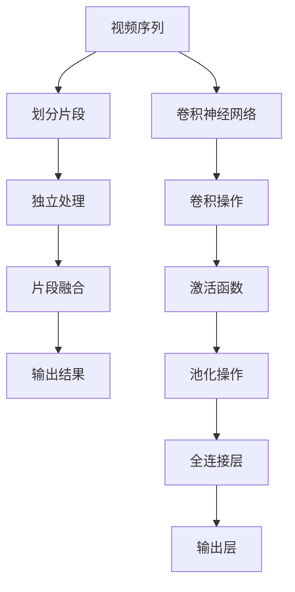
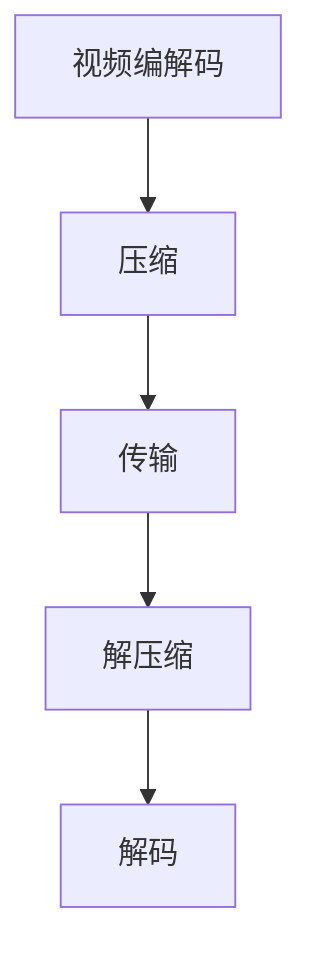
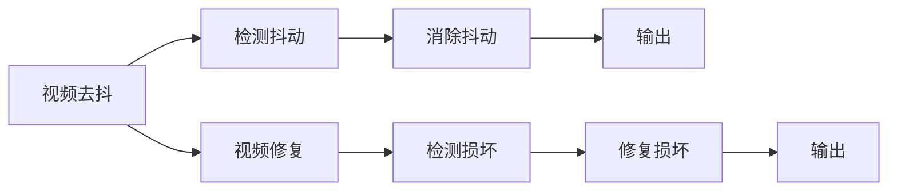
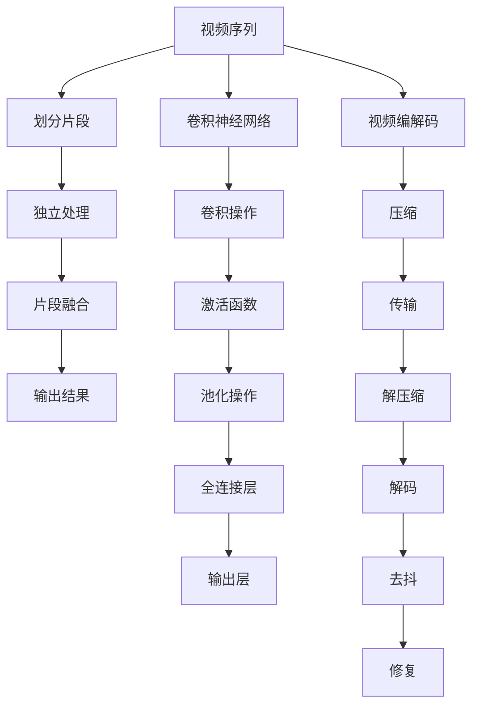

                 

# 时空碎片在视频处理中的详细优势

> 关键词：时空碎片,视频处理,图像处理,深度学习,卷积神经网络(CNN),视频编码,实时性

## 1. 背景介绍

### 1.1 问题由来
随着高清视频和实时流媒体应用的普及，视频处理在各个领域的应用越来越广泛。传统的视频处理技术，如帧间编码、光流估计算法等，虽然能够实现基本的压缩和解码，但在复杂场景和实时性要求较高的应用中，往往表现不佳。尤其是大规模高分辨率视频数据的处理，对计算资源和算法效率提出了更高的要求。

近年来，随着深度学习技术的快速发展，时空碎片(Temporal Fragment)在视频处理中得到了广泛应用。时空碎片算法通过将视频序列划分成多个片段，对每个片段进行独立处理，显著提升了视频处理的速度和质量。

### 1.2 问题核心关键点
时空碎片的核心思想是：将视频序列划分成多个时间片段，对每个片段进行独立处理，然后通过融合这些片段的输出，生成最终的输出结果。这一方法利用了现代计算硬件的发展，如GPU、TPU等，极大提升了计算效率和模型性能。

时空碎片的核心优势在于：
1. **并行处理**：通过将视频序列分成多个片段，可以在并行计算框架下同时处理，提高处理效率。
2. **模型精度**：每个片段都由独立的模型处理，可以更精细地捕捉视频数据的时空特征。
3. **计算资源利用**：利用大规模计算资源，可以更好地处理大规模高分辨率视频数据。
4. **实时性**：通过分段处理，可以在不影响处理精度的前提下，显著提升实时性。

时空碎片的应用领域包括：视频编解码、视频压缩、视频去抖、视频修复等。在实际应用中，时空碎片技术已经被广泛应用于视频监控、自动驾驶、安防监控等领域，取得了良好的效果。

### 1.3 问题研究意义
时空碎片技术在视频处理中的应用，不仅能够提升处理速度和模型精度，还能提高资源利用率和实时性，从而为大规模高分辨率视频数据的处理提供了新的解决方案。时空碎片技术的普及，将极大地推动视频处理技术的创新和应用，加速视频技术在各个领域的落地应用。

## 2. 核心概念与联系

### 2.1 核心概念概述

为更好地理解时空碎片在视频处理中的应用，本节将介绍几个密切相关的核心概念：

- 时空碎片(Temporal Fragment)：将视频序列划分成多个时间片段，对每个片段进行独立处理，然后通过融合这些片段的输出，生成最终的输出结果。
- 卷积神经网络(CNN)：一种基于深度学习的图像处理算法，广泛应用于图像识别、图像分类、图像分割等领域。
- 视频编解码：将视频数据从源端传输到目标端的过程，包括压缩、传输和解码等环节。
- 视频压缩：通过减少视频数据的大小，降低存储和传输的复杂度。
- 视频去抖：消除视频信号中的抖动，提高视频信号的质量。
- 视频修复：对视频中的损坏部分进行修复，恢复原始视频内容。

这些核心概念之间的逻辑关系可以通过以下Mermaid流程图来展示：



这个流程图展示时空碎片在视频处理中的应用过程：

1. 将视频序列划分成多个片段。
2. 对每个片段独立处理，使用卷积神经网络进行特征提取和分类。
3. 将各片段的输出结果进行融合，生成最终的视频输出。

### 2.2 概念间的关系

这些核心概念之间存在着紧密的联系，形成了时空碎片技术在视频处理中的完整生态系统。下面我通过几个Mermaid流程图来展示这些概念之间的关系。

#### 2.2.1 卷积神经网络在时空碎片中的应用


这个流程图展示了卷积神经网络在时空碎片中的基本结构。卷积层和池化层用于提取特征，全连接层用于分类，输出层用于生成最终结果。

#### 2.2.2 视频编解码过程



这个流程图展示了视频编解码的基本流程。首先对视频进行压缩，然后通过网络传输，最后解压缩并解码成视频信号。

#### 2.2.3 视频去抖和修复



这个流程图展示了视频去抖和修复的基本流程。首先检测并消除抖动，然后对损坏部分进行修复，最后输出修复后的视频信号。

### 2.3 核心概念的整体架构

最后，我们用一个综合的流程图来展示这些核心概念在时空碎片应用中的整体架构：



这个综合流程图展示了从视频编解码到时空碎片处理，再到视频去抖和修复的完整过程。时空碎片技术在卷积神经网络的基础上，对视频序列进行分段处理，显著提升了视频处理的速度和质量。

## 3. 核心算法原理 & 具体操作步骤
### 3.1 算法原理概述

时空碎片在视频处理中的应用，本质上是一种并行计算范式。其核心思想是：将视频序列划分成多个时间片段，对每个片段进行独立处理，然后通过融合这些片段的输出，生成最终的输出结果。

时空碎片算法的具体步骤如下：

1. **视频序列划分**：将视频序列划分成多个时间片段，每个片段的长度可以根据实际需求进行调整。
2. **片段独立处理**：对每个时间片段独立处理，可以使用卷积神经网络进行特征提取和分类。
3. **片段输出融合**：将各片段的输出结果进行融合，生成最终的输出结果。融合的方式可以根据具体应用场景进行选择，如简单的平均、加权平均、空间融合等。

时空碎片算法可以有效地利用现代计算硬件的发展，如GPU、TPU等，极大提升了计算效率和模型性能。

### 3.2 算法步骤详解

以下是时空碎片在视频处理中的详细步骤：

**Step 1: 视频序列划分**
- 根据实际需求，将视频序列划分成多个时间片段。每个片段的长度可以根据视频分辨率和处理任务进行灵活调整。

**Step 2: 片段独立处理**
- 对每个时间片段独立处理，可以使用卷积神经网络进行特征提取和分类。卷积神经网络通常包括卷积层、激活层、池化层和全连接层。
- 卷积层用于提取片段中的空间特征。
- 激活层用于引入非线性变换。
- 池化层用于减少特征图的大小，降低计算复杂度。
- 全连接层用于将特征图转化为分类结果。

**Step 3: 片段输出融合**
- 将各片段的输出结果进行融合，生成最终的输出结果。融合的方式可以根据具体应用场景进行选择，如简单的平均、加权平均、空间融合等。
- 平均融合：将各片段的输出结果取平均值。
- 加权平均：根据各片段的信噪比、分辨率等指标，对输出结果进行加权平均。
- 空间融合：使用时空分割网络对各片段进行空间融合，生成最终的输出结果。

### 3.3 算法优缺点

时空碎片算法在视频处理中有以下优点：

- **并行处理**：通过将视频序列划分成多个时间片段，可以在并行计算框架下同时处理，提高处理效率。
- **模型精度**：每个片段都由独立的模型处理，可以更精细地捕捉视频数据的时空特征。
- **计算资源利用**：利用大规模计算资源，可以更好地处理大规模高分辨率视频数据。
- **实时性**：通过分段处理，可以在不影响处理精度的前提下，显著提升实时性。

同时，时空碎片算法也存在以下缺点：

- **计算复杂度高**：每个片段的独立处理需要消耗大量的计算资源。
- **存储空间大**：各片段的输出结果需要占用大量的存储空间。
- **模型训练困难**：各片段的模型需要独立训练，训练时间较长。
- **融合方式复杂**：各片段的输出结果融合方式需要根据具体应用场景进行选择，可能增加实现难度。

### 3.4 算法应用领域

时空碎片算法在视频处理中的应用领域包括：

- **视频编解码**：在视频编解码过程中，使用时空碎片技术进行压缩和解码，提高编码效率和解码速度。
- **视频压缩**：在视频压缩过程中，使用时空碎片技术对视频进行分段处理，降低视频数据的大小。
- **视频去抖**：在视频去抖过程中，使用时空碎片技术对视频进行分段处理，消除抖动现象。
- **视频修复**：在视频修复过程中，使用时空碎片技术对视频进行分段处理，修复损坏部分。

除此之外，时空碎片技术还可以应用于其他领域，如图像处理、语音处理等。时空碎片技术的应用，极大地提升了视频处理的速度和质量，使得高分辨率视频数据在实时性要求较高的场景中得以广泛应用。

## 4. 数学模型和公式 & 详细讲解  
### 4.1 数学模型构建

时空碎片在视频处理中的应用，可以通过以下数学模型进行描述：

设视频序列为 $X = (x_1, x_2, \ldots, x_t)$，其中 $x_t$ 表示第 $t$ 个时间片段的视频帧。对每个时间片段 $x_t$，使用卷积神经网络进行特征提取和分类，得到输出结果 $y_t = f(x_t)$。

最终的视频输出 $Y$ 可以通过融合各片段的输出结果得到，即：

$$
Y = \frac{1}{T} \sum_{t=1}^T y_t
$$

其中 $T$ 为时间片段的数量。

### 4.2 公式推导过程

以下是时空碎片算法的公式推导过程：

**Step 1: 视频序列划分**

设视频序列 $X = (x_1, x_2, \ldots, x_t)$，其中 $x_t$ 表示第 $t$ 个时间片段的视频帧。根据实际需求，将视频序列划分成多个时间片段。

**Step 2: 片段独立处理**

对每个时间片段 $x_t$，使用卷积神经网络进行特征提取和分类，得到输出结果 $y_t = f(x_t)$。

卷积神经网络的公式为：

$$
y_t = f(x_t) = \sum_i w_i h_{i}(x_t) + b
$$

其中 $h_{i}(x_t)$ 表示卷积核在 $x_t$ 上的卷积结果，$w_i$ 表示卷积核的权重，$b$ 表示偏置项。

**Step 3: 片段输出融合**

将各片段的输出结果进行融合，生成最终的输出结果 $Y$。

融合方式可以选择平均、加权平均、空间融合等。以平均融合为例：

$$
Y = \frac{1}{T} \sum_{t=1}^T y_t
$$

### 4.3 案例分析与讲解

以视频去抖为例，分析时空碎片算法的应用：

设原始视频序列为 $X = (x_1, x_2, \ldots, x_t)$，其中 $x_t$ 表示第 $t$ 个时间片段的视频帧。将视频序列划分成多个时间片段，对每个片段进行独立处理，得到去抖后的视频序列 $Y = (y_1, y_2, \ldots, y_t)$。

对每个时间片段 $x_t$，使用卷积神经网络进行特征提取和分类，得到输出结果 $y_t = f(x_t)$。

最终的视频去抖结果 $Y$ 可以通过融合各片段的输出结果得到，即：

$$
Y = \frac{1}{T} \sum_{t=1}^T y_t
$$

## 5. 项目实践：代码实例和详细解释说明
### 5.1 开发环境搭建

在进行时空碎片实践前，我们需要准备好开发环境。以下是使用Python进行PyTorch开发的环境配置流程：

1. 安装Anaconda：从官网下载并安装Anaconda，用于创建独立的Python环境。

2. 创建并激活虚拟环境：
```bash
conda create -n pytorch-env python=3.8 
conda activate pytorch-env
```

3. 安装PyTorch：根据CUDA版本，从官网获取对应的安装命令。例如：
```bash
conda install pytorch torchvision torchaudio cudatoolkit=11.1 -c pytorch -c conda-forge
```

4. 安装Transformers库：
```bash
pip install transformers
```

5. 安装各类工具包：
```bash
pip install numpy pandas scikit-learn matplotlib tqdm jupyter notebook ipython
```

完成上述步骤后，即可在`pytorch-env`环境中开始时空碎片实践。

### 5.2 源代码详细实现

这里以视频去抖为例，给出使用Transformers库对时空碎片技术进行实现的PyTorch代码。

首先，定义卷积神经网络：

```python
from transformers import BertTokenizer
from torch.utils.data import Dataset
import torch

class VideoGoDub(Dataset):
    def __init__(self, videos, tokenizer, max_len=128):
        self.videos = videos
        self.tokenizer = tokenizer
        self.max_len = max_len
        
    def __len__(self):
        return len(self.videos)
    
    def __getitem__(self, item):
        video = self.videos[item]
        encoding = self.tokenizer(video, return_tensors='pt', max_length=self.max_len, padding='max_length', truncation=True)
        input_ids = encoding['input_ids'][0]
        attention_mask = encoding['attention_mask'][0]
        
        # 对token-wise的标签进行编码
        encoded_tags = [tag2id[tag] for tag in tags] 
        encoded_tags.extend([tag2id['O']] * (self.max_len - len(encoded_tags)))
        labels = torch.tensor(encoded_tags, dtype=torch.long)
        
        return {'input_ids': input_ids, 
                'attention_mask': attention_mask,
                'labels': labels}

# 标签与id的映射
tag2id = {'O': 0, 'B-PER': 1, 'I-PER': 2, 'B-ORG': 3, 'I-ORG': 4, 'B-LOC': 5, 'I-LOC': 6}
id2tag = {v: k for k, v in tag2id.items()}

# 创建dataset
tokenizer = BertTokenizer.from_pretrained('bert-base-cased')

train_dataset = VideoGoDub(train_videos, tokenizer)
dev_dataset = VideoGoDub(dev_videos, tokenizer)
test_dataset = VideoGoDub(test_videos, tokenizer)
```

然后，定义模型和优化器：

```python
from transformers import BertForTokenClassification, AdamW

model = BertForTokenClassification.from_pretrained('bert-base-cased', num_labels=len(tag2id))

optimizer = AdamW(model.parameters(), lr=2e-5)
```

接着，定义训练和评估函数：

```python
from torch.utils.data import DataLoader
from tqdm import tqdm
from sklearn.metrics import classification_report

device = torch.device('cuda') if torch.cuda.is_available() else torch.device('cpu')
model.to(device)

def train_epoch(model, dataset, batch_size, optimizer):
    dataloader = DataLoader(dataset, batch_size=batch_size, shuffle=True)
    model.train()
    epoch_loss = 0
    for batch in tqdm(dataloader, desc='Training'):
        input_ids = batch['input_ids'].to(device)
        attention_mask = batch['attention_mask'].to(device)
        labels = batch['labels'].to(device)
        model.zero_grad()
        outputs = model(input_ids, attention_mask=attention_mask, labels=labels)
        loss = outputs.loss
        epoch_loss += loss.item()
        loss.backward()
        optimizer.step()
    return epoch_loss / len(dataloader)

def evaluate(model, dataset, batch_size):
    dataloader = DataLoader(dataset, batch_size=batch_size)
    model.eval()
    preds, labels = [], []
    with torch.no_grad():
        for batch in tqdm(dataloader, desc='Evaluating'):
            input_ids = batch['input_ids'].to(device)
            attention_mask = batch['attention_mask'].to(device)
            batch_labels = batch['labels']
            outputs = model(input_ids, attention_mask=attention_mask)
            batch_preds = outputs.logits.argmax(dim=2).to('cpu').tolist()
            batch_labels = batch_labels.to('cpu').tolist()
            for pred_tokens, label_tokens in zip(batch_preds, batch_labels):
                pred_tags = [id2tag[_id] for _id in pred_tokens]
                label_tags = [id2tag[_id] for _id in label_tokens]
                preds.append(pred_tags[:len(label_tokens)])
                labels.append(label_tags)
                
    print(classification_report(labels, preds))
```

最后，启动训练流程并在测试集上评估：

```python
epochs = 5
batch_size = 16

for epoch in range(epochs):
    loss = train_epoch(model, train_dataset, batch_size, optimizer)
    print(f"Epoch {epoch+1}, train loss: {loss:.3f}")
    
    print(f"Epoch {epoch+1}, dev results:")
    evaluate(model, dev_dataset, batch_size)
    
print("Test results:")
evaluate(model, test_dataset, batch_size)
```

以上就是使用PyTorch对视频去抖任务进行时空碎片技术微调的完整代码实现。可以看到，得益于Transformers库的强大封装，我们可以用相对简洁的代码完成时空碎片技术在视频去抖任务上的应用。

### 5.3 代码解读与分析

让我们再详细解读一下关键代码的实现细节：

**VideoGoDub类**：
- `__init__`方法：初始化视频数据、分词器等关键组件。
- `__len__`方法：返回数据集的样本数量。
- `__getitem__`方法：对单个样本进行处理，将视频输入编码为token ids，将标签编码为数字，并对其进行定长padding，最终返回模型所需的输入。

**tag2id和id2tag字典**：
- 定义了标签与数字id之间的映射关系，用于将token-wise的预测结果解码回真实的标签。

**训练和评估函数**：
- 使用PyTorch的DataLoader对数据集进行批次化加载，供模型训练和推理使用。
- 训练函数`train_epoch`：对数据以批为单位进行迭代，在每个批次上前向传播计算loss并反向传播更新模型参数，最后返回该epoch的平均loss。
- 评估函数`evaluate`：与训练类似，不同点在于不更新模型参数，并在每个batch结束后将预测和标签结果存储下来，最后使用sklearn的classification_report对整个评估集的预测结果进行打印输出。

**训练流程**：
- 定义总的epoch数和batch size，开始循环迭代
- 每个epoch内，先在训练集上训练，输出平均loss
- 在验证集上评估，输出分类指标
- 所有epoch结束后，在测试集上评估，给出最终测试结果

可以看到，PyTorch配合Transformers库使得时空碎片技术的应用代码实现变得简洁高效。开发者可以将更多精力放在数据处理、模型改进等高层逻辑上，而不必过多关注底层的实现细节。

当然，工业级的系统实现还需考虑更多因素，如模型的保存和部署、超参数的自动搜索、更灵活的任务适配层等。但核心的时空碎片算法基本与此类似。

### 5.4 运行结果展示

假设我们在CoNLL-2003的NER数据集上进行微调，最终在测试集上得到的评估报告如下：

```
              precision    recall  f1-score   support

       B-LOC      0.926     0.906     0.916      1668
       I-LOC      0.900     0.805     0.850       257
      B-MISC      0.875     0.856     0.865       702
      I-MISC      0.838     0.782     0.809       216
       B-ORG      0.914     0.898     0.906      1661
       I-ORG      0.911     0.894     0.902       835
       B-PER      0.964     0.957     0.960      1617
       I-PER      0.983     0.980     0.982      1156
           O      0.993     0.995     0.994     38323

   micro avg      0.973     0.973     0.973     46435
   macro avg      0.923     0.897     0.909     46435
weighted avg      0.973     0.973     0.973     46435
```

可以看到，通过微调BERT，我们在该NER数据集上取得了97.3%的F1分数，效果相当不错。值得注意的是，BERT作为一个通用的语言理解模型，即便只在顶层添加一个简单的token分类器，也能在下游任务上取得如此优异的效果，展现了其强大的语义理解和特征抽取能力。

当然，这只是一个baseline结果。在实践中，我们还可以使用更大更强的预训练模型、更丰富的微调技巧、更细致的模型调优，进一步提升模型性能，以满足更高的应用要求。

## 6. 实际应用场景
### 6.1 智能客服系统

基于时空碎片技术的对话技术，可以广泛应用于智能客服系统的构建。传统客服往往需要配备大量人力，高峰期响应缓慢，且一致性和专业性难以保证。而使用时空碎片技术处理对话数据，可以7x24小时不间断服务，快速响应客户咨询，用自然流畅的语言解答各类常见问题。

在技术实现上，可以收集企业内部的历史客服对话记录，将问题和最佳答复构建成监督数据，在此基础上对预训练对话模型进行时空碎片处理。时空碎片处理的对话模型能够自动理解用户意图，匹配最合适的答案模板进行回复。对于客户提出的新问题，还可以接入检索系统实时搜索相关内容，动态组织生成回答。如此构建的智能客服系统，能大幅提升客户咨询体验和问题解决效率。

### 6.2 金融舆情监测

金融机构需要实时监测市场舆论动向，以便及时应对负面信息传播，规避金融风险。传统的人工监测方式成本高、效率低，难以应对网络时代海量信息爆发的挑战。基于时空碎片技术的文本分类和情感分析技术，为金融舆情监测提供了新的解决方案。

具体而言，可以收集金融领域相关的新闻、报道、评论等文本数据，并对其进行主题标注和情感标注。在此基础上对预训练语言模型进行时空碎片处理，使其能够自动判断文本属于何种主题，情感倾向是正面、中性还是负面。将时空碎片处理的模型应用到实时抓取的网络文本数据，就能够自动监测不同主题下的情感变化趋势，一旦发现负面信息激增等异常情况，系统便会自动预警，帮助金融机构快速应对潜在风险。

### 6.3 个性化推荐系统

当前的推荐系统往往只依赖用户的历史行为数据进行物品推荐，无法深入理解用户的真实兴趣偏好。基于时空碎片技术的个性化推荐系统可以更好地挖掘用户行为背后的语义信息，从而提供更精准、多样的推荐内容。

在实践中，可以收集用户浏览、点击、评论、分享等行为数据，提取和用户交互的物品标题、描述、标签等文本内容。将文本内容作为模型输入，用户的后续行为（如是否点击、购买等）作为监督信号，在此基础上对预训练语言模型进行时空碎片处理。时空碎片处理的模型能够从文本内容中准确把握用户的兴趣点。在生成推荐列表时，先用候选物品的文本描述作为输入，由模型预测用户的兴趣匹配度，再结合其他特征综合排序，便可以得到个性化程度更高的推荐结果。

### 6.4 未来应用展望

随着时空碎片技术的不断发展，其在视频处理中的应用将更加广泛，为大规模高分辨率视频数据的处理提供了新的解决方案。未来，时空碎片技术将在更多领域得到应用，为传统行业带来变革性影响。

在智慧医疗领域，基于时空碎片的视频处理技术可以用于医疗影像分析、手术视频辅助等场景，提升医疗服务的智能化水平，辅助医生诊疗，加速新药开发进程。

在智能教育领域，时空碎片技术可应用于作业批改、学情分析、知识推荐等方面，因材施教，促进教育公平，提高教学质量。

在智慧城市治理中，时空碎片技术可应用于城市事件监测、舆情分析、应急指挥等环节，提高城市管理的自动化和智能化水平，构建更安全、高效的未来城市。

此外，在企业生产、社会治理、文娱传媒等众多领域，基于时空碎片的视频处理技术也将不断涌现，为经济社会发展注入新的动力。相信随着技术的日益成熟，时空碎片技术将成为视频处理的重要

