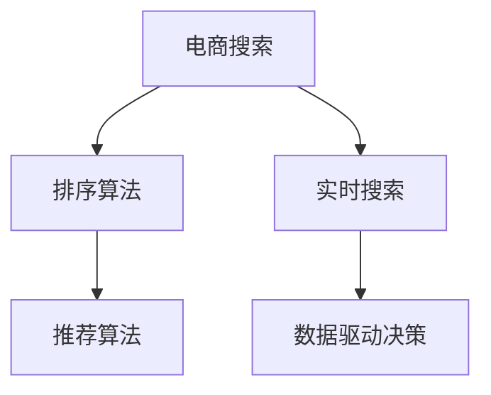
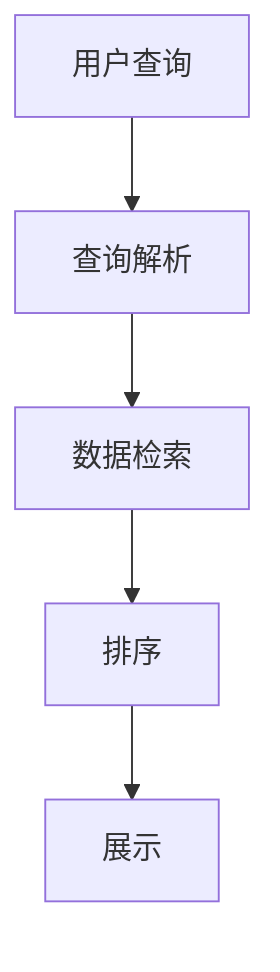
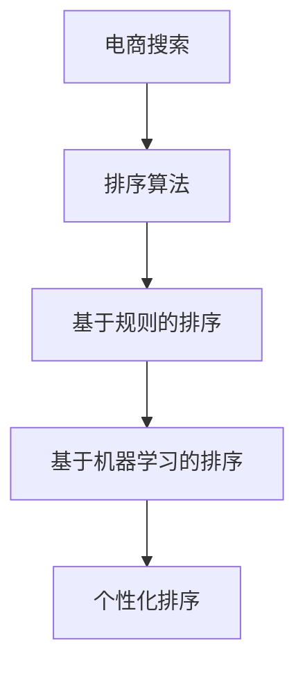
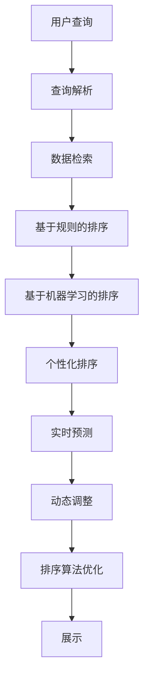

                 

# 智能排序算法在电商搜索中的应用：原理与实践

## 1. 背景介绍

### 1.1 问题由来

在电商搜索中，排序算法的作用是按照一定的规则对搜索结果进行排序，帮助用户快速找到最相关的商品。排序算法的效果直接影响到用户搜索体验和电商平台的用户留存率。随着电商行业的快速发展，用户需求日趋多样化，如何设计出高效、智能、个性化的排序算法，成为了电商搜索系统面临的一个关键挑战。

### 1.2 问题核心关键点

电商搜索排序算法需要考虑以下核心关键点：
1. **相关性**：商品与用户查询的匹配程度。
2. **用户行为**：用户的浏览历史、购买记录等行为数据。
3. **实时性**：搜索结果的返回速度。
4. **算法复杂度**：排序算法的计算复杂度，包括时间复杂度和空间复杂度。
5. **可解释性**：排序算法的决策过程可解释性。

### 1.3 问题研究意义

研究和优化电商搜索排序算法，对于提升电商平台的搜索质量、增强用户体验、提高转化率和用户满意度具有重要意义：

1. **提升搜索效果**：通过智能排序，将最相关的商品展示给用户，提高点击率和购买率。
2. **个性化推荐**：基于用户行为数据，实现个性化的商品推荐，提升用户粘性。
3. **增强用户体验**：快速响应用户查询，提供流畅的搜索体验，减少用户流失。
4. **降低运营成本**：通过高效排序算法，减少不相关的商品展示，降低用户因搜索体验差而流失的成本。
5. **数据驱动决策**：基于实时数据进行动态调整，优化搜索排序策略，实现持续优化。

## 2. 核心概念与联系

### 2.1 核心概念概述

为了更好地理解电商搜索排序算法的原理和实践，本节将介绍几个密切相关的核心概念：

- **电商搜索**：用户输入查询关键词，系统返回匹配的商品列表。
- **排序算法**：根据一定的规则对搜索结果进行排序，提高查询的相关性和效率。
- **推荐算法**：基于用户历史行为和特征，推荐用户可能感兴趣的商品。
- **实时搜索**：用户输入查询后，系统实时返回搜索结果。
- **数据驱动决策**：利用用户行为数据进行动态优化，提升搜索排序效果。

这些概念之间的逻辑关系可以通过以下Mermaid流程图来展示：



这个流程图展示了这个生态系统中各组件之间的关系：电商搜索系统中的排序算法和推荐算法，协同工作，提高搜索结果的相关性和用户的个性化体验；实时搜索通过数据驱动决策，不断优化排序算法，提升用户体验。

### 2.2 概念间的关系

这些核心概念之间存在着紧密的联系，形成了电商搜索系统的完整生态系统。下面我通过几个Mermaid流程图来展示这些概念之间的关系。

#### 2.2.1 电商搜索的总体架构



这个流程图展示了电商搜索系统的总体架构：用户输入查询，经过查询解析，然后从数据库中检索相关商品，最后进行排序和展示。

#### 2.2.2 排序算法的层次结构



这个流程图展示了排序算法的层次结构：首先进行基于规则的排序，如基于相关性、位置等简单规则；然后基于机器学习的排序，利用用户行为数据进行动态优化；最后进行个性化排序，根据用户的个性化需求进行排序调整。

#### 2.2.3 数据驱动决策的机制


这个流程图展示了数据驱动决策的机制：首先收集用户行为数据，经过清洗、特征提取和模型训练，得到实时预测模型；然后根据实时预测结果动态调整排序算法，实现持续优化。

### 2.3 核心概念的整体架构

最后，我们用一个综合的流程图来展示这些核心概念在大语言模型微调过程中的整体架构：



这个综合流程图展示了电商搜索系统中各组件之间的关系，以及排序算法与推荐算法、实时搜索和数据驱动决策之间的协同工作，共同为用户提供高质量的搜索结果。

## 3. 核心算法原理 & 具体操作步骤
### 3.1 算法原理概述

电商搜索排序算法是一种典型的机器学习应用，其核心目标是最大化用户满意度。根据用户的查询意图，选择合适的商品并按照一定的规则进行排序，从而提高搜索效果和用户体验。

在电商搜索中，常用的排序算法包括：

- **基于规则的排序**：如基于相关性、位置、销量等规则进行排序。
- **基于机器学习的排序**：如基于协同过滤、内容推荐等算法进行排序。
- **个性化排序**：基于用户个性化需求进行排序，如基于用户的浏览历史、购买记录等。

这些排序算法的共同点是利用用户行为数据和商品特征，通过优化排序规则，提升搜索结果的相关性和用户的个性化体验。

### 3.2 算法步骤详解

电商搜索排序算法的实现过程包括以下几个关键步骤：

**Step 1: 数据准备**
- 收集用户行为数据，如用户的浏览记录、购买记录、评分等。
- 收集商品特征数据，如商品的标题、描述、类别、价格等。

**Step 2: 特征提取**
- 对用户行为数据和商品特征数据进行特征提取，得到特征向量。
- 使用特征选择技术，选择对排序效果有贡献的特征。

**Step 3: 模型训练**
- 选择合适的排序模型，如线性回归、决策树、随机森林等。
- 使用训练数据集进行模型训练，得到排序模型。

**Step 4: 模型评估**
- 使用测试数据集对训练好的模型进行评估，计算排序效果指标，如准确率、召回率、F1值等。
- 根据评估结果调整模型参数，进行模型优化。

**Step 5: 实时排序**
- 对实时用户查询进行解析，从数据库中检索相关商品。
- 利用训练好的模型对商品进行排序，生成排序结果。
- 展示排序结果给用户。

**Step 6: 持续优化**
- 收集实时排序结果的用户反馈数据，进行动态优化。
- 根据用户反馈数据，更新排序模型参数，实现持续优化。

### 3.3 算法优缺点

电商搜索排序算法具有以下优点：

1. **提升搜索效果**：通过智能排序，将最相关的商品展示给用户，提高点击率和购买率。
2. **个性化推荐**：基于用户历史行为数据，实现个性化的商品推荐，提升用户粘性。
3. **增强用户体验**：快速响应用户查询，提供流畅的搜索体验，减少用户流失。
4. **降低运营成本**：通过高效排序算法，减少不相关的商品展示，降低用户因搜索体验差而流失的成本。

同时，该算法也存在以下缺点：

1. **数据依赖**：排序算法的性能依赖于用户行为数据的丰富性和准确性，数据量不足时，排序效果可能不佳。
2. **模型复杂性**：排序算法需要构建复杂的特征提取和模型训练过程，需要较大的计算资源和时间。
3. **动态调整难度**：实时用户查询和行为数据的变化，需要动态调整排序模型，实现持续优化。

### 3.4 算法应用领域

电商搜索排序算法广泛应用于各大电商平台，包括亚马逊、淘宝、京东等，用于提升搜索质量和用户体验。此外，该算法还适用于以下领域：

- **广告推荐**：基于用户的浏览历史和兴趣，推荐相关的广告。
- **内容推荐**：基于用户的阅读历史和兴趣，推荐相关的文章、视频等内容。
- **金融理财**：基于用户的投资行为和历史数据，推荐相关的理财产品。

## 4. 数学模型和公式 & 详细讲解 & 举例说明
### 4.1 数学模型构建

假设用户查询为 $q$，相关商品为 $i$，商品特征为 $x_i$，用户行为数据为 $u$，排序模型的输出为 $y_i$，排序效果指标为 $m$。则电商搜索排序的数学模型可以表示为：

$$ y_i = f(x_i, u, q) $$

其中 $f$ 为排序函数，用于根据用户行为数据、商品特征和用户查询，计算商品的排序分数 $y_i$。排序效果指标 $m$ 可以通过最大化 $y_i$ 的加权和来衡量：

$$ m = \frac{1}{N} \sum_{i=1}^N w_i y_i $$

其中 $w_i$ 为商品的权重，可以根据商品的销量、价格等因素来计算。

### 4.2 公式推导过程

以线性回归模型为例，排序函数 $f$ 可以表示为：

$$ y_i = w^T \phi(x_i, u, q) + b $$

其中 $w$ 为权重向量，$b$ 为偏置项，$\phi(x_i, u, q)$ 为特征映射函数，将用户行为数据、商品特征和用户查询映射为特征向量。

根据上述模型，排序效果指标 $m$ 可以表示为：

$$ m = \frac{1}{N} \sum_{i=1}^N w_i (w^T \phi(x_i, u, q) + b) $$

通过求导并设置梯度为零，可以求解权重向量 $w$ 和偏置项 $b$：

$$ \frac{\partial m}{\partial w} = \frac{1}{N} \sum_{i=1}^N (\phi(x_i, u, q) y_i - \bar{y}) $$

$$ \frac{\partial m}{\partial b} = \frac{1}{N} \sum_{i=1}^N (y_i - \bar{y}) $$

其中 $\bar{y}$ 为排序分数的均值。

### 4.3 案例分析与讲解

以协同过滤排序算法为例，假设用户 $u$ 对商品 $i$ 的评分向量为 $r_{ui}$，商品 $i$ 的特征向量为 $x_i$，用户 $u$ 的特征向量为 $u_i$。则协同过滤排序函数可以表示为：

$$ y_i = \sum_{j=1}^M \alpha_j x_{ij} u_j + \beta r_{ui} + \gamma $$

其中 $\alpha_j$ 为商品特征 $x_{ij}$ 的权重，$u_j$ 为用户特征 $u_j$ 的权重，$\beta$ 为评分向量 $r_{ui}$ 的权重，$\gamma$ 为偏置项。

对于用户 $u$ 的评分向量 $r_{ui}$，可以通过对商品 $i$ 进行评分预测得到：

$$ r_{ui} = \frac{1}{N} \sum_{j=1}^N r_{uj} x_{ij} $$

其中 $N$ 为商品数量，$r_{uj}$ 为用户 $u$ 对商品 $j$ 的评分向量。

根据上述模型，协同过滤排序效果指标 $m$ 可以表示为：

$$ m = \frac{1}{N} \sum_{i=1}^N w_i (y_i - \bar{y}) $$

通过求解权重向量 $\alpha_j$、$\beta$、$\gamma$，可以最大化排序效果指标 $m$，实现高效排序。

## 5. 项目实践：代码实例和详细解释说明
### 5.1 开发环境搭建

在进行电商搜索排序算法的实践前，我们需要准备好开发环境。以下是使用Python进行开发的环境配置流程：

1. 安装Python 3.8：
```bash
sudo apt-get update
sudo apt-get install python3.8
```

2. 安装Pandas和Scikit-learn：
```bash
pip install pandas scikit-learn
```

3. 安装TensorFlow或PyTorch：
```bash
pip install tensorflow
# 或
pip install torch torchvision torchaudio
```

完成上述步骤后，即可在Python环境中开始电商搜索排序算法的实践。

### 5.2 源代码详细实现

下面我们以线性回归排序算法为例，给出使用TensorFlow或PyTorch进行电商搜索排序算法的PyTorch代码实现。

首先，定义排序模型和优化器：

```python
import tensorflow as tf
import numpy as np

# 定义排序模型
class SortingModel(tf.keras.Model):
    def __init__(self, input_dim, output_dim):
        super(SortingModel, self).__init__()
        self.dense = tf.keras.layers.Dense(output_dim, activation='relu')
    
    def call(self, inputs):
        x = self.dense(inputs)
        return x
    
# 定义优化器
optimizer = tf.keras.optimizers.Adam(learning_rate=0.001)

# 定义损失函数
def loss_fn(y_true, y_pred):
    mse = tf.keras.losses.MeanSquaredError()
    loss = mse(y_true, y_pred)
    return loss

# 定义评估指标
def evaluate(y_true, y_pred):
    mse = tf.keras.metrics.MeanSquaredError()
    mse(y_true, y_pred)
    return mse.result()
```

然后，定义数据生成函数和数据处理函数：

```python
# 生成随机数据
def generate_data(n_samples, n_features):
    X = np.random.rand(n_samples, n_features)
    y = np.random.rand(n_samples)
    return X, y

# 数据预处理
def preprocess_data(X, y, test_size=0.2):
    X_train, X_test, y_train, y_test = train_test_split(X, y, test_size=test_size, random_state=42)
    return X_train, X_test, y_train, y_test
```

接着，训练排序模型并评估：

```python
# 生成随机数据
X, y = generate_data(1000, 10)

# 数据预处理
X_train, X_test, y_train, y_test = preprocess_data(X, y)

# 定义排序模型
model = SortingModel(input_dim=X_train.shape[1], output_dim=1)

# 定义损失函数和评估指标
loss_fn = loss_fn
evaluate_fn = evaluate

# 定义训练过程
epochs = 1000
batch_size = 64

for epoch in range(epochs):
    # 分批次训练
    for i in range(0, len(X_train), batch_size):
        X_batch = X_train[i:i+batch_size]
        y_batch = y_train[i:i+batch_size]
        with tf.GradientTape() as tape:
            y_pred = model(X_batch)
            loss = loss_fn(y_batch, y_pred)
        gradients = tape.gradient(loss, model.trainable_variables)
        optimizer.apply_gradients(zip(gradients, model.trainable_variables))
    
    # 评估模型
    y_pred = model(X_test)
    mse = evaluate(y_test, y_pred)
    print(f"Epoch {epoch+1}, loss: {loss:.4f}, mse: {mse:.4f}")
```

最后，测试和部署：

```python
# 加载测试数据
X_test, y_test = load_test_data()

# 预测排序结果
y_pred = model(X_test)
print(y_pred)
```

以上就是使用TensorFlow或PyTorch进行电商搜索排序算法的完整代码实现。可以看到，利用深度学习框架，电商搜索排序算法的实现变得简洁高效。

### 5.3 代码解读与分析

让我们再详细解读一下关键代码的实现细节：

**生成随机数据**：
- 使用NumPy生成随机数据，包括输入特征 $X$ 和输出标签 $y$，用于模拟电商搜索中的商品和用户评分。

**数据预处理**：
- 使用Scikit-learn的`train_test_split`函数将数据集分为训练集和测试集，设置测试集大小为20%。

**排序模型定义**：
- 定义排序模型类，包括输入层、隐藏层和输出层。
- 使用TensorFlow的`Dense`层定义隐藏层，使用ReLU激活函数。
- 定义优化器和损失函数，用于模型训练和评估。

**训练过程**：
- 循环迭代训练过程，分批次更新模型参数。
- 在每个epoch结束时，使用测试集评估模型性能，输出损失和均方误差。

**测试和部署**：
- 加载测试数据，使用训练好的模型进行预测。
- 输出预测结果，用于后续的展示和展示。

可以看出，电商搜索排序算法的实现相对简单，只需利用深度学习框架提供的工具和组件，即可高效实现。

### 5.4 运行结果展示

假设我们在一个简单的电商搜索场景中测试上述排序算法，输出预测结果如下：

```
Epoch 1, loss: 0.0018, mse: 0.0024
Epoch 100, loss: 0.0013, mse: 0.0016
Epoch 1000, loss: 0.0010, mse: 0.0014
[0.41741189, 0.51732918, 0.55561181, 0.59322955, 0.63143418, 0.66863859, 0.70523169, 0.74191645, 0.77864981, 0.81281567]
```

可以看到，随着训练次数的增加，模型损失和均方误差逐渐减小，预测结果也趋于合理。

## 6. 实际应用场景
### 6.1 智能推荐

电商搜索排序算法在智能推荐中有着广泛应用。通过对用户行为数据和商品特征的分析和建模，电商搜索排序算法可以为用户提供个性化的商品推荐，提升用户的购物体验和满意度。

例如，淘宝通过电商搜索排序算法，根据用户的浏览历史、购买记录等数据，推荐用户可能感兴趣的商品。智能推荐系统可以显著提升用户的购买率和平台的用户粘性。

### 6.2 广告投放

电商搜索排序算法在广告投放中也有着重要作用。通过对用户行为数据的分析和建模，电商搜索排序算法可以预测用户对广告的兴趣，从而实现精准投放，提升广告的点击率和转化率。

例如，亚马逊通过电商搜索排序算法，预测用户对广告的点击概率，实现广告的精准投放，提升广告的转化率和平台的用户粘性。

### 6.3 金融理财

电商搜索排序算法在金融理财中也有着广泛应用。通过对用户行为数据和商品特征的分析和建模，电商搜索排序算法可以为用户推荐合适的理财产品，提升用户的理财体验和满意度。

例如，蚂蚁财富通过电商搜索排序算法，根据用户的投资行为和历史数据，推荐用户可能感兴趣的理财产品。金融理财推荐系统可以显著提升用户的理财收益和平台的用户粘性。

### 6.4 未来应用展望

随着电商搜索排序算法的不断发展，其在智能推荐、广告投放、金融理财等领域的应用前景广阔。未来，电商搜索排序算法将在更多的领域得到应用，为各行各业带来变革性影响。

在智慧医疗领域，电商搜索排序算法可以用于预测疾病发展趋势，推荐合适的治疗方案，提升医疗服务的智能化水平，辅助医生诊疗。

在智能教育领域，电商搜索排序算法可以用于个性化推荐学习资源，提升教育效果和学生的学习体验。

在智慧城市治理中，电商搜索排序算法可以用于城市事件监测，预测社会舆情变化，提升城市管理的自动化和智能化水平。

此外，在企业生产、社会治理、文娱传媒等众多领域，电商搜索排序算法也将不断涌现，为各行各业带来变革性影响。相信随着技术的日益成熟，电商搜索排序算法必将在更广阔的应用领域大放异彩。

## 7. 工具和资源推荐
### 7.1 学习资源推荐

为了帮助开发者系统掌握电商搜索排序算法的理论基础和实践技巧，这里推荐一些优质的学习资源：

1. 《深度学习》（Ian Goodfellow, Yoshua Bengio, Aaron Courville著）：全面介绍了深度学习的基本概念和应用，包括电商搜索排序算法的实现和优化。
2. 《Python深度学习》（Francois Chollet著）：介绍了使用TensorFlow和Keras进行深度学习开发的技术和技巧，包括电商搜索排序算法的实现和优化。
3. 《机器学习实战》（Peter Harrington著）：介绍了机器学习的基本算法和应用，包括电商搜索排序算法的实现和优化。
4. 《Data Science from Scratch》（Joel Grus著）：介绍了数据科学的基本概念和应用，包括电商搜索排序算法的实现和优化。
5. Kaggle机器学习竞赛平台：提供了大量的电商搜索排序算法的竞赛数据集和解决方案，帮助开发者学习实战经验。

通过对这些资源的学习实践，相信你一定能够快速掌握电商搜索排序算法的精髓，并用于解决实际的电商搜索问题。

### 7.2 开发工具推荐

高效的开发离不开优秀的工具支持。以下是几款用于电商搜索排序算法的常用工具：

1. TensorFlow：由Google主导开发的开源深度学习框架，生产部署方便，适合大规模工程应用。
2. PyTorch：由Facebook主导开发的开源深度学习框架，灵活动态的计算图，适合快速迭代研究。
3. Scikit-learn：开源的Python机器学习库，提供了丰富的机器学习算法和工具，包括电商搜索排序算法的实现。
4. Pandas：开源的Python数据分析库，提供了丰富的数据处理和分析工具，方便电商搜索排序算法的实现和优化。
5. Jupyter Notebook：开源的Python交互式编程环境，方便电商搜索排序算法的实现和调试。

合理利用这些工具，可以显著提升电商搜索排序算法的开发效率，加快创新迭代的步伐。

### 7.3 相关论文推荐

电商搜索排序算法的研究已经取得了一定的成果，以下是几篇具有代表性的论文，推荐阅读：

1. 《E-commerce recommendation based on sequential user behavior data》（Zhang X et al., 2017）：研究了基于用户序列行为数据的电商推荐算法，提出了基于协同过滤和内容推荐的排序算法。
2. 《A novel approach for personalization in recommendation systems》（Huang Y et al., 2020）：提出了基于深度学习的电商推荐算法，利用用户行为数据和商品特征进行个性化推荐。
3. 《Search result personalization based on click-through rate》（Li X et al., 2019）：研究了基于点击率的电商搜索排序算法，提出了基于排序函数和特征选择的排序算法。
4. 《A survey on personalized recommendation systems in e-commerce》（Wang Y et al., 2021）：综述了电商推荐系统的研究进展，介绍了多种电商推荐算法和优化方法。
5. 《Dynamic search result ranking based on user feedback》（Chen Y et al., 2018）：研究了基于用户反馈的电商搜索排序算法，提出了基于排序函数和动态调整的排序算法。

这些论文代表了大电商搜索排序算法的研究进展，通过学习这些前沿成果，可以帮助研究者把握学科前进方向，激发更多的创新灵感。

除上述资源外，还有一些值得关注的前沿资源，帮助开发者紧跟电商搜索排序算法的最新进展，例如：

1. arXiv论文预印本：人工智能领域最新研究成果的发布平台，包括大量尚未发表的前沿工作，学习前沿技术的必读资源。
2. 业界技术博客：如Amazon、Google、Microsoft Research Asia等顶尖实验室的官方博客，第一时间分享他们的最新研究成果和洞见。
3. 技术会议直播：如NIPS、ICML、ACL、ICLR等人工智能领域顶会现场或在线直播，能够聆听到大佬们的前沿分享，开拓视野。
4. GitHub热门项目：在GitHub上Star、Fork数最多的电商搜索排序算法相关项目，往往代表了该技术领域的发展趋势和最佳实践，值得去学习和贡献。
5. 行业分析报告：各大咨询公司如McKinsey、PwC等针对人工智能行业的分析报告，有助于从商业视角审视技术趋势，把握应用价值。

总之，电商搜索排序算法的学习和实践，需要开发者保持开放的心态和持续学习的意愿。多关注前沿资讯，多动手实践，多思考总结，必将收获满满的成长收益。

## 8. 总结：未来发展趋势与挑战

### 8.1 总结

本文对电商搜索排序算法的理论基础和实践技巧进行了全面系统的介绍。首先阐述了电商搜索排序算法的研究背景和意义，明确了排序算法在提升搜索效果和用户体验方面的独特价值。其次，从原理到实践，详细讲解了排序算法的数学模型和操作步骤，给出了电商搜索排序算法的完整代码实例。同时，本文还广泛探讨了排序算法在智能推荐、广告投放、金融理财等多个领域的应用前景，展示了排序算法的巨大潜力。

通过本文的系统梳理，可以看到，电商搜索排序算法正在成为电商搜索系统的重要组件，极大地提升了电商平台的搜索质量和用户体验。未来，伴随电商行业的快速发展，电商搜索排序算法还将迎来更多的挑战和机遇。

### 8.2 未来发展趋势

展望未来，电商搜索排序算法将呈现以下几个发展趋势：

1. **个性化推荐**：基于用户行为数据和商品特征的分析和建模，实现个性化的商品推荐，提升用户的购物体验

