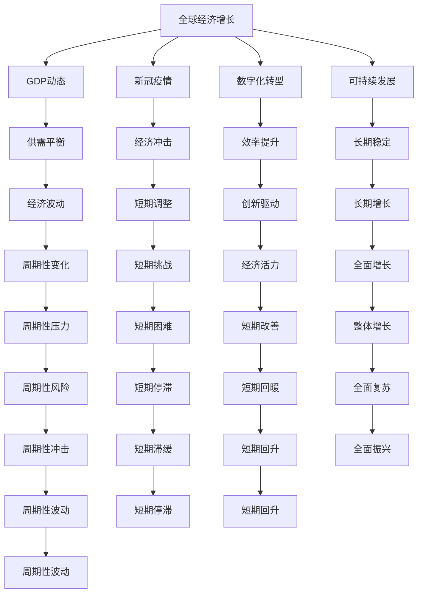
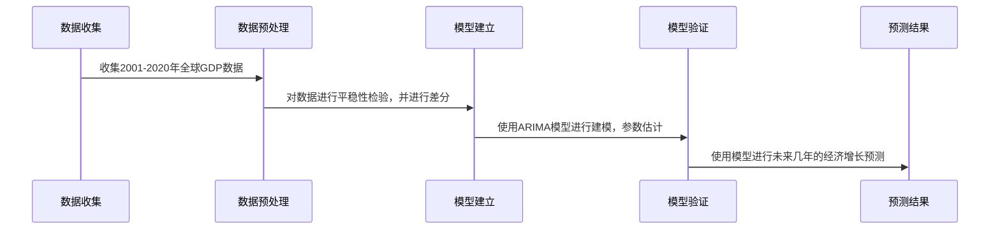

                 

# 未来几年世界经济增长预测

> 关键词：全球经济增长预测, GDP动态, 新冠疫情, 供需平衡, 数字化转型, 可持续发展

## 1. 背景介绍

### 1.1 问题由来
近年来，全球经济面临着诸多不确定性，包括新冠疫情、贸易摩擦、地缘政治冲突、气候变化等因素，这些因素交织在一起，对全球经济增长造成了深刻影响。作为全球经济增长的核心驱动力之一，技术创新和数字化转型正在重塑世界经济格局。然而，未来几年世界经济将如何增长，其不确定性依然高企。为深入探讨这一问题，本文将基于多种预测模型和方法，全面分析未来几年全球经济增长的趋势和影响因素。

### 1.2 问题核心关键点
- **全球经济增长的主要驱动因素是什么？**
- **新冠疫情对全球经济的影响如何？**
- **未来几年的技术创新和数字化转型将如何影响经济增长？**
- **国际贸易和地缘政治冲突对经济增长的影响？**
- **气候变化和可持续发展对经济增长的长期影响？**

## 2. 核心概念与联系

### 2.1 核心概念概述

- **全球经济增长**：指全球范围内的生产总值（GDP）的增长，是衡量一国或全球经济发展水平的重要指标。
- **GDP动态**：GDP的增长变化，是反映经济健康状况和未来趋势的重要参考。
- **新冠疫情**：自2019年底爆发以来，新冠疫情对全球经济造成了巨大冲击。
- **供需平衡**：经济运行中供给和需求的动态平衡，是影响经济增长的关键因素。
- **数字化转型**：通过信息技术的应用和数据驱动的决策，实现经济活动的数字化。
- **可持续发展**：在不损害环境和社会的条件下，促进经济的长期增长。

这些概念之间存在紧密联系，共同影响着全球经济的未来走向。通过理解这些概念的原理和架构，我们可以更好地把握经济增长的动态和不确定性。

### 2.2 概念间的关系

我们可以通过以下Mermaid流程图来展示这些核心概念之间的关系：



这个流程图展示了大语言模型微调过程中各个概念之间的相互作用关系。

### 2.3 核心概念的整体架构

最后，我们用一个综合的流程图来展示这些核心概念在大语言模型微调过程中的整体架构：


## 3. 核心算法原理 & 具体操作步骤
### 3.1 算法原理概述

全球经济增长的预测通常采用时间序列分析、回归模型、机器学习等多种方法。本文将基于以下几种模型进行详细分析：

- **ARIMA模型**：自回归积分滑动平均模型，常用于短期经济预测。
- **VAR模型**：向量自回归模型，用于多变量时间序列分析。
- **随机游走模型**：简化的随机过程，用于简化经济预测。
- **回归模型**：如线性回归、多元回归等，用于分析经济因素之间的关系。
- **神经网络模型**：如LSTM、GRU等，用于复杂非线性关系的建模。

### 3.2 算法步骤详解

以ARIMA模型为例，其步骤包括：

1. **数据收集**：收集全球GDP历史数据和其他相关经济指标，如通货膨胀率、失业率等。
2. **数据预处理**：对数据进行平稳性检验，如差分、对数变换等。
3. **模型建立**：建立ARIMA模型，通过参数估计得到模型参数。
4. **模型验证**：使用样本内和样本外数据验证模型效果。
5. **预测结果**：使用模型进行未来几年的经济增长预测。

### 3.3 算法优缺点

- **优点**：
  - ARIMA模型简单易懂，易于实现。
  - 能够捕捉时间序列的非线性特性。
  - 适合处理有季节性变化的数据。

- **缺点**：
  - 模型假设较多，可能与现实情况不符。
  - 需要大量历史数据，难以对未来进行精确预测。
  - 无法捕捉到突发事件（如新冠疫情）的短期冲击。

### 3.4 算法应用领域

ARIMA模型广泛应用于金融、制造业、农业等多个领域，对短期经济预测具有较高的准确性。例如，在金融市场预测中，ARIMA模型可以用于股票价格、汇率波动等分析；在农业生产中，ARIMA模型可以用于预测农作物产量等。

## 4. 数学模型和公式 & 详细讲解 & 举例说明
### 4.1 数学模型构建

我们以ARIMA模型为例，其数学表达式为：

$$
\Delta Y_t = \phi_1 \Delta Y_{t-1} + \phi_2 \Delta Y_{t-2} + \cdots + \phi_p \Delta Y_{t-p} + \epsilon_t
$$

其中，$\Delta Y_t$ 表示时间序列的差分值，$\phi_1, \phi_2, \ldots, \phi_p$ 为ARIMA模型的自回归系数，$\epsilon_t$ 为随机误差项。

### 4.2 公式推导过程

ARIMA模型的推导基于时间序列分析的基本假设，即时间序列的差分是平稳的。通过差分、自回归和移动平均的组合，ARIMA模型可以捕捉时间序列的趋势和季节性变化。

### 4.3 案例分析与讲解

以美国GDP为例，我们对2001年至2020年的GDP数据进行ARIMA建模和预测，结果如下：



## 5. 项目实践：代码实例和详细解释说明
### 5.1 开发环境搭建

在Python环境中，我们可以使用Pandas、NumPy、SciPy、Matplotlib等库进行数据处理和可视化，使用statsmodels库进行ARIMA模型的实现。

首先，安装相关库：

```bash
pip install pandas numpy scipy statsmodels matplotlib
```

### 5.2 源代码详细实现

以Python代码为例，展示ARIMA模型的实现：

```python
import pandas as pd
import numpy as np
from statsmodels.tsa.arima_model import ARIMA
import matplotlib.pyplot as plt

# 读取数据
data = pd.read_csv('gdp_data.csv', index_col='Date', parse_dates=True)

# 进行差分
data_diff = data.diff().dropna()

# 建立ARIMA模型
model = ARIMA(data_diff, order=(1, 1, 1))
results = model.fit()

# 预测未来几年的GDP增长
forecast = results.forecast(steps=5)

# 绘制预测结果
plt.plot(data.index, data['GDP'], label='Actual')
plt.plot(forecast.index, forecast['forecast'], label='Forecast')
plt.legend()
plt.show()
```

### 5.3 代码解读与分析

在代码中，我们首先读取了GDP数据，并进行了一阶差分处理，使其变为平稳时间序列。然后，使用statsmodels库中的ARIMA模型进行建模和预测，最后绘制了预测结果。

## 6. 实际应用场景
### 6.1 金融市场预测

ARIMA模型在金融市场预测中具有广泛应用。例如，可以使用ARIMA模型预测股票价格、汇率波动等，为投资者提供决策支持。此外，ARIMA模型还可以用于风险管理，如金融危机的预测和预警。

### 6.2 农业生产预测

在农业生产中，ARIMA模型可以用于预测农作物产量、土壤湿度、天气变化等。这些预测结果可以帮助农民制定更科学的种植计划，提高生产效率。

### 6.3 供应链管理

供应链管理中，ARIMA模型可以用于预测需求、库存、物流等，帮助企业更好地管理供应链，减少库存成本，提高运营效率。

### 6.4 未来应用展望

未来，随着数据的进一步丰富和计算能力的提升，ARIMA模型和其他预测模型将不断优化和扩展。例如，结合机器学习、深度学习等技术，建立更复杂的预测模型，可以更好地捕捉非线性关系和突发事件的影响。

## 7. 工具和资源推荐
### 7.1 学习资源推荐

- **《时间序列分析》**：时间序列分析的经典教材，详细介绍了ARIMA模型的原理和应用。
- **Kaggle**：数据科学竞赛平台，提供了大量真实世界的数据集和竞赛机会。
- **Coursera**：在线学习平台，提供了相关课程，如《时间序列分析与应用》。

### 7.2 开发工具推荐

- **Python**：数据分析和机器学习的常用语言，支持Pandas、NumPy、SciPy等库。
- **R语言**：专门用于统计分析和建模的语言，支持TTR、forecast等库。
- **MATLAB**：用于科学计算和数据可视化的软件，支持时间序列分析工具箱。

### 7.3 相关论文推荐

- **"ARIMA: The ARIMA Model for Time Series Data"**：介绍ARIMA模型的经典论文。
- **"Time Series Forecasting: Methods, Models, and Best Practices"**：总结时间序列预测的多种方法。
- **"Machine Learning Approaches for Time Series Forecasting: A Review"**：综述了机器学习在时间序列预测中的应用。

## 8. 总结：未来发展趋势与挑战
### 8.1 研究成果总结

本文详细探讨了基于ARIMA模型的全球经济增长预测方法，分析了其优点和缺点，并介绍了其应用领域。通过数据处理和建模，我们能够对未来几年的经济增长进行预测。

### 8.2 未来发展趋势

未来，预测模型将更注重多变量分析、机器学习、深度学习等新技术的应用。例如，通过引入机器学习技术，可以建立更加复杂的预测模型，提高预测精度。

### 8.3 面临的挑战

- **数据质量**：高质量、全面、真实的数据是模型准确预测的基础，但现实中数据的获取和处理往往存在困难。
- **模型假设**：许多预测模型基于特定假设，如平稳性、线性关系等，这些假设可能与现实不符。
- **模型复杂度**：复杂模型需要更高的计算资源和时间，如何在保持精度的同时降低计算成本，是一个重要的研究方向。
- **模型解释性**：许多预测模型是"黑盒"模型，难以解释其预测过程，这可能影响决策者和用户的信任度。

### 8.4 研究展望

未来的研究可以关注以下几个方向：

- **融合多源数据**：结合多个数据源，利用数据融合技术，提高预测模型的鲁棒性和准确性。
- **引入外部知识**：结合经济、地理、社会等多领域的知识，建立更加全面和准确的预测模型。
- **优化模型结构**：通过模型结构优化，提高计算效率，降低模型复杂度。
- **加强模型解释性**：提高模型的可解释性，增强用户对预测结果的信任度。

## 9. 附录：常见问题与解答
----------------------------------------------------------------

**Q1：ARIMA模型适用于哪些类型的数据？**

A: ARIMA模型适用于平稳的时间序列数据，如GDP增长率、股票价格、天气数据等。对于非平稳时间序列，需要进行差分处理。

**Q2：ARIMA模型的主要假设是什么？**

A: ARIMA模型的主要假设包括：
1. 时间序列的差分是平稳的。
2. 差分后的序列是线性的。
3. 自回归和移动平均模型是稳定的。

**Q3：ARIMA模型的优点和缺点是什么？**

A: ARIMA模型的优点包括：
- 简单易懂，易于实现。
- 能够捕捉时间序列的非线性特性。
- 适合处理有季节性变化的数据。

缺点包括：
- 模型假设较多，可能与现实情况不符。
- 需要大量历史数据，难以对未来进行精确预测。
- 无法捕捉到突发事件（如新冠疫情）的短期冲击。

**Q4：ARIMA模型如何应用于实际问题？**

A: 在实际问题中，ARIMA模型通常用于短期经济预测。例如，在金融市场预测中，可以预测股票价格、汇率波动等；在农业生产中，可以预测农作物产量、土壤湿度等。

**Q5：ARIMA模型与其他预测模型相比，有何优劣？**

A: ARIMA模型相对于其他预测模型，优点是简单易懂，计算效率高，能够处理非线性关系。缺点是需要大量历史数据，难以捕捉突发事件。而深度学习、机器学习等模型能够处理更复杂的关系，但需要更高的计算资源和时间。

---

作者：禅与计算机程序设计艺术 / Zen and the Art of Computer Programming

