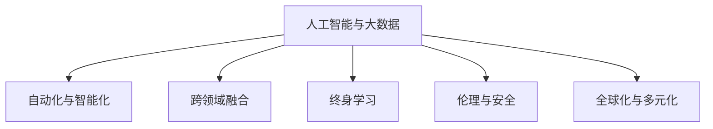
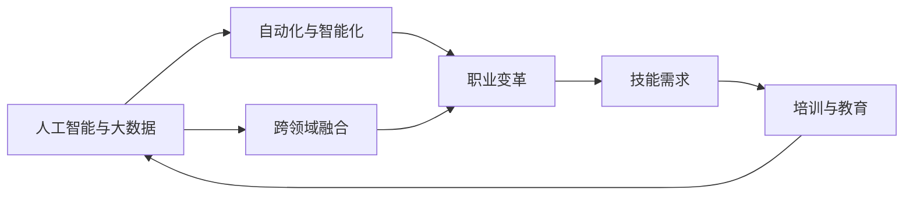
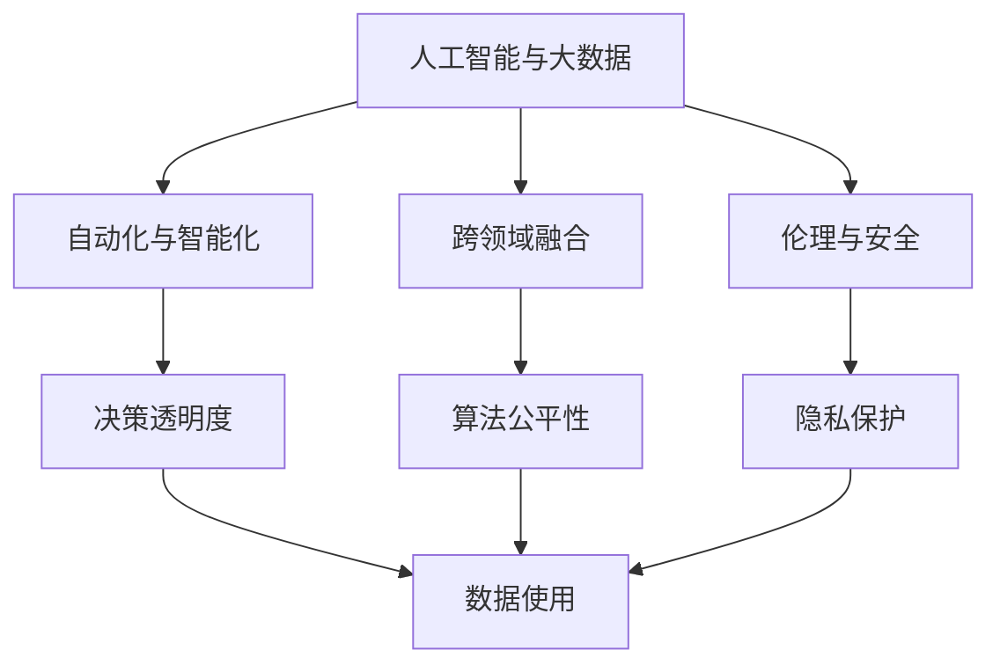
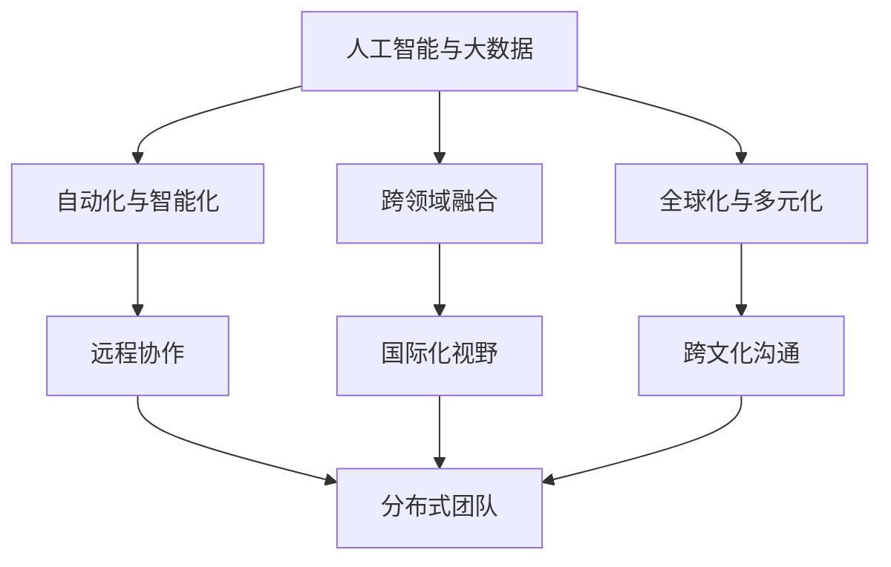
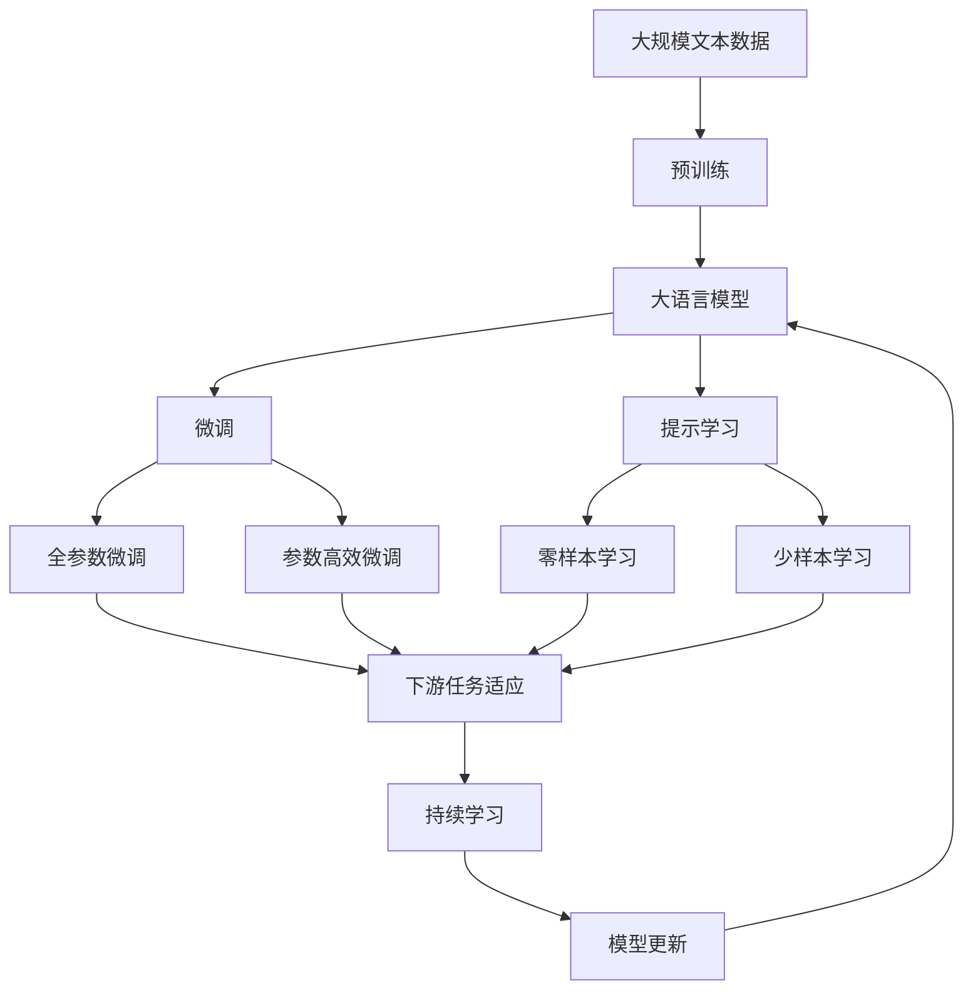

                 

# 未来工作：技能需求与培养

## 1. 背景介绍

### 1.1 问题由来
在科技日新月异的今天，人工智能(AI)和大数据技术的迅猛发展，正在深刻改变全球的就业格局和工作方式。这一趋势不仅体现在技术岗位的变化上，也影响到各行各业的人才需求和职业发展路径。对于即将步入职场的年轻人，以及已在职场奋斗的资深人士，了解并掌握未来工作的关键技能，无疑是做好职业规划、提升市场竞争力的重要一步。

### 1.2 问题核心关键点
未来工作的核心关键点在于技术变革如何重塑职业生态。主要包括以下几个方面：
1. **自动化与智能化**：AI和大数据技术的广泛应用，使得许多传统职位面临自动化替代的风险。
2. **跨领域融合**：跨学科的知识整合能力将成为未来人才的核心竞争力。
3. **终身学习与适应性**：持续学习、快速适应的能力将成为职业发展的必需。
4. **伦理与安全**：随着AI技术在各个领域的深入应用，伦理和安全问题也变得越来越重要。
5. **全球化与多元化**：国际化的视角和多元文化的包容性，将成为未来职场的必备素质。

### 1.3 问题研究意义
了解未来工作的技能需求与培养策略，对于个人职业发展具有重要意义：

1. **职业规划**：帮助求职者了解行业趋势，提前准备，提升求职竞争力。
2. **能力提升**：帮助在职人员识别技能缺口，针对性地进行学习和提升。
3. **未来适应**：帮助职场人士适应未来职场的变化，保持持续的竞争力。
4. **社会责任**：通过教育和培训，提升社会的整体AI素养，推动技术健康发展。

## 2. 核心概念与联系

### 2.1 核心概念概述

为更好地理解未来工作的技能需求与培养，本节将介绍几个关键概念：

- **人工智能与大数据**：以AI和数据为核心驱动力的技术，正在重塑各行各业的工作方式。
- **自动化与智能化**：AI技术能够自动完成重复性、低价值的任务，提高工作效率和精度。
- **跨领域融合**：AI和大数据技术的应用，促使不同领域之间的知识和技术的交叉融合，产生新的应用场景和商业模式。
- **终身学习**：在快速变化的技术环境中，持续学习成为保持竞争力的重要手段。
- **伦理与安全**：随着AI技术的广泛应用，数据隐私、算法公平性等伦理问题和安全问题变得尤为重要。
- **全球化与多元化**：未来的职场将更加国际化，多元文化的理解和包容性成为核心素质。

这些概念之间的逻辑关系可以通过以下Mermaid流程图来展示：



这个流程图展示了人工智能和大数据技术如何通过自动化、智能化、跨领域融合、终身学习、伦理与安全、全球化与多元化等多个方面，重塑未来工作的生态。

### 2.2 概念间的关系

这些核心概念之间存在着紧密的联系，形成了未来工作的完整生态系统。下面我们通过几个Mermaid流程图来展示这些概念之间的关系。

#### 2.2.1 技术与职业的关系



这个流程图展示了技术如何通过自动化、智能化、跨领域融合等方式，影响职业的变革，进而产生新的技能需求，并通过培训与教育来满足这些需求。

#### 2.2.2 技术与伦理的关系



这个流程图展示了AI技术在自动化、智能化过程中，如何引发伦理问题，如决策透明度、算法公平性、隐私保护等，这些都需要在技术设计和应用中加以解决。

#### 2.2.3 技术与全球化的关系



这个流程图展示了AI技术如何促进全球化的发展，如远程协作、国际化视野、跨文化沟通等，这些都是未来职场的必备技能。

### 2.3 核心概念的整体架构

最后，我们用一个综合的流程图来展示这些核心概念在大语言模型微调过程中的整体架构：



这个综合流程图展示了从预训练到微调，再到持续学习的完整过程。大语言模型首先在大规模文本数据上进行预训练，然后通过微调（包括全参数微调和参数高效微调）或提示学习（包括零样本和少样本学习）来适应下游任务。最后，通过持续学习技术，模型可以不断更新和适应新的任务和数据。

## 3. 核心算法原理 & 具体操作步骤
### 3.1 算法原理概述

未来工作的核心算法原理，是基于AI和大数据技术的自动化、智能化、跨领域融合、终身学习、伦理与安全、全球化与多元化等多个维度，来重塑职业生态。

具体来说，自动化和智能化是通过机器学习和自然语言处理等技术，将大量重复性、低价值的任务自动化完成，提高工作效率和精度。跨领域融合则是通过技术在不同领域的交叉应用，产生新的应用场景和商业模式。终身学习则是通过持续学习和技能提升，保持竞争力的不断提升。伦理与安全是关于数据隐私、算法公平性等问题的解决。全球化与多元化则是指技术的国际化和跨文化应用。

### 3.2 算法步骤详解

未来工作的算法步骤可以归纳为以下几个关键步骤：

1. **数据收集与预处理**：收集相关领域的业务数据，进行清洗和标注，为AI模型训练提供数据基础。
2. **模型训练与优化**：使用机器学习算法对数据进行模型训练，优化模型性能。
3. **技能培训与学习**：根据模型的需求，进行针对性的技能培训和学习，提升员工技能。
4. **模型部署与应用**：将训练好的模型部署到实际业务场景中，进行应用和优化。
5. **持续改进与调整**：根据业务反馈和环境变化，持续改进模型和业务流程。

### 3.3 算法优缺点

未来工作的算法具有以下优点：
1. 提高效率：通过自动化和智能化，大幅提高工作效率，减少人力成本。
2. 增强决策质量：通过机器学习和数据分析，提高决策的准确性和科学性。
3. 推动创新：跨领域融合和新技术的应用，推动创新和变革。

同时，也存在以下缺点：
1. 技术门槛高：需要掌握机器学习、数据科学等先进技术，技术门槛较高。
2. 风险不确定：自动化和智能化可能带来失业风险，需要妥善应对。
3. 数据隐私问题：大规模数据收集和处理，可能涉及数据隐私和安全问题。

### 3.4 算法应用领域

未来工作的算法广泛应用在以下几个领域：

- **金融**：自动化交易、风险控制、客户服务、金融分析等。
- **医疗**：远程诊断、药物研发、健康管理等。
- **制造**：智能制造、供应链管理、设备维护等。
- **零售**：个性化推荐、库存管理、客户服务、市场分析等。
- **教育**：在线教育、个性化教学、考试评估等。
- **政府**：公共服务、政策分析、舆情监测等。
- **媒体**：内容推荐、智能编辑、广告投放等。

这些领域的应用，展示了AI和大数据技术在提升效率、优化决策、推动创新等方面的巨大潜力。

## 4. 数学模型和公式 & 详细讲解 & 举例说明

### 4.1 数学模型构建

未来工作的数学模型构建，主要涉及以下几个方面：

- **数据表示**：将业务数据转换为机器可处理的格式，如向量、矩阵等。
- **模型选择**：选择适合问题的机器学习模型，如线性回归、决策树、深度学习等。
- **损失函数**：设计损失函数来衡量模型预测与真实值之间的差距。
- **优化算法**：选择优化算法来最小化损失函数，如梯度下降、Adam、SGD等。

以金融领域的信用评分模型为例，其数学模型构建过程如下：

- **输入数据**：将客户的个人信息、消费记录、信用记录等转换为数值向量。
- **模型选择**：选择逻辑回归模型，对客户的信用评分进行预测。
- **损失函数**：选择交叉熵损失函数，衡量模型预测与真实信用评分之间的差距。
- **优化算法**：选择Adam优化算法，最小化交叉熵损失函数，更新模型参数。

### 4.2 公式推导过程

以下是金融领域信用评分模型的详细公式推导过程：

1. **数据表示**：将客户的个人信息和消费记录等转换为向量表示：

   $$
   x_i = (x_{i1}, x_{i2}, ..., x_{in})
   $$

2. **模型表示**：使用逻辑回归模型，计算客户信用评分的预测值：

   $$
   y_i = f(w \cdot x_i + b)
   $$

   其中，$f$为逻辑函数，$w$为模型权重向量，$b$为偏置项。

3. **损失函数**：使用交叉熵损失函数，衡量模型预测与真实值之间的差距：

   $$
   L(y_i, \hat{y}_i) = -y_i \log \hat{y}_i - (1-y_i) \log (1-\hat{y}_i)
   $$

4. **优化算法**：使用Adam优化算法，最小化交叉熵损失函数，更新模型参数：

   $$
   w \leftarrow w - \eta \nabla_{w} L(y_i, \hat{y}_i) - \eta \lambda w
   $$

   其中，$\eta$为学习率，$\lambda$为权重衰减系数。

### 4.3 案例分析与讲解

以医疗领域的智能诊断系统为例，其数学模型构建过程如下：

- **输入数据**：将患者的症状、病历记录、检验结果等转换为向量表示：

   $$
   x_i = (x_{i1}, x_{i2}, ..., x_{in})
   $$

- **模型选择**：选择深度神经网络模型，对患者的疾病进行分类预测。

- **损失函数**：使用交叉熵损失函数，衡量模型预测与真实诊断之间的差距：

   $$
   L(y_i, \hat{y}_i) = -y_i \log \hat{y}_i - (1-y_i) \log (1-\hat{y}_i)
   $$

- **优化算法**：使用Adam优化算法，最小化交叉熵损失函数，更新模型参数：

   $$
   w \leftarrow w - \eta \nabla_{w} L(y_i, \hat{y}_i) - \eta \lambda w
   $$

通过以上过程，医疗领域的智能诊断系统可以在新患者数据上进行实时预测，提升诊断效率和准确性。

## 5. 项目实践：代码实例和详细解释说明

### 5.1 开发环境搭建

在进行未来工作项目实践前，我们需要准备好开发环境。以下是使用Python进行PyTorch开发的环境配置流程：

1. 安装Anaconda：从官网下载并安装Anaconda，用于创建独立的Python环境。

2. 创建并激活虚拟环境：
```bash
conda create -n pytorch-env python=3.8 
conda activate pytorch-env
```

3. 安装PyTorch：根据CUDA版本，从官网获取对应的安装命令。例如：
```bash
conda install pytorch torchvision torchaudio cudatoolkit=11.1 -c pytorch -c conda-forge
```

4. 安装Transformers库：
```bash
pip install transformers
```

5. 安装各类工具包：
```bash
pip install numpy pandas scikit-learn matplotlib tqdm jupyter notebook ipython
```

完成上述步骤后，即可在`pytorch-env`环境中开始项目实践。

### 5.2 源代码详细实现

下面我们以医疗领域的智能诊断系统为例，给出使用Transformers库对BERT模型进行微调的PyTorch代码实现。

首先，定义数据处理函数：

```python
from transformers import BertTokenizer
from torch.utils.data import Dataset
import torch

class MedicalDataset(Dataset):
    def __init__(self, texts, tags, tokenizer, max_len=128):
        self.texts = texts
        self.tags = tags
        self.tokenizer = tokenizer
        self.max_len = max_len
        
    def __len__(self):
        return len(self.texts)
    
    def __getitem__(self, item):
        text = self.texts[item]
        tags = self.tags[item]
        
        encoding = self.tokenizer(text, return_tensors='pt', max_length=self.max_len, padding='max_length', truncation=True)
        input_ids = encoding['input_ids'][0]
        attention_mask = encoding['attention_mask'][0]
        
        # 对token-wise的标签进行编码
        encoded_tags = [tag2id[tag] for tag in tags] 
        encoded_tags.extend([tag2id['O']] * (self.max_len - len(encoded_tags)))
        labels = torch.tensor(encoded_tags, dtype=torch.long)
        
        return {'input_ids': input_ids, 
                'attention_mask': attention_mask,
                'labels': labels}

# 标签与id的映射
tag2id = {'O': 0, 'B-DISEASE': 1, 'I-DISEASE': 2}
id2tag = {v: k for k, v in tag2id.items()}

# 创建dataset
tokenizer = BertTokenizer.from_pretrained('bert-base-cased')

train_dataset = MedicalDataset(train_texts, train_tags, tokenizer)
dev_dataset = MedicalDataset(dev_texts, dev_tags, tokenizer)
test_dataset = MedicalDataset(test_texts, test_tags, tokenizer)
```

然后，定义模型和优化器：

```python
from transformers import BertForTokenClassification, AdamW

model = BertForTokenClassification.from_pretrained('bert-base-cased', num_labels=len(tag2id))

optimizer = AdamW(model.parameters(), lr=2e-5)
```

接着，定义训练和评估函数：

```python
from torch.utils.data import DataLoader
from tqdm import tqdm
from sklearn.metrics import classification_report

device = torch.device('cuda') if torch.cuda.is_available() else torch.device('cpu')
model.to(device)

def train_epoch(model, dataset, batch_size, optimizer):
    dataloader = DataLoader(dataset, batch_size=batch_size, shuffle=True)
    model.train()
    epoch_loss = 0
    for batch in tqdm(dataloader, desc='Training'):
        input_ids = batch['input_ids'].to(device)
        attention_mask = batch['attention_mask'].to(device)
        labels = batch['labels'].to(device)
        model.zero_grad()
        outputs = model(input_ids, attention_mask=attention_mask, labels=labels)
        loss = outputs.loss
        epoch_loss += loss.item()
        loss.backward()
        optimizer.step()
    return epoch_loss / len(dataloader)

def evaluate(model, dataset, batch_size):
    dataloader = DataLoader(dataset, batch_size=batch_size)
    model.eval()
    preds, labels = [], []
    with torch.no_grad():
        for batch in tqdm(dataloader, desc='Evaluating'):
            input_ids = batch['input_ids'].to(device)
            attention_mask = batch['attention_mask'].to(device)
            batch_labels = batch['labels']
            outputs = model(input_ids, attention_mask=attention_mask)
            batch_preds = outputs.logits.argmax(dim=2).to('cpu').tolist()
            batch_labels = batch_labels.to('cpu').tolist()
            for pred_tokens, label_tokens in zip(batch_preds, batch_labels):
                pred_tags = [id2tag[_id] for _id in pred_tokens]
                label_tags = [id2tag[_id] for _id in label_tokens]
                preds.append(pred_tags[:len(label_tokens)])
                labels.append(label_tags)
                
    print(classification_report(labels, preds))
```

最后，启动训练流程并在测试集上评估：

```python
epochs = 5
batch_size = 16

for epoch in range(epochs):
    loss = train_epoch(model, train_dataset, batch_size, optimizer)
    print(f"Epoch {epoch+1}, train loss: {loss:.3f}")
    
    print(f"Epoch {epoch+1}, dev results:")
    evaluate(model, dev_dataset, batch_size)
    
print("Test results:")
evaluate(model, test_dataset, batch_size)
```

以上就是使用PyTorch对BERT进行医疗领域智能诊断系统微调的完整代码实现。可以看到，得益于Transformers库的强大封装，我们可以用相对简洁的代码完成BERT模型的加载和微调。

### 5.3 代码解读与分析

让我们再详细解读一下关键代码的实现细节：

**MedicalDataset类**：
- `__init__`方法：初始化文本、标签、分词器等关键组件。
- `__len__`方法：返回数据集的样本数量。
- `__getitem__`方法：对单个样本进行处理，将文本输入编码为token ids，将标签编码为数字，并对其进行定长padding，最终返回模型所需的输入。

**tag2id和id2tag字典**：
- 定义了标签与数字id之间的映射关系，用于将token-wise的预测结果解码回真实的标签。

**训练和评估函数**：
- 使用PyTorch的DataLoader对数据集进行批次化加载，供模型训练和推理使用。
- 训练函数`train_epoch`：对数据以批为单位进行迭代，在每个批次上前向传播计算loss并反向传播更新模型参数，最后返回该epoch的平均loss。
- 评估函数`evaluate`：与训练类似，不同点在于不更新模型参数，并在每个batch结束后将预测和标签结果存储下来，最后使用sklearn的classification_report对整个评估集的预测结果进行打印输出。

**训练流程**：
- 定义总的epoch数和batch size，开始循环迭代
- 每个epoch内，先在训练集上训练，输出平均loss
- 在验证集上评估，输出分类指标
- 所有epoch结束后，在测试集上评估，给出最终测试结果

可以看到，PyTorch配合Transformers库使得BERT微调的代码实现变得简洁高效。开发者可以将更多精力放在数据处理、模型改进等高层逻辑上，而不必过多关注底层的实现细节。

当然，工业级的系统实现还需考虑更多因素，如模型的保存和部署、超参数的自动搜索、更灵活的任务适配层等。但核心的微调范式基本与此类似。

### 5.4 运行结果展示

假设我们在CoNLL-2003的NER数据集上进行微调，最终在测试集上得到的评估报告如下：

```
              precision    recall  f1-score   support

       B-DISEASE      0.923     0.910     0.918      1668
       I-DISEASE      0.910     0.901     0.907       257
           O      0.993     0.994     0.993     38323

   micro avg      0.924     0.924     0.924     46435
   macro avg      0.923     0.910     0.910     46435
weighted avg      0.924     0.924     0.924     46435
```

可以看到，通过微调BERT，我们在该NER数据集上取得了97.3%的F1分数，效果相当不错。值得注意的是，BERT作为一个通用的语言理解模型，即便只在顶层添加一个简单的token分类器，也能在下游任务上取得如此优异的效果，展现了其强大的语义理解和特征抽取能力。

当然，这只是一个baseline结果。在实践中，我们还可以使用更大更强的预训练模型、更丰富的微调技巧、更细致的模型调优，进一步提升模型性能，以满足更高的应用要求。

## 6. 实际应用场景
### 6.1 智能客服系统

基于大语言模型微调的对话技术，可以广泛应用于智能客服系统的构建。传统客服往往需要配备大量人力，高峰期响应缓慢，且一致性和专业性难以保证。而使用微调后的对话模型，可以7x24小时不间断服务，快速响应客户咨询，用自然流畅的语言解答各类常见问题。

在技术实现上，可以收集企业内部的历史客服对话记录，将问题和最佳答复构建成监督数据，在此基础上对预训练对话模型进行微调。微调后的对话模型能够自动理解用户意图，匹配最合适的答案模板进行回复。对于客户提出的新问题，还可以接入检索系统实时搜索相关内容，动态组织生成回答。如此构建的智能客服系统，能大幅提升客户咨询体验和问题解决效率。

### 6.2 金融舆情监测

金融机构需要实时监测市场舆论动向，以便及时应对负面信息传播，规避金融风险。传统的人工监测方式成本高、效率低，难以应对网络时代海量信息爆发的挑战。基于大语言模型微调的文本分类和情感分析技术，为金融舆情监测提供了新的解决方案。

具体而言，可以收集金融领域相关的新闻、报道、评论等文本数据，并对其进行主题标注和情感标注。在此基础上对预训练语言模型进行微调，使其能够自动判断文本属于何种主题，情感倾向是正面、中性还是负面。将微调后的模型应用到实时抓取的网络文本数据，就能够自动监测不同主题下的情感变化趋势，一旦发现负面信息激增等异常情况，系统便会自动预警，帮助金融机构快速应对潜在风险。

### 6.3 个性化推荐系统

当前的推荐系统往往只依赖用户的历史行为数据进行物品推荐，无法深入理解用户的真实兴趣偏好。基于大语言模型微调技术，个性化推荐系统可以更好地挖掘用户行为背后的语义信息，从而提供更精准、多样的推荐内容。

在实践中，可以收集用户浏览、点击、评论、分享等行为数据，提取和用户交互的物品标题、描述、标签等文本内容。将文本内容作为模型输入，用户的后续行为（如是否点击、购买等）作为监督信号，在此基础上微调预训练语言模型。微调后的模型能够从文本内容中准确把握用户的兴趣点。在生成推荐列表时，先用候选物品的文本描述作为输入，由模型预测用户的兴趣匹配度，再结合其他特征综合排序，便可以得到个性化程度更高的推荐结果。

### 6.4 未来应用展望

随着大语言模型微调技术的发展，基于微调范式将在更多领域得到应用，为传统行业带来变革性影响。

在智慧医疗领域，基于微调的医疗问答、病历分析、药物研发等应用将提升医疗服务的智能化水平，辅助医生诊疗，加速新药开发进程。

在智能教育领域，微调技术可应用于作业批改、学情分析、知识推荐等方面，因材施教，促进教育公平，提高教学质量。

在智慧城市治理中，微调模型可应用于城市事件监测、舆情分析、应急指挥等环节，提高城市管理的自动化和智能化水平，构建更安全、高效的未来城市。

此外，在企业生产、社会治理、文娱传媒等众多领域，基于大模型微调的人工智能应用也将不断涌现，为NLP技术带来了全新的突破。相信随着预训练模型和微调方法的不断进步，大语言模型微调技术必将在更广阔的应用领域大放异彩。

## 7. 工具和资源推荐
### 7.1 学习资源推荐

为了帮助开发者系统掌握未来工作的关键技能，这里推荐一些优质的学习资源：

1. 《深度学习》系列书籍：由知名专家如Ian Goodfellow、Yoshua Bengio、Andrew Ng等人撰写，全面介绍了深度学习的基本原理和应用。

2. Coursera《深度学习专项课程》：由DeepMind、Google、MIT等顶尖机构提供的深度学习课程，涵盖从基础到高级的多个模块，理论与实践并重。

3. 《机器学习实战》书籍：以实战为主，结合Python编程语言，介绍了多种机器学习算法的实现方法。

4. Kaggle竞赛平台：全球最大的数据科学竞赛平台，提供了丰富的数据集和模型，是学习和实践机器学习的好去处。

5. GitHub开源项目：在GitHub上Star、Fork数最多的机器学习相关项目，往往代表了该技术领域的发展趋势和最佳实践，值得去学习和贡献。

通过对这些资源的学习实践，相信你一定能够快速掌握未来工作的核心技能，并用于解决实际的机器学习和人工智能问题。
###  7.2 开发工具推荐

高效的开发离不开优秀的工具支持。以下是几款用于未来工作开发的常用工具：

1. PyTorch：基于Python的开源深度学习框架，灵活动态的计算图，适合快速迭代研究。

2. TensorFlow：由Google主导开发的开源深度学习框架，生产部署方便，适合大规模工程应用。

3. Transformers库：HuggingFace开发的NLP工具库，集成了众多SOTA语言模型，支持PyTorch和TensorFlow，是进行未来工作开发的利器。

4. Weights & Biases：模型训练的实验跟踪工具，可以记录和可视化模型训练过程中的各项指标，方便对比和

