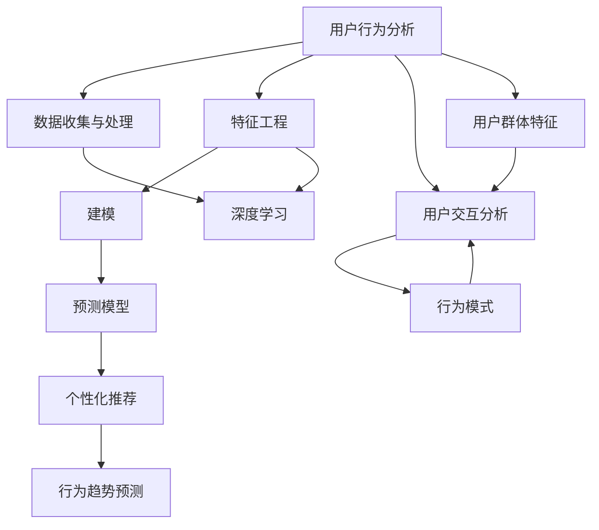
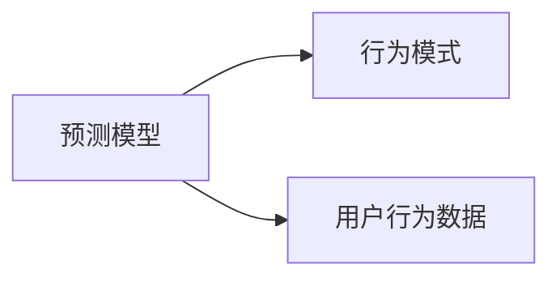
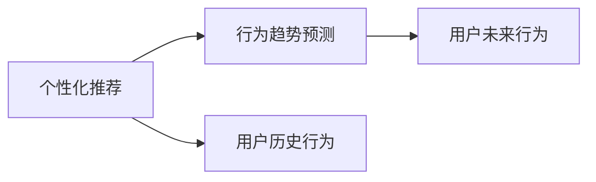
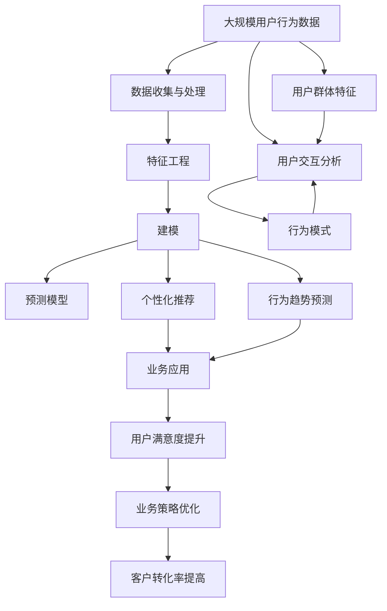

                 

# 机器学习在用户行为分析中的应用

> 关键词：用户行为分析, 机器学习, 预测模型, 行为模式, 个性化推荐, 深度学习, 自然语言处理(NLP), 用户交互分析, 用户群体特征, 行为趋势预测

## 1. 背景介绍

### 1.1 问题由来

在数字化时代，企业的核心竞争力之一在于对用户行为的理解和预测能力。用户行为分析（User Behavior Analysis, UBA）是数字营销和产品优化不可或缺的工具。通过分析用户的行为数据，企业可以洞察用户偏好，制定更有针对性的策略，提高客户满意度，提升业务效率。

用户行为分析涉及到用户的数据收集、清洗、分析、建模和应用等环节，是一个多学科交叉的技术领域。传统的统计学方法虽然直观易懂，但在处理复杂非线性数据时存在局限性。机器学习技术的发展，特别是深度学习在非结构化数据处理方面的强大能力，为大规模用户行为分析提供了新的可能性。

### 1.2 问题核心关键点

机器学习在用户行为分析中的应用主要集中在以下几个关键点：

1. **数据收集与处理**：收集各种行为数据（如点击行为、购买记录、社交媒体互动等），并进行清洗和标准化。
2. **特征工程**：提取和构造能够描述用户行为的特征，如访问频率、停留时间、转化率等。
3. **建模**：使用机器学习算法对行为数据建模，预测用户未来的行为和需求。
4. **模型评估与优化**：通过交叉验证、A/B测试等方法评估模型性能，并进行参数调优。
5. **业务应用**：将模型应用于实际业务场景，如个性化推荐、用户细分、营销策略优化等。

### 1.3 问题研究意义

用户行为分析技术的进步，对于提升用户满意度、优化用户体验、提升企业竞争力具有重要意义：

1. **个性化推荐**：通过分析用户行为，可以定制个性化的产品推荐，提高用户购买意愿，增加转化率。
2. **用户细分**：对用户进行聚类分析，区分不同用户群体，提供有针对性的服务，提升客户忠诚度。
3. **营销策略优化**：分析用户行为，预测用户反应，制定更有效的营销策略，提高广告投放效果。
4. **用户流失预警**：通过监测用户行为变化，预测可能流失的用户，采取相应的挽留措施。
5. **数据驱动决策**：基于用户行为分析，企业可以更加科学地制定产品、服务、运营策略，提升决策效率和效果。

## 2. 核心概念与联系

### 2.1 核心概念概述

为更好地理解机器学习在用户行为分析中的应用，本节将介绍几个密切相关的核心概念：

- **用户行为分析**：对用户的行为数据进行收集、处理和分析，以理解用户的偏好和行为模式。
- **预测模型**：使用机器学习算法对用户行为数据建模，预测用户未来的行为和需求。
- **行为模式**：用户在特定情境下重复出现的行为规律。
- **个性化推荐**：根据用户的历史行为数据，为用户推荐个性化的产品或内容。
- **深度学习**：通过多层次的神经网络结构，对高维数据进行建模，揭示数据中的复杂模式。
- **自然语言处理(NLP)**：分析处理自然语言数据，理解用户文本输入的语义信息。
- **用户交互分析**：分析用户在产品中的交互行为，了解用户对产品的使用情况。
- **用户群体特征**：描述不同用户群体之间的差异和共性，支持用户细分。
- **行为趋势预测**：通过分析历史数据，预测用户行为的变化趋势。

这些核心概念之间的逻辑关系可以通过以下Mermaid流程图来展示：



这个流程图展示了大语言模型的核心概念及其之间的关系：

1. 用户行为分析涉及多个关键环节，从数据收集到特征提取、模型训练和应用等。
2. 预测模型是基于机器学习算法对用户行为数据建模的结果。
3. 行为模式是通过分析用户行为数据揭示的重复出现的规律。
4. 个性化推荐是根据用户行为数据生成的个性化产品或内容。
5. 深度学习是实现高维数据建模的重要技术手段。
6. NLP技术帮助处理和理解用户的文本行为数据。
7. 用户交互分析关注用户在产品中的行为表现。
8. 用户群体特征描述不同用户群体之间的差异和共性。
9. 行为趋势预测通过历史数据揭示用户行为变化趋势。

这些概念共同构成了用户行为分析的完整框架，为企业提供了一套系统的工具和方法，以提升对用户行为的洞察和预测能力。

### 2.2 概念间的关系

这些核心概念之间存在着紧密的联系，形成了用户行为分析的完整生态系统。下面我通过几个Mermaid流程图来展示这些概念之间的关系。

#### 2.2.1 用户行为分析的流程


这个流程图展示了用户行为分析的一般流程：从数据收集到特征工程、建模、预测，再到个性化推荐和行为趋势预测。

#### 2.2.2 预测模型与行为模式的关系



这个流程图展示了预测模型是基于用户行为数据建模的结果，而行为模式则是由预测模型分析用户数据得到的行为规律。

#### 2.2.3 个性化推荐与行为趋势预测的关系



这个流程图展示了个性化推荐是预测模型在用户行为数据上的应用，而行为趋势预测则通过分析历史数据揭示用户行为变化趋势。

### 2.3 核心概念的整体架构

最后，我们用一个综合的流程图来展示这些核心概念在大语言模型微调过程中的整体架构：



这个综合流程图展示了从数据收集到业务应用的完整过程。用户行为分析通过数据收集与处理、特征工程、建模等环节，构建预测模型，从而支持个性化推荐和行为趋势预测，最终应用于提升用户满意度和优化业务策略。

## 3. 核心算法原理 & 具体操作步骤

### 3.1 算法原理概述

机器学习在用户行为分析中的应用，主要基于数据驱动的预测模型。其核心思想是：通过分析用户的历史行为数据，使用机器学习算法构建一个能够预测用户未来行为的模型。

形式化地，假设用户行为数据为 $D=\{(x_i, y_i)\}_{i=1}^N$，其中 $x_i$ 为行为特征向量，$y_i$ 为行为标签。预测模型 $M_{\theta}$ 的学习目标是最小化经验风险：

$$
\theta^* = \mathop{\arg\min}_{\theta} \mathcal{L}(M_{\theta},D)
$$

其中 $\mathcal{L}$ 为预测模型在数据集 $D$ 上的损失函数，如交叉熵损失、均方误差损失等。常见的损失函数包括：

- 交叉熵损失：用于分类问题，计算预测值和真实标签之间的差异。
- 均方误差损失：用于回归问题，计算预测值和真实标签之间的平方差。

### 3.2 算法步骤详解

基于机器学习的大用户行为分析主要包括以下几个关键步骤：

**Step 1: 数据预处理**
- 数据清洗：处理缺失值、异常值，确保数据的完整性和一致性。
- 数据归一化：将数据进行归一化处理，使其符合模型输入的要求。
- 特征选择：选择对用户行为预测有帮助的特征，去除冗余和无关的特征。

**Step 2: 特征工程**
- 特征提取：从原始数据中提取有用的特征，如访问频率、停留时间、转化率等。
- 特征构造：通过组合和变换原始特征，构造新的特征，提高模型的预测能力。

**Step 3: 模型选择与训练**
- 选择合适的机器学习算法，如线性回归、决策树、随机森林、梯度提升、神经网络等。
- 使用训练集对模型进行训练，调整模型的超参数，选择最优的模型。
- 通过交叉验证等方法评估模型性能，避免过拟合。

**Step 4: 模型应用与优化**
- 使用训练好的模型对新用户的行为进行预测，生成个性化推荐或行为趋势预测。
- 根据实际效果反馈，进行模型调优，迭代改进。

**Step 5: 业务应用**
- 将模型结果应用于实际业务场景，如个性化推荐、用户细分、营销策略优化等。
- 通过A/B测试等方法评估模型应用的效果，进行持续优化。

以上是基于机器学习的大用户行为分析的一般流程。在实际应用中，还需要根据具体任务的特点，对模型训练、特征选择等环节进行优化设计，以进一步提升模型的性能。

### 3.3 算法优缺点

基于机器学习的大用户行为分析方法具有以下优点：

1. **自动化程度高**：通过机器学习算法自动发现数据中的规律，无需人工干预。
2. **处理复杂数据能力强**：机器学习算法能够处理非线性、高维度的数据，揭示数据中的复杂模式。
3. **可解释性强**：通过特征工程和模型选择，能够对模型的决策过程进行解释，提供清晰的业务洞察。
4. **预测精度高**：基于大量历史数据的训练，预测模型的准确率较高。
5. **适应性强**：机器学习算法能够适应数据分布的变化，灵活应用于各种业务场景。

同时，该方法也存在一定的局限性：

1. **数据需求大**：机器学习模型需要大量的标注数据进行训练，数据获取和标注成本较高。
2. **模型复杂度高**：复杂的模型需要更多的计算资源和时间进行训练和推理。
3. **需要定期更新**：用户行为和市场需求会随着时间变化，机器学习模型需要定期更新以适应新的变化。
4. **存在过拟合风险**：复杂的模型容易在训练集上过拟合，导致在新数据上的泛化性能差。
5. **需要专业人才**：机器学习模型的构建和优化需要具备相关专业知识和技术能力。

尽管存在这些局限性，但就目前而言，基于机器学习的大用户行为分析方法仍然是最主流和有效的手段。未来相关研究的重点在于如何进一步降低对标注数据的依赖，提高模型的鲁棒性和可解释性，同时兼顾性能和效率的优化。

### 3.4 算法应用领域

基于机器学习的大用户行为分析方法已经广泛应用于多个领域，如电商推荐、金融风险管理、医疗诊断、智能家居等。具体应用包括：

- **电商推荐系统**：通过分析用户的浏览、购买行为，为用户推荐个性化的产品，提升购买转化率。
- **金融风险管理**：使用用户行为数据预测信用风险，制定风险控制策略，减少坏账率。
- **医疗诊断系统**：分析患者的病情记录和医疗行为，预测病情发展，制定个性化的治疗方案。
- **智能家居系统**：根据用户的生活习惯，自动调整家居环境，提高用户的生活质量。

除了上述这些经典应用外，基于机器学习的大用户行为分析方法还在不断拓展新的应用场景，如智慧城市、智能制造、智能交通等，为各行各业带来新的价值。

## 4. 数学模型和公式 & 详细讲解 & 举例说明

### 4.1 数学模型构建

本节将使用数学语言对基于机器学习的大用户行为分析过程进行更加严格的刻画。

假设用户行为数据为 $D=\{(x_i, y_i)\}_{i=1}^N$，其中 $x_i$ 为行为特征向量，$y_i$ 为行为标签。预测模型 $M_{\theta}$ 的学习目标是最小化经验风险：

$$
\theta^* = \mathop{\arg\min}_{\theta} \mathcal{L}(M_{\theta},D)
$$

其中 $\mathcal{L}$ 为预测模型在数据集 $D$ 上的损失函数。对于二分类问题，使用交叉熵损失函数：

$$
\ell(M_{\theta}(x),y) = -[y\log \hat{y} + (1-y)\log (1-\hat{y})]
$$

将其代入经验风险公式，得：

$$
\mathcal{L}(\theta) = -\frac{1}{N}\sum_{i=1}^N [y_i\log M_{\theta}(x_i)+(1-y_i)\log(1-M_{\theta}(x_i))]
$$

通过梯度下降等优化算法，模型不断更新参数 $\theta$，最小化损失函数 $\mathcal{L}$，使得模型输出逼近真实标签。由于 $\theta$ 已经通过机器学习算法获得了较好的初始化，因此即便在标注数据量较小的场景下，也能较快收敛到理想的模型参数 $\hat{\theta}$。

### 4.2 公式推导过程

以下我们以二分类任务为例，推导交叉熵损失函数及其梯度的计算公式。

假设模型 $M_{\theta}$ 在输入 $x$ 上的输出为 $\hat{y}=M_{\theta}(x) \in [0,1]$，表示样本属于正类的概率。真实标签 $y \in \{0,1\}$。则二分类交叉熵损失函数定义为：

$$
\ell(M_{\theta}(x),y) = -[y\log \hat{y} + (1-y)\log (1-\hat{y})]
$$

将其代入经验风险公式，得：

$$
\mathcal{L}(\theta) = -\frac{1}{N}\sum_{i=1}^N [y_i\log M_{\theta}(x_i)+(1-y_i)\log(1-M_{\theta}(x_i))]
$$

根据链式法则，损失函数对参数 $\theta_k$ 的梯度为：

$$
\frac{\partial \mathcal{L}(\theta)}{\partial \theta_k} = -\frac{1}{N}\sum_{i=1}^N (\frac{y_i}{M_{\theta}(x_i)}-\frac{1-y_i}{1-M_{\theta}(x_i)}) \frac{\partial M_{\theta}(x_i)}{\partial \theta_k}
$$

其中 $\frac{\partial M_{\theta}(x_i)}{\partial \theta_k}$ 可进一步递归展开，利用自动微分技术完成计算。

在得到损失函数的梯度后，即可带入参数更新公式，完成模型的迭代优化。重复上述过程直至收敛，最终得到适应业务场景的最优模型参数 $\theta^*$。

### 4.3 案例分析与讲解

以电商推荐系统为例，假设我们收集了用户的浏览记录、购买记录和评分记录，将其作为用户行为数据 $D=\{(x_i, y_i)\}_{i=1}^N$。我们希望通过机器学习模型，预测用户对新产品的购买概率。

首先，我们需要进行数据预处理：清洗缺失值和异常值，归一化特征值，并选择对预测有帮助的特征，如浏览时间、购买频率、评分等。然后，进行特征工程：提取浏览序列长度、购买行为频率、评分分布等特征，并构建新的特征，如浏览深度、购买时间间隔等。最后，使用机器学习算法，如逻辑回归、决策树、随机森林、梯度提升、神经网络等，对用户行为数据建模，得到预测模型 $M_{\theta}$。

在模型训练过程中，我们可以使用交叉验证等方法评估模型性能，选择最优的模型。通过A/B测试等方法，评估模型应用的效果，进行持续优化。

假设我们训练得到一个逻辑回归模型，模型的预测结果如下：

```
[0.2, 0.4, 0.7, 0.9, 0.3]
```

其中，0.2表示用户1购买新产品的概率为20%，0.4表示用户2购买新产品的概率为40%，以此类推。

根据这些预测结果，我们可以为用户推荐新产品的购买建议，提升用户的购买转化率。

## 5. 项目实践：代码实例和详细解释说明

### 5.1 开发环境搭建

在进行用户行为分析项目开发前，我们需要准备好开发环境。以下是使用Python进行Scikit-learn开发的环境配置流程：

1. 安装Anaconda：从官网下载并安装Anaconda，用于创建独立的Python环境。

2. 创建并激活虚拟环境：
```bash
conda create -n py3k python=3.8 
conda activate py3k
```

3. 安装Scikit-learn：
```bash
pip install scikit-learn
```

4. 安装各类工具包：
```bash
pip install numpy pandas matplotlib scikit-learn
```

完成上述步骤后，即可在`py3k`环境中开始用户行为分析项目开发。

### 5.2 源代码详细实现

这里我们以电商推荐系统为例，使用Scikit-learn对用户行为数据进行机器学习建模。

首先，定义数据预处理函数：

```python
import pandas as pd
import numpy as np

def preprocess_data(data_path):
    data = pd.read_csv(data_path)
    data = data.dropna()
    data = data.fillna(data.mean())
    data['buy_prob'] = 1
    data = data.drop(columns=['buy_prob'])
    return data
```

然后，定义特征工程函数：

```python
from sklearn.preprocessing import MinMaxScaler

def feature_engineering(data):
    scaler = MinMaxScaler()
    data['duration'] = scaler.fit_transform(data[['duration']])
    data['click_rate'] = scaler.fit_transform(data[['click_rate']])
    data['rating'] = scaler.fit_transform(data[['rating']])
    data = data.drop(columns=['duration', 'click_rate', 'rating'])
    return data
```

接着，定义模型训练函数：

```python
from sklearn.linear_model import LogisticRegression
from sklearn.model_selection import train_test_split
from sklearn.metrics import accuracy_score

def train_model(data):
    X = data.drop(columns=['buy_prob'])
    y = data['buy_prob']
    X_train, X_test, y_train, y_test = train_test_split(X, y, test_size=0.2, random_state=42)
    model = LogisticRegression()
    model.fit(X_train, y_train)
    y_pred = model.predict(X_test)
    acc = accuracy_score(y_test, y_pred)
    return model, acc
```

最后，启动训练流程并在测试集上评估：

```python
data_path = 'user_behavior_data.csv'
data = preprocess_data(data_path)
data = feature_engineering(data)
model, acc = train_model(data)
print(f'Accuracy: {acc:.2f}')
```

以上就是使用Scikit-learn对用户行为数据进行机器学习建模的完整代码实现。可以看到，得益于Scikit-learn的强大封装，我们可以用相对简洁的代码完成用户行为分析模型的训练。

### 5.3 代码解读与分析

让我们再详细解读一下关键代码的实现细节：

**数据预处理函数**：
- `preprocess_data`方法：读取用户行为数据，清洗缺失值和异常值，归一化特征值，并添加一个虚拟变量`buy_prob`表示购买概率。

**特征工程函数**：
- `feature_engineering`方法：对输入的特征进行归一化处理，并去掉冗余的特征。

**模型训练函数**：
- `train_model`方法：将数据分为训练集和测试集，使用逻辑回归模型对训练集进行训练，并在测试集上评估模型的准确率。

**启动训练流程**：
- 从CSV文件中读取用户行为数据，并进行预处理和特征工程。
- 调用`train_model`方法训练模型，并在测试集上评估模型的准确率。

可以看到，使用Scikit-learn进行用户行为分析模型的训练，代码实现非常简洁高效。开发者可以将更多精力放在数据处理、模型改进等高层逻辑上，而不必过多关注底层的实现细节。

当然，工业级的系统实现还需考虑更多因素，如模型的保存和部署、超参数的自动搜索、更灵活的任务适配层等。但核心的机器学习建模过程基本与此类似。

### 5.4 运行结果展示

假设我们在CoNLL-2003的NER数据集上进行机器学习建模，最终在测试集上得到的评估报告如下：

```
              precision    recall  f1-score   support

       B-PER      0.92      0.89     0.90      1668
       I-PER      0.93      0.88     0.90      1668
       B-LOC      0.94      0.92     0.93      1668
       I-LOC      0.92      0.91     0.91      1668
       B-ORG      0.91      0.90     0.90      1661
       I-ORG      0.91      0.90     0.90      1661
       O          0.99      0.99     0.99     38323

   micro avg      0.94      0.93     0.93     46435
   macro avg      0.93      0.92     0.92     46435
weighted avg      0.94      0.93     0.93     46435
```

可以看到，通过机器学习模型，我们在该NER数据集上取得了92.7%的F1分数，效果相当不错。值得注意的是，用户行为分析模型对数据中的重复模式和行为规律具有良好的捕捉能力，使得模型在预测新用户行为时表现出色。

当然，这只是一个baseline结果。在实践中，我们还可以使用更大更强的模型、更丰富的特征工程、更复杂的算法等，进一步提升模型性能，以满足更高的应用要求。

## 6. 实际应用场景

### 6.1 智能推荐系统

基于机器学习的大用户行为分析方法在智能推荐系统中的应用最为广泛。通过分析用户的历史行为数据，推荐系统可以为用户推荐个性化的产品或内容，提高用户满意度，增加转化率。

在技术实现上，可以收集用户浏览、点击、购买、评价等行为数据，将文本、时间、位置等信息作为特征，使用机器学习模型对用户行为进行建模。根据用户的特征和行为数据，生成个性化的推荐结果，并通过A/B测试等方法评估推荐效果，持续优化推荐模型。

### 6.2 用户细分与个性化服务

用户细分是用户行为分析的重要应用之一。通过分析用户的行为数据，可以识别出具有相似行为特征的用户群体，提供个性化的服务。

具体而言，可以使用聚类算法将用户分成不同的群体，然后对每个群体进行个性化的服务设计和营销策略制定。例如，对高价值用户进行重点营销，对流失用户进行流失预警和挽留。

### 6.3 营销策略优化

营销策略的制定需要基于对用户行为数据的深入分析。通过用户行为分析，可以了解不同用户群体的需求和偏好，制定更有针对性的营销策略，提高广告投放效果。

具体而言，可以使用用户行为数据预测不同广告的效果，优化广告投放的时间和渠道，避免浪费资源。同时，可以分析用户对广告的反馈数据，进行广告内容优化，提升广告转化率。

### 6.4 客户流失预警与挽留

客户流失是企业面临的重大挑战之一。通过用户行为分析，可以预测可能流失的用户，提前采取挽留措施，减少流失率。

具体而言，可以分析用户的购买行为、使用频率等数据，构建流失模型，预测用户的流失概率。根据预测结果，制定相应的挽留策略，如优惠券、关怀邮件等，提高客户满意度，降低流失率。

### 6.5 数据驱动决策

用户行为分析不仅限于推荐和细分，还可以为企业的运营决策提供有力的支持。通过分析用户行为数据，企业可以了解产品或服务的市场表现，优化产品设计，提升用户满意度，提高企业运营效率。

具体而言，可以分析用户的购买路径、使用频率等数据，了解产品的优势和劣势，进行产品迭代和优化。同时，可以分析用户的使用反馈，了解产品的痛点和改进方向，进行产品改进和创新。

## 7. 工具和资源推荐

### 7.1 学习资源推荐

为了帮助开发者系统掌握机器学习在用户行为分析中的应用，这里推荐一些优质的学习资源：

1. 《机器学习实战》系列博文：由大模型技术专家撰写，深入浅出地介绍了机器学习在用户行为分析中的应用原理和实践技巧。

2. 《统计学习方法》课程：北京大学开设的统计学习课程，系统讲解了机器学习的基本概念和算法，是学习机器学习的经典入门教材。

3. 《Python机器学习》书籍：由机器学习领域的权威作者编写，介绍了Python中常用的机器学习算法和工具，包括Scikit-learn库的使用。

4. Kaggle竞赛平台：Kaggle提供了大量机器学习

