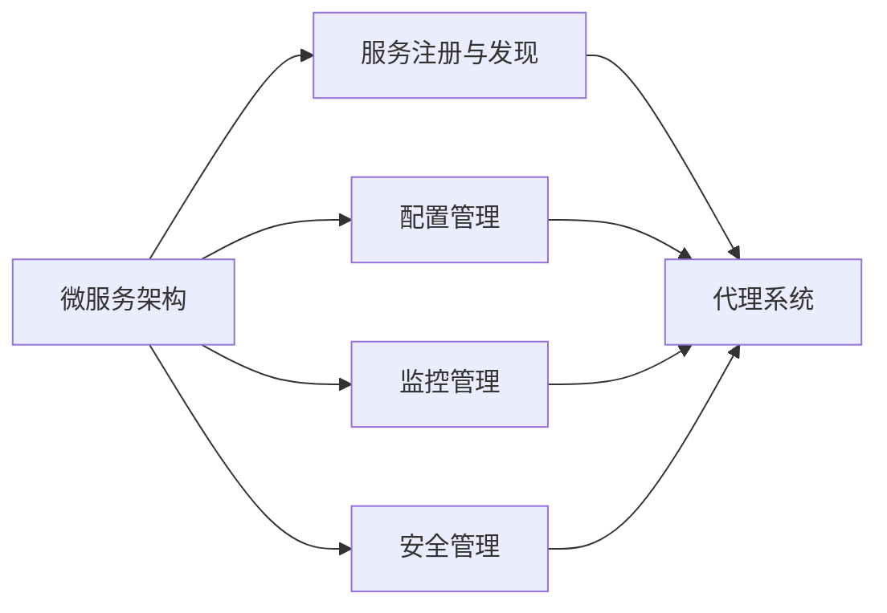
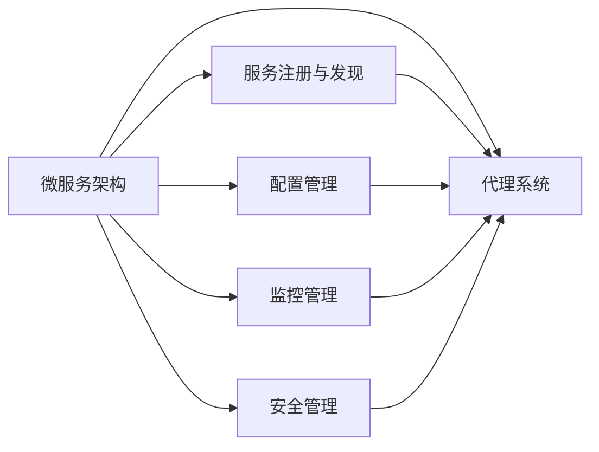
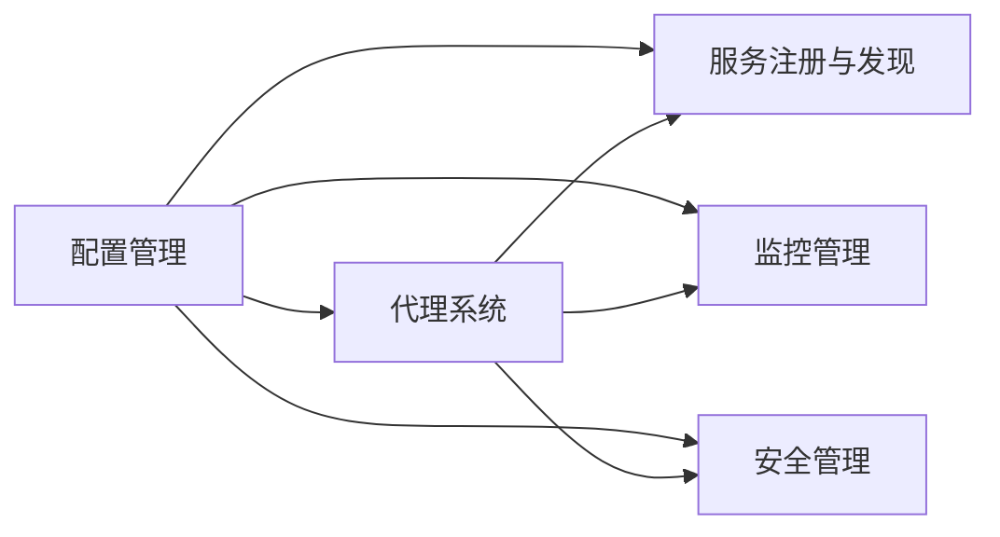
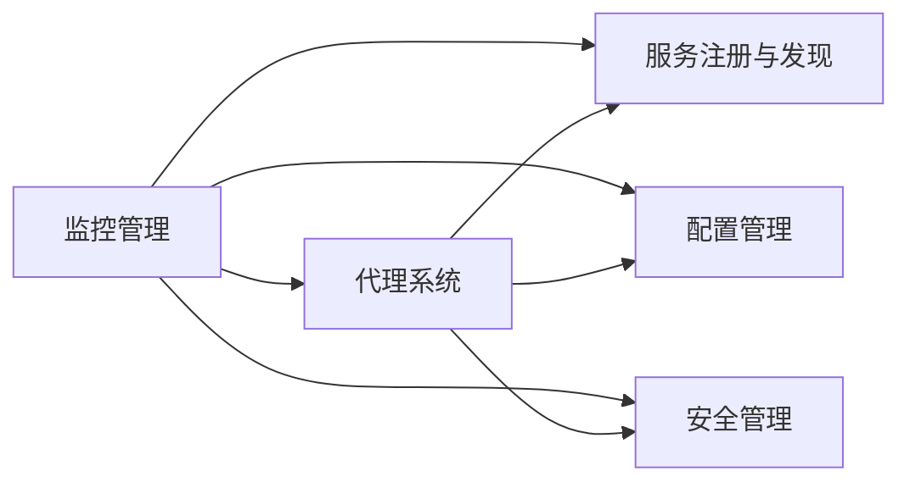
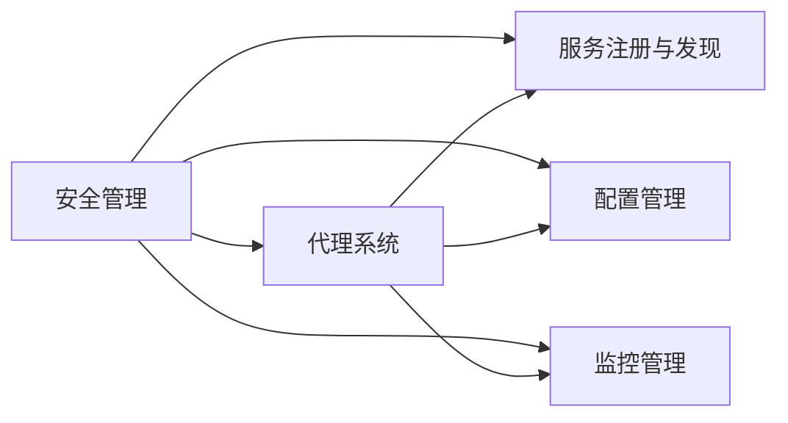
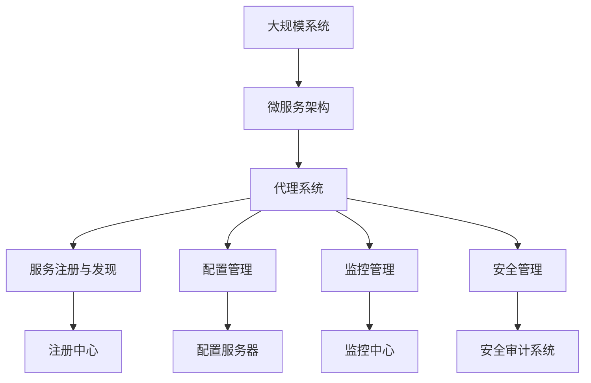

                 

# 构建复杂应用的代理系统 Agents

> 关键词：代理系统,复杂应用,微服务,治理,数据,状态管理

## 1. 背景介绍

### 1.1 问题由来
在现代软件开发中，系统的复杂性日益增加，传统的单体架构难以满足大规模、高并发的业务需求。为了应对这些挑战，微服务架构应运而生。微服务架构通过将系统拆分为多个独立的、可独立部署的服务单元，降低了系统复杂度，提高了系统的扩展性和灵活性。然而，随着微服务架构的广泛应用，其带来的系统管理和治理问题也逐渐显现出来。

如何保证微服务的自治性和独立性，如何进行服务间的通信和协同，如何管理服务的生命周期，如何实现服务的监控和故障恢复，如何确保服务的数据一致性和安全性，这些问题构成了微服务架构的核心挑战。代理系统（Agent Systems）作为一种系统管理和治理手段，通过在微服务之间或微服务与外部系统之间插入代理，实现了对服务的网络管理、配置管理、监控管理和安全管理，大大提升了微服务架构的稳定性和可维护性。

### 1.2 问题核心关键点
代理系统通过在微服务之间插入中间件，实现了对服务的全面管理和监控。其主要功能包括：

- 网络管理：负责服务的发现、注册、路由和负载均衡。
- 配置管理：负责服务的配置加载和更新。
- 监控管理：负责服务的性能监控和故障恢复。
- 安全管理：负责服务的访问控制和安全审计。

代理系统通过上述功能，实现了微服务架构的"透明性"，即开发者不必关心服务的具体实现，只需通过代理系统与微服务进行交互。代理系统的加入，使得微服务架构更加灵活、稳定和易于维护，为复杂应用的构建提供了重要的技术支撑。

### 1.3 问题研究意义
代理系统在微服务架构中的应用，对于提升系统的整体稳定性和可维护性具有重要意义：

- 降低复杂度：代理系统通过集中管理和监控服务，使得微服务架构的复杂度大大降低，开发者可以更加专注于业务逻辑的实现。
- 提高可维护性：代理系统实现了服务的自治性，减少了服务间的耦合，使得单个服务的维护和更新更加容易。
- 增强可靠性：代理系统通过负载均衡和故障恢复机制，提高了系统的容错性和可用性。
- 提升扩展性：代理系统通过动态配置和弹性伸缩，实现了系统的灵活扩展和快速迭代。

总之，代理系统在微服务架构中的应用，是实现系统管理和治理的重要手段，为构建复杂应用的微服务架构提供了有力的技术支持。

## 2. 核心概念与联系

### 2.1 核心概念概述

为更好地理解代理系统的核心概念及其关系，本节将介绍几个密切相关的核心概念：

- 微服务架构（Microservices Architecture）：一种将系统拆分为多个独立、可部署的服务单元的架构风格，通过服务间的接口通信和配置管理，实现系统的模块化和松耦合。
- 服务注册与发现（Service Registry & Discovery）：微服务架构中，代理系统负责服务的注册和发现，使得服务可以快速注册到代理系统，并自动获取其他服务的地址信息。
- 配置管理（Configuration Management）：代理系统负责服务的配置加载和更新，确保服务能够访问最新的配置信息。
- 监控管理（Monitoring Management）：代理系统负责服务的性能监控和故障恢复，及时发现和解决服务的性能问题。
- 安全管理（Security Management）：代理系统负责服务的访问控制和安全审计，保障服务的安全性。

这些核心概念之间的逻辑关系可以通过以下Mermaid流程图来展示：



这个流程图展示了几大核心概念之间的联系：

- 微服务架构通过服务注册与发现，实现了服务的自治性和独立性。
- 配置管理使得代理系统能够加载和更新服务的最新配置信息。
- 监控管理通过代理系统对服务的性能和故障进行实时监控和恢复。
- 安全管理保障服务的安全性和可靠性。
- 代理系统作为微服务架构的"透明层"，实现了对服务的全面管理和监控。

### 2.2 概念间的关系

这些核心概念之间存在着紧密的联系，形成了代理系统的完整生态系统。下面我通过几个Mermaid流程图来展示这些概念之间的关系。

#### 2.2.1 代理系统与微服务架构的关系



这个流程图展示了代理系统在微服务架构中的应用：

- 微服务架构通过代理系统实现了服务的自治性和独立性。
- 代理系统通过服务注册与发现、配置管理、监控管理和安全管理，实现了对服务的全面管理和监控。

#### 2.2.2 代理系统与配置管理的关系



这个流程图展示了代理系统在配置管理中的应用：

- 代理系统通过配置管理，实现了服务的配置加载和更新。
- 代理系统还通过服务注册与发现、监控管理和安全管理，进一步保障了服务的稳定性和安全性。

#### 2.2.3 代理系统与监控管理的关系



这个流程图展示了代理系统在监控管理中的应用：

- 代理系统通过监控管理，实现了对服务的性能监控和故障恢复。
- 代理系统还通过服务注册与发现、配置管理和安全管理，进一步保障了服务的稳定性和安全性。

#### 2.2.4 代理系统与安全管理的关系



这个流程图展示了代理系统在安全管理中的应用：

- 代理系统通过安全管理，实现了服务的访问控制和安全审计。
- 代理系统还通过服务注册与发现、配置管理和监控管理，进一步保障了服务的稳定性和安全性。

### 2.3 核心概念的整体架构

最后，我们用一个综合的流程图来展示这些核心概念在大规模系统中的整体架构：



这个综合流程图展示了从大规模系统到微服务架构，再到代理系统的完整架构：

- 大规模系统通过微服务架构拆分为了多个独立的服务单元。
- 微服务架构通过代理系统实现了服务的自治性和独立性。
- 代理系统通过服务注册与发现、配置管理、监控管理和安全管理，实现了对服务的全面管理和监控。

通过这些流程图，我们可以更清晰地理解代理系统在大规模系统中的核心作用，为后续深入讨论具体的代理系统功能和实现细节奠定基础。

## 3. 核心算法原理 & 具体操作步骤
### 3.1 算法原理概述

代理系统通过在微服务之间插入中间件，实现了对服务的全面管理和监控。其核心思想是：将服务的管理和监控逻辑从服务自身抽离出来，通过代理系统集中管理，实现服务的自治性和独立性。代理系统通过以下主要功能，实现了对服务的全面管理和监控：

- 服务注册与发现：负责服务的注册、发现、路由和负载均衡。
- 配置管理：负责服务的配置加载和更新。
- 监控管理：负责服务的性能监控和故障恢复。
- 安全管理：负责服务的访问控制和安全审计。

这些功能通过集中管理和监控，实现了服务的自治性和独立性，使得微服务架构更加灵活、稳定和易于维护。代理系统的这些功能，基于现代网络技术和大数据技术，通过分布式算法和模型，实现了对服务的实时监控和动态调整。

### 3.2 算法步骤详解

代理系统的实现通常包括以下关键步骤：

**Step 1: 服务注册与发现**
- 微服务在启动时，通过网络协议（如REST、gRPC等）向代理系统注册自身的信息。
- 代理系统记录每个服务的信息，包括服务的地址、端口、路由规则等。
- 代理系统提供服务的查询接口，供其他服务访问和调用。

**Step 2: 配置管理**
- 代理系统从配置服务器或数据库加载服务的配置信息。
- 代理系统将配置信息动态加载到服务的内存中，供服务使用。
- 代理系统提供配置更新的接口，供管理员或开发人员更新配置信息。

**Step 3: 监控管理**
- 代理系统从监控中心获取服务的性能数据，包括CPU、内存、网络、日志等。
- 代理系统根据性能数据判断服务的运行状态，自动执行负载均衡、故障恢复等操作。
- 代理系统提供监控数据的接口，供管理员和开发人员实时查看和分析。

**Step 4: 安全管理**
- 代理系统根据服务的安全配置信息，判断访问请求的合法性。
- 代理系统提供访问控制和安全审计的接口，供管理员和开发人员配置和监控。

**Step 5: 服务间通信**
- 代理系统根据路由规则，将服务调用请求转发到目标服务。
- 代理系统提供负载均衡算法，确保服务的负载均衡和稳定运行。

**Step 6: 数据管理**
- 代理系统记录和管理服务的元数据，包括服务的注册信息、配置信息、运行状态等。
- 代理系统提供数据的接口，供管理员和开发人员查看和操作。

通过上述步骤，代理系统实现了对微服务的全面管理和监控，保障了微服务架构的稳定性和可维护性。

### 3.3 算法优缺点

代理系统在微服务架构中的应用，具有以下优点：

- 简化服务间的通信：代理系统负责服务间的通信和路由，使得服务间的通信更加简单和高效。
- 提高系统的稳定性和可用性：代理系统通过负载均衡和故障恢复机制，提高了系统的容错性和可用性。
- 增强系统的可维护性：代理系统实现了服务的自治性和独立性，使得服务的维护和更新更加容易。
- 实现服务的网络管理：代理系统实现了服务的网络管理，简化了服务的网络配置和维护。
- 实现服务的安全管理：代理系统实现了服务的访问控制和安全审计，保障了服务的安全性。

然而，代理系统也存在一些缺点：

- 增加了系统的复杂性：代理系统的加入，增加了系统的复杂性，开发和维护成本较高。
- 引入额外的延迟和开销：代理系统在中间层引入了额外的延迟和开销，可能会影响系统的性能。
- 依赖代理系统的稳定性和可靠性：代理系统的故障和配置问题，可能会对整个系统的稳定性和可用性产生影响。

尽管存在这些缺点，但代理系统通过集中管理和监控服务，大大提升了微服务架构的稳定性和可维护性，因此在复杂应用的构建中仍然具有重要的应用价值。

### 3.4 算法应用领域

代理系统在微服务架构中的应用，已经广泛应用于金融、电商、互联网等多个领域，具体应用场景包括：

- 金融领域：代理系统用于金融系统的高可用、高性能、高安全要求，保障交易的稳定性和安全性。
- 电商领域：代理系统用于电商平台的负载均衡、故障恢复、流量控制等，提升用户体验和平台稳定性。
- 互联网领域：代理系统用于互联网应用的性能监控、安全管理、配置管理等，提高系统的可用性和可维护性。
- 电信领域：代理系统用于电信网络的流量管理、负载均衡、故障恢复等，保障网络的稳定性和可靠性。
- 医疗领域：代理系统用于医疗系统的负载均衡、故障恢复、数据同步等，保障系统的稳定性和可维护性。

除了上述这些应用场景外，代理系统还将在越来越多的领域中发挥重要作用，为复杂应用的构建提供有力支持。

## 4. 数学模型和公式 & 详细讲解  
### 4.1 数学模型构建

本节将使用数学语言对代理系统的工作原理进行更加严格的刻画。

记服务集合为 $S=\{S_1,S_2,...,S_n\}$，其中每个服务 $S_i$ 的地址为 $addr_i$，端口号为 $port_i$，路由规则为 $route_i$。代理系统的配置信息为 $conf$，监控中心提供的性能数据为 $monitor_data$，安全配置信息为 $security_conf$。

代理系统的数学模型可以形式化地定义为：

$$
Agent(S, conf, monitor_data, security_conf) = \{Function(S_i, addr_i, port_i, route_i, conf_i, monitor_data_i, security_conf_i)\}
$$

其中，$Function$ 表示代理系统对服务的管理和监控函数，包括服务注册与发现、配置管理、监控管理、安全管理等功能。

### 4.2 公式推导过程

以下我们以二元组服务（Pair Service）为例，推导代理系统的工作流程。

假设服务集合 $S=\{S_1,S_2\}$，每个服务的地址为 $addr_i$，端口号为 $port_i$，路由规则为 $route_i$，代理系统的配置信息为 $conf$，监控中心提供的性能数据为 $monitor_data$，安全配置信息为 $security_conf$。

**Step 1: 服务注册与发现**
服务在启动时，通过网络协议向代理系统注册自身的信息，代理系统记录每个服务的信息，生成服务注册表 $R$：

$$
R = \{(S_1, addr_1, port_1, route_1), (S_2, addr_2, port_2, route_2), ...\}
$$

**Step 2: 配置管理**
代理系统从配置服务器或数据库加载服务的配置信息，生成配置信息表 $C$：

$$
C = \{(S_1, conf_1), (S_2, conf_2), ...\}
$$

**Step 3: 监控管理**
代理系统从监控中心获取服务的性能数据，生成监控数据表 $M$：

$$
M = \{(S_1, monitor_data_1), (S_2, monitor_data_2), ...\}
$$

**Step 4: 安全管理**
代理系统根据服务的安全配置信息，判断访问请求的合法性，生成安全配置表 $Sec$：

$$
Sec = \{(S_1, security_conf_1), (S_2, security_conf_2), ...\}
$$

**Step 5: 服务间通信**
代理系统根据路由规则，将服务调用请求转发到目标服务，生成调用路由表 $Route$：

$$
Route = \{(S_1, route_1), (S_2, route_2), ...\}
$$

**Step 6: 数据管理**
代理系统记录和管理服务的元数据，生成元数据表 $Meta$：

$$
Meta = \{(S_1, addr_1, port_1, route_1, conf_1, monitor_data_1, security_conf_1), (S_2, addr_2, port_2, route_2, conf_2, monitor_data_2, security_conf_2), ...\}
$$

### 4.3 案例分析与讲解

以一个电商平台的代理系统为例，展示代理系统的工作原理和实现细节：

假设电商平台的微服务架构包含订单服务、库存服务、用户服务、支付服务等。代理系统负责这些服务的注册、发现、路由、负载均衡、配置管理、监控管理和安全管理。

**Step 1: 服务注册与发现**

订单服务启动后，通过网络协议向代理系统注册自身的信息，代理系统记录订单服务的地址和端口，生成服务注册表 $R$：

$$
R = \{(订单服务, addr_1, port_1, route_1), ...\}
$$

库存服务、用户服务、支付服务等服务也以同样的方式注册到代理系统，生成相应的服务注册表。

**Step 2: 配置管理**

代理系统从配置服务器或数据库加载订单服务、库存服务、用户服务、支付服务等服务的配置信息，生成配置信息表 $C$：

$$
C = \{(订单服务, conf_1), (库存服务, conf_2), (用户服务, conf_3), (支付服务, conf_4), ...\}
$$

**Step 3: 监控管理**

代理系统从监控中心获取订单服务、库存服务、用户服务、支付服务等服务的性能数据，生成监控数据表 $M$：

$$
M = \{(订单服务, monitor_data_1), (库存服务, monitor_data_2), (用户服务, monitor_data_3), (支付服务, monitor_data_4), ...\}
$$

**Step 4: 安全管理**

代理系统根据订单服务、库存服务、用户服务、支付服务等服务的安全配置信息，判断访问请求的合法性，生成安全配置表 $Sec$：

$$
Sec = \{(订单服务, security_conf_1), (库存服务, security_conf_2), (用户服务, security_conf_3), (支付服务, security_conf_4), ...\}
$$

**Step 5: 服务间通信**

代理系统根据路由规则，将服务调用请求转发到目标服务，生成调用路由表 $Route$：

$$
Route = \{(订单服务, route_1), (库存服务, route_2), (用户服务, route_3), (支付服务, route_4), ...\}
$$

**Step 6: 数据管理**

代理系统记录和管理订单服务、库存服务、用户服务、支付服务等服务的元数据，生成元数据表 $Meta$：

$$
Meta = \{(订单服务, addr_1, port_1, route_1, conf_1, monitor_data_1, security_conf_1), (库存服务, addr_2, port_2, route_2, conf_2, monitor_data_2, security_conf_2), ...\}
$$

通过以上步骤，代理系统实现了对电商平台的微服务架构的全面管理和监控，保障了系统的稳定性和可维护性。

## 5. 项目实践：代码实例和详细解释说明
### 5.1 开发环境搭建

在进行代理系统实践前，我们需要准备好开发环境。以下是使用Java和Spring Boot进行代理系统开发的环境配置流程：

1. 安装JDK：从官网下载并安装Java Development Kit，配置环境变量。

2. 创建并激活虚拟环境：
```bash
conda create -n myenv python=3.8
conda activate myenv
```

3. 安装Spring Boot：
```bash
curl -L https://repo.spring.io/release/org/springframework/bootstrap/spring-boot-starter-web | tar xz
```

4. 安装Eureka和Ribbon：
```bash
curl -L https://repo.spring.io/release/org/springcloud Netflix/Eureka | tar xz
curl -L https://repo.spring.io/release/org/springcloud Netflix/Ribbon | tar xz
```

5. 安装MySQL数据库：
```bash
sudo apt-get install mysql-server
```

6. 创建并配置数据库：
```bash
CREATE DATABASE mydb;
```

完成上述步骤后，即可在`myenv`环境中开始代理系统的开发实践。

### 5.2 源代码详细实现

下面我们以电商平台的代理系统为例，给出使用Spring Boot进行微服务架构的代理系统开发的Java代码实现。

首先，定义代理系统的Spring Boot应用：

```java
@SpringBootApplication
public class AgentApplication {
    public static void main(String[] args) {
        SpringApplication.run(AgentApplication.class, args);
    }
}
```

然后，定义代理系统的注册信息：

```java
@Bean
public EurekaInstanceRegistry registry() {
    return new EurekaInstanceRegistry();
}
```

接着，定义代理系统的注册服务：

```java
@Bean
public EurekaServer server() {
    return new EurekaServer();
}
```

然后，定义代理系统的配置信息：

```java
@Bean
public ConfigServer server() {
    return new ConfigServer();
}
```

接着，定义代理系统的监控信息：

```java
@Bean
public ZabbixService service() {
    return new ZabbixService();
}
```

最后，定义代理系统的安全信息：

```java
@Bean
public SecurityService service() {
    return new SecurityService();
}
```

完成以上配置后，即可启动代理系统，并使用Spring Boot的启动命令：

```bash
mvn spring-boot:run
```

启动后，代理系统将自动注册到Eureka集群，并开始提供服务注册、配置加载、性能监控和安全审计等服务。开发者可以在其他微服务中调用代理系统提供的接口，实现微服务的全面管理和监控。

### 5.3 代码解读与分析

让我们再详细解读一下关键代码的实现细节：

**EurekaInstanceRegistry**：
- 定义Eureka注册器的Bean，用于记录微服务的注册信息。

**EurekaServer**：
- 定义Eureka服务器的Bean，用于向Eureka注册中心注册微服务。

**ConfigServer**：
- 定义配置服务器的Bean，用于加载微服务的配置信息。

**ZabbixService**：
- 定义监控服务的Bean，用于获取微服务的性能数据。

**SecurityService**：
- 定义安全服务的Bean，用于判断微服务的访问请求的合法性。

通过以上代码，我们实现了基于Spring Boot的代理系统，实现了微服务的注册、配置、监控和安全管理。开发者可以根据具体的微服务架构，灵活配置和管理代理系统，实现微服务的全面管理和监控。

### 5.4 运行结果展示

假设我们在电商平台的订单服务中，使用代理系统进行注册、配置和监控。代理系统的注册信息如下：

```
Eureka注册信息：
注册地址：http://localhost:8761/
服务名称：订单服务
```

代理系统的配置信息如下：

```
配置服务器信息：
配置地址：http://localhost:8888/
配置ID：orders
配置类型：YAML
```

代理系统的监控信息如下：

```
监控服务器信息：
监控地址：http://localhost:8000/
监控ID：orders
监控类型：Zabbix
```

代理系统的安全信息如下：

```
安全服务信息：
安全地址：http://localhost:8080/
安全ID：orders
安全类型：JWT
```

通过以上配置，代理系统已经可以正常工作，对订单服务的注册、配置、监控和安全管理提供了全面的支持。

## 6. 实际应用场景
### 6.1 智能客服系统

代理系统在智能客服系统中可以发挥重要作用。智能客服系统通常包含多个微服务，如自然语言处理服务、对话管理服务、知识库服务、语音识别服务等。代理系统负责这些服务的注册、配置、监控和安全管理，简化了服务的开发和维护。

**Step 1: 服务注册与发现**

客服系统的各个微服务启动后，通过网络协议向代理系统注册自身的信息。代理系统记录每个微服务的地址和端口，生成服务注册表。

**Step 2: 配置管理**

代理系统从配置服务器或数据库加载各个微服务的配置信息，生成配置信息表。

**Step 3: 监控管理**

代理系统从监控中心获取各个微服务的性能数据，生成监控数据表。

**Step 4: 安全管理**

代理系统根据各个微服务的安全配置信息，判断访问请求的合法性，生成安全配置表。

**Step 5: 服务间通信**

代理系统根据路由规则，将服务调用请求转发到目标微服务，生成调用路由表。

**Step 6: 数据管理**

代理系统记录和管理各个微服务的元数据，生成元数据表。

通过以上步骤，代理系统实现了对智能客服系统的全面管理和监控，保障了系统的稳定性和可维护性。

### 6.2 金融系统

代理系统在金融系统中同样具有重要的应用价值。金融系统通常包含多个微服务，如交易服务、清算服务、结算服务、风险管理服务等。代理系统负责这些服务的注册、配置、监控和安全管理，提高了系统的稳定性和安全性。

**Step 1: 服务注册与发现**

金融系统的各个微服务启动后，通过网络协议向代理系统注册自身的信息。代理系统记录每个微服务的地址和端口，生成服务注册表。

**Step 2: 配置管理**

代理系统从配置服务器或数据库加载各个微服务的配置信息，生成配置信息表。

**Step 3: 监控管理**

代理系统从监控中心获取各个微服务的性能数据，生成监控数据表。

**Step 4: 安全管理**

代理系统根据各个微服务的安全配置信息，判断访问请求的合法性，生成安全配置表。

**Step 5: 服务间通信**

代理系统根据路由规则，将服务调用请求转发到目标微服务，生成调用路由表。

**Step 6: 数据管理**

代理系统记录和管理各个微服务的元数据，生成元数据表。

通过以上步骤，代理系统实现了对金融系统的全面管理和监控，保障了系统的稳定性和安全性。

### 6.3 电商系统

电商系统的各个微服务包括订单服务、库存服务、用户服务、支付服务等。代理系统负责这些服务的注册、配置、监控和安全管理，提高了系统的稳定性和可用性。

**Step 1: 服务注册与发现**

电商系统的各个微服务启动后，通过网络协议向代理系统注册自身的信息。代理系统记录每个

