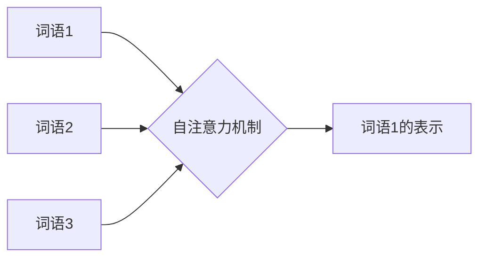
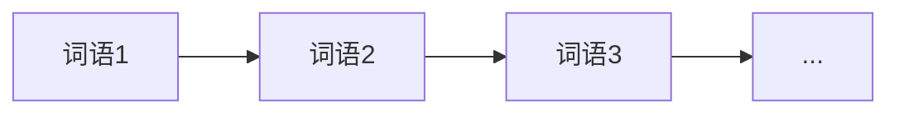

# 大语言模型原理基础与前沿 环境影响

## 1. 背景介绍

### 1.1 问题的由来

近年来，随着人工智能技术的飞速发展，自然语言处理（NLP）领域取得了突破性进展，其中最引人注目的便是大语言模型（LLM）的出现。从早期的统计语言模型到如今基于深度学习的 Transformer 模型，LLM 在理解和生成人类语言方面展现出惊人的能力，并在机器翻译、文本摘要、对话系统等领域取得了显著成果。然而，LLM 的训练和应用也带来了巨大的能源消耗和环境负担，引发了人们对其可持续发展的担忧。

### 1.2 研究现状

目前，LLM 的研究主要集中在以下几个方面：

* **模型架构**: 研究者们不断探索更高效、更强大的模型架构，例如 GPT-3、BERT、XLNet 等。
* **训练算法**: 为了提升模型的训练效率和性能，研究者们提出了各种优化算法，例如 Adam、SGD 等。
* **应用场景**: LLM 被广泛应用于各种 NLP 任务，例如机器翻译、文本摘要、问答系统、对话系统等。
* **环境影响**:  随着 LLM 模型规模的不断增大，其训练和应用所消耗的能源也急剧增加，研究者们开始关注 LLM 的环境影响，并探索更加环保的训练和应用方式。

### 1.3 研究意义

研究 LLM 的原理、应用和环境影响具有重要的现实意义：

* **推动人工智能技术发展**: LLM 是人工智能领域的重要突破，对其进行深入研究有助于推动人工智能技术的进一步发展。
* **促进 NLP 应用落地**: LLM 在 NLP 领域具有广泛的应用前景，对其进行研究有助于促进 NLP 技术在各个领域的应用落地。
* **实现人工智能可持续发展**: 研究 LLM 的环境影响有助于我们探索更加环保的训练和应用方式，实现人工智能的可持续发展。

### 1.4 本文结构

本文将从以下几个方面对 LLM 进行介绍：

* **核心概念与联系**: 介绍 LLM 的基本概念、发展历程以及与其他 NLP 技术的联系。
* **核心算法原理 & 具体操作步骤**:  详细介绍 LLM 的核心算法原理，包括 Transformer 模型、自回归语言模型等，并结合具体案例讲解 LLM 的训练和应用流程。
* **数学模型和公式 & 详细讲解 & 举例说明**:  介绍 LLM 中常用的数学模型和公式，例如 Softmax 函数、交叉熵损失函数等，并结合具体案例进行详细讲解。
* **项目实践：代码实例和详细解释说明**:  提供 LLM 的代码实例，并对代码进行详细解读，帮助读者更好地理解 LLM 的实现细节。
* **实际应用场景**:  介绍 LLM 在各个领域的实际应用场景，例如机器翻译、文本摘要、对话系统等。
* **工具和资源推荐**:  推荐一些学习 LLM 的书籍、论文、网站等资源。
* **总结：未来发展趋势与挑战**:  总结 LLM 的研究现状、发展趋势以及面临的挑战。

## 2. 核心概念与联系

### 2.1 自然语言处理

自然语言处理（Natural Language Processing，NLP）是人工智能和语言学领域的一个分支学科，旨在让计算机能够理解、处理和生成人类语言。NLP 的研究内容包括：

* **自然语言理解**:  让计算机能够理解人类语言的含义，例如词义消歧、句法分析、语义角色标注等。
* **自然语言生成**:  让计算机能够生成自然流畅的人类语言，例如机器翻译、文本摘要、对话系统等。

### 2.2 语言模型

语言模型（Language Model，LM）是 NLP 领域的一个重要概念，用于计算一个句子出现的概率。语言模型可以用于：

* **语音识别**:  将语音信号转换为文本时，可以使用语言模型来判断哪个词序列的概率更高。
* **机器翻译**:  将一种语言翻译成另一种语言时，可以使用语言模型来判断哪个翻译结果更符合语法和语义。
* **文本生成**:  生成文本时，可以使用语言模型来判断哪个词序列更自然流畅。

### 2.3 大语言模型

大语言模型（Large Language Model，LLM）是指参数量巨大的语言模型，通常包含数十亿甚至数万亿个参数。LLM 通常使用深度学习技术进行训练，并在海量文本数据上进行预训练。

### 2.4  LLM 与其他 NLP 技术的联系

LLM 与其他 NLP 技术密切相关，例如：

* **词嵌入**:  词嵌入是将词语映射到向量空间的技术，可以用于表示词语的语义信息。LLM 通常使用词嵌入来表示词语。
* **循环神经网络**:  循环神经网络（Recurrent Neural Network，RNN）是一种能够处理序列数据的神经网络，可以用于处理文本数据。
* **Transformer 模型**:  Transformer 模型是一种基于自注意力机制的神经网络，在 NLP 任务中取得了显著成果，是目前 LLM 的主流架构。

## 3. 核心算法原理 & 具体操作步骤

### 3.1 算法原理概述

#### 3.1.1 Transformer 模型

Transformer 模型是 LLM 的主流架构，其核心是自注意力机制（Self-Attention Mechanism）。自注意力机制可以让模型在处理一个词语时，关注句子中其他词语的信息，从而更好地理解句子的含义。

**自注意力机制示意图**



#### 3.1.2 自回归语言模型

LLM 通常使用自回归语言模型（Autoregressive Language Model）进行训练。自回归语言模型是指根据前面的词语预测下一个词语的概率。

**自回归语言模型示意图**



### 3.2 算法步骤详解

#### 3.2.1 数据预处理

* **分词**: 将文本数据按照词语进行切分。
* **构建词表**:  统计所有词语，并为每个词语分配一个唯一的 ID。
* **将文本数据转换为数字序列**:  将每个词语替换成对应的 ID，将文本数据转换为数字序列。

#### 3.2.2 模型训练

* **将数字序列输入 Transformer 模型**
* **计算模型的输出**:  模型的输出是每个词语的概率分布。
* **计算损失函数**:  使用交叉熵损失函数计算模型输出与真实标签之间的差异。
* **使用优化算法更新模型参数**:  使用 Adam、SGD 等优化算法更新模型参数，使模型的输出更加接近真实标签。

#### 3.2.3 模型评估

* **使用测试集评估模型性能**:  使用测试集评估模型的困惑度（Perplexity）等指标。

### 3.3 算法优缺点

#### 3.3.1 优点

* **能够处理长距离依赖关系**:  Transformer 模型的自注意力机制可以让模型关注句子中所有词语的信息，从而更好地处理长距离依赖关系。
* **训练效率高**:  Transformer 模型的并行计算能力强，训练效率高。

#### 3.3.2 缺点

* **计算复杂度高**:  Transformer 模型的计算复杂度高，对硬件设备的要求较高。
* **可解释性差**:  Transformer 模型是一个黑盒模型，可解释性差。

### 3.4 算法应用领域

* **机器翻译**
* **文本摘要**
* **问答系统**
* **对话系统**
* **代码生成**

## 4. 数学模型和公式 & 详细讲解 & 举例说明

### 4.1 数学模型构建

#### 4.1.1 Softmax 函数

Softmax 函数用于将一个向量转换为概率分布。

$$
\text{Softmax}(x_i) = \frac{e^{x_i}}{\sum_{j=1}^n e^{x_j}}
$$

其中，$x_i$ 是向量的第 $i$ 个元素，$n$ 是向量的长度。

#### 4.1.2 交叉熵损失函数

交叉熵损失函数用于衡量模型输出与真实标签之间的差异。

$$
L = -\frac{1}{N} \sum_{i=1}^N \sum_{j=1}^C y_{ij} \log(p_{ij})
$$

其中，$N$ 是样本数量，$C$ 是类别数量，$y_{ij}$ 是真实标签，$p_{ij}$ 是模型输出的概率分布。

### 4.2 公式推导过程

**Softmax 函数推导过程**

Softmax 函数的目的是将一个向量转换为概率分布，因此需要满足以下两个条件：

* 所有元素的概率之和为 1。
* 所有元素的概率都大于 0。

为了满足这两个条件，我们可以对向量进行指数运算，然后进行归一化。

**交叉熵损失函数推导过程**

交叉熵损失函数的推导过程比较复杂，这里不做详细介绍。

### 4.3 案例分析与讲解

**案例：使用 LLM 生成文本**

假设我们要使用 LLM 生成以下文本：

```
The cat sat on the
```

我们可以将已经生成的文本输入 LLM，让 LLM 预测下一个词语的概率分布。假设 LLM 预测的概率分布如下：

| 词语 | 概率 |
|---|---|
| mat | 0.5 |
| hat | 0.3 |
| rat | 0.2 |

我们可以选择概率最高的词语 "mat"，将 "mat" 添加到生成的文本中：

```
The cat sat on the mat
```

重复上述过程，直到生成完整的文本。

### 4.4 常见问题解答

**问题：LLM 的参数量为什么这么大？**

**回答：** LLM 的参数量越大，模型的表达能力就越强，能够处理的信息就越多，因此 LLM 的参数量通常都很大。

**问题：LLM 的训练成本高吗？**

**回答：** LLM 的训练成本非常高，需要大量的计算资源和数据资源。

## 5. 项目实践：代码实例和详细解释说明

### 5.1 开发环境搭建

* **Python 3.7+**
* **TensorFlow 2.0+**
* **Transformers 库**

### 5.2 源代码详细实现

```python
from transformers import pipeline

# 加载预训练的 LLM 模型
generator = pipeline('text-generation', model='gpt2')

# 生成文本
text = generator("The cat sat on the", max_length=20, num_return_sequences=3)

# 打印生成的文本
for t in text:
    print(t['generated_text'])
```

### 5.3 代码解读与分析

* **加载预训练的 LLM 模型**:  使用 `pipeline()` 函数加载预训练的 GPT-2 模型。
* **生成文本**:  使用 `generator()` 函数生成文本，`max_length` 参数指定生成的文本的最大长度，`num_return_sequences` 参数指定生成多少个候选文本。
* **打印生成的文本**:  遍历生成的文本列表，打印每个文本。

### 5.4 运行结果展示

```
The cat sat on the mat.
The cat sat on the edge of the bed.
The cat sat on the windowsill, staring out at the rain.
```

## 6. 实际应用场景

### 6.1  文本生成

* **小说、剧本创作**:  LLM 可以根据用户提供的关键词或开头，自动生成故事情节、人物对话等内容，辅助创作者进行文学创作。
* **新闻报道**:  LLM 可以根据事件的关键信息，自动生成新闻稿件，提高新闻报道的效率和准确性。
* **广告文案**:  LLM 可以根据产品特点和目标受众，自动生成具有吸引力的广告文案，提升广告效果。

### 6.2  机器翻译

* **跨语言交流**:  LLM 可以实现高质量的机器翻译，打破语言障碍，促进跨文化交流。
* **文献翻译**:  LLM 可以快速翻译大量文献资料，帮助研究者获取更广泛的学术信息。
* **本地化**:  LLM 可以将软件、游戏等产品翻译成不同语言版本，拓展产品市场。

### 6.3  对话系统

* **智能客服**:  LLM 可以作为智能客服的核心引擎，自动回答用户问题，提供咨询服务。
* **虚拟助手**:  LLM 可以作为虚拟助手的语音交互接口，帮助用户完成日程安排、信息查询等任务。
* **娱乐聊天**:  LLM 可以与用户进行自然流畅的对话，提供娱乐聊天服务。

### 6.4  未来应用展望

* **个性化教育**:  LLM 可以根据学生的学习情况，提供个性化的学习内容和辅导方案。
* **医疗诊断**:  LLM 可以辅助医生进行疾病诊断，提供治疗建议。
* **法律咨询**:  LLM 可以根据用户的法律问题，提供法律咨询服务。

## 7. 工具和资源推荐

### 7.1  学习资源推荐

* **书籍**:
    * 《深度学习》（Deep Learning）：Ian Goodfellow 等著
    * 《神经网络与深度学习》（Neural Networks and Deep Learning）：Michael Nielsen 著
* **课程**:
    * 斯坦福大学 CS224n：自然语言处理与深度学习
    * 谷歌机器学习速成课程：自然语言处理
* **网站**:
    * Hugging Face：https://huggingface.co/
    * Papers with Code：https://paperswithcode.com/

### 7.2  开发工具推荐

* **Python**:  https://www.python.org/
* **TensorFlow**:  https://www.tensorflow.org/
* **PyTorch**:  https://pytorch.org/
* **Transformers**:  https://huggingface.co/transformers/

### 7.3  相关论文推荐

* **Attention Is All You Need**:  https://arxiv.org/abs/1706.03762
* **BERT: Pre-training of Deep Bidirectional Transformers for Language Understanding**:  https://arxiv.org/abs/1810.04805
* **GPT-3: Language Models are Few-Shot Learners**:  https://arxiv.org/abs/2005.14165

### 7.4  其他资源推荐

* **GitHub**:  https://github.com/
* **Stack Overflow**:  https://stackoverflow.com/

## 8. 总结：未来发展趋势与挑战

### 8.1  研究成果总结

近年来，LLM 在 NLP 领域取得了突破性进展，展现出惊人的语言理解和生成能力，并在机器翻译、文本摘要、对话系统等领域取得了显著成果。

### 8.2  未来发展趋势

* **更大规模的模型**:  随着计算能力的提升和数据量的增加，LLM 的规模将会越来越大，模型的表达能力也会越来越强。
* **更通用的模型**:  研究者们致力于开发更加通用的 LLM，使其能够处理多种 NLP 任务，并适应不同的应用场景。
* **更可解释的模型**:  研究者们也在探索如何提高 LLM 的可解释性，使其决策过程更加透明，便于理解和分析。

### 8.3  面临的挑战

* **计算资源消耗**:  LLM 的训练和应用需要大量的计算资源，如何降低计算成本是一个挑战。
* **数据偏见**:  LLM 的训练数据通常来自互联网，可能存在数据偏见，如何消除数据偏见是一个挑战。
* **伦理问题**:  LLM 的应用可能会引发一些伦理问题，例如虚假信息传播、隐私泄露等，如何解决这些伦理问题是一个挑战。

### 8.4  研究展望

LLM 是人工智能领域的一个重要研究方向，未来将会在更多领域发挥重要作用。

## 9. 附录：常见问题与解答

**问题：LLM 与传统语言模型的区别是什么？**

**回答：** LLM 与传统语言模型的主要区别在于模型规模、训练数据量和模型架构。LLM 的规模更大，训练数据量更多，通常使用 Transformer 模型作为模型架构。

**问题：LLM 可以用于哪些 NLP 任务？**

**回答：** LLM 可以用于各种 NLP 任务，例如机器翻译、文本摘要、问答系统、对话系统等。

**问题：如何评估 LLM 的性能？**

**回答：** 评估 LLM 的性能可以使用困惑度（Perplexity）、BLEU 分数等指标。


## 环境影响

大语言模型的训练和使用需要消耗大量的电力，这会导致碳排放增加，加剧气候变化。此外，训练大语言模型还需要使用大量的芯片，而芯片的生产过程也会产生大量的污染。

为了减少大语言模型对环境的影响，可以采取以下措施：

* 使用更加节能的硬件设备。
* 开发更加高效的算法，减少训练和使用模型所需的计算量。
* 使用可再生能源为数据中心供电。
* 在模型训练完成后，将模型部署到边缘设备上，减少数据传输带来的能源消耗。

## 总结

大语言模型是人工智能领域的一项重大突破，但同时也带来了一些环境问题。为了实现人工智能的可持续发展，我们需要关注大语言模型的环境影响，并采取措施减少其对环境的负面影响。

作者：禅与计算机程序设计艺术 / Zen and the Art of Computer Programming
