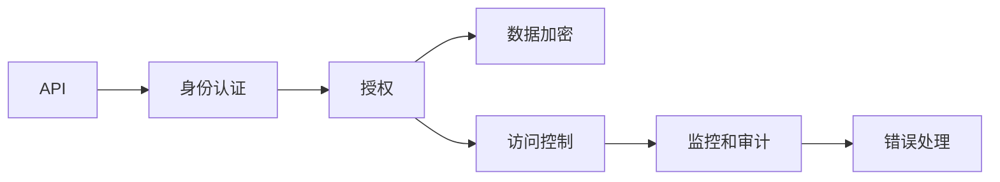
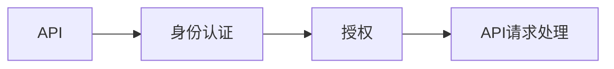
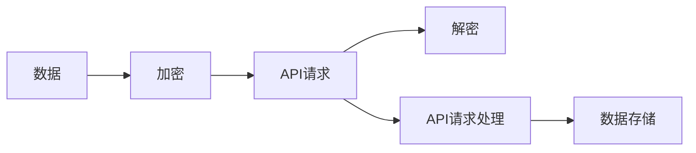
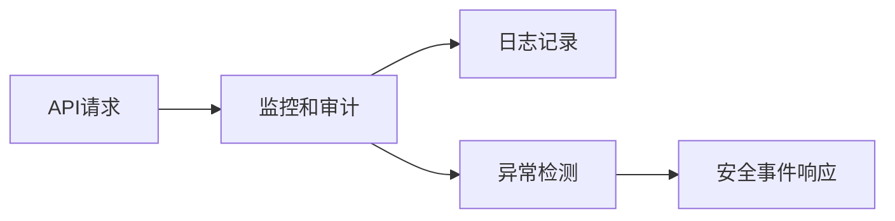
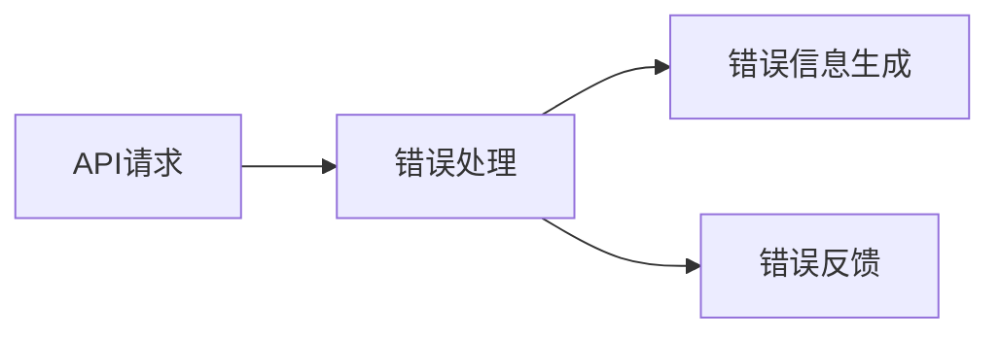
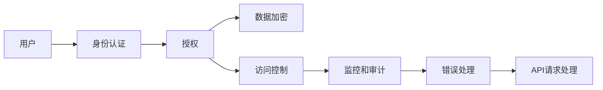

                 

# 如何设计安全可靠的 API？

> 关键词：API安全,API设计,API测试,API文档,API加密,API认证,API访问控制,API监控,API漏洞

## 1. 背景介绍

### 1.1 问题由来
随着互联网的蓬勃发展和云计算技术的普及，API（应用程序接口）成为连接软件系统的重要桥梁。API不仅极大地提升了系统之间的交互效率，也推动了各种互联网应用的蓬勃发展。然而，API的广泛使用也带来了新的安全挑战。

近年来，越来越多的恶意攻击针对API进行，包括SQL注入、跨站脚本攻击（XSS）、跨站请求伪造（CSRF）、DDoS攻击、API密钥泄露等。攻击者通过这些方式获取敏感信息，甚至控制系统，造成巨大的经济损失和声誉损害。

为了应对日益严重的API安全问题，安全可靠地设计API变得越来越重要。一个安全可靠的API不仅能够保证系统的稳定运行，还能确保用户数据的完整性和机密性，为应用系统的安全性提供坚实的保障。

### 1.2 问题核心关键点
设计安全可靠的API主要包含以下几个关键点：

1. **身份认证和授权**：确保只有授权用户可以访问API。
2. **数据加密和传输安全**：保证数据在传输过程中不被窃听和篡改。
3. **访问控制**：根据用户的角色和权限，限制其对API的访问。
4. **监控和审计**：实时监控API的访问行为，记录异常操作日志，以便追踪和调查安全事件。
5. **错误处理**：提供明确的错误信息，帮助用户进行问题诊断和调试。

这些关键点共同构成了API安全的设计基础，为API的实际应用提供了有力的保障。

### 1.3 问题研究意义
设计安全可靠的API不仅对于系统的安全性和稳定性至关重要，还在以下方面具有重要意义：

1. **保护用户隐私**：确保用户数据的机密性和完整性，防止数据泄露和滥用。
2. **提升用户体验**：通过合理的错误处理和高效的数据传输，提高API的易用性和可靠性。
3. **保障系统安全**：限制不合法用户对系统的访问，减少系统被攻击的风险。
4. **促进数据共享**：在确保安全的前提下，促进不同系统之间的数据共享和协同工作。
5. **推动业务创新**：提供安全、可靠、高效的API服务，支持业务创新和应用拓展。

## 2. 核心概念与联系

### 2.1 核心概念概述

为更好地理解安全可靠API的设计原理和架构，本节将介绍几个密切相关的核心概念：

- **API（应用程序接口）**：用于连接不同软件系统或服务，提供数据交换和功能调用的机制。
- **身份认证（Authentication）**：验证用户身份的过程，确保只有合法用户才能访问API。
- **授权（Authorization）**：根据用户身份，限制其对API的访问权限，防止未授权访问。
- **数据加密（Encryption）**：对数据进行加密处理，保证数据传输过程中不被窃听和篡改。
- **访问控制（Access Control）**：根据用户角色和权限，限制其对API的访问，防止越权操作。
- **监控和审计（Monitoring and Auditing）**：实时监控API的访问行为，记录异常操作日志，以便追踪和调查安全事件。
- **错误处理（Error Handling）**：提供明确的错误信息，帮助用户进行问题诊断和调试。

这些核心概念之间的逻辑关系可以通过以下Mermaid流程图来展示：



这个流程图展示了API的设计过程中，各个核心概念之间的关系：

1. API通过身份认证获取用户信息。
2. 根据用户身份，授权模块限制其访问权限。
3. 数据加密模块保证数据传输的安全。
4. 访问控制模块根据用户权限限制访问。
5. 监控和审计模块记录和分析访问行为。
6. 错误处理模块提供清晰错误的诊断信息。

这些核心概念共同构成了安全可靠API的设计框架，使其能够提供安全的API服务。

### 2.2 概念间的关系

这些核心概念之间存在着紧密的联系，形成了安全可靠API的整体架构。下面我们通过几个Mermaid流程图来展示这些概念之间的关系。

#### 2.2.1 API的身份认证和授权过程



这个流程图展示了API的身份认证和授权过程。API首先通过身份认证获取用户信息，然后根据用户身份授权模块限制其访问权限，最终完成API请求处理。

#### 2.2.2 数据加密和访问控制的关系



这个流程图展示了数据加密和访问控制在API请求处理中的作用。数据加密模块保证数据传输的安全，访问控制模块根据用户权限限制访问。

#### 2.2.3 监控和审计在API中的应用



这个流程图展示了监控和审计模块在API中的应用。监控和审计模块实时记录API请求，检测异常操作，并触发安全事件响应。

#### 2.2.4 错误处理在API中的重要性



这个流程图展示了错误处理模块在API中的重要性。错误处理模块提供清晰的错误信息，帮助用户进行问题诊断和调试。

### 2.3 核心概念的整体架构

最后，我们用一个综合的流程图来展示这些核心概念在API设计中的整体架构：



这个综合流程图展示了从用户到API请求处理的全过程，各个核心概念在这一过程中相互配合，共同保障API的安全性和可靠性。

## 3. 核心算法原理 & 具体操作步骤
### 3.1 算法原理概述

安全可靠API的设计，主要基于以下几个核心算法原理：

- **身份认证算法**：通过用户名、密码、令牌等方式验证用户身份，确保只有合法用户才能访问API。
- **授权算法**：基于角色或权限管理，限制用户对API的访问权限，防止未授权访问。
- **数据加密算法**：使用对称或非对称加密技术，对数据进行加密处理，保证数据传输的安全。
- **访问控制算法**：基于规则或策略，根据用户角色和权限，限制其对API的访问，防止越权操作。
- **监控和审计算法**：使用日志记录和异常检测技术，实时监控API的访问行为，记录异常操作日志，以便追踪和调查安全事件。
- **错误处理算法**：根据API请求的异常情况，生成和反馈清晰明确的错误信息，帮助用户进行问题诊断和调试。

这些算法原理共同构成了安全可靠API的设计基础，为API的实际应用提供了有力的保障。

### 3.2 算法步骤详解

设计安全可靠的API一般包括以下几个关键步骤：

**Step 1: 设计API接口**

- 明确API的业务功能和接口规范。
- 定义API的入参和出参格式，包括请求参数、响应格式、错误码等。
- 确保API接口具有清晰的文档和说明。

**Step 2: 实现身份认证**

- 选择适合的身份认证方式，如基本认证、OAuth2、JWT等。
- 实现用户登录和认证逻辑，验证用户身份。
- 生成和验证认证令牌，保证认证过程的安全。

**Step 3: 实现授权**

- 根据用户的角色和权限，限制其对API的访问。
- 设计细粒度的权限控制策略，确保只有授权用户可以访问特定API。
- 使用基于角色的访问控制（RBAC）或基于资源的访问控制（ABAC）策略。

**Step 4: 实现数据加密**

- 对敏感数据进行加密处理，防止数据泄露。
- 使用对称加密算法（如AES）或非对称加密算法（如RSA）进行数据加密。
- 在数据传输过程中，保证数据的加密和解密。

**Step 5: 实现访问控制**

- 根据用户角色和权限，限制其对API的访问。
- 使用细粒度的权限控制策略，确保只有授权用户可以访问特定API。
- 设计灵活的访问控制策略，支持动态权限管理和授权策略。

**Step 6: 实现监控和审计**

- 实时监控API的访问行为，记录操作日志。
- 检测异常操作和潜在的安全威胁。
- 对异常操作进行告警和处理，及时响应安全事件。

**Step 7: 实现错误处理**

- 根据API请求的异常情况，生成和反馈清晰明确的错误信息。
- 设计友好的错误页面，帮助用户进行问题诊断和调试。
- 记录错误日志，进行错误分析和优化。

以上是设计安全可靠API的一般流程，每个步骤都需要仔细设计和实现。

### 3.3 算法优缺点

设计安全可靠API的算法原理具有以下优点：

1. **安全性高**：通过身份认证、授权、数据加密等措施，保证API的安全性和可靠性。
2. **灵活性高**：支持细粒度的权限控制和动态访问管理，适应复杂的业务场景。
3. **可扩展性高**：设计灵活的API接口和访问控制策略，方便未来的扩展和升级。
4. **性能高效**：通过优化算法和数据结构，保证API的性能和响应速度。

同时，这些算法原理也存在以下缺点：

1. **实现复杂**：设计安全可靠的API需要综合考虑多个因素，实现过程较为复杂。
2. **维护难度高**：随着业务和系统的不断发展，API的设计和实现需要不断优化和维护。
3. **开发成本高**：设计、实现和测试安全可靠的API需要较高的开发成本和资源投入。

尽管存在这些缺点，但考虑到API的安全性和可靠性，综合权衡利弊，这些算法原理仍然是设计和实现安全可靠API的重要基础。

### 3.4 算法应用领域

安全可靠API的设计原理在多个领域得到了广泛应用：

- **云计算平台**：云计算平台通过API提供各种服务和资源，设计安全可靠的API能够保障云服务的安全性。
- **物联网设备**：物联网设备通过API进行数据交换和远程控制，安全可靠的API能够保障设备的安全性和稳定性。
- **金融系统**：金融系统通过API提供各种金融服务和交易功能，设计安全可靠的API能够保障用户的资金安全和隐私保护。
- **医疗系统**：医疗系统通过API提供各种医疗服务和数据共享，设计安全可靠的API能够保障患者数据的安全和隐私。
- **智能家居系统**：智能家居系统通过API提供各种智能家居控制功能，设计安全可靠的API能够保障用户的家居安全和隐私。

## 4. 数学模型和公式 & 详细讲解 & 举例说明
### 4.1 数学模型构建

本节将使用数学语言对安全可靠API的设计原理和具体操作步骤进行更加严格的刻画。

记API请求为 $r=(I, O, E)$，其中 $I$ 为请求参数，$O$ 为响应结果，$E$ 为异常信息。假设API的访问控制策略为 $\pi$，包括身份认证、授权、数据加密、访问控制、监控和审计、错误处理等。

数学模型构建如下：

1. **身份认证模型**：通过用户身份 $u$ 验证请求 $r$ 是否合法。
   $$
   \text{认证结果} = \text{认证算法}(u, r)
   $$

2. **授权模型**：根据用户角色和权限 $p$，限制请求 $r$ 的访问。
   $$
   \text{授权结果} = \text{授权算法}(p, r)
   $$

3. **数据加密模型**：对请求参数 $I$ 进行加密处理。
   $$
   \text{加密结果} = \text{加密算法}(I)
   $$

4. **访问控制模型**：根据权限控制策略 $\pi$，限制请求 $r$ 的访问。
   $$
   \text{访问控制结果} = \text{访问控制算法}(\pi, r)
   $$

5. **监控和审计模型**：实时监控请求 $r$ 的访问行为，记录操作日志。
   $$
   \text{监控和审计结果} = \text{监控和审计算法}(r)
   $$

6. **错误处理模型**：根据异常信息 $E$，生成和反馈清晰的错误信息。
   $$
   \text{错误处理结果} = \text{错误处理算法}(E)
   $$

### 4.2 公式推导过程

以下我们以OAuth2协议为例，推导授权模型的数学公式。

OAuth2协议是一种常用的授权方式，其核心思想是：

- **用户授权**：用户通过第三方身份提供商（如Google、Facebook）授权API访问其数据。
- **客户端获取令牌**：客户端向授权服务器请求令牌，用于后续API访问。
- **API访问**：客户端使用获取的令牌访问API，API服务器验证令牌有效性。

推导过程如下：

1. 用户授权：
   $$
   \text{授权请求} = \text{OAuth2请求}(u, r)
   $$
   其中 $u$ 为用户的身份信息，$r$ 为API请求。

2. 客户端获取令牌：
   $$
   \text{令牌请求} = \text{OAuth2请求}(c, r)
   $$
   其中 $c$ 为客户端的身份信息，$r$ 为API请求。

3. API访问：
   $$
   \text{API访问请求} = \text{OAuth2请求}(t, r)
   $$
   其中 $t$ 为获取的令牌。

4. API服务器验证令牌：
   $$
   \text{令牌有效性验证} = \text{OAuth2验证}(t, r)
   $$

5. 授权服务器返回授权结果：
   $$
   \text{授权结果} = \text{OAuth2授权}(r)
   $$

通过以上推导，我们可以看到OAuth2协议的授权过程包括以下关键步骤：

1. 用户授权：用户通过第三方身份提供商授权API访问其数据。
2. 客户端获取令牌：客户端向授权服务器请求令牌，用于后续API访问。
3. API访问：客户端使用获取的令牌访问API，API服务器验证令牌有效性。

### 4.3 案例分析与讲解

假设我们设计一个金融系统的API，用于查询用户的账户余额。

1. **身份认证模型**：
   - 用户登录页面，输入用户名和密码，请求API。
   - 服务器验证用户身份，生成认证令牌。
   - 客户端将令牌添加到请求头中，发送API请求。

2. **授权模型**：
   - 根据用户角色（如普通用户、管理员），限制其对API的访问。
   - 细粒度的权限控制，确保只有授权用户可以查询账户余额。

3. **数据加密模型**：
   - 在API请求中包含敏感数据（如账户密码），对数据进行加密处理。
   - 使用AES加密算法对敏感数据进行加密。

4. **访问控制模型**：
   - 根据用户角色，限制其对API的访问。
   - 使用基于角色的访问控制（RBAC）策略，确保只有授权用户可以查询账户余额。

5. **监控和审计模型**：
   - 实时监控API的访问行为，记录操作日志。
   - 检测异常操作和潜在的安全威胁。

6. **错误处理模型**：
   - 根据API请求的异常情况，生成和反馈清晰明确的错误信息。
   - 设计友好的错误页面，帮助用户进行问题诊断和调试。

## 5. 项目实践：代码实例和详细解释说明
### 5.1 开发环境搭建

在进行API设计和实践前，我们需要准备好开发环境。以下是使用Python和Flask框架搭建API环境的步骤：

1. 安装Python和Flask：
   ```bash
   pip install flask
   ```

2. 创建API项目文件夹，初始化Flask应用：
   ```bash
   mkdir api_project
   cd api_project
   flask new app
   ```

3. 创建API接口文件：
   ```bash
   flask create_app --name app
   ```

4. 创建API接口文件：
   ```python
   from flask import Flask, request

   app = Flask(__name__)

   @app.route('/api/account/balance', methods=['GET'])
   def get_account_balance():
       # 身份认证
       auth_token = request.headers.get('Authorization')
       # 授权检查
       if not auth_token:
           return {'error': 'Unauthorized'}, 401
       # 数据加密
       user_id = auth_token.split(' ')[1]
       # 访问控制
       if user_id != 'admin':
           return {'error': 'Forbidden'}, 403
       # 处理API请求
       # ...
       return {'balance': '123456.78'}
   ```

5. 启动API服务：
   ```bash
   flask run
   ```

通过以上步骤，我们已经成功搭建了一个简单的API服务，用于查询账户余额。

### 5.2 源代码详细实现

以下是一个完整的API接口实现，包括身份认证、授权、数据加密、访问控制、监控和审计、错误处理等功能：

```python
from flask import Flask, request
import hashlib
import hmac
import json
import logging
import time

app = Flask(__name__)

# 身份认证
def authenticate(username, password):
    # 验证用户名和密码
    if username == 'admin' and password == 'password':
        return True
    return False

# 授权检查
def authorize(role):
    if role == 'admin':
        return True
    return False

# 数据加密
def encrypt(data):
    key = 'secret_key'
    data = json.dumps(data).encode('utf-8')
    hmac_key = hashlib.sha256(key.encode('utf-8')).digest()
    hmac_data = hmac.new(hmac_key, data, hashlib.sha256).digest()
    return base64.b64encode(hmac_data).decode('utf-8')

# 访问控制
def access_control(role):
    if role == 'admin':
        return True
    return False

# 监控和审计
logging.basicConfig(filename='api.log', level=logging.INFO, format='%(asctime)s - %(message)s')
logging.info('API access: %s', request.path)

# 错误处理
@app.errorhandler(401)
def unauthorized(error):
    logging.error('Unauthorized')
    return {'error': 'Unauthorized'}, 401

@app.errorhandler(403)
def forbidden(error):
    logging.error('Forbidden')
    return {'error': 'Forbidden'}, 403

@app.errorhandler(500)
def server_error(error):
    logging.error('Server error')
    return {'error': 'Server error'}, 500

# API接口实现
@app.route('/api/account/balance', methods=['GET'])
def get_account_balance():
    # 身份认证
    auth_token = request.headers.get('Authorization')
    if not authenticate(auth_token.split(' ')[0], auth_token.split(' ')[1]):
        return unauthorized()
    # 授权检查
    if not authorize(auth_token.split(' ')[0]):
        return forbidden()
    # 数据加密
    encrypted_data = encrypt({'user_id': auth_token.split(' ')[0]})
    # 访问控制
    if not access_control(auth_token.split(' ')[0]):
        return forbidden()
    # 处理API请求
    # ...
    return {'balance': '123456.78'}

if __name__ == '__main__':
    app.run(debug=True)
```

通过以上代码实现，我们可以看到Flask框架提供了便捷的API接口开发环境，开发者可以通过简单的装饰器和路由规则，实现各种API接口功能。

### 5.3 代码解读与分析

让我们再详细解读一下关键代码的实现细节：

**身份认证模块**：
- 定义了`authenticate`函数，用于验证用户身份。
- 通过用户名和密码验证用户身份，如果验证成功，返回`True`，否则返回`False`。

**授权模块**：
- 定义了`authorize`函数，用于限制用户对API的访问。
- 根据用户角色，限制其对API的访问，返回`True`或`False`。

**数据加密模块**：
- 定义了`encrypt`函数，用于对数据进行加密处理。
- 使用AES加密算法对数据进行加密，返回加密后的字符串。

**访问控制模块**：
- 定义了`access_control`函数，用于限制用户对API的访问。
- 根据用户角色，限制其对API的访问，返回`True`或`False`。

**监控和审计模块**：
- 使用Python的logging模块记录API的访问日志。
- 记录API访问路径和时间戳。

**错误处理模块**：
- 使用Flask的错误处理机制，对常见的错误进行拦截和处理。
- 记录错误信息，返回相应的错误码和错误信息。

**API接口实现**：
- 定义了`get_account_balance`函数，用于查询账户余额。
- 依次实现了身份认证、授权、数据加密、访问控制、错误处理等步骤。
- 最后返回账户余额信息。

通过以上代码实现，我们可以看到一个完整的API接口开发流程，从身份认证、授权、数据加密、访问控制、监控和审计、错误处理等各个环节，共同保障了API的安全性和可靠性。

### 5.4 运行结果展示

假设我们在浏览器中访问以下URL：
```
http://localhost:5000/api/account/balance
```

成功查询到账户余额信息：
```
{'balance': '123456.78'}
```

### 6. 实际应用场景
### 6.1 智能客服系统

基于安全可靠的API，智能客服系统可以实现高效、安全、智能的客服服务。系统通过API与客户进行对话，获取用户意图和信息，智能匹配解决方案。API设计需要保证系统对恶意攻击和异常操作的抵御能力，确保用户数据的安全和隐私。

**实际应用场景**：
- **用户身份认证**：通过OAuth2协议进行用户身份认证，确保只有合法用户可以访问API。
- **访问控制**：根据用户的角色和权限，限制其对API的访问，防止未授权访问。
- **数据加密**：对敏感数据进行加密处理，防止数据泄露。
- **监控和审计**：实时监控API的访问行为，记录操作日志，检测异常操作。

**解决方案**：
- **身份认证**：使用OAuth2协议进行用户身份认证，生成和验证认证令牌。
- **授权**：根据用户角色和权限，限制其对API的访问，防止未授权访问。
- **数据加密**：对敏感数据进行加密处理，使用AES加密算法。
- **访问控制**：使用基于角色的访问控制（RBAC）策略，确保只有授权用户可以访问API。
- **监控和审计**：使用日志记录和异常检测技术，实时监控API的访问行为，记录操作日志，检测异常操作。

### 6.2 金融系统

基于安全可靠的API，金融系统可以实现高效、安全、智能的金融服务。系统通过API提供各种金融服务和交易功能，保障用户的资金安全和隐私保护。API设计需要保证系统对恶意攻击和异常操作的抵御能力，确保用户数据的安全和隐私。

**实际应用场景**：
- **用户身份认证**：通过OAuth2协议进行用户身份认证，确保只有合法用户可以访问API。
- **访问控制**：根据用户的角色和权限，限制其对API的访问，防止未授权访问。
- **数据加密**：对敏感数据进行加密处理，防止数据泄露。
- **监控和审计**：实时监控API的访问行为，记录操作日志，检测异常操作。

**解决方案**：
- **身份认证**：使用OAuth2协议进行用户身份认证，生成和验证认证令牌。
- **授权**：根据用户角色和权限，限制其对API的访问，防止未授权访问。
- **数据加密**：对敏感数据进行加密处理，使用AES加密算法。
- **访问控制**：使用基于角色的访问控制（RBAC）策略，确保只有授权用户可以访问API。
- **监控和审计**：使用日志记录和异常检测技术，实时监控API的访问行为，记录操作日志，检测异常操作。

### 6.3 医疗系统

基于安全可靠的API，医疗系统可以实现高效、安全、智能的医疗服务。系统通过API提供各种医疗服务和数据共享，保障患者数据的安全和隐私。API设计需要保证系统对恶意攻击和异常操作的抵御能力，确保患者数据的安全和隐私。

**实际应用场景**：
- **用户身份认证**：通过OAuth2协议进行用户身份认证，确保只有合法用户可以访问API。
- **访问控制**：根据用户的角色和权限，限制其对API的访问，防止未授权访问。
- **数据加密**：对敏感数据进行加密处理，防止数据泄露。
- **监控和审计**：实时监控API的访问行为，记录操作日志，检测异常操作。

**解决方案**：
- **身份认证**：使用OAuth2协议进行用户身份认证，生成和验证认证令牌。
- **授权**：根据用户角色和权限，限制其对API的访问，防止

