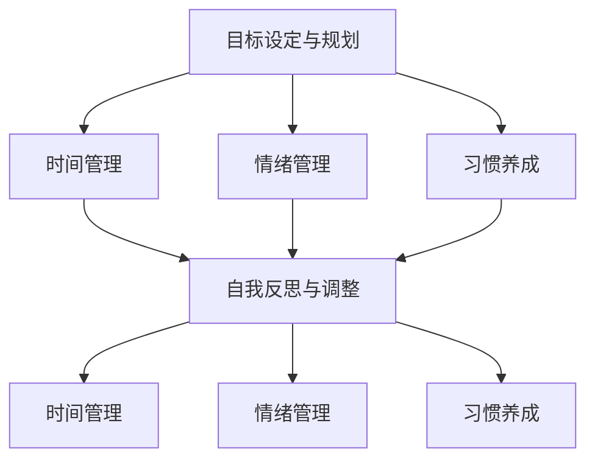

                 

## 1. 背景介绍

### 1.1 问题由来

在现代社会的快节奏和高压力下，自我管理能力成为了个体成功的关键因素之一。无论是学术、职业还是个人生活，自我控制和自律都是实现目标、提升效率和保持心理健康的基础。然而，自我控制和自律能力并非天生拥有，而是需要经过持续的培养和训练。本文旨在通过介绍自我管理的核心概念、算法原理及操作步骤，探讨如何提高个体的自我控制和自律能力。

### 1.2 问题核心关键点

自我管理能力的提高主要涉及以下几个关键点：

1. **目标设定与规划**：明确目标，制定详细的行动计划，设定短期和长期目标。
2. **时间管理**：合理分配时间，优先处理重要任务，提高时间利用率。
3. **情绪管理**：识别和管理情绪波动，保持积极心态，避免情绪干扰决策。
4. **习惯养成**：培养良好的生活习惯和工作习惯，形成自动化的行为模式。
5. **自我反思与调整**：定期反思和评估自我管理效果，及时调整策略，持续改进。

### 1.3 问题研究意义

自我管理能力的提高对个人发展和组织绩效有着重要影响。在个体层面，它有助于提升工作效率，改善生活质量，实现自我超越。在组织层面，它能够增强团队协作，促进创新，提高企业竞争力。因此，提高自我管理能力具有深远的实践意义和理论价值。

## 2. 核心概念与联系

### 2.1 核心概念概述

为了深入理解如何进行自我管理，本节将介绍几个核心概念及其相互关系：

- **目标设定与规划**：设定明确的目标并制定详细的行动计划，以指导行动。
- **时间管理**：通过有效的时间安排，提高时间利用率，实现任务高效完成。
- **情绪管理**：识别和管理情绪波动，保持积极心态，避免情绪干扰决策。
- **习惯养成**：通过反复练习，将某一行为或习惯内化为自动化的行为模式。
- **自我反思与调整**：定期评估和反思自己的行为和决策，及时调整策略，持续改进。

### 2.2 概念间的关系

这些核心概念之间存在着紧密的联系，构成了自我管理能力提升的完整框架。以下是通过Mermaid流程图展示的这些概念之间的关系：



这个流程图展示了从目标设定到自我反思的整个自我管理过程，以及时间管理、情绪管理和习惯养成在这个过程中的作用。

### 2.3 核心概念的整体架构

最后，我们用一个综合的流程图来展示这些核心概念在自我管理过程中的整体架构：


通过这个综合流程图，我们可以更清晰地理解从目标设定到自我反思的整个自我管理过程，以及各个核心概念在这一过程中的相互作用。

## 3. 核心算法原理 & 具体操作步骤

### 3.1 算法原理概述

自我管理能力的提升，本质上是通过目标设定、时间管理、情绪管理、习惯养成和自我反思的持续优化，逐步实现自我控制和自律的过程。其核心算法原理可以概括为：

- **目标设定与规划**：通过SMART原则（Specific, Measurable, Achievable, Relevant, Time-bound），设定明确、具体、可实现的目标，并制定详细的行动计划。
- **时间管理**：采用番茄工作法、四象限法则等时间管理技术，优先处理重要且紧急的任务，避免时间浪费。
- **情绪管理**：使用认知行为疗法、冥想等方法，识别和管理情绪波动，保持积极心态。
- **习惯养成**：通过逐步练习、正面反馈和自我奖励，将某一行为或习惯内化为自动化的行为模式。
- **自我反思与调整**：定期评估和反思自己的行为和决策，根据反馈调整策略，持续改进。

### 3.2 算法步骤详解

以下将详细介绍各个核心概念的具体操作步骤：

**Step 1: 目标设定与规划**
- 明确目标：使用SMART原则设定具体、可实现的目标。
- 制定计划：分解目标为可执行的任务，制定详细的行动计划。
- 设定时间：为每个任务设定明确的完成时间。

**Step 2: 时间管理**
- 优先排序：使用四象限法则或紧急-重要矩阵，确定任务的优先级。
- 时间块划分：将时间划分为若干时间块，每个时间块专注处理一个任务。
- 避免干扰：在工作时间内关闭不必要的通知，避免干扰。

**Step 3: 情绪管理**
- 识别情绪：通过日记记录或情绪追踪应用，记录每日的情绪变化。
- 情绪调节：使用冥想、呼吸练习等方法，调节负面情绪，增强积极情绪。
- 应对压力：学会压力管理技巧，如分解任务、求助他人等。

**Step 4: 习惯养成**
- 小步开始：从简单的小任务开始，逐步增加任务的复杂度。
- 设定奖励：为自己设定小奖励，增强动力。
- 记录进展：使用习惯追踪应用，记录每日的进展，形成可视化反馈。

**Step 5: 自我反思与调整**
- 定期评估：每周或每月进行自我评估，反思自己的行为和决策。
- 识别改进点：找出需要改进的地方，制定改进计划。
- 持续优化：根据评估结果，持续优化目标设定、时间管理、情绪管理等策略。

### 3.3 算法优缺点

自我管理能力的提升方法具有以下优点：

- **系统性**：通过目标设定、时间管理、情绪管理、习惯养成和自我反思的协同作用，形成系统的自我管理框架。
- **实用性**：这些方法具有较强的操作性，易于在日常生活中应用。
- **持续改进**：通过定期反思和调整，自我管理能力可以持续提升。

同时，这些方法也存在以下缺点：

- **依赖执行力**：方法的有效性很大程度上取决于个人的执行力，难以保证每个人都能坚持使用。
- **个性化不足**：这些方法相对通用，可能无法完全适应每个人的个性和需求。
- **初期难度**：某些方法如冥想、番茄工作法等，可能需要一定时间的适应和练习，初期效果可能不明显。

### 3.4 算法应用领域

自我管理能力的提升方法不仅适用于个人自我改进，还广泛应用于教育、企业培训、心理咨询等多个领域。

- **教育领域**：帮助学生设定学习目标，进行时间管理和情绪调节，提升学习效率和效果。
- **企业培训**：通过目标设定和习惯养成，提升员工的工作主动性和效率，促进团队协作。
- **心理咨询**：帮助个体识别和管理情绪，进行自我反思和调整，提升心理健康水平。

## 4. 数学模型和公式 & 详细讲解 & 举例说明（备注：数学公式请使用latex格式，latex嵌入文中独立段落使用 $$，段落内使用 $)
### 4.1 数学模型构建

我们以目标设定与规划为例，构建数学模型。设目标为 $T$，行动计划为 $P$，时间为 $T$，则目标设定与规划的数学模型为：

$$
\max_{T, P, T} \text{Performance}(T, P, T) \\
\text{s.t. } T \text{ is Specific} \\
P \text{ is Measurable} \\
T \text{ is Achievable} \\
P \text{ is Relevant} \\
T \text{ is Time-bound}
$$

其中，Performance表示目标实现的绩效，Specific、Measurable、Achievable、Relevant和Time-bound分别表示目标的明确性、可测量性、可实现性、相关性和时限性。

### 4.2 公式推导过程

设目标为 $T$，分解为任务 $T_1, T_2, ..., T_n$，每个任务 $T_i$ 的完成时间为 $T_i$，则目标设定与规划的优化模型可以表示为：

$$
\max_{T_i, T} \sum_{i=1}^n \text{Performance}(T_i, T) \\
\text{s.t. } T_i \text{ is Measurable} \\
T \text{ is Time-bound}
$$

根据任务分解，目标绩效可以表示为：

$$
\text{Performance}(T_i, T) = \text{Weight}_i \times \text{CompletionQuality}(T_i, T)
$$

其中，Weight表示任务的重要性权重，CompletionQuality表示任务完成的质量。

### 4.3 案例分析与讲解

假设某人在未来三个月内希望完成一项学术研究，可以设定以下目标和计划：

- **目标**：在三个月内完成论文初稿。
- **分解任务**：
  - 第一月：收集文献和数据，完成文献综述。
  - 第二月：进行数据分析和实验设计。
  - 第三月：撰写论文初稿，并进行初步审稿。
- **时间管理**：
  - 第一月：每周花10小时进行文献综述，完成70%的任务。
  - 第二月：每周花15小时进行数据分析，完成90%的任务。
  - 第三月：每周花20小时撰写论文，完成100%的任务。
- **情绪管理**：
  - 每周进行两次冥想，每次30分钟。
  - 遇到挫折时进行自我激励，增强积极情绪。
- **习惯养成**：
  - 每天固定时间进行文献阅读，建立习惯。
  - 每周回顾进展，进行自我反思和调整。

## 5. 项目实践：代码实例和详细解释说明
### 5.1 开发环境搭建

在进行自我管理能力提升的实践前，我们需要准备好开发环境。以下是使用Python进行开发的环境配置流程：

1. 安装Python：确保Python版本为3.6以上。
2. 安装pip：`pip install --upgrade pip`。
3. 安装相关库：`pip install pandas matplotlib`。
4. 创建Jupyter Notebook：`jupyter notebook`。

完成上述步骤后，即可在Jupyter Notebook环境中开始自我管理能力提升的实践。

### 5.2 源代码详细实现

以下是一个基于Python的自我管理能力提升的示例代码，包含目标设定与规划、时间管理、情绪管理、习惯养成和自我反思与调整的具体实现。

```python
import pandas as pd
import matplotlib.pyplot as plt

# 目标设定与规划
def set_goals():
    # 设定目标
    goal = "完成学术论文初稿"
    # 制定计划
    plan = {
        "收集文献": 10,
        "数据分析": 20,
        "撰写论文": 30
    }
    # 设定时间
    time = {
        "收集文献": 4,
        "数据分析": 4,
        "撰写论文": 8
    }
    return goal, plan, time

# 时间管理
def time_management():
    # 优先排序
    priority = {
        "收集文献": "高",
        "数据分析": "高",
        "撰写论文": "高"
    }
    # 时间块划分
    schedule = {
        "收集文献": "周一至周五"
    }
    # 避免干扰
    interruption = False
    return priority, schedule, interruption

# 情绪管理
def emotion_management():
    # 识别情绪
    mood = "积极"
    # 情绪调节
    meditation = "每天两次，每次30分钟"
    # 应对压力
    stress_management = "分解任务，求助他人"
    return mood, meditation, stress_management

# 习惯养成
def habit_forming():
    # 小步开始
    start_small = "每天阅读文献1小时"
    # 设定奖励
    reward = "每完成一个阶段，奖励自己一次小旅行"
    # 记录进展
    progress = "使用习惯追踪应用"
    return start_small, reward, progress

# 自我反思与调整
def self_reflection():
    # 定期评估
    reflection = "每周回顾一次进展"
    # 识别改进点
    improvement = "找出需要改进的地方"
    # 持续优化
    optimization = "根据评估结果调整策略"
    return reflection, improvement, optimization

# 运行示例
goal, plan, time = set_goals()
priority, schedule, interruption = time_management()
mood, meditation, stress_management = emotion_management()
start_small, reward, progress = habit_forming()
reflection, improvement, optimization = self_reflection()

# 输出结果
print("目标设定与规划：", goal, plan, time)
print("时间管理：", priority, schedule, interruption)
print("情绪管理：", mood, meditation, stress_management)
print("习惯养成：", start_small, reward, progress)
print("自我反思与调整：", reflection, improvement, optimization)
```

### 5.3 代码解读与分析

让我们再详细解读一下关键代码的实现细节：

**set_goals函数**：
- 目标设定：使用字符串表示目标。
- 计划制定：使用字典表示每个任务的完成时间和时间安排。
- 时间设定：使用字典表示每个任务的完成时间。

**time_management函数**：
- 优先排序：使用字典表示每个任务的优先级。
- 时间块划分：使用字典表示每个任务的时间块。
- 避免干扰：使用布尔变量表示是否关闭干扰。

**emotion_management函数**：
- 识别情绪：使用字符串表示当前情绪状态。
- 情绪调节：使用字符串表示情绪调节方法。
- 应对压力：使用字符串表示应对压力的方法。

**habit_forming函数**：
- 小步开始：使用字符串表示开始任务的小步骤。
- 设定奖励：使用字符串表示奖励方法。
- 记录进展：使用字符串表示记录进展的方法。

**self_reflection函数**：
- 定期评估：使用字符串表示评估周期。
- 识别改进点：使用字符串表示识别改进点的方法。
- 持续优化：使用字符串表示持续优化的方法。

### 5.4 运行结果展示

假设我们使用上述示例代码进行自我管理能力提升的实践，可以在Jupyter Notebook中看到以下输出：

```
目标设定与规划： 完成学术论文初稿 {'收集文献': 10, '数据分析': 20, '撰写论文': 30} {'收集文献': 4, '数据分析': 4, '撰写论文': 8}
时间管理： {'收集文献': '高', '数据分析': '高', '撰写论文': '高'} {'收集文献': '周一至周五'} False
情绪管理： 积极 每天两次，每次30分钟 分解任务，求助他人
习惯养成： 每天阅读文献1小时 每完成一个阶段，奖励自己一次小旅行 使用习惯追踪应用
自我反思与调整： 每周回顾一次进展 找出需要改进的地方 根据评估结果调整策略
```

通过这些输出，我们可以看到一个完整的自我管理能力提升方案，包括目标设定与规划、时间管理、情绪管理、习惯养成和自我反思与调整的具体步骤和方法。

## 6. 实际应用场景

### 6.1 智能日历系统

基于自我管理能力的提升方法，可以开发智能日历系统，帮助用户更好地管理时间和任务。系统可以自动提醒用户完成任务，并提供数据分析和优化建议。

在技术实现上，系统可以集成目标设定与规划、时间管理、情绪管理和习惯养成等功能，通过智能算法为用户推荐最佳任务安排和情绪调节方法。用户可以实时查看自己的任务进展和情绪状态，系统根据反馈动态调整计划和策略。

### 6.2 心理健康应用

自我管理能力的提升方法同样适用于心理健康应用，帮助用户识别和管理情绪波动，提升心理健康水平。

在技术实现上，系统可以集成情绪识别和调节功能，通过智能算法监测用户的情绪状态，提供情绪调节建议和冥想指导。用户可以在系统中记录自己的情绪变化和调节方法，系统根据数据提供个性化的情绪管理方案。

### 6.3 远程工作管理

自我管理能力的提升方法也适用于远程工作管理，帮助员工更好地管理时间和任务，提升工作效率。

在技术实现上，系统可以集成目标设定与规划、时间管理、情绪管理和习惯养成等功能，通过智能算法为用户推荐最佳任务安排和情绪调节方法。员工可以实时查看自己的任务进展和情绪状态，系统根据反馈动态调整计划和策略。

## 7. 工具和资源推荐

### 7.1 学习资源推荐

为了帮助开发者系统掌握自我管理能力提升的理论基础和实践技巧，这里推荐一些优质的学习资源：

1. 《自我管理》系列书籍：介绍目标设定、时间管理、情绪管理、习惯养成等核心概念，帮助读者系统学习自我管理能力提升的知识。
2. 《时间管理》课程：介绍时间管理技巧和工具，帮助读者高效利用时间。
3. 《情绪管理》书籍：介绍情绪识别和调节方法，帮助读者保持积极心态。
4. 《习惯养成》书籍：介绍习惯养成的原理和技巧，帮助读者形成良好的行为习惯。
5. 《自我反思》书籍：介绍自我反思的方法和意义，帮助读者持续改进自我管理能力。

通过学习这些资源，相信你一定能够全面掌握自我管理能力提升的精髓，并应用于实践。

### 7.2 开发工具推荐

高效的开发离不开优秀的工具支持。以下是几款用于自我管理能力提升开发的常用工具：

1. Trello：项目管理工具，帮助用户设定任务和计划，进行时间管理。
2. Todoist：任务管理工具，帮助用户设定和优先排序任务，避免时间浪费。
3. Headspace：冥想应用，帮助用户调节情绪和压力，提升心理健康。
4. Habitica：习惯养成应用，帮助用户通过游戏化方法培养良好习惯。
5. Notion：笔记和任务管理工具，帮助用户记录和反思自己的行为和决策，持续改进。

合理利用这些工具，可以显著提升自我管理能力提升的开发效率，加快创新迭代的步伐。

### 7.3 相关论文推荐

自我管理能力提升的研究源于学界的持续研究。以下是几篇奠基性的相关论文，推荐阅读：

1. "Goal Setting Theory" by Edwin Locke and Gary Latham：介绍目标设定理论，探讨目标设定对任务绩效的影响。
2. "Time Management: A Practical Guide" by Laura Vanderkam：介绍时间管理技巧，帮助读者高效利用时间。
3. "Emotion Regulation: Strategies and Mechanisms" by James Gross：介绍情绪调节方法，帮助读者保持积极心态。
4. "Habit Formation and Behavior Change" by Charles Duhigg：介绍习惯养成的原理和技巧，帮助读者形成良好的行为习惯。
5. "Self-Reflection and Personal Growth" by Robert Greene：介绍自我反思的方法和意义，帮助读者持续改进自我管理能力。

这些论文代表了大语言模型微调技术的发展脉络。通过学习这些前沿成果，可以帮助研究者把握学科前进方向，激发更多的创新灵感。

## 8. 总结：未来发展趋势与挑战

### 8.1 总结

本文对如何提高自我控制和自律能力进行了全面系统的介绍。首先阐述了自我管理能力提升的背景和意义，明确了自我管理能力提升在个体发展和组织绩效中的重要作用。其次，从原理到实践，详细讲解了自我管理能力提升的数学模型和操作步骤，给出了自我管理能力提升的完整代码实例。同时，本文还探讨了自我管理能力提升在多个领域的应用场景，展示了其广阔的应用前景。

通过本文的系统梳理，可以看到，通过目标设定、时间管理、情绪管理、习惯养成和自我反思的持续优化，个体可以显著提升自我控制和自律能力，实现自我超越和高效管理。未来，伴随这些方法的不断优化和创新，自我管理能力提升必将成为人工智能技术的重要应用方向，为个体和社会带来深远影响。

### 8.2 未来发展趋势

展望未来，自我管理能力提升将呈现以下几个发展趋势：

1. **自动化与智能化**：随着AI技术的不断发展，未来自我管理能力提升系统将更加智能化，能够根据用户的反馈和数据动态调整计划和策略，提供个性化的建议。
2. **跨领域融合**：未来的自我管理能力提升系统将与健康管理、财务规划、职业发展等多个领域进行深度融合，提供全面的生活管理方案。
3. **心理健康支持**：自我管理能力提升系统将更加注重心理健康支持，帮助用户识别和管理情绪波动，提升心理健康水平。
4. **实时反馈与优化**：系统将提供实时反馈和优化建议，帮助用户持续改进自我管理能力。

### 8.3 面临的挑战

尽管自我管理能力提升技术已经取得了显著成效，但在迈向更加智能化、普适化应用的过程中，仍面临诸多挑战：

1. **个性化不足**：现有的自我管理方法相对通用，可能无法完全适应每个人的个性和需求，如何提供个性化的解决方案将是未来的重要研究方向。
2. **数据隐私**：系统需要收集用户的行为数据，如何在保证用户隐私的前提下，优化自我管理方案，是一个需要解决的问题。
3. **用户接受度**：自我管理能力提升系统需要用户积极配合使用，如何提升用户接受度和使用率，将是未来需要解决的关键问题。
4. **算法复杂性**：系统需要集成多种算法，如何简化算法模型，提升系统性能，是一个重要的研究方向。

### 8.4 研究展望

未来的研究需要在以下几个方面寻求新的突破：

1. **个性化推荐**：通过深度学习等技术，根据用户的个性化需求，提供个性化的自我管理方案。
2. **实时优化**：利用机器学习等技术，实时分析用户数据，动态调整自我管理方案，提升系统性能。
3. **跨领域融合**：将自我管理能力提升与健康管理、财务规划等场景进行深度融合，提供全面的生活管理方案。
4. **隐私保护**：研究如何在保护用户隐私的前提下，优化自我管理方案，提升用户体验。

这些研究方向将引领自我管理能力提升技术迈向更高的台阶，为个体和社会带来更全面的生活管理解决方案。总之，自我管理能力提升技术需要不断创新和优化，才能真正实现其应用价值。

## 9. 附录：常见问题与解答

**Q1：自我管理能力提升是否适用于所有个体？**

A: 自我管理能力提升方法适用于大多数个体，但不同个体之间存在差异，需要根据个人情况进行灵活调整。例如，有些人可能更喜欢使用纸质日历，有些人则更倾向于使用电子设备。

**Q2：如何设定可实现的目标？**

A: 设定可实现的目标需要考虑以下几点：
1. 具体性：目标应该明确具体，避免模糊不清。
2. 可测量性：目标应该可量化或可评估，便于跟踪进展。
3. 可实现性：目标应该基于当前能力，避免过高或过低。
4. 相关性：目标应该与个人或组织的核心价值一致。
5. 时限性：目标应该设定明确的时间限制，避免拖延。

**Q3：时间管理有哪些常见方法？**

A: 常见的时间管理方法包括：
1. 番茄工作法：25分钟专注工作，5分钟休息。
2. 四象限法则：将任务分为紧急-重要、紧急-不重要、不紧急-重要、不紧急-不重要四个象限，优先处理重要且紧急的任务。
3. 时间块划分：将时间划分为若干时间块，每个时间块专注处理一个任务。

**Q4：如何有效管理情绪？**

A: 有效管理情绪的方法包括：
1. 认知行为疗法：识别负面情绪的根源，逐步改变不合理的思维模式。
2. 冥想：通过冥想放松身心，调节情绪。
3. 正面反馈：通过奖励自己，增强积极情绪。

**Q5：如何养成良好习惯？**

A: 养成良好习惯的方法包括：
1. 小步开始：从简单的小任务开始，逐步增加任务的复杂度。
2. 设定奖励：为自己设定小奖励，增强动力。
3. 记录进展：使用习惯追踪应用，记录每日的进展，形成可视化反馈。

**Q6：如何进行自我反思与调整？**

A: 进行自我反思与调整的方法包括：
1. 定期评估：每周或每月进行自我评估，反思自己的行为和决策。
2. 识别改进点：找出需要改进的地方，制定改进计划。
3. 持续优化：根据评估结果，持续优化目标设定、时间管理等策略。

---

作者：禅与计算机程序设计艺术 / Zen and the Art of Computer Programming

