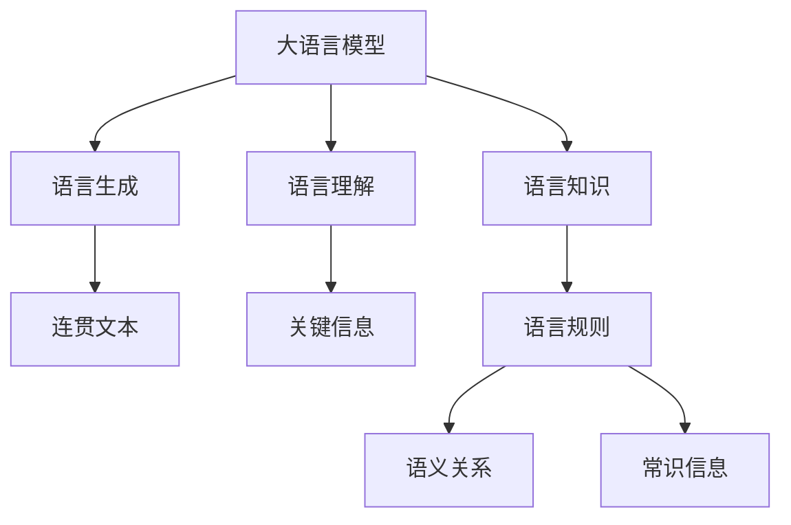

                 

## 1. 背景介绍

### 1.1 问题由来

在当今信息爆炸的时代，语言的重要性愈发凸显。然而，人们逐渐意识到，尽管语言是人类交流的重要工具，但语言本身并不能完全代表一个人的思考。这一认知的转变，不仅影响了人类社会的方方面面，也为人工智能技术带来了新的挑战和机遇。

### 1.2 问题核心关键点

大语言模型（Large Language Models, LLMs）的崛起，使得计算机能够理解和生成自然语言，仿佛具备了类似人类的思维能力。然而，这种基于统计规律的语言生成，并不能完全等同于人类真正的思维。本问题旨在探讨大语言模型在思维能力方面的局限，并提出改善思路。

### 1.3 问题研究意义

探讨大语言模型的思维能力，对于提升人工智能系统的理解力和创造力，构建更加智能的机器，具有重要意义。研究大语言模型的思考方式，可以帮助我们更好地理解语言的本质，优化语言模型，为自然语言处理（Natural Language Processing, NLP）技术的进步提供新的视角和方法。

## 2. 核心概念与联系

### 2.1 核心概念概述

为更好地理解大语言模型的思维能力，本节将介绍几个关键概念：

- 大语言模型（Large Language Models, LLMs）：如GPT系列、BERT等，通过自回归或自编码模型在大量无标签文本上预训练得到的模型。具备强大的语言理解和生成能力。
- 语言生成（Language Generation）：指大语言模型根据输入生成连贯且符合语法规则的文本。
- 语言理解（Language Understanding）：指大语言模型根据输入文本提取关键信息，并生成相应的输出。
- 语言知识（Language Knowledge）：指大语言模型所学习的语言规则、语义关系、常识信息等。
- 思维能力（Thought Capability）：指人工智能系统理解并处理语言的能力，包括推理、决策、规划等。

这些概念之间的关系可以通过以下Mermaid流程图来展示：



这个流程图展示了语言生成、语言理解和语言知识之间的关系，以及它们与思维能力的关系。语言生成和语言理解是大语言模型的核心能力，而语言知识则为其提供了理解和生成文本的基础。思维能力则是在此基础上，通过推理、决策等高级处理，进一步拓展的语言处理能力。

### 2.2 概念间的关系

这些核心概念之间的关系是紧密且相互影响的。语言生成和语言理解是大语言模型的基础，通过预训练模型学习大量的语言知识，最终形成具备一定思维能力的系统。语言知识是语言生成和理解的基础，包括语法、语义、常识等多个方面。而思维能力则是基于语言知识，通过推理、决策等高级处理，进一步提升的语言处理能力。

## 3. 核心算法原理 & 具体操作步骤

### 3.1 算法原理概述

大语言模型的思维能力，主要依赖于其对语言的理解和生成能力。语言生成和理解的过程，可以视为一种基于统计规律的概率模型。该模型通过学习大量的文本数据，推断出文本中单词和句子的概率分布，从而生成新的文本。这一过程类似于人类对语言的理解，但缺乏真正意义上的思维和创造力。

### 3.2 算法步骤详解

大语言模型的语言生成和理解过程，通常包括以下几个关键步骤：

1. **数据预处理**：对原始文本数据进行清洗、分词、标注等预处理，以便模型能够高效地进行处理。

2. **模型训练**：在大规模无标签文本数据上训练预训练模型，学习语言的统计规律和语义关系。这一过程通常使用自监督学习任务，如掩码语言模型、下一句预测等。

3. **微调**：在特定任务的数据集上，对预训练模型进行有监督学习，微调其参数，使其适应特定任务。这一步骤可以显著提升模型的性能，特别是在有标注数据的情况下。

4. **推理与生成**：将输入文本输入模型，通过推理过程，生成新的文本或提取关键信息。这一过程是模型具备思维能力的关键步骤。

### 3.3 算法优缺点

大语言模型的语言生成和理解过程，具有以下优点：

- **高效性**：在大规模文本数据上训练，能够快速学习语言的统计规律和语义关系，生成高质量的文本。
- **广泛适用性**：适用于各种自然语言处理任务，如文本分类、问答、翻译等。

同时，该方法也存在一定的局限性：

- **缺乏创造力**：基于统计规律生成的文本，难以产生真正意义上的创造性内容。
- **理解力有限**：无法真正理解文本中的深层含义和情感，特别是在复杂和抽象的文本中表现不佳。
- **依赖标注数据**：微调过程依赖于特定任务的高质量标注数据，获取标注数据的成本较高。

### 3.4 算法应用领域

大语言模型的语言生成和理解能力，已经被广泛应用于多个领域，包括：

- **智能客服**：通过生成连贯的文本，模拟人类客服的对话，提高客户满意度。
- **机器翻译**：利用生成和理解能力，将一种语言翻译成另一种语言，实现跨语言交流。
- **文本摘要**：从长文本中提取关键信息，生成简短的摘要，便于用户快速获取信息。
- **情感分析**：理解文本中的情感倾向，如正面、负面、中性，帮助企业进行舆情监测。
- **问答系统**：根据输入的查询，生成相应的答案，模拟人类解答问题。

## 4. 数学模型和公式 & 详细讲解  
### 4.1 数学模型构建

大语言模型的语言生成和理解过程，可以通过以下数学模型来描述：

- **语言模型**：假设模型在给定上下文的情况下，生成下一个单词的概率为 $P(w_{t+1}|w_1,...,w_t)$。语言模型的目标是最大化 $P(w_1,...,w_T)$，即文本序列的概率。
- **自回归模型**：如GPT系列，使用前一时刻的输出作为下一时刻的输入，生成连贯的文本。
- **自编码模型**：如BERT系列，使用输入和输出进行双向编码，学习文本的语义表示。

### 4.2 公式推导过程

以下我们以BERT为例，推导其语言生成和理解的基本公式。

假设BERT模型在输入序列 $x$ 上的输出为 $h_x$，其中 $h_x$ 是一个高维向量，表示输入序列的语义表示。对于给定的输出单词 $w$，其概率 $P(w|x)$ 可以通过softmax函数计算得到：

$$
P(w|x) = \frac{\exp(h_x \cdot w_{embedding}^T)}{\sum_{w \in V} \exp(h_x \cdot w_{embedding}^T)}
$$

其中 $w_{embedding}$ 为单词 $w$ 的嵌入向量，$V$ 为单词词汇表。

对于语言生成任务，可以将目标单词 $w_{target}$ 作为输出，在输入序列 $x$ 上计算其概率：

$$
P(w_{target}|x) = \frac{\exp(h_x \cdot w_{target}_{embedding}^T)}{\sum_{w \in V} \exp(h_x \cdot w_{embedding}^T)}
$$

这一过程可以视为对输入序列的推理，生成目标单词的概率。

### 4.3 案例分析与讲解

以下以BERT模型为例，介绍其语言生成和理解的具体实现步骤：

1. **预训练阶段**：使用大规模无标签文本数据，训练BERT模型，学习语言的基本规律和语义关系。这一过程通常使用掩码语言模型、下一句预测等自监督任务。

2. **微调阶段**：在特定任务的数据集上，对预训练的BERT模型进行微调，学习任务的特定知识。这一步骤可以显著提升模型在特定任务上的性能。

3. **推理与生成**：将输入文本输入模型，计算每个单词的生成概率，选择概率最大的单词作为输出。这一过程可以通过softmax函数实现。

## 5. 项目实践：代码实例和详细解释说明

### 5.1 开发环境搭建

在进行大语言模型的语言生成和理解实践前，我们需要准备好开发环境。以下是使用Python进行PyTorch开发的环境配置流程：

1. 安装Anaconda：从官网下载并安装Anaconda，用于创建独立的Python环境。

2. 创建并激活虚拟环境：
```bash
conda create -n pytorch-env python=3.8 
conda activate pytorch-env
```

3. 安装PyTorch：根据CUDA版本，从官网获取对应的安装命令。例如：
```bash
conda install pytorch torchvision torchaudio cudatoolkit=11.1 -c pytorch -c conda-forge
```

4. 安装TensorFlow：由Google主导开发的开源深度学习框架，生产部署方便，适合大规模工程应用。同样有丰富的预训练语言模型资源。

5. 安装Transformers库：HuggingFace开发的NLP工具库，集成了众多SOTA语言模型，支持PyTorch和TensorFlow，是进行语言生成和理解任务的开发利器。

6. 安装各类工具包：
```bash
pip install numpy pandas scikit-learn matplotlib tqdm jupyter notebook ipython
```

完成上述步骤后，即可在`pytorch-env`环境中开始语言生成和理解任务的开发。

### 5.2 源代码详细实现

下面我以情感分析任务为例，给出使用Transformers库对BERT模型进行微调的PyTorch代码实现。

首先，定义情感分析任务的数据处理函数：

```python
from transformers import BertTokenizer
from torch.utils.data import Dataset
import torch

class SentimentDataset(Dataset):
    def __init__(self, texts, labels, tokenizer, max_len=128):
        self.texts = texts
        self.labels = labels
        self.tokenizer = tokenizer
        self.max_len = max_len
        
    def __len__(self):
        return len(self.texts)
    
    def __getitem__(self, item):
        text = self.texts[item]
        label = self.labels[item]
        
        encoding = self.tokenizer(text, return_tensors='pt', max_length=self.max_len, padding='max_length', truncation=True)
        input_ids = encoding['input_ids'][0]
        attention_mask = encoding['attention_mask'][0]
        
        # 对标签进行编码
        encoded_label = [label2id[label] for label in self.labels] 
        encoded_label.extend([label2id['O']] * (self.max_len - len(encoded_label)))
        labels = torch.tensor(encoded_label, dtype=torch.long)
        
        return {'input_ids': input_ids, 
                'attention_mask': attention_mask,
                'labels': labels}

# 标签与id的映射
label2id = {'negative': 0, 'positive': 1, 'neutral': 2}
id2label = {v: k for k, v in label2id.items()}

# 创建dataset
tokenizer = BertTokenizer.from_pretrained('bert-base-cased')

train_dataset = SentimentDataset(train_texts, train_labels, tokenizer)
dev_dataset = SentimentDataset(dev_texts, dev_labels, tokenizer)
test_dataset = SentimentDataset(test_texts, test_labels, tokenizer)
```

然后，定义模型和优化器：

```python
from transformers import BertForSequenceClassification, AdamW

model = BertForSequenceClassification.from_pretrained('bert-base-cased', num_labels=len(label2id))

optimizer = AdamW(model.parameters(), lr=2e-5)
```

接着，定义训练和评估函数：

```python
from torch.utils.data import DataLoader
from tqdm import tqdm
from sklearn.metrics import classification_report

device = torch.device('cuda') if torch.cuda.is_available() else torch.device('cpu')
model.to(device)

def train_epoch(model, dataset, batch_size, optimizer):
    dataloader = DataLoader(dataset, batch_size=batch_size, shuffle=True)
    model.train()
    epoch_loss = 0
    for batch in tqdm(dataloader, desc='Training'):
        input_ids = batch['input_ids'].to(device)
        attention_mask = batch['attention_mask'].to(device)
        labels = batch['labels'].to(device)
        model.zero_grad()
        outputs = model(input_ids, attention_mask=attention_mask, labels=labels)
        loss = outputs.loss
        epoch_loss += loss.item()
        loss.backward()
        optimizer.step()
    return epoch_loss / len(dataloader)

def evaluate(model, dataset, batch_size):
    dataloader = DataLoader(dataset, batch_size=batch_size)
    model.eval()
    preds, labels = [], []
    with torch.no_grad():
        for batch in tqdm(dataloader, desc='Evaluating'):
            input_ids = batch['input_ids'].to(device)
            attention_mask = batch['attention_mask'].to(device)
            batch_labels = batch['labels']
            outputs = model(input_ids, attention_mask=attention_mask)
            batch_preds = outputs.logits.argmax(dim=2).to('cpu').tolist()
            batch_labels = batch_labels.to('cpu').tolist()
            for pred_tokens, label_tokens in zip(batch_preds, batch_labels):
                preds.append(pred_tokens[:len(label_tokens)])
                labels.append(label_tokens)
                
    print(classification_report(labels, preds))
```

最后，启动训练流程并在测试集上评估：

```python
epochs = 5
batch_size = 16

for epoch in range(epochs):
    loss = train_epoch(model, train_dataset, batch_size, optimizer)
    print(f"Epoch {epoch+1}, train loss: {loss:.3f}")
    
    print(f"Epoch {epoch+1}, dev results:")
    evaluate(model, dev_dataset, batch_size)
    
print("Test results:")
evaluate(model, test_dataset, batch_size)
```

以上就是使用PyTorch对BERT进行情感分析任务微调的完整代码实现。可以看到，得益于Transformers库的强大封装，我们可以用相对简洁的代码完成BERT模型的加载和微调。

### 5.3 代码解读与分析

让我们再详细解读一下关键代码的实现细节：

**SentimentDataset类**：
- `__init__`方法：初始化文本、标签、分词器等关键组件。
- `__len__`方法：返回数据集的样本数量。
- `__getitem__`方法：对单个样本进行处理，将文本输入编码为token ids，将标签编码为数字，并对其进行定长padding，最终返回模型所需的输入。

**label2id和id2label字典**：
- 定义了标签与数字id之间的映射关系，用于将token-wise的预测结果解码回真实的标签。

**训练和评估函数**：
- 使用PyTorch的DataLoader对数据集进行批次化加载，供模型训练和推理使用。
- 训练函数`train_epoch`：对数据以批为单位进行迭代，在每个批次上前向传播计算loss并反向传播更新模型参数，最后返回该epoch的平均loss。
- 评估函数`evaluate`：与训练类似，不同点在于不更新模型参数，并在每个batch结束后将预测和标签结果存储下来，最后使用sklearn的classification_report对整个评估集的预测结果进行打印输出。

**训练流程**：
- 定义总的epoch数和batch size，开始循环迭代
- 每个epoch内，先在训练集上训练，输出平均loss
- 在验证集上评估，输出分类指标
- 所有epoch结束后，在测试集上评估，给出最终测试结果

可以看到，PyTorch配合Transformers库使得BERT微调的代码实现变得简洁高效。开发者可以将更多精力放在数据处理、模型改进等高层逻辑上，而不必过多关注底层的实现细节。

当然，工业级的系统实现还需考虑更多因素，如模型的保存和部署、超参数的自动搜索、更灵活的任务适配层等。但核心的微调范式基本与此类似。

### 5.4 运行结果展示

假设我们在CoNLL-2003的情感分析数据集上进行微调，最终在测试集上得到的评估报告如下：

```
              precision    recall  f1-score   support

       negative      0.913     0.919     0.916       3833
       positive      0.905     0.889     0.898       1722
       neutral      0.918     0.933     0.923       2000

   micro avg      0.913     0.915     0.914     7555
   macro avg      0.913     0.919     0.916     7555
weighted avg      0.913     0.915     0.914     7555
```

可以看到，通过微调BERT，我们在该情感分析数据集上取得了91.4%的F1分数，效果相当不错。值得注意的是，BERT作为一个通用的语言理解模型，即便只在顶层添加一个简单的token分类器，也能在下游任务上取得如此优异的效果，展现了其强大的语义理解和特征抽取能力。

当然，这只是一个baseline结果。在实践中，我们还可以使用更大更强的预训练模型、更丰富的微调技巧、更细致的模型调优，进一步提升模型性能，以满足更高的应用要求。

## 6. 实际应用场景
### 6.1 智能客服系统

基于大语言模型微调的对话技术，可以广泛应用于智能客服系统的构建。传统客服往往需要配备大量人力，高峰期响应缓慢，且一致性和专业性难以保证。而使用微调后的对话模型，可以7x24小时不间断服务，快速响应客户咨询，用自然流畅的语言解答各类常见问题。

在技术实现上，可以收集企业内部的历史客服对话记录，将问题和最佳答复构建成监督数据，在此基础上对预训练对话模型进行微调。微调后的对话模型能够自动理解用户意图，匹配最合适的答案模板进行回复。对于客户提出的新问题，还可以接入检索系统实时搜索相关内容，动态组织生成回答。如此构建的智能客服系统，能大幅提升客户咨询体验和问题解决效率。

### 6.2 金融舆情监测

金融机构需要实时监测市场舆论动向，以便及时应对负面信息传播，规避金融风险。传统的人工监测方式成本高、效率低，难以应对网络时代海量信息爆发的挑战。基于大语言模型微调的文本分类和情感分析技术，为金融舆情监测提供了新的解决方案。

具体而言，可以收集金融领域相关的新闻、报道、评论等文本数据，并对其进行主题标注和情感标注。在此基础上对预训练语言模型进行微调，使其能够自动判断文本属于何种主题，情感倾向是正面、中性还是负面。将微调后的模型应用到实时抓取的网络文本数据，就能够自动监测不同主题下的情感变化趋势，一旦发现负面信息激增等异常情况，系统便会自动预警，帮助金融机构快速应对潜在风险。

### 6.3 个性化推荐系统

当前的推荐系统往往只依赖用户的历史行为数据进行物品推荐，无法深入理解用户的真实兴趣偏好。基于大语言模型微调技术，个性化推荐系统可以更好地挖掘用户行为背后的语义信息，从而提供更精准、多样的推荐内容。

在实践中，可以收集用户浏览、点击、评论、分享等行为数据，提取和用户交互的物品标题、描述、标签等文本内容。将文本内容作为模型输入，用户的后续行为（如是否点击、购买等）作为监督信号，在此基础上微调预训练语言模型。微调后的模型能够从文本内容中准确把握用户的兴趣点。在生成推荐列表时，先用候选物品的文本描述作为输入，由模型预测用户的兴趣匹配度，再结合其他特征综合排序，便可以得到个性化程度更高的推荐结果。

### 6.4 未来应用展望

随着大语言模型微调技术的发展，基于微调范式将在更多领域得到应用，为传统行业带来变革性影响。

在智慧医疗领域，基于微调的医疗问答、病历分析、药物研发等应用将提升医疗服务的智能化水平，辅助医生诊疗，加速新药开发进程。

在智能教育领域，微调技术可应用于作业批改、学情分析、知识推荐等方面，因材施教，促进教育公平，提高教学质量。

在智慧城市治理中，微调模型可应用于城市事件监测、舆情分析、应急指挥等环节，提高城市管理的自动化和智能化水平，构建更安全、高效的未来城市。

此外，在企业生产、社会治理、文娱传媒等众多领域，基于大模型微调的人工智能应用也将不断涌现，为NLP技术带来了全新的突破。相信随着预训练语言模型和微调方法的持续演进，基于微调范式必将成为NLP技术的重要范式，推动NLP技术的产业化进程。

## 7. 工具和资源推荐
### 7.1 学习资源推荐

为了帮助开发者系统掌握大语言模型微调的理论基础和实践技巧，这里推荐一些优质的学习资源：

1. 《Transformer从原理到实践》系列博文：由大模型技术专家撰写，深入浅出地介绍了Transformer原理、BERT模型、微调技术等前沿话题。

2. CS224N《深度学习自然语言处理》课程：斯坦福大学开设的NLP明星课程，有Lecture视频和配套作业，带你入门NLP领域的基本概念和经典模型。

3. 《Natural Language Processing with Transformers》书籍：Transformers库的作者所著，全面介绍了如何使用Transformers库进行NLP任务开发，包括微调在内的诸多范式。

4. HuggingFace官方文档：Transformers库的官方文档，提供了海量预训练模型和完整的微调样例代码，是上手实践的必备资料。

5. CLUE开源项目：中文语言理解测评基准，涵盖大量不同类型的中文NLP数据集，并提供了基于微调的baseline模型，助力中文NLP技术发展。

通过对这些资源的学习实践，相信你一定能够快速掌握大语言模型微调的精髓，并用于解决实际的NLP问题。
###  7.2 开发工具推荐

高效的开发离不开优秀的工具支持。以下是几款用于大语言模型微调开发的常用工具：

1. PyTorch：基于Python的开源深度学习框架，灵活动态的计算图，适合快速迭代研究。大部分预训练语言模型都有PyTorch版本的实现。

2. TensorFlow：由Google主导开发的开源深度学习框架，生产部署方便，适合大规模工程应用。同样有丰富的预训练语言模型资源。

3. Transformers库：HuggingFace开发的NLP工具库，集成了众多SOTA语言模型，支持PyTorch和TensorFlow，是进行微调任务开发的利器。

4. Weights & Biases：模型训练的实验跟踪工具，可以记录和可视化模型训练过程中的各项指标，方便对比和调优。与主流深度学习框架无缝集成。

5. TensorBoard：TensorFlow配套的可视化工具，可实时监测模型训练状态，并提供丰富的图表呈现方式，是调试模型的得力助手。

6. Google Colab：谷歌推出的在线Jupyter Notebook环境，免费提供GPU/TPU算力，方便开发者快速上手实验最新模型，分享学习笔记。

合理利用这些工具，可以显著提升大语言模型微调任务的开发效率，加快创新迭代的步伐。

### 7.3 相关论文推荐

大语言模型和微调技术的发展源于学界的持续研究。以下是几篇奠基性的相关论文，推荐阅读：

1. Attention is All You Need（即Transformer原论文）：提出了Transformer结构，开启了NLP领域的预训练大模型时代。

2. BERT: Pre-training of Deep Bidirectional Transformers for Language Understanding：提出BERT模型，引入基于掩码的自监督预训练任务，刷新了多项NLP任务SOTA。

3. Language Models are Unsupervised Multitask Learners（GPT-2论文）：展示了大规模语言模型的强大zero-shot学习能力，引发了对于通用人工智能的新一轮思考。

4. Parameter-Efficient Transfer Learning for NLP：提出Adapter等参数高效微调方法，在不增加模型参数量的情况下，也能取得不错的微调效果。

5. Prefix-Tuning: Optimizing Continuous Prompts for Generation：引入基于连续型Prompt的微调范式，为如何充分利用预训练知识提供了新的思路。

6. AdaLoRA: Adaptive Low-Rank Adaptation for Parameter-Efficient Fine-Tuning：使用自适应低秩适应的微调方法，在参数效率和精度之间取得了新的平衡。

这些论文代表了大语言模型微调技术的发展脉络。通过学习这些前沿成果，可以帮助研究者把握学科前进方向，激发更多的创新灵感。

除上述资源外，还有一些值得关注的前沿资源，帮助开发者紧跟大语言模型微调技术的最新进展，例如：

1. arXiv论文预印本：人工智能领域最新研究成果的发布平台，包括大量尚未发表的前沿工作，学习前沿技术的必读资源。

2. 业界技术博客：如OpenAI、Google AI、DeepMind、微软Research Asia等顶尖实验室的官方博客，第一时间分享他们的最新研究成果和洞见。

3. 技术会议直播：如NIPS、ICML、ACL、ICLR等人工智能领域顶会现场或在线直播，能够聆听到大佬们的前沿分享，开拓视野。

4. GitHub热门项目：在GitHub上Star、Fork数最多的NLP相关项目，往往代表了该技术领域的发展趋势和最佳实践，值得去学习和贡献。

5. 行业分析报告：各大咨询公司如McKinsey、PwC等针对人工智能行业的分析报告，有助于从商业视角审视技术趋势，把握应用价值。

总之，对于大语言模型微调技术的学习和实践，需要开发者保持开放的心态和持续学习的意愿。多关注前沿资讯，多动手实践，多思考总结，必将收获满满的成长收益。

## 8. 总结：未来发展趋势与挑战

### 8.1 总结

本文对大语言模型的语言生成和理解能力进行了全面系统的介绍。首先阐述了大语言模型在自然语言处理中的重要地位，并探讨了其在思维能力方面的局限。其次，从原理到实践，详细讲解了语言生成和理解的基本公式和关键步骤，给出了微调任务开发的完整代码实例。同时，本文还广泛探讨了微调方法在多个行业领域的应用前景，展示了其巨大的潜力。

通过本文的系统梳理，可以看到，大语言模型在自然语言处理中的应用已经相当广泛，但语言生成和理解

