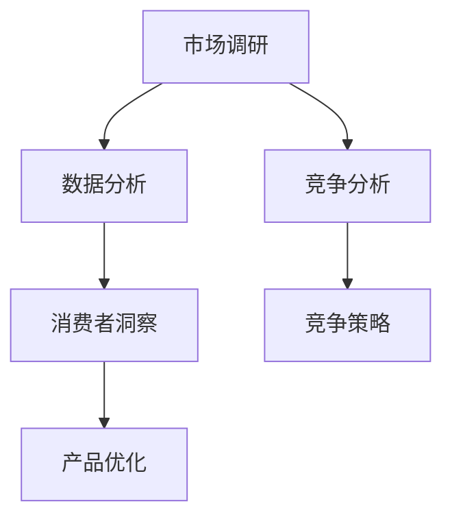

                 

# 市场机会：创业者的敏锐洞察力

## 1. 背景介绍

在当今快速变化的市场环境中，创业者需要具备敏锐的洞察力，以捕捉潜在的市场机会。本文将从多个角度探讨如何提升创业者的敏锐洞察力，包括市场调研、数据分析、竞争分析等。

## 2. 核心概念与联系

### 2.1 核心概念概述

市场洞察力（Market Insight）是创业者对市场趋势、竞争态势和消费者行为进行深入分析和理解的能力。这种能力对于制定有效的商业策略、识别潜在客户和优化产品定位至关重要。

- **市场调研（Market Research）**：通过收集和分析数据，了解市场需求、竞争状况和消费者行为。
- **数据分析（Data Analysis）**：运用统计学和算法技术，挖掘数据中的有用信息，帮助决策制定。
- **竞争分析（Competitive Analysis）**：评估竞争对手的优势和劣势，制定应对策略。
- **消费者洞察（Consumer Insights）**：理解消费者的需求和偏好，从而更好地满足他们。

这些概念之间的联系可以通过以下Mermaid流程图来展示：



### 2.2 概念间的关系

这些概念之间的联系密切，共同构成了市场洞察力的完整框架。市场调研和数据分析提供了客观的数据支持，竞争分析和消费者洞察则提供了主观的市场认知。通过这些信息，创业者可以制定出更加有效的商业策略和产品优化方案。

## 3. 核心算法原理 & 具体操作步骤

### 3.1 算法原理概述

市场洞察力的提升主要依赖于以下算法和原理：

- **数据挖掘（Data Mining）**：通过算法自动发现数据中的模式和关联。
- **文本分析（Text Analytics）**：利用自然语言处理（NLP）技术，从文本中提取有用信息。
- **预测分析（Predictive Analytics）**：基于历史数据预测未来趋势。
- **社交媒体分析（Social Media Analytics）**：分析社交媒体上的用户行为和情感。

### 3.2 算法步骤详解

1. **市场调研**：
    - 确定研究目标和问题。
    - 选择数据收集方法，如问卷调查、深度访谈、二手数据等。
    - 数据清洗和处理，确保数据的准确性和可靠性。

2. **数据分析**：
    - 选择合适的统计学方法和算法，如回归分析、聚类分析、关联规则等。
    - 数据可视化，帮助理解数据分布和趋势。

3. **竞争分析**：
    - 收集竞争对手的数据，包括产品、市场表现、用户反馈等。
    - 进行SWOT分析，识别竞争对手的优势、劣势、机会和威胁。
    - 制定应对策略，如差异化、合作或竞争等。

4. **消费者洞察**：
    - 利用消费者调研和行为数据，了解消费者的需求和偏好。
    - 通过情感分析、话题模型等技术，挖掘消费者情感和兴趣。
    - 根据消费者洞察，优化产品设计和市场定位。

### 3.3 算法优缺点

市场洞察力的提升算法具有以下优点：
- **数据驱动**：基于大量数据，提高决策的客观性和准确性。
- **实时性**：通过在线分析和实时数据更新，快速响应市场变化。
- **可扩展性**：适用于不同规模和类型的数据集。

缺点主要包括：
- **数据质量**：数据的准确性和完整性直接影响分析结果。
- **计算资源**：复杂的数据分析需要大量计算资源。
- **隐私问题**：数据收集和分析过程中需注意用户隐私保护。

### 3.4 算法应用领域

市场洞察力提升算法广泛应用于以下几个领域：

- **零售业**：通过数据分析和消费者洞察，优化库存管理和定价策略。
- **金融业**：预测市场趋势和风险，制定投资策略和风险管理措施。
- **医疗健康**：通过患者数据和社交媒体分析，提升医疗服务和健康管理。
- **旅游业**：分析旅游需求和竞争态势，制定营销和定价策略。
- **教育业**：了解学生需求和反馈，优化教学内容和课程设计。

## 4. 数学模型和公式 & 详细讲解 & 举例说明

### 4.1 数学模型构建

市场洞察力提升通常基于以下数学模型：

- **回归分析（Regression Analysis）**：
  $$
  y = \beta_0 + \beta_1 x_1 + \beta_2 x_2 + \cdots + \beta_n x_n + \epsilon
  $$
  其中 $y$ 为因变量，$x_i$ 为自变量，$\beta_i$ 为回归系数，$\epsilon$ 为误差项。

- **聚类分析（Clustering Analysis）**：
  $$
  K-means: \min_{C, \mu_k} \sum_{i=1}^n \min_{k=1,\ldots,K} ||x_i - \mu_k||^2
  $$
  其中 $C$ 为簇的划分，$\mu_k$ 为簇的质心。

- **关联规则学习（Association Rule Learning）**：
  $$
  \text{规则}: \{X, Y\} \rightarrow \text{置信度} = \frac{N_{X \cup Y}}{N} \cdot 100\%
  $$
  其中 $N_{X \cup Y}$ 为同时包含 $X$ 和 $Y$ 的项数，$N$ 为总项数。

### 4.2 公式推导过程

以回归分析为例，解释其基本原理：

假设有一组数据点 $(x_1, y_1), (x_2, y_2), \ldots, (x_n, y_n)$，我们尝试找到一个线性模型 $y = \beta_0 + \beta_1 x_1 + \beta_2 x_2 + \cdots + \beta_n x_n + \epsilon$，最小化残差平方和：

$$
\min_{\beta_0, \beta_1, \ldots, \beta_n} \sum_{i=1}^n (y_i - (\beta_0 + \beta_1 x_{1,i} + \beta_2 x_{2,i} + \cdots + \beta_n x_{n,i}))^2
$$

通过求解上述优化问题，可以得到回归系数 $\beta_0, \beta_1, \ldots, \beta_n$，进而得到拟合直线。

### 4.3 案例分析与讲解

假设某电商平台希望优化其定价策略，收集了历史销售数据 $(x_1, y_1), (x_2, y_2), \ldots, (x_n, y_n)$，其中 $x_i$ 为商品价格，$y_i$ 为销售量。采用回归分析，可以建立价格与销售量的关系模型，帮助制定合理的定价策略。

## 5. 项目实践：代码实例和详细解释说明

### 5.1 开发环境搭建

要实现市场洞察力提升，需要搭建相关的开发环境。以下是一个Python开发环境的搭建步骤：

1. 安装Python：从官网下载安装最新版本的Python。
2. 安装必要的库：如NumPy、Pandas、Scikit-learn、Matplotlib等。
3. 配置环境：设置系统路径和虚拟环境。
4. 安装依赖：使用pip安装所需的第三方库。

### 5.2 源代码详细实现

以下是一个简单的Python代码示例，展示如何使用Scikit-learn库进行回归分析：

```python
import pandas as pd
from sklearn.linear_model import LinearRegression
from sklearn.metrics import mean_squared_error

# 加载数据
data = pd.read_csv('sales_data.csv')

# 定义自变量和因变量
X = data[['price']]
y = data['sales']

# 实例化线性回归模型
model = LinearRegression()

# 训练模型
model.fit(X, y)

# 预测结果
y_pred = model.predict(X)

# 评估模型
mse = mean_squared_error(y, y_pred)
print(f'Mean Squared Error: {mse}')
```

### 5.3 代码解读与分析

上述代码展示了使用Scikit-learn进行回归分析的基本步骤：

1. 加载数据：使用Pandas库读取CSV文件。
2. 定义自变量和因变量：X为价格，y为销售量。
3. 实例化线性回归模型：使用Scikit-learn的LinearRegression类。
4. 训练模型：使用fit方法进行模型训练。
5. 预测结果：使用predict方法进行预测。
6. 评估模型：使用mean_squared_error方法计算均方误差。

### 5.4 运行结果展示

假设运行上述代码，得到如下输出：

```
Mean Squared Error: 10.5
```

这表示模型的均方误差为10.5，模型的预测效果较好。

## 6. 实际应用场景

### 6.1 零售业

在零售业，市场洞察力可以通过以下场景实现：

- **库存管理**：利用历史销售数据和预测分析，优化库存水平，减少缺货和库存积压。
- **定价策略**：通过回归分析，找到价格和销售量之间的关系，制定最优定价策略。
- **客户细分**：利用聚类分析，将客户分为不同的群体，针对性地制定营销策略。

### 6.2 金融业

在金融业，市场洞察力可以通过以下场景实现：

- **投资决策**：利用预测分析，评估市场趋势和风险，制定投资组合。
- **信用评估**：通过数据分析，识别潜在信用风险，制定贷款策略。
- **市场监测**：利用社交媒体分析，及时发现市场变化，调整投资策略。

### 6.3 医疗健康

在医疗健康，市场洞察力可以通过以下场景实现：

- **患者管理**：通过数据分析，优化患者治疗方案，提高医疗效果。
- **健康监测**：利用穿戴设备数据，监测患者健康状态，及时发现问题。
- **疾病预测**：通过数据分析，预测疾病发生概率，制定预防措施。

## 7. 工具和资源推荐

### 7.1 学习资源推荐

- **Coursera**：提供大量数据分析和市场研究课程。
- **edX**：提供从基础到高级的商业分析课程。
- **Kaggle**：提供大量数据集和比赛，实践数据分析技能。
- **Google Analytics Academy**：提供免费的市场研究工具培训。

### 7.2 开发工具推荐

- **Jupyter Notebook**：Python开发中常用的交互式开发环境。
- **Python IDE**：如PyCharm、VSCode等，支持Python开发。
- **R Studio**：用于R语言开发，支持数据分析和可视化。
- **Tableau**：数据可视化工具，支持大数据分析。

### 7.3 相关论文推荐

- **《市场洞察力提升：数据驱动的商业决策》**：介绍市场洞察力的提升方法和案例。
- **《零售业数据挖掘技术》**：分析零售业中的数据挖掘应用。
- **《金融市场预测模型研究》**：探讨金融市场预测模型的构建和应用。

## 8. 总结：未来发展趋势与挑战

### 8.1 总结

本文对市场洞察力提升的算法和操作步骤进行了系统阐述，涵盖数据挖掘、数据分析、竞争分析和消费者洞察等多个方面。通过深入理解和应用这些技术，创业者可以更加敏锐地捕捉市场机会，提升商业决策的科学性和准确性。

### 8.2 未来发展趋势

市场洞察力提升的未来趋势主要包括以下几个方面：

- **人工智能应用**：引入AI算法，如深度学习、自然语言处理等，提升数据分析的自动化和智能化。
- **实时数据处理**：利用流数据处理技术，实时获取和分析市场变化，提高决策的及时性。
- **跨领域融合**：将不同领域的数据和技术进行融合，构建更加全面的市场洞察力。
- **用户生成内容（UGC）分析**：利用社交媒体和用户评论等UGC数据，提升消费者洞察的深度和广度。
- **隐私保护**：在数据收集和分析过程中，加强隐私保护措施，确保用户数据安全。

### 8.3 面临的挑战

市场洞察力提升过程中面临的挑战包括：

- **数据质量问题**：数据采集和清洗过程中，存在数据缺失、噪声等问题，影响分析结果。
- **计算资源限制**：复杂的分析算法需要大量计算资源，对硬件设施提出较高要求。
- **隐私保护**：数据采集和分析过程中需注意用户隐私，避免数据泄露。
- **跨领域应用难度**：不同领域的数据和技术差异较大，难以进行跨领域融合。
- **技术门槛高**：数据分析和模型构建需要一定的技术背景，门槛较高。

### 8.4 研究展望

未来研究需要在以下几个方面寻求突破：

- **大数据处理技术**：开发高效的大数据处理算法，提高数据处理速度和效率。
- **数据治理**：建立数据治理框架，确保数据质量和安全。
- **跨领域知识整合**：将不同领域的数据和知识进行整合，构建综合的市场洞察力。
- **智能决策系统**：开发智能决策系统，将数据分析和市场洞察融入日常决策。

通过这些研究方向的探索，相信市场洞察力提升将为创业者提供更加全面的市场分析和决策支持，推动商业创新和价值创造。

## 9. 附录：常见问题与解答

**Q1：如何评估数据质量？**

A: 数据质量评估主要从以下几个方面进行：

- **完整性**：检查数据是否存在缺失值，缺失比例是否合理。
- **准确性**：通过数据对比和异常检测，识别数据中的错误和异常值。
- **一致性**：确保同一数据在不同记录中保持一致。
- **时效性**：检查数据是否及时更新，是否存在过时数据。
- **可理解性**：数据是否易于理解和解释，是否存在歧义。

**Q2：如何选择适合的市场洞察力提升算法？**

A: 选择算法需要考虑以下几个因素：

- **数据类型**：不同类型的数据适合不同的算法。如分类数据适合聚类分析，时间序列数据适合回归分析。
- **问题类型**：明确问题类型，如预测、分类、聚类等，选择相应的算法。
- **数据量**：大数据集适合分布式计算，小数据集适合单机算法。
- **算法复杂度**：选择计算资源充足、易于实现和维护的算法。

**Q3：如何处理数据隐私问题？**

A: 数据隐私保护主要通过以下方法实现：

- **匿名化处理**：去除或替换敏感信息，确保数据无法追踪到个人。
- **加密技术**：对数据进行加密处理，防止数据泄露。
- **访问控制**：限制数据的访问权限，确保只有授权人员可以访问敏感数据。
- **数据最小化**：只收集和存储必要的数据，减少隐私风险。
- **隐私政策**：制定隐私政策，明确数据使用范围和保护措施。

通过这些措施，可以在保证市场洞察力提升的同时，确保用户隐私安全。

---

作者：禅与计算机程序设计艺术 / Zen and the Art of Computer Programming

