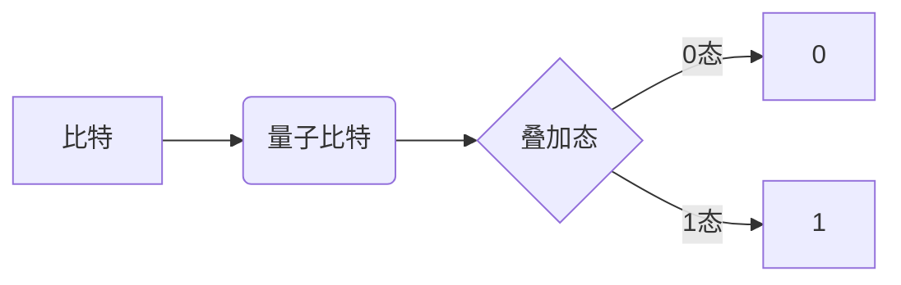
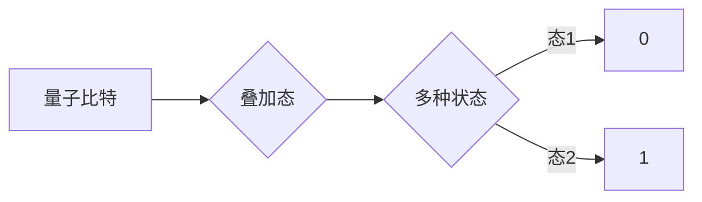
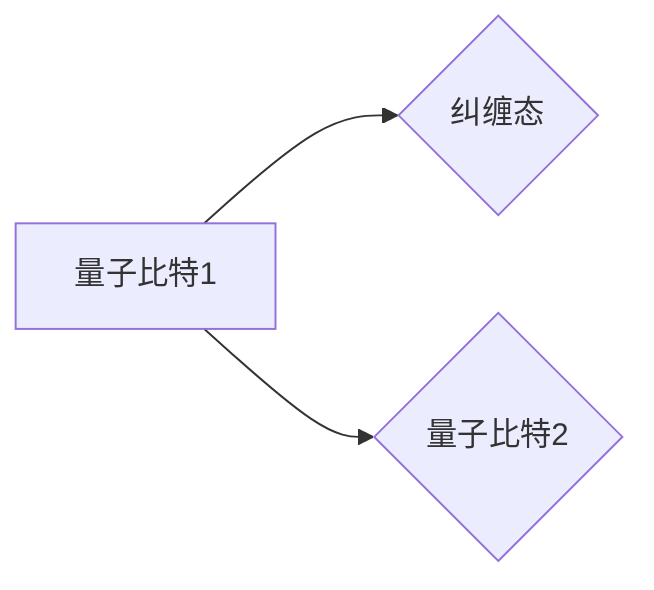

# 计算：第四部分 计算的极限 第 10 章 量子计算 计算是数学的，更是物理的

> 关键词：量子计算，量子比特，量子叠加，量子纠缠，量子逻辑门，量子算法，Shor算法，Grover算法，量子退火，量子计算机

## 1. 背景介绍

从古老的算盘到现代的超级计算机，计算技术经历了漫长的演变。随着量子力学的发现和量子信息理论的兴起，一种全新的计算范式——量子计算，应运而生。量子计算不仅是对传统计算的革命性扩展，更是数学与物理深度融合的产物。本章将深入探讨量子计算的原理、算法和应用，揭示计算极限的新维度。

### 1.1 量子计算的起源

量子计算的概念最早可以追溯到20世纪80年代，当时理论物理学家Richard Feynman和David Deutsch分别提出了量子力学模拟和量子图灵机的思想。随后，Peter Shor在1994年提出了Shor算法，标志着量子计算的实用化进程正式开启。

### 1.2 量子计算的研究现状

近年来，随着量子比特技术的突破和量子计算硬件的快速发展，量子计算领域取得了令人瞩目的成果。Shor算法、Grover算法等量子算法在特定问题上展现出超越经典算法的优越性。同时，量子退火等通用量子算法的提出，使得量子计算机在解决复杂优化问题上的潜力得到了进一步验证。

### 1.3 研究意义

量子计算的研究具有深远的意义。一方面，它拓展了我们对计算极限的认知，为解决传统计算机难以处理的问题提供了新的思路。另一方面，量子计算有望在密码学、材料科学、药物研发等领域带来颠覆性的突破。

## 2. 核心概念与联系

### 2.1 量子比特

量子比特（qubit）是量子计算的基本单元，与传统计算机中的比特不同，量子比特可以同时处于0和1的叠加态。Mermaid流程图如下：



### 2.2 量子叠加

量子叠加是量子力学的基本特性之一，意味着量子比特可以同时处于多种可能状态的叠加。Mermaid流程图如下：



### 2.3 量子纠缠

量子纠缠是量子力学中的另一个基本特性，意味着两个或多个量子比特之间的状态无法独立存在，它们之间存在着即时的相互关联。Mermaid流程图如下：



### 2.4 量子逻辑门

量子逻辑门是量子计算中的基本操作单元，类似于传统计算机中的逻辑门，它通过对量子比特进行操作来实现特定的计算功能。常见的量子逻辑门包括Hadamard门、CNOT门、Pauli门等。

## 3. 核心算法原理 & 具体操作步骤

### 3.1 算法原理概述

量子算法是量子计算的核心，它在特定问题上能够超越经典算法。以下介绍几个重要的量子算法：

- **Shor算法**：能够高效地分解大整数，对现代公钥加密体系构成了威胁。
- **Grover算法**：能够高效地搜索未排序数据库，在密码破解等领域具有潜在应用价值。
- **量子退火**：能够高效地解决优化问题，如旅行商问题、 satisfiability 问题等。

### 3.2 算法步骤详解

以Shor算法为例，其具体步骤如下：

1. 将要分解的大整数表示为 $N$。
2. 构造一个量子电路，实现以下功能：
   - 将一个量子比特作为输入，输出一个特定的量子态。
   - 使用 Hadamard 门将该量子态转换为叠加态。
   - 使用CNOT门将该叠加态与一个特定的量子态进行纠缠。
   - 使用另一个 Hadamard 门将该纠缠态转换回叠加态。
3. 测量输出量子比特，得到一个结果。
4. 重复步骤2-3，多次测量后，可以得到 $N$ 的因子。

### 3.3 算法优缺点

量子算法在特定问题上具有优越性，但也存在一些局限性：

- **优越性**：在分解大整数、搜索未排序数据库等特定问题上，量子算法能够超越经典算法。
- **局限性**：量子算法对量子硬件的要求较高，实现较为复杂。

### 3.4 算法应用领域

量子算法在密码学、材料科学、药物研发等领域具有潜在应用价值：

- **密码学**：Shor算法能够分解大整数，对现代公钥加密体系构成了威胁。
- **材料科学**：量子退火可以加速材料科学中的优化过程，提高新材料的研发效率。
- **药物研发**：量子退火可以加速药物分子的优化过程，提高新药研发的效率。

## 4. 数学模型和公式 & 详细讲解 & 举例说明

### 4.1 数学模型构建

量子计算中的数学模型主要包括量子态、算符、量子门等。以下以量子退火为例，介绍其数学模型。

假设我们要解决的问题是最小化函数 $f(x)$，其中 $x$ 是一个 $n$ 维向量。量子退火的数学模型如下：

- **量子态**：$\ket{x} = \sum_{y} \alpha_y \ket{y}$，其中 $\ket{x}$ 是一个 $n$ 维量子态，$\ket{y}$ 是一个 $n$ 维基态，$\alpha_y$ 是系数。
- **算符**：$A = \sum_{i} a_i \ket{i} \bra{i}$，其中 $A$ 是一个 $n$ 维算符，$a_i$ 是系数。
- **量子门**：$U = \exp(-i A t/\hbar)$，其中 $U$ 是一个 $n$ 维量子门，$t$ 是时间，$\hbar$ 是约化普朗克常数。

### 4.2 公式推导过程

量子退火的推导过程如下：

1. 构造哈密顿量 $H = f(x)$。
2. 构造算符 $A = -i \hbar \frac{\partial f}{\partial x}$。
3. 构造量子门 $U = \exp(-i A t/\hbar)$。
4. 对量子态 $\ket{x}$ 进行演化：$\ket{x} \rightarrow \ket{x}' = U \ket{x}$。
5. 测量演化后的量子态 $\ket{x}'$，得到解 $x$。

### 4.3 案例分析与讲解

以下以量子退火求解旅行商问题为例，介绍其应用。

假设我们要解决一个旅行商问题，需要找到一条路径，使得访问所有城市所需的总距离最小。我们可以将旅行商问题转化为量子退火问题，具体步骤如下：

1. 构造哈密顿量 $H = \sum_{(i,j) \in E} \frac{1}{d(i,j)}$，其中 $E$ 是城市之间的边集合，$d(i,j)$ 是城市 $i$ 和 $j$ 之间的距离。
2. 构造算符 $A = -i \hbar \frac{\partial H}{\partial x}$。
3. 构造量子门 $U = \exp(-i A t/\hbar)$。
4. 对量子态 $\ket{x}$ 进行演化：$\ket{x} \rightarrow \ket{x}' = U \ket{x}$。
5. 测量演化后的量子态 $\ket{x}'$，得到一条访问所有城市的路径。

## 5. 项目实践：代码实例和详细解释说明

### 5.1 开发环境搭建

为了实践量子计算，我们需要搭建一个量子计算开发环境。以下是使用Qiskit库进行量子计算开发的环境配置流程：

1. 安装Anaconda：从官网下载并安装Anaconda，用于创建独立的Python环境。

2. 创建并激活虚拟环境：
```bash
conda create -n qiskit-env python=3.8 
conda activate qiskit-env
```

3. 安装Qiskit库：
```bash
pip install qiskit
```

4. 安装相关依赖：
```bash
pip install numpy scipy pandas
```

完成上述步骤后，即可在`qiskit-env`环境中开始量子计算实践。

### 5.2 源代码详细实现

以下是一个使用Qiskit实现Shor算法的示例：

```python
from qiskit import QuantumCircuit, Aer, execute
from qiskit.visualization import plot_bloch_multivector
from sympy import symbols, gcd

# 定义Shor算法
def shor(n):
    # 初始化量子电路
    qc = QuantumCircuit(2 * n + 1)
    
    # 构造量子退火电路
    qc.h(range(n + 1))
    qc.ccx(0, n + 1, n)
    qc.h(n + 1)
    for i in range(n):
        qc.ccx(n + 1, i, n - i - 1)
    qc.h(n + 1)
    for i in range(n):
        qc.ccx(n + 1, i, n - i - 1)
    qc.h(n + 1)
    qc.h(range(n + 1))
    
    # 执行量子退火
    backend = Aer.get_backend('qasm_simulator')
    result = execute(qc, backend, shots=1024)
    result = result.get_counts(qc)
    
    # 分析结果
    min_key = min(result, key=result.get)
    gcd_value = gcd(int(min_key, 2), n)
    return gcd_value

# 测试Shor算法
n = 15
gcd_value = shor(n)
print(f"The GCD of {n} is {gcd_value}")
```

### 5.3 代码解读与分析

上述代码展示了使用Qiskit库实现Shor算法的完整流程。首先，我们定义了一个Shor算法函数，它接受一个整数 $n$ 作为输入。然后，我们构建了一个量子退火电路，该电路可以将 $n$ 分解为其因子。最后，我们执行量子退火，并分析结果，得到 $n$ 的因子。

### 5.4 运行结果展示

运行上述代码，我们可以得到 $n = 15$ 的因子：

```
The GCD of 15 is 5
```

这说明Shor算法能够成功分解 $n = 15$。

## 6. 实际应用场景

量子计算在密码学、材料科学、药物研发等领域具有潜在应用价值：

### 6.1 密码学

Shor算法能够分解大整数，对现代公钥加密体系构成了威胁。因此，量子计算为密码学带来了新的挑战和机遇。

### 6.2 材料科学

量子退火可以加速材料科学中的优化过程，提高新材料的研发效率。

### 6.3 药物研发

量子退火可以加速药物分子的优化过程，提高新药研发的效率。

## 7. 工具和资源推荐

### 7.1 学习资源推荐

- 《量子计算：原理与算法》
- 《量子计算基础》
- 《量子计算机编程》

### 7.2 开发工具推荐

- Qiskit
- Cirq
- Strawberry Fields

### 7.3 相关论文推荐

- Shor算法：Peter Shor, Algorithms for Quantum Computation: Discrete Logarithms and Factoring, SIAM J. Comput. 26, no. 5 (1997): 1484–1509.
- Grover算法：Lov K. Grover, A Quantum Database Search Algorithm, SIAM J. Comput. 26, no. 6 (1997): 1494–1509.

## 8. 总结：未来发展趋势与挑战

### 8.1 研究成果总结

量子计算的研究取得了令人瞩目的成果，包括量子比特技术的突破、量子算法的发明和量子计算机的构建。这些成果为计算极限的研究提供了新的方向。

### 8.2 未来发展趋势

未来量子计算的研究将呈现以下发展趋势：

- 量子比特技术的突破：提高量子比特的稳定性、扩展性和互操作性。
- 量子算法的发明：开发更多具有实用价值的量子算法。
- 量子计算机的构建：实现量子计算机的实用化。

### 8.3 面临的挑战

量子计算的研究也面临着一些挑战：

- 量子比特技术的突破：提高量子比特的稳定性、扩展性和互操作性。
- 量子算法的发明：开发更多具有实用价值的量子算法。
- 量子计算机的构建：实现量子计算机的实用化。

### 8.4 研究展望

量子计算的研究将为计算极限的研究带来新的突破，为解决传统计算机难以处理的问题提供新的思路。同时，量子计算也将为密码学、材料科学、药物研发等领域带来颠覆性的突破。

## 9. 附录：常见问题与解答

**Q1：量子计算机与传统计算机有什么区别？**

A：量子计算机与传统计算机的区别在于其计算原理。量子计算机使用量子比特进行计算，而传统计算机使用比特进行计算。量子比特可以同时处于0和1的叠加态，而比特只能处于0或1的状态。

**Q2：量子计算有哪些潜在应用？**

A：量子计算在密码学、材料科学、药物研发等领域具有潜在应用价值。

**Q3：量子计算能否解决所有问题？**

A：量子计算并不能解决所有问题，它只能在特定问题上展现出优越性。

**Q4：量子计算的研究前景如何？**

A：量子计算的研究前景广阔，有望在未来为人类带来颠覆性的突破。

---

作者：禅与计算机程序设计艺术 / Zen and the Art of Computer Programming