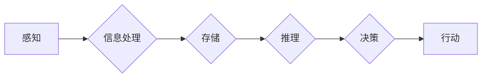

# 认知发展的混沌与简洁化

> 关键词：认知科学，复杂系统，简洁化，模式识别，自组织，大脑，人工智能

## 1. 背景介绍

人类大脑是一个复杂的生物系统，它通过神经元之间的相互作用，实现了对世界的感知、理解和行动。认知科学，这一跨学科领域，旨在理解大脑如何处理信息，如何形成知识，以及如何进行决策。在人工智能的发展过程中，科学家们试图模仿大脑的认知过程，创造出能够学习、推理和决策的智能系统。本文将探讨认知发展的混沌与简洁化，分析大脑如何在复杂性中实现高效的信息处理，以及人工智能如何从中汲取灵感。

## 2. 核心概念与联系

### 2.1 认知科学的核心概念

认知科学涉及多个子领域，包括心理学、神经科学、语言学、哲学和人工智能等。以下是几个核心概念：

- **认知过程**：指信息从感知到记忆、推理、决策和行动的整个过程。
- **神经元**：大脑的基本信息处理单元，通过突触连接形成神经网络。
- **突触**：神经元之间的连接点，信息通过突触进行传递。
- **神经网络**：由大量神经元组成的网络，能够执行复杂的计算任务。

### 2.2 认知科学的架构图

以下是一个简化的认知科学架构图，展示了认知过程的各个阶段：



### 2.3 认知与人工智能的联系

人工智能的发展受到了认知科学的深刻影响。以下是一些关键联系：

- **神经网络**：人工智能中的神经网络受到生物神经网络的启发，用于模拟大脑的认知过程。
- **模式识别**：人工智能中的机器学习算法，如深度学习，用于识别数据中的模式和结构，类似于大脑的视觉和听觉处理。
- **学习与适应**：人工智能系统通过学习算法不断改进其性能，类似于大脑的学习和适应能力。

## 3. 核心算法原理 & 具体操作步骤

### 3.1 算法原理概述

认知科学的核心算法原理涉及如何从复杂的数据中提取简洁的模式。以下是一些关键原理：

- **自组织**：系统在没有外部控制的情况下，通过内部相互作用形成有序结构。
- **简并性**：信息可以通过多种方式表示，但通常存在一种简洁的表示方式。
- **冗余**：系统通过冗余设计提高稳定性和鲁棒性。

### 3.2 算法步骤详解

认知科学的研究通常遵循以下步骤：

1. **数据收集**：收集关于认知过程的数据，包括神经生理数据、行为数据等。
2. **模型构建**：根据数据构建认知模型，模拟认知过程。
3. **模型验证**：通过实验和测试验证模型的准确性。
4. **模型优化**：根据验证结果优化模型。

### 3.3 算法优缺点

- **优点**：认知科学的研究有助于我们理解大脑的工作原理，为人工智能提供理论基础。
- **缺点**：认知科学的研究往往复杂且耗时，模型的验证和优化也面临挑战。

### 3.4 算法应用领域

认知科学的算法原理在以下领域有广泛应用：

- **人工智能**：神经网络、机器学习算法等。
- **心理学**：认知心理学、发展心理学等。
- **神经科学**：神经影像学、神经生理学等。

## 4. 数学模型和公式 & 详细讲解 & 举例说明

### 4.1 数学模型构建

认知科学的数学模型通常涉及概率论、统计学和图论等。以下是一个简单的例子：

- **概率模型**：用于描述信息在神经网络中的传递。
- **统计模型**：用于分析数据中的模式。
- **图论模型**：用于描述神经网络的结构。

### 4.2 公式推导过程

以下是一个简化的概率模型公式：

$$
P(X|Y) = \frac{P(Y|X)P(X)}{P(Y)}
$$

其中，$P(X|Y)$ 是在给定 $Y$ 的条件下 $X$ 的概率，$P(Y|X)$ 是在给定 $X$ 的条件下 $Y$ 的概率。

### 4.3 案例分析与讲解

以下是一个简单的神经网络模型：

- **输入层**：接收外部信息。
- **隐藏层**：执行初步的信息处理。
- **输出层**：输出最终结果。

这个模型可以通过反向传播算法进行训练，以优化输出结果。

## 5. 项目实践：代码实例和详细解释说明

### 5.1 开发环境搭建

为了进行认知科学的研究，需要搭建以下开发环境：

- **编程语言**：Python
- **库**：NumPy、SciPy、TensorFlow、PyTorch等
- **工具**：Jupyter Notebook、matplotlib等

### 5.2 源代码详细实现

以下是一个简单的神经网络模型实现：

```python
import tensorflow as tf

# 创建模型
model = tf.keras.models.Sequential([
    tf.keras.layers.Dense(64, activation='relu', input_shape=(input_dim,)),
    tf.keras.layers.Dense(64, activation='relu'),
    tf.keras.layers.Dense(output_dim)
])

# 编译模型
model.compile(optimizer='adam', loss='mse')

# 训练模型
model.fit(x_train, y_train, epochs=10)

# 评估模型
model.evaluate(x_test, y_test)
```

### 5.3 代码解读与分析

这段代码创建了一个简单的神经网络模型，用于拟合数据。通过反向传播算法优化模型参数，以最小化损失函数。

### 5.4 运行结果展示

在运行上述代码后，我们得到了模型在测试集上的损失值。这个值越小，表示模型的拟合效果越好。

## 6. 实际应用场景

认知科学的研究在以下领域有实际应用：

- **医疗**：通过分析大脑扫描数据，诊断神经系统疾病。
- **教育**：开发个性化学习系统，根据学生的学习习惯和进度进行教学。
- **人机交互**：设计更加自然和智能的用户界面。

### 6.4 未来应用展望

随着认知科学和人工智能的发展，我们可以期待以下应用：

- **智能代理**：能够自主学习和适应环境的智能系统。
- **人机混合智能**：人类和机器协同工作，实现更高效的生产和决策。

## 7. 工具和资源推荐

### 7.1 学习资源推荐

- **书籍**：《认知心理学导论》、《人工神经网络：一种计算范式》
- **网站**：Neurology.org、NeurIPS.org

### 7.2 开发工具推荐

- **编程语言**：Python
- **库**：TensorFlow、PyTorch

### 7.3 相关论文推荐

- **神经科学**：《神经科学原理》、《神经心理学》
- **认知科学**：《认知心理学：思想、语言和行动的心理学基础》

## 8. 总结：未来发展趋势与挑战

### 8.1 研究成果总结

认知科学的研究为我们理解大脑的工作原理提供了新的视角，为人工智能的发展提供了理论基础。

### 8.2 未来发展趋势

- **跨学科研究**：认知科学将继续与其他学科（如心理学、神经科学）进行交叉研究。
- **计算认知科学**：利用计算模型和算法研究认知过程。
- **神经形态工程**：设计能够模仿大脑结构的电子器件。

### 8.3 面临的挑战

- **复杂性**：大脑的复杂性使得认知科学研究面临挑战。
- **数据**：需要更多高质量的数据来支持研究。
- **理论**：需要建立更加完善的认知科学理论。

### 8.4 研究展望

认知科学的研究将不断推动人工智能的发展，帮助我们更好地理解人类大脑，并创造出更加智能的机器。

## 9. 附录：常见问题与解答

**Q1：认知科学与心理学有什么区别？**

A：认知科学是心理学的一个分支，它融合了心理学、神经科学、计算机科学等多个学科，旨在研究认知过程。

**Q2：人工智能能否完全模拟人类大脑？**

A：目前人工智能还无法完全模拟人类大脑，但通过认知科学的研究，我们可以更好地理解大脑的工作原理，为人工智能的发展提供灵感。

**Q3：认知科学的未来发展方向是什么？**

A：认知科学的未来发展方向包括跨学科研究、计算认知科学和神经形态工程等。

作者：禅与计算机程序设计艺术 / Zen and the Art of Computer Programming