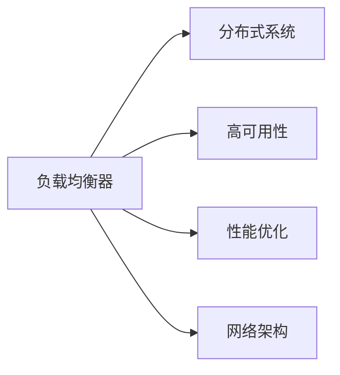

# 负载均衡器在系统扩展中的实例应用

> 关键词：负载均衡器，系统扩展，分布式系统，高可用性，性能优化，网络架构

## 1. 背景介绍

随着互联网和云计算的快速发展，企业对于系统性能、可用性和可扩展性的要求越来越高。负载均衡器作为一种关键的网络组件，能够在系统扩展过程中发挥至关重要的作用。它能够将请求分配到不同的服务器或实例，从而提高系统整体的处理能力和可靠性。本文将深入探讨负载均衡器的原理、应用场景，并结合实际案例进行分析，以帮助读者更好地理解负载均衡器在系统扩展中的重要性。

### 1.1 问题的由来

随着用户量的增长和业务复杂度的提升，单个服务器或实例往往难以满足系统的性能需求。为了解决这个问题，企业通常会采用分布式系统架构，通过增加服务器或实例的数量来提升系统的整体性能和可靠性。然而，如何高效地分发请求，避免单点过载，成为了一个重要问题。

### 1.2 研究现状

目前，市场上存在多种负载均衡器解决方案，包括硬件负载均衡器、软件负载均衡器和云负载均衡器。硬件负载均衡器通常由专门的设备提供，性能强大但成本较高；软件负载均衡器则可以通过在服务器上安装相应的软件来实现，成本较低但性能可能受到服务器性能的限制；云负载均衡器则是云计算平台提供的服务，具有高度可扩展性和灵活性。

### 1.3 研究意义

研究负载均衡器在系统扩展中的应用，对于以下方面具有重要意义：

1. 提高系统性能：通过负载均衡，可以将请求均匀分配到不同的服务器或实例，避免单点过载，从而提高系统的整体性能。
2. 提升系统可靠性：通过冗余部署服务器或实例，可以在单个节点出现故障时，将请求自动切换到其他节点，确保系统的可靠性。
3. 降低维护成本：负载均衡器可以简化系统架构，降低维护成本。
4. 优化用户体验：通过提高系统性能和可靠性，可以优化用户体验，提升客户满意度。

### 1.4 本文结构

本文将按照以下结构展开：

- 第2部分：介绍负载均衡器的核心概念与联系。
- 第3部分：阐述负载均衡器的算法原理和具体操作步骤。
- 第4部分：讲解负载均衡器的数学模型和公式。
- 第5部分：提供负载均衡器的项目实践案例。
- 第6部分：分析负载均衡器在实际应用场景中的应用。
- 第7部分：展望负载均衡器的未来发展趋势和挑战。
- 第8部分：总结全文，并给出研究展望。

## 2. 核心概念与联系

### 2.1 核心概念

#### 负载均衡器

负载均衡器（Load Balancer）是一种网络设备或软件应用，它可以将进入网络的请求分配到不同的服务器或实例上，以达到均衡负载、提高性能和可靠性的目的。

#### 分布式系统

分布式系统（Distributed System）是由多个独立的计算机节点通过网络连接组成的系统，每个节点可以独立运行，共同完成一个或多个任务。

#### 高可用性

高可用性（High Availability）是指系统在面对各种故障时，能够快速恢复到正常状态，确保服务的连续性和稳定性。

#### 性能优化

性能优化（Performance Optimization）是指通过各种技术手段，提高系统处理能力和响应速度的过程。

#### 网络架构

网络架构（Network Architecture）是指计算机网络的结构和组成，包括网络拓扑、通信协议、路由策略等。

### 2.2 关联关系

负载均衡器与分布式系统、高可用性、性能优化和网络架构之间存在着密切的联系。以下是它们之间的逻辑关系：



负载均衡器作为连接分布式系统、高可用性、性能优化和网络架构的桥梁，扮演着至关重要的角色。

## 3. 核心算法原理 & 具体操作步骤

### 3.1 算法原理概述

负载均衡器的基本原理是：根据一定的算法和策略，将进入网络的请求均匀地分配到不同的服务器或实例上。

### 3.2 算法步骤详解

以下是负载均衡器的基本操作步骤：

1. **接收请求**：负载均衡器接收来自客户端的请求。
2. **选择服务器**：根据设定的算法和策略，负载均衡器选择一个可用的服务器或实例。
3. **转发请求**：将请求转发到选定的服务器或实例。
4. **处理请求**：服务器或实例处理请求，并返回响应给客户端。
5. **状态监控**：负载均衡器持续监控服务器或实例的运行状态，如CPU、内存、带宽等。
6. **负载调整**：根据服务器或实例的负载情况，动态调整请求分发策略。

### 3.3 算法优缺点

#### 优点

1. **提高性能**：通过负载均衡，可以将请求均匀分配到不同的服务器或实例，提高系统整体的处理能力和响应速度。
2. **提升可靠性**：通过冗余部署服务器或实例，可以在单个节点出现故障时，将请求自动切换到其他节点，确保系统的可靠性。
3. **灵活配置**：负载均衡器可以灵活配置不同的算法和策略，满足不同场景的需求。

#### 缺点

1. **引入复杂性**：负载均衡器的引入会增加系统的复杂性，需要对其进行管理和维护。
2. **依赖性**：负载均衡器与服务器或实例之间存在依赖关系，一旦负载均衡器出现故障，将影响整个系统的正常运行。

### 3.4 算法应用领域

负载均衡器在以下领域得到广泛应用：

1. **Web应用**：将用户请求分发到多个Web服务器，提高网站性能和可靠性。
2. **电商平台**：将用户订单请求分发到多个应用服务器，提高订单处理速度。
3. **游戏服务器**：将玩家请求分发到多个游戏服务器，提高游戏性能和稳定性。
4. **数据库集群**：将查询请求分发到多个数据库服务器，提高查询处理速度。

## 4. 数学模型和公式 & 详细讲解 & 举例说明

### 4.1 数学模型构建

负载均衡器的数学模型主要包括以下两个方面：

1. **请求分配模型**：用于计算每个服务器或实例应分配的请求数量。
2. **负载预测模型**：用于预测每个服务器或实例的负载情况。

### 4.2 公式推导过程

#### 请求分配模型

假设有N个服务器或实例，每个服务器或实例的负载能力为$C_i$，当前服务器或实例的请求数量为$R_i$，总请求数量为$R$。则每个服务器或实例应分配的请求数量$D_i$可以通过以下公式计算：

$$
D_i = \frac{R}{N} \times \frac{C_i}{\sum_{j=1}^{N}C_j}
$$

#### 负载预测模型

假设每个服务器或实例的负载与CPU使用率、内存使用率、带宽使用率等因素相关。则可以使用以下公式预测每个服务器或实例的负载：

$$
L_i = a \times \text{CPU使用率}_i + b \times \text{内存使用率}_i + c \times \text{带宽使用率}_i
$$

其中，$a$、$b$、$c$为权重系数，可以通过实验进行调整。

### 4.3 案例分析与讲解

假设有一个包含3个Web服务器的系统，每个服务器的CPU使用率为40%、50%、60%，内存使用率为30%、40%、50%，带宽使用率为60%、70%、80%。根据上述公式，可以计算出每个服务器应分配的请求数量和预测负载：

```
服务器1：分配请求量 = 1/3 * (0.4/1.5) * 100 = 26.67，预测负载 = 0.4 * 0.3 + 0.5 * 0.4 + 0.6 * 0.6 = 0.42
服务器2：分配请求量 = 1/3 * (0.5/1.5) * 100 = 33.33，预测负载 = 0.4 * 0.4 + 0.5 * 0.4 + 0.6 * 0.7 = 0.52
服务器3：分配请求量 = 1/3 * (0.6/1.5) * 100 = 40，预测负载 = 0.4 * 0.5 + 0.5 * 0.5 + 0.6 * 0.8 = 0.63
```

根据上述计算结果，可以将请求分配到服务器1、服务器2和服务器3，并关注服务器3的负载情况。如果服务器3的负载超过阈值，可以考虑将其上的部分请求分配到其他服务器。

## 5. 项目实践：代码实例和详细解释说明

### 5.1 开发环境搭建

由于负载均衡器的实现方式多种多样，以下以Python语言为例，使用Flask框架实现一个简单的HTTP负载均衡器。

1. 安装Flask：

```bash
pip install flask
```

### 5.2 源代码详细实现

```python
from flask import Flask, request, jsonify
import requests

app = Flask(__name__)

# 定义服务器列表
servers = [
    'http://server1.example.com',
    'http://server2.example.com',
    'http://server3.example.com'
]

# 定义请求分发函数
def distribute_request(url):
    response = requests.get(url)
    return response.text

# 定义路由
@app.route('/')
def index():
    # 获取请求参数
    url = request.args.get('url')
    if not url:
        return 'URL参数缺失', 400
    # 分发请求
    response = distribute_request(url)
    return response

if __name__ == '__main__':
    app.run(port=8080)
```

### 5.3 代码解读与分析

上述代码实现了一个简单的HTTP负载均衡器，其主要功能是将请求分发到不同的服务器。以下是代码关键部分的解读：

- `servers` 变量存储了可用的服务器列表。
- `distribute_request` 函数用于向指定的服务器发送请求并获取响应。
- `index` 路由处理GET请求，并从请求参数中获取目标URL，然后调用 `distribute_request` 函数进行请求分发。

### 5.4 运行结果展示

启动Flask应用后，可以通过以下URL访问负载均衡器：

```
http://localhost:8080/?url=http://example.com
```

负载均衡器会自动选择一个可用的服务器，并将请求转发到该服务器。你可以使用工具（如Postman）验证请求是否被成功分发。

## 6. 实际应用场景

### 6.1 Web应用

在Web应用中，负载均衡器可以将用户请求分发到多个Web服务器，提高网站的响应速度和稳定性。

### 6.2 电商平台

在电商平台中，负载均衡器可以将订单请求分发到多个应用服务器，提高订单处理速度。

### 6.3 游戏服务器

在游戏服务器中，负载均衡器可以将玩家请求分发到多个游戏服务器，提高游戏性能和稳定性。

### 6.4 数据库集群

在数据库集群中，负载均衡器可以将查询请求分发到多个数据库服务器，提高查询处理速度。

## 7. 工具和资源推荐

### 7.1 学习资源推荐

- 《负载均衡技术详解》
- 《分布式系统设计》
- 《高可用性架构》

### 7.2 开发工具推荐

- Nginx
- HAProxy
- LVS
- Flask

### 7.3 相关论文推荐

- "High-Performance TCP Splicing for Scalable Server Load Balancing"
- "Application Load Balancing: A Comparison of Different Algorithms"
- "A Survey of Load Balancing Techniques for Distributed Systems"

## 8. 总结：未来发展趋势与挑战

### 8.1 研究成果总结

本文对负载均衡器在系统扩展中的应用进行了详细探讨，包括其原理、算法、实践案例等。通过分析，我们可以得出以下结论：

1. 负载均衡器在系统扩展中扮演着至关重要的角色。
2. 负载均衡器的算法和策略多种多样，需要根据实际需求进行选择。
3. 负载均衡器的实现方式包括硬件、软件和云服务等多种形式。

### 8.2 未来发展趋势

1. 负载均衡器将更加智能化，能够根据实时负载情况进行动态调整。
2. 负载均衡器将与其他技术（如容器化、服务网格等）进行融合。
3. 负载均衡器将更加关注安全性，防止恶意攻击。

### 8.3 面临的挑战

1. 如何在保证负载均衡器性能的同时，降低其复杂性和成本。
2. 如何应对网络延迟、丢包等问题，提高负载均衡的可靠性。
3. 如何确保负载均衡器的安全性，防止恶意攻击。

### 8.4 研究展望

未来，负载均衡器将在以下方面进行深入研究：

1. 智能化负载均衡算法。
2. 负载均衡器的安全性和可靠性。
3. 负载均衡器与其他技术的融合。

通过不断研究和创新，负载均衡器将在系统扩展中发挥更加重要的作用，为构建高性能、高可靠性的分布式系统提供有力支持。

## 9. 附录：常见问题与解答

**Q1：负载均衡器与传统DNS负载均衡有什么区别？**

A1：负载均衡器直接在客户端和服务器之间进行请求分发，而DNS负载均衡则是通过更改DNS记录，将请求转发到不同的服务器。因此，负载均衡器能够提供更细粒度的控制，而DNS负载均衡则更适合于简单的负载均衡场景。

**Q2：如何选择合适的负载均衡器算法？**

A2：选择合适的负载均衡器算法需要根据实际需求进行。常见的负载均衡器算法包括轮询、最小连接数、最少响应时间等。轮询算法简单易用，但可能导致服务器负载不均衡；最小连接数算法能够根据当前连接数进行负载均衡，但可能不够灵活；最少响应时间算法能够根据响应时间进行负载均衡，但可能对网络延迟敏感。

**Q3：负载均衡器如何提高安全性？**

A3：负载均衡器可以通过以下方式提高安全性：

- 验证请求来源，防止恶意攻击。
- 使用HTTPS加密通信。
- 配置防火墙，限制访问权限。
- 定期更新和维护负载均衡器。

**Q4：如何应对负载均衡器的单点故障？**

A4：可以通过以下方式应对负载均衡器的单点故障：

- 部署多个负载均衡器，实现冗余。
- 使用集群管理工具，实现负载均衡器的自动化故障转移。
- 将负载均衡器部署在虚拟化环境中，提高其可扩展性和可靠性。

**Q5：负载均衡器如何与容器化技术结合？**

A5：负载均衡器可以与容器化技术结合，实现容器服务的自动扩展和负载均衡。例如，可以使用Kubernetes等容器编排工具，将负载均衡器部署在容器中，并使用Ingress资源进行请求路由。

作者：禅与计算机程序设计艺术 / Zen and the Art of Computer Programming