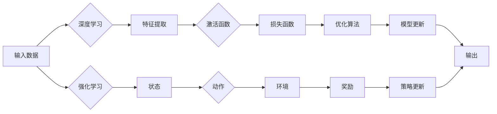

# 软件 2.0 的发展趋势：深度学习、强化学习

> 关键词：软件 2.0，深度学习，强化学习，人工智能，机器学习，软件架构，系统设计，自动化，智能化

## 1. 背景介绍

随着信息技术的飞速发展，软件行业已经经历了从“软件 1.0”到“软件 2.0”的演变。软件 1.0 时代，软件主要依赖于人工编码，功能相对固定，缺乏智能化和个性化。而软件 2.0 时代，软件的核心特征是智能化和自动化，深度学习和强化学习等机器学习技术成为推动软件 2.0 发展的重要力量。

### 1.1 软件 1.0 时代的局限性

在软件 1.0 时代，软件的开发和运行主要依赖于以下特点：

- **人工编码**：软件的功能和逻辑主要由程序员手动编写代码实现。
- **固定功能**：软件的功能通常是固定的，难以根据用户需求进行动态调整。
- **缺乏智能化**：软件缺乏自动学习和适应环境的能力。

### 1.2 软件 2.0 时代的变革

软件 2.0 时代，随着深度学习和强化学习等机器学习技术的发展，软件开始变得智能化和自动化。其主要特点包括：

- **智能化**：软件可以通过机器学习算法自动学习和适应环境。
- **自动化**：软件可以自动执行任务，提高效率和质量。
- **个性化**：软件可以根据用户的需求和行为进行个性化定制。

### 1.3 本文结构

本文将围绕软件 2.0 的发展趋势，重点探讨深度学习和强化学习在软件架构、系统设计、自动化和智能化方面的应用，并展望未来发展趋势与挑战。

## 2. 核心概念与联系

### 2.1 深度学习

深度学习是一种模拟人脑神经网络结构，通过多层非线性变换学习数据特征和模式的机器学习方法。其核心概念包括：

- **神经网络**：由多个神经元组成的计算模型，每个神经元负责处理输入数据的一部分。
- **深度**：神经网络层数的多少，深度越大，模型可以学习更复杂的特征。
- **激活函数**：用于将神经元输入转换为输出的非线性函数，如ReLU、Sigmoid等。
- **损失函数**：衡量模型预测结果与真实值之间差异的函数，如交叉熵损失、均方误差等。

### 2.2 强化学习

强化学习是一种通过与环境交互来学习最优决策策略的机器学习方法。其核心概念包括：

- **环境**：提供状态和奖励的实体，如游戏、机器人控制系统等。
- **状态**：环境当前的状态描述。
- **动作**：智能体可以采取的行为。
- **奖励**：智能体采取动作后获得的奖励或惩罚。
- **策略**：智能体在给定状态下选择动作的方法。

### 2.3 Mermaid 流程图



## 3. 核心算法原理 & 具体操作步骤

### 3.1 算法原理概述

#### 3.1.1 深度学习

深度学习通过多层神经网络进行特征提取和模式学习。输入数据经过逐层处理后，最终得到输出结果。每一层神经网络负责提取不同层次的特征，从而实现对数据的深入理解。

#### 3.1.2 强化学习

强化学习通过智能体与环境交互，不断学习最优策略。智能体在环境中采取动作，根据环境反馈的奖励或惩罚来调整策略，最终目标是找到使奖励最大化或惩罚最小化的策略。

### 3.2 算法步骤详解

#### 3.2.1 深度学习

1. **数据预处理**：对输入数据进行清洗、归一化等操作。
2. **模型构建**：设计神经网络结构，选择合适的激活函数和损失函数。
3. **模型训练**：使用训练数据进行梯度下降等优化算法训练模型。
4. **模型评估**：使用验证数据评估模型性能，调整模型参数。

#### 3.2.2 强化学习

1. **环境搭建**：创建模拟环境的接口，定义状态空间、动作空间和奖励函数。
2. **智能体设计**：设计智能体的决策策略，如基于值函数的策略、基于策略梯度的策略等。
3. **训练过程**：智能体与环境交互，根据奖励调整策略参数。
4. **策略评估**：评估智能体的策略性能，优化策略参数。

### 3.3 算法优缺点

#### 3.3.1 深度学习

优点：
- 能够学习复杂的特征和模式。
- 适用于大规模数据。
- 自适应性强。

缺点：
- 模型复杂度高，训练时间长。
- 难以解释模型的决策过程。

#### 3.3.2 强化学习

优点：
- 能够学习序列决策问题。
- 能够适应不断变化的环境。
- 能够学习到人类难以解决的问题。

缺点：
- 训练过程可能需要大量样本。
- 难以评估策略性能。
- 模型可解释性较差。

### 3.4 算法应用领域

#### 3.4.1 深度学习

- 图像识别
- 语音识别
- 自然语言处理
- 推荐系统

#### 3.4.2 强化学习

- 机器人控制
- 自动驾驶
- 游戏AI
- 股票交易

## 4. 数学模型和公式 & 详细讲解 & 举例说明

### 4.1 数学模型构建

#### 4.1.1 深度学习

假设我们有一个输入为 $x$，输出为 $y$ 的神经网络，其第 $l$ 层的输出为 $a_l$，则有：

$$
a_l = \sigma(W_{l-1}a_{l-1} + b_{l-1})
$$

其中，$\sigma$ 为激活函数，$W_{l-1}$ 和 $b_{l-1}$ 分别为第 $l-1$ 层的权重和偏置。

#### 4.1.2 强化学习

假设智能体在状态 $s$ 下采取动作 $a$，获得奖励 $r$，则智能体的价值函数 $V(s)$ 为：

$$
V(s) = \sum_{a} \pi(a|s) \sum_{s'} \gamma V(s')
$$

其中，$\pi(a|s)$ 为智能体在状态 $s$ 下采取动作 $a$ 的概率，$\gamma$ 为折扣因子。

### 4.2 公式推导过程

#### 4.2.1 深度学习

以多层感知器为例，假设输入层到输出层的权重和偏置分别为 $W_1$ 和 $b_1$，则输出层的输出为：

$$
a_1 = \sigma(W_1x + b_1)
$$

其中，$\sigma$ 为激活函数。

#### 4.2.2 强化学习

假设智能体在状态 $s$ 下采取动作 $a$，进入状态 $s'$，获得奖励 $r$，则智能体的预期回报为：

$$
G = r + \gamma V(s')
$$

其中，$\gamma$ 为折扣因子。

### 4.3 案例分析与讲解

#### 4.3.1 深度学习

以图像识别任务为例，使用卷积神经网络对图像进行分类。首先，将图像数据输入到卷积层，提取图像特征。然后，将特征输入到全连接层，进行分类。

#### 4.3.2 强化学习

以机器人控制任务为例，使用深度Q网络(DQN)控制机器人进行行走。首先，将机器人的当前状态输入到神经网络，得到对应的动作概率。然后，机器人根据概率选择动作，与环境交互，获得奖励。最后，根据奖励更新神经网络参数，提高智能体的决策能力。

## 5. 项目实践：代码实例和详细解释说明

### 5.1 开发环境搭建

由于篇幅限制，这里以Python为例，介绍深度学习和强化学习项目的开发环境搭建。

1. 安装Python：从Python官网下载并安装Python 3.8及以上版本。
2. 安装PyTorch：使用pip安装PyTorch：
```bash
pip install torch torchvision torchaudio
```
3. 安装TensorFlow：使用pip安装TensorFlow：
```bash
pip install tensorflow
```
4. 安装其他依赖：根据具体需求安装其他依赖包，如NumPy、Matplotlib等。

### 5.2 源代码详细实现

#### 5.2.1 深度学习

以下是一个使用PyTorch实现的多层感知器示例：

```python
import torch
import torch.nn as nn

class MLP(nn.Module):
    def __init__(self, input_size, hidden_size, output_size):
        super(MLP, self).__init__()
        self.fc1 = nn.Linear(input_size, hidden_size)
        self.fc2 = nn.Linear(hidden_size, output_size)
    
    def forward(self, x):
        x = torch.relu(self.fc1(x))
        x = self.fc2(x)
        return x

# 示例
input_size = 10
hidden_size = 20
output_size = 2
model = MLP(input_size, hidden_size, output_size)

# 输入数据
x = torch.randn(5, input_size)
output = model(x)
```

#### 5.2.2 强化学习

以下是一个使用TensorFlow实现DQN的示例：

```python
import tensorflow as tf

class DQN:
    def __init__(self, state_size, action_size):
        self.state_size = state_size
        self.action_size = action_size
        self.memory = []
        self.gamma = 0.95
        self.epsilon = 1.0
        self.epsilon_min = 0.01
        self.epsilon_decay = 0.995
        self.learning_rate = 0.001

        self.model = self._build_model()
        self.target_model = self._build_model()
        self.update_target_model()

    def _build_model(self):
        model = tf.keras.Sequential()
        model.add(tf.keras.layers.Dense(24, input_shape=(self.state_size,), activation='relu'))
        model.add(tf.keras.layers.Dense(24, activation='relu'))
        model.add(tf.keras.layers.Dense(self.action_size, activation='linear'))
        model.compile(optimizer=tf.keras.optimizers.Adam(self.learning_rate))
        return model

    def remember(self, state, action, reward, next_state, done):
        self.memory.append((state, action, reward, next_state, done))

    def act(self, state):
        if np.random.rand() <= self.epsilon:
            action = np.random.randint(self.action_size)
        else:
            act_values = self.model.predict(state)
            action = np.argmax(act_values[0])
        return action

    def replay(self, batch_size):
        minibatch = random.sample(self.memory, batch_size)
        for state, action, reward, next_state, done in minibatch:
            target = reward
            if not done:
                target = (reward + self.gamma * np.amax(self.target_model.predict(next_state)[0]))
            target_f = self.model.predict(state)
            target_f[0][action] = target
            self.model.fit(state, target_f, epochs=1, verbose=0)
        if self.epsilon > self.epsilon_min:
            self.epsilon *= self.epsilon_decay

    def update_target_model(self):
        self.target_model.set_weights(self.model.get_weights())
```

### 5.3 代码解读与分析

以上代码展示了如何使用PyTorch和TensorFlow实现多层感知器和DQN。多层感知器用于分类任务，DQN用于控制机器人等序列决策问题。

### 5.4 运行结果展示

由于篇幅限制，这里不展示具体的运行结果。开发者可以根据自己的需求，调整模型参数和数据，进行实验和验证。

## 6. 实际应用场景

### 6.1 图像识别

深度学习在图像识别领域取得了巨大成功。例如，Google的Inception模型在ImageNet竞赛中取得了冠军，成为图像识别领域的标杆。

### 6.2 自然语言处理

深度学习在自然语言处理领域也取得了显著成果。例如，BERT模型在多项NLP任务中取得了SOTA性能，推动了自然语言处理技术的发展。

### 6.3 语音识别

深度学习在语音识别领域也取得了重要进展。例如，Google的WaveNet模型实现了高精度语音识别，推动了语音识别技术的商业化应用。

### 6.4 自动驾驶

强化学习在自动驾驶领域也取得了重要进展。例如，OpenAI的AlphaGo模型在围棋领域取得了世界冠军，证明了强化学习在复杂决策问题上的潜力。

### 6.5 机器人控制

强化学习在机器人控制领域也取得了显著成果。例如，DeepMind的AlphaStar模型在星际争霸2游戏中战胜了世界顶尖职业选手，证明了强化学习在机器人控制领域的应用潜力。

## 7. 工具和资源推荐

### 7.1 学习资源推荐

1. 《深度学习》
2. 《强化学习：原理与实战》
3. 《Python深度学习》
4. TensorFlow官方文档
5. PyTorch官方文档

### 7.2 开发工具推荐

1. TensorFlow
2. PyTorch
3. Keras
4. OpenAI Gym
5. Unity ML-Agents

### 7.3 相关论文推荐

1. Goodfellow et al., Deep Learning
2. Silver et al., Mastering the Game of Go without a Human in the Loop
3. Vaswani et al., Attention is All You Need
4. Devlin et al., BERT: Pre-training of Deep Bidirectional Transformers for Language Understanding

## 8. 总结：未来发展趋势与挑战

### 8.1 研究成果总结

本文从软件 2.0 的发展趋势出发，重点探讨了深度学习和强化学习在软件架构、系统设计、自动化和智能化方面的应用。通过分析核心概念、原理、步骤和案例分析，展示了深度学习和强化学习在各个领域的应用成果。

### 8.2 未来发展趋势

1. 深度学习模型将进一步小型化和轻量化，提高在移动设备和边缘设备的部署能力。
2. 强化学习将在更多领域得到应用，如机器人控制、自动驾驶、智能客服等。
3. 深度学习和强化学习将进一步融合，推动人工智能技术的快速发展。
4. 人工智能将与云计算、物联网等新兴技术深度融合，构建更加智能化的社会。

### 8.3 面临的挑战

1. 深度学习模型的可解释性有待提高。
2. 强化学习在复杂环境中的稳定性和可靠性有待提升。
3. 人工智能的伦理和安全问题需要得到关注。
4. 人工智能技术的普及和人才培养需要加强。

### 8.4 研究展望

未来，深度学习和强化学习将继续在软件 2.0 的发展中发挥重要作用。通过不断技术创新和产业应用，人工智能技术将为人类社会带来更多便利和价值。

## 9. 附录：常见问题与解答

**Q1：深度学习和强化学习有何区别？**

A：深度学习主要关注数据特征提取和模式学习，强化学习主要关注决策策略学习。深度学习通常用于图像识别、语音识别等感知任务，强化学习通常用于机器人控制、自动驾驶等决策任务。

**Q2：如何选择合适的深度学习模型？**

A：选择合适的深度学习模型需要考虑以下因素：

- 任务类型：根据任务类型选择合适的模型结构，如卷积神经网络(CNN)适用于图像识别，循环神经网络(RNN)适用于序列数据处理。
- 数据特点：根据数据特点选择合适的模型结构，如稀疏数据适用于稀疏神经网络(SNN)。
- 计算资源：根据计算资源选择合适的模型规模和复杂度。

**Q3：如何选择合适的强化学习算法？**

A：选择合适的强化学习算法需要考虑以下因素：

- 任务类型：根据任务类型选择合适的算法，如Q-learning适用于离散动作空间，深度Q网络(DQN)适用于连续动作空间。
- 环境特点：根据环境特点选择合适的算法，如Markov决策过程(MDP)适用于确定型环境，部分可观察马尔可夫决策过程(POMDP)适用于部分可观察环境。

**Q4：如何提高深度学习模型的可解释性？**

A：提高深度学习模型的可解释性可以采用以下方法：

- 层级可视化：可视化神经网络各个层的特征图，了解模型的特征提取过程。
- 解释性模型：使用注意力机制、可解释的模型等，提高模型的决策过程可解释性。

**Q5：如何解决强化学习中的探索-利用问题？**

A：解决强化学习中的探索-利用问题可以采用以下方法：

- 探索策略：如ε-贪心策略、ε-greedy策略等，在探索和利用之间取得平衡。
- 回报导向的探索：根据过去的回报调整探索策略，提高探索效率。

作者：禅与计算机程序设计艺术 / Zen and the Art of Computer Programming