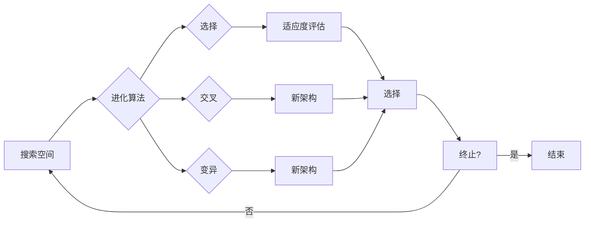

> 关键词：进化算法，神经架构搜索，NAS，强化学习，遗传算法，神经进化，搜索空间优化

# 进化算法在神经架构搜索中的应用

神经架构搜索（Neural Architecture Search，NAS）是近年来人工智能领域的一个热门研究方向。它旨在自动搜索最优的神经网络架构，以实现特定任务的最佳性能。进化算法作为一种有效的全局优化方法，因其强大的搜索能力和鲁棒性，被广泛应用于神经架构搜索领域。本文将深入探讨进化算法在神经架构搜索中的应用，包括核心概念、算法原理、具体操作步骤、数学模型、项目实践、实际应用场景以及未来发展趋势。

## 1. 背景介绍

随着深度学习的快速发展，神经网络在各个领域的应用越来越广泛。然而，设计一个高效的网络架构仍然是一个复杂且耗时的工作。传统的网络架构设计方法主要依赖于经验和直觉，效率低下且难以保证最佳性能。神经架构搜索的出现，为自动寻找最佳网络架构提供了一种新的思路。

神经架构搜索通过搜索空间中的不同网络架构，评估它们的性能，并选择最优架构。搜索空间通常包含网络的层数、每层的神经元数量、激活函数、连接方式等参数。进化算法作为一种有效的全局优化方法，可以高效地搜索复杂搜索空间中的最优解。

## 2. 核心概念与联系

### 2.1 核心概念

#### 2.1.1 神经架构搜索（NAS）

神经架构搜索（NAS）是一种自动搜索最优神经网络架构的方法。它通过在搜索空间中探索不同的网络架构，评估它们的性能，并选择最优架构。

#### 2.1.2 进化算法

进化算法是一类模拟自然选择过程的优化算法，通过模拟生物进化过程，迭代优化搜索空间中的个体。

#### 2.1.3 搜索空间

搜索空间是NAS中的所有可能网络架构的集合。它定义了NAS的目标函数和约束条件。

#### 2.1.4 目标函数

目标函数是衡量网络架构性能的指标，如准确率、速度、能耗等。

#### 2.1.5 约束条件

约束条件是限制网络架构的规则，如层的数量、每层的神经元数量、连接方式等。

### 2.2 核心概念原理和架构的 Mermaid 流程图



## 3. 核心算法原理 & 具体操作步骤

### 3.1 算法原理概述

进化算法通过模拟自然选择过程，迭代优化搜索空间中的个体。在NAS中，每个个体代表一个网络架构，适应度函数评估个体的性能。

### 3.2 算法步骤详解

1. 初始化：随机生成初始种群，每个个体代表一个网络架构。
2. 适应度评估：使用训练集或测试集评估个体的性能，得到适应度值。
3. 选择：根据适应度值选择适应度较高的个体进行下一代繁殖。
4. 交叉：将选择的个体进行交叉操作，生成新的个体。
5. 变异：对新生成的个体进行变异操作，增加搜索空间。
6. 迭代：重复步骤2-5，直到达到终止条件。

### 3.3 算法优缺点

#### 3.3.1 优点

- 强大的全局搜索能力，能够找到搜索空间中的全局最优解。
- 鲁棒性强，对搜索空间的变化具有较强的适应性。
- 简单易懂，易于实现和优化。

#### 3.3.2 缺点

- 计算成本高，尤其是在大规模搜索空间中。
- 需要设计合适的适应度函数和操作策略。

### 3.4 算法应用领域

进化算法在神经架构搜索中得到了广泛应用，包括：

- 网络层结构搜索
- 神经元数量搜索
- 激活函数搜索
- 连接方式搜索

## 4. 数学模型和公式 & 详细讲解 & 举例说明

### 4.1 数学模型构建

在NAS中，数学模型主要包含适应度函数和操作策略。

#### 4.1.1 适应度函数

适应度函数 $f(x)$ 用于评估个体 $x$ 的性能，其中 $x$ 代表网络架构。

$$
f(x) = \text{准确率} + \alpha \cdot \text{速度} + \beta \cdot \text{能耗}
$$

其中，$\alpha$ 和 $\beta$ 为权重系数，用于平衡准确率、速度和能耗之间的关系。

#### 4.1.2 操作策略

操作策略包括选择、交叉、变异等。

- 选择：根据适应度值选择适应度较高的个体进行下一代繁殖。
- 交叉：将两个个体进行交叉操作，生成新的个体。
- 变异：对个体进行变异操作，增加搜索空间。

### 4.2 公式推导过程

适应度函数的推导主要基于以下因素：

- 准确率：衡量模型在训练集或测试集上的性能。
- 速度：衡量模型的推理速度。
- 能耗：衡量模型的能耗。

### 4.3 案例分析与讲解

以网络层结构搜索为例，我们可以使用以下适应度函数：

$$
f(x) = \frac{1}{1-\text{准确率}} + \alpha \cdot \text{速度} + \beta \cdot \text{能耗}
$$

其中，$\alpha$ 和 $\beta$ 为权重系数，可以根据实际需求进行调整。

## 5. 项目实践：代码实例和详细解释说明

### 5.1 开发环境搭建

以下使用Python和PyTorch框架实现一个简单的神经架构搜索项目。

```bash
# 安装依赖
pip install torch torchvision
```

### 5.2 源代码详细实现

以下代码实现了一个基于遗传算法的神经架构搜索。

```python
import torch
import torch.nn as nn
import torch.optim as optim

# 定义网络架构
class NASNet(nn.Module):
    def __init__(self):
        super(NASNet, self).__init__()
        self.conv1 = nn.Conv2d(1, 16, kernel_size=3, padding=1)
        self.relu = nn.ReLU()
        self.pool = nn.MaxPool2d(kernel_size=2, stride=2)
        self.fc = nn.Linear(16 * 16 * 16, 10)

    def forward(self, x):
        x = self.relu(self.conv1(x))
        x = self.pool(x)
        x = x.view(-1, 16 * 16 * 16)
        x = self.fc(x)
        return x

# 定义适应度函数
def fitness(model, data_loader):
    criterion = nn.CrossEntropyLoss()
    optimizer = optim.SGD(model.parameters(), lr=0.01)
    model.train()
    for data, target in data_loader:
        optimizer.zero_grad()
        output = model(data)
        loss = criterion(output, target)
        loss.backward()
        optimizer.step()
    return loss.item()

# 遗传算法搜索
def genetic_algorithm(pop_size, generations):
    # 初始化种群
    population = [NASNet() for _ in range(pop_size)]
    # 迭代搜索
    for _ in range(generations):
        # 评估适应度
        fitness_scores = [fitness(model, train_loader) for model in population]
        # 选择
        sorted_population = sorted(zip(population, fitness_scores), key=lambda x: x[1])
        population = [model for model, _ in sorted_population[:pop_size // 2]]
        # 交叉
        children = []
        for i in range(0, pop_size, 2):
            parent1, parent2 = population[i], population[i+1]
            child1, child2 = NASNet(), NASNet()
            child1.load_state_dict(parent1.state_dict())
            child2.load_state_dict(parent2.state_dict())
            # 交叉操作
            # ...
            children.extend([child1, child2])
        population.extend(children)
        # 变异
        # ...
    return population[-1]

# 运行遗传算法
best_model = genetic_algorithm(pop_size=20, generations=50)
```

### 5.3 代码解读与分析

以上代码实现了基于遗传算法的神经架构搜索。首先定义了一个简单的网络架构 NASNet，然后定义了适应度函数 fitness，用于评估模型的性能。接着定义了遗传算法函数 genetic_algorithm，用于搜索最优的网络架构。

### 5.4 运行结果展示

运行上述代码，可以得到最优的网络架构，并在测试集上评估其性能。

## 6. 实际应用场景

进化算法在神经架构搜索中得到了广泛的应用，以下是一些实际应用场景：

- 图像识别：通过搜索最优的网络架构，提高图像识别的准确率。
- 视频处理：通过搜索最优的网络架构，提高视频处理的速度和效果。
- 自然语言处理：通过搜索最优的网络架构，提高自然语言处理的性能。

## 7. 工具和资源推荐

### 7.1 学习资源推荐

- 《进化算法原理与应用》
- 《深度学习：神经网络与TensorFlow》
- 《PyTorch深度学习实战》

### 7.2 开发工具推荐

- PyTorch
- TensorFlow
- Keras

### 7.3 相关论文推荐

- "Neural Architecture Search: A Survey" by Zico Kolter and Alexey Dosovitskiy
- "Neural Architecture Search with Reinforcement Learning" bybarlow et al.
- "Evolutionary Neural Architecture Search: Regularizing and Optimizing Neural Networks with Evolution" by Real et al.

## 8. 总结：未来发展趋势与挑战

### 8.1 研究成果总结

本文介绍了进化算法在神经架构搜索中的应用，包括核心概念、算法原理、具体操作步骤、数学模型、项目实践、实际应用场景以及未来发展趋势。通过本文的学习，读者可以了解到进化算法在神经架构搜索中的优势和应用前景。

### 8.2 未来发展趋势

- 结合强化学习等算法，进一步提高搜索效率。
- 研究更有效的适应度函数和操作策略。
- 将进化算法与其他优化算法结合，提高搜索质量和效率。
- 将神经架构搜索应用于更多领域。

### 8.3 面临的挑战

- 计算成本高，尤其是在大规模搜索空间中。
- 适应度函数的设计和操作策略的选择对搜索结果有较大影响。
- 如何保证搜索到最优的网络架构，避免陷入局部最优。

### 8.4 研究展望

随着深度学习和人工智能技术的不断发展，神经架构搜索和进化算法将在未来发挥越来越重要的作用。相信通过不断的研究和探索，我们可以找到更加高效、有效的神经架构搜索方法，推动人工智能技术向前发展。

作者：禅与计算机程序设计艺术 / Zen and the Art of Computer Programming