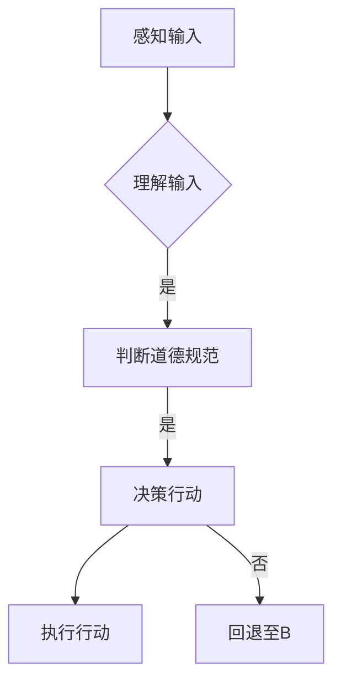

# 道德意识：道德意识就是在工作和生活中认真做出选择，并怀揣善意行事

> 关键词：道德意识，伦理，人工智能，工作生活，选择，善意，责任，技术伦理

## 1. 背景介绍

在信息爆炸和科技飞速发展的时代，人工智能（AI）已经深入到我们的工作和生活的方方面面。从自动驾驶汽车到智能语音助手，从在线购物推荐到医疗诊断系统，AI的应用几乎无处不在。然而，随着AI技术的普及，一个不容忽视的问题也逐渐浮出水面：如何确保AI系统在执行任务的同时，也能遵循道德和伦理原则？

道德意识，即对正确与错误、善与恶的判断能力，是每个个体在工作和生活中做出合理选择的基石。对于AI系统而言，道德意识的缺失可能导致不可预测的后果，甚至对人类造成伤害。因此，探讨如何在AI系统中嵌入道德意识，使其成为我们信赖的伙伴，成为了当务之急。

## 2. 核心概念与联系

### 2.1 道德意识的定义

道德意识是指在特定的社会和文化背景下，个体对道德原则的理解和遵循能力。它包括对道德规范的认识、对道德价值的认同以及对道德行为的自觉践行。

### 2.2 道德意识与AI的关系

AI系统的道德意识是指AI系统能够理解道德规范、遵循道德原则，并在执行任务时做出符合道德的选择。这需要AI系统具备以下能力：

- **理解能力**：理解人类语言、图像、声音等输入，并从中提取道德相关的信息。
- **判断能力**：根据道德原则对情境进行分析，判断哪种行为是正确的。
- **决策能力**：在多个可能的行动方案中，选择符合道德原则的行动。

### 2.3 Mermaid流程图

以下是一个简化的Mermaid流程图，展示了道德意识在AI系统中的应用流程：



## 3. 核心算法原理 & 具体操作步骤

### 3.1 算法原理概述

要实现AI系统的道德意识，需要以下几个关键步骤：

1. **道德规范的定义**：明确AI系统需要遵循的道德规范，如隐私保护、公平性、透明度等。
2. **道德知识的获取**：从文本、案例、专家意见等多渠道获取道德知识。
3. **道德推理引擎**：构建能够进行道德推理的算法，用于分析情境并做出道德判断。
4. **道德决策机制**：根据道德推理的结果，选择符合道德规范的行动方案。
5. **道德反馈机制**：对AI系统的行为进行监督和评估，确保其遵守道德规范。

### 3.2 算法步骤详解

1. **道德规范的定义**：通过专家咨询、伦理研究、法律法规等方式，明确AI系统需要遵循的道德规范。
2. **道德知识的获取**：利用自然语言处理、知识图谱等技术，从文本、案例、专家意见等多渠道获取道德知识。
3. **道德推理引擎**：构建基于逻辑、规则或机器学习方法的道德推理引擎，用于分析情境并判断哪种行动方案是道德的。
4. **道德决策机制**：根据道德推理的结果，选择符合道德规范的行动方案，并生成相应的行动指令。
5. **道德反馈机制**：对AI系统的行为进行实时监控和评估，确保其遵守道德规范。如果发现AI系统的行为违背道德规范，应立即采取措施进行调整。

### 3.3 算法优缺点

**优点**：

- 提高AI系统的道德水平，使其在执行任务时更加符合伦理原则。
- 降低AI系统造成伤害的风险，保障人类的安全和权益。
- 增强公众对AI技术的信任，促进AI技术的健康发展。

**缺点**：

- 道德知识的获取和推理过程复杂，需要大量的资源和时间。
- 道德规范的定义存在主观性，可能因地区、文化等因素而有所不同。
- 道德反馈机制的设计和实施存在困难，难以确保AI系统完全遵守道德规范。

### 3.4 算法应用领域

道德意识在AI系统中的应用领域非常广泛，以下是一些典型的应用场景：

- 自动驾驶汽车：确保自动驾驶车辆在遇到道德困境时，能够做出符合伦理原则的决策。
- 医疗诊断系统：确保AI系统在诊断过程中，尊重患者的隐私和知情权。
- 智能语音助手：避免AI系统在回答问题时传播虚假信息或歧视性言论。
- 在线教育平台：确保AI系统在推荐课程和内容时，尊重用户的兴趣和价值观。

## 4. 数学模型和公式 & 详细讲解 & 举例说明

### 4.1 数学模型构建

道德意识的数学模型通常基于逻辑、概率论、模糊逻辑等数学理论。以下是一个简化的道德推理模型的构建过程：

1. **定义道德规范**：将道德规范表示为逻辑公式，如 $P(A \rightarrow B)$ 表示“如果A，则B是正确的”。
2. **获取道德知识**：将道德知识表示为知识图谱或规则，如 $R(A,B,C)$ 表示“如果A且B，则C是正确的”。
3. **构建推理引擎**：根据道德规范和道德知识，构建逻辑推理引擎，用于推理道德判断。
4. **决策机制**：根据推理结果，选择符合道德规范的行动方案。

### 4.2 公式推导过程

以下是一个简单的道德推理公式的推导过程：

**公式**：$R(A,B,C) \land P(A \rightarrow B) \Rightarrow C$

**推导过程**：

1. $R(A,B,C)$：如果A且B，则C是正确的。
2. $P(A \rightarrow B)$：如果A，则B是正确的。
3. 结合1和2，可以得到：$R(A,B,C) \land P(A \rightarrow B) \Rightarrow C$

### 4.3 案例分析与讲解

以下是一个关于自动驾驶汽车的道德推理案例：

**情境**：一辆自动驾驶汽车在路口遇到红灯，但前方有行人正在过马路。

**道德规范**：保护行人安全。

**推理过程**：

1. $R(红灯, 行人过马路, 汽车刹车)$：如果红灯且行人过马路，则汽车刹车是正确的。
2. $P(红灯 \rightarrow 行人过马路)$：如果红灯，则行人可能会过马路。
3. 结合1和2，可以得到：$R(红灯, 行人过马路, 汽车刹车) \land P(红灯 \rightarrow 行人过马路) \Rightarrow 汽车刹车$

因此，根据道德推理，自动驾驶汽车应该选择刹车，以保护行人的安全。

## 5. 项目实践：代码实例和详细解释说明

### 5.1 开发环境搭建

由于道德意识的实现涉及到多个技术和领域，以下是一个简化的开发环境搭建过程：

1. **编程语言**：选择Python等易于开发和维护的语言。
2. **开发框架**：选择PyTorch、TensorFlow等流行的深度学习框架。
3. **自然语言处理库**：选择NLTK、spaCy等自然语言处理库。
4. **知识图谱库**：选择Neo4j、JanusGraph等知识图谱库。

### 5.2 源代码详细实现

以下是一个简化的道德推理代码示例：

```python
import networkx as nx

# 构建知识图谱
G = nx.DiGraph()
G.add_edge("红灯", "行人过马路", condition="汽车刹车")
G.add_edge("红灯", "行人过马路", condition="等待")

# 道德推理
def moral_reasoning(G, premise):
    for edge in G.edges(data=True):
        if edge[1]["condition"] == premise:
            return True
    return False

# 案例分析
premise = "红灯"
result = moral_reasoning(G, premise)
if result:
    print("根据道德推理，应执行操作：汽车刹车或等待")
else:
    print("无法根据当前情境做出道德决策")
```

### 5.3 代码解读与分析

这段代码首先构建了一个简单的知识图谱，其中包含了红灯和行人过马路之间的条件关系。然后，定义了一个`moral_reasoning`函数，用于根据前提条件进行道德推理。最后，通过一个简单的案例分析了道德推理的过程。

### 5.4 运行结果展示

当运行上述代码时，会输出以下结果：

```
根据道德推理，应执行操作：汽车刹车或等待
```

这表明根据当前的道德知识，当遇到红灯时，自动驾驶汽车应该选择刹车或等待。

## 6. 实际应用场景

### 6.1 自动驾驶汽车

自动驾驶汽车是道德意识应用的重要场景。例如，当自动驾驶汽车在行驶过程中遇到前方有行人正在过马路的情况时，道德意识可以帮助汽车判断是否应该停车避让行人。

### 6.2 医疗诊断系统

医疗诊断系统中的道德意识可以帮助系统在诊断过程中尊重患者的隐私和知情权。例如，当系统需要获取患者的敏感信息时，道德意识可以帮助系统判断是否需要征得患者的同意。

### 6.3 智能语音助手

智能语音助手中的道德意识可以帮助系统避免传播虚假信息或歧视性言论。例如，当用户询问关于某个特定群体的信息时，道德意识可以帮助系统判断是否应该避免使用歧视性语言。

## 7. 工具和资源推荐

### 7.1 学习资源推荐

- 《人工智能伦理学》
- 《机器学习伦理》
- 《计算机伦理学》

### 7.2 开发工具推荐

- PyTorch
- TensorFlow
- NLTK
- spaCy
- Neo4j

### 7.3 相关论文推荐

- "Ethical AI: Designing Responsible AI Systems"
- "Ethical Considerations in AI: A Survey"
- "AI and Ethics: The Need for a Common Framework"

## 8. 总结：未来发展趋势与挑战

### 8.1 研究成果总结

本文从道德意识的概念出发，探讨了道德意识在AI系统中的应用。通过对道德意识的定义、原理、算法和案例的分析，展示了道德意识在AI系统中的重要性。同时，本文还介绍了道德意识的实现方法、工具和资源，为开发者提供了实用的指导。

### 8.2 未来发展趋势

随着AI技术的不断发展和伦理研究的深入，未来道德意识在AI系统中的应用将呈现以下趋势：

- 道德知识的获取和推理将更加智能化，更加符合人类价值观。
- 道德决策机制将更加完善，能够更好地应对复杂的道德困境。
- 道德反馈机制将更加高效，能够及时发现和纠正AI系统的道德问题。

### 8.3 面临的挑战

尽管道德意识在AI系统中的应用前景广阔，但仍面临着以下挑战：

- 道德知识的获取和推理需要更多的跨学科研究。
- 道德规范的定义存在主观性，需要建立更加完善的伦理规范体系。
- 道德意识的实现需要更多的技术和方法创新。

### 8.4 研究展望

为了应对上述挑战，未来的研究应重点关注以下方向：

- 开发更加智能化、高效化的道德知识获取和推理方法。
- 建立更加完善的伦理规范体系，为AI系统的道德决策提供指导。
- 探索更加灵活、可靠的道德反馈机制，确保AI系统始终遵循道德规范。

通过不断的研究和探索，我们有理由相信，道德意识将在AI系统中发挥越来越重要的作用，为构建一个更加美好的未来贡献力量。

## 9. 附录：常见问题与解答

**Q1：道德意识在AI系统中的具体应用有哪些？**

A：道德意识在AI系统中的具体应用包括自动驾驶、医疗诊断、智能语音助手、推荐系统等多个领域。

**Q2：如何确保AI系统在执行任务时遵循道德原则？**

A：确保AI系统遵循道德原则需要从多个方面入手，包括明确道德规范、获取道德知识、构建道德推理引擎、设计道德决策机制和建立道德反馈机制等。

**Q3：道德意识的实现存在哪些挑战？**

A：道德意识的实现存在道德知识的获取和推理、道德规范的定义、技术方法创新等挑战。

**Q4：如何应对AI系统中的道德困境？**

A：应对AI系统中的道德困境需要结合具体情境，综合考虑伦理规范、技术可行性和社会影响等因素，做出符合道德原则的决策。

**Q5：道德意识在AI系统中的应用前景如何？**

A：道德意识在AI系统中的应用前景广阔，将为构建一个更加美好的未来贡献力量。

作者：禅与计算机程序设计艺术 / Zen and the Art of Computer Programming