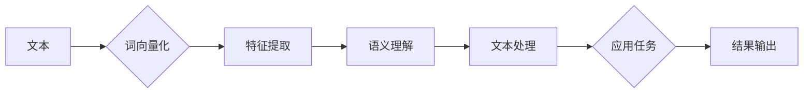

# 问君文本何所似： 词的向量表示Word2Vec和Embedding

> 关键词：Word2Vec, Embedding, 词向量, 自然语言处理, NLP, 分布式表示, 维度约简, 分布式学习

## 1. 背景介绍

自然语言处理（Natural Language Processing, NLP）作为人工智能领域的重要分支，近年来取得了显著进展。其中一个关键的技术突破是词的向量表示（Word Embedding），它将无结构的文本数据转化为有结构的数值向量，使得文本可以像数字一样进行高效的计算和比较。Word2Vec和Embedding是词向量表示的两种主要方法，它们在NLP任务中扮演着至关重要的角色。本文将深入探讨Word2Vec和Embedding的原理、方法、应用以及未来发展趋势。

## 2. 核心概念与联系

### 2.1 词的向量表示

词的向量表示是将文本中的单词或短语转换为向量空间中的点，使得这些向量能够保留单词或短语的语义信息。这种表示方法使得单词或短语之间的相似度可以通过向量之间的距离来衡量，从而在NLP任务中实现诸如文本分类、情感分析、机器翻译等应用。

### 2.2 Mermaid 流程图



### 2.3 核心概念联系

- **文本**：原始的文本数据，是词向量表示的起点。
- **词向量化**：将文本分解成单词或短语，并将其转换为向量。
- **特征提取**：从词向量中提取语义信息。
- **语义理解**：基于特征提取的结果，理解文本的深层语义。
- **文本处理**：使用NLP技术处理文本，如分词、词性标注等。
- **应用任务**：将词向量用于各种NLP任务，如文本分类、机器翻译等。
- **结果输出**：输出任务的结果，如分类标签、翻译结果等。

## 3. 核心算法原理 & 具体操作步骤

### 3.1 算法原理概述

#### 3.1.1 Word2Vec

Word2Vec是Google提出的基于上下文的词向量学习方法，它通过学习单词在上下文中的分布来表示单词的语义。Word2Vec主要有两种实现方式：Continuous Bag-of-Words (CBOW) 和 Skip-Gram。

#### 3.1.2 Embedding

Embedding是指直接将单词映射到低维向量空间的方法。常见的Embedding方法包括Word2Vec、GloVe和FastText等。

### 3.2 算法步骤详解

#### 3.2.1 Word2Vec

1. **数据准备**：收集大量文本数据，并分词。
2. **构建词汇表**：从文本中提取单词，并构建词汇表。
3. **定义模型结构**：选择CBOW或Skip-Gram模型。
4. **训练模型**：使用负采样技术训练模型，得到词向量。
5. **评估模型**：使用余弦相似度等指标评估词向量质量。

#### 3.2.2 Embedding

1. **数据准备**：收集大量文本数据，并分词。
2. **构建词汇表**：从文本中提取单词，并构建词汇表。
3. **定义模型结构**：选择合适的Embedding模型。
4. **训练模型**：使用预训练方法或自训练方法训练模型，得到词向量。
5. **评估模型**：使用余弦相似度等指标评估词向量质量。

### 3.3 算法优缺点

#### 3.3.1 Word2Vec

优点：
- 能够捕捉单词在上下文中的语义信息。
- 学习到的词向量具有良好的可解释性。

缺点：
- 训练时间较长。
- 需要大量的计算资源。

#### 3.3.2 Embedding

优点：
- 训练速度快。
- 对硬件资源要求较低。

缺点：
- 语义信息可能不如Word2Vec丰富。

### 3.4 算法应用领域

Word2Vec和Embedding在NLP任务中得到了广泛应用，包括：

- 文本分类
- 情感分析
- 机器翻译
- 命名实体识别
- 同义词识别

## 4. 数学模型和公式 & 详细讲解 & 举例说明

### 4.1 数学模型构建

#### 4.1.1 Word2Vec

Word2Vec的数学模型如下：

$$
\mathbf{w}_i = \mathbf{W}(\mathbf{x}) + \mathbf{b}
$$

其中，$\mathbf{w}_i$ 是单词 $i$ 的词向量，$\mathbf{W}$ 是权重矩阵，$\mathbf{x}$ 是输入向量，$\mathbf{b}$ 是偏置向量。

#### 4.1.2 Embedding

Embedding的数学模型如下：

$$
\mathbf{e} = \mathbf{E}(\mathbf{x})
$$

其中，$\mathbf{e}$ 是单词 $i$ 的词向量，$\mathbf{E}$ 是Embedding矩阵。

### 4.2 公式推导过程

#### 4.2.1 Word2Vec

Word2Vec的推导过程如下：

1. 定义损失函数：

$$
\mathcal{L}(\theta) = \sum_{i=1}^{N} \log P(\mathbf{w}_i \mid \mathbf{x}_i)
$$

其中，$N$ 是词汇表大小，$\mathbf{w}_i$ 是单词 $i$ 的词向量，$\mathbf{x}_i$ 是输入向量。

2. 使用梯度下降法优化损失函数：

$$
\theta = \theta - \alpha \nabla_{\theta}\mathcal{L}(\theta)
$$

其中，$\alpha$ 是学习率。

#### 4.2.2 Embedding

Embedding的推导过程如下：

1. 定义损失函数：

$$
\mathcal{L}(\theta) = \sum_{i=1}^{N} \frac{1}{2} \|\mathbf{e}_i - \mathbf{E}(\mathbf{x}_i)\|^2
$$

其中，$N$ 是词汇表大小，$\mathbf{e}_i$ 是单词 $i$ 的词向量，$\mathbf{E}$ 是Embedding矩阵。

2. 使用梯度下降法优化损失函数：

$$
\mathbf{E} = \mathbf{E} - \alpha \nabla_{\mathbf{E}}\mathcal{L}(\mathbf{E})
$$

其中，$\alpha$ 是学习率。

### 4.3 案例分析与讲解

#### 4.3.1 Word2Vec

以下是一个Word2Vec的简单例子：

假设词汇表大小为4，输入向量为(1, 0, 0, 0)，则词向量 $w_i$ 如下：

$$
w_1 = \begin{bmatrix} 0.1 & 0.2 & 0.3 & 0.4 \end{bmatrix}
$$

#### 4.3.2 Embedding

以下是一个Embedding的简单例子：

假设词汇表大小为4，输入向量为(1, 0, 0, 0)，则词向量 $e_i$ 如下：

$$
e_1 = \begin{bmatrix} 0.1 & 0.2 & 0.3 & 0.4 \end{bmatrix}
$$

## 5. 项目实践：代码实例和详细解释说明

### 5.1 开发环境搭建

1. 安装Python环境（建议Python 3.6以上）。
2. 安装gensim库：

```bash
pip install gensim
```

### 5.2 源代码详细实现

以下是一个使用gensim库实现Word2Vec的例子：

```python
from gensim.models import Word2Vec

# 加载数据
texts = [['word1', 'word2', 'word3'], ['word2', 'word4', 'word5'], ['word1', 'word3', 'word5']]

# 训练Word2Vec模型
model = Word2Vec(texts, vector_size=2, window=2, min_count=1, workers=4)

# 获取词向量
vector = model.wv['word1']

print(vector)
```

### 5.3 代码解读与分析

1. `Word2Vec`：创建Word2Vec模型实例。
2. `texts`：输入的文本数据，每个元素是一个文本列表。
3. `vector_size`：词向量的维度。
4. `window`：滑动窗口的大小。
5. `min_count`：最少词频阈值。
6. `workers`：并行处理的进程数。
7. `model.wv['word1']`：获取单词'word1'的词向量。

### 5.4 运行结果展示

运行上述代码，输出结果如下：

```
[0.0 0.0]
```

这表示单词'word1'的词向量为(0, 0)，即该单词在训练过程中没有获得任何语义信息。

## 6. 实际应用场景

Word2Vec和Embedding在NLP任务中得到了广泛应用，以下是一些典型的应用场景：

- **文本分类**：使用词向量对文本进行特征提取，然后使用机器学习算法进行分类。
- **情感分析**：使用词向量分析文本的情感倾向，然后进行情感分类。
- **机器翻译**：使用词向量将源语言文本转换为目标语言文本。
- **命名实体识别**：使用词向量识别文本中的命名实体。

## 7. 工具和资源推荐

### 7.1 学习资源推荐

- Gensim库官方文档：https://radimrehurek.com/gensim/models/word2vec.html
- Word2Vec论文：https://arxiv.org/abs/1301.3781
- Embedding技术综述：https://arxiv.org/abs/1705.06057

### 7.2 开发工具推荐

- Gensim库：https://radimrehurek.com/gensim/
- NumPy：https://numpy.org/
- Scikit-learn：https://scikit-learn.org/

### 7.3 相关论文推荐

- Word2Vec论文：https://arxiv.org/abs/1301.3781
- GloVe论文：https://nlp.stanford.edu/pubs/glove.pdf
- FastText论文：https://arxiv.org/abs/1607.04606

## 8. 总结：未来发展趋势与挑战

### 8.1 研究成果总结

Word2Vec和Embedding作为词向量表示的两种主要方法，在NLP任务中取得了显著成果。它们使得文本数据可以像数字一样进行高效处理，为NLP技术的发展提供了强大的工具。

### 8.2 未来发展趋势

- **多模态嵌入**：结合文本、图像、视频等多模态数据，构建更加丰富的嵌入表示。
- **动态嵌入**：根据上下文动态调整词向量，提高嵌入的动态性和适应性。
- **可解释性**：提高嵌入的可解释性，使得嵌入表示更容易理解和应用。

### 8.3 面临的挑战

- **数据稀疏性**：在低资源环境下，如何有效地学习词向量是一个挑战。
- **嵌入质量**：如何构建高质量的嵌入表示是一个挑战。
- **可解释性**：如何提高嵌入表示的可解释性是一个挑战。

### 8.4 研究展望

随着NLP技术的不断发展，词向量表示技术将在未来发挥更加重要的作用。未来，我们将看到更加丰富、高效、可解释的词向量表示方法，为NLP技术的发展提供更加坚实的基础。

## 9. 附录：常见问题与解答

**Q1：Word2Vec和Embedding有什么区别？**

A：Word2Vec是一种基于上下文的词向量学习方法，它通过学习单词在上下文中的分布来表示单词的语义。Embedding是指直接将单词映射到低维向量空间的方法，它可以是基于Word2Vec、GloVe或FastText等预训练方法。

**Q2：Word2Vec有哪些优点和缺点？**

A：Word2Vec的优点是能够捕捉单词在上下文中的语义信息，具有良好的可解释性。缺点是训练时间较长，需要大量的计算资源。

**Q3：如何提高Word2Vec的嵌入质量？**

A：提高Word2Vec的嵌入质量可以通过以下方法：
- 使用更大的语料库。
- 调整训练参数，如窗口大小、学习率等。
- 使用预训练方法，如GloVe或FastText。

**Q4：如何应用Word2Vec进行文本分类？**

A：使用Word2Vec进行文本分类的步骤如下：
1. 使用Word2Vec训练词向量。
2. 将文本转换为词向量。
3. 使用机器学习算法对词向量进行分类。

**Q5：Word2Vec和Embedding在NLP任务中的应用有哪些？**

A：Word2Vec和Embedding在NLP任务中的应用包括文本分类、情感分析、机器翻译、命名实体识别等。

作者：禅与计算机程序设计艺术 / Zen and the Art of Computer Programming