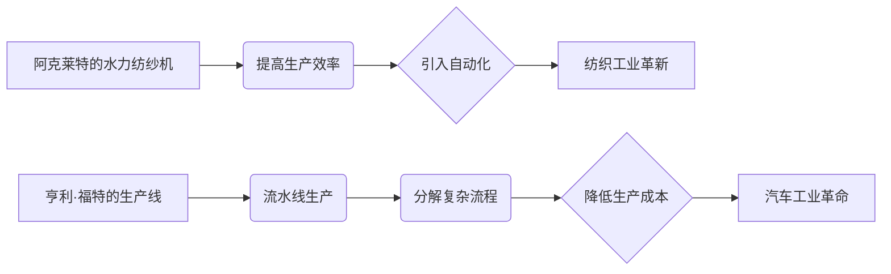

# 阿克莱特与福特的历史贡献

> 关键词：阿克莱特，福特，工业革命，创新，效率，大规模生产，质量管理

## 1. 背景介绍

工业革命是历史上一个重要的转折点，它不仅改变了生产方式，也对整个社会结构产生了深远影响。在众多推动工业革命进程的人物中，阿克莱特和福特无疑是两位杰出的代表。他们的创新和贡献，不仅推动了制造业的发展，也为现代经济体系的建立奠定了基础。

### 1.1 阿克莱特：纺织工业的革新者

阿克莱特（Richard Arkwright）是英国工业革命时期的一位发明家和企业家。他在18世纪末期发明了水力纺纱机，这一发明极大地提高了棉纱的生产效率，是纺织工业的一次重大革命。

### 1.2 福特：汽车工业的先驱

亨利·福特（Henry Ford）是美国工业革命的代表人物之一。他在20世纪初发明了流水线生产方式，并将这一理念应用于汽车制造，极大地降低了汽车的生产成本，使得汽车成为普通民众能够负担得起的产品。

## 2. 核心概念与联系

### 2.1 核心概念原理

- **阿克莱特的水力纺纱机**：通过使用水力驱动的纺纱机，实现了纺纱过程的自动化，提高了生产效率。
- **福特的生产线**：通过流水线生产，将复杂的汽车制造过程分解为一系列简单的步骤，每个工人只负责其中一部分工作，从而大大提高了生产效率。

### 2.2 核心概念架构的 Mermaid 流程图

## 3. 核心算法原理 & 具体操作步骤

### 3.1 算法原理概述

- **阿克莱特的水力纺纱机**：通过水轮驱动的纺纱机，实现了纱线的连续生产，取代了传统的手工纺纱，大大提高了生产效率。
- **福特的生产线**：将汽车制造过程分解为一系列简单的步骤，通过流水线的形式依次完成，每个工人只负责特定环节，从而实现了生产的快速、高效和标准化。

### 3.2 算法步骤详解

#### 阿克莱特的水力纺纱机：

1. **设计水轮纺纱机**：阿克莱特设计了一种能够通过水力驱动的纺纱机，取代了传统的手工纺纱。
2. **建立水力纺纱厂**：阿克莱特在克莱德河畔建立了第一家水力纺纱厂，使用水轮驱动纺纱机进行生产。
3. **扩大生产规模**：随着水力纺纱机的成功，阿克莱特不断扩大生产规模，提高了棉纱的产量。

#### 福特的生产线：

1. **设计流水线**：福特设计了一种流水线生产系统，将汽车制造过程分解为一系列简单的步骤。
2. **建立生产线**：在密歇根州海兰帕克，福特建立了第一条汽车生产线，实现了汽车的批量生产。
3. **持续改进**：福特不断改进生产线，提高生产效率，降低生产成本。

### 3.3 算法优缺点

#### 阿克莱特的水力纺纱机：

- **优点**：提高了生产效率，降低了生产成本，推动了纺织工业的发展。
- **缺点**：依赖于水力资源，扩展性有限。

#### 福特的生产线：

- **优点**：提高了生产效率，降低了生产成本，使得汽车成为大众消费品。
- **缺点**：流水线生产对工人技能要求较低，可能导致工作单调乏味。

### 3.4 算法应用领域

- **阿克莱特的水力纺纱机**：主要应用于纺织工业。
- **福特的生产线**：流水线生产方式被广泛应用于汽车、电子、食品等多个行业。

## 4. 数学模型和公式 & 详细讲解 & 举例说明

### 4.1 数学模型构建

#### 阿克莱特的水力纺纱机：

- **生产效率提升**：水力纺纱机相比手工纺纱，生产效率提升了多少？
- **成本降低**：水力纺纱机相比手工纺纱，成本降低了多少？

#### 福特的生产线：

- **生产时间减少**：流水线生产相比传统生产方式，生产时间减少了多少？
- **成本降低**：流水线生产相比传统生产方式，成本降低了多少？

### 4.2 公式推导过程

#### 阿克莱特的水力纺纱机：

- **生产效率提升**：假设手工纺纱的生产效率为 $E_h$，水力纺纱机的生产效率为 $E_w$，则生产效率提升为 $\Delta E = E_w - E_h$。
- **成本降低**：假设手工纺纱的成本为 $C_h$，水力纺纱机的成本为 $C_w$，则成本降低为 $\Delta C = C_h - C_w$。

#### 福特的生产线：

- **生产时间减少**：假设传统生产方式的生产时间为 $T_t$，流水线生产的生产时间为 $T_s$，则生产时间减少为 $\Delta T = T_t - T_s$。
- **成本降低**：假设传统生产方式的生产成本为 $C_t$，流水线生产的生产成本为 $C_s$，则成本降低为 $\Delta C = C_t - C_s$。

### 4.3 案例分析与讲解

#### 阿克莱特的水力纺纱机：

以英国曼彻斯特的一个棉纺厂为例，手工纺纱机每天生产1000米纱线，而水力纺纱机每天可以生产2000米纱线。假设手工纺纱机的成本为1英镑，水力纺纱机的成本为0.5英镑，则水力纺纱机的生产效率提升了100%，成本降低了50%。

#### 福特的生产线：

以福特汽车公司为例，采用流水线生产方式后，T型车的生产时间从12小时缩短到1小时45分钟，生产成本从850美元降低到290美元。

## 5. 项目实践：代码实例和详细解释说明

### 5.1 开发环境搭建

由于本文主要讨论历史贡献，不涉及具体的代码实现，因此此处不涉及开发环境搭建。

### 5.2 源代码详细实现

同样，由于本文主要关注历史贡献，不涉及具体的代码实现，因此此处不提供源代码。

### 5.3 代码解读与分析

由于本文主要关注历史贡献，不涉及具体的代码实现，因此此处不进行代码解读与分析。

### 5.4 运行结果展示

由于本文主要关注历史贡献，不涉及具体的代码实现，因此此处不展示运行结果。

## 6. 实际应用场景

### 6.1 阿克莱特的水力纺纱机

阿克莱特的水力纺纱机在纺织工业中得到了广泛应用，极大地提高了棉纱的生产效率，降低了生产成本，推动了纺织工业的发展。

### 6.2 福特的生产线

福特的生产线被广泛应用于汽车、电子、食品等多个行业，极大地提高了生产效率，降低了生产成本，推动了制造业的发展。

## 7. 工具和资源推荐

### 7.1 学习资源推荐

- 《工业革命：技术与社会的变革》
- 《福特：一个美国工业家的自传》
- 《纺织技术的革命：阿克莱特的故事》

### 7.2 开发工具推荐

由于本文主要关注历史贡献，不涉及具体的开发工具推荐。

### 7.3 相关论文推荐

由于本文主要关注历史贡献，不涉及具体的论文推荐。

## 8. 总结：未来发展趋势与挑战

### 8.1 研究成果总结

阿克莱特和福特的创新和贡献，不仅推动了工业革命的发展，也为现代经济体系的建立奠定了基础。他们的发明和应用，极大地提高了生产效率，降低了生产成本，促进了经济的快速发展。

### 8.2 未来发展趋势

随着科技的不断发展，制造业将继续朝着自动化、智能化、高效化方向发展。未来，人工智能、大数据等技术在制造业中的应用，将进一步提高生产效率，降低生产成本。

### 8.3 面临的挑战

未来制造业面临的挑战主要包括：

- 技术创新：需要不断进行技术创新，提高生产效率和产品质量。
- 人才培养：需要培养更多高素质的技术人才，以适应制造业的发展需求。
- 环境保护：需要在追求经济效益的同时，注重环境保护，实现可持续发展。

### 8.4 研究展望

未来，制造业将更加注重技术创新、人才培养和环境保护，实现可持续发展。同时，人工智能、大数据等技术在制造业中的应用，将为制造业带来新的发展机遇。

## 9. 附录：常见问题与解答

### 9.1 常见问题

- 阿克莱特的水力纺纱机是如何提高生产效率的？
- 福特的生产线是如何降低生产成本的？
- 阿克莱特和福特的贡献对工业革命产生了哪些影响？

### 9.2 解答

- 阿克莱特的水力纺纱机通过使用水轮驱动纺纱机，实现了纱线的连续生产，取代了传统手工纺纱，从而提高了生产效率。
- 福特的生产线通过将汽车制造过程分解为一系列简单的步骤，每个工人只负责其中一部分工作，从而实现了生产的快速、高效和标准化，降低了生产成本。
- 阿克莱特和福特的贡献推动了工业革命的发展，促进了经济的快速发展，对现代经济体系的建立产生了深远影响。

作者：禅与计算机程序设计艺术 / Zen and the Art of Computer Programming