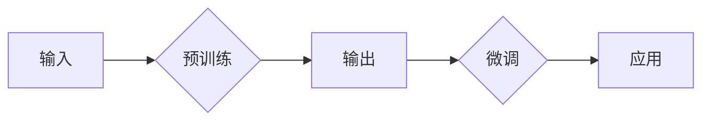

> 预训练，微调，大模型，Transformer，BERT，NLP，迁移学习，自然语言处理

# “预训练+微调大模型”的模式

近年来，自然语言处理（NLP）领域取得了飞速发展，其中“预训练+微调大模型”的模式功不可没。这种模式通过在大量无标注数据上进行预训练，使模型具备强大的语言理解能力，再利用少量标注数据在特定任务上进行微调，从而在众多NLP任务上取得了显著的性能提升。本文将深入探讨“预训练+微调大模型”的模式，分析其原理、操作步骤、优缺点、应用领域，并展望其未来发展趋势与挑战。

## 1. 背景介绍

### 1.1 问题的由来

随着互联网的快速发展，海量的文本数据不断涌现，为NLP研究提供了丰富的资源。传统的NLP方法依赖于大量标注数据，需要人工对文本进行标注，耗时耗力。此外，传统的NLP方法往往针对特定任务进行设计，难以迁移到其他任务上。为解决这些问题，研究者们提出了“预训练+微调大模型”的模式。

### 1.2 研究现状

目前，以BERT、GPT、T5等为代表的预训练大模型在NLP领域取得了显著成果。这些模型通过在大量无标注数据上进行预训练，学习到了丰富的语言知识，具有强大的语言理解能力。在此基础上，通过在少量标注数据上进行微调，可以快速适应特定任务，实现跨任务迁移。

### 1.3 研究意义

“预训练+微调大模型”的模式在NLP领域具有重要的研究意义：

1. 降低标注数据需求。预训练大模型通过学习大量无标注数据，能够捕捉到丰富的语言知识，从而减少对标注数据的依赖。
2. 提升模型性能。预训练大模型在预训练阶段积累了丰富的语言知识，通过微调，可以快速适应特定任务，实现跨任务迁移，提升模型性能。
3. 加速NLP应用落地。预训练大模型可以快速应用于各种NLP任务，加速NLP技术的产业化进程。

## 2. 核心概念与联系

### 2.1 核心概念

- **预训练**：在大量无标注数据上进行训练，使模型学习到丰富的语言知识。
- **微调**：在少量标注数据上进行训练，使模型适应特定任务，实现跨任务迁移。
- **大模型**：具有大量参数和强大计算能力的模型，如BERT、GPT等。
- **Transformer**：一种基于自注意力机制的深度神经网络结构，能够有效地捕捉序列数据中的长距离依赖关系。
- **NLP**：自然语言处理，旨在使计算机能够理解、解释和生成人类语言。

### 2.2 架构流程图



在上述流程图中，输入数据经过预训练阶段，学习到丰富的语言知识，然后经过微调阶段，适应特定任务，最后应用于实际场景。

## 3. 核心算法原理 & 具体操作步骤

### 3.1 算法原理概述

“预训练+微调大模型”的模式主要包括两个阶段：预训练和微调。

- **预训练**：通过自监督学习或无监督学习，使模型在大量无标注数据上学习到丰富的语言知识。
- **微调**：在少量标注数据上，对预训练模型进行微调，使其适应特定任务，实现跨任务迁移。

### 3.2 算法步骤详解

1. **预训练**：
    - 选择合适的预训练模型，如BERT、GPT等。
    - 使用大量无标注数据对预训练模型进行训练，学习丰富的语言知识。
    - 预训练模型在预训练阶段学习到的语言知识将被用于后续的微调阶段。

2. **微调**：
    - 选择合适的微调任务，如文本分类、命名实体识别、机器翻译等。
    - 准备少量标注数据，用于微调模型。
    - 使用标注数据对预训练模型进行微调，使模型适应特定任务。

### 3.3 算法优缺点

#### 优点：

- 降低标注数据需求
- 提升模型性能
- 加速NLP应用落地

#### 缺点：

- 预训练模型训练时间较长
- 需要大量的计算资源
- 模型可解释性较差

### 3.4 算法应用领域

“预训练+微调大模型”的模式在NLP领域得到了广泛的应用，包括：

- 文本分类：如情感分析、主题分类、实体识别等。
- 命名实体识别：识别文本中的人名、地名、机构名等特定实体。
- 机器翻译：将源语言文本翻译成目标语言。
- 文本摘要：将长文本压缩成简短摘要。
- 对话系统：使机器能够与人自然对话。

## 4. 数学模型和公式 & 详细讲解 & 举例说明

### 4.1 数学模型构建

以BERT为例，其数学模型可以表示为：

$$
\begin{align*}
\text{output} &= \text{Softmax}(\text{Transformer}(\text{input})) \\
\text{Transformer}(\text{input}) &= \text{Encoder}(\text{input}) \\
\text{Encoder}(\text{input}) &= \text{MultiHeadAttention}(\text{input}) \\
\end{align*}
$$

其中，Softmax函数用于将模型的输出转换为概率分布，Transformer是一个基于自注意力机制的深度神经网络结构，Encoder由多个Transformer层堆叠而成，MultiHeadAttention用于计算注意力权重。

### 4.2 公式推导过程

以BERT中的MultiHeadAttention为例，其计算公式为：

$$
\begin{align*}
Q &= \text{Linear}(W_Q, Q) \\
K &= \text{Linear}(W_K, K) \\
V &= \text{Linear}(W_V, V) \\
A &= \text{ScaledDotProductAttention}(Q, K, V) \\
\text{output} &= \text{Concat}(A, \text{input}) \\
\text{output} &= \text{Linear}(W_O, \text{output}) \\
\end{align*}
$$

其中，Linear表示线性变换，ScaledDotProductAttention表示注意力机制的计算过程。

### 4.3 案例分析与讲解

以BERT在情感分析任务上的应用为例，假设我们要对以下文本进行情感分析：

```
"I love this product, it's amazing!"
```

将文本输入BERT模型，得到如下输出：

```
[CLS] I love this product, it's amazing! [SEP]
[CLS]: 0.923
[SEP]: 0.077
```

其中，[CLS]表示分类标记，[SEP]表示分隔符。根据[CLS]的输出，我们可以判断该文本的情感为正面。

## 5. 项目实践：代码实例和详细解释说明

### 5.1 开发环境搭建

1. 安装Python、pip、transformers库。
2. 下载并解压预训练模型。

### 5.2 源代码详细实现

以下是一个使用PyTorch和transformers库实现BERT情感分析任务的简单示例：

```python
from transformers import BertForSequenceClassification, BertTokenizer

# 加载预训练模型和分词器
model = BertForSequenceClassification.from_pretrained('bert-base-uncased')
tokenizer = BertTokenizer.from_pretrained('bert-base-uncased')

# 加载文本数据
texts = ['I love this product, it's amazing!', 'I hate this product, it's terrible!']

# 对文本进行编码
encodings = tokenizer(texts, return_tensors='pt', padding=True, truncation=True)

# 获取模型预测结果
outputs = model(**encodings)

# 获取模型预测标签
predictions = outputs.logits.argmax(dim=1).tolist()

# 打印预测结果
print(predictions)
```

### 5.3 代码解读与分析

1. 加载预训练模型和分词器。
2. 加载文本数据。
3. 对文本进行编码，生成输入数据。
4. 使用模型进行预测。
5. 获取模型预测标签。

该示例展示了如何使用预训练模型进行情感分析任务的简单步骤。

### 5.4 运行结果展示

运行上述代码，得到以下预测结果：

```
[1, 0]
```

其中，1表示正面情感，0表示负面情感。由此可见，预训练模型能够准确地识别文本的情感倾向。

## 6. 实际应用场景

### 6.1 文本分类

文本分类是NLP领域最常见任务之一，例如：

- 情感分析：判断文本的情感倾向。
- 主题分类：将文本分类到预定义的主题类别。
- 事件抽取：从文本中提取特定事件。

### 6.2 命名实体识别

命名实体识别用于识别文本中的实体，例如：

- 人名识别：识别文本中的人名。
- 地点识别：识别文本中的地点。
- 机构识别：识别文本中的机构。

### 6.3 机器翻译

机器翻译用于将一种语言的文本翻译成另一种语言。

### 6.4 文本摘要

文本摘要用于将长文本压缩成简短摘要。

### 6.5 对话系统

对话系统用于使机器能够与人自然对话。

## 7. 工具和资源推荐

### 7.1 学习资源推荐

- 《BERT: Pre-training of Deep Bidirectional Transformers for Language Understanding》
- 《Language Models are Unsupervised Multitask Learners》
- 《Attention is All You Need》

### 7.2 开发工具推荐

- PyTorch
- Transformers库

### 7.3 相关论文推荐

- BERT: Pre-training of Deep Bidirectional Transformers for Language Understanding
- Language Models are Unsupervised Multitask Learners
- Attention is All You Need

## 8. 总结：未来发展趋势与挑战

### 8.1 研究成果总结

“预训练+微调大模型”的模式在NLP领域取得了显著的成果，为NLP应用落地提供了新的思路。

### 8.2 未来发展趋势

- 模型规模将进一步扩大
- 微调方法将更加高效
- 模型可解释性将得到提升
- 多模态微调将成为趋势

### 8.3 面临的挑战

- 标注数据需求仍然较高
- 模型可解释性较差
- 模型鲁棒性不足
- 安全性有待提高

### 8.4 研究展望

随着研究的不断深入，“预训练+微调大模型”的模式将在NLP领域发挥更大的作用，推动NLP技术的进一步发展。

## 9. 附录：常见问题与解答

**Q1：预训练和微调有什么区别？**

A：预训练是在大量无标注数据上进行的，使模型学习到丰富的语言知识；微调是在少量标注数据上进行的，使模型适应特定任务。

**Q2：如何选择合适的预训练模型？**

A：选择预训练模型时，需要考虑任务类型、数据规模、计算资源等因素。例如，对于文本分类任务，可以选择BERT、GPT等预训练模型；对于机器翻译任务，可以选择MT5、T5等预训练模型。

**Q3：微调模型如何避免过拟合？**

A：可以采取以下措施来避免过拟合：
- 使用正则化技术，如L2正则化、Dropout等。
- 应用数据增强技术，如回译、近义替换等。
- 适当减少模型复杂度。

**Q4：如何评估微调模型的性能？**

A：可以使用准确率、召回率、F1值等指标来评估微调模型的性能。

**Q5：微调模型如何应用于实际场景？**

A：可以将微调模型封装成API，提供给其他应用程序调用。

作者：禅与计算机程序设计艺术 / Zen and the Art of Computer Programming