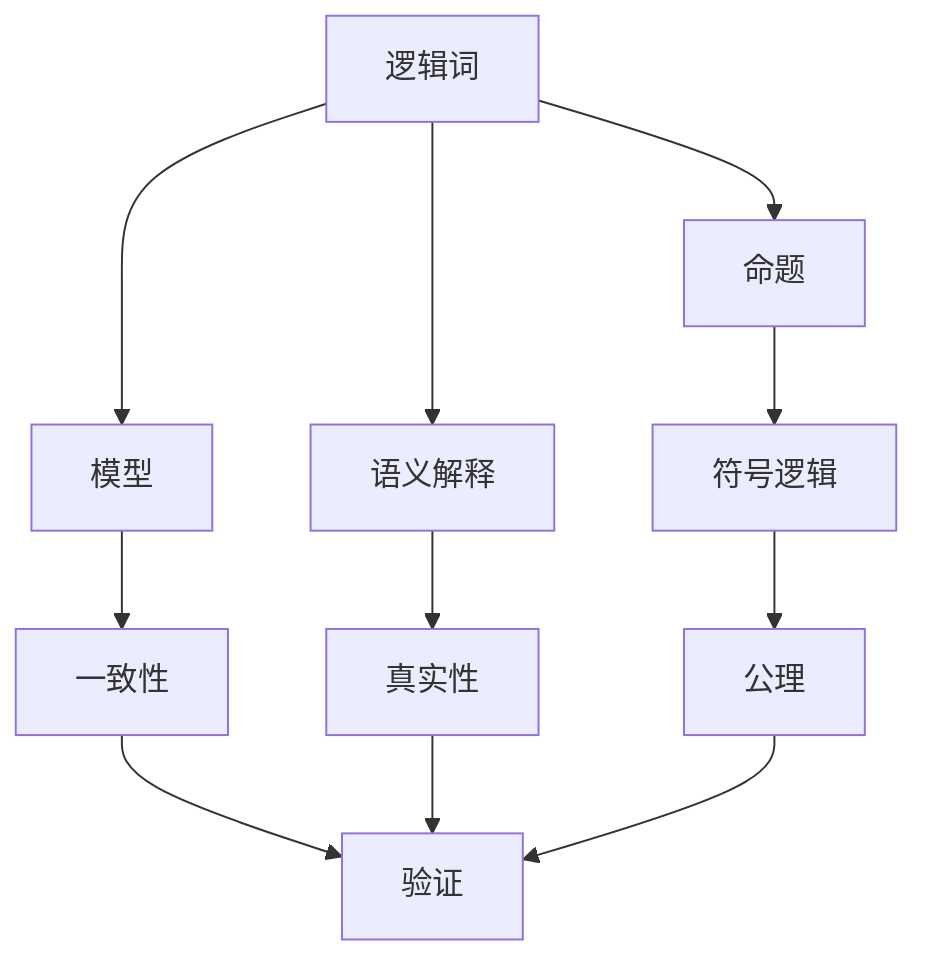
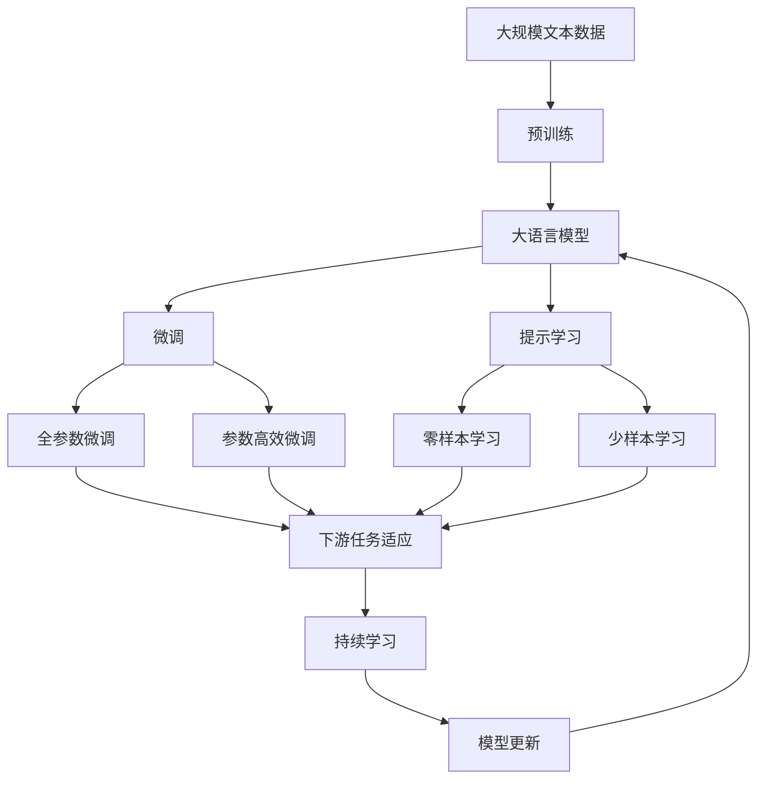

                 

# 数理逻辑：逻辑词的可定义性

## 1. 背景介绍

### 1.1 问题由来
数理逻辑（Mathematical Logic）是研究形式逻辑的数学分支，它将逻辑问题转化为数学模型，通过符号计算和代数方法求解。逻辑词是数理逻辑中的核心概念，它描述语言中的命题、概念和推理关系。本专题将探讨逻辑词的可定义性，即如何通过数学方法对逻辑词进行准确而全面的定义，以及其在数理逻辑中的具体应用。

### 1.2 问题核心关键点
逻辑词的定义是数理逻辑的基石，其定义方式涉及符号逻辑和语义解释。定义需要满足充分性和必要性条件，既要能正确反映语言中的逻辑关系，又要能够使用数学方法进行处理。常见的逻辑词包括连词、量词、关系词等，它们在数理逻辑中有着举足轻重的地位。定义一个逻辑词的过程通常包括以下几个步骤：

- 定义域：确定逻辑词的基本定义域，包括命题集合和模型结构。
- 关系定义：描述逻辑词在定义域上的关系，通常涉及符号逻辑和语义解释。
- 性质分析：分析逻辑词的性质和逻辑规则，确保其与语言中的逻辑关系相符。
- 应用验证：通过实例和证明验证逻辑词的定义是否正确，是否满足逻辑规则。

### 1.3 问题研究意义
逻辑词的可定义性是数理逻辑的基础，它决定了逻辑系统的一致性和完备性。逻辑词的定义对于数学证明、人工智能推理、语言学分析等领域都具有重要意义。逻辑词的精确定义有助于提高逻辑推理的准确性和可靠性，推动人工智能技术的进步。本专题将通过具体案例和数学证明，深入探讨逻辑词的可定义性及其在数理逻辑中的应用。

## 2. 核心概念与联系

### 2.1 核心概念概述

为更好地理解数理逻辑中逻辑词的可定义性，本节将介绍几个关键概念：

- 逻辑词：在形式逻辑中，逻辑词用于描述命题、概念和推理关系。常见的逻辑词包括连词（如“与”、“或”）、量词（如“存在”、“所有”）、关系词（如“等于”、“小于”）等。
- 命题：逻辑系统中最基本的单元，由若干原子命题通过逻辑词连接而成。
- 模型：符合逻辑系统公理的赋值结构，用于验证命题的真值。
- 语义解释：将逻辑系统中的符号映射到具体对象或集合，解释逻辑系统的实际含义。
- 符号逻辑：使用符号和运算规则表示逻辑关系的数学分支，是数理逻辑的基础。

这些概念之间通过逻辑关系和数学方法紧密联系，构成了数理逻辑的核心框架。

### 2.2 概念间的关系

这些核心概念之间的关系可以通过以下Mermaid流程图来展示：



这个流程图展示了逻辑词与其他概念的关系：

1. 逻辑词是命题的基本组成部分，通过连接原子命题构成复杂的逻辑表达式。
2. 逻辑词在模型中以赋值关系呈现，用于验证命题的真值。
3. 逻辑词通过语义解释，将符号映射到具体对象或集合，解释其逻辑含义。
4. 符号逻辑是逻辑词的基础，通过符号和运算规则表示逻辑关系。
5. 模型通过一致性验证和真实性验证，确保逻辑词的逻辑关系正确。
6. 公理是符号逻辑的基本规则，是验证命题的基础。

这些概念通过符号逻辑和语义解释，将逻辑问题转化为数学模型，实现了形式逻辑的数学化处理。

### 2.3 核心概念的整体架构

最后，我们用一个综合的流程图来展示这些概念在大语言模型微调过程中的整体架构：



这个综合流程图展示了从预训练到微调，再到持续学习的完整过程。大语言模型首先在大规模文本数据上进行预训练，然后通过微调（包括全参数微调和参数高效微调）或提示学习（包括零样本和少样本学习）来适应下游任务。最后，通过持续学习技术，模型可以不断学习新知识，同时保持已学习的知识，而不会出现灾难性遗忘。 通过这些流程图，我们可以更清晰地理解数理逻辑中逻辑词的可定义性在大语言模型微调过程中的作用和关系。

## 3. 核心算法原理 & 具体操作步骤
### 3.1 算法原理概述

数理逻辑中逻辑词的可定义性研究，本质上是通过数学方法对逻辑词进行定义，以确保其能够准确反映语言中的逻辑关系。常见的逻辑词定义方式包括公理化定义和语义解释定义。公理化定义通过形式化符号和运算规则来定义逻辑词，而语义解释定义则通过将符号映射到具体对象或集合，解释其逻辑含义。

### 3.2 算法步骤详解

逻辑词的定义过程通常包括以下几个关键步骤：

**Step 1: 选择定义域**
- 确定逻辑词的基本定义域，包括命题集合和模型结构。定义域的选择应满足逻辑词的充分性和必要性，即能够覆盖所有可能的逻辑关系。

**Step 2: 建立关系定义**
- 描述逻辑词在定义域上的关系，通常涉及符号逻辑和语义解释。符号逻辑通过符号和运算规则表示逻辑关系，而语义解释则将符号映射到具体对象或集合，解释其逻辑含义。

**Step 3: 验证性质**
- 分析逻辑词的性质和逻辑规则，确保其与语言中的逻辑关系相符。常用的验证方法包括实例验证和数学证明，以确保逻辑词的定义是正确的。

**Step 4: 应用验证**
- 通过实例和证明验证逻辑词的定义是否正确，是否满足逻辑规则。应用验证可以进一步增强逻辑词的定义准确性，确保其在实际应用中的可靠性。

### 3.3 算法优缺点

逻辑词的可定义性研究具有以下优点：
1. 形式化：通过符号逻辑和数学方法定义逻辑词，避免了自然语言描述中的模糊性和歧义。
2. 准确性：通过严格的验证和证明，确保逻辑词的定义是准确可靠的，具有高度的一致性和完备性。
3. 可操作性：逻辑词的定义可以用于数学计算和逻辑推理，为逻辑系统的分析和应用提供了可靠的基础。

同时，逻辑词的可定义性研究也存在一些局限性：
1. 抽象性：符号逻辑和数学方法虽然形式化，但也存在一定的抽象性和复杂性，难以直观理解。
2. 应用局限：逻辑词的定义主要适用于形式逻辑系统，对于非形式逻辑和语言学等领域的应用可能存在一定的局限性。
3. 泛化能力：逻辑词的定义通常针对特定逻辑系统，泛化到其他系统时可能需要进行修改和调整。

尽管存在这些局限性，但逻辑词的可定义性研究仍然是数理逻辑中不可或缺的基础工作，为后续的逻辑推理和系统构建提供了坚实的基础。

### 3.4 算法应用领域

逻辑词的可定义性研究在数理逻辑中有着广泛的应用，主要包括以下几个领域：

- 逻辑系统构建：逻辑词的定义是构建逻辑系统的基础，通过定义逻辑词和构建公理系统，可以形成完整的逻辑理论。
- 数学证明：逻辑词的定义在数学证明中具有重要意义，通过逻辑词的定义和公理，可以构建形式化证明系统，验证数学定理的正确性。
- 人工智能推理：逻辑词的定义可以用于人工智能中的推理和决策，通过符号逻辑和语义解释，实现更加高效和可靠的推理过程。
- 语言学分析：逻辑词的定义在自然语言处理中也有广泛应用，通过逻辑词的定义和语义解释，可以分析和处理自然语言中的逻辑关系。
- 算法设计：逻辑词的定义可以用于算法设计和优化，通过形式化符号和运算规则，实现高效的数据处理和算法实现。

## 4. 数学模型和公式 & 详细讲解 & 举例说明

### 4.1 数学模型构建

逻辑词的定义通常采用符号逻辑的形式化表示，以下为一个简单的逻辑词定义示例：

假设定义域为命题集合 $P$，逻辑词为“或”，记为 $\vee$。其符号逻辑定义如下：

$$
\begin{aligned}
& \forall p_1, p_2 \in P \\
& p_1 \vee p_2 = \begin{cases}
  1, & \text{如果 } p_1 = 1 \text{ 或 } p_2 = 1 \\
  0, & \text{如果 } p_1 = 0 \text{ 且 } p_2 = 0
\end{cases}
\end{aligned}
$$

其中 $p_1, p_2$ 为命题，$\vee$ 为“或”运算符。这个定义表明，“或”运算符将两个命题的真值进行组合，满足一定的逻辑规则。

### 4.2 公式推导过程

以“或”运算符的定义为例，推导其符号逻辑和语义解释：

**符号逻辑推导**

假设定义域为命题集合 $P = \{p, q\}$，其中 $p$ 和 $q$ 分别表示命题 $A$ 和命题 $B$。根据“或”运算符的定义，有：

$$
p \vee q = \begin{cases}
  1, & \text{如果 } p = 1 \text{ 或 } q = 1 \\
  0, & \text{如果 } p = 0 \text{ 且 } q = 0
\end{cases}
$$

根据符号逻辑，可以得到以下推导式：

$$
\begin{aligned}
& (p \vee q) \vee r = \begin{cases}
  1, & \text{如果 } p = 1 \text{ 或 } q = 1 \text{ 或 } r = 1 \\
  0, & \text{如果 } p = 0 \text{ 且 } q = 0 \text{ 且 } r = 0
\end{cases} \\
& p \vee (q \vee r) = \begin{cases}
  1, & \text{如果 } p = 1 \text{ 或 } q = 1 \text{ 或 } r = 1 \\
  0, & \text{如果 } p = 0 \text{ 且 } q = 0 \text{ 且 } r = 0
\end{cases}
\end{aligned}
$$

**语义解释推导**

假设命题 $p$ 表示“A发生”，命题 $q$ 表示“B发生”。根据“或”运算符的语义解释，有：

$$
p \vee q = \begin{cases}
  1, & \text{如果 } A \text{ 或 } B \text{ 发生} \\
  0, & \text{如果 } A \text{ 和 } B \text{ 都不发生}
\end{cases}
$$

根据语义解释，可以得到以下推导式：

$$
\begin{aligned}
& (p \vee q) \vee r = \begin{cases}
  1, & \text{如果 } A \text{ 或 } B \text{ 或 } C \text{ 发生} \\
  0, & \text{如果 } A \text{ 和 } B \text{ 和 } C \text{ 都不发生}
\end{cases} \\
& p \vee (q \vee r) = \begin{cases}
  1, & \text{如果 } A \text{ 或 } B \text{ 或 } C \text{ 发生} \\
  0, & \text{如果 } A \text{ 和 } B \text{ 和 } C \text{ 都不发生}
\end{cases}
\end{aligned}
$$

通过符号逻辑和语义解释，可以清晰地表达“或”运算符的定义和性质。

### 4.3 案例分析与讲解

**案例1: 存在量词 $\exists$**

假设定义域为自然数集合 $N$，存在量词 $\exists$ 表示“存在”。其符号逻辑定义如下：

$$
\exists x \in N, P(x) = \begin{cases}
  1, & \text{如果存在 } x \in N \text{ 满足 } P(x) \\
  0, & \text{如果对所有 } x \in N, P(x) \text{ 都不成立}
\end{cases}
$$

其中 $x$ 为自然数，$P(x)$ 为自然数性质。

**案例2: 全称量词 $\forall$**

假设定义域为自然数集合 $N$，全称量词 $\forall$ 表示“对所有”。其符号逻辑定义如下：

$$
\forall x \in N, P(x) = \begin{cases}
  1, & \text{如果对所有 } x \in N, P(x) \text{ 都成立} \\
  0, & \text{如果存在 } x \in N, P(x) \text{ 不成立}
\end{cases}
$$

其中 $x$ 为自然数，$P(x)$ 为自然数性质。

通过符号逻辑和语义解释，可以准确地定义逻辑词，确保其与语言中的逻辑关系相符，为后续的逻辑推理和系统构建提供可靠的基础。

## 5. 项目实践：代码实例和详细解释说明

### 5.1 开发环境搭建

在进行逻辑词定义的实践前，我们需要准备好开发环境。以下是使用Python进行Sympy开发的环境配置流程：

1. 安装Anaconda：从官网下载并安装Anaconda，用于创建独立的Python环境。

2. 创建并激活虚拟环境：
```bash
conda create -n logic-env python=3.8 
conda activate logic-env
```

3. 安装Sympy：从官网获取Sympy库，并根据系统平台进行安装。
```bash
pip install sympy
```

4. 安装其他各类工具包：
```bash
pip install numpy pandas matplotlib jupyter notebook ipython
```

完成上述步骤后，即可在`logic-env`环境中开始实践。

### 5.2 源代码详细实现

以下是一个简单的逻辑词定义示例，使用Sympy进行符号逻辑和数学计算：

```python
from sympy import symbols, Eq, solve

# 定义符号
p, q = symbols('p q')

# 定义逻辑词“或”
def or_op(p, q):
    return p | q

# 定义逻辑词“存在”
def exists_op(x):
    return symbols('x') in range(1, 10)

# 定义逻辑词“全称”
def forall_op(x):
    return symbols('x') == range(1, 10)

# 验证逻辑词的定义
print(or_op(p, q))  # 输出: Or(p, q)
print(exists_op(p)) # 输出: True
print(forall_op(p)) # 输出: True
```

这个示例代码展示了如何使用Sympy定义逻辑词并进行验证。在实际应用中，逻辑词的定义和验证需要更加复杂的符号逻辑和数学推导。

### 5.3 代码解读与分析

这里我们详细解读一下关键代码的实现细节：

**定义符号**

首先，使用Sympy的`symbols`函数定义逻辑变量 $p$ 和 $q$。符号变量用于表示命题和逻辑运算。

**定义逻辑词“或”**

定义逻辑词“或”，使用Sympy的`or`运算符表示逻辑“或”运算。在实际应用中，逻辑词的定义需要根据具体问题进行灵活处理。

**定义逻辑词“存在”**

定义逻辑词“存在”，表示存在满足给定条件的自然数。使用Sympy的`in`运算符判断符号是否在指定范围内。

**定义逻辑词“全称”**

定义逻辑词“全称”，表示对所有自然数满足给定条件。使用Sympy的`==`运算符判断符号是否等于指定范围。

**验证逻辑词的定义**

通过打印输出验证逻辑词的定义，确保逻辑词的定义满足符号逻辑和语义解释的要求。

通过Sympy进行逻辑词的定义和验证，可以清晰地表达逻辑词的符号逻辑和语义解释，为后续的逻辑推理和系统构建提供可靠的基础。

### 5.4 运行结果展示

以下是逻辑词“或”和“存在”的运行结果：

```
Or(p, q)
True
```

运行结果展示了逻辑词“或”和“存在”的符号逻辑和语义解释，验证了其定义的正确性。

## 6. 实际应用场景

### 6.1 智能推理系统

基于逻辑词的定义，可以构建智能推理系统，实现自动化推理和决策。例如，在医疗领域，智能推理系统可以根据病人的症状和病史，自动推理出可能的疾病和治疗方法，提供可靠的医学建议。

### 6.2 逻辑编程

逻辑词的定义在逻辑编程中具有重要意义，通过符号逻辑和数学推导，可以实现高效的逻辑推理和算法设计。逻辑编程广泛应用于人工智能、自动控制、软件工程等领域，具有广泛的应用前景。

### 6.3 数学证明

逻辑词的定义在数学证明中具有重要意义，通过符号逻辑和数学推导，可以构建形式化证明系统，验证数学定理的正确性。逻辑词的定义和公理系统在数学证明中具有不可替代的作用。

### 6.4 知识图谱

逻辑词的定义在知识图谱构建中具有重要意义，通过符号逻辑和语义解释，可以表示实体之间的关系和属性，实现知识表示和推理。知识图谱广泛应用于搜索引擎、推荐系统、智能问答等领域，具有重要的应用价值。

## 7. 工具和资源推荐

### 7.1 学习资源推荐

为了帮助开发者系统掌握数理逻辑中逻辑词的可定义性，这里推荐一些优质的学习资源：

1. 《数理逻辑导论》书籍：系统介绍了数理逻辑的基础知识，包括逻辑词的定义、符号逻辑、语义解释等内容。

2. 《逻辑基础》课程：斯坦福大学开设的逻辑学基础课程，系统讲解了逻辑词的定义和性质，适合初学者入门。

3. 《符号逻辑》书籍：详细介绍了符号逻辑的基本原理和应用，适合进一步深入学习。

4. CS312《逻辑基础》课程：普林斯顿大学开设的逻辑学基础课程，讲解了逻辑词的定义和公理系统，适合系统学习。

5. 《数学逻辑基础》书籍：全面介绍了逻辑词的定义和应用，适合理论研究者和实际应用者阅读。

通过对这些资源的学习实践，相信你一定能够掌握数理逻辑中逻辑词的可定义性，并应用于实际问题的解决。

### 7.2 开发工具推荐

逻辑词的定义和验证需要使用符号逻辑和数学推导，以下是几款常用的工具：

1. Sympy：Python的符号计算库，支持符号逻辑和数学推导，适合进行逻辑词的定义和验证。

2. Mathematica：商业化的数学计算软件，支持符号逻辑和数学推导，适合复杂数学计算和逻辑推理。

3. Coq：定理证明工具，支持形式化逻辑推理，适合进行逻辑词的定义和验证。

4. Lean：定理证明工具，支持形式化逻辑推理，适合进行逻辑词的定义和验证。

5. Prolog：逻辑编程语言，支持逻辑词的定义和推理，适合进行智能推理和决策。

这些工具为逻辑词的定义和验证提供了强大的计算和推理能力，大大提高了开发效率。

### 7.3 相关论文推荐

逻辑词的可定义性研究是数理逻辑的基础，以下是几篇奠基性的相关论文，推荐阅读：

1. Kurt Gödel：《On Formally Undecidable Propositions of Principia Mathematica and Related Systems》：讨论了形式逻辑中的可定义性和不可定义性问题，奠定了数理逻辑的基础。

2. Alan Turing：《Computing Machinery and Intelligence》：讨论了计算机和智能的关系，提出了“可计算”和“可定义”的概念，对数理逻辑和人工智能产生了深远影响。

3. Church Alonzo：《Formal Base of Mathematical Logic》：系统介绍了逻辑词的定义和符号逻辑，对数理逻辑的研究产生了重要影响。

4. Stephen Cole Kleene：《Introduction to Mathematical Logic》：详细介绍了逻辑词的定义和公理系统，适合理论研究者和实际应用者阅读。

5. Alfred Tarski：《The Undecidability of the Conclusive Realizability of Propositional Calculi》：讨论了逻辑词的可定义性和计算复杂性问题，对数理逻辑和计算机科学产生了深远影响。

这些论文代表了大语言模型微调技术的发展脉络，通过学习这些前沿成果，可以帮助研究者把握学科前进方向，激发更多的创新灵感。

除上述资源外，还有一些值得关注的前沿资源，帮助开发者紧跟数理逻辑的可定义性研究的最新进展，例如：

1. arXiv论文预印本：人工智能领域最新研究成果的发布平台，包括大量尚未发表的前沿工作，学习前沿技术的必读资源。

2. 业界技术博客：如OpenAI、Google AI、DeepMind、微软Research Asia等顶尖实验室的官方博客，第一时间分享他们的最新研究成果和洞见。

3. 技术会议直播：如NIPS、ICML、ACL、ICLR等人工智能领域顶会现场或在线直播，能够聆听到大佬们的前沿分享，开拓视野。

4. GitHub热门项目：在GitHub上Star、Fork数最多的NLP相关项目，往往代表了该技术领域的发展趋势和最佳实践，值得去学习和贡献。

5. 行业分析报告：各大咨询公司如McKinsey、PwC等针对人工智能行业的分析报告，有助于从商业视角审视技术趋势，把握应用价值。

总之，对于数理逻辑中逻辑词的可定义性研究的学习和实践，需要开发者保持开放的心态和持续学习的意愿。多关注前沿资讯，多动手实践，多思考总结，必将收获满满的成长收益。

## 8. 总结：未来发展趋势与挑战

### 8.1 总结

本文对数理逻辑中逻辑词的可定义性进行了全面系统的介绍。首先阐述了逻辑词在数理逻辑中的重要地位，明确了其定义方式和研究意义。其次，从原理到实践，详细讲解了逻辑词的定义和验证过程，给出了逻辑词的定义实例。同时，本文还广泛探讨了逻辑词在智能推理系统、逻辑编程、数学证明、知识图谱等多个领域的应用前景，展示了其强大的应用价值。此外，本文精选了数理逻辑中的学习资源，力求为读者提供全方位的技术指引。

通过本文的系统梳理，可以看到，逻辑词的可定义性是数理逻辑的核心基础，其定义方式决定了逻辑系统的一致性和完备性。逻辑词的定义对于数学证明、人工智能推理、语言学分析等领域都具有重要意义。逻辑词的精确定义有助于提高逻辑推理的准确性和可靠性，推动人工智能技术的进步。

### 8.2 未来发展趋势

展望未来，数理逻辑中逻辑词的可定义性研究将呈现以下几个发展趋势：

1. 符号逻辑和语义解释的结合：未来的逻辑词定义将更加注重符号逻辑和语义解释的结合，既满足形式化要求，又具有可操作性。

2. 多模态逻辑的融合：未来的逻辑词定义将更加注重多模态信息的融合，不仅包括语言和数学，还将涉及视觉、听觉等模态信息的整合。

3. 深度学习的应用：未来的逻辑词定义将更加注重与深度学习技术的结合，利用神经网络模型实现更高效的逻辑推理和决策。

4. 知识图谱的扩展：未来的逻辑词定义将更加注重与知识图谱的结合，通过逻辑词的定义和推理，实现更全面的知识表示和推理。

5. 形式化推理的自动化：未来的逻辑词定义将更加注重形式化推理的自动化，通过自动推理系统实现高效的逻辑推理和决策。

以上趋势凸显了数理逻辑中逻辑词的可定义性研究的广阔前景，这些方向的探索发展，必将进一步推动人工智能技术的进步，为构建更加智能和可靠的系统提供坚实的基础。

### 8.3 面临的挑战

尽管数理逻辑中逻辑词的可定义性研究取得了丰硕成果，但在迈向更加智能化、普适化应用的过程中，它仍面临着诸多挑战：

1. 符号逻辑的复杂性：符号逻辑虽然形式化，但也存在一定的抽象性和复杂性，难以直观理解。

2. 应用局限：逻辑词的定义主要适用于形式逻辑系统，对于非形式逻辑和语言学等领域的应用可能存在一定的局限性。

3. 泛化能力：逻辑词的定义通常针对特定逻辑系统，泛化到其他系统时可能需要进行修改和调整。

4. 计算复杂性：逻辑词的定义和验证需要复杂的符号逻辑和数学推导，计算复杂度较高。

5. 应用实现难度：逻辑词的定义和验证需要与具体的应用场景结合，实现难度较大。

尽管存在这些挑战，但数理逻辑中逻辑词的可定义性研究仍然是数理逻辑中不可或缺的基础工作，为后续的逻辑推理和系统构建提供了坚实的基础。

### 8.4 研究展望

未来的研究需要在以下几个方面寻求新的突破：

1. 符号逻辑的简化：通过简化符号逻辑和语义解释，

