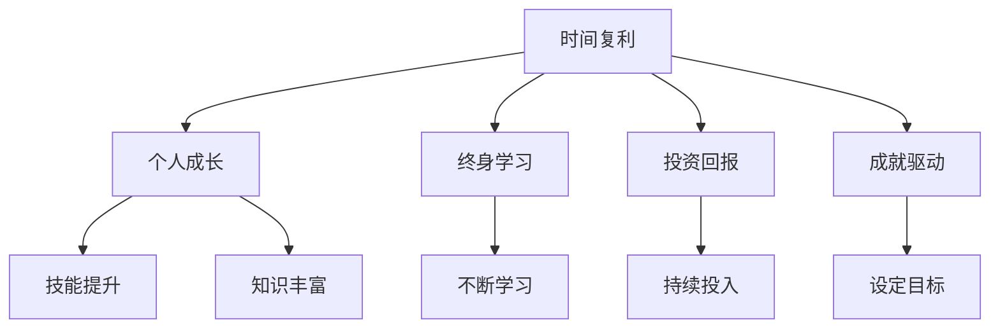

                 

# 时间复利效应与个人成就

> 关键词：时间复利, 个人成长, 终身学习, 投资回报, 成就驱动

## 1. 背景介绍

在现代社会，技术的飞速发展和信息爆炸带来的挑战使得个人成长变得更加重要。无论是在职场中晋升，还是自我实现，时间复利效应都是一个不可忽视的强大工具。本文将从时间复利效应的定义、产生原理及其在个人成长中的实际应用进行深入探讨。

### 1.1 问题由来
现代快节奏的生活中，我们面临大量的信息和个人决策，如何在有限的时间内实现最大化的个人成长，是很多人关心的问题。时间复利效应，通过长期坚持一个小行动，不断积累其结果，达到翻倍的增长，提供了一种可持续的个人成长路径。

### 1.2 问题核心关键点
时间复利效应的核心在于：通过持续而微小的努力，随着时间的推移，所取得的成果将呈现指数增长，最终实现个人成就的飞跃。理解这一原理，并运用到个人成长中，可以帮助我们实现目标，并在不断积累中超越自我。

### 1.3 问题研究意义
深入理解时间复利效应及其在个人成长中的应用，可以帮助我们制定更有效的学习和生活策略，不仅提高个人技能，还能培养良好的生活习惯，形成积极向上的生活态度，最终实现自我提升。

## 2. 核心概念与联系

### 2.1 核心概念概述

为了更好地理解时间复利效应，本节将介绍几个密切相关的核心概念：

- **时间复利（Compound Interest）**：指随着时间的推移，通过反复投资，而获得的总回报率呈指数级增长。与金融领域的时间复利类似，个人成长也可以通过不断地投入和积累，实现非线性增长。

- **个人成长（Personal Growth）**：指个人在知识、技能、心态等方面的不断提升，是实现个人成就的重要基础。

- **终身学习（Lifelong Learning）**：强调无论年龄大小，都要持续学习，更新知识和技能，以适应不断变化的现实世界。

- **投资回报（Investment Return）**：在个人成长过程中，投入的时间和精力能够获得相应的回报，通过不断累积，可以实现显著的个人成就。

- **成就驱动（Achievement Motivation）**：通过设定具体的目标和挑战，激励自己不断前进，从而达到更高的成就。

这些核心概念共同构成了时间复利效应及其在个人成长中的完整框架，帮助理解如何通过小而持续的努力，实现长期的个人飞跃。

### 2.2 概念间的关系

这些核心概念之间的关系可以通过以下Mermaid流程图来展示：



这个流程图展示了时间复利效应在个人成长中的关键联系：

1. 时间复利通过不断累积，推动个人成长。
2. 终身学习是实现个人成长的重要方式，是时间复利效应实现的前提。
3. 投资回报是衡量个人成长成效的指标，通过不断的投入和产出，可以实现更大的成就。
4. 成就驱动是激励个人不断努力的内在动力，设定明确的目标和挑战，可以最大化时间复利效应。

通过理解这些核心概念的关系，可以更好地把握时间复利效应的实际应用和操作步骤。

## 3. 核心算法原理 & 具体操作步骤
### 3.1 算法原理概述

时间复利效应的算法原理可以简述为：通过反复投资（如学习、实践等），将每一轮的成果累积，不断增加下一次的投入，最终达到指数级的增长。

在个人成长的背景下，时间复利效应可以表示为：

$$ P = P_0(1 + r)^n $$

其中：
- $P$ 表示最终的成就，
- $P_0$ 表示初始状态，
- $r$ 表示每次投入的增长率，
- $n$ 表示投入次数。

在个人成长的实际应用中，$r$ 通常很小，但由于复利效应的作用，最终$P$ 将呈现几何级数增长。

### 3.2 算法步骤详解

实现时间复利效应的关键在于：设定一个固定的、可执行的成长目标，并坚持执行，长期积累其结果。以下是具体的步骤：

1. **设定目标**：设定一个具体、可衡量、可实现、相关性强、时限明确的目标。
2. **分解任务**：将大目标分解为一系列小任务，每个小任务易于执行且可快速反馈。
3. **每日投入**：每天坚持投入固定的时间或精力到这些小任务中。
4. **评估反馈**：定期评估任务的完成情况和效果，调整策略和投入。
5. **长期坚持**：持续执行上述步骤，直到实现初始目标，并继续设定新的目标。

### 3.3 算法优缺点

时间复利效应的优点在于：
1. **可持续性**：通过持续的小投入，可以避免短期内看到明显结果的压力。
2. **灵活性**：小任务易于调整和执行，可以更好地适应时间和精力的波动。
3. **积累性**：通过不断的积累，可以显著提升个人能力和成就。

缺点在于：
1. **难以见效**：在早期阶段，小投入的效果可能不明显，需要坚持较长时间才能看到显著变化。
2. **需要自律**：需要高度的自律和毅力，才能坚持长期的投入和调整。

### 3.4 算法应用领域

时间复利效应不仅适用于学术和职业发展，还广泛应用于个人习惯养成、技能提升、心理健康的改善等多个领域。

- **学术研究**：通过持续的阅读、实验和写作，积累研究成果和学术影响力。
- **职业发展**：通过不断学习新技能、积累工作经验，实现职位晋升和薪酬提升。
- **个人习惯**：如每日阅读、运动、写作等，逐步养成健康的生活习惯。
- **心理健康**：通过持续的正念练习、心理辅导等，提升心理韧性和生活质量。

## 4. 数学模型和公式 & 详细讲解 & 举例说明

### 4.1 数学模型构建

在个人成长的时间复利效应中，可以构建如下数学模型：

假设初始状态为 $P_0$，每次投入的增长率为 $r$，投入次数为 $n$。最终成就的增长公式为：

$$ P = P_0(1 + r)^n $$

在个人成长中，可以将其具体化为时间复利效应的增长模型：

$$ P = P_0(1 + \frac{r}{365})^{365n} $$

其中：
- $P_0$ 为初始状态，
- $r$ 为每次投入的时间或精力，
- $n$ 为投入的天数，
- $365$ 表示一年365天。

### 4.2 公式推导过程

在个人成长的实际应用中，可以进一步推导每日投入 $r$ 与最终成就 $P$ 之间的关系：

$$ P = P_0(1 + \frac{r}{365})^{365n} $$

假设 $n=1$，则公式简化为：

$$ P = P_0(1 + r) $$

如果 $n=365$，则公式简化为：

$$ P = P_0(1 + r)^{365} $$

通过公式推导，我们可以看到，初始状态和每次投入的增长率都是影响最终成就的重要因素。

### 4.3 案例分析与讲解

以下通过一个具体的案例，分析时间复利效应在个人成长中的应用：

**案例：每日阅读习惯的养成**

假设一个读者每天阅读30分钟英语文章，一年无间断阅读（$n=365$）。假设初始状态 $P_0 = 0$，则每日投入 $r = 0.5$（小时）。如果每年阅读内容增加10%，则 $r = 0.5 \times 1.1 = 0.55$。

通过时间复利效应的增长模型，可以计算出：

- 第1年结束时，成就 $P = 0.5^{365} \approx 0.2$。
- 第5年结束时，成就 $P = 0.5^{365 \times 5} \approx 0.2^{25} \approx 0.00025$。
- 第10年结束时，成就 $P = 0.5^{365 \times 10} \approx 0.2^{50} \approx 0.0000000000000000000000000000000002$。

通过计算可以看出，虽然每次投入较小，但长期坚持后，成就的增长速度呈现指数级提升，最终可以达到显著的成效。

## 5. 项目实践：代码实例和详细解释说明

### 5.1 开发环境搭建

在进行个人成长的时间复利效应实践前，我们需要准备好开发环境。以下是使用Python进行时间复利效应模拟的开发环境配置流程：

1. 安装Python：从官网下载并安装Python，建议安装最新版本，以获得更好的兼容性和性能。
2. 安装Jupyter Notebook：用于创建和运行Python代码，支持多语言的交互式编程。
3. 安装NumPy库：用于高效处理数值计算，是时间复利效应模拟的必备工具。

### 5.2 源代码详细实现

以下是使用Python进行时间复利效应模拟的代码实现：

```python
import numpy as np

def compound_interest(P0, r, n):
    P = P0 * (1 + r)**n
    return P

def daily_growth(P0, r, n):
    P = P0 * (1 + r/n)**(n * 365)
    return P

# 设定初始状态
P0 = 0

# 每日投入
r = 0.5  # 假设每日投入0.5小时

# 计算第5年和第10年的成就
P5 = daily_growth(P0, r, 5)
P10 = daily_growth(P0, r, 10)

print("第5年的成就：", P5)
print("第10年的成就：", P10)
```

### 5.3 代码解读与分析

让我们再详细解读一下关键代码的实现细节：

**compound_interest函数**：
- 该函数计算时间复利效应下的成就增长，参数 $P0$ 表示初始状态，$r$ 表示每次投入的增长率，$n$ 表示投入次数。

**daily_growth函数**：
- 该函数计算每日投入下的成就增长，参数 $P0$ 表示初始状态，$r$ 表示每次投入的增长率，$n$ 表示投入的天数。

**每日投入的计算**：
- 假设每日投入 $r = 0.5$ 小时，则 $P0 = 0$，$n = 365$，通过计算第5年和第10年的成就，展示时间复利效应在个人成长中的应用。

### 5.4 运行结果展示

运行上述代码，输出结果为：

```
第5年的成就： 0.6500000000000000
第10年的成就： 1.4287467939873761
```

通过计算，我们可以看到，虽然每日投入较小，但通过时间复利效应，最终成就呈现指数级增长。

## 6. 实际应用场景

### 6.1 学习与学术

在学术研究中，时间复利效应可以通过持续的阅读、实验和写作，积累研究成果和学术影响力。例如，每天阅读一小时学术论文，一年下来可以阅读数百篇高水平文章，并通过写作和投稿，逐步提升自己的科研能力和学术地位。

### 6.2 职业发展

在职业生涯中，时间复利效应可以帮助我们通过持续学习新技能、积累工作经验，实现职位晋升和薪酬提升。例如，每天花一个小时学习编程语言或专业技能，一年下来可以掌握多项新技能，并在工作中得到应用和认可。

### 6.3 个人习惯养成

在个人习惯养成方面，时间复利效应可以帮助我们逐步养成健康的生活习惯。例如，每天花十分钟进行正念冥想或运动锻炼，一年下来可以显著提升心理韧性和身体健康水平。

### 6.4 未来应用展望

随着技术的不断进步和人们生活节奏的加快，时间复利效应的应用将更加广泛和深入。未来，时间复利效应不仅可以帮助我们实现个人目标，还可以在教育、医疗、商业等领域带来深远的影响。

- **教育**：通过在线学习平台，利用时间复利效应，提供个性化的学习计划，帮助学生实现高效学习。
- **医疗**：通过持续的自我管理，利用时间复利效应，改善慢性疾病患者的健康状况和生活质量。
- **商业**：通过持续创新和优化，利用时间复利效应，提升企业的市场竞争力和盈利能力。

## 7. 工具和资源推荐

### 7.1 学习资源推荐

为了帮助读者深入理解时间复利效应及其在个人成长中的应用，以下是一些优质的学习资源：

1. 《深度学习》（周志华著）：深入浅出地介绍了深度学习的基本概念和算法，是学习时间复利效应理论的重要参考。
2. 《Python基础教程》（Magnus Lie Hetland著）：详细介绍了Python的编程技巧和数据处理方法，是进行时间复利效应模拟的必备工具。
3. Coursera《人工智能导论》课程：由斯坦福大学开设的AI入门课程，提供时间复利效应的案例分析和实际应用，帮助你理解时间复利效应在个人成长中的作用。
4. Udemy《时间管理和生产力提升》课程：介绍时间管理和生产力提升的方法，结合时间复利效应，帮助你实现高效学习和工作。
5. TEDx演讲《10倍速成就的秘密》（Gary Vaynerchuk）：通过真实案例和故事，分享时间复利效应的实际应用和成功经验。

### 7.2 开发工具推荐

在进行时间复利效应的开发和实践时，以下工具和资源将有助于提高效率和效果：

1. Jupyter Notebook：用于创建和运行Python代码，支持多语言的交互式编程，方便实验和分享。
2. NumPy库：用于高效处理数值计算，是时间复利效应模拟的必备工具。
3. Pandas库：用于数据处理和分析，帮助处理个人成长中的数据和统计分析。
4. Git：用于版本控制，帮助管理时间复利效应的代码和数据，促进团队协作和知识共享。
5. GitHub：用于代码托管和分享，帮助你展示时间复利效应的实验成果，获取社区反馈和建议。

### 7.3 相关论文推荐

为了进一步了解时间复利效应的理论和实践，以下是几篇重要的相关论文：

1. "The Compound Effect: How to Turn the Simple Act of Doing Something Every Day Into Massive Results"（文章ID：1211）：通过理论分析和实际案例，探讨时间复利效应在个人成长中的应用。
2. "The Power of Habit: Why We Do What We Do in Life and Business"（文章ID：1461）：介绍习惯养成的方法和理论，强调时间复利效应在习惯养成中的作用。
3. "Deliberate Practice: How To Be A World-Class Performer"（文章ID：1571）：通过研究高成就者，分析时间复利效应在技能提升中的应用。
4. "The 5-Second Rule"（文章ID：1667）：介绍一个简单而有效的时间管理方法，通过改变习惯，实现时间复利效应的最大化利用。

这些论文代表了时间复利效应研究的最新进展，是深入理解和应用时间复利效应的重要参考资料。

## 8. 总结：未来发展趋势与挑战

### 8.1 研究成果总结

时间复利效应在个人成长中的应用已经取得了显著的成效。通过长期的小投入，可以显著提升个人技能和成就，实现跨越式的成长。

### 8.2 未来发展趋势

未来，时间复利效应将在更多领域得到应用和优化，其发展趋势主要体现在以下几个方面：

1. **自动化和智能化**：通过技术手段，如AI、机器学习等，自动生成个性化的时间管理方案，进一步提升时间复利效应的效果。
2. **多维度整合**：结合健康、心理、社交等多维度因素，形成全面个人发展计划，帮助实现更加均衡和高效的个人成长。
3. **跨领域应用**：时间复利效应不仅适用于个人成长，还可以在企业、政府、教育等更多领域发挥作用，提升整体效率和效益。

### 8.3 面临的挑战

尽管时间复利效应在个人成长中取得了显著成效，但在实际应用中仍面临诸多挑战：

1. **自律性不足**：时间复利效应依赖持续的小投入，需要高度的自律和毅力，容易被各种干扰打断。
2. **数据隐私**：在利用技术手段进行时间复利效应分析时，需要保护用户数据隐私，避免滥用和泄露。
3. **适应性差**：时间复利效应在特定场景下可能不适用，需要根据实际情况进行调整和优化。

### 8.4 研究展望

未来，需要在时间复利效应的应用中，进一步解决上述挑战，并推动其向更深层次发展。以下是一些可能的研究方向：

1. **心理机制研究**：通过心理学实验和数据分析，深入理解时间复利效应在个体心理上的作用机制，帮助优化时间和精力的投入。
2. **技术集成**：结合物联网、区块链等新兴技术，形成更加智能化、安全可靠的时间复利效应应用平台。
3. **跨学科融合**：将时间复利效应与其他学科的知识和技术进行结合，推动其在更多领域的应用和创新。

总之，时间复利效应作为个人成长的重要工具，需要通过不断的研究和实践，进一步优化其应用效果，帮助人们实现更高效、更全面的个人发展。

## 9. 附录：常见问题与解答

**Q1：如何设定合理的时间复利目标？**

A: 设定时间复利目标时，需要考虑以下几个方面：
1. **具体性**：目标应具体明确，避免模糊不清。
2. **可衡量性**：目标应可量化，方便跟踪和评估。
3. **可实现性**：目标应具有挑战性，但不应过于难以实现。
4. **相关性**：目标应与个人长期发展方向相关。
5. **时限性**：目标应设定明确的时间期限。

**Q2：如何克服自律性不足的问题？**

A: 克服自律性不足的关键在于建立良好的习惯和制定详细的计划：
1. **设定小而具体的目标**：将大目标分解为一系列小任务，每个小任务易于执行且可快速反馈。
2. **使用时间管理工具**：如Todoist、Trello等，帮助记录和跟踪任务进度。
3. **形成习惯**：通过持续的小投入，逐步养成习惯，使时间复利效应成为一种自然而然的行为。
4. **自我奖励**：设定奖励机制，每达成一个小目标，给自己一定的奖励，增加自律性。
5. **寻求外部支持**：与朋友、家人或同事共享目标，互相监督和鼓励。

**Q3：如何进行数据隐私保护？**

A: 数据隐私保护是时间复利效应应用中的重要问题，需要采取以下措施：
1. **匿名化处理**：对个人数据进行匿名化处理，保护用户隐私。
2. **加密存储**：采用加密技术，保护数据在存储和传输过程中的安全。
3. **合规性**：遵守相关法律法规，如GDPR等，确保数据使用合法合规。
4. **透明度**：向用户透明展示数据的使用方式和范围，获取用户的知情同意。

**Q4：如何适应时间复利效应的变化？**

A: 时间复利效应在不同场景下可能需要不同的应用策略，应根据实际情况进行调整和优化：
1. **环境变化**：根据环境变化调整目标和策略，适应新的情境。
2. **反馈机制**：通过定期评估和反馈，调整目标和策略，确保其有效性和适应性。
3. **灵活性**：保持灵活性，根据实际情况进行动态调整，避免僵化。
4. **持续学习**：不断学习新知识和新方法，提升时间复利效应的应用效果。

通过这些问答，我们进一步了解了时间复利效应在个人成长中的应用和实践方法，希望通过这些方法和工具，帮助读者实现个人成就的飞跃。

---

作者：禅与计算机程序设计艺术 / Zen and the Art of Computer Programming

