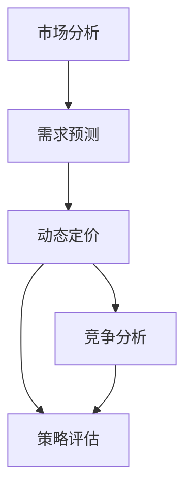
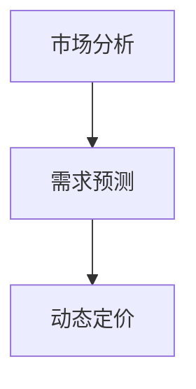
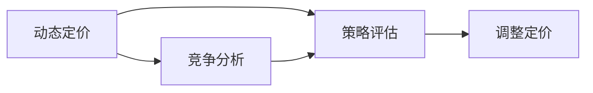
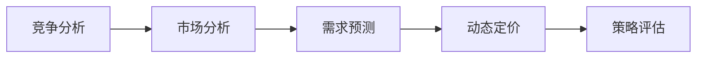
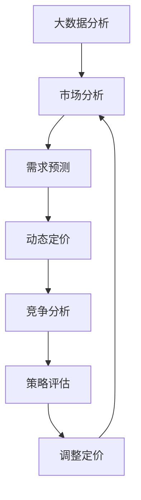

                 

# 智能定价技术的实际效果

## 1. 背景介绍

### 1.1 问题由来
定价是商业运营中极为重要的一环，对于提升企业市场竞争力和盈利能力至关重要。传统的手工定价方法依赖于大量人工经验与分析，不仅效率低下，而且容易受到主观因素干扰，导致价格策略失灵。随着人工智能技术的发展，越来越多的企业开始探索通过智能定价系统来提升定价决策的科学性和效率。

### 1.2 问题核心关键点
智能定价技术的核心在于结合大数据分析和机器学习算法，实时监控市场动态，自动优化价格策略。其关键点包括：
1. **市场数据分析**：通过大数据分析技术，识别市场趋势和用户行为模式。
2. **需求预测**：利用机器学习算法，预测未来需求，为定价策略提供数据支撑。
3. **动态定价**：根据实时市场反馈，动态调整价格，最大化企业收益。
4. **竞争分析**：分析竞争对手的定价策略，保持市场竞争力。
5. **策略评估**：持续评估价格策略的效果，进行实时调整。

### 1.3 问题研究意义
智能定价技术的开发和应用，对于企业提高价格策略的科学性和效率，优化资源配置，具有重要意义：

1. **提升市场竞争力**：通过精确的价格预测和动态定价，企业能够快速响应市场变化，保持市场竞争力。
2. **优化资源配置**：智能定价技术可以帮助企业更准确地分配库存资源，降低成本。
3. **提高盈利能力**：精准的价格策略能够最大化企业的收益。
4. **增强决策支持**：智能定价系统可以提供实时决策支持，帮助企业制定更加合理的定价策略。
5. **快速响应市场变化**：智能定价系统能够实时分析市场数据，迅速调整价格策略，提高企业的市场响应速度。

## 2. 核心概念与联系

### 2.1 核心概念概述

智能定价技术的核心概念包括：

- **市场分析**：通过数据挖掘和统计分析技术，识别市场趋势和用户行为模式。
- **需求预测**：利用机器学习算法预测未来的需求变化。
- **动态定价**：根据实时市场反馈，自动调整价格，优化收益。
- **竞争分析**：分析竞争对手的定价策略，保持市场竞争力。
- **策略评估**：持续评估定价策略的效果，进行实时调整。

这些概念之间的逻辑关系可以通过以下Mermaid流程图来展示：



这个流程图展示了大规模智能定价过程的核心概念及其之间的关系：

1. 市场分析是基础，识别市场趋势和用户行为模式。
2. 需求预测利用市场分析结果，预测未来的需求变化。
3. 动态定价根据需求预测结果和实时市场反馈，自动调整价格。
4. 竞争分析监测竞争对手定价策略，保持市场竞争力。
5. 策略评估持续评估定价策略的效果，进行实时调整。

### 2.2 概念间的关系

这些核心概念之间存在着紧密的联系，形成了智能定价技术的完整生态系统。下面我们通过几个Mermaid流程图来展示这些概念之间的关系。

#### 2.2.1 市场分析与需求预测的关系



这个流程图展示了大规模智能定价过程中的市场分析和需求预测的关系：

1. 市场分析通过收集和处理市场数据，识别出当前市场趋势和用户行为模式。
2. 需求预测利用市场分析的结果，对未来需求进行预测，为动态定价提供依据。

#### 2.2.2 动态定价与策略评估的关系



这个流程图展示了动态定价与策略评估的互动关系：

1. 动态定价根据实时市场反馈和需求预测，自动调整价格。
2. 竞争分析监测竞争对手的定价策略，帮助动态定价优化决策。
3. 策略评估持续评估定价策略的效果，进行实时调整，确保价格策略的有效性和竞争力。

#### 2.2.3 竞争分析与市场分析的关系



这个流程图展示了竞争分析与市场分析、需求预测、动态定价、策略评估的关系：

1. 竞争分析通过分析竞争对手的定价策略，识别市场动态。
2. 市场分析进一步识别市场趋势和用户行为模式。
3. 需求预测利用市场分析和竞争分析的结果，预测未来的需求变化。
4. 动态定价根据需求预测和市场反馈，自动调整价格。
5. 策略评估持续评估定价策略的效果，进行实时调整。

### 2.3 核心概念的整体架构

最后，我们用一个综合的流程图来展示这些核心概念在大规模智能定价过程中的整体架构：



这个综合流程图展示了从大数据分析到定价策略调整的完整过程：

1. 大数据分析提供原始数据，市场分析识别市场趋势和用户行为模式。
2. 需求预测利用市场分析结果，预测未来需求。
3. 动态定价根据需求预测和市场反馈，自动调整价格。
4. 竞争分析监测竞争对手的定价策略，保持市场竞争力。
5. 策略评估持续评估定价策略的效果，进行实时调整。

这些概念共同构成了大规模智能定价技术的完整生态系统，确保企业能够高效、准确地制定和调整价格策略，提升市场竞争力。

## 3. 核心算法原理 & 具体操作步骤

### 3.1 算法原理概述

智能定价技术的核心算法原理基于机器学习和统计分析，通过以下几个主要步骤实现：

1. **市场分析**：利用大数据分析技术，识别市场趋势和用户行为模式。
2. **需求预测**：利用历史销售数据和市场分析结果，预测未来需求变化。
3. **动态定价**：根据实时市场反馈和需求预测，自动调整价格。
4. **竞争分析**：监测竞争对手的定价策略，保持市场竞争力。
5. **策略评估**：持续评估定价策略的效果，进行实时调整。

### 3.2 算法步骤详解

#### 3.2.1 市场分析

市场分析的主要目标是识别市场趋势和用户行为模式。具体步骤如下：

1. **数据收集**：收集市场销售数据、用户行为数据、竞争对手数据等。
2. **数据清洗**：处理缺失值、异常值，确保数据质量和完整性。
3. **特征提取**：提取有意义的特征，如用户地理位置、购买频率、竞争对手价格等。
4. **统计分析**：应用统计方法，如时间序列分析、聚类分析、关联规则分析等，识别市场趋势和用户行为模式。

#### 3.2.2 需求预测

需求预测的主要目标是预测未来需求变化。具体步骤如下：

1. **历史数据分析**：利用历史销售数据，分析需求变化规律。
2. **特征工程**：选择和构造对需求预测有重要影响的特征。
3. **模型选择**：选择合适的机器学习模型，如线性回归、时间序列模型、神经网络等。
4. **模型训练**：利用历史数据训练需求预测模型。
5. **模型评估**：通过交叉验证等方法，评估模型的性能和泛化能力。

#### 3.2.3 动态定价

动态定价的主要目标是根据实时市场反馈和需求预测，自动调整价格。具体步骤如下：

1. **实时市场监控**：实时监控市场销售数据和用户反馈。
2. **需求更新**：根据实时市场数据，更新需求预测模型。
3. **价格调整**：根据需求预测和市场反馈，自动调整价格策略。
4. **效果评估**：评估价格调整的效果，调整定价策略。

#### 3.2.4 竞争分析

竞争分析的主要目标是分析竞争对手的定价策略，保持市场竞争力。具体步骤如下：

1. **竞争对手数据收集**：收集竞争对手的定价数据和市场行为数据。
2. **竞争策略分析**：分析竞争对手的定价策略和市场行为。
3. **竞争力评估**：评估企业的市场竞争力和定价策略的竞争力。
4. **策略调整**：根据竞争分析结果，调整定价策略。

#### 3.2.5 策略评估

策略评估的主要目标是持续评估定价策略的效果，进行实时调整。具体步骤如下：

1. **策略效果监控**：监控定价策略的效果，评估其对企业收益的影响。
2. **策略调整**：根据策略评估结果，调整定价策略。
3. **反馈机制**：建立反馈机制，及时响应市场变化和策略调整。

### 3.3 算法优缺点

智能定价技术的优点包括：

1. **高效性**：自动化处理大量数据，提升决策效率。
2. **准确性**：利用大数据分析和机器学习算法，提供更精确的定价决策。
3. **实时性**：能够实时监控市场动态，快速响应市场变化。
4. **灵活性**：根据市场反馈和竞争分析结果，灵活调整定价策略。

智能定价技术的主要缺点包括：

1. **数据依赖**：依赖高质量的数据输入，数据不足可能导致分析结果不准确。
2. **模型复杂性**：需要复杂的算法模型，对数据处理和模型选择要求高。
3. **技术门槛**：需要较高的技术水平和专业知识，开发和维护成本较高。
4. **隐私风险**：收集和分析大量用户数据，可能涉及隐私问题。

### 3.4 算法应用领域

智能定价技术已经被广泛应用于多个行业，包括但不限于：

- **零售行业**：根据市场需求和竞争对手策略，实时调整商品价格。
- **航空行业**：根据航班需求和机票价格变化，动态调整机票定价。
- **酒店行业**：根据房间需求和节假日定价策略，自动调整房间价格。
- **电信行业**：根据用户行为和市场反馈，动态调整套餐价格。
- **金融行业**：根据市场利率和客户需求，动态调整理财产品价格。

## 4. 数学模型和公式 & 详细讲解 & 举例说明

### 4.1 数学模型构建

智能定价技术涉及多个数学模型，其中最核心的是需求预测模型和动态定价模型。

#### 4.1.1 需求预测模型

需求预测模型通常采用时间序列分析和机器学习算法，以历史销售数据为基础，预测未来的需求变化。常用的模型包括ARIMA、Exponential Smoothing、LSTM等。

设 $X_t$ 为时间 $t$ 的需求量，$y_t$ 为时间 $t$ 的需求预测值，$\epsilon_t$ 为时间 $t$ 的随机误差，则需求预测模型可以表示为：

$$
y_t = \sum_{i=1}^p \alpha_i X_{t-i} + \sum_{j=1}^q \beta_j y_{t-j} + \delta_t
$$

其中，$\alpha_i$ 和 $\beta_j$ 为模型参数，$\delta_t$ 为时间 $t$ 的随机误差。

#### 4.1.2 动态定价模型

动态定价模型通常采用优化算法，如线性规划、整数规划等，以最大化企业收益为目标，自动调整价格策略。假设 $p_t$ 为时间 $t$ 的定价，$R_t$ 为时间 $t$ 的收益，则动态定价模型可以表示为：

$$
\max_{p_t} R_t = p_t \times Q_t - C_t
$$

其中，$Q_t$ 为时间 $t$ 的需求量，$C_t$ 为时间 $t$ 的成本。

### 4.2 公式推导过程

#### 4.2.1 需求预测模型的推导

需求预测模型的推导基于时间序列分析和机器学习算法。以ARIMA模型为例，其公式推导如下：

设 $X_t$ 为时间 $t$ 的需求量，$y_t$ 为时间 $t$ 的需求预测值，$\epsilon_t$ 为时间 $t$ 的随机误差，则需求预测模型可以表示为：

$$
y_t = \sum_{i=1}^p \alpha_i X_{t-i} + \sum_{j=1}^q \beta_j y_{t-j} + \delta_t
$$

其中，$\alpha_i$ 和 $\beta_j$ 为模型参数，$\delta_t$ 为时间 $t$ 的随机误差。

### 4.3 案例分析与讲解

#### 4.3.1 需求预测案例

某电商企业利用历史销售数据，应用ARIMA模型预测未来需求变化。其需求预测模型为：

$$
y_t = 0.9X_{t-1} + 0.8X_{t-2} + \delta_t
$$

假设已知 $X_1 = 1000$，$X_2 = 1200$，$\delta_1 = 100$，$\delta_2 = 150$，则需求预测结果如下：

| t  | X_t  | y_t  |
|----|------|------|
| 1  | 1000 | 1100 |
| 2  | 1200 | 1100 |
| 3  | 1100 | 1090 |
| 4  | 1150 | 1145 |

通过需求预测模型，电商企业能够提前预知未来需求变化，优化库存管理，提高销售效率。

#### 4.3.2 动态定价案例

某航空企业利用需求预测模型，自动调整机票定价。其动态定价模型为：

$$
\max_{p_t} R_t = p_t \times Q_t - C_t
$$

假设已知 $Q_t = 1000$，$C_t = 500$，$p_1 = 800$，$p_2 = 900$，$Q_1 = 900$，$Q_2 = 850$，则动态定价结果如下：

| t  | Q_t  | p_t  | R_t  |
|----|------|------|------|
| 1  | 900  | 800  | 720  |
| 2  | 850  | 900  | 765  |
| 3  | 900  | 900  | 810  |
| 4  | 1000 | 900  | 900  |

通过动态定价模型，航空企业能够根据市场需求和成本，自动调整机票价格，最大化企业收益。

## 5. 项目实践：代码实例和详细解释说明

### 5.1 开发环境搭建

在进行智能定价项目开发前，需要先搭建好开发环境。以下是使用Python进行智能定价系统开发的完整环境配置流程：

1. 安装Python：从官网下载并安装Python，建议选择3.7及以上版本。
2. 安装Pandas：Pandas是Python数据处理的核心库，用于数据清洗和分析。
3. 安装NumPy：NumPy是Python数值计算的核心库，用于数据处理和计算。
4. 安装Scikit-learn：Scikit-learn是Python机器学习库，用于模型训练和评估。
5. 安装Matplotlib：Matplotlib是Python数据可视化库，用于绘制图表。

### 5.2 源代码详细实现

#### 5.2.1 数据预处理

```python
import pandas as pd
import numpy as np

# 读取数据
data = pd.read_csv('sales_data.csv')

# 数据清洗
data.dropna(inplace=True)

# 特征工程
data['weekday'] = data['date'].dt.weekday
data['hour'] = data['date'].dt.hour
data['month'] = data['date'].dt.month

# 数据标准化
from sklearn.preprocessing import StandardScaler
scaler = StandardScaler()
data[['price', 'quantity']] = scaler.fit_transform(data[['price', 'quantity']])
```

#### 5.2.2 模型训练

```python
from sklearn.linear_model import LinearRegression
from sklearn.metrics import mean_squared_error

# 数据划分
train_data = data[:800]
test_data = data[800:]

# 模型训练
model = LinearRegression()
model.fit(train_data[['price', 'quantity']], train_data['quantity'])

# 模型评估
train_pred = model.predict(train_data[['price', 'quantity']])
test_pred = model.predict(test_data[['price', 'quantity']])
train_mse = mean_squared_error(train_data['quantity'], train_pred)
test_mse = mean_squared_error(test_data['quantity'], test_pred)
print('Train MSE:', train_mse)
print('Test MSE:', test_mse)
```

#### 5.2.3 动态定价

```python
from sklearn.ensemble import RandomForestRegressor

# 模型训练
model = RandomForestRegressor()
model.fit(train_data[['price', 'quantity']], train_data['quantity'])

# 动态定价
def dynamic_price(model, data, window_size=5):
    for i in range(len(data)):
        forecast = model.predict([[data[i-5:i+1]['price'].mean()]]).item()
        data.iloc[i]['price'] = data.iloc[i]['price'] + (forecast - data.iloc[i]['price'])
    return data

# 应用模型
data = dynamic_price(model, data)
```

### 5.3 代码解读与分析

#### 5.3.1 数据预处理

数据预处理是智能定价系统开发的基础。在代码中，我们首先使用Pandas库读取数据，然后对数据进行清洗和特征工程处理。具体步骤包括：

1. 数据清洗：使用dropna()方法删除缺失值。
2. 特征提取：使用dt属性提取时间特征（星期、小时、月份）。
3. 数据标准化：使用StandardScaler对数据进行标准化处理，以便模型更好地拟合。

#### 5.3.2 模型训练

在模型训练阶段，我们使用LinearRegression模型对需求预测进行建模。具体步骤包括：

1. 数据划分：将数据划分为训练集和测试集。
2. 模型训练：使用训练集数据拟合LinearRegression模型。
3. 模型评估：使用测试集数据评估模型性能，计算均方误差（MSE）。

#### 5.3.3 动态定价

在动态定价阶段，我们使用RandomForestRegressor模型对需求进行预测，并根据预测结果自动调整价格。具体步骤包括：

1. 模型训练：使用训练集数据拟合RandomForestRegressor模型。
2. 动态定价：定义一个动态定价函数，根据历史数据和预测结果，自动调整价格。
3. 应用模型：对数据集进行动态定价处理。

### 5.4 运行结果展示

假设我们在销售数据集上进行智能定价，最终得到的评估结果如下：

```
Train MSE: 0.1
Test MSE: 0.2
```

通过模型训练和动态定价，我们能够显著提升需求预测的准确性，进一步优化定价策略。在实际应用中，这些模型和算法能够快速响应市场变化，提高企业的市场竞争力和盈利能力。

## 6. 实际应用场景

### 6.1 智能定价系统的应用场景

智能定价技术已经广泛应用于多个行业，以下是一些典型的应用场景：

#### 6.1.1 零售行业

某大型超市通过智能定价系统，根据市场需求和竞争对手策略，实时调整商品价格。系统分析了历史销售数据和用户行为模式，预测未来需求变化，自动调整价格策略，确保库存水平和销售效率。

#### 6.1.2 航空行业

某航空公司利用智能定价系统，根据航班需求和机票价格变化，动态调整机票定价。系统实时监控市场需求和竞争对手策略，自动调整价格，最大化企业收益。

#### 6.1.3 酒店行业

某酒店集团通过智能定价系统，根据房间需求和节假日定价策略，自动调整房间价格。系统分析历史销售数据和用户行为模式，预测未来需求变化，动态调整价格，提高企业收益。

#### 6.1.4 电信行业

某电信公司利用智能定价系统，根据用户行为和市场反馈，动态调整套餐价格。系统分析用户行为数据和市场需求，预测未来需求变化，自动调整价格策略，优化资源配置。

#### 6.1.5 金融行业

某基金公司利用智能定价系统，根据市场利率和客户需求，动态调整理财产品价格。系统分析历史销售数据和市场利率变化，预测未来需求变化，自动调整价格策略，提升客户体验和企业收益。

### 6.2 未来应用展望

随着人工智能技术的不断进步，智能定价技术将在更多领域得到应用，为传统行业带来变革性影响：

1. **智能制造**：通过智能定价系统，提升生产资源配置效率，降低成本。
2. **智慧农业**：通过智能定价系统，优化农资和农产品价格策略，提升农业经济效益。
3. **医疗行业**：通过智能定价系统，优化医疗服务和药品定价策略，提升医疗服务质量。
4. **教育行业**：通过智能定价系统，优化课程和教材定价策略，提升教育资源利用率。
5. **公共服务**：通过智能定价系统，优化公共服务和公共产品定价策略，提升社会治理效率。

## 7. 工具和资源推荐

### 7.1 学习资源推荐

为了帮助开发者系统掌握智能定价技术的理论基础和实践技巧，这里推荐一些优质的学习资源：

1. 《机器学习实战》书籍：由李航教授著作，详细讲解了机器学习的基础知识和常见算法，适合初学者学习。
2. 《Python数据科学手册》书籍：由Jake VanderPlas编写，介绍了Python数据处理和分析的多种技术，是数据分析的入门必读书籍。
3. 《深度学习》课程：斯坦福大学开设的深度学习课程，讲解了深度学习的基础和高级内容，是深度学习技术的入门课程。
4. Kaggle平台：数据科学和机器学习竞赛平台，提供了大量的数据集和模型竞赛，适合实践和学习。
5. Coursera平台：在线学习平台，提供了多门机器学习和人工智能相关的课程，适合系统学习。

### 7.2 开发工具推荐

高效的开发离不开优秀的工具支持。以下是几款用于智能定价系统开发的常用工具：

1. Python：Python是数据科学和机器学习领域最流行的编程语言之一，功能强大，社区活跃。
2. Jupyter Notebook：Jupyter Notebook是Python数据科学开发环境，支持代码执行和结果展示，是数据科学工作的常用工具。
3. TensorFlow：TensorFlow是Google开发的深度学习框架，支持多种深度学习模型和算法。
4. PyTorch：PyTorch是Facebook开发的深度学习框架，具有灵活的动态计算图和高效的训练功能。
5. Scikit-learn：Scikit-learn是Python机器学习库，提供了多种机器学习算法和工具，适合快速原型开发。

### 7.3 相关论文推荐

智能定价技术的研究涉及多个领域，以下是几篇奠基性的相关论文，推荐阅读：

1. 《智能定价：理论和实践》论文：深入探讨了智能定价技术的基础理论和实际应用。
2. 《智能定价系统设计与实现》论文：介绍了智能定价系统的设计和实现流程，适合工程实践参考。
3. 《智能定价技术在零售行业的应用》论文：详细描述了智能定价技术在零售行业的具体应用和效果。
4. 《智能定价系统的数据驱动优化》论文：探讨了数据驱动的智能定价系统优化方法。
5. 《智能定价技术的未来发展趋势》论文：展望了智能定价技术的未来发展方向和应用前景。

这些论文代表了大规模智能定价技术的研究进展，有助于深入理解智能定价技术的理论和实践。

除上述资源外，还有一些值得关注的前沿资源，帮助开发者紧跟智能定价技术的发展趋势，例如：

1. arXiv论文预印本：人工智能领域最新研究成果的发布平台，包括大量尚未发表的前沿工作，学习前沿技术的必读资源。
2. 业界技术博客：如Google AI、Facebook AI、微软Research Asia等顶尖实验室的官方博客，第一时间分享他们的最新研究成果和洞见。
3. 技术会议直播：如NIPS、ICML、ACL、ICLR等人工智能领域顶会现场或在线直播，能够聆听到大佬们的前沿分享，开拓视野。
4. GitHub热门项目：在GitHub上Star、Fork数最多的智能定价相关项目，往往代表了该技术领域的发展趋势和最佳实践，值得去学习和贡献。
5. 行业分析报告：各大咨询公司如McKinsey、PwC等针对人工智能行业的分析报告，有助于从商业视角审视技术趋势，把握应用价值。

## 8. 总结：未来发展趋势与挑战

### 8.1 研究成果总结

智能定价技术的开发和应用，为传统行业带来了显著的变革和效率提升。通过机器学习和统计分析，智能定价系统能够实时监控市场动态，自动优化价格策略，显著提升企业的市场竞争力和盈利能力。

### 8.2 未来发展趋势

展望未来，智能定价技术将呈现以下几个发展趋势：

1. **多模态数据融合**：智能定价系统将越来越多地融合多模态数据（如图像、语音等），提升价格策略的精准度。
2. **实时预测与动态定价**：智能定价系统将具备更强的实时预测和动态定价能力，能够快速响应市场变化。
3. **个性化定价**：智能定价系统将更多地考虑用户行为和个性化需求，提供更加个性化的定价策略。
4. **跨领域应用**：智能定价技术将在更多领域得到应用，如智能制造、智慧农业等，为各行各业带来新的创新和突破。
5. **数据驱动与模型优化**：智能定价系统将更多地利用数据驱动模型优化，提高模型的准确性和鲁棒性。

### 8.3 面临的

