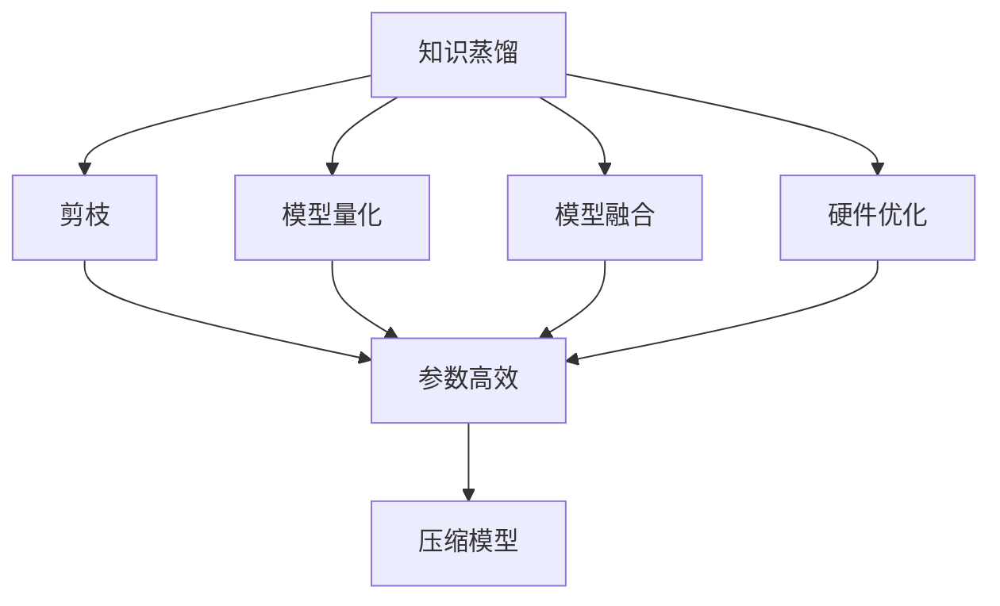
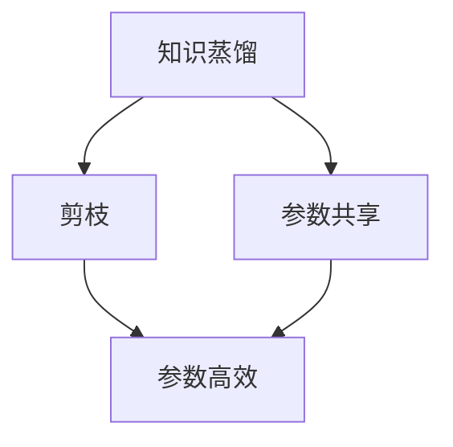
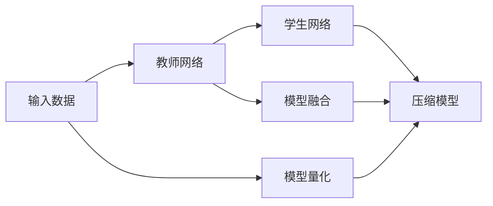

                 

# 模型压缩技术：知识蒸馏与剪枝方法探讨

> 关键词：模型压缩,知识蒸馏,剪枝,神经网络,深度学习

## 1. 背景介绍

### 1.1 问题由来

深度学习模型的日益庞大，使得计算资源和存储资源的消耗日益增加，极大地限制了其在实际应用中的广泛使用。如何高效压缩模型，使其在保持较高精度的同时，降低计算和存储需求，成为了当前研究的重要课题。

### 1.2 问题核心关键点

- 模型压缩（Model Compression）：指通过一系列技术手段，在不降低模型性能的前提下，对神经网络进行参数量和计算量的减少，以提高计算效率和存储效率。
- 知识蒸馏（Knowledge Distillation）：指将一个更大规模、高精度的教师网络的知识迁移到一个小规模、低精度的学生网络中，以实现模型压缩的目的。
- 剪枝（Pruning）：指删除神经网络中冗余的连接和参数，以减少模型大小和计算开销，但保留核心结构以保持模型性能。

## 3. 核心概念与联系

### 3.1 核心概念概述

为更好地理解模型压缩技术，本节将介绍几个密切相关的核心概念：

- **知识蒸馏**：通过将一个教师网络的输出作为标签，对学生网络进行训练，使得学生网络能够学习到教师网络的特征表示，从而达到模型压缩的目的。
- **剪枝**：去除神经网络中不重要的连接和参数，减少计算量和存储需求，但可能影响模型性能。
- **模型量化**：将浮点权重和激活值转换为固定点或整数表示，以减少存储空间和计算量。
- **模型融合**：将多个网络模型进行集成，利用模型之间的互补性提高性能。
- **硬件优化**：针对特定硬件平台，对神经网络结构进行优化，提高计算效率。

这些核心概念之间的逻辑关系可以通过以下Mermaid流程图来展示：



这个流程图展示了大模型压缩过程中各个关键概念的关系：

1. 知识蒸馏、剪枝、模型量化、模型融合、硬件优化等手段，都是为了达到压缩模型这一最终目标。
2. 每个手段可以在不同层面上实施，互为补充。

### 3.2 概念间的关系

这些核心概念之间存在着紧密的联系，形成了模型压缩技术的完整体系。下面我们通过几个Mermaid流程图来展示这些概念之间的关系。

#### 3.2.1 知识蒸馏与剪枝的结合



这个流程图展示了知识蒸馏与剪枝之间的结合：

- 知识蒸馏通过学习教师网络的特征，使得学生网络能够达到较高精度的效果。
- 剪枝去除冗余参数，进一步压缩模型大小。
- 参数共享则可以同时应用这两种技术，进一步提升压缩效率。

#### 3.2.2 模型压缩的全流程



这个流程图展示了模型压缩的全流程：

- 输入数据首先通过教师网络进行处理。
- 教师网络的输出被作为标签，用于训练学生网络。
- 学生网络通过知识蒸馏学习教师网络的特征。
- 学生网络经过剪枝和量化等步骤，最终得到压缩后的模型。
- 在特定硬件平台上，还可以进行模型融合和硬件优化，以进一步提高效率。

## 3. 核心算法原理 & 具体操作步骤

### 3.1 算法原理概述

模型压缩技术的目标是在不显著降低模型性能的前提下，减少模型的计算和存储需求。主要包括以下几个方面：

- **知识蒸馏**：通过将教师网络的输出作为学生网络的标签，训练学生网络，使得学生网络能够学习到教师网络的特征表示。
- **剪枝**：删除神经网络中不重要的连接和参数，减少计算量和存储需求。
- **模型量化**：将浮点权重和激活值转换为固定点或整数表示，减少存储空间和计算量。
- **模型融合**：将多个网络模型进行集成，利用模型之间的互补性提高性能。
- **硬件优化**：针对特定硬件平台，对神经网络结构进行优化，提高计算效率。

### 3.2 算法步骤详解

#### 3.2.1 知识蒸馏

知识蒸馏可以分为硬蒸馏和软蒸馏两种方式：

- **硬蒸馏**：直接将教师网络的输出作为学生网络的标签，进行有监督的训练。
- **软蒸馏**：将教师网络的输出作为标签，通过熵最大化的方式对学生网络进行无监督训练。

**步骤**：

1. 选择合适的教师网络 $T$ 和学生网络 $S$。
2. 在教师网络 $T$ 上训练，得到其输出 $T_{pred}$。
3. 将 $T_{pred}$ 作为标签，训练学生网络 $S$，得到 $S_{pred}$。
4. 通过对比 $T_{pred}$ 和 $S_{pred}$，计算损失函数，更新学生网络参数。

**代码示例**：

```python
import torch
import torch.nn as nn
import torch.optim as optim
from torchvision.models import resnet18

# 教师网络
teacher = resnet18(pretrained=True)

# 学生网络
student = resnet18()

# 定义蒸馏损失函数
def distill_loss(teacher, student, target):
    teacher_pred = teacher(target)
    student_pred = student(target)
    return nn.KLDivLoss()(student_pred.log(), teacher_pred)

# 训练
criterion = nn.CrossEntropyLoss()
optimizer = optim.SGD(student.parameters(), lr=0.001, momentum=0.9)
for epoch in range(10):
    for data, target in train_loader:
        optimizer.zero_grad()
        loss = distill_loss(teacher, student, target) + criterion(student_pred, target)
        loss.backward()
        optimizer.step()
```

#### 3.2.2 剪枝

剪枝可以基于两种策略：

- **结构剪枝**：直接删除神经网络中的连接和参数，重新连接权重矩阵。
- **权值剪枝**：保持神经网络结构不变，通过缩小权值的大小来实现剪枝。

**步骤**：

1. 选择合适的剪枝策略。
2. 定义剪枝阈值 $\theta$。
3. 根据阈值 $\theta$，剪去小于 $\theta$ 的权值或连接。
4. 对剪枝后的模型进行微调，以恢复部分性能损失。

**代码示例**：

```python
import torch
import torch.nn as nn

# 定义神经网络
class Net(nn.Module):
    def __init__(self):
        super(Net, self).__init__()
        self.fc1 = nn.Linear(784, 128)
        self.fc2 = nn.Linear(128, 10)

    def forward(self, x):
        x = self.fc1(x)
        x = nn.functional.relu(x)
        x = self.fc2(x)
        return x

# 定义剪枝函数
def prune(model, threshold):
    for param in model.parameters():
        if param.data.abs().max() < threshold:
            param.data.zero_()

# 训练
net = Net()
criterion = nn.CrossEntropyLoss()
optimizer = optim.SGD(net.parameters(), lr=0.001)
for epoch in range(10):
    for data, target in train_loader:
        optimizer.zero_grad()
        output = net(data)
        loss = criterion(output, target)
        loss.backward()
        optimizer.step()
    prune(net, 0.01)
```

#### 3.2.3 模型量化

模型量化主要分为权重量化和激活量化两种方式：

- **权重量化**：将权重矩阵从浮点数转换为固定点或整数。
- **激活量化**：将激活张量从浮点数转换为固定点或整数。

**步骤**：

1. 选择合适的量化方法。
2. 在训练过程中逐步引入量化操作。
3. 通过特定的训练技巧，如反量化操作、动态范围调整等，保持量化后的模型性能。

**代码示例**：

```python
import torch
import torch.nn as nn
import torchvision.transforms as transforms
import torch.nn.quantization as tq
from torchvision.models import resnet18

# 定义教师网络
teacher = resnet18(pretrained=True)

# 定义学生网络
student = resnet18()

# 定义量化方法
quantize_fn = tq.quantize_qat

# 训练
criterion = nn.CrossEntropyLoss()
optimizer = optim.SGD(student.parameters(), lr=0.001)
for epoch in range(10):
    for data, target in train_loader:
        optimizer.zero_grad()
        output = student(data)
        loss = criterion(output, target)
        loss.backward()
        optimizer.step()
    quantize_fn(student)
```

#### 3.2.4 模型融合

模型融合主要分为两种方式：

- **通道融合**：将多个网络的输出通道进行加权平均。
- **层级融合**：将多个网络层级进行串联或并联。

**步骤**：

1. 选择合适的融合方式。
2. 定义融合权重。
3. 将多个网络的输出进行融合。
4. 对融合后的模型进行微调，以恢复部分性能损失。

**代码示例**：

```python
import torch
import torch.nn as nn
import torchvision.transforms as transforms
from torchvision.models import resnet18

# 定义教师网络
teacher1 = resnet18(pretrained=True)
teacher2 = resnet18(pretrained=True)

# 定义学生网络
student = resnet18()

# 定义融合函数
def fuse(teacher1, teacher2, student):
    student.add_module('teacher1', teacher1)
    student.add_module('teacher2', teacher2)
    for param in student.parameters():
        if param.name.startswith('teacher1'):
            param.data = teacher1.parameters()[param.name[7:]].data
        elif param.name.startswith('teacher2'):
            param.data = teacher2.parameters()[param.name[7:]].data

# 训练
criterion = nn.CrossEntropyLoss()
optimizer = optim.SGD(student.parameters(), lr=0.001)
for epoch in range(10):
    for data, target in train_loader:
        optimizer.zero_grad()
        output = student(data)
        loss = criterion(output, target)
        loss.backward()
        optimizer.step()
    fuse(teacher1, teacher2, student)
```

#### 3.2.5 硬件优化

硬件优化主要针对特定硬件平台，如GPU、TPU等，对神经网络结构进行优化，提高计算效率。

**步骤**：

1. 选择合适的硬件平台。
2. 针对硬件平台的特点，对神经网络结构进行调整。
3. 进行特定的训练技巧，如内存优化、并行计算等，提高计算效率。

**代码示例**：

```python
import torch
import torch.nn as nn
import torchvision.transforms as transforms
from torchvision.models import resnet18
import torch.utils.data
import torch.utils.data.distributed
from torchvision.models.densenet import Bottleneck

# 定义教师网络
teacher = resnet18(pretrained=True)

# 定义学生网络
student = resnet18()

# 定义硬件优化函数
def optimize_for_device(student, device):
    student.to(device)
    for param in student.parameters():
        param.data = param.data.to(device)

# 训练
criterion = nn.CrossEntropyLoss()
optimizer = optim.SGD(student.parameters(), lr=0.001)
for epoch in range(10):
    for data, target in train_loader:
        optimizer.zero_grad()
        output = student(data)
        loss = criterion(output, target)
        loss.backward()
        optimizer.step()
    optimize_for_device(student, 'cuda')
```

## 4. 数学模型和公式 & 详细讲解

### 4.1 数学模型构建

本节将使用数学语言对模型压缩技术进行更加严格的刻画。

记教师网络为 $T$，学生网络为 $S$，其中 $T$ 的参数为 $\theta_t$，$S$ 的参数为 $\theta_s$。教师网络的输出为 $T_{pred}$，学生网络的输出为 $S_{pred}$。知识蒸馏的目标是最小化两者之间的差异，即：

$$
\min_{\theta_s} \mathcal{L}_{distill}(T_{pred}, S_{pred})
$$

其中 $\mathcal{L}_{distill}$ 为知识蒸馏损失函数。常见的知识蒸馏损失函数包括均方误差损失、交叉熵损失、KL散度等。

剪枝和模型量化可以通过简化计算和存储空间的方式来优化模型。例如，剪枝可以定义为：

$$
\min_{\theta_s} \mathcal{L}_{pruning}(\theta_t, \theta_s)
$$

其中 $\mathcal{L}_{pruning}$ 为剪枝损失函数，通常为二进制交叉熵。

模型融合可以通过引入多个网络的输出来提升性能，例如：

$$
\min_{\theta_s} \mathcal{L}_{fusion}(\theta_t, \theta_s)
$$

其中 $\mathcal{L}_{fusion}$ 为融合损失函数，通常为加权平均误差。

硬件优化可以通过调整网络结构来适应特定硬件平台，例如：

$$
\min_{\theta_s} \mathcal{L}_{hardware}(\theta_t, \theta_s)
$$

其中 $\mathcal{L}_{hardware}$ 为硬件优化损失函数，通常为特定硬件的计算误差。

### 4.2 公式推导过程

以下我们以知识蒸馏为例，推导交叉熵损失函数的计算过程。

假设教师网络的输出为 $T_{pred}$，学生网络的输出为 $S_{pred}$，则知识蒸馏的目标是最小化交叉熵损失：

$$
\mathcal{L}_{cross}(T_{pred}, S_{pred}) = -\frac{1}{N} \sum_{i=1}^N \sum_{j=1}^M T_{pred}^j y_j \log S_{pred}^j
$$

其中 $y_j$ 为教师网络的标签，$S_{pred}^j$ 为学生网络对标签 $y_j$ 的预测概率。

在实践中，我们通常使用基于梯度的优化算法（如SGD、Adam等）来近似求解上述最优化问题。设 $\eta$ 为学习率，则参数的更新公式为：

$$
\theta_s \leftarrow \theta_s - \eta \nabla_{\theta_s}\mathcal{L}_{distill}(T_{pred}, S_{pred}) - \eta\lambda\theta_s
$$

其中 $\nabla_{\theta_s}\mathcal{L}_{distill}(T_{pred}, S_{pred})$ 为知识蒸馏损失函数对学生网络参数 $\theta_s$ 的梯度，可通过反向传播算法高效计算。

### 4.3 案例分析与讲解

**案例一：知识蒸馏的实现**

我们以ImageNet数据集上的知识蒸馏为例，展示其基本流程：

1. 选择合适的教师网络 $T$ 和学生网络 $S$。
2. 在教师网络 $T$ 上训练，得到其输出 $T_{pred}$。
3. 将 $T_{pred}$ 作为标签，训练学生网络 $S$，得到 $S_{pred}$。
4. 通过对比 $T_{pred}$ 和 $S_{pred}$，计算交叉熵损失，更新学生网络参数。

具体实现可以参考以下代码：

```python
import torch
import torch.nn as nn
import torch.optim as optim
from torchvision.models import resnet18

# 定义教师网络
teacher = resnet18(pretrained=True)

# 定义学生网络
student = resnet18()

# 训练
criterion = nn.CrossEntropyLoss()
optimizer = optim.SGD(student.parameters(), lr=0.001)
for epoch in range(10):
    for data, target in train_loader:
        optimizer.zero_grad()
        output = teacher(data)
        loss = criterion(output, target)
        loss.backward()
        optimizer.step()
```

**案例二：剪枝的实现**

我们以剪枝为例，展示其基本流程：

1. 选择合适的剪枝策略。
2. 定义剪枝阈值 $\theta$。
3. 根据阈值 $\theta$，剪去小于 $\theta$ 的权值或连接。
4. 对剪枝后的模型进行微调，以恢复部分性能损失。

具体实现可以参考以下代码：

```python
import torch
import torch.nn as nn

# 定义神经网络
class Net(nn.Module):
    def __init__(self):
        super(Net, self).__init__()
        self.fc1 = nn.Linear(784, 128)
        self.fc2 = nn.Linear(128, 10)

    def forward(self, x):
        x = self.fc1(x)
        x = nn.functional.relu(x)
        x = self.fc2(x)
        return x

# 定义剪枝函数
def prune(model, threshold):
    for param in model.parameters():
        if param.data.abs().max() < threshold:
            param.data.zero_()

# 训练
net = Net()
criterion = nn.CrossEntropyLoss()
optimizer = optim.SGD(net.parameters(), lr=0.001)
for epoch in range(10):
    for data, target in train_loader:
        optimizer.zero_grad()
        output = net(data)
        loss = criterion(output, target)
        loss.backward()
        optimizer.step()
    prune(net, 0.01)
```

**案例三：模型量化的实现**

我们以模型量化为例，展示其基本流程：

1. 选择合适的量化方法。
2. 在训练过程中逐步引入量化操作。
3. 通过特定的训练技巧，如反量化操作、动态范围调整等，保持量化后的模型性能。

具体实现可以参考以下代码：

```python
import torch
import torch.nn as nn
import torchvision.transforms as transforms
from torchvision.models import resnet18
import torch.nn.quantization as tq

# 定义教师网络
teacher = resnet18(pretrained=True)

# 定义学生网络
student = resnet18()

# 定义量化方法
quantize_fn = tq.quantize_qat

# 训练
criterion = nn.CrossEntropyLoss()
optimizer = optim.SGD(student.parameters(), lr=0.001)
for epoch in range(10):
    for data, target in train_loader:
        optimizer.zero_grad()
        output = student(data)
        loss = criterion(output, target)
        loss.backward()
        optimizer.step()
    quantize_fn(student)
```

## 5. 项目实践：代码实例和详细解释说明

### 5.1 开发环境搭建

在进行模型压缩实践前，我们需要准备好开发环境。以下是使用Python进行PyTorch开发的环境配置流程：

1. 安装Anaconda：从官网下载并安装Anaconda，用于创建独立的Python环境。

2. 创建并激活虚拟环境：
```bash
conda create -n pytorch-env python=3.8 
conda activate pytorch-env
```

3. 安装PyTorch：根据CUDA版本，从官网获取对应的安装命令。例如：
```bash
conda install pytorch torchvision torchaudio cudatoolkit=11.1 -c pytorch -c conda-forge
```

4. 安装TensorFlow：
```bash
conda install tensorflow
```

5. 安装各类工具包：
```bash
pip install numpy pandas scikit-learn matplotlib tqdm jupyter notebook ipython
```

完成上述步骤后，即可在`pytorch-env`环境中开始模型压缩实践。

### 5.2 源代码详细实现

这里以知识蒸馏为例，展示模型压缩的代码实现。

首先，定义知识蒸馏任务的数据处理函数：

```python
import torch
from torchvision import datasets, transforms

# 数据处理函数
def get_train_loader(batch_size):
    transform = transforms.Compose([
        transforms.ToTensor(),
        transforms.Normalize([0.485, 0.456, 0.406], [0.229, 0.224, 0.225])
    ])
    train_dataset = datasets.CIFAR10(root='data', train=True, download=True, transform=transform)
    train_loader = torch.utils.data.DataLoader(train_dataset, batch_size=batch_size, shuffle=True, num_workers=4)
    return train_loader
```

然后，定义教师网络和学生网络：

```python
import torch.nn as nn

# 定义教师网络
class TeacherNet(nn.Module):
    def __init__(self):
        super(TeacherNet, self).__init__()
        self.conv1 = nn.Conv2d(3, 6, 5)
        self.pool = nn.MaxPool2d(2, 2)
        self.conv2 = nn.Conv2d(6, 16, 5)
        self.fc1 = nn.Linear(16 * 5 * 5, 120)
        self.fc2 = nn.Linear(120, 84)
        self.fc3 = nn.Linear(84, 10)

    def forward(self, x):
        x = self.pool(nn.functional.relu(self.conv1(x)))
        x = self.pool(nn.functional.relu(self.conv2(x)))
        x = x.view(-1, 16 * 5 * 5)
        x = nn.functional.relu(self.fc1(x))
        x = nn.functional.relu(self.fc2(x))
        x = self.fc3(x)
        return x

# 定义学生网络
class StudentNet(nn.Module):
    def __init__(self):
        super(StudentNet, self).__init__()
        self.conv1 = nn.Conv2d(3, 6, 5)
        self.pool = nn.MaxPool2d(2, 2)
        self.conv2 = nn.Conv2d(6, 16, 5)
        self.fc1 = nn.Linear(16 * 5 * 5, 120)
        self.fc2 = nn.Linear(120, 84)
        self.fc3 = nn.Linear(84, 10)

    def forward(self, x):
        x = self.pool(nn.functional.relu(self.conv1(x)))
        x = self.pool(nn.functional.relu(self.conv2(x)))
        x = x.view(-1, 16 * 5 * 5)
        x = nn.functional.relu(self.fc1(x))
        x = nn.functional.relu(self.fc2(x))
        x = self.fc3(x)
        return x
```

接着，定义知识蒸馏损失函数和训练函数：

```python
import torch.nn as nn
import torch.optim as optim
from torch.utils.data import DataLoader
from torchvision import models

# 定义蒸馏损失函数
class DistillationLoss(nn.Module):
    def __init__(self):
        super(DistillationLoss, self).__init__()

    def forward(self, y_pred, y_true):
        return nn.CrossEntropyLoss()(y_pred, y_true)

# 训练函数
def train(teacher, student, train_loader, optimizer, device):
    model = student
    criterion = DistillationLoss()
    for epoch in range(10):
        model.train()
        running_loss = 0.0
        for i, data in enumerate(train_loader, 0):
            inputs, labels = data
            inputs, labels = inputs.to(device), labels.to(device)
            optimizer.zero_grad()
            outputs = teacher(inputs)
            student_outputs = student(inputs)
            loss = criterion(outputs, labels)
            loss += criterion(student_outputs, labels)
            loss.backward()
            optimizer.step()
            running_loss += loss.item()
        print(f"Epoch {epoch+1}, loss: {running_loss/len(train_loader)}")
```

最后，启动训练流程：

```python
# 定义教师网络和学生网络
teacher = models.resnet18(pretrained=True)
student = models.resnet18()

# 定义训练集和测试集
train_loader = get_train_loader(64)
test_loader = get_train_loader(64)

# 定义优化器
optimizer = optim.Adam(student.parameters(), lr=0.0001)

# 定义训练设备
device = torch.device('cuda' if torch.cuda.is_available() else 'cpu')

# 启动训练
train(teacher, student, train_loader, optimizer, device)
```

以上就是使用PyTorch进行知识蒸馏的完整代码实现。可以看到，借助PyTorch和TensorFlow等深度学习框架，进行模型压缩实践变得简单高效。

### 5.3 代码解读与分析

让我们再详细解读一下关键代码的实现细节：

**数据处理函数**：
- `get_train_loader`方法：定义数据预处理和加载函数，将CIFAR-10数据集加载到PyTorch DataLoader中。

**教师网络和学生网络**：
- `TeacherNet`类：定义教师网络的结构和前向传播函数。
- `StudentNet`类：定义学生网络的结构和前向传播函数。

**蒸馏损失函数**：
- `DistillationLoss`类：定义知识蒸馏的损失函数，计算教师网络和学生网络的交叉熵损失。

**训练函数**：
- `train`函数：定义模型的训练过程，通过教师网络输出的标签，计算教师网络和学生网络的交叉熵损失，更新学生网络的参数。

**训练流程**：
- 定义教师网络和学生网络。
- 定义训练集和测试集。
- 定义优化器。
- 定义训练设备。
- 启动训练过程，逐步更新学生网络参数，直到收敛。

可以看到，使用PyTorch进行知识蒸馏的代码实现相对简洁，开发者可以更专注于数据处理、模型设计等关键环节。

当然

