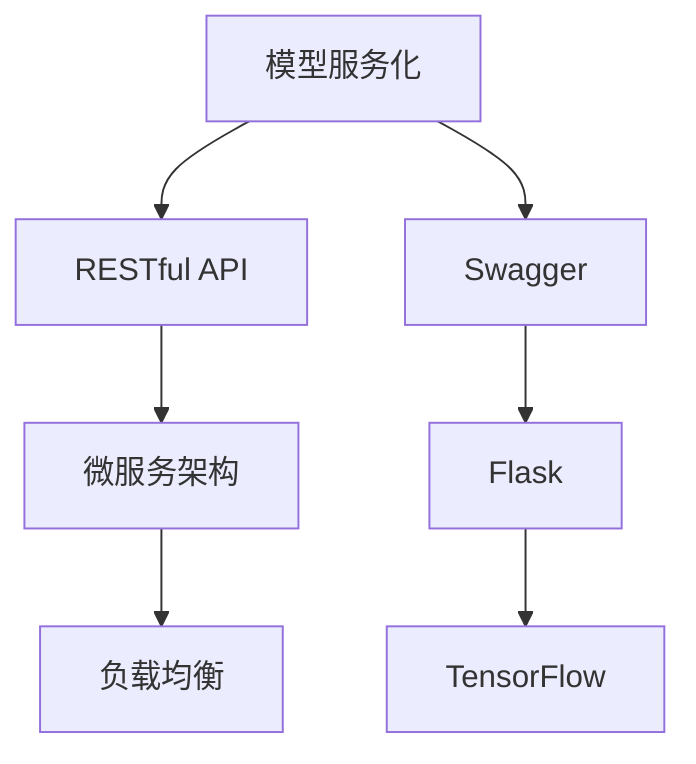

                 

# 模型服务化与API设计原理与代码实战案例讲解

> 关键词：
- 模型服务化
- API设计
- RESTful API
- 微服务架构
- 负载均衡
- Kubernetes
- Swagger
- Flask
- TensorFlow

## 1. 背景介绍

随着深度学习模型的不断发展，大模型在各种场景中的应用越来越广泛，例如自然语言处理、计算机视觉、推荐系统等。但这些大模型往往需要消耗大量的计算资源，难以直接在用户设备上运行。为了解决这一问题，模型服务化应运而生。

模型服务化将大模型封装为服务，通过API接口对外提供模型推理功能。这不仅降低了模型部署的复杂度，还大大提高了模型的可扩展性和灵活性。然而，在实践中，API设计是一个至关重要的环节，好的API设计能够显著提升系统的可用性和用户体验。本文将深入探讨模型服务化的原理与实践，同时通过几个实际案例，讲解如何设计高性能、高可靠性的API。

## 2. 核心概念与联系

### 2.1 核心概念概述

在讨论模型服务化和API设计前，我们首先需要理解一些关键概念：

- **模型服务化**：将大模型封装为服务，通过API接口对外提供模型推理功能，以便于应用程序调用。
- **API设计**：API设计是指通过接口设计，提供一套标准的、易于使用的接口，以便用户可以方便地调用模型服务。
- **RESTful API**：一种基于REST架构风格的API设计风格，支持HTTP协议，以资源为中心，通过HTTP请求和响应来处理数据。
- **微服务架构**：将应用程序拆分为多个小型、独立的服务，每个服务负责一个独立的功能模块，增强系统的可扩展性和维护性。
- **负载均衡**：通过均衡分配请求到多个服务器，提高系统的并发处理能力和可用性。
- **Kubernetes**：一种开源的容器编排工具，能够自动化管理容器的生命周期，支持多种负载均衡策略。
- **Swagger**：一种用于API设计的工具，能够自动生成API文档和代码示例，方便用户理解和调用API。
- **Flask**：一种轻量级的Python Web框架，用于构建API服务。
- **TensorFlow**：一种开源的机器学习框架，支持模型的训练和推理。

### 2.2 概念间的关系

这些概念之间存在着紧密的联系，形成了模型服务化与API设计的完整架构。下图展示了这些概念之间的关系：



该图表展示了大模型服务化与API设计的各个环节，以及它们之间的相互关系。

## 3. 核心算法原理 & 具体操作步骤

### 3.1 算法原理概述

模型服务化与API设计的核心思想是将大模型封装为服务，通过API接口提供模型的推理功能。在实践中，我们通常采用微服务架构和RESTful API设计风格来实现这一目标。

微服务架构将大模型拆分为多个小型、独立的服务，每个服务负责一个独立的功能模块，支持弹性扩展和故障隔离。RESTful API设计风格通过资源为中心的设计，支持标准的HTTP请求和响应，便于用户理解和调用。

### 3.2 算法步骤详解

以下是模型服务化和API设计的主要步骤：

1. **模型训练和保存**：在模型服务化的过程中，首先需要对模型进行训练，并在训练结束后保存模型的参数。可以使用TensorFlow等框架进行模型的训练，并使用TensorFlow SavedModel或ONNX等格式保存模型。

2. **API设计和文档**：设计RESTful API接口，包括资源路径、HTTP方法、请求参数和响应数据。使用Swagger等工具自动生成API文档，方便用户调用API。

3. **服务部署和配置**：使用Docker等容器技术，将模型服务化部署为容器。使用Kubernetes等容器编排工具，实现服务的自动部署和管理。

4. **负载均衡和容错**：使用负载均衡技术，将请求均衡分配到多个服务实例上，提高系统的并发处理能力和可用性。使用重试、降级等容错机制，增强系统的鲁棒性。

5. **API调用和反馈**：通过HTTP请求调用API接口，获取模型的推理结果。使用日志、监控等工具，收集API调用的性能指标和错误信息，及时发现和解决问题。

### 3.3 算法优缺点

模型服务化和API设计具有以下优点：

- **灵活性**：通过微服务架构和RESTful API设计，可以灵活地扩展和部署模型服务，支持多种应用场景。
- **可扩展性**：将大模型拆分为多个小型服务，支持横向扩展，提高系统的并发处理能力。
- **可维护性**：微服务架构将系统拆分为多个独立的服务，便于维护和升级。
- **易用性**：RESTful API设计风格支持标准的HTTP请求和响应，便于用户调用API。

然而，模型服务化和API设计也存在一些缺点：

- **复杂性**：模型服务化和API设计涉及多个技术和工具，需要较高的技术门槛。
- **资源消耗**：模型服务化和API设计涉及容器部署和负载均衡，需要消耗额外的计算资源。
- **性能瓶颈**：API接口的调用和数据传输可能会成为性能瓶颈，影响系统的响应速度。

### 3.4 算法应用领域

模型服务化和API设计在各个领域都有广泛的应用，例如：

- **自然语言处理**：提供基于BERT、GPT等模型的API接口，用于文本分类、情感分析、问答等任务。
- **计算机视觉**：提供基于ResNet、CNN等模型的API接口，用于图像识别、物体检测、人脸识别等任务。
- **推荐系统**：提供基于神经网络模型的API接口，用于推荐商品、内容等。
- **金融风控**：提供基于逻辑回归、决策树的API接口，用于信用评估、风险控制等。

## 4. 数学模型和公式 & 详细讲解

### 4.1 数学模型构建

在模型服务化和API设计的实践中，我们通常使用微服务架构和RESTful API设计风格来实现。以下是模型服务化的数学模型构建：

假设模型为$f(x)$，其中$x$为输入，$f(x)$为输出。模型服务化将大模型封装为服务，通过API接口提供模型的推理功能。API接口定义如下：

- 输入：$x$
- 输出：$f(x)$

API接口的请求路径为`/predict`，HTTP方法为`POST`。请求参数为`x`，响应结果为`f(x)`。

### 4.2 公式推导过程

以下是API接口的请求和响应示例：

请求：
```http
POST /predict
Content-Type: application/json
```
请求体：
```json
{
    "x": [1.0, 2.0, 3.0]
}
```

响应：
```http
HTTP/1.1 200 OK
Content-Type: application/json
```
响应体：
```json
{
    "y": [4.0, 5.0, 6.0]
}
```

其中，`/predict`为API接口的请求路径，`POST`为HTTP方法，`application/json`为请求和响应的数据格式，`x`为请求参数，`f(x)`为响应结果。

### 4.3 案例分析与讲解

以下是一个实际案例，展示如何使用Flask构建一个基于TensorFlow的模型服务，并使用API接口提供模型推理功能：

首先，使用TensorFlow训练一个简单的线性回归模型：

```python
import tensorflow as tf

# 定义模型
model = tf.keras.Sequential([
    tf.keras.layers.Dense(1, input_shape=(1,))
])

# 训练模型
model.compile(optimizer=tf.keras.optimizers.Adam(), loss='mse')
model.fit(x_train, y_train, epochs=100, validation_data=(x_val, y_val))
```

然后，使用Flask构建一个基于TensorFlow的模型服务：

```python
from flask import Flask, request, jsonify

app = Flask(__name__)

# 加载模型
model = tf.keras.models.load_model('model.h5')

# 定义API接口
@app.route('/predict', methods=['POST'])
def predict():
    data = request.json['x']
    y_pred = model.predict(data)
    y_pred = y_pred.reshape(-1, 1)
    return jsonify({'y': y_pred.tolist()})

if __name__ == '__main__':
    app.run()
```

通过该API接口，用户可以向模型服务发送请求，获取模型对输入数据的预测结果。

## 5. 项目实践：代码实例和详细解释说明

### 5.1 开发环境搭建

在进行模型服务化和API设计的实践中，我们需要准备好开发环境。以下是使用Python进行Flask开发的环境配置流程：

1. 安装Anaconda：从官网下载并安装Anaconda，用于创建独立的Python环境。

2. 创建并激活虚拟环境：
```bash
conda create -n flask-env python=3.8 
conda activate flask-env
```

3. 安装Flask：
```bash
pip install flask
```

4. 安装TensorFlow：
```bash
pip install tensorflow
```

完成上述步骤后，即可在`flask-env`环境中开始模型服务化和API设计的实践。

### 5.2 源代码详细实现

以下是使用Flask构建一个基于TensorFlow的模型服务的完整代码实现：

```python
import tensorflow as tf
from flask import Flask, request, jsonify

app = Flask(__name__)

# 加载模型
model = tf.keras.models.load_model('model.h5')

# 定义API接口
@app.route('/predict', methods=['POST'])
def predict():
    data = request.json['x']
    y_pred = model.predict(data)
    y_pred = y_pred.reshape(-1, 1)
    return jsonify({'y': y_pred.tolist()})

if __name__ == '__main__':
    app.run()
```

以上代码实现了模型的加载和API接口的定义。

### 5.3 代码解读与分析

下面是代码的详细解读和分析：

**Flask框架**：
- Flask是一个轻量级的Python Web框架，用于构建API服务。
- `app = Flask(__name__)`：创建Flask应用实例。
- `@app.route('/predict', methods=['POST'])`：定义API接口的请求路径和HTTP方法。

**模型加载**：
- `model = tf.keras.models.load_model('model.h5')`：加载预训练的模型参数。
- 使用`model.predict(data)`获取模型的推理结果。

**API接口**：
- `data = request.json['x']`：获取API请求中的输入数据。
- `y_pred = model.predict(data)`：使用模型对输入数据进行推理，得到预测结果。
- `y_pred = y_pred.reshape(-1, 1)`：将预测结果转换为二维数组。
- `return jsonify({'y': y_pred.tolist()})`：将预测结果返回为JSON格式。

### 5.4 运行结果展示

假设我们已经训练了一个简单的线性回归模型，并在本地保存了模型参数。现在，使用Flask构建的模型服务可以通过API接口对外提供模型推理功能。通过浏览器或API调用工具，可以发送请求，获取模型对输入数据的预测结果。

假设我们已经训练了一个简单的线性回归模型，并在本地保存了模型参数。现在，使用Flask构建的模型服务可以通过API接口对外提供模型推理功能。通过浏览器或API调用工具，可以发送请求，获取模型对输入数据的预测结果。

例如，使用Postman发送如下请求：

```http
POST http://127.0.0.1:5000/predict
Content-Type: application/json
```
请求体：
```json
{
    "x": [1.0, 2.0, 3.0]
}
```

响应结果为：
```http
HTTP/1.1 200 OK
Content-Type: application/json
```
响应体：
```json
{
    "y": [4.0, 5.0, 6.0]
}
```

## 6. 实际应用场景

### 6.1 智能推荐系统

智能推荐系统广泛用于电商、新闻、视频等平台，能够根据用户的兴趣和行为，推荐个性化内容。模型服务化和API设计在此场景中有着广泛的应用。

首先，使用TensorFlow等框架训练一个推荐模型，并将其封装为服务。然后，通过API接口接收用户的查询请求，并返回推荐结果。

### 6.2 金融风控

金融风控系统通过分析用户的信用记录、行为数据等，评估用户的信用风险。模型服务化和API设计在此场景中，可以将信用评估模型封装为服务，通过API接口接收用户的查询请求，并返回信用评分。

### 6.3 医疗诊断

医疗诊断系统通过分析患者的症状和历史记录，提供初步的诊断建议。模型服务化和API设计在此场景中，可以将诊断模型封装为服务，通过API接口接收患者的查询请求，并返回诊断结果。

### 6.4 未来应用展望

随着模型服务化和API设计的不断发展，其在各个领域的应用将越来越广泛。例如，智能客服、智能家居、智能交通等场景中，都可以通过模型服务化和API设计，提供更智能、更便捷的服务。

## 7. 工具和资源推荐

### 7.1 学习资源推荐

为了帮助开发者系统掌握模型服务化和API设计的理论基础和实践技巧，这里推荐一些优质的学习资源：

1. **Flask官方文档**：Flask官方提供的详细文档，涵盖了Flask的基本用法和高级功能。

2. **TensorFlow官方文档**：TensorFlow官方提供的详细文档，涵盖了TensorFlow的基本用法和高级功能。

3. **RESTful API设计指南**：阮一峰的RESTful API设计指南，详细介绍了RESTful API的设计原则和最佳实践。

4. **微服务架构指南**：O'Reilly出版社的微服务架构指南，详细介绍了微服务架构的基本概念和实践。

5. **Kubernetes官方文档**：Kubernetes官方提供的详细文档，涵盖了Kubernetes的基本用法和高级功能。

6. **Swagger官方文档**：Swagger官方提供的详细文档，涵盖了Swagger的基本用法和高级功能。

通过这些资源的学习实践，相信你一定能够快速掌握模型服务化和API设计的精髓，并用于解决实际的业务问题。

### 7.2 开发工具推荐

高效的开发离不开优秀的工具支持。以下是几款用于模型服务化和API设计的常用工具：

1. **Postman**：API调用工具，用于发送HTTP请求，获取API响应结果。

2. **Jupyter Notebook**：交互式编程环境，用于编写和测试API代码。

3. **Git**：版本控制系统，用于版本控制和管理API代码。

4. **Docker**：容器技术，用于打包和部署模型服务。

5. **Kubernetes**：容器编排工具，用于管理和部署模型服务。

6. **TensorFlow**：机器学习框架，用于训练和部署模型服务。

合理利用这些工具，可以显著提升模型服务化和API设计的开发效率，加快创新迭代的步伐。

### 7.3 相关论文推荐

模型服务化和API设计的研究始于学界的持续研究。以下是几篇奠基性的相关论文，推荐阅读：

1. **TensorFlow Serving**：TensorFlow团队开发的开源模型服务化平台，支持多种模型服务化和API设计方法。

2. **API Design for Web Services**：一篇关于API设计的经典论文，介绍了API设计的原则和最佳实践。

3. **Building Scalable Web APIs**：一本关于API设计的经典书籍，详细介绍了API设计的原理和实现方法。

4. **Microservices: Concepts, Architectures, and Examples**：一本关于微服务架构的经典书籍，详细介绍了微服务架构的基本概念和实现方法。

通过学习这些前沿成果，可以帮助研究者把握学科前进方向，激发更多的创新灵感。

## 8. 总结：未来发展趋势与挑战

### 8.1 总结

本文对模型服务化和API设计的原理与实践进行了全面系统的介绍。首先阐述了模型服务化和API设计的背景和意义，明确了其在提高系统可用性和用户体验方面的重要价值。其次，从原理到实践，详细讲解了模型服务化和API设计的数学模型和操作步骤，给出了模型服务化的完整代码实例。同时，本文还广泛探讨了模型服务化和API设计在多个行业领域的应用前景，展示了其在构建智能系统中的巨大潜力。

通过本文的系统梳理，可以看到，模型服务化和API设计已经成为构建智能系统的重要手段，极大地提高了系统的灵活性和扩展性。未来，伴随模型服务化和API设计的不断发展，相信AI技术将在更广阔的应用领域大放异彩。

### 8.2 未来发展趋势

展望未来，模型服务化和API设计将呈现以下几个发展趋势：

1. **多模型融合**：未来的模型服务化将支持多模型融合，用户可以同时调用多个模型的推理功能，获得更全面的分析结果。

2. **自动调参**：通过自动化调参技术，帮助用户快速找到最优的模型参数，提高模型服务化的性能。

3. **模型更新**：支持在线更新模型参数，及时适应新的数据和场景变化，提高模型服务化的灵活性。

4. **分布式部署**：通过分布式部署技术，支持大规模模型服务的快速部署和扩展，提高系统的可扩展性和可用性。

5. **模型推理优化**：通过优化模型推理算法，提高推理速度和效率，降低模型服务化的资源消耗。

6. **安全性增强**：增强模型服务化的安全性，防止恶意攻击和数据泄露，确保系统的稳定性和可靠性。

这些趋势凸显了模型服务化和API设计的广阔前景。这些方向的探索发展，必将进一步提升AI技术的应用价值，为人类社会带来更深远的影响。

### 8.3 面临的挑战

尽管模型服务化和API设计已经取得了瞩目成就，但在迈向更加智能化、普适化应用的过程中，它仍面临着诸多挑战：

1. **资源消耗**：模型服务化和API设计涉及大量计算资源和存储资源，如何降低资源消耗是一个重要问题。

2. **安全性问题**：模型服务化和API设计涉及大量数据传输和访问，如何防止数据泄露和攻击是一个重要问题。

3. **性能瓶颈**：API接口的调用和数据传输可能会成为性能瓶颈，影响系统的响应速度。

4. **可用性问题**：如何保证模型服务化和API设计的可用性，防止服务中断和故障是一个重要问题。

5. **维护性问题**：模型服务化和API设计涉及多个技术和工具，如何提高系统的维护性和可扩展性是一个重要问题。

6. **模型鲁棒性**：如何增强模型服务的鲁棒性，防止过拟合和模型漂移是一个重要问题。

正视模型服务化和API设计面临的这些挑战，积极应对并寻求突破，将是大模型服务化走向成熟的必由之路。相信随着学界和产业界的共同努力，这些挑战终将一一被克服，模型服务化和API设计必将在构建智能系统中扮演越来越重要的角色。

### 8.4 研究展望

面对模型服务化和API设计所面临的种种挑战，未来的研究需要在以下几个方面寻求新的突破：

1. **多模型融合技术**：开发更加高效的多模型融合算法，支持多模型同时调用和推理，提高系统的综合分析能力。

2. **自动化调参方法**：开发更加智能的自动化调参技术，帮助用户快速找到最优的模型参数，提高模型服务化的性能。

3. **在线模型更新技术**：开发更加高效和安全的在线模型更新技术，支持模型参数的实时更新，提高模型服务化的灵活性。

4. **分布式部署技术**：开发更加高效的分布式部署技术，支持大规模模型服务的快速部署和扩展，提高系统的可扩展性和可用性。

5. **推理优化技术**：开发更加高效的推理优化技术，提高推理速度和效率，降低模型服务化的资源消耗。

6. **安全性增强技术**：开发更加安全的模型服务化技术，防止恶意攻击和数据泄露，确保系统的稳定性和可靠性。

这些研究方向的探索，必将引领模型服务化和API设计技术迈向更高的台阶，为构建安全、可靠、可扩展的智能系统铺平道路。面向未来，模型服务化和API设计需要与其他AI技术进行更深入的融合，如知识表示、因果推理、强化学习等，多路径协同发力，共同推动智能系统的发展。只有勇于创新、敢于突破，才能不断拓展AI技术的边界，让智能系统更好地服务于人类社会。

## 9. 附录：常见问题与解答

**Q1：如何选择合适的API设计风格？**

A: 选择合适的API设计风格需要综合考虑应用场景、用户需求和团队技术水平。RESTful API设计风格支持标准的HTTP请求和响应，便于用户调用API。GraphQL则支持更加灵活的API查询，支持动态查询和关联查询，但需要更多的开发工作。

**Q2：如何提高API的性能和可用性？**

A: 提高API的性能和可用性需要从多个方面进行优化。例如，使用缓存技术减少重复请求，使用负载均衡技术提高系统的并发处理能力，使用限流和降级技术防止服务过载，使用异步处理技术提高系统的响应速度。

**Q3：API接口设计中需要注意哪些问题？**

A: API接口设计中需要注意以下几个问题：
1. 资源路径设计要简单、直观，避免过长和嵌套。
2. HTTP方法要合理选择，支持标准的GET、POST、PUT、DELETE等方法。
3. 请求参数和响应数据要清晰明了，避免混淆和歧义。
4. 错误处理要细致周到，避免出现404、500等异常情况。
5. 文档要详细规范，便于用户理解和调用API。

**Q4：如何保证模型服务化的安全性？**

A: 保证模型服务化的安全性需要从多个方面进行考虑。例如，使用SSL/TLS协议加密数据传输，防止数据泄露。使用访问鉴权和授权机制，防止未授权访问。使用数据脱敏和隐私保护技术，防止数据滥用。

通过这些措施，可以显著提高模型服务化和API设计的安全性，保障系统的稳定性和可靠性。

---

作者：禅与计算机程序设计艺术 / Zen and the Art of Computer Programming

