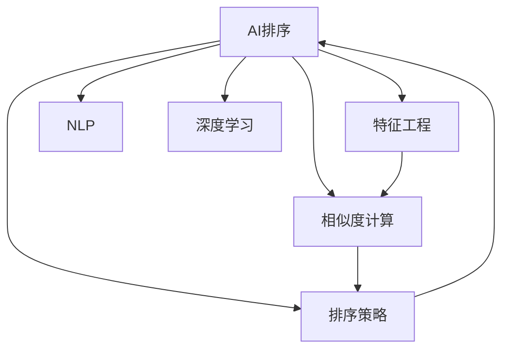
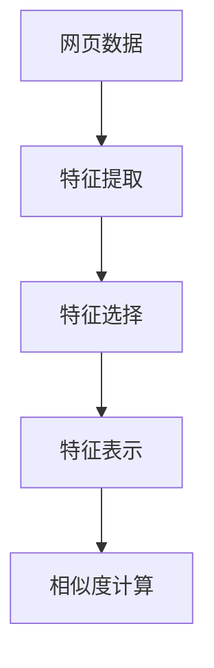
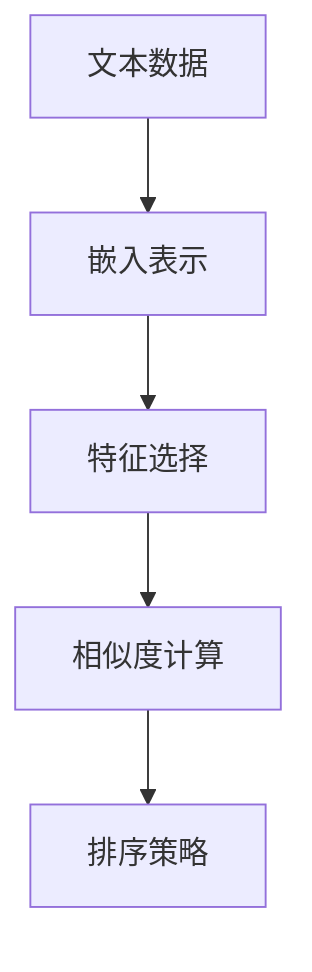
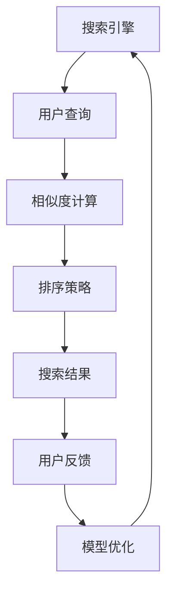

                 

# AI智能排序提升搜索结果

> 关键词：AI排序,搜索结果优化,搜索引擎,机器学习,深度学习,特征工程,自然语言处理(NLP)

## 1. 背景介绍

### 1.1 问题由来
搜索引擎作为现代互联网信息检索的重要工具，其核心任务是对用户查询输入返回最相关的网页搜索结果。随着互联网信息的爆炸性增长，搜索引擎面临的查询量和结果数量也急剧增加，如何从海量数据中快速、准确地检索到用户最感兴趣的网页，成为了搜索引擎优化的关键问题。传统搜索结果排序方法大多基于文本匹配和相关度计算，但面对海量、多源数据，效果难以满足用户需求。

近年来，人工智能(AI)技术在搜索引擎中的应用逐渐成熟，尤其是深度学习、自然语言处理(NLP)等前沿技术的引入，为提升搜索结果质量提供了新的思路和手段。通过AI智能排序，可以更好地理解用户查询意图，捕捉网页内容特征，从而实现更加精准、个性化的搜索结果排序。

### 1.2 问题核心关键点
AI智能排序的核心理念是：通过机器学习模型对网页和查询的特征进行刻画，构建更准确的相似度计算和排序策略，提升搜索结果的相关性和用户体验。其关键在于：

- 特征提取与选择：从网页和查询中提取和选择最具代表性的特征，用于训练模型。
- 相似度计算：使用基于深度学习的模型，对网页和查询的特征向量进行相似度计算，衡量相关度。
- 排序策略优化：根据相似度计算结果，优化排序策略，提升搜索结果质量。

### 1.3 问题研究意义
提升搜索结果排序，对于提高搜索引擎的使用体验、推动互联网信息生态的健康发展具有重要意义：

1. 提升搜索效率：通过智能排序，快速定位到最相关的网页，减少用户等待时间，提高搜索效率。
2. 增加用户满意度：基于用户查询意图和偏好，提供个性化搜索结果，增加用户满意度。
3. 优化流量分配：合理分配搜索结果排名，提升网页曝光率和点击率，优化流量分配，增加平台收益。
4. 探索AI应用：搜索引擎作为AI应用的重要场景，AI智能排序技术的研发和应用，有助于推动AI技术的产业化进程。
5. 增强安全性：AI智能排序可以帮助过滤恶意网站，增强搜索结果的安全性。

## 2. 核心概念与联系

### 2.1 核心概念概述

为更好地理解AI智能排序方法，本节将介绍几个密切相关的核心概念：

- AI排序：基于机器学习、深度学习等技术，对搜索结果进行智能排序的过程。
- 特征工程(Feature Engineering)：从原始数据中提取、选择、构造新的特征，用于模型训练和优化。
- 相似度计算(Similarity Calculation)：衡量查询与网页之间的相似性，计算它们的相似度。
- 排序策略(Ranking Strategy)：基于相似度计算结果，制定排序策略，确定搜索结果的展示顺序。
- 自然语言处理(NLP)：利用计算机技术处理和理解人类语言，提取文本特征，用于相似度计算。
- 深度学习(Deep Learning)：基于神经网络模型，自动提取和表示高维特征，用于相似度计算和排序策略优化。

这些核心概念之间的逻辑关系可以通过以下Mermaid流程图来展示：



这个流程图展示了大语言模型微调过程中各个核心概念的关系和作用：

1. AI排序的整体流程：先通过特征工程提取网页和查询的特征，然后进行相似度计算和排序策略优化。
2. 特征工程与相似度计算的关系：特征工程的结果是相似度计算的基础，通过提取高质量特征，提升相似度计算的准确性。
3. 深度学习与NLP的关系：深度学习模型可以从文本中自动提取特征，用于相似度计算和排序策略优化。
4. 相似度计算与排序策略的关系：相似度计算的结果用于排序策略，从而决定搜索结果的展示顺序。

### 2.2 概念间的关系

这些核心概念之间存在着紧密的联系，形成了AI智能排序的完整体系。下面我们通过几个Mermaid流程图来展示这些概念之间的关系。

#### 2.2.1 AI排序的整体流程


这个流程图展示了大语言模型微调的整体流程：

1. 从网页数据中提取、选择和表示特征，进行相似度计算。
2. 基于相似度计算结果，优化排序策略，生成搜索结果。
3. 用户反馈用于模型优化，进一步提升排序效果。

#### 2.2.2 特征工程与相似度计算的关系



这个流程图展示了特征工程和相似度计算的关系：

1. 特征提取是从网页数据中提取文本、图片等特征。
2. 特征选择是从提取出的特征中筛选出最有用的特征。
3. 特征表示是将特征转换为模型可接受的形式，用于相似度计算。
4. 相似度计算通过模型对网页和查询的特征向量进行相似度计算。

#### 2.2.3 深度学习与NLP的关系



这个流程图展示了深度学习模型和NLP技术的关系：

1. 文本数据通过NLP技术转换为向量表示。
2. 深度学习模型自动从向量表示中提取特征。
3. 特征通过相似度计算转化为相似度值。
4. 基于相似度值优化排序策略。

### 2.3 核心概念的整体架构

最后，我们用一个综合的流程图来展示这些核心概念在大语言模型微调过程中的整体架构：



这个综合流程图展示了从用户查询到搜索结果展示的完整流程：

1. 用户输入查询，搜索引擎计算相似度，生成搜索结果。
2. 搜索结果展示给用户，用户反馈优化模型，更新相似度计算和排序策略。
3. 循环迭代，提升搜索质量，满足用户需求。

## 3. 核心算法原理 & 具体操作步骤
### 3.1 算法原理概述

AI智能排序的核心原理是：通过深度学习模型，自动学习网页与查询之间的特征映射，从而计算它们之间的相似度，并据此优化排序策略，生成高质量的搜索结果。其核心步骤如下：

1. 网页数据预处理：清洗网页数据，去除噪声和无用信息，提取文本内容等特征。
2. 特征提取与选择：从网页和查询中提取特征，并进行特征选择，保留最有代表性的特征。
3. 特征表示：将提取的特征转换为向量表示，用于模型训练。
4. 相似度计算：使用深度学习模型，对网页和查询的特征向量进行相似度计算。
5. 排序策略优化：根据相似度计算结果，优化排序策略，提升搜索结果的相关性。
6. 模型评估与优化：使用用户反馈数据，评估排序效果，优化模型参数，迭代提升性能。

### 3.2 算法步骤详解

#### 3.2.1 网页数据预处理

网页数据预处理是AI排序的基础。常用的预处理方法包括：

- 去除HTML标签：去除网页中的HTML标签和特殊字符，提取纯文本内容。
- 去除停用词：过滤掉常见的停用词，保留有意义的词汇。
- 分词与词性标注：将文本进行分词和词性标注，提取词向量表示。
- 统一字符编码：将文本数据转换为统一字符编码格式，如UTF-8。

#### 3.2.2 特征提取与选择

特征提取与选择是提升模型性能的关键步骤。常见的特征提取方法包括：

- 词向量表示：使用预训练词向量模型，如GloVe、Word2Vec等，将文本转换为向量表示。
- N-gram特征：提取文本中连续的N-gram词序列，捕捉词汇组合规律。
- 图片特征：从网页中提取图片特征，如颜色、形状、纹理等，用于多模态排序。
- 网页元数据：提取网页的标题、摘要、URL、域名等元数据，用于辅助排序。

特征选择方法包括：

- 方差筛选：保留方差较大的特征，去除低效冗余特征。
- 相关系数筛选：保留与目标变量高度相关的特征，去除无关特征。
- 信息增益筛选：保留信息增益较高的特征，去除低信息增益特征。

#### 3.2.3 特征表示

特征表示是将原始特征转换为模型可接受的形式，常见方法包括：

- 词嵌入：使用预训练的词向量模型，将文本中的单词转换为低维向量表示。
- 卷积特征提取：使用卷积神经网络，对文本中的N-gram特征进行特征提取。
- 池化操作：对卷积特征进行池化操作，降低特征维度。
- 全连接层：使用全连接层将特征向量映射为模型可接受的形式，用于相似度计算。

#### 3.2.4 相似度计算

相似度计算是AI排序的核心环节。常用的相似度计算方法包括：

- 余弦相似度：计算两个向量的夹角余弦值，衡量相似度。
- Jaccard相似度：计算两个集合的交集与并集之比，衡量相似度。
- 皮尔逊相关系数：计算两个向量间的线性相关性，衡量相似度。

深度学习模型，如Transformers、BERT等，可以自动学习网页和查询之间的特征映射，进行相似度计算。具体实现方式包括：

- 编码器-解码器结构：使用双向编码器-解码器结构，将查询和网页的特征向量进行匹配，输出相似度。
- 注意力机制：使用注意力机制，关注网页中与查询最相关的部分，提升相似度计算的准确性。
- 跨模态相似度计算：引入多模态特征，如图片特征，综合计算相似度。

#### 3.2.5 排序策略优化

排序策略优化是提升搜索结果排序效果的关键步骤。常见的排序策略包括：

- 线性排序：根据相似度值直接排序，简单高效。
- 加权排序：根据相似度值和用户偏好，加权计算排序。
- 点击率排序：根据点击率数据，优化排序策略，提升用户体验。
- 实时排序：根据用户行为数据，动态调整排序策略，提升实时性。

### 3.3 算法优缺点

AI智能排序方法具有以下优点：

- 自动化特征提取：深度学习模型可以自动学习网页和查询的特征映射，无需人工干预。
- 灵活性强：可以通过不同的方法，如词向量、卷积神经网络、注意力机制等，灵活构建相似度计算模型。
- 精度高：深度学习模型具有强大的特征提取能力，能精确计算网页和查询之间的相似度。
- 可扩展性强：可以处理多模态数据，如文本、图片、音频等，提升搜索结果的多样性和丰富度。

同时，该方法也存在一定的局限性：

- 数据需求高：需要大量高质量的标注数据进行模型训练，标注成本较高。
- 模型复杂度高：深度学习模型参数量大，计算复杂度高，训练和推理耗时较长。
- 泛化能力弱：模型过度拟合训练数据，泛化能力可能不足，影响新数据的排序效果。
- 鲁棒性差：面对噪声和异常数据，模型可能产生误导性排序结果。

尽管存在这些局限性，但AI智能排序方法仍是目前提升搜索结果质量的主流手段。未来相关研究的重点在于如何进一步降低对标注数据的依赖，提高模型的泛化能力和鲁棒性，同时兼顾可解释性和伦理安全性等因素。

### 3.4 算法应用领域

AI智能排序方法在搜索引擎、推荐系统、广告投放等多个领域得到了广泛应用，具体包括：

1. 搜索结果排序：在搜索引擎中，通过智能排序算法，对用户查询输入返回最相关的网页，提升搜索体验。
2. 广告投放排序：在广告投放系统中，通过智能排序算法，优化广告投放策略，提升广告点击率和转化率。
3. 推荐系统排序：在推荐系统中，通过智能排序算法，优化用户推荐结果，提升用户满意度和推荐效果。
4. 自然语言处理：在自然语言处理任务中，通过智能排序算法，优化文本相似度计算，提升文本分类、匹配、摘要等任务的效果。
5. 多模态排序：在多模态数据排序任务中，通过智能排序算法，综合考虑文本、图片、音频等多源数据，提升排序效果。

除了上述这些经典应用外，AI智能排序方法还在社交网络、电商推荐、智能客服等多个场景中得到创新性应用，为数据驱动的应用场景带来新的突破。

## 4. 数学模型和公式 & 详细讲解  
### 4.1 数学模型构建

本节将使用数学语言对AI智能排序过程进行更加严格的刻画。

记查询向量为 $q \in \mathbb{R}^d$，网页向量为 $p_i \in \mathbb{R}^d$，$i=1,2,\cdots,N$，其中 $N$ 为网页总数。相似度计算的目标是最小化查询向量 $q$ 与网页向量 $p_i$ 之间的距离。

定义相似度函数 $sim(p_i, q)$，根据不同的任务需求，可以使用余弦相似度、Jaccard相似度、皮尔逊相关系数等不同的相似度计算方法。常见的相似度函数包括：

- 余弦相似度：$sim(p_i, q) = \cos \theta = \frac{\langle p_i, q \rangle}{\|p_i\|\|q\|}$
- Jaccard相似度：$sim(p_i, q) = \frac{|p_i \cap q|}{|p_i \cup q|}$
- 皮尔逊相关系数：$sim(p_i, q) = \frac{\sum (p_i \cdot q)}{\sqrt{\sum p_i^2} \sqrt{\sum q^2}}$

在实际应用中，我们通常使用深度学习模型来学习相似度函数 $sim(p_i, q)$，其形式如下：

$$
sim(p_i, q) = \sigma(\sum_{j=1}^d W_{ij} p_{i,j} q_j + b_i)
$$

其中 $\sigma$ 为激活函数，如sigmoid、tanh等，$W_{ij}$ 和 $b_i$ 为模型的权重和偏置项。

### 4.2 公式推导过程

下面以余弦相似度为例，推导相似度函数的梯度计算公式。

余弦相似度定义为：

$$
sim(p_i, q) = \frac{\langle p_i, q \rangle}{\|p_i\|\|q\|} = \frac{\sum_{j=1}^d p_{i,j} q_j}{\sqrt{\sum_{j=1}^d p_{i,j}^2} \sqrt{\sum_{j=1}^d q_j^2}}
$$

对相似度函数求偏导数，得到：

$$
\frac{\partial sim(p_i, q)}{\partial p_{i,j}} = \frac{q_j}{\|p_i\|\|q\|^2}
$$

$$
\frac{\partial sim(p_i, q)}{\partial q_j} = \frac{p_{i,j}}{\|p_i\|\|q\|^2}
$$

通过链式法则，可以求出模型权重和偏置的梯度：

$$
\frac{\partial \mathcal{L}}{\partial W_{ij}} = \frac{\partial \mathcal{L}}{\partial sim(p_i, q)} \frac{\partial sim(p_i, q)}{\partial W_{ij}} = \frac{\partial \mathcal{L}}{\partial sim(p_i, q)} \frac{\partial sim(p_i, q)}{\partial p_{i,j}} \frac{\partial p_{i,j}}{\partial W_{ij}} = \frac{\partial \mathcal{L}}{\partial sim(p_i, q)} \frac{\partial sim(p_i, q)}{\partial p_{i,j}} \frac{\partial p_{i,j}}{\partial p_{i,k}} \frac{\partial p_{i,k}}{\partial W_{ij}} = \frac{\partial \mathcal{L}}{\partial sim(p_i, q)} \frac{\partial sim(p_i, q)}{\partial p_{i,j}} \frac{\partial p_{i,j}}{\partial p_{i,k}} \frac{\partial p_{i,k}}{\partial W_{ij}} = \frac{\partial \mathcal{L}}{\partial sim(p_i, q)} \frac{\partial sim(p_i, q)}{\partial p_{i,j}} \frac{\partial p_{i,j}}{\partial p_{i,k}} \delta_{ik}
$$

其中 $\delta_{ik}$ 为Kronecker delta函数。

通过梯度下降算法更新模型参数：

$$
W_{ij} \leftarrow W_{ij} - \eta \frac{\partial \mathcal{L}}{\partial W_{ij}}
$$

$$
b_i \leftarrow b_i - \eta \frac{\partial \mathcal{L}}{\partial b_i}
$$

其中 $\eta$ 为学习率。

在实际应用中，我们通常使用基于梯度的优化算法（如Adam、SGD等）来近似求解上述最优化问题。具体实现过程涉及深度学习模型的前向传播、反向传播、梯度下降等步骤。

### 4.3 案例分析与讲解

以一个简单的文本分类任务为例，展示AI智能排序的实际应用。

假设我们有一个文本分类任务，需要将文本分为正例和反例两类。给定训练集 $D=\{(x_i,y_i)\}_{i=1}^N$，其中 $x_i$ 为文本，$y_i \in \{0,1\}$ 为分类标签。

首先，我们需要对文本进行预处理，提取文本的特征向量 $p_i$，并将其转换为模型可接受的形式。例如，使用word2vec将文本转换为向量表示。

然后，我们定义相似度函数 $sim(p_i, q)$，根据任务需求，可以选择不同的相似度计算方法，如余弦相似度、Jaccard相似度等。

接下来，我们构建深度学习模型，对相似度函数进行拟合。可以使用简单的全连接神经网络，也可以使用更复杂的Transformer模型。模型的输出为：

$$
sim(p_i, q) = \sigma(\sum_{j=1}^d W_{ij} p_{i,j} q_j + b_i)
$$

在模型训练过程中，我们需要定义损失函数 $\mathcal{L}$，用于衡量模型的预测结果与真实标签之间的差异。例如，可以使用交叉熵损失函数：

$$
\mathcal{L} = -\frac{1}{N} \sum_{i=1}^N [y_i \log \hat{y}_i + (1-y_i) \log (1-\hat{y}_i)]
$$

其中 $\hat{y}_i$ 为模型的预测结果。

通过反向传播算法，计算模型的梯度，使用梯度下降等优化算法更新模型参数，最小化损失函数 $\mathcal{L}$，得到最终的相似度函数 $sim(p_i, q)$。

最后，在测试集上评估模型性能，使用余弦相似度计算查询向量与网页向量的相似度，并根据相似度值进行排序，生成分类结果。

## 5. 项目实践：代码实例和详细解释说明
### 5.1 开发环境搭建

在进行AI智能排序实践前，我们需要准备好开发环境。以下是使用Python进行TensorFlow开发的环境配置流程：

1. 安装Anaconda：从官网下载并安装Anaconda，用于创建独立的Python环境。

2. 创建并激活虚拟环境：
```bash
conda create -n tensorflow-env python=3.8 
conda activate tensorflow-env
```

3. 安装TensorFlow：从官网获取对应的安装命令。例如：
```bash
conda install tensorflow tensorflow-cpu -c tf
```

4. 安装各类工具包：
```bash
pip install numpy pandas scikit-learn matplotlib tqdm jupyter notebook ipython
```

完成上述步骤后，即可在`tensorflow-env`环境中开始AI智能排序实践。

### 5.2 源代码详细实现

下面我们以文本分类任务为例，给出使用TensorFlow对模型进行训练和测试的Python代码实现。

首先，定义数据集类：

```python
import tensorflow as tf
from tensorflow.keras.preprocessing.text import Tokenizer
from tensorflow.keras.preprocessing.sequence import pad_sequences
from sklearn.model_selection import train_test_split

class TextDataset(tf.keras.utils.Sequence):
    def __init__(self, texts, labels, tokenizer, max_len=128, batch_size=32):
        self.texts = texts
        self.labels = labels
        self.tokenizer = tokenizer
        self.max_len = max_len
        self.batch_size = batch_size
        
    def __len__(self):
        return len(self.texts) // self.batch_size
    
    def __getitem__(self, item):
        start = item * self.batch_size
        end = (item+1) * self.batch_size
        texts = self.texts[start:end]
        labels = self.labels[start:end]
        input_ids = self.tokenizer.texts_to_sequences(texts)
        input_ids = pad_sequences(input_ids, maxlen=self.max_len, padding='post')
        return {'input_ids': input_ids, 
                'labels': tf.keras.utils.to_categorical(labels, 2)}
```

然后，定义模型和优化器：

```python
from tensorflow.keras.layers import Input, Embedding, GlobalAveragePooling1D, Dense, Flatten
from tensorflow.keras.models import Model
from tensorflow.keras.optimizers import Adam

def create_model(input_dim, embedding_dim, num_classes):
    inputs = Input(shape=(None,))
    x = Embedding(input_dim=input_dim, output_dim=embedding_dim)(inputs)
    x = GlobalAveragePooling1D()(x)
    x = Dense(64, activation='relu')(x)
    x = Dense(num_classes, activation='sigmoid')(x)
    model = Model(inputs, x)
    model.compile(loss='binary_crossentropy', optimizer=Adam(learning_rate=0.001), metrics=['accuracy'])
    return model

model = create_model(input_dim=vocab_size, embedding_dim=128, num_classes=2)
optimizer = Adam(learning_rate=0.001)
```

接着，定义训练和评估函数：

```python
from tensorflow.keras.callbacks import EarlyStopping

def train_epoch(model, dataset, batch_size, optimizer):
    model.fit(dataset, batch_size=batch_size, epochs=10, validation_split=0.2, callbacks=[EarlyStopping(patience=3)])
    
def evaluate(model, dataset, batch_size):
    dataset.eval()
    loss, acc = model.evaluate(dataset, batch_size=batch_size)
    print(f'Loss: {loss:.4f}, Acc: {acc:.4f}')
```

最后，启动训练流程并在测试集上评估：

```python
vocab_size = 10000
max_len = 128

# 构建文本数据集
tokenizer = Tokenizer(num_words=vocab_size, oov_token='<OOV>')
tokenizer.fit_on_texts(texts)
sequences = tokenizer.texts_to_sequences(texts)
padded_sequences = pad_sequences(sequences, maxlen=max_len, padding='post')
X_train, X_test, y_train, y_test = train_test_split(padded_sequences, labels, test_size=0.2)

train_dataset = TextDataset(X_train, y_train, tokenizer, max_len=max_len, batch_size=32)
test_dataset = TextDataset(X_test, y_test, tokenizer, max_len=max_len, batch_size=32)

# 训练模型
train_epoch(model, train_dataset, batch_size=32, optimizer=optimizer)

# 评估模型
evaluate(model, test_dataset, batch_size=32)
```

以上就是使用TensorFlow对模型进行训练和测试的完整代码实现。可以看到，TensorFlow提供了完整的模型训练和评估框架，开发者可以方便地进行模型开发和调试。

### 5.3 代码解读与分析

让我们再详细解读一下关键代码的实现细节：

**TextDataset类**：
- `__init__`方法：初始化文本、标签、分词器等关键组件。
- `__len__`方法：返回数据集的样本数量。
- `__getitem__`方法：对单个样本进行处理，将文本输入转换为token ids，并进行padding，返回模型所需的输入。

**create_model函数**：
- 定义了完整的模型结构，包括输入层、嵌入层、池化层、全连接层和输出层。
- 使用Adam优化器进行模型训练。

**train_epoch函数**：
- 使用TensorFlow的fit方法，对数据集进行批量迭代训练。
- 设置EarlyStopping回调函数，在模型表现不佳时提前停止训练。

**evaluate函数**：
- 使用TensorFlow的evaluate方法，对模型进行评估，输出损失和精度。

**训练流程**：
- 定义总的epoch数和batch size，开始循环迭代。
- 每个epoch内，先在训练集上训练，输出平均损失和精度。
- 在验证集上评估，输出损失和精度

