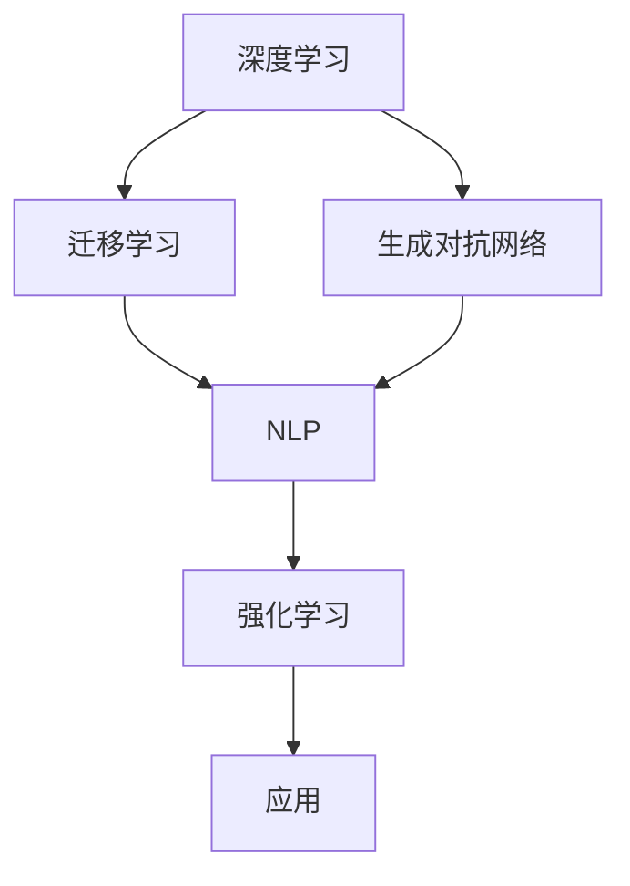

                 

# Andrej Karpathy的AI观点

Andrej Karpathy，作为深度学习领域的顶尖专家，其AI观点常常引领行业趋势。本文将基于Andrej Karpathy的观点，探讨AI技术的发展方向、应用场景、创新突破及面临的挑战，为读者提供一份详尽的技术视角解析。

## 1. 背景介绍

### 1.1 问题由来

Andrej Karpathy在其多篇文章和演讲中多次强调，人工智能（AI）正处于快速发展的关键时期，其应用领域日益广泛，从自然语言处理、计算机视觉到自动驾驶、医疗诊断等，AI技术不断渗透到人类社会的各个角落。然而，随之而来的也有一系列挑战，如模型公平性、可解释性、隐私保护等，这些问题需要我们深入思考和研究。

### 1.2 问题核心关键点

Karpathy指出，当前AI发展的核心关键点包括以下几个方面：

- **数据驱动与模型能力**：AI技术的发展离不开海量数据和高效模型，如何更智能地处理和利用数据，设计更加强大的模型，是推动AI进步的重要方向。
- **跨领域应用**：AI技术需要跨越不同领域，如将自然语言处理应用于医疗、金融、教育等，以解决实际问题。
- **伦理与公平性**：AI的广泛应用带来了新的伦理和公平性问题，如何确保AI系统的透明性、公正性和责任性，是行业亟待解决的重要课题。
- **安全性与隐私保护**：随着AI技术的普及，数据隐私和安全问题日益凸显，如何构建安全可控的AI系统，保护用户隐私，是一个重要课题。

## 2. 核心概念与联系

### 2.1 核心概念概述

Andrej Karpathy多次强调，AI技术的发展离不开以下几个核心概念：

- **深度学习**：基于神经网络的机器学习技术，能够从大量数据中自动学习特征，提升模型性能。
- **迁移学习**：利用已有知识，在新的任务上实现快速学习，减少对大量标注数据的依赖。
- **生成对抗网络（GANs）**：一种生成模型，通过对抗训练，生成逼真的图像、文本等，具有广泛的应用前景。
- **强化学习**：通过试错机制，模型能够在环境中逐步学习最优策略，应用在游戏、机器人等领域。
- **自然语言处理（NLP）**：让机器能够理解和生成人类语言，涉及文本分类、机器翻译、问答系统等任务。

### 2.2 概念间的关系

这些核心概念之间存在紧密联系，共同推动AI技术的进步。深度学习提供了强大的模型能力，迁移学习减少了学习成本，生成对抗网络提供了生成能力，强化学习提升了决策能力，而自然语言处理则拓展了AI应用的范围。以下用Mermaid流程图展示这些概念的联系：



### 2.3 核心概念的整体架构

从整体架构来看，AI技术的发展可以分为数据处理、模型训练、应用部署等多个环节，如上图所示。其中，深度学习模型通过大量数据进行训练，生成对抗网络用于生成逼真数据，迁移学习用于知识转移，强化学习用于策略优化，自然语言处理用于解决语言相关问题，最终通过应用部署服务于不同领域。

## 3. 核心算法原理 & 具体操作步骤

### 3.1 算法原理概述

Andrej Karpathy在其公开的文章和演讲中多次讨论了深度学习模型的原理和训练方法。他强调，深度学习模型的训练过程主要包括前向传播和反向传播两个步骤。在前向传播中，输入数据经过模型，生成预测结果；在反向传播中，通过计算预测结果与真实标签之间的差异，更新模型参数，最小化损失函数。

### 3.2 算法步骤详解

以下是深度学习模型的核心训练步骤：

1. **数据准备**：收集并预处理训练数据，确保数据集的质量和多样性。
2. **模型选择**：根据任务特点，选择合适的深度学习模型结构，如卷积神经网络（CNN）、循环神经网络（RNN）等。
3. **模型初始化**：对模型参数进行初始化，如Xavier、He等初始化方法。
4. **前向传播**：输入数据通过模型，生成预测结果。
5. **损失计算**：计算预测结果与真实标签之间的差异，得到损失函数值。
6. **反向传播**：通过链式法则，计算损失函数对各层参数的梯度。
7. **参数更新**：使用梯度下降等优化算法，更新模型参数。
8. **迭代训练**：重复执行前向传播、损失计算、反向传播和参数更新步骤，直到模型收敛。

### 3.3 算法优缺点

深度学习模型的优点包括：

- **自动特征提取**：能够自动学习输入数据的特征，无需手动设计特征工程。
- **处理非线性关系**：适用于复杂的非线性关系，能够处理图像、语音等多种数据类型。
- **高泛化能力**：在大规模数据上训练，模型能够泛化到未见过的数据上。

缺点包括：

- **计算资源消耗大**：模型参数量大，训练过程计算资源消耗大。
- **过拟合风险高**：模型复杂度高，容易出现过拟合问题。
- **解释性差**：深度学习模型通常被视为“黑盒”，难以解释其决策过程。

### 3.4 算法应用领域

深度学习模型在多个领域得到了广泛应用，如计算机视觉、自然语言处理、语音识别、推荐系统等。以下是几个典型应用场景：

- **计算机视觉**：如人脸识别、物体检测、图像分割等任务。
- **自然语言处理**：如机器翻译、文本分类、情感分析等任务。
- **语音识别**：如自动语音识别、语音合成等任务。
- **推荐系统**：如电商推荐、音乐推荐、视频推荐等任务。

## 4. 数学模型和公式 & 详细讲解  

### 4.1 数学模型构建

Andrej Karpathy在其文章中详细介绍了深度学习模型的数学模型构建。深度学习模型通常采用多层神经网络结构，包括输入层、隐藏层和输出层。以一个简单的全连接神经网络为例，其数学模型可以表示为：

$$ y = f(Wx + b) $$

其中，$x$ 为输入数据，$W$ 为权重矩阵，$b$ 为偏置向量，$f$ 为激活函数，$y$ 为输出结果。

### 4.2 公式推导过程

以多层感知机（MLP）为例，进行数学推导。MLP由多个隐藏层组成，每个隐藏层的输出作为下一层的输入，最终输出结果。假设有一个包含$n$个隐藏层的MLP模型，其数学模型可以表示为：

$$ y = g_{n}(a_{n-1}W_n + b_n) $$

其中，$a_n$ 为第$n$层的输入，$g_n$ 为第$n$层的激活函数，$W_n$ 和 $b_n$ 分别为第$n$层的权重矩阵和偏置向量。

### 4.3 案例分析与讲解

以图像分类任务为例，进行详细讲解。首先，对输入图像进行预处理，如归一化、裁剪等操作，得到像素矩阵$x$。然后，将像素矩阵输入到卷积神经网络（CNN）中，生成卷积特征图。接着，将特征图输入到全连接层，得到特征向量。最后，通过Softmax函数，将特征向量转换为类别概率分布，得到预测结果。

## 5. 项目实践：代码实例和详细解释说明

### 5.1 开发环境搭建

要构建一个深度学习项目，首先需要搭建开发环境。以下是搭建环境的几个步骤：

1. **安装Python**：安装最新版本的Python，并确保所有必要的库都已安装。
2. **安装TensorFlow或PyTorch**：选择一种深度学习框架，如TensorFlow或PyTorch，并进行安装。
3. **安装必要的库**：安装必要的库，如Numpy、Pandas、Matplotlib等。
4. **设置虚拟环境**：使用虚拟环境管理工具（如Anaconda），创建和管理虚拟环境。

### 5.2 源代码详细实现

以下是使用TensorFlow构建一个简单的图像分类项目的代码实现：

```python
import tensorflow as tf
from tensorflow.keras.datasets import mnist
from tensorflow.keras.models import Sequential
from tensorflow.keras.layers import Conv2D, MaxPooling2D, Flatten, Dense

# 加载数据集
(x_train, y_train), (x_test, y_test) = mnist.load_data()

# 数据预处理
x_train = x_train / 255.0
x_test = x_test / 255.0
y_train = tf.keras.utils.to_categorical(y_train, 10)
y_test = tf.keras.utils.to_categorical(y_test, 10)

# 构建模型
model = Sequential()
model.add(Conv2D(32, (3, 3), activation='relu', input_shape=(28, 28, 1)))
model.add(MaxPooling2D((2, 2)))
model.add(Flatten())
model.add(Dense(128, activation='relu'))
model.add(Dense(10, activation='softmax'))

# 编译模型
model.compile(optimizer='adam', loss='categorical_crossentropy', metrics=['accuracy'])

# 训练模型
model.fit(x_train.reshape(-1, 28, 28, 1), y_train, epochs=10, batch_size=64, validation_data=(x_test.reshape(-1, 28, 28, 1), y_test))
```

### 5.3 代码解读与分析

上述代码实现了一个简单的卷积神经网络模型，用于对手写数字图像进行分类。其中，`Conv2D`层用于卷积操作，`MaxPooling2D`层用于池化操作，`Flatten`层用于将卷积层输出的特征图展平，`Dense`层用于全连接操作。通过`compile`方法，定义了模型的优化器、损失函数和评估指标，并通过`fit`方法进行训练。

### 5.4 运行结果展示

训练完成后，可以在测试集上进行评估，得到模型的准确率：

```python
model.evaluate(x_test.reshape(-1, 28, 28, 1), y_test, verbose=2)
```

## 6. 实际应用场景

### 6.1 智能推荐系统

Andrej Karpathy指出，智能推荐系统是AI技术应用的重要场景之一。推荐系统通过分析用户行为数据，预测用户可能感兴趣的物品，从而提升用户体验。深度学习模型在推荐系统中的应用包括协同过滤、内容推荐、混合推荐等方法。

### 6.2 自动驾驶

Andrej Karpathy在自动驾驶领域的研究中也多次提到，深度学习模型在自动驾驶中扮演重要角色。通过深度学习模型，可以处理复杂的多模态数据（如摄像头、雷达、激光雷达等），实现车辆的自主导航和决策。

### 6.3 医疗影像分析

在医疗影像分析中，深度学习模型通过分析CT、MRI等医学影像，自动检测和识别病变区域，辅助医生进行诊断和治疗。

### 6.4 未来应用展望

Andrej Karpathy认为，未来AI技术将在更多领域得到应用，推动社会的进步和变革。以下是几个潜在的应用方向：

- **智能交通管理**：通过AI技术，实现智能交通信号灯、智能停车等，提高交通效率。
- **智能家居**：通过AI技术，实现智能家电控制、语音交互等，提升家居智能化水平。
- **智能制造**：通过AI技术，实现工业自动化、智能检测等，提高生产效率和产品质量。
- **智能城市**：通过AI技术，实现城市治理、环保监测等，提升城市管理水平。

## 7. 工具和资源推荐

### 7.1 学习资源推荐

- **Coursera**：提供大量AI相关课程，涵盖深度学习、计算机视觉、自然语言处理等方向。
- **Google AI Blog**：Google AI团队定期发布最新研究和技术进展，是了解AI前沿动态的重要资源。
- **ArXiv**：人工智能领域的预印本发布平台，包含大量最新研究成果和论文。

### 7.2 开发工具推荐

- **TensorFlow**：谷歌开发的深度学习框架，功能强大，易于使用。
- **PyTorch**：Facebook开发的深度学习框架，灵活性高，支持动态图模型。
- **Jupyter Notebook**：常用的交互式编程环境，方便调试和展示代码。

### 7.3 相关论文推荐

- **《深度学习》**：Ian Goodfellow、Yoshua Bengio和Aaron Courville联合撰写的深度学习经典教材，涵盖深度学习的基本概念和算法。
- **《生成对抗网络》**：Ian Goodfellow等撰写的生成对抗网络经典教材，深入讲解生成对抗网络的基本原理和应用。
- **《强化学习》**：Richard S. Sutton和Andrew G. Barto合著的强化学习经典教材，系统讲解强化学习的理论基础和算法实现。

## 8. 总结：未来发展趋势与挑战

### 8.1 研究成果总结

Andrej Karpathy认为，AI技术在近年来取得了显著进展，推动了多个领域的发展。深度学习、迁移学习、生成对抗网络、强化学习等技术不断成熟，推动了AI技术的应用和普及。

### 8.2 未来发展趋势

- **多模态融合**：未来AI技术将更多地融合多模态数据，如文本、图像、声音等，实现更加全面和丰富的智能应用。
- **联邦学习**：通过分布式计算，实现数据本地化，保护用户隐私，提升计算效率。
- **自监督学习**：利用未标注数据，提升模型的泛化能力和学习效率。
- **可解释AI**：提升AI系统的透明性和可解释性，增强用户信任。

### 8.3 面临的挑战

- **计算资源限制**：大模型和高精度训练需要大量的计算资源，如何优化计算效率，降低资源消耗，是未来的一大挑战。
- **数据隐私保护**：大规模数据的应用带来了数据隐私和安全问题，如何构建安全可控的AI系统，是未来的重要研究方向。
- **模型公平性和可解释性**：AI模型可能存在偏见和不公平性，如何设计公平、透明、可解释的AI系统，是未来的重要课题。
- **跨领域应用挑战**：AI技术在不同领域的应用存在差异，如何提升跨领域应用能力，是未来的一大挑战。

### 8.4 研究展望

- **跨学科合作**：AI技术需要跨学科合作，结合领域知识，提升应用效果。
- **伦理和社会责任**：AI技术的应用需要考虑伦理和社会责任，确保技术的安全性和公正性。
- **人机协同**：AI技术需要与人类协同工作，提升用户体验和系统效果。

## 9. 附录：常见问题与解答

### Q1: 什么是深度学习？

A: 深度学习是一种机器学习方法，通过多层神经网络结构，自动学习输入数据的特征，提升模型性能。

### Q2: 深度学习模型容易出现过拟合问题，如何解决？

A: 解决过拟合问题的方法包括数据增强、正则化、Dropout、早停等技术。

### Q3: 什么是生成对抗网络（GANs）？

A: GANs是一种生成模型，通过对抗训练，生成逼真的图像、文本等，具有广泛的应用前景。

### Q4: 深度学习模型如何应用于自然语言处理？

A: 深度学习模型在自然语言处理中广泛应用，包括文本分类、机器翻译、情感分析等任务。

### Q5: 智能推荐系统的核心是什么？

A: 智能推荐系统的核心是用户行为数据分析，通过深度学习模型，预测用户可能感兴趣的物品，提升用户体验。

---

作者：禅与计算机程序设计艺术 / Zen and the Art of Computer Programming

