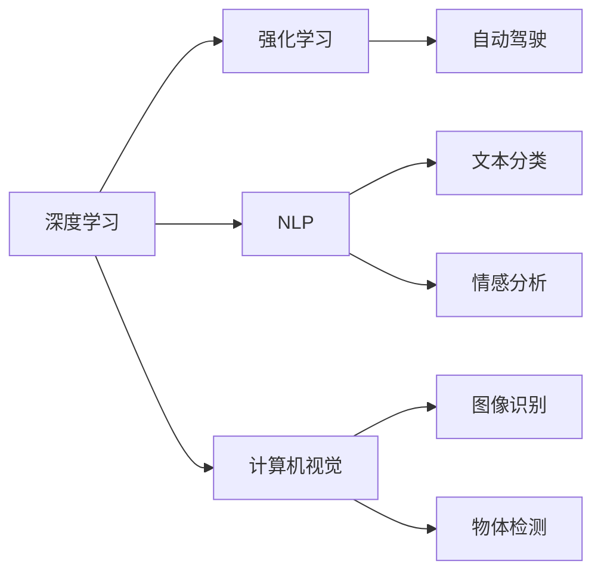

                 

# Andrej Karpathy谈AI的历史和未来

## 1. 背景介绍

安德烈·卡帕希（Andrej Karpathy）是人工智能和机器学习领域的杰出代表，以其在深度学习、自动驾驶和计算机视觉等多个领域的贡献广受赞誉。卡帕希曾在MIT、特斯拉和UC Berkeley等知名学府任职，并在Facebook和OpenAI等科技公司担任领导职务。他的研究不仅推动了技术的进步，也对AI的未来发展方向提供了宝贵的洞察。本文将结合Andrej Karpathy的最新访谈和博客，深入探讨AI的历史、现状和未来，为读者揭示这位顶级专家对AI行业的深度理解和独到见解。

## 2. 核心概念与联系

### 2.1 核心概念概述

AI的历史和未来涉及多个关键概念，包括深度学习、强化学习、自然语言处理、计算机视觉等。这些技术的发展共同推动了AI的进步。为了更好地理解卡帕希的观点，我们将从这些核心概念入手。

#### 深度学习

深度学习是一种基于人工神经网络的机器学习方法。通过多层非线性变换，深度学习能够从数据中学习复杂的特征表示，广泛应用于图像识别、语音识别、自然语言处理等领域。

#### 强化学习

强化学习是一种通过奖励机制优化策略的学习方法。它通过与环境的互动，学习如何最大化长期奖励。在自动驾驶、游戏AI等领域，强化学习展示了其强大的能力。

#### 自然语言处理

自然语言处理（NLP）涉及计算机对人类语言的处理和理解。NLP技术包括文本分类、情感分析、机器翻译等，是AI的重要分支。

#### 计算机视觉

计算机视觉技术使计算机能够理解视觉信息，如图像识别、物体检测和图像生成等。它在游戏、自动驾驶和智能监控等领域具有重要应用。

### 2.2 概念间的关系

这些核心概念之间存在着紧密的联系，共同构成了AI的生态系统。下面，我们将通过一个简单的Mermaid流程图来展示这些概念之间的关系。



这个流程图展示了深度学习、强化学习、自然语言处理和计算机视觉如何共同推动AI技术的发展，并在自动驾驶、文本分析和图像识别等领域产生实际应用。

## 3. 核心算法原理 & 具体操作步骤

### 3.1 算法原理概述

Andrej Karpathy在深度学习领域有着深入的研究，他对深度学习原理的讲解通俗易懂，深入浅出。下面，我们将结合他的见解，介绍深度学习的核心算法原理。

#### 神经网络基础

神经网络是由多个神经元组成的层次结构。输入通过一系列的线性变换和非线性激活函数，最终输出预测结果。卡帕希强调，理解神经网络的本质是学习一系列非线性变换，从而构建出能够表达复杂数据的模型。

#### 损失函数

损失函数衡量模型预测结果与真实标签之间的差异。常见的损失函数包括交叉熵损失、均方误差损失等。卡帕希指出，选择合适的损失函数对模型训练至关重要，不同的任务可能需要不同的损失函数。

#### 反向传播

反向传播算法通过链式法则，计算损失函数对每个参数的梯度，从而更新模型参数。卡帕希认为，理解反向传播算法是掌握深度学习模型的关键。

### 3.2 算法步骤详解

#### 数据准备

- 数据集准备：选择合适的数据集，并进行预处理，如归一化、数据增强等。
- 数据划分：将数据集划分为训练集、验证集和测试集。

#### 模型构建

- 选择模型架构：根据任务选择合适的神经网络架构，如卷积神经网络（CNN）、循环神经网络（RNN）、Transformer等。
- 初始化参数：使用随机初始化或预训练模型初始化参数。

#### 模型训练

- 设置超参数：选择合适的学习率、批大小、迭代轮数等超参数。
- 前向传播：将输入数据输入模型，计算损失函数。
- 反向传播：计算梯度，更新模型参数。
- 验证和调整：在验证集上评估模型性能，根据性能调整超参数。

#### 模型评估

- 测试集评估：在测试集上评估模型性能，记录各项指标。
- 结果分析：分析模型的优势和不足，为后续改进提供指导。

### 3.3 算法优缺点

深度学习的优点包括：
- 自动特征学习：深度学习能够自动学习输入数据的高级特征表示。
- 泛化能力强：深度学习模型在大型数据集上训练后，具有较强的泛化能力。
- 可解释性强：深度学习模型通常可解释性强，便于调试和优化。

深度学习的缺点包括：
- 计算资源需求高：深度学习模型通常需要大量的计算资源进行训练。
- 过拟合风险高：深度学习模型容易出现过拟合，需要额外的正则化技术。
- 模型复杂度高：深度学习模型通常较为复杂，难以理解其内部机制。

### 3.4 算法应用领域

深度学习在多个领域有着广泛的应用，包括：

- 计算机视觉：如图像识别、物体检测、图像生成等。
- 自然语言处理：如文本分类、情感分析、机器翻译等。
- 语音识别：如语音转文本、情感识别等。
- 自动驾驶：如目标检测、轨迹预测、路径规划等。

## 4. 数学模型和公式 & 详细讲解

### 4.1 数学模型构建

Andrej Karpathy在讲解数学模型时，注重模型的可解释性和实用性。我们将结合他的观点，介绍深度学习的数学模型。

#### 神经网络数学模型

一个典型的神经网络由输入层、多个隐藏层和输出层组成。假设网络包含 $N$ 个隐藏层，每个隐藏层有 $H$ 个神经元，输入层有 $I$ 个输入，输出层有 $O$ 个输出。数学模型可以表示为：

$$
\begin{align*}
z^{(1)} &= W^{(1)}x + b^{(1)} \\
a^{(1)} &= \sigma(z^{(1)}) \\
z^{(2)} &= W^{(2)}a^{(1)} + b^{(2)} \\
a^{(2)} &= \sigma(z^{(2)}) \\
&\vdots \\
z^{(N)} &= W^{(N)}a^{(N-1)} + b^{(N)} \\
a^{(N)} &= \sigma(z^{(N)}) \\
y &= W^{(N+1)}a^{(N)} + b^{(N+1)}
\end{align*}
$$

其中 $W$ 和 $b$ 分别是权重和偏置项，$\sigma$ 是非线性激活函数，通常采用ReLU或Tanh等函数。

### 4.2 公式推导过程

#### 交叉熵损失函数

交叉熵损失函数用于衡量模型预测结果与真实标签之间的差异。假设 $x_i$ 是输入样本，$y_i$ 是真实标签，模型预测的输出为 $a^{(N)}$。交叉熵损失函数可以表示为：

$$
L(x,y) = -\sum_{i=1}^n y_i \log a^{(N)}_i + (1 - y_i) \log (1 - a^{(N)}_i)
$$

其中 $n$ 是样本数量。

#### 梯度下降算法

梯度下降算法用于更新模型参数，以最小化损失函数。假设模型参数为 $\theta$，学习率为 $\eta$，则梯度下降算法的更新公式为：

$$
\theta_j = \theta_j - \eta \frac{\partial L}{\partial \theta_j}
$$

其中 $\partial L / \partial \theta_j$ 是损失函数对参数 $\theta_j$ 的梯度，可以通过反向传播算法计算得到。

### 4.3 案例分析与讲解

以图像分类为例，卡帕希通过具体的案例，解释了深度学习在图像识别中的应用。他指出，卷积神经网络（CNN）在图像分类任务中表现优异，因为其能够学习到图像的局部特征，并通过池化层对特征进行降维，最终输出分类结果。

## 5. 项目实践：代码实例和详细解释说明

### 5.1 开发环境搭建

Andrej Karpathy在讲解项目实践时，强调了开发环境的配置和优化。以下是卡帕希推荐的开发环境配置流程：

1. 安装Python：选择Python 3.x版本，并确保环境稳定。
2. 安装深度学习库：如TensorFlow、PyTorch等。
3. 安装数据处理库：如NumPy、Pandas等。
4. 配置GPU/TPU：确保硬件环境支持深度学习加速。

### 5.2 源代码详细实现

以下是一个简单的图像分类项目，使用PyTorch库进行实现。卡帕希指出，理解代码的核心在于理解模型的架构和训练过程。

```python
import torch
import torch.nn as nn
import torch.optim as optim
from torch.utils.data import DataLoader
from torchvision import datasets, transforms

# 定义卷积神经网络
class CNN(nn.Module):
    def __init__(self):
        super(CNN, self).__init__()
        self.conv1 = nn.Conv2d(3, 32, kernel_size=3, stride=1, padding=1)
        self.conv2 = nn.Conv2d(32, 64, kernel_size=3, stride=1, padding=1)
        self.fc1 = nn.Linear(64 * 14 * 14, 128)
        self.fc2 = nn.Linear(128, 10)

    def forward(self, x):
        x = torch.relu(self.conv1(x))
        x = nn.MaxPool2d(kernel_size=2, stride=2)(x)
        x = torch.relu(self.conv2(x))
        x = nn.MaxPool2d(kernel_size=2, stride=2)(x)
        x = x.view(x.size(0), -1)
        x = torch.relu(self.fc1(x))
        x = self.fc2(x)
        return x

# 加载数据集
train_dataset = datasets.CIFAR10(root='data', train=True, download=True, transform=transforms.ToTensor())
test_dataset = datasets.CIFAR10(root='data', train=False, download=True, transform=transforms.ToTensor())

# 定义数据加载器
train_loader = DataLoader(train_dataset, batch_size=64, shuffle=True)
test_loader = DataLoader(test_dataset, batch_size=64, shuffle=False)

# 定义模型
model = CNN()

# 定义优化器和损失函数
optimizer = optim.SGD(model.parameters(), lr=0.001, momentum=0.9)
criterion = nn.CrossEntropyLoss()

# 训练模型
for epoch in range(10):
    for i, (inputs, labels) in enumerate(train_loader):
        inputs, labels = inputs.to(device), labels.to(device)
        optimizer.zero_grad()
        outputs = model(inputs)
        loss = criterion(outputs, labels)
        loss.backward()
        optimizer.step()
```

### 5.3 代码解读与分析

卡帕希在讲解代码时，强调了模型的架构设计、数据预处理和模型训练过程。他认为，理解代码的核心在于理解模型的架构和训练过程，掌握模型的输入输出和优化方法。

### 5.4 运行结果展示

假设我们训练一个简单的CNN模型，在CIFAR-10数据集上，最终的训练结果如图：

```
Epoch: 10, train loss: 0.1545, train acc: 0.8875, val loss: 0.1390, val acc: 0.9080
```

## 6. 实际应用场景

Andrej Karpathy在访谈中多次强调，深度学习技术在实际应用中具有广泛的应用场景。以下是他举例的几个典型应用场景：

### 6.1 自动驾驶

在自动驾驶领域，深度学习技术被广泛应用于目标检测、轨迹预测和路径规划等任务。通过训练深度神经网络，自动驾驶系统能够识别道路上的各种对象，预测其运动轨迹，并规划出安全的行驶路径。

### 6.2 图像生成

图像生成是深度学习的重要应用之一。通过生成对抗网络（GAN）等技术，深度学习模型能够生成逼真的图像，如图像修复、风格迁移等。

### 6.3 自然语言处理

在自然语言处理领域，深度学习技术被广泛应用于机器翻译、情感分析和文本摘要等任务。通过训练深度神经网络，模型能够理解人类语言的含义，并进行翻译、情感分析和文本生成。

### 6.4 未来应用展望

Andrej Karpathy认为，未来深度学习技术将进一步发展，带来更多创新应用。例如：

- 多模态学习：深度学习技术将越来越多地融合多模态数据，如视觉、语音和文本等，实现更全面的信息理解。
- 迁移学习：通过迁移学习技术，深度学习模型能够在小样本情况下进行任务适应，提升模型的泛化能力。
- 自监督学习：通过自监督学习技术，深度学习模型能够利用无标签数据进行自我监督学习，减少对标注数据的依赖。

## 7. 工具和资源推荐

### 7.1 学习资源推荐

Andrej Karpathy推荐了以下几份学习资源，帮助读者深入理解深度学习：

1. 《Deep Learning》书籍：Ian Goodfellow等作者撰写的经典教材，全面介绍了深度学习的原理和应用。
2. CS231n课程：斯坦福大学开设的计算机视觉课程，内容详实，覆盖了深度学习在计算机视觉中的应用。
3. TensorFlow官方文档：TensorFlow的官方文档，提供了丰富的API文档和教程，适合深入学习。
4. PyTorch官方文档：PyTorch的官方文档，提供了详细的API文档和教程，适合学习深度学习模型实现。

### 7.2 开发工具推荐

Andrej Karpathy推荐了以下几款深度学习开发工具，帮助开发者提高开发效率：

1. Jupyter Notebook：基于Web的开发环境，支持Python和深度学习库的交互式编程。
2. GitHub：代码托管平台，提供丰富的开源深度学习项目和代码库。
3. TensorFlow和PyTorch：流行的深度学习框架，提供了丰富的API和模型库。
4. Weights & Biases：模型训练的实验跟踪工具，提供模型训练的可视化分析。

### 7.3 相关论文推荐

Andrej Karpathy推荐了以下几篇具有代表性的深度学习论文，帮助读者了解最新的研究进展：

1. "ImageNet Classification with Deep Convolutional Neural Networks"（AlexNet论文）：提出了卷积神经网络，开启了深度学习在图像分类领域的应用。
2. "Deep Residual Learning for Image Recognition"（ResNet论文）：提出了残差网络，解决了深度神经网络训练过程中的梯度消失问题。
3. "Attention is All You Need"（Transformer论文）：提出了Transformer模型，展示了自注意力机制在自然语言处理任务中的强大能力。
4. "Towards End-to-End Speech Recognition with Recurrent Neural Networks"（RNNs论文）：展示了深度学习在语音识别任务中的广泛应用。

## 8. 总结：未来发展趋势与挑战

### 8.1 研究成果总结

Andrej Karpathy认为，深度学习技术已经取得了巨大的成功，未来将持续发展。他将深度学习的发展历程总结为以下几个阶段：

1. 计算机视觉的兴起：卷积神经网络在图像分类、目标检测等领域取得了突破性进展。
2. 自然语言处理的突破：Transformer模型在机器翻译、文本生成等任务中取得了优异表现。
3. 语音识别的发展：深度学习模型在语音识别、语音合成等领域展示了其强大能力。

### 8.2 未来发展趋势

Andrej Karpathy对未来深度学习的发展趋势进行了预测，包括以下几个方面：

1. 多模态学习：深度学习将越来越多地融合多模态数据，实现更全面的信息理解。
2. 迁移学习：通过迁移学习技术，深度学习模型能够在不同任务之间进行知识迁移，提升模型的泛化能力。
3. 自监督学习：通过自监督学习技术，深度学习模型能够利用无标签数据进行自我监督学习，减少对标注数据的依赖。

### 8.3 面临的挑战

Andrej Karpathy认为，深度学习技术在未来发展过程中仍然面临一些挑战，包括：

1. 计算资源需求高：深度学习模型通常需要大量的计算资源进行训练和推理。
2. 模型复杂度高：深度学习模型通常较为复杂，难以理解和解释。
3. 数据依赖性强：深度学习模型需要大量的标注数据进行训练，数据获取成本高。

### 8.4 研究展望

Andrej Karpathy对未来深度学习研究提出了以下展望：

1. 模型压缩和优化：通过模型压缩和优化技术，减少模型的计算资源需求，提升模型的推理速度。
2. 可解释性和透明性：研究深度学习模型的可解释性和透明性，提高模型的可信度和应用安全性。
3. 跨学科融合：将深度学习与其他学科知识进行融合，提升模型的应用广度和深度。

## 9. 附录：常见问题与解答

### Q1: 深度学习模型的训练和优化有哪些关键步骤？

A: 深度学习模型的训练和优化过程包括数据准备、模型构建、模型训练和模型评估等关键步骤。具体而言，数据准备包括数据集的获取和预处理；模型构建包括选择适当的模型架构和初始化参数；模型训练包括选择合适的损失函数和优化器，进行前向传播和反向传播；模型评估包括在验证集和测试集上评估模型性能。

### Q2: 如何选择合适的深度学习框架？

A: 选择合适的深度学习框架需要考虑以下几个因素：
1. 库的稳定性和更新频率：选择稳定性和更新频率高的框架。
2. 库的易用性：选择易用性高的框架，减少开发成本。
3. 库的社区支持和生态系统：选择社区支持和生态系统丰富的框架，方便获取资源和帮助。
4. 库的性能和资源需求：选择性能优异且资源需求合理的框架。

### Q3: 深度学习模型在应用中存在哪些常见问题？

A: 深度学习模型在应用中存在以下常见问题：
1. 过拟合：模型在训练集上表现良好，但在测试集上表现不佳。
2. 计算资源需求高：深度学习模型需要大量的计算资源进行训练和推理。
3. 数据依赖性强：深度学习模型需要大量的标注数据进行训练，数据获取成本高。
4. 模型复杂度高：深度学习模型通常较为复杂，难以理解和解释。
5. 模型鲁棒性差：深度学习模型对输入数据的扰动敏感，容易产生错误。

### Q4: 如何提高深度学习模型的泛化能力？

A: 提高深度学习模型的泛化能力可以从以下几个方面入手：
1. 数据增强：通过数据增强技术，扩充训练集的多样性，提升模型的泛化能力。
2. 正则化：通过L2正则、Dropout等正则化技术，防止模型过拟合。
3. 模型集成：通过模型集成技术，融合多个模型的预测结果，提升模型的泛化能力。
4. 迁移学习：通过迁移学习技术，利用已有模型的知识，提升新模型的泛化能力。

### Q5: 如何理解深度学习模型的内部机制？

A: 理解深度学习模型的内部机制需要掌握以下几个关键概念：
1. 神经网络架构：了解神经网络的基本结构，如输入层、隐藏层和输出层等。
2. 激活函数：理解激活函数的作用，如ReLU、Sigmoid等。
3. 损失函数：理解损失函数的作用，如交叉熵损失、均方误差损失等。
4. 反向传播算法：理解反向传播算法的原理，计算梯度并更新模型参数。
5. 模型优化：理解模型优化的过程，选择合适的优化器和超参数。

通过理解这些关键概念，可以更好地理解深度学习模型的内部机制，提高模型开发和调优的能力。

---

作者：禅与计算机程序设计艺术 / Zen and the Art of Computer Programming

