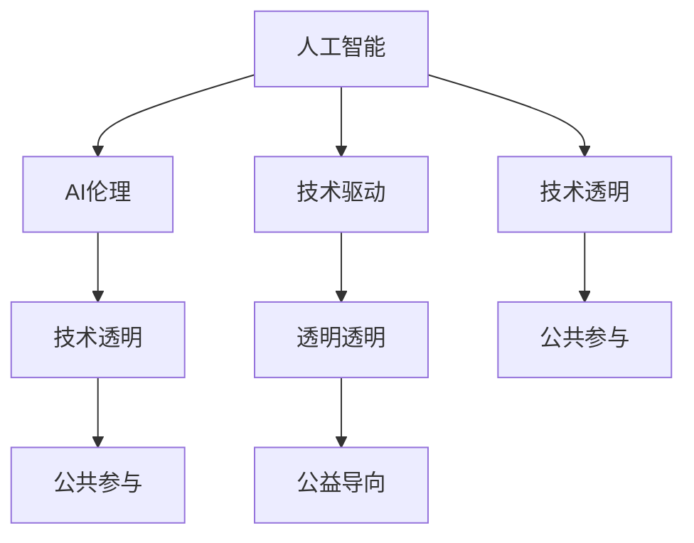

                 

# Andrej Karpathy：OpenAI 的成立初衷

## 1. 背景介绍

### 1.1 问题由来

Andrej Karpathy，作为OpenAI联合创始人之一，其思想和行动在人工智能领域产生了深远影响。回顾其早期经历，可以深入理解OpenAI的成立初衷及其未来愿景。

Karpathy，出生于德国柏林，少年时期随家人移居美国。在加州理工学院获得博士学位后，Karpathy先后加入谷歌、特斯拉等公司，开发了诸多创新技术和产品。2015年，Karpathy与其他几位志同道合的技术专家共同创立了OpenAI，旨在推动AI技术的发展，实现人类与人工智能的和谐共生。

### 1.2 问题核心关键点

OpenAI成立的初衷并非追求商业利润，而是通过技术创新和公共参与，促进人工智能的可持续发展。以下是OpenAI成立的核心关键点：

- **技术驱动**：Karpathy等创始人认为，AI技术的快速发展将极大改变社会结构，需要开发出高性能、可信赖的AI系统。
- **公共参与**：AI技术的应用涉及到复杂的伦理和法律问题，需要全社会共同参与讨论和规范，防止AI滥用。
- **透明透明**：OpenAI致力于保持技术透明，对外公开研究进展，接受公众监督，确保AI的发展符合人类的利益。
- **公益导向**：OpenAI的目标是服务全人类，提升生活质量，而非为特定利益集团服务。

这些核心关键点共同构成了OpenAI的使命和愿景，即通过推动AI技术发展，实现人类的全面福祉。

## 2. 核心概念与联系

### 2.1 核心概念概述

为了更好地理解OpenAI的成立初衷，需要明确几个核心概念：

- **人工智能**：通过算法和数据训练，使计算机具备感知、理解、学习和决策能力，从而能够执行人类智能活动的技术。
- **AI伦理**：在AI技术应用过程中，如何平衡技术进步与伦理道德，确保AI系统的公正、透明和安全。
- **技术透明**：保持AI技术的开发过程和技术细节的公开性，促进技术进步和社会监督。
- **公共参与**：通过各种渠道和形式，将AI技术的应用、发展与公众讨论相结合，确保技术服务于全人类。

这些概念之间存在紧密的联系，共同构成了OpenAI的核心使命。

### 2.2 概念间的关系

这些核心概念之间的逻辑关系可以通过以下Mermaid流程图来展示：



这个流程图展示了OpenAI核心概念之间的相互作用和联系：

1. **技术驱动**：推动AI技术的持续进步，是OpenAI的起点。
2. **AI伦理**：确保AI技术应用的伦理性和公正性，是OpenAI的重要保障。
3. **技术透明**：促进AI技术的公开和透明，是OpenAI的显著特点。
4. **公共参与**：通过公众讨论和参与，确保AI技术的可持续发展。
5. **公益导向**：OpenAI致力于服务全人类，提升生活质量。

这些概念共同构成了OpenAI的完整生态系统，为其未来的发展奠定了基础。

## 3. 核心算法原理 & 具体操作步骤
### 3.1 算法原理概述

OpenAI在推动AI技术发展方面，注重算法和技术的创新。其核心算法原理主要包括：

- **深度学习**：使用大规模数据和复杂模型，提升AI系统的识别、理解和生成能力。
- **强化学习**：通过与环境互动，学习最优决策策略，优化AI系统的行为。
- **生成对抗网络(GAN)**：通过对抗训练，生成逼真的数据或图像，提升AI系统的创造力和生成能力。

这些算法原理的创新应用，使OpenAI在多个领域取得了突破性进展。

### 3.2 算法步骤详解

OpenAI的核心算法操作步骤包括：

1. **数据收集与处理**：通过爬虫、API调用等方式，收集大量标注数据，并进行清洗和预处理。
2. **模型训练与优化**：使用深度学习框架如TensorFlow、PyTorch等，训练复杂的神经网络模型，并进行超参数调优。
3. **算法实验与评估**：通过A/B测试、交叉验证等方法，评估算法的性能和效果，进行优化迭代。
4. **技术公开与合作**：将算法细节和研究成果公开，与学术界、产业界合作，推动技术进步。

这些步骤构成了OpenAI的核心算法流程，保证了其技术创新的持续性和可靠性。

### 3.3 算法优缺点

OpenAI的核心算法具有以下优点：

- **高性能**：通过深度学习等复杂模型，OpenAI的AI系统在识别、理解和生成能力上具有显著优势。
- **创新性**：不断探索和应用新的算法和技术，推动AI领域的前沿发展。
- **开放性**：保持技术公开，促进学术界和产业界的合作和创新。

同时，这些算法也存在一些缺点：

- **资源需求高**：深度学习和强化学习等算法需要大量的计算资源和数据。
- **模型复杂**：复杂的模型训练和优化需要丰富的经验和技巧，难度较大。
- **应用限制**：有些算法如GAN，在实际应用中可能存在伦理和安全问题，需要谨慎处理。

尽管存在这些缺点，但OpenAI通过不断的技术创新和资源投入，仍能在AI领域保持领先地位。

### 3.4 算法应用领域

OpenAI的核心算法在多个领域得到了广泛应用，包括：

- **自然语言处理(NLP)**：通过深度学习模型，提升机器翻译、情感分析、文本生成等NLP任务的性能。
- **计算机视觉**：通过GAN等技术，生成逼真图像和视频，推动图像识别、自动驾驶等领域的发展。
- **智能推荐系统**：通过强化学习算法，提升推荐系统的个性化和精准度，应用于电商、内容分发等领域。
- **机器人与自动化**：通过机器学习算法，提升机器人的感知、决策和执行能力，推动自动化生产和服务。

这些应用领域的突破，展示了OpenAI在AI技术发展中的重要作用。

## 4. 数学模型和公式 & 详细讲解 & 举例说明

### 4.1 数学模型构建

OpenAI在AI技术的数学模型构建方面，注重理论基础和实际应用的结合。以下是几个典型的数学模型构建过程：

- **深度神经网络**：使用多层感知机(MLP)或卷积神经网络(CNN)等模型，构建输入到输出的映射关系。
- **生成对抗网络(GAN)**：构建生成器和判别器，通过对抗训练，生成逼真数据。
- **强化学习模型**：使用Q-learning或策略梯度等方法，构建环境与智能体的互动模型。

这些模型的构建过程，展示了OpenAI在理论和技术上的创新和探索。

### 4.2 公式推导过程

以深度神经网络为例，推导其基本结构和优化算法。

假设输入向量为 $x$，输出向量为 $y$，中间隐藏层为 $h$，激活函数为 $f$，损失函数为 $L$。则深度神经网络的结构可以表示为：

$$
y = f(h^{(l)} W^{(l)} h^{(l-1)} + b^{(l)})
$$

其中 $h^{(l)}$ 表示第 $l$ 层的隐藏向量，$W^{(l)}$ 和 $b^{(l)}$ 表示第 $l$ 层的权重和偏置。

训练过程中，使用梯度下降算法优化损失函数，得到模型的参数更新公式为：

$$
\theta \leftarrow \theta - \eta \nabla_{\theta} L(y, x)
$$

其中 $\eta$ 为学习率，$\nabla_{\theta} L(y, x)$ 为损失函数对模型参数的梯度。

这一过程展示了深度神经网络的基本结构和优化算法，为后续应用提供了理论基础。

### 4.3 案例分析与讲解

以OpenAI的DALL·E模型为例，分析其生成对抗网络(GAN)的应用。

DALL·E模型通过生成器和判别器的对抗训练，能够生成高质量、逼真的图像。生成器通过学习大量真实图像数据，生成新图像；判别器则通过学习真实图像和生成图像的差异，识别和判别图像的逼真度。

模型的训练过程分为两个阶段：

1. **生成器训练**：使用生成器生成伪造图像，判别器对图像进行判别，生成器根据判别器的反馈进行调整。
2. **判别器训练**：使用判别器对真实图像和生成图像进行判别，生成器根据判别器的反馈进行调整。

通过这样的训练过程，DALL·E模型能够生成具有高度逼真度和创造性的图像，推动了计算机视觉和生成对抗网络的研究。

## 5. 项目实践：代码实例和详细解释说明

### 5.1 开发环境搭建

进行OpenAI项目开发，首先需要搭建Python开发环境。以下是一个基本的Python开发环境搭建流程：

1. **安装Python**：下载并安装Python 3.x版本，推荐使用Anaconda或Miniconda进行环境管理。
2. **安装必要的库**：使用pip安装TensorFlow、PyTorch等深度学习框架，以及OpenAI所需的库。
3. **配置环境**：设置环境变量，配置必要的依赖库和工具。

### 5.2 源代码详细实现

以下是一个简单的深度神经网络模型实现，用于示例OpenAI项目的开发流程：

```python
import tensorflow as tf
from tensorflow.keras import layers

# 定义深度神经网络模型
class DeepNN(tf.keras.Model):
    def __init__(self):
        super(DeepNN, self).__init__()
        self.dense1 = layers.Dense(64, activation='relu')
        self.dense2 = layers.Dense(10, activation='softmax')

    def call(self, inputs):
        x = self.dense1(inputs)
        x = self.dense2(x)
        return x

# 加载数据集
(x_train, y_train), (x_test, y_test) = tf.keras.datasets.mnist.load_data()

# 数据预处理
x_train = x_train / 255.0
x_test = x_test / 255.0

# 构建模型
model = DeepNN()

# 定义损失函数和优化器
loss_fn = tf.keras.losses.SparseCategoricalCrossentropy(from_logits=True)
optimizer = tf.keras.optimizers.Adam(learning_rate=0.001)

# 训练模型
@tf.function
def train_step(inputs, targets):
    with tf.GradientTape() as tape:
        logits = model(inputs, training=True)
        loss = loss_fn(targets, logits)
    gradients = tape.gradient(loss, model.trainable_variables)
    optimizer.apply_gradients(zip(gradients, model.trainable_variables))

# 训练过程
EPOCHS = 10
for epoch in range(EPOCHS):
    for (batch, (inputs, targets)) in tf.data.Dataset.from_tensor_slices((x_train, y_train)).batch(32):
        train_step(inputs, targets)
```

### 5.3 代码解读与分析

这段代码实现了一个简单的深度神经网络模型，用于手写数字识别。以下是代码的主要解读：

- **定义模型结构**：使用Keras框架，定义两个全连接层，分别包含64个和10个神经元，激活函数分别为ReLU和Softmax。
- **加载和预处理数据**：使用MNIST数据集，将像素值归一化到0-1之间。
- **构建模型**：使用自定义的DeepNN类，实例化模型对象。
- **定义损失函数和优化器**：使用交叉熵损失函数和Adam优化器。
- **训练模型**：通过循环遍历训练数据集，每次迭代使用训练集的数据进行前向传播和反向传播，更新模型参数。

### 5.4 运行结果展示

训练完成后，可以使用测试集评估模型性能：

```python
test_loss, test_acc = model.evaluate(x_test,  y_test, verbose=2)
print('\nTest accuracy:', test_acc)
```

## 6. 实际应用场景

### 6.1 智能推荐系统

OpenAI的推荐系统在电商、内容分发等领域得到了广泛应用。通过深度学习和强化学习算法，OpenAI能够根据用户的历史行为和兴趣，推荐个性化的商品和内容，提升用户体验和转化率。

### 6.2 自动驾驶

在自动驾驶领域，OpenAI的生成对抗网络(GAN)技术被用于生成逼真的道路场景图像，辅助驾驶算法进行环境感知和决策。

### 6.3 医疗诊断

OpenAI的AI技术也被应用于医疗诊断领域，通过深度学习和计算机视觉算法，辅助医生进行疾病检测和诊断。

### 6.4 未来应用展望

未来，OpenAI将在更多领域探索AI技术的应用，推动技术的全面普及和进步。以下是一些可能的未来应用场景：

- **智能交通管理**：通过AI技术优化交通信号和车辆调度，缓解城市交通压力。
- **环境保护**：使用AI技术监测和分析环境数据，推动可持续发展。
- **金融风控**：通过AI技术预测市场风险，提升金融机构的决策能力。
- **教育普及**：利用AI技术提供个性化学习方案，提升教育公平和质量。

## 7. 工具和资源推荐

### 7.1 学习资源推荐

为了帮助开发者深入理解OpenAI的技术和应用，以下是一些优质的学习资源：

- **OpenAI官方文档**：提供详细的API文档和技术指南，帮助开发者快速上手。
- **arXiv论文预印本**：收录大量OpenAI的研究论文，了解前沿技术和思想。
- **深度学习课程**：如Andrew Ng的Coursera课程，系统学习深度学习和神经网络技术。

### 7.2 开发工具推荐

以下是一些OpenAI项目开发中常用的工具：

- **TensorFlow**：Google开发的深度学习框架，支持分布式训练和模型部署。
- **PyTorch**：Facebook开发的深度学习框架，灵活性高，易于调试。
- **Keras**：高层次的神经网络API，提供简单易用的接口。
- **Jupyter Notebook**：交互式的Python开发环境，方便调试和共享代码。

### 7.3 相关论文推荐

OpenAI的研究论文覆盖了多个前沿领域，以下是一些值得关注的研究：

- **生成对抗网络**：ICCV 2017上的《Image-to-Image Translation with Conditional Adversarial Networks》。
- **强化学习**：NIPS 2013上的《Playing Atari with Deep Reinforcement Learning》。
- **自然语言处理**：ACL 2018上的《Improving Language Understanding by Generative Pre-training》。

## 8. 总结：未来发展趋势与挑战

### 8.1 总结

本文深入探讨了Andrej Karpathy及其创立的OpenAI，揭示了OpenAI的成立初衷和技术方向。通过对其核心概念和操作步骤的详细解读，展示了OpenAI在推动AI技术发展中的重要贡献。

### 8.2 未来发展趋势

未来，OpenAI将继续在多个领域推动AI技术的发展，推动人类社会的进步。以下是一些可能的趋势：

- **AI伦理的重视**：在AI技术的开发和应用过程中，重视伦理和法律问题，确保技术的公正性和透明性。
- **AI技术的普及**：通过教育和开源项目，推动AI技术在各个领域的应用和普及。
- **AI的创新应用**：探索更多AI技术的新应用场景，推动AI技术的全面发展。

### 8.3 面临的挑战

尽管OpenAI在AI技术发展中做出了巨大贡献，但仍面临一些挑战：

- **资源限制**：大规模数据和计算资源的消耗，是OpenAI面临的主要挑战之一。
- **伦理问题**：AI技术在应用过程中可能面临的伦理和法律问题，需要全社会共同解决。
- **技术透明**：保持技术的开放性和透明性，同时保护知识产权和技术秘密，是一大难题。

### 8.4 研究展望

未来，OpenAI需要在多个方面进行深入研究，以应对挑战并推动AI技术的进步：

- **数据收集和处理**：探索更多高效的数据收集和处理方法，提高数据的质量和多样性。
- **模型优化和压缩**：优化模型结构和算法，提高模型的效率和可解释性。
- **跨领域应用**：探索AI技术在更多领域的应用，推动技术的全面普及和进步。

总之，OpenAI在推动AI技术发展方面，具有重要的使命和责任。只有通过不断的技术创新和资源投入，才能实现AI技术的可持续发展，造福全人类。

## 9. 附录：常见问题与解答

**Q1：OpenAI的主要研究方向是什么？**

A: OpenAI的主要研究方向包括深度学习、生成对抗网络、强化学习、自然语言处理等领域。其核心目标是通过技术创新，推动AI技术的进步，服务全人类。

**Q2：OpenAI的算法和技术有何优势？**

A: OpenAI的算法和技术具有高性能、创新性和开放性等优势。其深度学习、生成对抗网络等技术，在多个领域取得了突破性进展，推动了AI技术的发展。

**Q3：OpenAI在实际应用中面临哪些挑战？**

A: OpenAI在实际应用中面临资源限制、伦理问题和技术透明等挑战。这些问题需要全社会共同努力，才能解决。

**Q4：OpenAI未来有哪些发展方向？**

A: OpenAI的未来发展方向包括AI伦理、AI技术普及、AI创新应用等。其目标是通过技术创新，推动AI技术的全面发展，服务全人类。

作者：禅与计算机程序设计艺术 / Zen and the Art of Computer Programming

