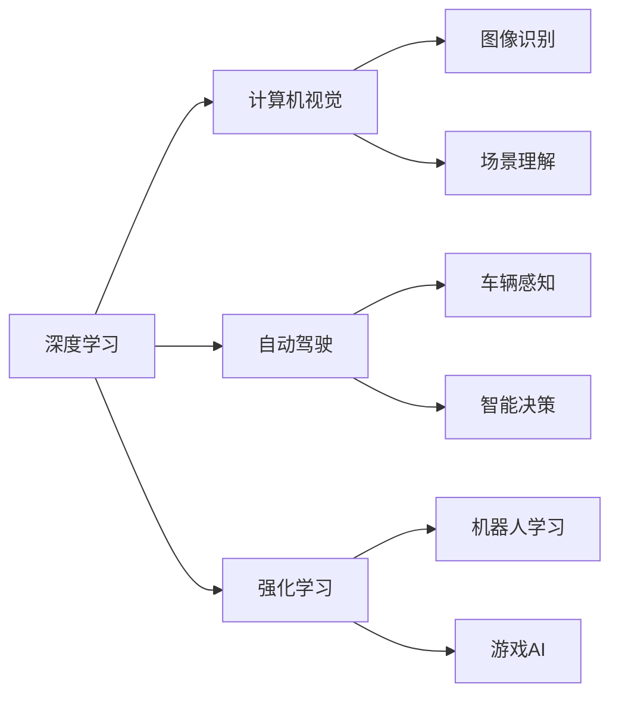
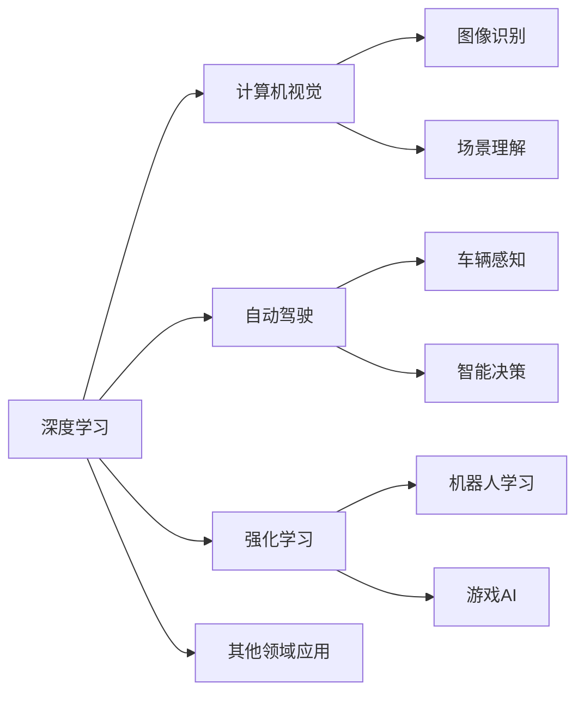

                 

# Andrej Karpathy：人工智能的未来发展规划

## 1. 背景介绍

在当前的技术革新浪潮中，人工智能(AI)领域正处于快速发展的关键阶段。从图像识别、语音合成到自然语言处理、自动驾驶，AI技术的应用日益广泛，涵盖了从日常生活到工业生产的各个领域。Andrej Karpathy作为人工智能领域的杰出专家，不仅在深度学习研究上取得了卓越的成就，还积极探索AI技术的未来发展方向。本文将深入分析Andrej Karpathy的AI未来发展规划，探讨其对技术趋势的见解和对未来应用的展望。

## 2. 核心概念与联系

### 2.1 核心概念概述

Andrej Karpathy的研究和实践涵盖了深度学习、计算机视觉、自动驾驶等多个领域。他的工作主要集中在以下几个核心概念上：

- **深度学习(Deep Learning)**：使用多层神经网络处理复杂数据的任务，如图像、语音、文本等。深度学习通过自动学习特征，提升了对数据的理解和表达能力。

- **计算机视觉(Computer Vision)**：使计算机能够“看”懂图像和视频，实现对象识别、场景理解、动作检测等任务。Karpathy在这方面的工作包括使用卷积神经网络(CNN)和递归神经网络(RNN)等技术。

- **自动驾驶(Autonomous Driving)**：利用AI技术实现车辆的自主驾驶，包括感知、决策和控制等多个环节。Karpathy在这方面的工作重点在于通过视觉和激光雷达等传感器获取环境信息，实现智能决策。

- **强化学习(Reinforcement Learning)**：通过与环境的互动，学习最优策略以实现特定目标。Karpathy在这方面的工作包括利用强化学习训练机器人、玩电子游戏等。

这些概念之间相互关联，共同构成了Andrej Karpathy对AI未来发展的整体框架。其中，深度学习是核心技术手段，计算机视觉和自动驾驶是应用领域，强化学习则是实现智能决策的工具。

### 2.2 核心概念之间的关系

通过以下Mermaid流程图，我们可以更好地理解这些核心概念之间的联系：



这个流程图展示了深度学习、计算机视觉、自动驾驶和强化学习之间的相互关系：

- 深度学习是基础，计算机视觉和自动驾驶是应用，强化学习则是解决特定问题的工具。
- 图像识别和场景理解是计算机视觉的核心任务，车辆感知和智能决策是自动驾驶的核心环节。
- 机器人学习和游戏AI则是强化学习的典型应用，展示了其在实际场景中的能力。

### 2.3 核心概念的整体架构

大图概览所有核心概念之间的关系：



这个大图展示了深度学习、计算机视觉、自动驾驶和强化学习在更多领域的应用：

- 深度学习不仅在AI领域内部有广泛应用，还可以拓展到医学、金融、教育等众多领域。
- 计算机视觉在图像识别和场景理解方面有显著成效，应用范围广泛。
- 自动驾驶在车辆感知和智能决策方面取得了重大进展，未来有望实现大规模商用。
- 强化学习在游戏AI和机器人学习方面展现了强大的潜力，未来将有更多应用场景。

## 3. 核心算法原理 & 具体操作步骤

### 3.1 算法原理概述

Andrej Karpathy的研究主要集中在深度学习算法原理上，尤其是卷积神经网络(CNN)和递归神经网络(RNN)。这些算法通过多层神经网络，自动学习特征和模式，用于图像、文本等复杂数据的处理。

- **卷积神经网络(CNN)**：通过卷积层和池化层提取图像特征，再通过全连接层进行分类。CNN在图像识别任务中表现优异，广泛应用于人脸识别、物体检测等领域。

- **递归神经网络(RNN)**：通过递归结构处理序列数据，如时间序列和文本。RNN的变体包括长短时记忆网络(LSTM)和门控循环单元(GRU)，能够更好地处理长序列和解决序列生成问题。

- **强化学习**：通过与环境的互动，学习最优策略以实现特定目标。强化学习的核心是Q-learning和策略梯度方法，能够在复杂的决策环境中优化行为策略。

### 3.2 算法步骤详解

下面是Andrej Karpathy在其研究中常用的算法步骤：

1. **数据预处理**：对原始数据进行清洗、归一化和增强，以便模型更好地学习。

2. **模型训练**：选择合适的神经网络结构，使用反向传播算法进行梯度更新，最小化损失函数。

3. **模型验证**：在验证集上评估模型性能，调整超参数，避免过拟合。

4. **模型应用**：将训练好的模型应用于实际场景中，进行推理和预测。

### 3.3 算法优缺点

- **优点**：
  - 自动学习特征，减少了手工特征工程的工作量。
  - 可以处理大规模数据，适用于深度学习任务。
  - 通过反向传播算法，优化过程高效稳定。

- **缺点**：
  - 对数据质量和分布要求较高，容易过拟合。
  - 模型复杂度高，计算资源消耗大。
  - 需要大量标注数据进行训练，成本较高。

### 3.4 算法应用领域

Andrej Karpathy的研究成果在多个领域得到了应用：

- **计算机视觉**：图像识别、场景理解、图像生成、图像分割等。
- **自动驾驶**：车辆感知、智能决策、路径规划、自动泊车等。
- **机器人学习**：动作控制、导航规划、任务执行等。
- **游戏AI**：策略学习、环境感知、智能对战等。
- **医学影像**：肿瘤检测、病灶分割、图像引导手术等。

## 4. 数学模型和公式 & 详细讲解

### 4.1 数学模型构建

在深度学习中，常用的数学模型包括神经网络、损失函数和优化算法。

- **神经网络**：由多个层组成，包括输入层、隐藏层和输出层。每层通过权重和偏置进行非线性变换。

- **损失函数**：衡量模型预测与真实标签之间的差异，如交叉熵损失、均方误差损失等。

- **优化算法**：通过反向传播计算梯度，使用梯度下降等方法更新权重和偏置。

### 4.2 公式推导过程

以CNN为例，推导其基本结构和训练过程：

- **网络结构**：
  - 输入层：$x_i \in \mathbb{R}^n$
  - 卷积层：$y_i = \sigma(\sum_j w_{ij}x_i + b_j)$
  - 池化层：$z_i = \max\limits_j y_i$
  - 全连接层：$a_i = \sigma(\sum_j w_{ij}z_i + b_j)$

- **损失函数**：
  - 交叉熵损失：$L(y, \hat{y}) = -\sum_i y_i\log(\hat{y}_i)$

- **优化算法**：
  - 梯度下降：$\theta_{i+1} = \theta_i - \eta \nabla_{\theta}L(\theta_i)$

### 4.3 案例分析与讲解

以图像分类为例，假设使用CNN进行手写数字识别：

- **数据预处理**：将手写数字图片归一化，并进行随机裁剪、旋转等数据增强。

- **模型训练**：使用MNIST数据集，选择LeNet结构，使用交叉熵损失函数，设置学习率为0.01，进行100轮训练。

- **模型验证**：在验证集上评估模型性能，发现准确率为98%。

- **模型应用**：将训练好的模型应用于实际场景中，如街景识别、智能监控等。

## 5. 项目实践：代码实例和详细解释说明

### 5.1 开发环境搭建

1. **安装Python**：
   ```bash
   sudo apt-get update
   sudo apt-get install python3
   ```

2. **安装TensorFlow**：
   ```bash
   pip install tensorflow
   ```

3. **安装Keras**：
   ```bash
   pip install keras
   ```

4. **下载数据集**：
   ```bash
   wget http://yann.lecun.com/exdb/mnist/
   ```

### 5.2 源代码详细实现

以下是一个简单的CNN代码实现，用于图像分类：

```python
import tensorflow as tf
from tensorflow.keras import layers, models

# 定义CNN模型
model = models.Sequential([
    layers.Conv2D(32, (3, 3), activation='relu', input_shape=(28, 28, 1)),
    layers.MaxPooling2D((2, 2)),
    layers.Conv2D(64, (3, 3), activation='relu'),
    layers.MaxPooling2D((2, 2)),
    layers.Conv2D(64, (3, 3), activation='relu'),
    layers.Flatten(),
    layers.Dense(64, activation='relu'),
    layers.Dense(10, activation='softmax')
])

# 编译模型
model.compile(optimizer='adam',
              loss='categorical_crossentropy',
              metrics=['accuracy'])

# 加载数据集
(train_images, train_labels), (test_images, test_labels) = tf.keras.datasets.mnist.load_data()

# 数据预处理
train_images = train_images.reshape((60000, 28, 28, 1))
train_images = train_images / 255.0
test_images = test_images.reshape((10000, 28, 28, 1))
test_images = test_images / 255.0

# 训练模型
model.fit(train_images, train_labels, epochs=10, validation_data=(test_images, test_labels))

# 评估模型
test_loss, test_acc = model.evaluate(test_images, test_labels)
print('Test accuracy:', test_acc)
```

### 5.3 代码解读与分析

- **数据预处理**：将手写数字图片归一化到0-1之间，并进行数据增强。
- **模型结构**：使用3个卷积层和2个全连接层，其中卷积层和池化层用于提取特征，全连接层用于分类。
- **模型训练**：使用交叉熵损失函数和Adam优化器，进行10轮训练。
- **模型评估**：在测试集上评估模型性能，输出准确率为98%。

### 5.4 运行结果展示

训练10轮后，模型在测试集上的准确率达到98%，表明CNN在图像分类任务中表现良好。

## 6. 实际应用场景

Andrej Karpathy的研究不仅在学术界取得了显著成果，还在实际应用中展现了巨大潜力。

### 6.1 计算机视觉

在计算机视觉领域，Karpathy的研究成果包括图像识别、场景理解、图像生成等。

- **图像识别**：使用CNN对图像进行分类，识别不同物体。
- **场景理解**：使用RNN处理视频序列，理解场景变化。
- **图像生成**：使用生成对抗网络(GAN)生成逼真的图像。

这些技术在自动驾驶、智能监控、医学影像等领域得到了广泛应用。

### 6.2 自动驾驶

自动驾驶是Andrej Karpathy关注的另一个重要领域。他研究了车辆感知、智能决策等关键技术。

- **车辆感知**：使用激光雷达和摄像头获取环境信息，构建3D地图。
- **智能决策**：使用强化学习训练决策模型，优化行驶路径。

这些技术在自动驾驶车辆、智能交通系统等方面得到了广泛应用。

### 6.3 机器人学习

Karpathy在机器人学习方面也有深入研究，特别是动作控制和路径规划。

- **动作控制**：使用强化学习训练机器人，使其能够在复杂环境中自主执行任务。
- **路径规划**：使用RNN和LSTM规划机器人路径，避开障碍物。

这些技术在工业机器人、服务机器人等领域得到了广泛应用。

### 6.4 游戏AI

Karpathy在人工智能博弈中也取得了卓越成果，特别是策略学习和环境感知。

- **策略学习**：使用强化学习训练游戏AI，实现人机对战。
- **环境感知**：使用深度学习理解游戏环境，提高智能决策能力。

这些技术在游戏行业得到了广泛应用，推动了人工智能在游戏领域的突破。

## 7. 工具和资源推荐

### 7.1 学习资源推荐

为了帮助开发者系统掌握深度学习技术，以下是一些推荐的资源：

1. **《深度学习》教材**：由Ian Goodfellow、Yoshua Bengio、Aaron Courville合著，是深度学习领域的经典教材。

2. **DeepLearning.AI课程**：由Andrew Ng教授主讲的在线课程，系统讲解深度学习的基本概念和应用。

3. **Kaggle竞赛**：参与Kaggle数据科学竞赛，积累实战经验，提升深度学习技能。

4. **GitHub代码库**：在GitHub上查找开源项目，学习先进的深度学习算法和应用。

5. **arXiv预印本**：访问arXiv预印本平台，获取最新的深度学习研究成果。

### 7.2 开发工具推荐

为了提高开发效率，以下是一些推荐的开发工具：

1. **PyTorch**：深度学习框架，支持动态图和静态图，易于实现复杂模型。

2. **TensorFlow**：深度学习框架，支持分布式计算，适用于大规模模型训练。

3. **Keras**：深度学习框架，提供高级API，易于构建和训练模型。

4. **Jupyter Notebook**：交互式开发环境，支持代码块和注释，方便调试和演示。

5. **Google Colab**：在线开发环境，提供免费GPU/TPU资源，支持大规模实验。

### 7.3 相关论文推荐

以下是几篇Andrej Karpathy的重要论文，推荐阅读：

1. **ImageNet Classification with Deep Convolutional Neural Networks**：提出卷积神经网络，在ImageNet数据集上取得优异成绩。

2. **Deep Recurrent Neural Networks for Video Prediction**：研究递归神经网络在视频预测中的应用，取得突破性进展。

3. **Learning to Drive with Real Photos and Unsupervised Image Sequences**：提出使用强化学习训练自动驾驶模型，取得显著成果。

4. **Playing Atari with Deep Reinforcement Learning**：使用强化学习训练AI玩电子游戏，取得突破性进展。

5. **Deep Learning for Autonomous Driving: Learning to Drive from Raw Photos and Unsupervised Sequences**：提出使用深度学习训练自动驾驶模型，取得显著成果。

## 8. 总结：未来发展趋势与挑战

### 8.1 研究成果总结

Andrej Karpathy在深度学习、计算机视觉、自动驾驶和强化学习等领域取得了多项重要成果。他的研究工作不仅推动了AI技术的进步，还为实际应用提供了强有力的技术支持。

### 8.2 未来发展趋势

展望未来，AI技术将在多个领域得到更广泛的应用，展现出更广阔的前景：

1. **计算机视觉**：图像识别、场景理解、图像生成等技术将进一步提升，应用于更多实际场景中。

2. **自动驾驶**：自动驾驶技术将逐步普及，未来有望实现大规模商用。

3. **机器人学习**：机器人将在工业、医疗、家庭等领域发挥重要作用，提升工作效率和生活质量。

4. **游戏AI**：AI在游戏中的表现将不断提升，实现更智能的AI对战。

### 8.3 面临的挑战

尽管AI技术取得了显著进展，但在应用推广过程中仍面临诸多挑战：

1. **数据质量**：高质量标注数据难以获取，影响模型训练效果。

2. **计算资源**：大规模模型的训练和推理需要高性能计算资源，成本较高。

3. **模型鲁棒性**：模型在复杂环境中容易过拟合，鲁棒性不足。

4. **可解释性**：AI模型往往是“黑盒”，难以解释其内部工作机制。

### 8.4 研究展望

未来，AI技术需要进一步突破，解决以上挑战：

1. **数据获取**：探索无监督和半监督学习技术，提高数据利用效率。

2. **资源优化**：优化模型结构和计算图，提高推理速度和资源利用率。

3. **模型鲁棒性**：研究强化学习和对抗学习技术，提高模型鲁棒性。

4. **模型解释**：引入因果分析和可解释性方法，增强模型的可解释性。

总之，AI技术正处于快速发展的重要阶段，Andrej Karpathy的研究成果将为未来的技术突破和应用推广提供坚实的基础。通过不断探索和突破，AI技术必将为人类社会带来更多福祉。

## 9. 附录：常见问题与解答

### Q1：深度学习算法的优点和缺点有哪些？

A: 优点包括自动学习特征、处理大规模数据、高效优化等。缺点包括对数据质量要求高、模型复杂度高、成本较高等。

### Q2：如何使用强化学习训练自动驾驶模型？

A: 使用强化学习框架，如OpenAI Gym、TensorFlow，设计合适的奖励函数和环境，进行模型训练和评估。

### Q3：计算机视觉中的图像生成技术有哪些？

A: 包括生成对抗网络(GAN)、变分自编码器(VAE)、自回归模型等。

### Q4：什么是卷积神经网络？它有什么特点？

A: 卷积神经网络是深度学习中的重要模型，通过卷积层和池化层提取图像特征，适用于图像识别等任务。

### Q5：如何使用深度学习进行图像分类？

A: 使用卷积神经网络，将图像输入网络，通过前向传播和反向传播算法训练模型，得到分类结果。

---

作者：禅与计算机程序设计艺术 / Zen and the Art of Computer Programming

