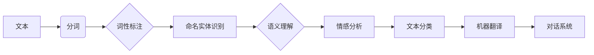

> 关键词：自然语言处理，NLP，文本分析，机器学习，深度学习，语言模型，语义理解，情感分析，文本分类，命名实体识别

# 自然语言处理(Natural Language Processing) - 原理与代码实例讲解

自然语言处理（NLP）是人工智能领域的一个核心分支，旨在使计算机能够理解和处理人类语言。随着深度学习技术的迅猛发展，NLP在语音识别、机器翻译、聊天机器人、推荐系统等领域取得了显著的进展。本文将深入探讨NLP的原理，并通过代码实例讲解如何实现一些常见的NLP任务。

## 1. 背景介绍

自然语言处理的研究始于20世纪50年代，早期主要依靠规则和模式匹配的方法。随着计算机科学和人工智能技术的发展，NLP逐渐转向机器学习和深度学习范式。近年来，NLP领域涌现出许多突破性的技术和应用，极大地推动了人工智能的进步。

### 1.1 问题的由来

人类语言是一种复杂的符号系统，它包含了丰富的语法、语义和上下文信息。NLP的目标是让计算机能够理解和生成人类语言，从而实现人机交互、信息检索、智能问答等应用。

### 1.2 研究现状

目前，NLP研究主要集中在以下几个方面：

- 文本分析：包括分词、词性标注、命名实体识别等任务，旨在将文本分解为可处理的单元。
- 语义理解：通过语义分析，使计算机能够理解文本的深层含义。
- 情感分析：分析文本的情感倾向，如正面、负面或中性。
- 文本分类：将文本分类到预定义的类别中。
- 机器翻译：将一种语言的文本翻译成另一种语言。
- 对话系统：实现人机对话，如聊天机器人。

### 1.3 研究意义

NLP技术的发展对于推动人工智能的应用具有重要意义，它可以：

- 提高信息检索的效率和准确性。
- 增强人机交互的自然性和流畅性。
- 促进跨语言沟通和理解。
- 支持智能决策和知识发现。

### 1.4 本文结构

本文将分为以下几个部分：

- 核心概念与联系
- 核心算法原理 & 具体操作步骤
- 数学模型和公式 & 详细讲解 & 举例说明
- 项目实践：代码实例和详细解释说明
- 实际应用场景
- 工具和资源推荐
- 总结：未来发展趋势与挑战
- 附录：常见问题与解答

## 2. 核心概念与联系

### 2.1 核心概念

- **文本分析**：将文本分解为可处理的单元，如单词、短语、句子等。
- **词性标注**：为每个单词标注其词性，如名词、动词、形容词等。
- **命名实体识别**：识别文本中的命名实体，如人名、地名、组织名等。
- **语义理解**：理解文本的深层含义，包括语义角色标注、句法分析等。
- **情感分析**：分析文本的情感倾向，如正面、负面或中性。
- **文本分类**：将文本分类到预定义的类别中。
- **机器翻译**：将一种语言的文本翻译成另一种语言。
- **对话系统**：实现人机对话，如聊天机器人。

### 2.2 核心概念联系

以下是NLP核心概念之间的Mermaid流程图：



## 3. 核心算法原理 & 具体操作步骤

### 3.1 算法原理概述

NLP算法可以分为以下几类：

- **基于规则的算法**：使用预定义的规则进行文本处理。
- **基于统计的算法**：使用统计方法，如隐马尔可夫模型（HMM）、条件随机场（CRF）等。
- **基于机器学习的算法**：使用机器学习技术，如支持向量机（SVM）、决策树等。
- **基于深度学习的算法**：使用深度学习技术，如循环神经网络（RNN）、卷积神经网络（CNN）、Transformer等。

### 3.2 算法步骤详解

以下是一些常见NLP任务的算法步骤：

#### 3.2.1 文本分析

1. 使用分词器将文本分解为单词或字符。
2. 对每个分词进行词性标注。
3. 识别文本中的命名实体。

#### 3.2.2 语义理解

1. 使用句法分析器分析句子的结构。
2. 使用语义角色标注识别句子中的动作、对象和属性。
3. 使用依存句法分析识别词语之间的依存关系。

#### 3.2.3 情感分析

1. 使用情感词典或机器学习方法对文本进行情感分析。
2. 判断文本的情感倾向为正面、负面或中性。

#### 3.2.4 文本分类

1. 使用词袋模型、TF-IDF等方法对文本进行特征提取。
2. 使用机器学习方法对文本进行分类。

#### 3.2.5 机器翻译

1. 使用源语言的语法和语义信息生成中间表示。
2. 使用目标语言的语法和语义信息翻译中间表示。
3. 生成目标语言的文本。

### 3.3 算法优缺点

- **基于规则的算法**：规则明确，易于理解，但难以处理复杂的情况。
- **基于统计的算法**：可以处理复杂的情况，但需要大量的训练数据。
- **基于机器学习的算法**：可以自动学习特征，但可能需要大量的训练数据和计算资源。
- **基于深度学习的算法**：可以自动学习复杂的特征，但模型难以解释。

### 3.4 算法应用领域

NLP算法在以下领域得到广泛应用：

- 信息检索
- 智能问答
- 机器翻译
- 语音识别
- 聊天机器人
- 自动摘要
- 事件抽取
- 命名实体识别

## 4. 数学模型和公式 & 详细讲解 & 举例说明

### 4.1 数学模型构建

以下是一些NLP中常用的数学模型：

- **词袋模型**：将文本表示为一个向量，其中每个元素表示一个词的出现频率。
- **TF-IDF**：结合词频和逆文档频率，对词的重要性进行评分。
- **隐马尔可夫模型（HMM）**：用于序列标注和语音识别。
- **条件随机场（CRF）**：用于序列标注和文本分类。
- **卷积神经网络（CNN）**：用于文本分类和情感分析。
- **循环神经网络（RNN）**：用于序列建模，如语言模型和机器翻译。

### 4.2 公式推导过程

#### 4.2.1 词袋模型

词袋模型的公式如下：

$$
V = \sum_{w \in W} f_w(x)
$$

其中，$V$ 是文档的向量表示，$W$ 是词汇表，$f_w(x)$ 是词 $w$ 在文档 $x$ 中的频率。

#### 4.2.2 TF-IDF

TF-IDF的公式如下：

$$
tfidf(w, x) = tf(w, x) \times idf(w)
$$

其中，$tf(w, x)$ 是词 $w$ 在文档 $x$ 中的词频，$idf(w)$ 是词 $w$ 在所有文档中的逆文档频率。

### 4.3 案例分析与讲解

以下是一个情感分析任务的案例：

```python
import jieba
from sklearn.feature_extraction.text import TfidfVectorizer
from sklearn.svm import SVC

# 文本数据
texts = ["今天天气真好", "今天天气不好"]

# 分词
words = [word for text in texts for word in jieba.cut(text)]

# 构建词袋模型
vectorizer = TfidfVectorizer()
X = vectorizer.fit_transform(words)

# 创建SVM分类器
clf = SVC()
clf.fit(X, [1, 0])

# 预测
text = jieba.cut("明天天气怎么样")
X_test = vectorizer.transform(text)
result = clf.predict(X_test)

print("预测结果：", result)
```

## 5. 项目实践：代码实例和详细解释说明

### 5.1 开发环境搭建

为了进行NLP项目的实践，需要以下环境：

- Python 3.6+
- Jupyter Notebook或PyCharm等IDE
- Numpy、Pandas、Scikit-learn等库
- 深度学习库，如TensorFlow或PyTorch

### 5.2 源代码详细实现

以下是一个使用TensorFlow实现文本分类的代码实例：

```python
import tensorflow as tf
from tensorflow.keras.preprocessing.text import Tokenizer
from tensorflow.keras.preprocessing.sequence import pad_sequences
from tensorflow.keras.models import Sequential
from tensorflow.keras.layers import Embedding, LSTM, Dense

# 文本数据
texts = ["今天天气真好", "今天天气不好"]
labels = [1, 0]

# 分词
tokenizer = Tokenizer()
tokenizer.fit_on_texts(texts)

# 序列化文本
sequences = tokenizer.texts_to_sequences(texts)

# 序列填充
max_len = 10
X = pad_sequences(sequences, maxlen=max_len)

# 构建模型
model = Sequential()
model.add(Embedding(input_dim=len(tokenizer.word_index)+1, output_dim=128, input_length=max_len))
model.add(LSTM(64))
model.add(Dense(1, activation='sigmoid'))

# 编译模型
model.compile(optimizer='adam', loss='binary_crossentropy', metrics=['accuracy'])

# 训练模型
model.fit(X, labels, epochs=10)

# 预测
text = "明天天气怎么样"
sequence = tokenizer.texts_to_sequences([text])
X_test = pad_sequences(sequence, maxlen=max_len)
result = model.predict(X_test)

print("预测结果：", result)
```

### 5.3 代码解读与分析

- 首先，使用`Tokenizer`对文本进行分词。
- 然后，使用`texts_to_sequences`将分词后的文本转换为序列。
- 接着，使用`pad_sequences`对序列进行填充，使所有序列长度一致。
- 然后，构建一个包含嵌入层、LSTM层和密集层的模型。
- 编译模型，并使用训练数据进行训练。
- 最后，使用训练好的模型对新的文本进行预测。

## 6. 实际应用场景

NLP技术在以下场景中得到广泛应用：

- **信息检索**：使用NLP技术对网页、新闻、文档等进行索引和搜索。
- **智能问答**：使用NLP技术构建智能问答系统，如智能客服。
- **机器翻译**：使用NLP技术将一种语言的文本翻译成另一种语言。
- **语音识别**：使用NLP技术将语音转换为文本。
- **聊天机器人**：使用NLP技术实现人机对话，如智能助手。
- **自动摘要**：使用NLP技术对长文本进行自动摘要。
- **事件抽取**：使用NLP技术从文本中提取事件信息。
- **命名实体识别**：使用NLP技术识别文本中的命名实体，如人名、地名等。

## 7. 工具和资源推荐

### 7.1 学习资源推荐

- 《自然语言处理综论》
- 《深度学习与自然语言处理》
- 《自然语言处理实战》
- TensorFlow官方文档
- PyTorch官方文档

### 7.2 开发工具推荐

- Jupyter Notebook
- PyCharm
- TensorFlow
- PyTorch
- Scikit-learn

### 7.3 相关论文推荐

- Word2Vec: A Vector Space Model for Common Sense
- GloVe: Global Vectors for Word Representation
- BERT: Pre-training of Deep Bidirectional Transformers for Language Understanding
- GPT-3: Language Models are few-shot learners

## 8. 总结：未来发展趋势与挑战

### 8.1 研究成果总结

NLP技术在过去几十年取得了巨大的进步，特别是在深度学习技术的推动下。然而，NLP技术仍然面临着一些挑战，如语言歧义、多语言处理、情感分析等。

### 8.2 未来发展趋势

- **多模态NLP**：将文本、图像、语音等多模态信息融合，以获得更丰富的语义理解。
- **跨语言NLP**：提高模型在不同语言之间的迁移能力。
- **可解释性NLP**：提高模型的可解释性，使模型决策过程更加透明。

### 8.3 面临的挑战

- **数据质量**：NLP模型需要高质量的数据进行训练，但获取高质量数据成本高昂。
- **计算资源**：NLP模型的训练和推理需要大量的计算资源。
- **语言多样性**：不同语言的语法、语义和表达方式存在差异，需要开发具有泛化能力的模型。

### 8.4 研究展望

未来，NLP技术将继续发展，并在更多领域得到应用。同时，NLP技术也将面临新的挑战，需要更多的研究和创新。

## 9. 附录：常见问题与解答

**Q1：NLP技术有哪些应用场景？**

A1：NLP技术有广泛的应用场景，包括信息检索、智能问答、机器翻译、语音识别、聊天机器人、自动摘要、事件抽取、命名实体识别等。

**Q2：如何提高NLP模型的性能？**

A2：提高NLP模型性能的方法包括：

- 使用高质量的数据进行训练。
- 选择合适的模型和算法。
- 调整超参数。
- 使用模型集成。

**Q3：NLP技术有哪些挑战？**

A3：NLP技术面临的挑战包括数据质量、计算资源、语言多样性等。

**Q4：NLP技术有哪些发展趋势？**

A4：NLP技术的发展趋势包括多模态NLP、跨语言NLP、可解释性NLP等。

作者：禅与计算机程序设计艺术 / Zen and the Art of Computer Programming