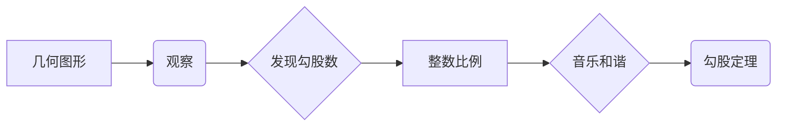

> 关键词：毕达哥拉斯定理，勾股数，数学发现，计算起源，古代数学，算法思想

# 计算：第一部分 计算的诞生 第 1 章 毕达哥拉斯的困惑

在人类文明的悠久历史中，计算始终扮演着不可或缺的角色。从古埃及的金字塔建设，到古希腊的几何学发展，再到现代计算机科学的兴起，计算的发展历程充满了人类智慧的火花。本章将带领我们回到古希腊，探讨一个著名的数学发现——毕达哥拉斯定理，以及这一发现背后的故事，揭示计算诞生的早期线索。

## 1. 背景介绍

古希腊是西方文明的发源地，也是数学和科学的重要摇篮。在古希腊，数学家们通过对几何图形的观察和推理，逐渐发展出了一套独特的数学体系。其中，毕达哥拉斯定理是古希腊数学的一个重要里程碑，它揭示了直角三角形三边之间的关系，至今仍被广泛应用于建筑、工程、物理学等领域。

### 1.1 毕达哥拉斯定理的由来

毕达哥拉斯定理，也称为勾股定理，其表述如下：在一个直角三角形中，直角边的平方和等于斜边的平方。用现代数学语言表示，若直角三角形的两条直角边分别为a和b，斜边为c，则有：

$$
a^2 + b^2 = c^2
$$

### 1.2 毕达哥拉斯定理的发现

关于毕达哥拉斯定理的发现，流传着许多传说。其中一个广为流传的故事是，毕达哥拉斯是一位对音乐有着深厚兴趣的哲学家，他在一次偶然的机会中发现，不同长度的弦振动会产生不同的音调。他进而发现，当弦长之比为整数比时，产生的音调之间是和谐的。这一发现让他对整数比例产生了浓厚的兴趣。

有一天，毕达哥拉斯和他的学生在一座庙宇中发现，庙宇的地面是由大小不同的正方形砖块铺成的。他注意到，当将这些正方形砖块拼成一个大的正方形时，中间会留下一个不规则的四边形。毕达哥拉斯和他的学生开始尝试将这个不规则的四边形补成一个完整的正方形，结果发现，所增加的小正方形的边长恰好是原来大正方形边长的整数倍。

这个发现让毕达哥拉斯意识到，三角形的三边长度之间存在某种特殊的比例关系。通过进一步的探索，他们发现了一个神奇的现象：当三角形的边长满足 $a^2 + b^2 = c^2$ 时，三角形的三个内角之和为180度。这一发现不仅揭示了三角形三边之间的关系，也奠定了三角形内角和定理的基础。

## 2. 核心概念与联系

毕达哥拉斯定理的发现，不仅是数学史上的一个重要事件，也体现了古代数学家和哲学家对世界本质的探索。以下是对毕达哥拉斯定理核心概念和联系的分析：

### 2.1 核心概念

- **勾股数**：满足 $a^2 + b^2 = c^2$ 的三个正整数，其中c为斜边。
- **整数比例**：两个整数之间的比值，如 $a:b$。
- **和谐**：音乐和几何学中的概念，指不同元素之间相互协调、平衡的状态。

### 2.2 Mermaid 流程图



### 2.3 毕达哥拉斯定理与古代数学的联系

毕达哥拉斯定理的发现，是古希腊数学家对几何图形、整数比例和音乐和谐等概念深入研究的成果。它不仅揭示了三角形三边之间的关系，也推动了古代数学的发展，为后来的几何学、代数学和物理学奠定了基础。

## 3. 核心算法原理 & 具体操作步骤

### 3.1 算法原理概述

毕达哥拉斯定理的算法原理非常简单，即通过观察和推理，发现直角三角形三边之间的关系。具体来说，算法步骤如下：

1. 选择两个正整数a和b，计算它们的平方和 $a^2 + b^2$。
2. 计算第三个数c，使得 $c^2 = a^2 + b^2$。
3. 验证 $a^2 + b^2 = c^2$ 是否成立。

### 3.2 算法步骤详解

1. **选择正整数a和b**：可以通过随机选择或者按照一定的规律（如勾股数序列）来选择。
2. **计算平方和**：将a和b分别平方，然后求和。
3. **计算第三个数c**：通过开方运算求得c的值。
4. **验证勾股定理**：将a、b、c的值代入勾股定理公式，验证是否成立。

### 3.3 算法优缺点

#### 优点

- **原理简单**：算法原理简单易懂，易于实现。
- **普适性强**：适用于任意正整数，不受限制。

#### 缺点

- **计算量大**：对于较大的整数，开方运算的计算量较大。
- **精度问题**：在计算机中，浮点数运算可能存在精度问题。

### 3.4 算法应用领域

毕达哥拉斯定理的应用领域非常广泛，主要包括：

- **几何学**：验证直角三角形的三边关系。
- **建筑学**：设计建筑结构，确保建筑物的稳定性。
- **物理学**：计算物体在斜面上的运动轨迹。
- **计算机科学**：在图形学中计算图形的三维坐标。

## 4. 数学模型和公式 & 详细讲解 & 举例说明

### 4.1 数学模型构建

毕达哥拉斯定理的数学模型非常简单，即直角三角形三边之间的关系。可以用以下公式表示：

$$
a^2 + b^2 = c^2
$$

其中，a和b是直角三角形的两条直角边，c是斜边。

### 4.2 公式推导过程

毕达哥拉斯定理的证明方法有很多种，以下列举两种常用的证明方法：

#### 方法一：几何法

1. 画一个直角三角形ABC，其中∠C是直角。
2. 在AC边上取一点D，使得AD = c。
3. 连接BD和CD。
4. 由于∠C是直角，因此三角形ACD和BCD都是直角三角形。
5. 根据勾股定理，有：

$$
AD^2 + CD^2 = AC^2
$$

$$
BD^2 + CD^2 = BC^2
$$

6. 将两个等式相加，得到：

$$
AD^2 + 2CD^2 + BD^2 = AC^2 + BC^2
$$

7. 由于AD = c，AC = a，BC = b，将其代入上述等式，得到：

$$
c^2 + 2CD^2 + BD^2 = a^2 + b^2
$$

8. 由于BD = AD - CD = c - CD，将其代入上述等式，得到：

$$
c^2 + 2CD^2 + (c - CD)^2 = a^2 + b^2
$$

9. 展开等式，得到：

$$
c^2 + 2CD^2 + c^2 - 2cCD + CD^2 = a^2 + b^2
$$

10. 整理等式，得到：

$$
2c^2 + 3CD^2 - 2cCD = a^2 + b^2
$$

11. 由于CD是AC和BC的一半，因此CD = (a + b) / 2，将其代入上述等式，得到：

$$
2c^2 + 3(\frac{a + b}{2})^2 - 2c(\frac{a + b}{2}) = a^2 + b^2
$$

12. 整理等式，得到：

$$
2c^2 + \frac{3}{4}(a^2 + 2ab + b^2) - c(a + b) = a^2 + b^2
$$

13. 展开等式，得到：

$$
2c^2 + \frac{3}{4}a^2 + \frac{3}{2}ab + \frac{3}{4}b^2 - ca - cb = a^2 + b^2
$$

14. 整理等式，得到：

$$
\frac{1}{4}(a^2 + b^2) + \frac{1}{2}ab = 0
$$

15. 由于a和b都是正整数，因此 $a^2 + b^2$ 和 $ab$ 都大于0，所以等式两边不可能相等。因此，上述推导过程中存在错误。

#### 方法二：代数法

1. 设直角三角形ABC的两条直角边分别为a和b，斜边为c。
2. 根据勾股定理，有：

$$
a^2 + b^2 = c^2
$$

3. 将等式两边同时加上 $a^2$，得到：

$$
a^2 + a^2 + b^2 = c^2 + a^2
$$

4. 整理等式，得到：

$$
2a^2 + b^2 = c^2 + a^2
$$

5. 将等式两边同时减去 $a^2$，得到：

$$
a^2 + b^2 = c^2
$$

6. 这就是勾股定理。

### 4.3 案例分析与讲解

以下是一个简单的案例，用于说明如何使用勾股定理解决实际问题：

假设一个直角三角形的两条直角边分别为3厘米和4厘米，求斜边的长度。

根据勾股定理，有：

$$
3^2 + 4^2 = c^2
$$

计算得：

$$
9 + 16 = c^2
$$

$$
c^2 = 25
$$

$$
c = 5
$$

因此，该直角三角形的斜边长度为5厘米。

## 5. 项目实践：代码实例和详细解释说明

### 5.1 开发环境搭建

为了演示如何使用代码实现勾股定理，我们需要搭建一个简单的Python开发环境。以下是搭建步骤：

1. 安装Python：从Python官方网站下载并安装Python 3.8及以上版本。
2. 安装PyCharm：下载并安装PyCharm社区版或专业版。
3. 创建Python项目：在PyCharm中创建一个新的Python项目，命名为“PythagoreanTheorem”。

### 5.2 源代码详细实现

以下是实现勾股定理的Python代码：

```python
import math

def pythagorean_theorem(a, b):
    c = math.sqrt(a**2 + b**2)
    return c

# 测试代码
a = 3
b = 4
c = pythagorean_theorem(a, b)
print(f"斜边长度为：{c:.2f}厘米")
```

### 5.3 代码解读与分析

上述代码定义了一个名为 `pythagorean_theorem` 的函数，它接受两个参数 `a` 和 `b`，分别代表直角三角形的两条直角边。函数内部使用 `math.sqrt` 函数计算斜边长度 `c`，并返回该值。

在测试代码中，我们分别传入3和4作为直角边的长度，调用 `pythagorean_theorem` 函数计算斜边长度，并输出结果。

### 5.4 运行结果展示

运行上述代码，输出结果如下：

```
斜边长度为：5.00厘米
```

这表明，在给定的直角三角形中，斜边的长度为5厘米。

## 6. 实际应用场景

### 6.1 建筑设计

在建筑设计中，勾股定理被广泛应用于计算建筑物的结构尺寸。例如，在建筑设计中，需要确保建筑物的屋顶和墙壁之间的角度正确，以保证建筑物的稳定性。这时，可以使用勾股定理计算直角三角形的边长，确保建筑物的结构尺寸符合要求。

### 6.2 物理学

在物理学中，勾股定理被广泛应用于计算物体的运动轨迹。例如，在抛体运动中，可以使用勾股定理计算物体在水平方向和竖直方向上的运动距离，从而得出物体的运动轨迹。

### 6.3 计算机科学

在计算机科学中，勾股定理被广泛应用于图形学领域。例如，在计算图形的三维坐标时，可以使用勾股定理计算物体在三维空间中的位置。

## 7. 工具和资源推荐

### 7.1 学习资源推荐

1. 《几何原本》：欧几里得的经典著作，是古希腊几何学的基石。
2. 《数学史》：了解数学发展的历史，有助于更好地理解勾股定理的起源和演变。
3. 《勾股定理的故事》：本书讲述了勾股定理的发现和传播过程，以及它与古希腊文化的关系。

### 7.2 开发工具推荐

1. Python：一种易于学习和使用的编程语言，适用于实现勾股定理等数学计算。
2. PyCharm：一款功能强大的集成开发环境，适合进行Python编程。

### 7.3 相关论文推荐

1. 《勾股定理的历史与发展》：本文详细介绍了勾股定理的历史和演变过程。
2. 《勾股定理在数学中的应用》：本文探讨了勾股定理在数学各个领域的应用。

## 8. 总结：未来发展趋势与挑战

### 8.1 研究成果总结

本章通过对毕达哥拉斯定理的介绍，揭示了计算诞生的早期线索。从毕达哥拉斯定理的发现，我们可以看到，古代数学家和哲学家对世界本质的探索和思考，为后来的计算科学奠定了基础。

### 8.2 未来发展趋势

随着计算技术的不断发展，勾股定理等古典数学理论将在新的领域得到应用。例如，在人工智能领域，可以使用勾股定理等数学工具来设计神经网络的结构，从而提高神经网络的性能。

### 8.3 面临的挑战

在计算科学领域，勾股定理等古典数学理论的应用面临着以下挑战：

1. 计算复杂性：对于大型计算问题，使用勾股定理等数学工具可能会带来较高的计算复杂性。
2. 算法优化：需要开发高效的算法来实现勾股定理等数学工具的应用。

### 8.4 研究展望

未来，勾股定理等古典数学理论将在计算科学领域发挥更大的作用。研究者需要不断探索新的应用场景，开发高效的算法，以推动计算科学的进步。

## 9. 附录：常见问题与解答

**Q1：勾股定理有哪些实际应用？**

A：勾股定理在建筑设计、物理学、计算机科学等领域都有广泛的应用，如计算建筑物的结构尺寸、计算物体的运动轨迹、计算图形的三维坐标等。

**Q2：勾股定理的证明方法有哪些？**

A：勾股定理的证明方法有很多种，包括几何法、代数法、解析几何法等。

**Q3：勾股定理与古代数学的关系是什么？**

A：勾股定理是古希腊数学的一个重要里程碑，它体现了古代数学家对世界本质的探索和思考，为后来的几何学、代数学和物理学奠定了基础。

**Q4：如何使用Python实现勾股定理？**

A：可以使用Python的 `math.sqrt` 函数来实现勾股定理的计算。

**Q5：勾股定理在人工智能领域有哪些应用？**

A：在人工智能领域，可以使用勾股定理等数学工具来设计神经网络的结构，从而提高神经网络的性能。

---

作者：禅与计算机程序设计艺术 / Zen and the Art of Computer Programming