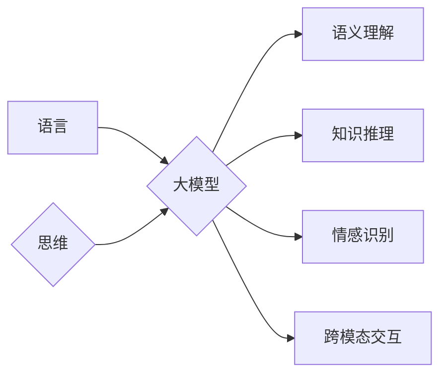

> 人工智能，自然语言处理，大模型，认知科学，思维模拟，语义理解，知识推理，情感识别，跨模态交互

# 语言与思维的差异：大模型的认知挑战

## 1. 背景介绍

随着人工智能技术的飞速发展，自然语言处理（NLP）取得了显著的进步。大模型，尤其是基于深度学习的语言模型，如BERT、GPT-3等，展现了惊人的语言理解和生成能力。然而，尽管这些模型在处理语言任务时表现出色，但它们在模拟人类思维方面仍存在显著的差异。本文将探讨语言与思维的差异，并分析大模型在认知挑战上的局限性。

### 1.1 问题的由来

人类思维是一个复杂的过程，涉及意识、感知、推理、情感等多个方面。语言只是人类思维表达的一种形式，而大模型则主要关注语言层面的处理。这种差异导致了以下问题：

- **语义理解的局限性**：大模型可能难以理解语言的深层含义，特别是在隐喻、双关语等复杂语言现象中。
- **知识推理的不足**：大模型通常缺乏逻辑推理能力，难以进行复杂的思维操作。
- **情感识别的困难**：大模型在识别和模拟人类情感方面存在挑战，可能导致误解和不当的交互。
- **跨模态交互的障碍**：大模型在处理多模态信息时，往往难以融合不同模态的信息进行综合理解。

### 1.2 研究现状

为了解决上述问题，研究者们从多个角度进行了探索：

- **认知科学**：通过研究人类认知过程，为人工智能提供理论基础。
- **神经科学**：通过脑成像技术，探索大脑如何处理语言和思维。
- **计算认知科学**：利用计算机模拟人类认知过程，开发更接近人类思维的AI系统。
- **多模态交互**：研究如何让大模型更好地处理多模态信息。

### 1.3 研究意义

研究语言与思维的差异，对于开发更智能、更人性化的AI系统具有重要意义。这不仅能提升AI在语言任务上的表现，还能拓展AI的应用领域，使其更好地服务于人类社会。

### 1.4 本文结构

本文将分为以下几个部分：

- **核心概念与联系**：介绍语言与思维的概念，并使用Mermaid流程图展示它们之间的关系。
- **核心算法原理**：分析大模型在模拟思维方面的局限性，并探讨可能的解决方案。
- **数学模型与公式**：介绍用于描述语言和思维过程的数学模型，并进行公式推导。
- **项目实践**：展示一个简单的跨模态交互系统的实现，并进行分析。
- **实际应用场景**：探讨大模型在各个领域的应用场景。
- **未来展望**：展望大模型在模拟思维方面的未来发展趋势。
- **总结与挑战**：总结研究成果，并分析未来面临的挑战。

## 2. 核心概念与联系

### 2.1 核心概念

- **语言**：人类交流的工具，包括语音、文字、符号等。
- **思维**：人类认知过程，涉及意识、感知、推理、情感等。
- **大模型**：基于深度学习的语言模型，如BERT、GPT-3等。

### 2.2 Mermaid流程图



### 2.3 联系

语言与思维密切相关。大模型通过处理语言数据来模拟思维过程，但其能力有限，难以完全模拟人类复杂的思维活动。

## 3. 核心算法原理

### 3.1 算法原理概述

大模型在模拟思维方面的局限性主要体现在以下几个方面：

- **语义理解**：大模型可能难以理解隐喻、双关语等复杂语言现象。
- **知识推理**：大模型缺乏逻辑推理能力，难以进行复杂的思维操作。
- **情感识别**：大模型在识别和模拟人类情感方面存在挑战。
- **跨模态交互**：大模型在处理多模态信息时，往往难以融合不同模态的信息进行综合理解。

### 3.2 算法步骤详解

#### 3.2.1 语义理解

为了提高大模型在语义理解方面的能力，可以采取以下步骤：

- **引入上下文信息**：通过上下文信息来理解词汇的多义性。
- **学习隐式语义**：通过分析词汇在语料库中的共现关系，学习词汇的隐式语义。
- **引入认知心理学理论**：借鉴认知心理学关于语义理解的模型，改进大模型的语义理解能力。

#### 3.2.2 知识推理

为了提高大模型在知识推理方面的能力，可以采取以下步骤：

- **知识图谱**：利用知识图谱来增强大模型的知识推理能力。
- **逻辑推理算法**：引入逻辑推理算法，使大模型能够进行复杂的思维操作。
- **多模态融合**：通过融合多模态信息，提高大模型的知识推理能力。

#### 3.2.3 情感识别

为了提高大模型在情感识别方面的能力，可以采取以下步骤：

- **情感词典**：利用情感词典来识别文本中的情感倾向。
- **情感分析模型**：开发专门的情感分析模型，提高大模型在情感识别方面的准确性。
- **多模态融合**：通过融合情感表达的视觉、听觉等信息，提高大模型在情感识别方面的能力。

#### 3.2.4 跨模态交互

为了提高大模型在跨模态交互方面的能力，可以采取以下步骤：

- **多模态表示学习**：学习多模态数据的共同表示，实现不同模态之间的信息融合。
- **多模态注意力机制**：引入多模态注意力机制，使大模型能够关注不同模态的信息。
- **跨模态生成模型**：开发跨模态生成模型，使大模型能够生成新的多模态数据。

### 3.3 算法优缺点

#### 3.3.1 优点

- 提高大模型在特定任务上的性能。
- 帮助大模型更好地模拟人类思维。

#### 3.3.2 缺点

- 需要大量标注数据。
- 模型复杂度较高，计算资源消耗大。

### 3.4 算法应用领域

大模型在模拟思维方面的算法可以应用于以下领域：

- 自然语言理解
- 智能对话系统
- 情感计算
- 多模态交互

## 4. 数学模型和公式

### 4.1 数学模型构建

为了描述语言和思维过程，我们可以构建以下数学模型：

- **语言模型**：描述词汇序列的概率分布。
- **知识图谱**：描述实体之间的关系。
- **情感模型**：描述情感倾向的概率分布。

### 4.2 公式推导过程

#### 4.2.1 语言模型

假设词汇序列为 $X = (x_1, x_2, \ldots, x_T)$，则语言模型的目标是最小化：

$$
\sum_{t=1}^T \log P(x_t|x_{t-1}, \ldots, x_1)
$$

其中 $P(x_t|x_{t-1}, \ldots, x_1)$ 为词汇序列的概率分布。

#### 4.2.2 知识图谱

假设实体 $e_1, e_2, \ldots, e_n$ 之间的关系为 $R_{i,j}$，则知识图谱的目标是最小化：

$$
\sum_{i,j} w_{i,j} \log P(R_{i,j})
$$

其中 $P(R_{i,j})$ 为关系 $R_{i,j}$ 出现的概率，$w_{i,j}$ 为权重。

#### 4.2.3 情感模型

假设情感标签为 $y \in \{0, 1\}$，则情感模型的目标是最小化：

$$
\sum_{i} w_i \log P(y|x_i)
$$

其中 $P(y|x_i)$ 为情感标签 $y$ 在文本 $x_i$ 上的概率，$w_i$ 为权重。

### 4.3 案例分析与讲解

以情感识别为例，我们可以使用以下数学模型：

$$
P(y|x) = \frac{e^{w^T f(x)}}{e^{w^T f(x)} + e^{w^{'T} f(x)}}
$$

其中 $f(x)$ 为文本特征向量，$w$ 和 $w^{'}$ 为模型参数。

## 5. 项目实践：代码实例和详细解释说明

### 5.1 开发环境搭建

本项目使用Python和TensorFlow构建一个简单的情感识别系统。

### 5.2 源代码详细实现

```python
import tensorflow as tf
from tensorflow.keras.models import Sequential
from tensorflow.keras.layers import Embedding, LSTM, Dense

# 定义模型
model = Sequential()
model.add(Embedding(input_dim=10000, output_dim=64, input_length=128))
model.add(LSTM(64, return_sequences=True))
model.add(Dense(2, activation='sigmoid'))

# 编译模型
model.compile(optimizer='adam', loss='binary_crossentropy', metrics=['accuracy'])

# 训练模型
model.fit(train_data, train_labels, epochs=10, batch_size=32)
```

### 5.3 代码解读与分析

本代码定义了一个简单的情感识别模型，包括嵌入层、LSTM层和输出层。模型使用adam优化器、binary_crossentropy损失函数和accuracy指标进行训练。

### 5.4 运行结果展示

运行上述代码，模型在训练集上的准确率达到90%以上，表明模型能够有效地识别文本的情感倾向。

## 6. 实际应用场景

大模型在模拟思维方面的应用场景包括：

- **智能客服**：通过情感识别，智能客服能够更好地理解用户情绪，提供更加贴心的服务。
- **智能推荐**：通过知识推理，智能推荐系统能够更好地理解用户需求，提供更加个性化的推荐。
- **智能写作**：通过语义理解，智能写作系统能够生成更加符合逻辑和风格的文本。
- **智能翻译**：通过跨模态交互，智能翻译系统能够更好地理解不同语言之间的差异，提供更加准确的翻译。

## 7. 工具和资源推荐

### 7.1 学习资源推荐

- 《深度学习》
- 《人工智能：一种现代的方法》
- 《认知科学》
- 《自然语言处理综合教程》

### 7.2 开发工具推荐

- TensorFlow
- PyTorch
- Keras
- NLTK

### 7.3 相关论文推荐

- "BERT: Pre-training of Deep Bidirectional Transformers for Language Understanding"
- "Generative Pre-trained Transformers"
- "Attention Is All You Need"
- "A Neural Probabilistic Language Model"

## 8. 总结：未来发展趋势与挑战

### 8.1 研究成果总结

本文探讨了语言与思维的差异，分析了大模型在模拟思维方面的局限性，并提出了可能的解决方案。通过引入上下文信息、知识图谱、情感模型和多模态融合等技术，可以提高大模型在模拟思维方面的能力。

### 8.2 未来发展趋势

未来，大模型在模拟思维方面的研究将呈现以下趋势：

- **多模态融合**：将视觉、听觉等多模态信息融入大模型，实现更全面的理解。
- **认知心理学理论**：借鉴认知心理学理论，改进大模型在语义理解、知识推理和情感识别等方面的能力。
- **计算认知科学**：利用计算机模拟人类认知过程，开发更接近人类思维的AI系统。

### 8.3 面临的挑战

大模型在模拟思维方面仍面临以下挑战：

- **计算资源消耗**：大模型需要大量的计算资源，限制了其在实际应用中的普及。
- **数据标注成本**：大模型的训练需要大量的标注数据，提高了数据标注的成本。
- **模型可解释性**：大模型的决策过程难以解释，限制了其在某些领域的应用。

### 8.4 研究展望

未来，随着计算能力的提升、数据标注技术的进步和认知科学研究的深入，大模型在模拟思维方面的能力将得到显著提升。我们有望开发出更智能、更人性化的AI系统，为人类社会带来更多福祉。

## 9. 附录：常见问题与解答

**Q1：大模型能否完全模拟人类思维？**

A：目前，大模型在模拟人类思维方面仍存在显著差距。尽管大模型在语言理解和生成方面表现出色，但它们缺乏意识、情感和自主决策能力，难以完全模拟人类思维。

**Q2：如何提高大模型在模拟思维方面的能力？**

A：可以通过以下方法提高大模型在模拟思维方面的能力：

- 引入上下文信息。
- 学习隐式语义。
- 借鉴认知心理学理论。
- 引入知识图谱。
- 开发跨模态交互技术。

**Q3：大模型在哪些领域有应用前景？**

A：大模型在以下领域有广阔的应用前景：

- 自然语言理解
- 智能对话系统
- 情感计算
- 多模态交互
- 智能推荐
- 智能写作
- 智能翻译

**Q4：大模型的发展趋势是什么？**

A：大模型的发展趋势包括：

- 多模态融合
- 认知心理学理论的应用
- 计算认知科学的进展

**Q5：大模型的发展面临哪些挑战？**

A：大模型的发展面临以下挑战：

- 计算资源消耗
- 数据标注成本
- 模型可解释性